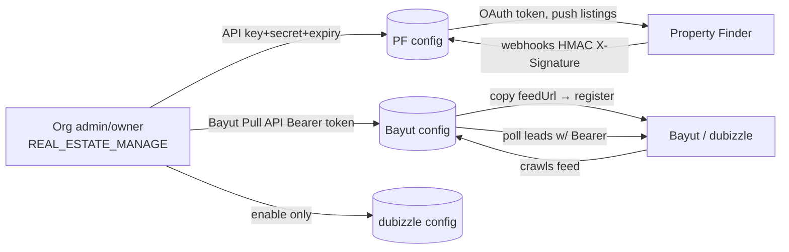

This document provides a comprehensive reference for how canonical `Listing` fields map across different real estate portals (Bayut/dubizzle and Property Finder), including field naming differences, value transformations, and portal-specific authentication requirements.

<Note>
This is the cross-portal divergence and frontend visibility companion to the full portal syndication specification. The same logical field (e.g., "furnished", "bedrooms", "purpose") often has different names AND different value spaces between portals.
</Note>

## Authentication & Portal Configuration

None of the real estate portals use interactive OAuth "Connect with..." redirects. All three use **manual credential/URL exchange**, configured per-organization by admins with `REAL_ESTATE_MANAGE` permissions.

### Portal Authentication Overview

<Tabs>
  <Tab title="Property Finder">
    **Direction:** Push + Webhooks
    - **Admin provides:** API Key + API Secret + expiry (from PF Expert)
    - **PropWise generates:** `webhookSecret`
    - **Transport:** OAuth2 client-credentials → 30-min Bearer JWT
  </Tab>
  <Tab title="Bayut">
    **Direction:** Feed pull + Lead poll
    - **Admin provides:** Bayut Pull API Bearer token (inbound leads)
    - **PropWise generates:** `feedSecret` + per-org `feedUrl` (outbound listings)
    - **Transport:** Org registers PropWise's feed URL; PropWise polls leads with Bearer token
  </Tab>
  <Tab title="dubizzle">
    **Direction:** Shares Bayut infrastructure
    - **Admin provides:** Nothing new (piggybacks Bayut)
    - **PropWise generates:** Reuses unified feed
    - **Transport:** Shares Bayut feed + Bayut lead token
  </Tab>
</Tabs>

### Authentication Flow Diagram



### Configuration Management

<Steps>
  <Step title="Portal Configuration Setup">
    One `PortalConfiguration` row per `(organization, portal)` with unique constraints
    - API credentials encrypted at rest (AES-256-GCM)
    - PropWise-generated secrets minted once and never regenerated
  </Step>
  <Step title="Available Endpoints">
    - `GET /portal-syndication/config` - List configurations (credentials never returned)
    - `POST /portal-syndication/config` - Upsert portal configuration
    - `PATCH /portal-syndication/config/:portal/toggle` - Enable/disable portal
  </Step>
</Steps>

<Warning>
API credentials are encrypted at rest and never returned in responses or logs. Only status flags like `hasApiKey`, `hasWebhookSecret`, and `hasFeedSecret` are exposed.
</Warning>

### Property Finder OAuth2 Setup

<Steps>
  <Step title="Generate Credentials in PF Expert">
    - Open **Developer Resources → API Credentials**
    - Generate key of type **API Integration**
    - Set expiry (max 365 days)
    - Enable optional scopes: `listings:full_access`, `leads:read`, `credits:read`
  </Step>
  <Step title="Configure in PropWise">
    Admin pastes API Key + API Secret + expiry into `POST /config` with `portal=property_finder`
  </Step>
  <Step title="Runtime Token Exchange">
    PropWise exchanges key+secret at `POST /v1/auth/token` for 30-minute Bearer JWT
  </Step>
  <Step title="Webhook Subscription">
    Auto-generates `webhookSecret` and subscribes to PF webhooks with HMAC verification
  </Step>
</Steps>

### Feed URL Architecture

Each organization gets its own feed URL for Bayut/dubizzle (pull model):

```
GET /portal-syndication/feeds/{orgId}?token={hmac}
```

<Info>
The feed is unified - one endpoint returns ALL live listings for the organization, with `<Portals>` tags determining visibility per portal based on enabled `ListingPortalSync` rows.
</Info>

## Field Mapping Reference

### Core Mapping Helpers

The system provides centralized mapping helpers in `src/modules/shared/portal-value-map.ts`:

<CodeGroup>
```typescript Purpose Mapping
purposeToBayut(p)        // SALE→'Buy',  RENT→'Rent'
purposeToPfPriceType(p, rentalPeriod)  // SALE→'sale', RENT→'yearly'|'monthly'|'weekly'|'daily'
```

```typescript Property Features
furnishedToBayut(f)      // FURNISHED→'Yes', UNFURNISHED→'No', PARTLY_FURNISHED→'Partly'
furnishedToPf(f)         // FURNISHED→'furnished', UNFURNISHED→'unfurnished', PARTLY_FURNISHED→'semi-furnished'
```

```typescript Room Counts
bedroomsToBayut(n)       // 0→'-1', 1..10→'1'..'10', >10→'10+', null→omit
bedroomsToPf(n)          // 0→'studio', 1..30→'1'..'30' (cap 30)
bathroomsToBayut(n)      // 1..10, >10→'10', null→omit
bathroomsToPf(n, type)   // land/farm→'none', else '1'..'20' (cap 20)
```
</CodeGroup>

### Field Name Divergence Matrix

The following table shows how the same logical data maps to different field names across portals:

| Canonical Field | Bayut XML Tag | Property Finder JSON Field | Notes |
|---|---|---|---|
| `id` (+ org code) | `<Property_Ref_No>` | `reference` | Format: `UNIT-{orgShortCode}-{listing.id}` |
| `permitNumber` | `<Permit_Number>` | `compliance.listingAdvertisementNumber` | PF may be composite |
| `purpose` | `<Property_purpose>` | `price.type` | **Value mapping differs significantly** |
| `propertyType` | `<Property_Type>` | `type` | Different value vocabularies |
| `price` | `<Price>` | `price.amounts.{sale\|yearly\|monthly\|weekly\|daily}` | PF splits by price type |
| `rentalPeriod` | `<Rent_Frequency>` | Folded into `price.type` | Bayut separate, PF integrated |
| `bedrooms` | `<Bedrooms>` | `features.bedrooms` | Different zero-handling |
| `bathrooms` | `<Bathrooms>` | `features.bathrooms` | Different caps and null handling |
| `furnished` | `<Furnished>` | `features.furnished` | Different value vocabularies |
| `builtUpArea` | `<Size>` | `areas.builtUp.value` | Bayut single field, PF structured |
| `plotArea` | `<Plot_Area>` | `areas.plot.value` | — |
| `title` | `<Title_EN>` / `<Title_AR>` | `title.en` / `title.ar` | — |
| `description` | `<Description_EN>` / `<Description_AR>` | `description.en` / `description.ar` | — |

### Value Transformation Examples

<Tabs>
  <Tab title="Purpose Field">
    **Bayut:** Simple buy/rent distinction
    - `SALE` → `"Buy"`
    - `RENT` → `"Rent"`
    
    **Property Finder:** Integrated with rental frequency
    - `SALE` → `price.type: "sale"`
    - `RENT` + `YEARLY` → `price.type: "yearly"`
    - `RENT` + `MONTHLY` → `price.type: "monthly"`
  </Tab>
  
  <Tab title="Bedrooms">
    **Bayut:** String with special cases
    - `0` → `"-1"` (studio)
    - `1-10` → `"1"` to `"10"`
    - `>10` → `"10+"`
    
    **Property Finder:** Studio handling
    - `0` → `"studio"`
    - `1-30` → `"1"` to `"30"` (capped at 30)
  </Tab>
  
  <Tab title="Furnished Status">
    **Bayut:** Yes/No/Partly
    - `FURNISHED` → `"Yes"`
    - `UNFURNISHED` → `"No"`
    - `PARTLY_FURNISHED` → `"Partly"`
    
    **Property Finder:** Kebab-case variants
    - `FURNISHED` → `"furnished"`
    - `UNFURNISHED` → `"unfurnished"`
    - `PARTLY_FURNISHED` → `"semi-furnished"`
  </Tab>
</Tabs>

## Portal-Specific Fields

### Property Finder Only

<AccordionGroup>
  <Accordion title="Compliance Fields">
    - `compliance.issuingClientLicenseNumber` - Organization license
    - `compliance.listingAdvertisementNumber` - May be composite format
    - Emirate-based compliance mapping:
      - Dubai → `'rera'` or `'dtcm'`
      - Abu Dhabi → `'adrec'`  
      - Northern Emirates → omitted
  </Accordion>
  
  <Accordion title="Finishing Status">
    - `features.finishing` - Property completion status
    - Maps from canonical finishing field
    - Values: `'fully-finished'`, `'semi-finished'`, `'unfurnished-unit'`
    - No Bayut equivalent
  </Accordion>
</AccordionGroup>

### Bayut/dubizzle Only

<AccordionGroup>
  <Accordion title="XML Structure Requirements">
    - `<Portals>` tag determines dubizzle vs Bayut visibility
    - `<Last_Modified>` timestamp required
    - `<Property_Status>` for active/deleted states
    - Separate `<Title_EN>` and `<Title_AR>` tags required
  </Accordion>
</AccordionGroup>

## Frontend Integration Guidelines

### Portal-Specific Field Visibility

Use the portal configuration status to show/hide form fields:

<CodeGroup>
```typescript React Example
const { data: portalConfigs } = usePortalConfigs();

const isPfEnabled = portalConfigs?.some(c => 
  c.portal === 'property_finder' && c.isEnabled
);

const isBayutEnabled = portalConfigs?.some(c => 
  c.portal === 'bayut' && c.isEnabled
);

return (
  <div>
    {/* Always show core fields */}
    <PurposeField />
    <PropertyTypeField />
    
    {/* PF-specific fields */}
    {isPfEnabled && (
      <FinishingField />
    )}
    
    {/* Show compliance if any portal enabled */}
    {(isPfEnabled || isBayutEnabled) && (
      <PermitNumberField />
    )}
  </div>
);
```

```typescript Validation
// Use centralized validation that understands portal differences
import { validateListingForPortals } from '@/lib/portal-validation';

const validation = validateListingForPortals(listing, enabledPortals);
if (!validation.isValid) {
  // Show portal-specific validation errors
  validation.errors.forEach(error => {
    console.log(`${error.portal}: ${error.field} - ${error.message}`);
  });
}
```
</CodeGroup>

### Value Transformation in Forms

<Tip>
Use the centralized mapping functions for consistent value transformation across the application. This ensures the same logic used by the syndication adapters is applied in the frontend.
</Tip>

<Check>
**Best Practice:** Always validate field values against portal requirements before saving. The `PortalValidationService` provides comprehensive validation that matches the syndication requirements.
</Check>

## Implementation Status

| Component | Status | Phase |
|---|---|---|
| `PortalConfiguration` model | ✅ Complete | Phase 1 |
| Credential encryption | ✅ Complete | Phase 1 |
| Config endpoints | ✅ Complete | Phase 1 |
| Value mapping helpers | ✅ Complete | Current |
| PF token exchange | 🟡 Planned | Phase B |
| Webhook subscription | 🟡 Planned | Phase 3 |
| Public feed controller | 🟡 Planned | Phase B |
| Bayut lead poller | 🟡 Planned | Phase 4 |

<Warning>
The `pf/agent-mappings/refresh` endpoint currently returns `501 Not Implemented` as PF integration is in development.
</Warning>

## Open Items

<CardGroup cols={2}>
  <Card title="Feed Architecture" icon="rss">
    **Two `feedSecret`s for unified feed** - Current implementation generates separate secrets for Bayut and dubizzle configs despite using a single unified feed
  </Card>
  <Card title="Deletion Handling" icon="trash">
    **Deleted listing retention** - Feed must include recently-removed listings as `deleted` status for at least one crawl cycle
  </Card>
  <Card title="Performance" icon="gauge">
    **Cache vs live generation** - Decision needed between Redis caching vs live feed generation
  </Card>
  <Card title="Token Rotation" icon="key">
    **API key expiration** - Daily cron job monitors expiration and provides rotation warnings
  </Card>
</CardGroup>