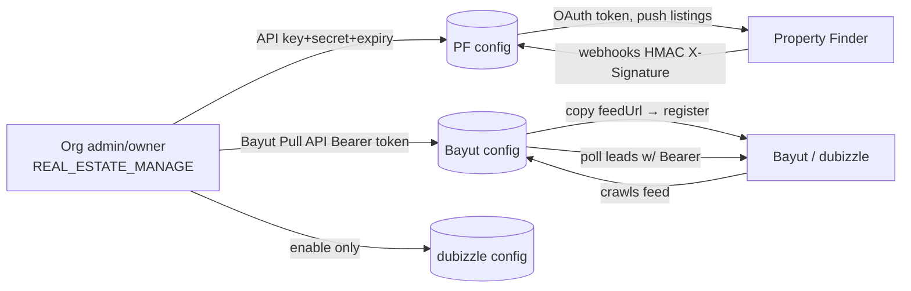

This document provides a comprehensive side-by-side reference for mapping canonical `Listing` fields to both Bayut/dubizzle and Property Finder portals, highlighting field name differences, value divergences, and portal-specific requirements.

<Note>
**Purpose:** This matrix serves as the definitive cross-portal mapping reference for frontend visibility and adapter implementations. It complements the per-portal payload specifications in the main syndication documentation.
</Note>

## Authentication & Account Linking

None of the three portals use interactive OAuth redirects. All require manual credential exchange configured per-organization by admins with `REAL_ESTATE_MANAGE` permissions.

<Tabs>
  <Tab title="Property Finder">
    **Direction:** Push + webhooks  
    **Admin provides:** API Key + API Secret + expiry (from PF Expert)  
    **PropWise generates:** `webhookSecret`  
    **Transport auth:** OAuth2 client-credentials → 30-min Bearer JWT
  </Tab>
  <Tab title="Bayut">
    **Direction:** Feed pull + lead poll  
    **Admin provides:** Bayut Pull API Bearer token  
    **PropWise generates:** `feedSecret` + per-org `feedUrl`  
    **Transport auth:** Org registers feed URL; PropWise polls leads with Bearer token
  </Tab>
  <Tab title="dubizzle">
    **Direction:** Shares Bayut infrastructure  
    **Admin provides:** Enable-only (piggybacks Bayut)  
    **PropWise generates:** Reuses unified feed  
    **Transport auth:** Shares Bayut feed + lead token
  </Tab>
</Tabs>

### Authentication Flow



<Steps>
  <Step title="Configure credentials">
    Store encrypted API credentials per organization using `PortalConfiguration` model
  </Step>
  <Step title="Generate secrets">
    PropWise creates portal-specific secrets (`webhookSecret`, `feedSecret`) on first setup
  </Step>
  <Step title="Establish connections">
    Each portal uses its specific authentication method to establish data flow
  </Step>
  <Step title="Monitor expiration">
    Daily cron job checks for API key expiration and sends warnings
  </Step>
</Steps>

### Common Model Structure

- One `PortalConfiguration` row per `(organization, portal)` with unique constraint
- API credentials encrypted at rest using AES-256-GCM via `EncryptionService`
- PropWise-generated secrets minted once and never regenerated to avoid breaking live subscriptions

<CodeGroup>
```typescript Endpoints
// List configurations (credentials never returned)
GET /portal-syndication/config

// Upsert configuration
POST /portal-syndication/config
{
  "portal": "property_finder",
  "apiKey": "...",
  "apiSecret": "...",
  "apiKeyExpiresAt": "2024-12-31T23:59:59Z",
  "isEnabled": true
}

// Toggle enable/disable
PATCH /portal-syndication/config/:portal/toggle
```

```typescript Response Format
{
  "portal": "property_finder",
  "hasApiKey": true,
  "hasWebhookSecret": true,
  "hasFeedSecret": false,
  "isEnabled": true,
  "apiKeyExpiresAt": "2024-12-31T23:59:59Z"
}
```
</CodeGroup>

### Property Finder OAuth2 Setup

<Steps>
  <Step title="Generate PF credentials">
    Admin opens **Developer Resources → API Credentials** in PF Expert, creates **API Integration** type key with required scopes
  </Step>
  <Step title="Configure in PropWise">
    Paste API Key + Secret + expiry into `POST /config` with `portal=property_finder`
  </Step>
  <Step title="Runtime token exchange">
    `PfTokenService` exchanges credentials for 30-minute Bearer JWT at `/v1/auth/token`
  </Step>
  <Step title="Webhook subscription">
    PropWise auto-generates `webhookSecret` and subscribes to PF webhooks with HMAC verification
  </Step>
</Steps>

<Warning>
**Required PF Scopes:** Enable `listings:full_access`, `leads:read`, `credits:read` as optional scopes. Default scopes (`webhooks:full_access`, `compliances:read`, `locations:read`, `projects:read`, `listing_verification:full_access`) are always enabled.
</Warning>

### Bayut/dubizzle Feed Architecture

Each organization receives a unique feed URL for Bayut/dubizzle's pull model:

```
GET /portal-syndication/feeds/{orgId}?token={hmac}
```

<Info>
**Unified Feed:** One endpoint serves all organization listings. The `<Portals>` tag within each `<Property>` determines visibility on Bayut, dubizzle, or both based on enabled `ListingPortalSync` rows.
</Info>

The feed token uses HMAC-SHA256 verification:
- Generated once per organization when first Bayut/dubizzle config is created
- Verified with constant-time comparison in public feed controller
- Bypasses RLS with scope limited to the specific `orgId`

## Mapping Helper Inventory

<CardGroup cols={2}>
  <Card title="Property Type Mapping" icon="house">
    **Status:** ✅ Centralized  
    `LAYOUT_TYPE_TO_BAYUT`, `LAYOUT_TYPE_TO_PF_SLUG` in `property-type-portal-map.ts`
  </Card>
  <Card title="Value Transformations" icon="arrows-rotate">
    **Status:** ✅ Built  
    `portal-value-map.ts` provides centralized transforms for purpose, furnished, bedrooms, etc.
  </Card>
</CardGroup>

### Value Mapping Functions

<CodeGroup>
```typescript Purpose Mapping
purposeToBayut(purpose)
// SALE → 'Buy', RENT → 'Rent'

purposeToPfPriceType(purpose, rentalPeriod)  
// SALE → 'sale'
// RENT → 'yearly'|'monthly'|'weekly'|'daily'
```

```typescript Bedroom/Bathroom Mapping
bedroomsToBayut(bedrooms)
// 0 → '-1', 1..10 → '1'..'10', >10 → '10+', null → omit

bedroomsToPf(bedrooms)
// 0 → 'studio', 1..30 → '1'..'30' (capped at 30)

bathroomsToBayut(bathrooms)
// 1..10, >10 → '10', null → omit

bathroomsToPf(bathrooms, propertyType)
// land/farm → 'none', else '1'..'20' (capped at 20)
```

```typescript Furnished & Compliance
furnishedToBayut(furnished)
// FURNISHED → 'Yes'
// UNFURNISHED → 'No' 
// PARTLY_FURNISHED → 'Partly'

furnishedToPf(furnished)
// FURNISHED → 'furnished'
// UNFURNISHED → 'unfurnished'
// PARTLY_FURNISHED → 'semi-furnished'

emirateToPfCompliance(emirate)
// dubai → 'rera'|'dtcm'
// abu_dhabi → 'adrec'
// northern_emirates → omit
```
</CodeGroup>

## Field Name Divergence

The same logical data uses different field names across portals. Fields marked with "—" are not supported by that portal.

<AccordionGroup>
  <Accordion title="Core Identification Fields">
    | Canonical Field | Bayut XML | Property Finder JSON | Notes |
    |---|---|---|---|
    | `id` (+ org code) | `<Property_Ref_No>` | `reference` | Format: `UNIT-{orgShortCode}-{listing.id}` |
    | `permitNumber` | `<Permit_Number>` | `compliance.listingAdvertisementNumber` | PF may be composite format |
    | — (org license) | — | `compliance.issuingClientLicenseNumber` | PF only |
  </Accordion>

  <Accordion title="Property Classification">
    | Canonical Field | Bayut XML | Property Finder JSON | Notes |
    |---|---|---|---|
    | `purpose` | `<Property_purpose>` | `price.type` | Value + concept differ (see Value Divergence) |
    | `propertyType` | `<Property_Type>` | `type` | Different value mapping systems |
    | `price` | `<Price>` | `price.amounts.{sale\|yearly\|monthly\|weekly\|daily}` | PF splits by price type; Bayut unified |
    | `rentalPeriod` | `<Rent_Frequency>` | folded into `price.type` + `price.amounts` | Bayut separate; PF integrated |
  </Accordion>

  <Accordion title="Property Features">
    | Canonical Field | Bayut XML | Property Finder JSON | Notes |
    |---|---|---|---|
    | `bedrooms` | `<No_of_Bedrooms>` | `rooms.bedrooms` | Different value ranges/formats |
    | `bathrooms` | `<No_of_Bathroom>` | `rooms.bathrooms` | Bayut: typo in XML tag name |
    | `size` | `<Size>` | `area.size` | — |
    | `areaUnit` | `<Unit>` | `area.unit` | Both: `sqft` |
    | `furnished` | `<Furnished>` | `attributes.furnished` | Different value sets |
    | `builtUpArea` | `<Built_up_Area>` | `area.builtupArea` | — |
    | `plotArea` | `<Plot_Area>` | `area.plotArea` | — |
  </Accordion>

  <Accordion title="Location & Contact">
    | Canonical Field | Bayut XML | Property Finder JSON | Notes |
    |---|---|---|---|
    | `emirate` | `<City>` | `location.emirate` | Bayut uses "City" for emirate |
    | `community` | `<Community>` | `location.city` | Bayut "Community" = PF "city" |
    | `subcommunity` | `<Sub_Community>` | `location.community` | Nested differently |
    | `building` | `<Property_Name>` | `location.building` | — |
    | `agentName` | `<Agent_Name>` | `contactDetails.name` | — |
    | `agentEmail` | `<Agent_Email>` | `contactDetails.email` | — |
    | `agentPhone` | `<Agent_Phone>` | `contactDetails.mobile` | — |
  </Accordion>

  <Accordion title="Content & Media">
    | Canonical Field | Bayut XML | Property Finder JSON | Notes |
    |---|---|---|---|
    | `title` (en/ar) | `<Title_en>`, `<Title_ar>` | `title.en`, `title.ar` | — |
    | `description` (en/ar) | `<Description_en>`, `<Description_ar>` | `description.en`, `description.ar` | — |
    | `images` | `<Images><Image><url>` | `media.images[].url` | Bayut: nested XML; PF: array |
    | — (360 tours) | — | `media.tours360[].url` | PF only |
    | — (videos) | — | `media.videos[].url` | PF only |
  </Accordion>

  <Accordion title="Portal-Specific Fields">
    | Canonical Field | Bayut XML | Property Finder JSON | Notes |
    |---|---|---|---|
    | — (finishing) | — | `attributes.finishing` | PF only: `fully-finished`, `semi-finished`, `unfurnished` |
    | — (ownership) | — | `attributes.ownership` | PF only: `freehold`, `leasehold` |
    | — (project status) | — | `attributes.completionStatus` | PF only: `completed`, `off-plan` |
    | — (DTCM license) | — | `compliance.dtcmPermitNumber` | PF Dubai tourism properties |
    | — (features) | — | `features[]` | PF only: array of feature strings |
    | — (amenities) | — | `amenities[]` | PF only: array of amenity strings |
  </Accordion>
</AccordionGroup>

## Value Divergence

Even when field names align conceptually, the allowed values often differ significantly between portals.

### Purpose Mapping

<Tabs>
  <Tab title="Concept Difference">
    **Bayut:** Transaction intent (`Buy`/`Rent`)  
    **Property Finder:** Price structure type (`sale`/`yearly`/`monthly`/`weekly`/`daily`)
  </Tab>
  <Tab title="Mapping Logic">
    ```typescript
    // Simple for Bayut
    SALE → 'Buy'
    RENT → 'Rent' 

    // Complex for PF (depends on rental period)
    SALE → 'sale'
    RENT + YEARLY → 'yearly'
    RENT + MONTHLY → 'monthly' 
    RENT + WEEKLY → 'weekly'
    RENT + DAILY → 'daily'
    ```
  </Tab>
</Tabs>

### Bedroom Count Handling

<Warning>
**Critical Difference:** Studios are represented differently across portals.
</Warning>

| Canonical Value | Bayut Output | Property Finder Output |
|---|---|---|
| `0` (studio) | `'-1'` | `'studio'` |
| `1` | `'1'` | `'1'` |
| `10` | `'10'` | `'10'` |
| `15` | `'10+'` | `'15'` |
| `35` | `'10+'` | `'30'` (capped) |
| `null` | omitted | omitted |

### Furnished Status Values

| Canonical Value | Bayut XML | Property Finder JSON |
|---|---|---|
| `FURNISHED` | `'Yes'` | `'furnished'` |
| `UNFURNISHED` | `'No'` | `'unfurnished'` |
| `PARTLY_FURNISHED` | `'Partly'` | `'semi-furnished'` |

### Rental Period Frequency

<Tabs>
  <Tab title="Bayut Format">
    **Field:** `<Rent_Frequency>`  
    **Values:** `'Daily'`, `'Weekly'`, `'Monthly'`, `'Yearly'` (capitalized)
  </Tab>
  <Tab title="Property Finder Integration">
    **Integration:** Folded into `price.type` and `price.amounts` structure  
    **No separate field** - rental period determines which amount field to populate
  </Tab>
</Tabs>

### Compliance & Licensing

Property Finder requires emirate-specific compliance fields:

<CodeGroup>
```typescript Dubai Properties
emirate: 'dubai' → compliance: {
  issuer: 'rera' | 'dtcm',
  listingAdvertisementNumber: permitNumber,
  dtcmPermitNumber?: dtcmLicense  // for tourism properties
}
```

```typescript Abu Dhabi Properties  
emirate: 'abu_dhabi' → compliance: {
  issuer: 'adrec',
  listingAdvertisementNumber: permitNumber
}
```

```typescript Northern Emirates
emirate: 'sharjah' | 'ajman' | 'ras_al_khaimah' | 'fujairah' | 'umm_al_quwain'
→ compliance: omitted (no licensing requirements)
```
</CodeGroup>

## Portal-Specific Features

### Property Finder Exclusive Fields

<CardGroup cols={2}>
  <Card title="Finishing Status" icon="hammer">
    **Values:** `fully-finished`, `semi-finished`, `unfurnished`  
    **Note:** No Bayut equivalent
  </Card>
  <Card title="Ownership Type" icon="key">
    **Values:** `freehold`, `leasehold`  
    **Note:** UAE-specific property ownership classification
  </Card>
</CardGroup>

<CardGroup cols={2}>
  <Card title="Project Status" icon="building">
    **Values:** `completed`, `off-plan`  
    **Note:** Construction completion status
  </Card>
  <Card title="Rich Media Support" icon="photo">
    **Features:** 360° tours, videos, multiple image formats  
    **Note:** Bayut only supports basic images
  </Card>
</CardGroup>

### Features & Amenities Arrays

Property Finder supports structured feature and amenity lists:

```json
{
  "features": [
    "Built-in wardrobes",
    "Central air conditioning", 
    "Maid's room",
    "Balcony"
  ],
  "amenities": [
    "Swimming pool",
    "Gymnasium", 
    "Children's play area",
    "24-hour security"
  ]
}
```

<Note>
**Implementation:** These arrays are populated from canonical listing features/amenities but require portal-specific formatting and vocabulary mapping.
</Note>

## Implementation Status

<Steps>
  <Step title="Phase 1: Complete">
    ✅ `PortalConfiguration` model, credential encryption, config endpoints
  </Step>
  <Step title="Phase 2: In Progress">  
    🔄 `PfTokenService`, webhook subscriptions, public feed controller
  </Step>
  <Step title="Phase 3: Planned">
    ⏳ Bayut lead poller, full adapter implementations
  </Step>
  <Step title="Phase 4: Future">
    📋 Enhanced validation, feed caching, monitoring dashboards
  </Step>
</Steps>

<Tip>
**Current Limitations:** The `/pf/agent-mappings/refresh` endpoint returns `501` until Phase 2 completion. Portal validation services use the centralized mapping functions for consistency.
</Tip>

## Outstanding Reconciliation Items

<Warning>
**Feed Logic Issues:** The following items require resolution before production deployment:
</Warning>

<AccordionGroup>
  <Accordion title="F1: Dual Feed Secrets">
    **Issue:** Separate `feedSecret` generated for Bayut and dubizzle despite unified feed  
    **Options:** 
    - Share one org-level feed secret/URL across both portals  
    - Keep per-portal secrets for independent rotation (document that either URL works for either portal)
  </Accordion>

  <Accordion title="F2: Deleted Property Retention">
    **Issue:** Feed query loads "published only" but contract requires recently-removed listings as `Property_Status = deleted` for ≥1 crawl cycle  
    **Solution:** Include recently-removed/disabled rows for one cycle in feed query
  </Accordion>

  <Accordion title="F3: Caching Strategy">
    **Issue:** Specification shows `FeedCacheService` (Redis, 5min TTL) but current plan builds live feeds  
    **Decision:** Choose between cached vs live generation and align documentation
  </Accordion>
</AccordionGroup>