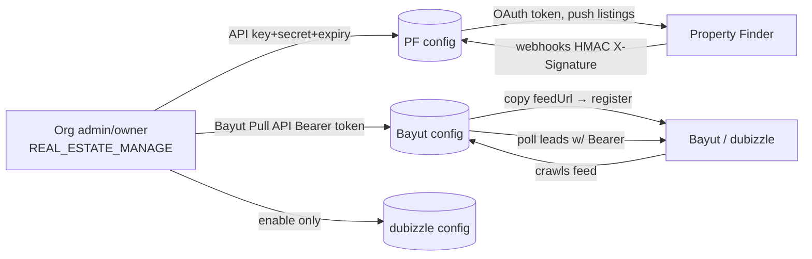

<Note>
**Purpose:** A single side-by-side reference for how one canonical `Listing` field maps to **both** portals, where the **field name** differs, where the **allowed values** differ, and which fields are **portal-specific** (so the frontend can show/hide inputs based on which portal an org has enabled).

**Related docs:** `BAYUT_DUBIZZLE_XML.md` (Bayut external contract), `PF_API.md` + `PF_OPENAPI.json` (PF contract), `PORTAL_SYNDICATION_SPECIFICATION.md` (full design).
</Note>

## Authentication & account linking

**None of the three portals use an interactive OAuth "Connect with…" redirect** (unlike the Meta/Gmail/Outlook integrations). All three are **manual credential / URL exchange**, configured per-organization by an admin/owner.

| Portal | Direction | What the admin provides | What PropWise generates | Transport auth |
|---|---|---|---|---|
| **Property Finder** | push + webhooks | API Key + API Secret + expiry (from PF Expert) | `webhookSecret` | OAuth2 client-credentials → 30-min Bearer JWT |
| **Bayut** | feed pull + lead poll | Bayut **Pull API Bearer token** (inbound leads only) | `feedSecret` + per-org `feedUrl` (outbound listings) | Org registers PropWise's feed URL; PropWise polls leads with the Bearer token |
| **dubizzle** | shares Bayut | (nothing new — piggybacks Bayut) | reuses the unified feed | Shares Bayut feed + Bayut lead token |



### Common model

<CardGroup cols={2}>
  <Card title="Configuration" icon="gear">
    One `PortalConfiguration` row per `(organization, portal)` with unique constraint
  </Card>
  <Card title="Access Control" icon="shield">
    Requires `REAL_ESTATE_MANAGE` permission (org admin/owner)
  </Card>
</CardGroup>

**Endpoints (Phase 1, implemented):**

- `GET /portal-syndication/config` — list (keys never returned; only `hasApiKey` / `hasWebhookSecret` / `hasFeedSecret`)
- `POST /portal-syndication/config` — upsert `{ portal, apiKey?, apiSecret?, apiKeyExpiresAt?, isEnabled }`
- `PATCH /portal-syndication/config/:portal/toggle` — enable/disable

<Warning>
API credentials are **encrypted at rest** (AES-256-GCM via `EncryptionService`); raw values are never returned in any response or log.
</Warning>

<Info>
PropWise-generated secrets (`webhookSecret` for PF; `feedSecret` + `feedUrl` for Bayut/dubizzle) are minted **once** on first creation and never regenerated on update (regenerating would break a live portal subscription).
</Info>

### Property Finder — OAuth2 client credentials

<Steps>
  <Step title="Generate credentials in PF Expert">
    Admin opens **Developer Resources → API Credentials**, generates a key of type **API Integration** → receives **API Key + API Secret**, sets an **expiry (max 365 days)**, and enables the required **optional** scopes.
    
    Per `PF_API.md`, the optional scopes to enable are:
    - `listings:full_access`
    - `leads:read`
    - `credits:read`
    
    The webhook/compliance/location/project/verification scopes are **default scopes** (always on).
  </Step>
  
  <Step title="Configure in PropWise">
    Admin pastes API Key + API Secret + expiry into `POST /config` (`portal=property_finder`). Stored encrypted; `apiKeyExpiresAt` saved for expiry tracking.
  </Step>
  
  <Step title="Runtime token exchange">
    `PfTokenService` (Phase B) exchanges key+secret at `POST /v1/auth/token` → a **30-minute Bearer JWT**. No refresh-token flow — PropWise re-issues on expiry, caches per org, and invalidates on 401.
  </Step>
  
  <Step title="Webhook subscription">
    On enable, PropWise auto-generates a `webhookSecret` and (Phase 3) subscribes to PF webhooks (`POST /v1/webhooks` → `…/webhooks/property-finder/{orgId}`). PF signs every callback with an HMAC `X-Signature` that PropWise verifies.
  </Step>
  
  <Step title="Key rotation">
    Daily `ApiKeyExpirationCheckService` cron warns before the 365-day expiry and auto-disables the config on expiry. A 401 at runtime surfaces "key expired on {date} — regenerate in PF Expert". Admin generates a fresh key and re-saves.
  </Step>
</Steps>

### Bayut — two separate channels

<Tabs>
  <Tab title="Outbound (Listings)">
    **No inbound credential from PropWise's side.** PropWise *generates* a per-org HMAC feed URL; the admin **copies `feedUrl` from PropWise and registers it in their Bayut account's XML feed settings**. Bayut then **pulls** it on a schedule.
    
    ```
    GET /portal-syndication/feeds/{orgId}?token={hmac}
    ```
    
    - URL + token generated **once** when Bayut `PortalConfiguration` is first created
    - Token verified via `PortalConfigurationService.verifyFeedToken` (constant-time)
    - Single unified feed for all org listings
  </Tab>
  
  <Tab title="Inbound (Leads)">
    Bayut issues a **Pull API Bearer token**. Endpoint `www.bayut.com/api-v7/stats/website-client-leads`, auth `Authorization: Bearer <API KEY>` (a **static per-client key, not OAuth**).
    
    - Admin pastes token into PropWise as Bayut config's `apiKey` (encrypted)
    - `BayutLeadPollerService` (cron, every 15 min) polls 7 lead type/target combinations
    - On 401, does **not** advance `lastLeadPollAt` (window retried after key fix)
    - No webhooks
  </Tab>
</Tabs>

### dubizzle — rides on Bayut

<Info>
dubizzle **shares Bayut's infrastructure** — no separate configuration needed beyond enabling the portal.
</Info>

- **Listings:** reads the **same unified feed**; per-listing `<Portals>` tag includes `dubizzle` when its `ListingPortalSync` row is enabled
- **Leads:** shares Bayut's endpoint and token; `source` field discriminates `bayut` vs `dubizzle`
- **Linking:** create a dubizzle config row + enable it (piggybacks Bayut feed + token)

### Feed URL architecture

**Each organization gets its own feed URL.** Bayut/dubizzle is a **pull** model: PropWise exposes a public XML endpoint and the portal crawls it on a schedule.

```typescript
GET /portal-syndication/feeds/{orgId}?token={hmac}
@PublicEndpoint()  // no auth/org context — RLS bypass scoped to {orgId}
token = HMAC-SHA256(orgId, feedSecret)  // hex, validated with timingSafeEqual
```

<CardGroup cols={2}>
  <Card title="Generation" icon="key">
    URL + token generated **once** when Bayut/dubizzle `PortalConfiguration` is first created
  </Card>
  <Card title="Unified Feed" icon="merge">
    Single endpoint returns ALL org listings; `<Portals>` tag controls portal visibility
  </Card>
</CardGroup>

### Open reconciliation items

<Warning>
Feed logic flagged during review — requires resolution before Phase B/3/4 implementation.
</Warning>

<AccordionGroup>
  <Accordion title="F1: Two feedSecrets for one unified feed">
    `createOrUpdate` mints a separate `feedSecret` + `feedUrl` for the **Bayut** row AND the **dubizzle** row, even though the feed is unified. `verifyFeedToken` accepts **either** token, so both URLs work and return the same combined feed.
    
    **Decision needed:** Either (a) share **one** org-level feed secret/URL across both portals, or (b) keep per-portal secrets for independent rotation and clearly state that **either URL may be given to either portal**.
  </Accordion>
  
  <Accordion title="F2: deleted-retention vs published-only query">
    The contract requires recently-removed listings to stay in the feed as `Property_Status = deleted` for ≥1 crawl cycle so portals delist them. The plan's feed query says "load **published** sync rows" — that would drop removed rows too early.
    
    **Fix required:** Feed query must also include recently-`removed`/disabled rows for one cycle.
  </Accordion>
  
  <Accordion title="F3: Cache vs live generation">
    `PORTAL_SYNDICATION_SPECIFICATION.md` §10 shows a `FeedCacheService` (Redis, `max-age=300`) and generates via `executeInOrg`; the current plan builds live via `executeWithBypass` and omits the cache.
    
    **Decision needed:** Pick one approach and keep plan + spec in sync.
  </Accordion>
</AccordionGroup>

## Mapping helper inventory

| Concern | Helper | Status |
|---|---|---|
| Property type → portal value | `LAYOUT_TYPE_TO_BAYUT`, `LAYOUT_TYPE_TO_PF_SLUG` in `src/modules/shared/property-type-portal-map.ts` | ✅ Centralized, used by both adapters |
| Purpose, furnished, bedrooms, bathrooms, rental period, finishing, emirate→compliance, projectStatus | `src/modules/shared/portal-value-map.ts` | ✅ **BUILT** — centralized transforms |

### Portal value map functions

<Check>
**Status: BUILT.** `src/modules/shared/portal-value-map.ts` now owns every value-level transform with paired functions (consumed by both adapters AND `PortalValidationService`).
</Check>

```typescript
purposeToBayut(p)        // SALE→'Buy',  RENT→'Rent'
purposeToPfPriceType(p, rentalPeriod)  // SALE→'sale', RENT→'yearly'|'monthly'|'weekly'|'daily'
furnishedToBayut(f)      // FURNISHED→'Yes', UNFURNISHED→'No', PARTLY_FURNISHED→'Partly'
furnishedToPf(f)         // FURNISHED→'furnished', UNFURNISHED→'unfurnished', PARTLY_FURNISHED→'semi-furnished'
bedroomsToBayut(n)       // 0→'-1', 1..10→'1'..'10', >10→'10+', null→omit
bedroomsToPf(n)          // 0→'studio', 1..30→'1'..'30' (cap 30)
bathroomsToBayut(n)      // 1..10, >10→'10', null→omit
bathroomsToPf(n, type)   // land/farm→'none', else '1'..'20' (cap 20)
rentalPeriodToBayut(p)   // daily→'Daily' ... (Rent_Frequency, capitalized)
finishingToPf(f)         // fully_finished→'fully-finished' ... (Bayut: no equivalent)
emirateToPfCompliance(e) // dubai→'rera'|'dtcm', abu_dhabi→'adrec', northern_emirates→omit
```

## Field name divergence

<Note>
`Listing field` = self-contained Listing column (snapshotted from the unit in linked mode, or entered manually). "—" = not supported by that portal.
</Note>

| Canonical (`Listing`) | Bayut XML tag | PF JSON field | Notes |
|---|---|---|---|
| `id` (+ org short code) | `<Property_Ref_No>` | `reference` | `UNIT-{orgShortCode}-{listing.id}`, unique per org |
| `permitNumber` | `<Permit_Number>` | `compliance.listingAdvertisementNumber` | PF may be composite (`permit#license`, ADREC sub-permit) |
| — (org license) | — | `compliance.issuingClientLicenseNumber` | PF only |
| `purpose` | `<Property_purpose>` | `price.type` | **value + concept differ** (see below) |
| `propertyType` | `<Property_Type>` | `type` | different value maps (see Property Types section) |
| `price` | `<Price>` | `price.amounts.{sale\|yearly\|monthly\|weekly\|daily}` | PF splits by `price.type`; Bayut is one number |
| `rentalPeriod` | `<Rent_Frequency>` | folded into `price.type` + `price.amounts` | Bayut keeps separate frequency tag; PF merges into price structure |
| `furnished` | `<Furnished>` | `furnishing` | Different value sets (see Furnished values section) |
| `bedrooms` | `<Bedrooms>` | `bedrooms` | Different value encoding (Bayut: string with special cases; PF: studio/numeric) |
| `bathrooms` | `<Bathrooms>` | `bathrooms` | Different caps and special handling |
| `size` | `<Size>` | `area.value` | Bayut in sq.ft only; PF supports multiple units |
| `titleEn` | `<Web_Tour>` | `title.en` | Bayut: inside `<Web_Tour>`; PF: top-level multilingual object |
| `titleAr` | — | `title.ar` | PF only (multilingual support) |
| `descriptionEn` | `<Description>` | `description.en` | Bayut: single description; PF: multilingual object |
| `descriptionAr` | — | `description.ar` | PF only |
| `amenities[]` | `<Features><Feature>` | `amenities[]` | Bayut: 20-item limit, string values; PF: unlimited, slug values |
| `images[]` | `<Images><Image><url>` | `images[].url` | Both support multiple images; PF has additional metadata fields |
| `agentId` | `<Ad_Type>Agent</Ad_Type>` | `agent.externalId` | Different representation models |
| `latitude` | `<Latitude>` | `location.lat` | — |
| `longitude` | `<Longitude>` | `location.lng` | — |
| `videoUrl` | `<Video_Tour_URL>` | `virtualTours[].url` | PF uses array; Bayut single URL |
| `published` | `<Property_Status>` | `publication.action` (publish/draft) | Different status models |
| `emirate` | `<City>` | `location.ids[]` (hierarchy) | PF: compliance authority derivation; Bayut: City tag |
| `community` | `<Community>` | `location.ids[]` (hierarchy) | PF: multi-level hierarchy; Bayut: flat tags |
| `subCommunity` | `<Sub_Community>` | `location.ids[]` (hierarchy) | — |
| `building` | `<Property_Name>` | `location.ids[]` (hierarchy) | — |
| `completionStatus` | — | `projectStatus` | PF only (off-plan support) |
| `finishing` | — | `finishing` | PF only |
| `developerName` | — | `developer.name` | PF only (off-plan) |
| `handoverDate` | — | `handoverDate` | PF only (off-plan, YYYY-MM-DD) |

<Tabs>
  <Tab title="Core Fields">
    Fields that exist on both portals but with different names or structures:
    - Reference number
    - Purpose/listing type
    - Property type
    - Price structure
    - Basic attributes (beds/baths/size)
  </Tab>
  
  <Tab title="Portal-Specific">
    **Property Finder only:**
    - Multilingual content (Arabic)
    - Compliance details
    - Off-plan fields (completion status, developer, handover)
    - Finishing quality
    
    **Bayut/dubizzle only:**
    - None (subset of PF feature set)
  </Tab>
  
  <Tab title="Location Hierarchy">
    **Bayut:** Flat structure with separate tags
    ```xml
    <City>Dubai</City>
    <Community>Dubai Marina</Community>
    <Sub_Community>Marina Promenade</Sub_Community>
    <Property_Name>Marina Heights</Property_Name>
    ```
    
    **Property Finder:** Hierarchical location IDs
    ```json
    "location": {
      "ids": [1, 12, 345, 6789]  // emirate → city → community → building
    }
    ```
  </Tab>
</Tabs>

## Purpose mapping

<Warning>
**Conceptual difference:** Bayut uses `Property_purpose` for buy/rent decision. Property Finder uses `price.type` which combines purpose AND rental frequency.
</Warning>

### Bayut: `<Property_purpose>`

| `Listing.purpose` | Bayut XML value |
|---|---|
| `SALE` | `Buy` |
| `RENT` | `Rent` |

```xml
<Property_purpose>Buy</Property_purpose>
<!-- OR -->
<Property_purpose>Rent</Property_purpose>
```

### Property Finder: `price.type` + `price.amounts`

| `Listing.purpose` | `Listing.rentalPeriod` | PF `price.type` | PF `price.amounts` key |
|---|---|---|---|
| `SALE` | (ignored) | `sale` | `sale` |
| `RENT` | `YEARLY` | `yearly` | `yearly` |
| `RENT` | `MONTHLY` | `monthly` | `monthly` |
| `RENT` | `WEEKLY` | `weekly` | `weekly` |
| `RENT` | `DAILY` | `daily` | `daily` |

```json
{
  "price": {
    "type": "sale",
    "currency": "AED",
    "amounts": { "sale": 1500000 }
  }
}
// OR
{
  "price": {
    "type": "yearly",
    "currency": "AED",
    "amounts": { "yearly": 85000 }
  }
}
```

<Tip>
For rentals, PropWise must map `purpose=RENT` + `rentalPeriod` → the appropriate `price.type` and nest the price under the matching `amounts` key.
</Tip>

## Property types

<Note>
Full mappings centralized in `src/modules/shared/property-type-portal-map.ts`. Below are key examples.
</Note>

### Common property types

| `Listing.propertyType` | Bayut `<Property_Type>` | PF `type` slug |
|---|---|---|
| `APARTMENT` | `Apartment` | `apartment` |
| `VILLA` | `Villa / House` | `villa` |
| `TOWNHOUSE` | `Townhouse` | `townhouse` |
| `PENTHOUSE` | `Penthouse` | `penthouse` |
| `STUDIO` | `Apartment` (bedrooms=-1) | `apartment` (bedrooms='studio') |
| `OFFICE` | `Office` | `office` |
| `SHOP` | `Shop` | `shop` |
| `WAREHOUSE` | `Warehouse` | `warehouse` |
| `LAND_RESIDENTIAL` | `Residential Land` | `land-residential` |
| `LAND_COMMERCIAL` | `Commercial Land` | `land-commercial` |

### Special cases

<AccordionGroup>
  <Accordion title="Studio apartments">
    **Bayut:** `<Property_Type>Apartment</Property_Type>` + `<Bedrooms>-1</Bedrooms>`
    
    **Property Finder:** `"type": "apartment"` + `"bedrooms": "studio"`
  </Accordion>
  
  <Accordion title="Villa vs House">
    **Bayut:** Single value `Villa / House`
    
    **Property Finder:** Separate types `villa` and `villa-compound` (compounds treated as villas by mapping)
  </Accordion>
  
  <Accordion title="Unsupported types">
    Types like `HOTEL_APARTMENT`, `DUPLEX`, `BULK_UNITS` exist in PropWise but may not have direct portal equivalents. The mapping helpers return `null` for unmappable types, triggering validation errors.
  </Accordion>
</AccordionGroup>

## Furnished values

| `Listing.furnished` | Bayut `<Furnished>` | PF `furnishing` |
|---|---|---|
| `FURNISHED` | `Yes` | `furnished` |
| `UNFURNISHED` | `No` | `unfurnished` |
| `PARTLY_FURNISHED` | `Partly` | `semi-furnished` |
| `null` (not set) | (omit tag) | `unfurnished` (PF default) |

```typescript
// Helper usage
furnishedToBayut(listing.furnished)  // → 'Yes' | 'No' | 'Partly' | undefined
furnishedToPf(listing.furnished)     // → 'furnished' | 'unfurnished' | 'semi-furnished'
```

## Bedrooms & bathrooms

### Bedrooms

<Tabs>
  <Tab title="Bayut">
    ```typescript
    bedroomsToBayut(bedrooms: number | null): string | undefined {
      if (bedrooms === null) return undefined;
      if (bedrooms === 0) return '-1';        // Studio
      if (bedrooms >= 1 && bedrooms <= 10) return bedrooms.toString();
      return '10+';                            // Cap at 10+
    }
    ```
    
    **XML output:**
    ```xml
    <Bedrooms>-1</Bedrooms>      <!-- Studio -->
    <Bedrooms>3</Bedrooms>       <!-- 3BR -->
    <Bedrooms>10+</Bedrooms>     <!-- 11+ bedrooms -->
    ```
  </Tab>
  
  <Tab title="Property Finder">
    ```typescript
    bedroomsToPf(bedrooms: number | null): string {
      if (bedrooms === null || bedrooms === 0) return 'studio';
      if (bedrooms >= 1 && bedrooms <= 30) return bedrooms.toString();
      return '30';  // Cap at 30
    }
    ```
    
    **JSON output:**
    ```json
    { "bedrooms": "studio" }
    { "bedrooms": "3" }
    { "bedrooms": "30" }  // 30+ bedrooms capped
    ```
  </Tab>
</Tabs>

### Bathrooms

<Tabs>
  <Tab title="Bayut">
    ```typescript
    bathroomsToBayut(bathrooms: number | null): string | undefined {
      if (bathrooms === null || bathrooms < 1) return undefined;
      if (bathrooms >= 1 && bathrooms <= 10) return bathrooms.toString();
      return '10';  // Cap at 10
    }
    ```
    
    - Minimum value: 1
    - Maximum value: 10
    - Omitted if null or 0
  </Tab>
  
  <Tab title="Property Finder">
    ```typescript
    bathroomsToPf(bathrooms: number | null, propertyType: string): string {
      // Land/farm properties
      if (['land-residential', 'land-commercial', 'farm'].includes(propertyType)) {
        return 'none';
      }
      
      if (bathrooms === null || bathrooms < 1) return '1';  // Default
      if (bathrooms >= 1 && bathrooms <= 20) return bathrooms.toString();
      return '20';  // Cap at 20
    }
    ```
    
    - Special handling for land/farm: `'none'`
    - Default value: `'1'` (if null/0)
    - Maximum value: 20
  </Tab>
</Tabs>

## Rental period

<Info>
For Bayut, rental period is a separate field. For Property Finder, it's merged into the `price.type` field.
</Info>

### Bayut: `<Rent_Frequency>`

| `Listing.rentalPeriod` | Bayut value |
|---|---|
| `YEARLY` | `Yearly` |
| `MONTHLY` | `Monthly` |
| `WEEKLY` | `Weekly` |
| `DAILY` | `Daily` |

```xml
<!-- Only present when purpose=Rent -->
<Rent_Frequency>Yearly</Rent_Frequency>
```

### Property Finder: merged into `price`

See **Purpose mapping** section above. The rental period determines the `price.type` value and which key in `price.amounts` receives the price value.

```json
{
  "price": {
    "type": "monthly",        // Determined by rentalPeriod
    "currency": "AED",
    "amounts": { "monthly": 7500 }
  }
}
```

## Finishing (Property Finder only)

<Warning>
Bayut/dubizzle do **not** have an equivalent field. This is Property Finder specific.
</Warning>

| `Listing.finishing` | PF `finishing` |
|---|---|
| `FULLY_FINISHED` | `fully-finished` |
| `SEMI_FINISHED` | `semi-finished` |
| `CORE_SHELL` | `shell-and-core` |
| `FITTED` | `fitted` |
| `LOFT` | `loft` |
| `null` | (omit field) |

```typescript
finishingToPf(finishing: FinishingType | null): string | undefined {
  const map = {
    FULLY_FINISHED: 'fully-finished',
    SEMI_FINISHED: 'semi-finished',
    CORE_SHELL: 'shell-and-core',
    FITTED: 'fitted',
    LOFT: 'loft',
  };
  return finishing ? map[finishing] : undefined;
}
```

## Compliance & permits

### Bayut: `<Permit_Number>`

```xml
<Permit_Number>71234567890</Permit_Number>
```

- Simple string field
- Required for publication
- Dubai RERA format: 7 + 10 digits

### Property Finder: `compliance` object

```json
{
  "compliance": {
    "authority": "rera",  // or "dtcm", "adrec"
    "listingAdvertisementNumber": "71234567890",
    "issuingClientLicenseNumber": "12345"  // Org license
  }
}
```

<Steps>
  <Step title="Determine authority from emirate">
    ```typescript
    emirateToPfCompliance(emirate: string): string | undefined {
      if (emirate === 'dubai') return 'rera';  // or 'dtcm' for hotels
      if (emirate === 'abu_dhabi') return 'adrec';
      return undefined;  // Northern emirates: omit
    }
    ```
  </Step>
  
  <Step title="Map permit number">
    `listing.permitNumber` → `compliance.listingAdvertisementNumber`
    
    May be composite for ADREC: `permitNumber#licenseNumber`
  </Step>
  
  <Step title="Include org license">
    Fetch from `PortalConfiguration.orgLicenseNumber` → `compliance.issuingClientLicenseNumber`
    
    **Property Finder only** — not used by Bayut
  </Step>
</Steps>

## Off-plan fields (Property Finder only)

<Warning>
Bayut/dubizzle have **no off-plan support**. These fields are Property Finder exclusive.
</Warning>

| `Listing` field | PF field | Values / Format |
|---|---|---|
| `completionStatus` | `projectStatus` | `off-plan`, `under-construction`, `completed` |
| `developerName` | `developer.name` | String |
| `handoverDate` | `handoverDate` | ISO date `YYYY-MM-DD` |
| `escrow` | `escrow` | Boolean |

```json
{
  "projectStatus": "under-construction",
  "developer": {
    "name": "Emaar Properties"
  },
  "handoverDate": "2025-12-31",
  "escrow": true
}
```

<Tip>
When `completionStatus` is set (not `COMPLETED`), the listing is considered off-plan and these fields become required by Property Finder validation.
</Tip>

## Amenities

Both portals support amenity lists, but with different formats and limits.

<Tabs>
  <Tab title="Bayut">
    ```xml
    <Features>
      <Feature>Balcony</Feature>
      <Feature>Built in wardrobes</Feature>
      <Feature>Central A/C</Feature>
    </Features>
    ```
    
    **Constraints:**
    - Maximum **20 amenities** per listing
    - String values (human-readable)
    - No validation against fixed list
  </Tab>
  
  <Tab title="Property Finder">
    ```json
    {
      "amenities": [
        "balcony",
        "built-in-wardrobes",
        "central-air-conditioning"
      ]
    }
    ```
    
    **Constraints:**
    - **Unlimited** amenities
    - Slug values (kebab-case)
    - Must match PF's amenity catalog
    - Use `GET /v1/amenities` to fetch valid list
  </Tab>
</Tabs>

<Note>
PropWise stores amenities in a normalized `amenities[]` array. The adapter transforms to portal-specific format (string → slug mapping for PF, truncation at 20 for Bayut).
</Note>

## Images

Both portals support multiple images with similar requirements.

<CodeGroup>
```xml Bayut
<Images>
  <Image>
    <url>https://cdn.propwise.com/listings/123/01.jpg</url>
  </Image>
  <Image>
    <url>https://cdn.propwise.com/listings/123/02.jpg</url>
  </Image>
</Images>
```

```json Property Finder
{
  "images": [
    {
      "url": "https://cdn.propwise.com/listings/123/01.jpg",
      "title": {
        "en": "Living Room"
      }
    },
    {
      "url": "https://cdn.propwise.com/listings/123/02.jpg",
      "title": {
        "en": "Bedroom"
      }
    }
  ]
}
```
</CodeGroup>

**Common requirements:**
- HTTPS required
- Minimum 2 images (both portals)
- Maximum 25-30 images (portal-dependent)
- Formats: JPG, PNG
- Minimum dimensions: 800x600px recommended

<Warning>
Property Finder also supports `floorplan` and `categoryImages` arrays for floor plans and 360° tours. Bayut has separate `<Floor_Plan_Image>` tag.
</Warning>

## Location hierarchy

<Info>
This is the most complex mapping due to fundamentally different models.
</Info>

### Bayut: Flat structure

```xml
<City>Dubai</City>
<Community>Dubai Marina</Community>
<Sub_Community>Marina Promenade</Sub_Community>
<Property_Name>Marina Heights</Property_Name>
<Latitude>25.0772</Latitude>
<Longitude>55.1329</Longitude>
```

- **4 discrete text fields** + coordinates
- No hierarchical validation
- Free-form property name

### Property Finder: Hierarchical IDs

```json
{
  "location": {
    "ids": [1, 12, 345, 6789],  // Must be valid ID chain
    "lat": 25.0772,
    "lng": 55.1329
  }
}
```

- **Array of location IDs** representing hierarchy
- IDs must be fetched from `GET /v1/locations` endpoint
- Each level validated against PF's location database
- Chain must be valid: emirate → city → community → sub-community → building

<Steps>
  <Step title="Map emirate to city ID">
    Dubai emirate → city ID `1`
  </Step>
  
  <Step title="Search community">
    Query PF locations API for "Dubai Marina" within city 1 → get ID `12`
  </Step>
  
  <Step title="Search sub-community">
    Query for "Marina Promenade" within community 12 → get ID `345`
  </Step>
  
  <Step title="Search building">
    Query for "Marina Heights" within sub-community 345 → get ID `6789`
  </Step>
  
  <Step title="Construct hierarchy">
    `"location": { "ids": [1, 12, 345, 6789] }`
  </Step>
</Steps>

<Warning>
**Phase 3 requirement:** PropWise must implement a `PfLocationService` to cache and search the PF location tree. Initial sync fetches all ~50k locations; daily updates maintain freshness.
</Warning>

## Agent mapping

<Tabs>
  <Tab title="Bayut">
    ```xml
    <Ad_Type>Agent</Ad_Type>
    <Listing_Agent>John Smith</Listing_Agent>
    <Listing_Agent_Phone>+971501234567</Listing_Agent_Phone>
    ```
    
    - `Ad_Type` must be `Agent` (not `Owner`)
    - Agent name and phone from listing's assigned agent
    - Uses agent's primary phone from `User` table
  </Tab>
  
  <Tab title="Property Finder">
    ```json
    {
      "agent": {
        "externalId": "AGENT-ORG123-42",
        "email": "john.smith@agency.ae"
      }
    }
    ```
    
    - `externalId` = `AGENT-{orgShortCode}-{userId}`
    - Agent must be pre-registered via `POST /v1/agents`
    - Email required for agent creation
    - Cached in `pf_agents` table with PF's internal agent ID
  </Tab>
</Tabs>

<Note>
**Phase 3:** `PfAgentService` will manage agent sync. First time an org enables PF, PropWise pushes all org users with `canManageListings=true` as agents. Subsequently, agent changes sync on user updates.
</Note>

## Publication status

| PropWise state | Bayut `<Property_Status>` | PF `publication.action` |
|---|---|---|
| `ListingPortalSync.enabled = true` | `live` | `publish` |
| `ListingPortalSync.enabled = false` (soft-disabled) | `live` (stays published¹) | `draft` |
| Listing deleted / hard-removed | `deleted` (in feed for 1 cycle²) | (remove from payload) |

<Info>
**¹ Bayut behavior:** Removing a property from the feed does **not** unpublish it on Bayut. To delist, the property must appear in the feed with `<Property_Status>deleted</Property_Status>` for at least one crawl cycle.

**² Retention window:** PropWise must keep recently-disabled/removed listings in the feed as `deleted` for ≥24h (one Bayut crawl cycle). See reconciliation item F2.
</Info>

<CodeGroup>
```xml Bayut (live)
<Property_Status>live</Property_Status>
```

```xml Bayut (deleted)
<Property_Status>deleted</Property_Status>
```

```json Property Finder (publish)
{
  "publication": {
    "action": "publish"
  }
}
```

```json Property Finder (draft)
{
  "publication": {
    "action": "draft"
  }
}
```
</CodeGroup>

## Validation rules

<Warning>
**Pre-flight validation required** before syndication to avoid portal rejections.
</Warning>

### Cross-portal requirements

<AccordionGroup>
  <Accordion title="Required fields (all portals)">
    - Property reference (`id`)
    - Purpose (sale/rent)
    - Property type
    - Price (positive number)
    - Bedrooms
    - Size (positive)
    - Title (EN)
    - Description (EN)
    - Location (emirate, community)
    - Coordinates (lat/lng)
    - Images (minimum 2)
    - Permit number
  </Accordion>
  
  <Accordion title="Bayut-specific">
    - Agent name and phone (if `Ad_Type=Agent`)
    - Rent frequency (if purpose=Rent)
    - Amenities ≤ 20
    - City must be valid Bayut city
  </Accordion>
  
  <Accordion title="Property Finder-specific">
    - Compliance authority + org license
    - Location IDs (valid hierarchy)
    - Agent `externalId` (pre-registered)
    - Off-plan fields (if `projectStatus` is not completed)
    - Amenities must match PF catalog slugs
    - Arabic content (recommended)
  </Accordion>
</AccordionGroup>

### Validation service

```typescript
class PortalValidationService {
  validateForBayut(listing: Listing): ValidationResult {
    // Uses helper functions from portal-value-map.ts
    // Returns errors[] array
  }
  
  validateForPf(listing: Listing): ValidationResult {
    // Checks PF-specific requirements
    // Validates location IDs exist
    // Verifies agent registration
  }
}
```

<Tip>
Frontend should call validation endpoints before enabling syndication to show specific field errors to the user.
</Tip>

## Frontend visibility rules

**Portal-specific fields should only appear in the UI when that portal is enabled for the org.**

<CardGroup cols={2}>
  <Card title="Always Visible" icon="eye">
    Core real estate fields (beds, baths, size, price, description, images, location)
  </Card>
  <Card title="Property Finder Only" icon="filter">
    - Arabic title/description
    - Finishing quality
    - Off-plan fields (completion status, developer, handover date)
    - Escrow
    - Project status
  </Card>
</CardGroup>

```typescript
// Frontend query to determine visibility
GET /portal-syndication/config
// Response:
[
  { "portal": "property_finder", "isEnabled": true },
  { "portal": "bayut", "isEnabled": false },
  { "portal": "dubizzle", "isEnabled": false }
]

// Show PF-only fields if property_finder.isEnabled === true
```

<Steps>
  <Step title="Fetch portal config">
    Frontend calls `/portal-syndication/config` on org context load
  </Step>
  
  <Step title="Store enabled portals">
    Cache which portals are enabled (e.g., in React context or Vuex store)
  </Step>
  
  <Step title="Conditional rendering">
    ```vue
    <FinishingSelect v-if="portals.property_finder.enabled" />
    <ArabicContent v-if="portals.property_finder.enabled" />
    ```
  </Step>
  
  <Step title="Validation hints">
    Show portal-specific validation messages only when that portal is enabled
  </Step>
</Steps>

## Implementation checklist

<AccordionGroup>
  <Accordion title="Phase 1: Configuration (✅ Complete)">
    - [x] `PortalConfiguration` entity
    - [x] Credential encryption (AES-256-GCM)
    - [x] Config CRUD endpoints
    - [x] Feed URL generation (Bayut/dubizzle)
    - [x] Webhook secret generation (PF)
    - [x] RBAC enforcement (`REAL_ESTATE_MANAGE`)
  </Accordion>
  
  <Accordion title="Phase 2: Value Mapping (✅ Complete)">
    - [x] `portal-value-map.ts` helpers
    - [x] Property type mappings
    - [x] Purpose/rental period transforms
    - [x] Furnished/bedrooms/bathrooms conversion
    - [x] Emirate → compliance authority
    - [x] All helpers unit-tested
  </Accordion>
  
  <Accordion title="Phase 3: Property Finder Push (Planned)">
    - [ ] `PfTokenService` (OAuth2 client-credentials)
    - [ ] `PfLocationService` (location tree sync)
    - [ ] `PfAgentService` (agent registration)
    - [ ] `PfSyncService` (listing push)
    - [ ] Webhook subscription + HMAC verification
    - [ ] Lead ingestion from PF webhooks
    - [ ] Credit balance monitoring
  </Accordion>
  
  <Accordion title="Phase 4: Bayut/dubizzle Pull (Planned)">
    - [ ] Public feed controller (`/feeds/{orgId}?token=...`)
    - [ ] Unified XML generation
    - [ ] `<Portals>` tag logic (bayut/dubizzle enablement)
    - [ ] `deleted` retention window (F2 resolution)
    - [ ] Feed caching strategy (F3 resolution)
    - [ ] `BayutLeadPollerService` (15-min cron)
    - [ ] Lead deduplication
  </Accordion>
  
  <Accordion title="Phase 5: Validation & Monitoring (Planned)">
    - [ ] `PortalValidationService` implementation
    - [ ] Pre-flight validation endpoints
    - [ ] Portal-specific error messages
    - [ ] Sync status tracking (`ListingPortalSync` state machine)
    - [ ] Failure alerts (Slack/email)
    - [ ] Analytics dashboard (sync success rate)
  </Accordion>
</AccordionGroup>

## Related documentation

<CardGroup cols={2}>
  <Card title="Bayut XML Specification" icon="code" href="./bayut-dubizzle-xml">
    Complete Bayut/dubizzle XML feed contract
  </Card>
  <Card title="Property Finder API" icon="webhook" href="./pf-api">
    PF REST API integration guide
  </Card>
  <Card title="Portal Syndication Design" icon="diagram-project" href="./portal-syndication-specification">
    Full technical specification and architecture
  </Card>
  <Card title="Bayut Lead Polling" icon="inbox" href="./bayut-dubizzle-pull-api">
    Bayut Pull API lead ingestion details
  </Card>
</CardGroup>
