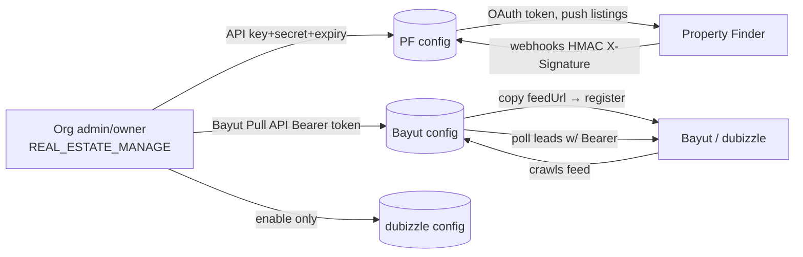

<Note>
  **Purpose:** A single side-by-side reference for how one canonical `Listing` field maps to **both** portals, where the **field name** differs, where the **allowed values** differ, and which fields are **portal-specific** (so the frontend can show/hide inputs based on which portal an org has enabled).
</Note>

**Why this exists:** The same logical field (e.g. "furnished", "bedrooms", "purpose", "location") has a **different name AND a different value space** on Bayut vs Property Finder. The per-portal payload tables live in `PORTAL_SYNDICATION_SPECIFICATION.md` §6.3 (PF) and §6.4 (Bayut). This doc is the **cross-portal divergence + frontend visibility** companion.

**Related docs:** `BAYUT_DUBIZZLE_XML.md` (Bayut external contract), `PF_API.md` + `PF_OPENAPI.json` (PF contract), `PORTAL_SYNDICATION_SPECIFICATION.md` (full design).

---

## Authentication and account linking

**None of the three portals use an interactive OAuth "Connect with…" redirect** (unlike the Meta/Gmail/Outlook integrations). All three are **manual credential / URL exchange**, configured per-organization by an admin/owner.

| Portal | Direction | What the admin provides | What PropWise generates | Transport auth |
|---|---|---|---|---|
| **Property Finder** | push + webhooks | API Key + API Secret + expiry (from PF Expert) | `webhookSecret` | OAuth2 client-credentials → 30-min Bearer JWT |
| **Bayut** | feed pull + lead poll | Bayut **Pull API Bearer token** (inbound leads only) | `feedSecret` + per-org `feedUrl` (outbound listings) | Org registers PropWise's feed URL; PropWise polls leads with the Bearer token |
| **dubizzle** | shares Bayut | (nothing new — piggybacks Bayut) | reuses the unified feed | Shares Bayut feed + Bayut lead token |



### Common model

<CardGroup cols={2}>
  <Card title="Configuration storage" icon="database">
    One `PortalConfiguration` row per `(organization, portal)` with unique constraint
  </Card>
  <Card title="Access control" icon="shield">
    Requires `REAL_ESTATE_MANAGE` permission (org admin/owner)
  </Card>
</CardGroup>

**Endpoints (Phase 1, implemented):**

<Steps>
  <Step title="List configurations">
    `GET /portal-syndication/config` — list (keys never returned; only `hasApiKey` / `hasWebhookSecret` / `hasFeedSecret`)
  </Step>
  <Step title="Create or update">
    `POST /portal-syndication/config` — upsert `{ portal, apiKey?, apiSecret?, apiKeyExpiresAt?, isEnabled }`
  </Step>
  <Step title="Toggle portal">
    `PATCH /portal-syndication/config/:portal/toggle` — enable/disable
  </Step>
</Steps>

<Warning>
  API credentials are **encrypted at rest** (AES-256-GCM via `EncryptionService`); raw values are never returned in any response or log.
</Warning>

<Info>
  PropWise-generated secrets (`webhookSecret` for PF; `feedSecret` + `feedUrl` for Bayut/dubizzle) are minted **once** on first creation and never regenerated on update (regenerating would break a live portal subscription).
</Info>

### Property Finder — OAuth2 client credentials

<Steps>
  <Step title="Generate credentials in PF Expert">
    Admin opens **Developer Resources → API Credentials**, generates a key of type **API Integration** → receives **API Key + API Secret**, sets an **expiry (max 365 days)**, and enables the required **optional** scopes.
    
    Per `PF_API.md`, the optional scopes to enable are:
    - `listings:full_access`
    - `leads:read`
    - `credits:read`
    
    The webhook/compliance/location/project/verification scopes (`webhooks:full_access`, `compliances:read`, `locations:read`, `projects:read`, `listing_verification:full_access`) are **default scopes** — always on, not manually enabled.
  </Step>
  
  <Step title="Configure in PropWise">
    Admin pastes API Key + API Secret + expiry into `POST /config` (`portal=property_finder`). Stored encrypted; `apiKeyExpiresAt` saved for expiry tracking.
  </Step>
  
  <Step title="Runtime token exchange">
    **`PfTokenService` (Phase B):** PropWise exchanges key+secret at `POST /v1/auth/token` → a **30-minute Bearer JWT**. **No refresh-token flow** — PropWise re-issues on expiry, caches per org, and invalidates on 401.
  </Step>
  
  <Step title="Webhook subscription">
    **On enable:** PropWise auto-generates a `webhookSecret` and (Phase 3) subscribes to PF webhooks (`POST /v1/webhooks` → `…/webhooks/property-finder/{orgId}`). PF signs every callback with an HMAC `X-Signature` that PropWise verifies against that `webhookSecret` (publish confirmations + lead push back).
  </Step>
  
  <Step title="Key rotation">
    The daily `ApiKeyExpirationCheckService` cron warns before the 365-day expiry and auto-disables the config on expiry; a 401 at runtime surfaces "key expired on {date} — regenerate in PF Expert". The admin generates a fresh key and re-saves.
  </Step>
</Steps>

### Bayut — two separate channels

<Tabs>
  <Tab title="Outbound (listings)">
    **No inbound credential from PropWise's side.** PropWise *generates* a per-org HMAC feed URL; the admin **copies `feedUrl` from PropWise and registers it in their Bayut account's XML feed settings**. Bayut then **pulls** it on a schedule.
  </Tab>
  
  <Tab title="Inbound (leads)">
    Bayut issues a **Pull API Bearer token**. Endpoint `www.bayut.com/api-v7/stats/website-client-leads`, auth `Authorization: Bearer <API KEY>` (a **static per-client key, not OAuth** — see `BAYUT_DUBIZZLE_PULL_API.md` §3).
    
    The admin pastes this token into PropWise as the Bayut config's `apiKey` (encrypted). `BayutLeadPollerService` (cron, every 15 min) decrypts it and polls the 7 lead type/target combinations since `lastLeadPollAt`.
    
    <Warning>
      On 401 it does **not** advance `lastLeadPollAt` (so the window is retried after the key is fixed). No webhooks.
    </Warning>
  </Tab>
</Tabs>

### dubizzle — rides on Bayut

<Check>
  **Listings:** dubizzle reads the **same unified feed**; the per-listing `<Portals>` tag includes `dubizzle` when its `ListingPortalSync` row is enabled.
</Check>

<Check>
  **Leads:** dubizzle **shares Bayut's endpoint and token**; the `source` field on each lead response discriminates `bayut` vs `dubizzle`, so the dubizzle config row's `apiKey` is **not used** (per the `PortalConfiguration` entity comment).
</Check>

**Linking = create a dubizzle config row + enable it.** It piggybacks on the Bayut feed + Bayut lead token.

<Tip>
  **Implementation status:** The `PortalConfiguration` model, credential capture + encryption, secret/feed-URL generation, and the config/list/toggle endpoints exist today (Phase 1). `PfTokenService` token exchange, PF webhook subscription, the public feed controller, and the Bayut lead poller are planned (Phase B/3/4); `pf/agent-mappings/refresh` currently returns `501`.
</Tip>

### Feed URL architecture

**Each organization gets its own feed URL.** Bayut/dubizzle is a **pull** model: PropWise exposes a public XML endpoint and the portal crawls it on a schedule.

```http
GET /portal-syndication/feeds/{orgId}?token={hmac}
@PublicEndpoint()           # no auth/org context — RLS bypass scoped to the {orgId} in the path
token = HMAC-SHA256(orgId, feedSecret)   # hex, validated with timingSafeEqual
```

<Steps>
  <Step title="URL generation">
    The URL + token are generated **once** when the Bayut (or dubizzle) `PortalConfiguration` is first created (`PortalConfigurationService.createOrUpdate` → `generateFeedUrl`). The org pastes this URL into their Bayut/dubizzle account.
  </Step>
  
  <Step title="Token verification">
    The token is verified in the public feed controller via `PortalConfigurationService.verifyFeedToken` (constant-time, format-checked, RLS-bypassed lookup scoped to `orgId`).
  </Step>
  
  <Step title="Unified feed">
    It is a **single unified feed**: one endpoint returns ALL of the org's live listings, and the `<Portals>` tag **inside each `<Property>`** decides whether that listing shows on Bayut, dubizzle, or both (driven by the enabled `ListingPortalSync` rows). A separate dubizzle feed is **not** needed.
  </Step>
</Steps>

### Open reconciliation items

<Warning>
  The following items were flagged during review and require resolution:
</Warning>

<AccordionGroup>
  <Accordion title="F1: Two feedSecrets for one unified feed">
    `createOrUpdate` mints a separate `feedSecret` + `feedUrl` for the **Bayut** row AND the **dubizzle** row, even though the feed is unified. `verifyFeedToken` accepts **either** token, so both URLs work and return the same combined feed.
    
    **Decision needed:** Either (a) share **one** org-level feed secret/URL across both portals, or (b) keep per-portal secrets for independent rotation and clearly state that **either URL may be given to either portal**.
  </Accordion>
  
  <Accordion title="F2: deleted-retention vs published only query">
    The contract requires recently-removed listings to stay in the feed as `Property_Status = deleted` for ≥1 crawl cycle so portals delist them. The plan's feed query says "load **published** sync rows" — that would drop removed rows too early.
    
    **Resolution needed:** The feed query must also include recently-`removed`/disabled rows for one cycle.
  </Accordion>
  
  <Accordion title="F3: Cache vs live generation">
    `PORTAL_SYNDICATION_SPECIFICATION.md` §10 shows a `FeedCacheService` (Redis, `max-age=300`) and generates via `executeInOrg`; the current plan builds live via `executeWithBypass` and omits the cache.
    
    **Decision needed:** Pick one approach and keep plan + spec in sync.
  </Accordion>
</AccordionGroup>

---

## Mapping helper inventory

| Concern | Helper | Status |
|---|---|---|
| Property type → portal value | `LAYOUT_TYPE_TO_BAYUT`, `LAYOUT_TYPE_TO_PF_SLUG` in `src/modules/shared/property-type-portal-map.ts` | ✅ Centralized, used by both adapters |
| Purpose, furnished, bedrooms, bathrooms, rental period, finishing, emirate→compliance, projectStatus | — | ❌ Not centralized. Described in prose/§6.3/§6.4 tables only; each adapter would hand-roll its own transform |

<Check>
  **Status: BUILT.** `src/modules/shared/portal-value-map.ts` (sibling to `property-type-portal-map.ts`) now owns every value-level transform with paired functions (consumed by both adapters AND `PortalValidationService`).
</Check>

### Available mapping functions

```typescript
// Purpose mappings
purposeToBayut(p)                        // SALE→'Buy',  RENT→'Rent'
purposeToPfPriceType(p, rentalPeriod)    // SALE→'sale', RENT→'yearly'|'monthly'|'weekly'|'daily'

// Furnished status
furnishedToBayut(f)      // FURNISHED→'Yes', UNFURNISHED→'No', PARTLY_FURNISHED→'Partly'
furnishedToPf(f)         // FURNISHED→'furnished', UNFURNISHED→'unfurnished', PARTLY_FURNISHED→'semi-furnished'

// Bedrooms
bedroomsToBayut(n)       // 0→'-1', 1..10→'1'..'10', >10→'10+', null→omit
bedroomsToPf(n)          // 0→'studio', 1..30→'1'..'30' (cap 30)

// Bathrooms
bathroomsToBayut(n)      // 1..10, >10→'10', null→omit
bathroomsToPf(n, type)   // land/farm→'none', else '1'..'20' (cap 20)

// Rental period
rentalPeriodToBayut(p)   // daily→'Daily' ... (Rent_Frequency, capitalized)

// Finishing (PF only)
finishingToPf(f)         // fully_finished→'fully-finished' ... (Bayut: no equivalent)

// Compliance
emirateToPfCompliance(e) // dubai→'rera'|'dtcm', abu_dhabi→'adrec', northern_emirates→omit
```

Both adapters, `PortalValidationService`, and a frontend-facing metadata source then share **one** source of truth.

---

## Field name divergence

`Listing field` = self-contained Listing column (snapshotted from the unit in linked mode, or entered manually). "—" = not supported by that portal.

### Core identification and listing details

| Canonical (`Listing`) | Bayut XML tag | PF JSON field | Notes |
|---|---|---|---|
| `id` (+ org short code) | `<Property_Ref_No>` | `reference` | `UNIT-{orgShortCode}-{listing.id}`, unique per org |
| `permitNumber` | `<Permit_Number>` | `compliance.listingAdvertisementNumber` | PF may be composite (`permit#license`, ADREC sub-permit) |
| — (org license) | — | `compliance.issuingClientLicenseNumber` | PF only |
| `purpose` | `<Property_purpose>` | `price.type` | **value + concept differ** (see value mapping section) |
| `propertyType` | `<Property_Type>` | `type` | different value maps (see property type section) |
| `price` | `<Price>` | `price.amounts.{sale\|yearly\|monthly\|weekly\|daily}` | PF splits by `price.type`; Bayut is one number |
| `rentalPeriod` | `<Rent_Frequency>` | folded into `price.type` + `price.amounts` | Bayut keeps a separate frequency tag; PF uses object keys |
| `bedrooms` | `<Bedrooms>` | `bedrooms` | **value range differs** (studio = `-1` vs `studio`) |
| `bathrooms` | `<Bathrooms>` | `bathrooms` | **range cap differs** (10 vs 20) |
| `sizeValue` | `<Property_Size>` | `area.value` | — |
| `sizeUnit` | `<Property_Size_Unit>` | `area.unit` | Bayut only sqft; PF allows sqm |
| `furnished` | `<Furnished>` | `furnishing` | **value name differs** (`Yes`/`Partly` vs `furnished`/`semi-furnished`) |
| — | — | `finishing` | PF only (Dubai off-plan) |
| `title` | `<Property_Title>` | `title.{en\|ar}` | Bayut one string; PF bi-lingual object |
| `description` | `<Web_Remarks>` | `description.{en\|ar}` | Same split |
| — | `<Emirate>` → `<DED_License_Number>` if Dubai | `compliance.issuingEntity` | PF auto-computes from emirate |

### Location fields

| Canonical (`Listing`) | Bayut XML tag | PF JSON field | Notes |
|---|---|---|---|
| `locationData.emirate` | `<Emirate>` | `location.level1` | PF numeric IDs; Bayut slugs (`dubai`, `abu-dhabi`) |
| `locationData.community` | `<Community>` | `location.level2` | — |
| `locationData.subCommunity` | `<Sub_Community>` | `location.level3` | — |
| `locationData.building` | `<Property_Name>` | `location.level4` | optional |
| `geoPoint` | `<Latitude>` + `<Longitude>` | `location.coordinates` | PF array `[lng, lat]` |

<Note>
  **PF location IDs are numeric** (resolved via `/locations` API endpoint). Bayut accepts **slug strings**. Both require valid hierarchies. Mismatch = validation error.
</Note>

### Agent and owner details

| Canonical (`Listing`) | Bayut XML tag | PF JSON field | Notes |
|---|---|---|---|
| `agent.name` | `<Agent_Name>` | `listings_agent.name` | — |
| `agent.email` | `<Agent_Email>` | `listings_agent.email` | — |
| `agent.phone` | `<Agent_Phone>` | `listings_agent.phone` | — |
| `agent.photo` (from user) | `<Agent_Photo>` | `listings_agent.photo` | — |
| `ownershipStatus` (entity-level) | — | `offering.ownership` (freehold / leasehold) | PF only |
| `projectStatus` (entity-level) | — | `offering.completion_status` (off_plan / ready) | PF only |

### Media and amenities

| Canonical (`Listing`) | Bayut XML tag | PF JSON field | Notes |
|---|---|---|---|
| `ListingMedia[]` (PHOTO) | `<Images><Image><url>` | `photos[].url` | Bayut max 25; PF max 50 |
| — | — | `photos[].title`, `rank` | PF only |
| `ListingMedia[]` (VIRTUAL_TOUR_LINK) | `<Web_Tour>` | `virtual_viewing_url` (or `links[]` Phase 3) | — |
| `ListingMedia[]` (VIDEO_LINK) | `<Video_Tour_URL>` | `video_tour_url` (or `links[]` Phase 3) | — |
| `ListingAmenity[]` | `<Amenities>` (comma-separated) | `amenities[]` (array of IDs) | **totally different ID spaces** |

<Warning>
  **Amenities are the most divergent field:** Bayut uses freeform strings (from a recommended list), PF uses numeric IDs. Each portal's amenity set must be stored in PropWise's amenity master, tagged with `bayutId` / `pfId`.
</Warning>

### Portal-specific fields

<Tabs>
  <Tab title="Property Finder only">
    | Field | PF field | Notes |
    |---|---|---|
    | Finishing | `offering.finishing` | `fully-finished`, `semi-finished`, `shell-and-core`, `furnished` |
    | Developer ID | `developer.id` | numeric, Phase 3 |
    | Project ID | `project.id` | numeric, Phase 3 |
    | Ownership | `offering.ownership` | `freehold`, `leasehold` |
    | Completion status | `offering.completion_status` | `off_plan`, `ready` |
    | Available from | `offering.available_from` | ISO date |
    | Minimum contract | `offering.minimum_contract_period` | years |
    | Payment method | `offering.payment_method` | `cash`, `cheques`, `both` |
    | No. of cheques | `offering.no_of_cheques` | 1..12 |
    | Service charge | `pricing.service_charge` | annual |
    | Financial status | `financial_details.status` | `mortgaged`, `cash` |
    | Portals | `portals[]` | array of portal slugs to publish to |
  </Tab>
  
  <Tab title="Bayut only">
    | Field | Bayut tag | Notes |
    |---|---|---|
    | Off-plan | `<Off_plan>` | `Yes`/`No` (boolean) |
    | Emirate | `<Emirate>` | drives `<DED_License_Number>` inclusion |
    | Portals | `<Portals>` | comma-separated `bayut`, `dubizzle` |
  </Tab>
</Tabs>

---

## Value space divergence

Same logical field, **different allowed values or representations**.

### Purpose and rental period

<CodeGroup>
```typescript Property Finder
// PF collapses purpose + rental period into price.type
price: {
  type: 'sale' | 'yearly' | 'monthly' | 'weekly' | 'daily',
  amounts: { [type]: number }
}

// SALE → type=sale, amounts.sale
// RENT(yearly) → type=yearly, amounts.yearly
// RENT(monthly) → type=monthly, amounts.monthly
```

```xml Bayut
<!-- Bayut keeps them separate -->
<Property_purpose>Rent</Property_purpose>  <!-- Buy | Rent -->
<Rent_Frequency>Monthly</Rent_Frequency>   <!-- Yearly | Monthly | Weekly | Daily -->
<Price>50000</Price>
```
</CodeGroup>

<Tip>
  Helper: `purposeToPfPriceType(purpose, rentalPeriod)` decides the PF `price.type` key; `purposeToBayut(purpose)` and `rentalPeriodToBayut(rentalPeriod)` handle Bayut.
</Tip>

### Furnished status

| PropWise enum | Bayut value | PF value |
|---|---|---|
| `FURNISHED` | `Yes` | `furnished` |
| `UNFURNISHED` | `No` | `unfurnished` |
| `PARTLY_FURNISHED` | `Partly` | `semi-furnished` |

### Bedrooms

<Tabs>
  <Tab title="Property Finder">
    - Studio → `"studio"`
    - 1..30 → `"1"` .. `"30"` (string, capped at 30)
    - null → omit
  </Tab>
  
  <Tab title="Bayut">
    - Studio → `"-1"`
    - 1..10 → `"1"` .. `"10"`
    - \>10 → `"10+"`
    - null → omit the tag
  </Tab>
</Tabs>

### Bathrooms

<Tabs>
  <Tab title="Property Finder">
    - For `land` / `farm` → `"none"`
    - Otherwise 1..20 → `"1"` .. `"20"` (capped at 20)
    - null → omit
  </Tab>
  
  <Tab title="Bayut">
    - 1..10 → `"1"` .. `"10"`
    - \>10 → `"10"`
    - null → omit
  </Tab>
</Tabs>

### Property type mapping

Property type divergence is handled by `property-type-portal-map.ts`:

```typescript
LAYOUT_TYPE_TO_BAYUT: Record<LayoutType, string>
LAYOUT_TYPE_TO_PF_SLUG: Record<LayoutType, string>
```

<Info>
  Example: PropWise `APARTMENT` → Bayut `"AP"` vs PF `"apartment"`. Some PropWise types have **no equivalent** on a given portal (e.g. `BOAT` on Bayut) and are filtered out during validation.
</Info>

---

## Portal-specific field visibility

Frontend forms should **show/hide** fields based on which portals the org has **enabled** in their `PortalConfiguration`.

### Conditional field display logic

<Steps>
  <Step title="Check enabled portals">
    `GET /portal-syndication/config` returns `{ portal, isEnabled }[]`
  </Step>
  
  <Step title="Show Property Finder only fields">
    If `property_finder.isEnabled`:
    - Finishing (dropdown)
    - Ownership (freehold/leasehold)
    - Completion status (off-plan/ready)
    - Available from (date)
    - Minimum contract period (years)
    - Payment method + no. of cheques
    - Service charge
  </Step>
  
  <Step title="Show Bayut only fields">
    If `bayut.isEnabled` or `dubizzle.isEnabled`:
    - Off-plan (yes/no)
  </Step>
  
  <Step title="Adjust core fields">
    - **Bedrooms/bathrooms:** show PF's higher caps if PF enabled
    - **Rental period:** show daily/weekly if PF enabled (Bayut supports them too but they're rare)
    - **Size unit:** show sqm option if PF enabled (Bayut only sqft)
  </Step>
</Steps>

### Portal selection field

The listing create/edit form should include a **"Publish to"** multi-select (driven by enabled portals):

```typescript
interface ListingPortalSelection {
  propertyFinder: boolean;  // if org has PF enabled
  bayut: boolean;           // if org has Bayut enabled
  dubizzle: boolean;        // if org has dubizzle enabled
}
```

<Note>
  On save, PropWise creates/updates `ListingPortalSync` rows for each selected portal. The per-portal status (`draft`, `published`, `error`, etc.) is independent.
</Note>

---

## Amenity mapping

Amenities have **completely different ID spaces** on each portal.

### Bayut amenities

Bayut uses **freeform comma-separated strings** in `<Amenities>`:

```xml
<Amenities>Balcony,Built in wardrobes,Central A/C,Maid's room,Shared pool</Amenities>
```

**Recommended values** (from Bayut docs, case-sensitive):
- Balcony
- Built in wardrobes
- Central A/C
- Concierge
- Covered parking
- Kitchen Appliances
- Maid's room
- Pets allowed
- Private garage
- Private gym
- Private jacuzzi
- Private pool
- Security
- Shared gym
- Shared pool
- Study
- View of Landmark
- View of Water
- Walk-in Closet

### Property Finder amenities

PF uses **numeric IDs** (discovered via `GET /v1/amenities`):

```json
{
  "amenities": [1, 5, 12, 23]
}
```

<Warning>
  PropWise must store a **master amenity list** with columns `{ id, nameEn, nameAr, bayutString?, pfId? }` so the frontend can render one unified picker and the adapters can map to portal-specific IDs.
</Warning>

### Implementation approach

<Steps>
  <Step title="Amenity master table">
    Create `Amenity` entity with `bayutString`, `pfId` (nullable), `nameEn`, `nameAr`
  </Step>
  
  <Step title="Seed from portal APIs">
    - PF: `GET /v1/amenities` → populate `pfId` + names
    - Bayut: manually seed from recommended list → populate `bayutString`
  </Step>
  
  <Step title="Listing association">
    `ListingAmenity` join table links `Listing ↔ Amenity`
  </Step>
  
  <Step title="Adapter transformation">
    - **PF adapter:** `listing.amenities.map(a => a.pfId).filter(Boolean)`
    - **Bayut adapter:** `listing.amenities.map(a => a.bayutString).filter(Boolean).join(',')`
  </Step>
</Steps>

---

## Validation rule differences

Both portals have field-level **required/optional** differences and **value constraints**.

### Required field comparison

| Field | Bayut | Property Finder | Notes |
|---|---|---|---|
| Reference | ✅ | ✅ | Both required, same format |
| Permit number | ✅ (Dubai mandatory) | ✅ | PF allows composite format |
| Price | ✅ | ✅ | — |
| Property type | ✅ | ✅ | Different value sets |
| Bedrooms | ⚠️ (optional, but common) | ⚠️ (optional, but common) | Required for most residential types |
| Bathrooms | ⚠️ | ⚠️ | Same |
| Size | ✅ | ✅ | — |
| Location hierarchy | ✅ (Emirate + Community) | ✅ (level1 + level2) | — |
| Agent name | ✅ | ✅ | — |
| Agent email | ✅ | ✅ | — |
| Photos | ✅ (min 1) | ✅ (min 1) | Bayut max 25; PF max 50 |
| Description | ❌ (optional) | ❌ (optional) | Recommended |
| Finishing | — | ⚠️ (Dubai off-plan only) | PF only |

<Check>
  `PortalValidationService` validates per-portal constraints before adapter transformation.
</Check>

### Value constraint examples

<AccordionGroup>
  <Accordion title="Permit number format">
    - **Bayut:** alphanumeric string, no specific pattern
    - **PF:** may be composite `{permit}#{license}` for ADREC, simple string for RERA/DTCM
  </Accordion>
  
  <Accordion title="Photo limits">
    - **Bayut:** max 25 photos
    - **PF:** max 50 photos
    
    Validation service should check count before syndication.
  </Accordion>
  
  <Accordion title="Title/description length">
    - **Bayut:** no documented hard limits, but keep title ≤100 chars, description ≤5000
    - **PF:** title ≤100 chars, description ≤5000 chars (both English + Arabic)
  </Accordion>
  
  <Accordion title="Location hierarchy">
    - **Bayut:** must provide valid emirate + community slugs (sub-community optional)
    - **PF:** must provide numeric IDs for level1 (emirate) + level2 (community) at minimum; invalid IDs → 400
  </Accordion>
</AccordionGroup>

---

## Frontend integration checklist

<CardGroup cols={2}>
  <Card title="Portal configuration UI" icon="gear">
    - List enabled portals
    - Add/edit credentials per portal
    - Show expiry warnings (PF API key)
    - Display feed URL (Bayut/dubizzle)
  </Card>
  
  <Card title="Listing form adaptation" icon="file-lines">
    - Conditionally show portal-specific fields
    - Validate field ranges per portal
    - Multi-select portal publish targets
    - Show portal sync status badges
  </Card>
  
  <Card title="Amenity picker" icon="list-check">
    - Unified amenity list (from master)
    - Show which portals support each amenity
    - Preview portal-specific values
  </Card>
  
  <Card title="Validation feedback" icon="circle-exclamation">
    - Surface portal validation errors
    - Show field-level requirements per portal
    - Preview transformed values before publish
  </Card>
</CardGroup>

### Recommended validation flow

<Steps>
  <Step title="Client-side validation">
    Check basic required fields and format constraints
  </Step>
  
  <Step title="Server-side portal validation">
    `POST /listings/:id/validate-portals` → runs `PortalValidationService` for each enabled portal without actually syncing
  </Step>
  
  <Step title="Display errors">
    Show per-portal validation errors in the UI:
    ```typescript
    {
      portal: 'property_finder',
      errors: [
        { field: 'finishing', message: 'Required for Dubai off-plan properties' },
        { field: 'photos', message: 'Minimum 1 photo required' }
      ]
    }
    ```
  </Step>
  
  <Step title="Publish">
    Once validation passes, create `ListingPortalSync` rows and trigger syndication
  </Step>
</Steps>

---

## Summary reference table

Complete field mapping at a glance:

| Concept | PropWise | Bayut | Property Finder | Helpers |
|---|---|---|---|---|
| **Purpose** | `purpose` enum | `<Property_purpose>` | `price.type` | `purposeToBayut()`, `purposeToPfPriceType()` |
| **Rental period** | `rentalPeriod` enum | `<Rent_Frequency>` | folded into `price.type` | `rentalPeriodToBayut()` |
| **Furnished** | `furnished` enum | `<Furnished>` | `furnishing` | `furnishedToBayut()`, `furnishedToPf()` |
| **Bedrooms** | `bedrooms` number | `<Bedrooms>` string | `bedrooms` string | `bedroomsToBayut()`, `bedroomsToPf()` |
| **Bathrooms** | `bathrooms` number | `<Bathrooms>` string | `bathrooms` string | `bathroomsToBayut()`, `bathroomsToPf()` |
| **Property type** | `propertyType` enum | `<Property_Type>` | `type` | `LAYOUT_TYPE_TO_BAYUT`, `LAYOUT_TYPE_TO_PF_SLUG` |
| **Finishing** | `finishing` enum | — | `offering.finishing` | `finishingToPf()` (PF only) |
| **Location** | `locationData.*` | `<Emirate>`, `<Community>`, etc. | `location.level1/2/3/4` (IDs) | Emirate → compliance helper |
| **Amenities** | `ListingAmenity[]` | `<Amenities>` (strings) | `amenities[]` (IDs) | Amenity master mapping |
| **Photos** | `ListingMedia[]` | `<Images><Image>` (max 25) | `photos[]` (max 50) | — |
| **Reference** | `id` + org code | `<Property_Ref_No>` | `reference` | `UNIT-{code}-{id}` |

<Tip>
  Bookmark this page and the related `property-type-portal-map.ts` / `portal-value-map.ts` files as the canonical source for all cross-portal field and value mappings.
</Tip>