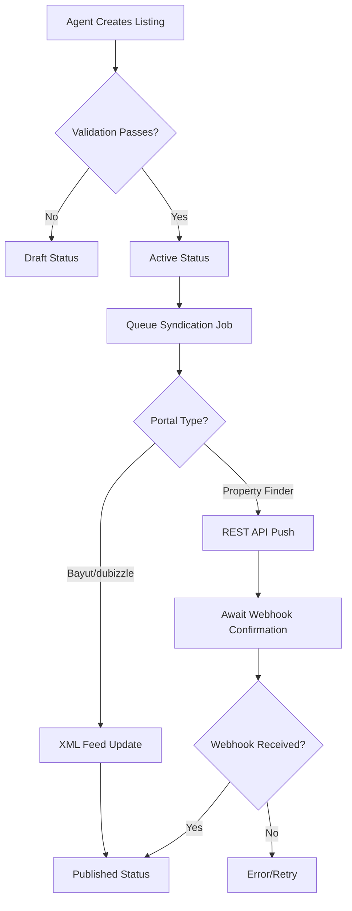
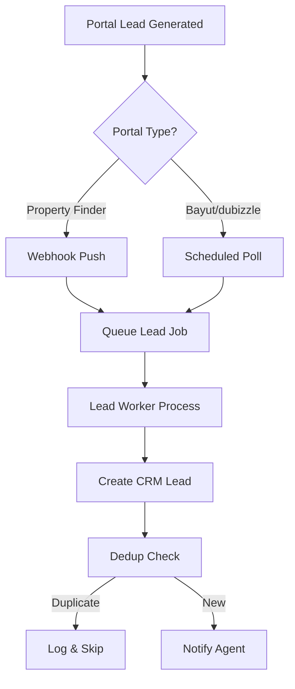

# Portal Syndication Module Specification

<Note>
**Version:** 3.0 — Architectural revision: introduced `Listing` entity as the marketing layer between `InventoryUnit` (inventory) and `ListingPortalSync` (per-portal state). Consolidated from system design plan, PF API guide, Bayut/dubizzle XML guide, and gap analysis.
</Note>

The Portal Syndication Module allows real estate agents to publish property listings to three UAE property portals directly from PropWise CRM, and automatically receive leads back into the CRM pipeline.

## Module Overview

### Three-Tier Architecture

```
InventoryUnit  →  Listing  →  ListingPortalSync
  (inventory)     (marketing)   (per-portal state)
```

<CardGroup cols={3}>
<Card title="InventoryUnit" icon="home">
What the unit *is* (rooms, area, price, physical attributes). Unchanged by portal syndication logic.
</Card>
<Card title="Listing" icon="megaphone">
How the unit is *marketed* (title, descriptions, permit number, portal classifications, marketing media). Created by an agent from an `InventoryUnit`.
</Card>
<Card title="ListingPortalSync" icon="sync">
Where the listing is *published* and its current state on each portal.
</Card>
</CardGroup>

<Tip>
This separation ensures `InventoryUnit` stays a clean inventory record and the `Listing` layer can eventually support off-plan units (`refUnitId`) without any structural change to the sync system.
</Tip>

### Integration Model Per Portal

| Portal | Listing Syndication | Lead Ingestion | Listing Timing |
|---|---|---|---|
| Property Finder | REST API Push (JSON) | Webhook push (primary) + REST poll fallback (15 min) | Real-time (seconds) |
| Bayut | XML Feed Pull (unified) | Pull API polling — scheduled every 15 min | 30 min – 2 hr delay |
| dubizzle | XML Feed Pull (same as Bayut) | Pull API polling — same API + endpoint as Bayut | 30 min – 2 hr delay |

<Note>
**Bayut / dubizzle lead ingestion:** Bayut and dubizzle share one API endpoint and one Bearer token (per agency). The `source` field in each lead response (`"bayut"` or `"dubizzle"`) determines which `LeadSource` enum value is used when the CRM lead is created. The Bearer token is stored encrypted in the existing `apiKey` field of the Bayut `PortalConfiguration` row — no new credential columns are needed.
</Note>

### Data Flow Rules

<CardGroup cols={2}>
<Card title="Listings Flow" icon="arrow-right">
CRM → portals (CRM always wins)
</Card>
<Card title="Leads Flow" icon="arrow-left">
portals → CRM
</Card>
</CardGroup>

<Check>
- Portal data **never** overwrites CRM data
- `Listing` is the **single source of truth** for listing (marketing) content
- `InventoryUnit` is the **single source of truth** for unit inventory data
</Check>

### Module Location

```
src/modules/real-estate/portal-syndication/
```

Imported in `src/modules/real-estate/real-estate.module.ts`.

## Folder Structure

```
src/modules/real-estate/portal-syndication/
├── portal-syndication.module.ts
├── index.ts
│
├── enums/
│   ├── portal.enum.ts
│   ├── listing-status.enum.ts            # draft | active | archived (Listing lifecycle)
│   ├── listing-sync-status.enum.ts       # draft | pending | awaiting_confirmation | ... (per-portal state)
│   ├── furnished-status.enum.ts
│   ├── rental-period.enum.ts
│   └── finishing-type.enum.ts            # fully_finished | semi_finished | unfinished (PF: finishingType)
│
├── entities/
│   ├── listing.entity.ts                 # Marketing layer between InventoryUnit and portals
│   ├── portal-configuration.entity.ts
│   ├── listing-portal-sync.entity.ts
│   ├── pf-agent-mapping.entity.ts
│   └── pf-location-mapping.entity.ts
│
├── dto/
│   ├── listing.dto.ts                    # Create, Update, Response DTOs for Listing
│   ├── portal-configuration.dto.ts
│   ├── listing-portal-sync.dto.ts
│   └── portal-dashboard.dto.ts
│
├── services/
│   ├── listing.service.ts                # CRUD for Listing (create from unit, update, archive)
│   ├── syndication.service.ts            # Hub orchestrator
│   ├── portal-configuration.service.ts   # CRUD for org portal configs
│   ├── listing-sync.service.ts           # State machine + CRUD
│   ├── portal-lead-worker.service.ts     # Portal lead ingestion worker (pg-boss queue consumer)
│   ├── portal-validation.service.ts      # Per-portal field validation
│   ├── listing-image.service.ts          # Image process-on-publish (validate + auto-fix + re-upload)
│   ├── feed-cache.service.ts             # Redis-backed XML feed cache
│   ├── api-key-expiration-check.service.ts # Daily cron: PF API key expiry alerting + auto-disable
│   ├── syndication-worker.service.ts      # pg-boss worker wiring for listing sync jobs
│   ├── sync-reconciliation.service.ts     # Daily reconciliation + missed-lead polling fallback
│   ├── bayut/
│   │   ├── bayut-lead-poller.service.ts  # @Cron every 15 min — polls Bayut Pull API per org
│   │   └── bayut-lead-parser.service.ts  # Normalizes 7 lead types × 3 targets into common shape
│   └── pf/
│       ├── pf-token.service.ts           # JWT lifecycle management
│       ├── pf-location-mapping.service.ts
│       ├── pf-agent-mapping.service.ts
│       ├── pf-compliance.service.ts      # DLD/ADREC checks
│       ├── pf-credit.service.ts          # Credit balance + per-listing publish price checks
│       └── pf-webhook-subscription.service.ts
│
├── adapters/
│   ├── push-portal-adapter.interface.ts
│   ├── feed-portal-adapter.interface.ts
│   ├── property-finder.adapter.ts        # REST push adapter
│   └── bayut-dubizzle-feed.adapter.ts    # Unified XML feed adapter
│
├── controllers/
│   ├── listing.controller.ts             # Listing CRUD (create from unit, update, validate)
│   ├── portal-configuration.controller.ts
│   ├── listing-sync.controller.ts        # Publish/unpublish/retry per listing
│   ├── portal-feed.controller.ts         # Public XML feed endpoint
│   ├── portal-webhook.controller.ts      # Public webhook endpoint
│   └── portal-dashboard.controller.ts
│
├── events/
│   └── portal-syndication.events.ts
│
└── listeners/
    └── portal-syndication-event.listener.ts
```

## Enums

### Portal Types

```typescript title="portal.enum.ts"
export enum Portal {
  PROPERTY_FINDER = 'property_finder',
  BAYUT = 'bayut',
  DUBIZZLE = 'dubizzle',
}
```

### Listing Sync Status

Nine states covering the full PF async lifecycle and feed-based portal model:

```typescript title="listing-sync-status.enum.ts"
export enum ListingSyncStatus {
  DRAFT = 'draft',                           // Not yet publishable (validation failed or not requested)
  PENDING = 'pending',                       // Job queued, adapter call in progress
  AWAITING_CONFIRMATION = 'awaiting_confirmation', // PF: create+publish called, waiting for webhook
  PUBLISHED = 'published',                   // Live on portal
  REJECTED = 'rejected',                     // PF rejected listing (compliance/quality)
  COMPLIANCE_ACTION = 'compliance_action',   // PF flagged listing for action
  ERROR = 'error',                           // Sync failed after retries
  INSUFFICIENT_CREDITS = 'insufficient_credits', // PF: balance < publish cost; agent retries after top-up
  REMOVED = 'removed',                       // Taken down (disabled, archived, deleted)
}
```

<Note>
**For Bayut/dubizzle:** Status goes directly `draft → published` on enable (no `awaiting_confirmation`), and `published → removed` on disable. Feed portals have no rejection mechanism.
</Note>

### Property Classification

<Tabs>
<Tab title="Furnished Status">
```typescript title="furnished-status.enum.ts"
export enum FurnishedStatus {
  FURNISHED = 'furnished',
  UNFURNISHED = 'unfurnished',
  PARTLY_FURNISHED = 'partly_furnished',
}
```
</Tab>
<Tab title="Rental Period">
```typescript title="rental-period.enum.ts"
export enum RentalPeriod {
  DAILY = 'daily',
  WEEKLY = 'weekly',
  MONTHLY = 'monthly',
  YEARLY = 'yearly',
}
```
</Tab>
<Tab title="Finishing Type">
```typescript title="finishing-type.enum.ts"
export enum FinishingType {
  FULLY_FINISHED = 'fully_finished',
  SEMI_FINISHED = 'semi_finished',
  UNFINISHED = 'unfinished',
}
```
</Tab>
</Tabs>

<Info>
**PF transform:** `FULLY_FINISHED` → `"fully-finished"`; `SEMI_FINISHED` → `"semi-finished"`; `UNFINISHED` → `"unfinished"`.
</Info>

### Listing Lifecycle

Three-state lifecycle for the `Listing` entity (distinct from `ListingSyncStatus` which is per-portal):

```typescript title="listing-status.enum.ts"
export enum ListingStatus {
  DRAFT = 'draft',       // Marketing content being prepared; not yet published to any portal
  ACTIVE = 'active',     // Ready for portal syndication
  ARCHIVED = 'archived', // No longer available; triggers removal from all portals
}
```

## Entity Definitions

### Architecture Overview

<CardGroup cols={3}>
<Card title="InventoryUnit" icon="database">
Fields describing **what the unit is** (rooms, area, price, bathrooms, location coords)
</Card>
<Card title="Listing" icon="rectangle-ad">
Fields describing **how the unit is advertised** (title, descriptions, permit number, portal classifications, marketing media)
</Card>
<Card title="ListingPortalSync" icon="arrows-rotate">
Per-portal state (publish status, portal listing ID, retry count)
</Card>
</CardGroup>

<Note>
**Portal lead ingestion:** There is no `PortalLead` staging entity. Inbound leads from portal **webhooks (PF) and scheduled Pull API polling (Bayut/dubizzle)** are queued directly via pg-boss (`portal-lead-ingestion` queue) and converted immediately to CRM `Lead` entities by the worker. Deduplication is handled by the existing `(organization, leadSource, referenceId)` unique index on `Lead`.
</Note>

<Tip>
**Why a separate `Listing` entity?**
1. Keeps `InventoryUnit` as a clean inventory record — agents editing unit details are not exposed to portal marketing fields.
2. Future-proofs off-plan support: `Listing` holds an optional `refUnitId` (reference DB integer ID), so off-plan units can be published without changing the sync system.
3. Provides a natural home for any future admin approval workflow before syndication fans out to portals.
</Tip>

### PortalConfiguration

Per-organization portal credentials and settings. One row per (org, portal).

```typescript
@Entity()
@Filter({ name: 'isDeleted', default: true, cond: { isDeleted: false } })
@Unique({ properties: ['organization', 'portal'] })
export class PortalConfiguration {
  @PrimaryKey({ type: UuidType })
  id: string = v4();

  @ManyToOne(() => Organization)
  @Index()
  organization!: Organization;

  @Enum(() => Portal)
  @Property({ type: 'text' })
  portal!: Portal;

  @Property({ type: 'boolean', default: false })
  isEnabled: boolean = false;

  // PF credentials (encrypted at application layer)
  @Property({ type: 'text', nullable: true })
  apiKey?: string;

  @Property({ type: 'text', nullable: true })
  apiSecret?: string;

  // Auto-generated on creation for Bayut/dubizzle
  @Property({ nullable: true })
  feedUrl?: string;

  // PF webhook HMAC secret — used only for verifying X-Signature on PF webhook payloads
  @Property({ nullable: true })
  webhookSecret?: string;

  // Feed URL HMAC secret — used only for generating/validating the Bayut/dubizzle feed URL token
  // Separate from webhookSecret so each can be rotated independently
  @Property({ nullable: true })
  feedSecret?: string;

  // PF API key expiry date — visible in PF Expert when the key is generated (max 365 days)
  @Property({ type: 'timestamptz', nullable: true })
  apiKeyExpiresAt?: Date;

  // Tracks the timestamp of the last successful Bayut/dubizzle lead poll
  @Property({ type: 'timestamptz', nullable: true })
  lastLeadPollAt?: Date;

  @Property({ type: 'timestamptz' })
  createdAt: Date = new Date();

  @Property({ type: 'timestamptz', onUpdate: () => new Date() })
  updatedAt: Date = new Date();

  @Property({ type: 'boolean', default: false })
  isDeleted: boolean = false;
}
```

### Listing Entity

Marketing layer between `InventoryUnit` and portals:

```typescript
@Entity()
@Filter({ name: 'isDeleted', default: true, cond: { isDeleted: false } })
export class Listing {
  @PrimaryKey({ type: UuidType })
  id: string = v4();

  @ManyToOne(() => Organization)
  @Index()
  organization!: Organization;

  @OneToOne(() => InventoryUnit)
  inventoryUnit!: InventoryUnit;

  // For future off-plan support (optional reference unit ID)
  @Property({ type: 'integer', nullable: true })
  refUnitId?: number;

  @Enum(() => ListingStatus)
  @Property({ type: 'text', default: ListingStatus.DRAFT })
  status: ListingStatus = ListingStatus.DRAFT;

  // Marketing content
  @Property({ type: 'varchar', length: 255 })
  title!: string;

  @Property({ type: 'text', nullable: true })
  description?: string;

  @Property({ type: 'text', nullable: true })
  descriptionArabic?: string;

  // Portal classifications
  @Enum(() => FurnishedStatus)
  @Property({ type: 'text', nullable: true })
  furnishedStatus?: FurnishedStatus;

  @Enum(() => RentalPeriod)
  @Property({ type: 'text', nullable: true })
  rentalPeriod?: RentalPeriod;

  @Enum(() => FinishingType)
  @Property({ type: 'text', nullable: true })
  finishingType?: FinishingType;

  // Compliance fields
  @Property({ type: 'varchar', length: 50, nullable: true })
  permitNumber?: string;

  @Property({ type: 'varchar', length: 50, nullable: true })
  reraNO?: string;

  // Marketing media
  @Property({ type: 'json', nullable: true })
  imageUrls?: string[];

  @Property({ type: 'varchar', length: 500, nullable: true })
  virtualTourUrl?: string;

  @Property({ type: 'varchar', length: 500, nullable: true })
  videoUrl?: string;

  // Portal sync states
  @OneToMany(() => ListingPortalSync, sync => sync.listing, { 
    cascade: [Cascade.ALL], 
    orphanRemoval: true 
  })
  portalSyncs = new Collection<ListingPortalSync>(this);

  @ManyToOne(() => User)
  createdBy!: User;

  @Property({ type: 'timestamptz' })
  createdAt: Date = new Date();

  @Property({ type: 'timestamptz', onUpdate: () => new Date() })
  updatedAt: Date = new Date();

  @Property({ type: 'boolean', default: false })
  isDeleted: boolean = false;
}
```

### ListingPortalSync Entity

Per-portal state tracking for each listing:

```typescript
@Entity()
@Unique({ properties: ['listing', 'portal'] })
export class ListingPortalSync {
  @PrimaryKey({ type: UuidType })
  id: string = v4();

  @ManyToOne(() => Listing)
  @Index()
  listing!: Listing;

  @Enum(() => Portal)
  @Property({ type: 'text' })
  portal!: Portal;

  @Enum(() => ListingSyncStatus)
  @Property({ type: 'text', default: ListingSyncStatus.DRAFT })
  status: ListingSyncStatus = ListingSyncStatus.DRAFT;

  @Property({ type: 'varchar', length: 255, nullable: true })
  portalListingId?: string;

  @Property({ type: 'text', nullable: true })
  errorMessage?: string;

  @Property({ type: 'integer', default: 0 })
  retryCount: number = 0;

  @Property({ type: 'timestamptz', nullable: true })
  lastSyncAt?: Date;

  @Property({ type: 'timestamptz', nullable: true })
  publishedAt?: Date;

  @Property({ type: 'timestamptz' })
  createdAt: Date = new Date();

  @Property({ type: 'timestamptz', onUpdate: () => new Date() })
  updatedAt: Date = new Date();
}
```

<Warning>
No soft delete on `ListingPortalSync` — it's a pure state tracking entity tied to the `Listing` lifecycle.
</Warning>

## Service Architecture

<Steps>
<Step title="Listing Service">
CRUD operations for `Listing` entity - create from unit, update marketing content, archive
</Step>
<Step title="Syndication Service">
Hub orchestrator that coordinates between listing management and portal adapters
</Step>
<Step title="Portal Configuration Service">
Manages per-organization portal credentials and settings
</Step>
<Step title="Listing Sync Service">
State machine management and CRUD operations for `ListingPortalSync`
</Step>
<Step title="Portal Adapters">
Interface implementations for Property Finder (REST) and Bayut/dubizzle (XML Feed)
</Step>
</Steps>

### Specialized Services

<AccordionGroup>
<Accordion title="Lead Ingestion Services">
- **portal-lead-worker.service.ts** - pg-boss queue consumer for lead processing
- **bayut-lead-poller.service.ts** - Cron job for polling Bayut/dubizzle API every 15 minutes
- **bayut-lead-parser.service.ts** - Normalizes 7 lead types × 3 targets into common shape
</Accordion>

<Accordion title="Property Finder Services">
- **pf-token.service.ts** - JWT lifecycle management and refresh
- **pf-compliance.service.ts** - DLD/ADREC validation checks
- **pf-credit.service.ts** - Credit balance and per-listing publish price verification
- **pf-webhook-subscription.service.ts** - Webhook endpoint registration and management
</Accordion>

<Accordion title="Infrastructure Services">
- **feed-cache.service.ts** - Redis-backed XML feed caching for Bayut/dubizzle
- **api-key-expiration-check.service.ts** - Daily monitoring of PF API key expiry
- **sync-reconciliation.service.ts** - Daily reconciliation and missed-lead polling fallback
- **listing-image.service.ts** - Image validation, auto-fixing, and re-upload on publish
</Accordion>
</AccordionGroup>

## API Endpoints

### Listing Management

<CodeGroup>
```typescript POST /api/listings
// Create listing from inventory unit
{
  "inventoryUnitId": "uuid",
  "title": "Luxury 2BR Apartment in Downtown",
  "description": "Spacious apartment with city views...",
  "furnishedStatus": "furnished",
  "permitNumber": "DLD123456"
}
```

```typescript PUT /api/listings/:id
// Update listing marketing content
{
  "title": "Updated Title",
  "description": "Updated description",
  "imageUrls": ["https://..."]
}
```

```typescript DELETE /api/listings/:id
// Archive listing (removes from all portals)
```
</CodeGroup>

### Portal Syndication

<CodeGroup>
```typescript POST /api/listings/:id/sync/:portal
// Publish to specific portal
{
  "action": "publish"
}
```

```typescript DELETE /api/listings/:id/sync/:portal
// Remove from specific portal
{
  "action": "unpublish"
}
```

```typescript POST /api/listings/:id/sync/:portal/retry
// Retry failed syndication
```
</CodeGroup>

### Feed Endpoints

```typescript GET /api/portal-feed/:token
// Public XML feed for Bayut/dubizzle
// Token contains encrypted org ID and HMAC signature
```

### Webhook Endpoints

```typescript POST /api/portal-webhook/property-finder
// Property Finder webhook endpoint
// Verifies X-Signature header using HMAC-SHA256
```

## Queue Management

### Job Types

<Tabs>
<Tab title="Listing Syndication">
```typescript
// Queue: listing-syndication
{
  listingId: string;
  portal: Portal;
  action: 'publish' | 'update' | 'unpublish';
  organizationId: string;
}
```
</Tab>
<Tab title="Lead Ingestion">
```typescript
// Queue: portal-lead-ingestion
{
  leadData: any; // Portal-specific lead payload
  portal: Portal;
  organizationId: string;
  source: 'webhook' | 'poll';
}
```
</Tab>
<Tab title="Image Processing">
```typescript
// Queue: listing-image-processing
{
  listingId: string;
  imageUrls: string[];
  action: 'validate' | 'resize' | 'reupload';
}
```
</Tab>
</Tabs>

### Queue Configuration

<Info>
All queues use pg-boss with exponential backoff retry strategy:
- **Max retries:** 5
- **Initial delay:** 30 seconds
- **Max delay:** 10 minutes
- **Exponential base:** 2
</Info>

## Security & Compliance

### Credential Management

<Steps>
<Step title="Encryption at Rest">
All API keys and secrets are encrypted using AES-256 before database storage
</Step>
<Step title="HMAC Verification">
Webhook payloads verified using portal-specific HMAC secrets
</Step>
<Step title="Feed URL Security">
XML feed URLs include encrypted tokens with expiration and signature validation
</Step>
<Step title="Permission Checks">
All endpoints validate user permissions against organization and listing ownership
</Step>
</Steps>

### DLD/ADREC Compliance

<Warning>
Property Finder requires valid DLD (Dubai Land Department) or ADREC (Abu Dhabi Real Estate Centre) permit numbers for all listings. The `pf-compliance.service.ts` validates permit format and authenticity before publication.
</Warning>

## Data Flow Diagrams

### Listing Publication Flow



### Lead Ingestion Flow



## Monitoring & Observability

### Key Metrics

<CardGroup cols={2}>
<Card title="Syndication Success Rate" icon="chart-line">
Percentage of successful portal publications per organization
</Card>
<Card title="Lead Conversion Rate" icon="funnel">
Portal leads converted to CRM opportunities
</Card>
<Card title="API Response Times" icon="clock">
Average response time for portal API calls
</Card>
<Card title="Queue Depth" icon="layer-group">
Number of pending syndication and lead ingestion jobs
</Card>
</CardGroup>

### Alerting

<Warning>
**Critical Alerts:**
- API key expiration within 7 days
- Failed webhook delivery > 5 consecutive attempts
- Queue depth > 100 jobs for > 30 minutes
- Portal API error rate > 10% over 15 minutes
</Warning>

### Logging

All portal interactions are logged with structured metadata:

```typescript
{
  level: 'info',
  message: 'Listing published to Property Finder',
  context: {
    listingId: 'uuid',
    portal: 'property_finder',
    portalListingId: 'PF123456',
    organizationId: 'uuid',
    duration: 1250
  }
}
```

This specification provides the complete foundation for implementing the Portal Syndication Module, ensuring reliable integration with UAE property portals while maintaining data integrity and providing comprehensive lead management capabilities.