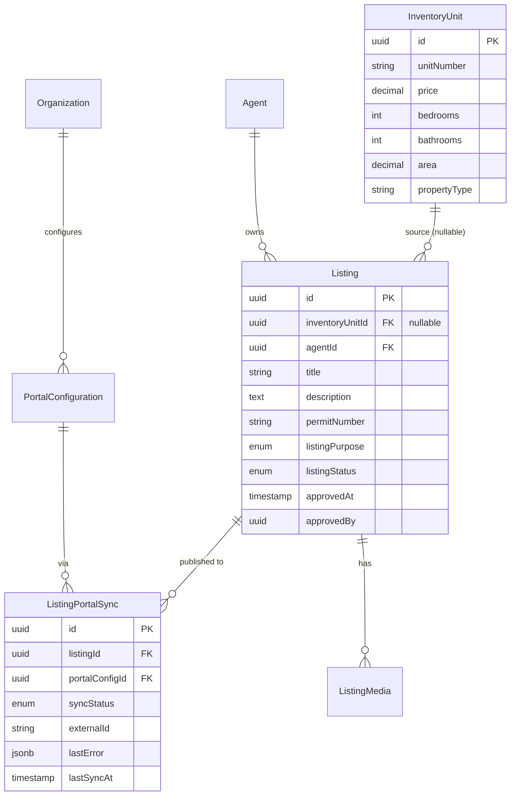
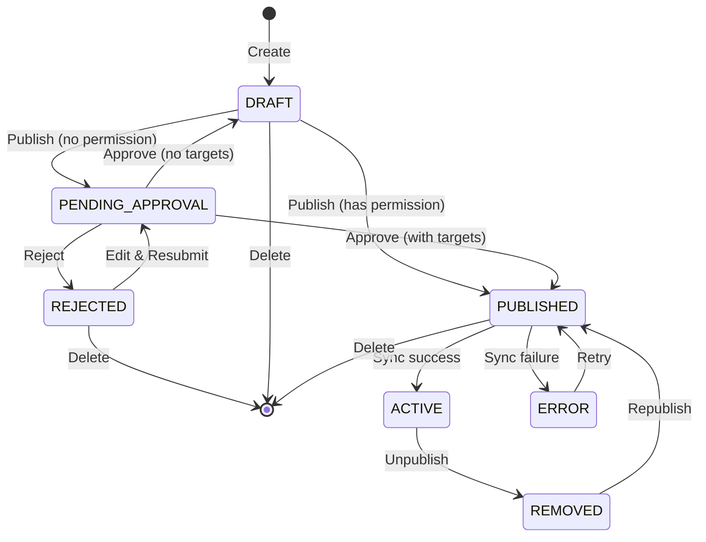

## Overview

The Portal Syndication Module allows real estate agents to publish property listings to three UAE property portals directly from PropWise CRM, and automatically receive leads back into the CRM pipeline.

<Info>
**Version:** 3.0 — Architectural revision introducing `Listing` entity as the marketing layer between `InventoryUnit` (inventory) and `ListingPortalSync` (per-portal state).

**Source files:** `PORTAL_SYNDICATION_RESOURCE.md`, `PROPERTY_FINDER_API_GUIDE.md`, `BAYUT_DUBIZZLE_XML_GUIDE.md`, `PORTAL_SYNDICATION_GAP_ANALYSIS.md`
</Info>

### Three-tier architecture

```
InventoryUnit  →  Listing  →  ListingPortalSync
  (inventory)     (marketing)   (per-portal state)
```

<CardGroup cols={3}>
  <Card title="InventoryUnit" icon="building">
    What the unit *is* — rooms, area, price, physical attributes. Unchanged by portal syndication logic.
  </Card>
  <Card title="Listing" icon="bullhorn">
    How the unit is *marketed* — title, descriptions, permit number, portal classifications, marketing media. Created by an agent from an `InventoryUnit`.
  </Card>
  <Card title="ListingPortalSync" icon="sync">
    Where the listing is *published* and its current state on each portal.
  </Card>
</CardGroup>

<Note>
This separation ensures `InventoryUnit` stays a clean inventory record and the `Listing` layer can eventually support off-plan units (`refUnitId`) without any structural change to the sync system.
</Note>

### Integration model per portal

| Portal | Listing Syndication | Lead Ingestion | Listing Timing |
|---|---|---|---|
| Property Finder | REST API Push (JSON) | Webhook push (primary) + REST poll fallback (15 min) | Real-time (seconds) |
| Bayut | XML Feed Pull (unified) | Pull API polling — scheduled every 15 min | 30 min – 2 hr delay |
| dubizzle | XML Feed Pull (same as Bayut) | Pull API polling — same API + endpoint as Bayut | 30 min – 2 hr delay |

<Warning>
**Bayut / dubizzle lead ingestion:** Bayut and dubizzle share one API endpoint and one Bearer token (per agency). The `source` field in each lead response (`"bayut"` or `"dubizzle"`) determines which `LeadSource` enum value is used when the CRM lead is created. The Bearer token is stored encrypted in the existing `apiKey` field of the Bayut `PortalConfiguration` row. Lead ingestion is gated by `PortalConfiguration.leadIngestionEnabled` (per portal).
</Warning>

### Data flow rules

- Listings flow **one direction only**: CRM → portals (CRM always wins)
- Leads flow **one direction only**: portals → CRM
- Portal data **never** overwrites CRM data
- `Listing` is the **single source of truth** for listing (marketing) content
- `InventoryUnit` is the **single source of truth** for unit inventory data

### Module location

```
src/modules/real-estate/portal-syndication/
```

Imported in `src/modules/real-estate/real-estate.module.ts`.

---

## As-built implementation status

This section reconciles the spec with the shipped implementation. **Where the spec and the build diverge, the build below is authoritative.**

### Phase A — Bayut/dubizzle outbound (XML feed)

<Check>**Status:** BUILT</Check>

<Accordion title="Self-contained Listing entity">
Every field any portal needs now lives on `Listing` (snapshotted from the unit in linked mode via `ListingService.copyUnitToListing`, or entered directly in manual mode). Adapters + `PortalValidationService` read ONLY `listing.X` — never `listing.inventoryUnit.X`. 

**Key changes:**
- `inventoryUnit` FK is **nullable** (manual listings have none)
- New `ListingPurpose` enum (`Sale`/`Rent`)
- New columns added by `Migration20260531120000_SelfContainedListingFields`
</Accordion>

<Accordion title="Two creation modes">
Both converge on `ListingService.create(dto, userId, orgId)`:
- **Linked mode:** Snapshots then applies DTO overrides
- **Manual mode:** Direct entry without unit reference
- `refreshFromUnit` re-pulls snapshot fields while preserving marketing content + agent overrides
</Accordion>

<Accordion title="Centralized value transforms">
Located in `src/modules/shared/portal-value-map.ts` (sibling to `property-type-portal-map.ts`):

- `purposeToBayut` / `purposeToPfPriceType`
- `furnishedToBayut` / `furnishedToPf`
- `bedroomsToBayut` / `bedroomsToPf`
- `bathroomsToBayut` / `bathroomsToPf`
- `rentalPeriodToBayut`
- `finishingToPf`
- `emirateToPfCompliance` / `emirateToPfUaeEmirate`

Both adapters AND the validator consume these transforms.
</Accordion>

<Accordion title="Bayut/dubizzle feed adapter">
**`BayutDubizzleFeedAdapter`** + CDATA XML serializer (`utils/bayut-xml.serializer.ts`).

**Property reference format:**
```
Property_Ref_No = UNIT-{orgShortCode}-{listing.id}
```

With null-`orgShortCode` fallback.
</Accordion>

<Accordion title="Public feed endpoint">
**Endpoint:** `GET /portal-syndication/feeds/:orgId?token=`

- `@PublicEndpoint` decorator
- `PortalFeedController` + `PortalFeedService`
- Built live via `executeWithBypass`
- Includes published rows as `Property_Status=live`
- Includes recently-removed rows as `deleted` for ≥48h (F2) so portals delist promptly
</Accordion>

<Accordion title="Sync state machine">
**Valid transitions updated:**
- `DRAFT → PUBLISHED` ADDED for feed portals
- Mirrors existing `REMOVED → PUBLISHED`
- `PENDING → PUBLISHED` remains invalid
</Accordion>

#### Publish authorization flow

<Steps>
  <Step title="Gate A: Permission check">
    `SyndicationService.publish` checks `real_estate.listing.publish` permission
    - **With permission:** Proceed to publish
    - **Without permission:** Move to `ListingStatus.PENDING_APPROVAL`
    
    A `real_estate.manage` user uses `POST /:listingId/approve|reject` to review
  </Step>
  
  <Step title="Rejection handling">
    **Reject moves listing to `ListingStatus.REJECTED`** and persists:
    - `rejectionReason`
    - `rejectedAt`
    - `rejectedBy`
    
    The submitter can:
    - Edit and resubmit (publish → back to `PENDING_APPROVAL`, clears rejection)
    - Delete the listing
  </Step>
  
  <Step title="Approval honors publish intent">
    **Approve** examines `publishOnApproval` flag:
    - **With portal targets:** Auto-publish to them (→ ACTIVE)
    - **Approval-only request:** Vets into plain DRAFT without publishing
    
    **Stamps approval metadata:**
    - `Listing.approvedAt`
    - `Listing.approvedBy`
    
    (Set once, never cleared)
  </Step>
</Steps>

<Info>
**Requests view:** A `real_estate.manage`-only view (`?type=requests`) lists the `PENDING_APPROVAL` + `REJECTED` queue. Approved listings drop out automatically.
</Info>

#### Owner self-manage bypass

<Warning>
The approval gate only blocks a non-publisher's **first** publish. Once `Listing.approvedAt` is set, the listing's **owner** (publisher `createdBy` / `agent` / linked-unit `unitManager`) can publish/unpublish/toggle portals **directly**.
</Warning>

**Bypass logic:**
- `SyndicationService.publish` skips Gate A for `approvedAt != null && isOwner`
- Treats owner as manager of their own listing
- New listing (`approvedAt == null`) or non-owner without permission still routes through approval
- Gate B for feed portals is SKIPPED (permit stays mandatory; Bayut/DLD verify post-crawl)

**Frontend behavior:**
- Shows **Portals + Leads** tabs to owner once `approvedAt` is set
- Shows publish/toggle controls
- Hides **Submit for approval** footer/menu item

**Available endpoints:**
- `publish`
- `approve`
- `reject`
- `unpublish`
- `refresh-from-unit`

<Note>
**Delete operation:** `DELETE /:listingId` soft-deletes (`isDeleted=true`) after removing from portals. No user-facing archived state. A `real_estate.manage` user may delete **any** listing (including `PENDING_APPROVAL` / `REJECTED`) from the Requests queue.
</Note>

#### Listing approval notifications

All approval events emit notifications via `EventEmitter2` (handled by `RealEstateEventListener`):

<AccordionGroup>
  <Accordion title="Submit for approval">
    **Event:** `LISTING_APPROVAL_REQUESTED`
    
    **Recipients:** Every `real_estate.manage` approver (bulk; resolved via `PermissionService.getUserIdsWithOrgPermission`)
  </Accordion>
  
  <Accordion title="Approve">
    **Event:** `LISTING_APPROVED`
    
    **Recipients:** The publisher (`createdBy`)
    
    **Payload:** `published` field indicates auto-publish vs approval-only
  </Accordion>
  
  <Accordion title="Reject">
    **Event:** `LISTING_REJECTED`
    
    **Recipients:** The publisher (with rejection reason)
  </Accordion>
  
  <Accordion title="Delete">
    **Event:** `LISTING_DELETED`
    
    **Recipients:** The publisher, ONLY when the deleter is not the publisher
  </Accordion>
</AccordionGroup>

<Tip>
See `NOTIFICATION_IMPLEMENTATION_GUIDE.md` → "Implemented Real Estate Listing Approval Notification Types" for complete implementation details.
</Tip>

#### Inventory cascade (user choice on delete)

The `inventory-unit.deleted` event is emitted from `InventoryUnitService.softDelete` and carries `removeLinkedListings` — the user's choice in the delete modal.

<Tabs>
  <Tab title="removeLinkedListings = true (default)">
    `PortalSyndicationEventListener.handleUnitDeleted` performs:
    1. Remove unit's listings from all portals (`SyndicationService.removeFromAllPortals`)
    2. Archive them (`ListingService.archiveByUnit`, passing deleting actor for audit attribution)
  </Tab>
  
  <Tab title="removeLinkedListings = false">
    Keep listings live but sever unit link:
    - `ListingService.unlinkFromUnit` sets `inventoryUnit = null`
    - Turns each into a self-contained manual listing
    - User can keep editing/publishing
  </Tab>
</Tabs>

**API parameter:**
```
DELETE /inventory/units/:id?removeLinkedListings=true|false
```

String `"false"` is the only opt-out; anything else defaults to remove.

<Warning>
Event-driven to avoid a two-way `forwardRef`. Inventory units are **soft-deleted only — never archived** (there is no `isArchived` write path on `InventoryUnit`). Intentionally **no `inventory-unit.archived` event** and no archive-branch listener.
</Warning>

---

### Phase A.5 — Unified inbound lead capture

<Check>**Status:** BUILT</Check>

#### New lead capture module

**Location:** `src/modules/crm/lead-capture/`

**Core components:**
- `LeadCaptureService.capture()` — Central capture orchestrator
- `CapturedLeadInput` contract
- `LeadCaptureSource` interface
- `LeadCaptureSourceRegistry`
- Org-default `LeadCaptureSettings`
- `CapturedLead` idempotency ledger
- Source-agnostic **`lead-ingestion`** pg-boss queue
- `LeadIngestionWorker`

<Info>
This **generalizes** the spec's portal-only `portal-lead-ingestion`/`PortalLeadWorkerService` architecture.

**Migration:** `Migration20260531130000_LeadCaptureFoundation` (+ RLS)
</Info>

#### Bayut lead capture implementation

<CodeGroup>

```typescript BayutLeadParserService
// Pure parser: 7 shapes → NormalizedBayutLead
class BayutLeadParserService {
  parse(rawLead: any): NormalizedBayutLead {
    // Normalizes 7 different Bayut API response shapes
  }
}
```

```typescript BayutLeadCaptureAdapter
// Implements LeadCaptureSource interface
class BayutLeadCaptureAdapter implements LeadCaptureSource {
  async capture(input: CapturedLeadInput): Promise<void> {
    // Enqueues to lead-ingestion queue
  }
}
```

```typescript BayutLeadPollerService
// Scheduled polling service
class BayutLeadPollerService {
  @Cron('*/15 * * * *') // Every 15 minutes
  async pollLeads(): Promise<void> {
    // Cross-org polling
  }
}
```

</CodeGroup>

**Polling behavior:**

<Steps>
  <Step title="Select configurations">
    Queries Bayut rows with:
    - `leadIngestionEnabled = true`
    - Valid API token present
  </Step>
  
  <Step title="Decrypt credentials">
    Decrypts Bayut Pull API Bearer token from `PortalConfiguration.apiKey`
  </Step>
  
  <Step title="Poll 7 endpoint combinations">
    Retrieves leads from all Bayut API endpoints
  </Step>
  
  <Step title="Filter dubizzle leads">
    Drops dubizzle-source leads unless the org's dubizzle row has `leadIngestionEnabled = true`
  </Step>
  
  <Step title="Enqueue for processing">
    Enqueues valid leads to `lead-ingestion` queue
  </Step>
  
  <Step title="Handle authentication errors">
    On 401: Does NOT advance `lastLeadPollAt` (will retry on next cycle)
  </Step>
</Steps>

**Configuration:**
```typescript
app.bayut.leadApiBaseUrl
```

---

### Phase B — Property Finder (REST push)

<Check>**Status:** BUILT</Check>

#### Core services

<AccordionGroup>
  <Accordion title="PfTokenService">
    - 30-minute token cache
    - Invalidate-on-401 logic
    - Automatic refresh handling
  </Accordion>
  
  <Accordion title="PfLocationMappingService">
    - 24-hour cache
    - Maps CRM locations to Property Finder location IDs
  </Accordion>
  
  <Accordion title="PfAgentMappingService">
    - 24-hour cache
    - `refreshOrgAgentMappings` method
    - Replaces 501 stub
  </Accordion>
  
  <Accordion title="PfComplianceService">
    - Validates permit numbers
    - Checks DLD compliance requirements
  </Accordion>
  
  <Accordion title="PfCreditService">
    - Tracks listing credit usage
    - Validates sufficient credits before publish
  </Accordion>
  
  <Accordion title="ListingImageService">
    - Sharp-based image validation
    - Auto-fix for common issues
    - `processedMedia` cache with `constraintHash`
  </Accordion>
</AccordionGroup>

#### Property Finder adapter

**`PropertyFinderAdapter`** implements 6-step publish process:

<Steps>
  <Step title="Validate listing data">
    Ensure all required fields meet Property Finder requirements
  </Step>
  
  <Step title="Transform to PF format">
    Convert CRM listing format to Property Finder API schema
  </Step>
  
  <Step title="Process and upload media">
    Validate images, apply fixes, upload to Property Finder
  </Step>
  
  <Step title="Create/update listing">
    POST or PATCH to Property Finder API
  </Step>
  
  <Step title="Update sync state">
    Record publication status in `ListingPortalSync`
  </Step>
  
  <Step title="Handle errors">
    Retry transient failures, log permanent errors
  </Step>
</Steps>

#### Lead ingestion

<Tabs>
  <Tab title="Webhook (Primary)">
    **Components:**
    - `PfWebhookSubscriptionService` — Manages webhook subscriptions
    - Public `PortalWebhookController` — Receives webhooks
    - HMAC validation over raw body
    
    **Endpoint security:**
    - `@PublicEndpoint` decorator
    - HMAC signature verification
    - Raw body preservation for signature check
  </Tab>
  
  <Tab title="REST Poll (Fallback)">
    **Behavior:**
    - Runs every 15 minutes
    - Catches leads missed by webhooks
    - Uses same `PfLeadCaptureAdapter`
    - Deduplication via `CapturedLead` ledger
  </Tab>
</Tabs>

#### Background workers

<CardGroup cols={2}>
  <Card title="PfSyndicationWorker" icon="gears">
    Processes `pf-syndication` queue jobs
    
    Handles:
    - Async publish requests
    - Batch operations
    - Retry logic
  </Card>
  
  <Card title="SyncReconciliationService" icon="rotate">
    Cron-based reconciliation
    
    Ensures:
    - CRM state matches portal state
    - Stale syncs are detected
    - Drift is corrected
  </Card>
</CardGroup>

<Card title="ApiKeyExpirationCheckService" icon="clock">
  **Cron job** that monitors API key expiration
  
  Actions:
  - Sends alerts before expiration
  - Disables expired configurations
  - Notifies administrators
</Card>

#### HTTP client

<Info>
All Property Finder and Bayut HTTP communication uses plain `axios` (the codebase convention). No custom HTTP service wrappers.
</Info>

**Configuration:**
```typescript
app.propertyFinder.apiBaseUrl
```

---

## Architecture deep dive

### Entity relationship diagram



### State machine



### Listing creation modes

<Tabs>
  <Tab title="Linked Mode">
    **Creates listing from existing InventoryUnit**
    
    ```typescript
    // Snapshot unit data to listing
    const listing = await listingService.create({
      inventoryUnitId: unit.id,
      agentId: agent.id,
      // Marketing overrides
      title: 'Custom Title',
      description: 'Custom Description',
      // ... other fields
    }, userId, orgId);
    ```
    
    **Characteristics:**
    - `inventoryUnit` FK populated
    - Physical attributes snapshotted from unit
    - Marketing fields customizable
    - `refreshFromUnit()` available to re-sync
  </Tab>
  
  <Tab title="Manual Mode">
    **Creates standalone listing without unit**
    
    ```typescript
    // Enter all data directly
    const listing = await listingService.create({
      inventoryUnitId: null, // No unit link
      agentId: agent.id,
      // All fields required
      title: 'New Property',
      bedrooms: 3,
      bathrooms: 2,
      area: 150,
      price: 1200000,
      // ... complete listing data
    }, userId, orgId);
    ```
    
    **Characteristics:**
    - `inventoryUnit` FK is null
    - All fields entered manually
    - No refresh capability
    - Ideal for off-plan or external properties
  </Tab>
</Tabs>

### Portal-specific adapters

<CodeGroup>

```typescript PropertyFinderAdapter
class PropertyFinderAdapter extends BasePortalAdapter {
  async publish(listing: Listing): Promise<SyncResult> {
    // 1. Validate compliance
    await this.pfCompliance.validate(listing);
    
    // 2. Check credits
    await this.pfCredit.ensureSufficientCredits(orgId);
    
    // 3. Transform data
    const pfData = this.transformToPfFormat(listing);
    
    // 4. Upload media
    const mediaUrls = await this.uploadMedia(listing.media);
    
    // 5. Create/update on PF
    const response = await this.pfApi.createListing(pfData);
    
    // 6. Update sync state
    return this.recordSuccess(response);
  }
  
  private transformToPfFormat(listing: Listing) {
    return {
      offering_type: purposeToPfPriceType(listing.purpose),
      property_type: propertyTypeToPf(listing.propertyType),
      furnishing: furnishedToPf(listing.furnished),
      bedrooms: bedroomsToPf(listing.bedrooms),
      bathrooms: bathroomsToPf(listing.bathrooms),
      // ... complete transformation
    };
  }
}
```

```typescript BayutDubizzleFeedAdapter
class BayutDubizzleFeedAdapter extends BasePortalAdapter {
  generateFeed(listings: Listing[], orgId: string): string {
    const xml = new XMLBuilder({
      format: true,
      ignoreAttributes: false,
      cdataTagName: '__cdata'
    });
    
    const properties = listings.map(listing => ({
      Property_Ref_No: this.generateRefNo(listing, orgId),
      Property_Status: this.getStatus(listing),
      Permit_Number: listing.permitNumber,
      Property_Title: { __cdata: listing.title },
      Property_Description: { __cdata: listing.description },
      Price: this.formatPrice(listing),
      Unit_Type: purposeToBayut(listing.purpose),
      Bedrooms: bedroomsToBayut(listing.bedrooms),
      Bathrooms: bathroomsToBayut(listing.bathrooms),
      Furnished: furnishedToBayut(listing.furnished),
      // ... complete feed structure
    }));
    
    return xml.build({ list: { property: properties } });
  }
  
  private generateRefNo(listing: Listing, orgId: string): string {
    const org = await this.orgService.findOne(orgId);
    const shortCode = org.shortCode || 'ORG';
    return `UNIT-${shortCode}-${listing.id}`;
  }
}
```

</CodeGroup>

---

## API reference

### Listing management

<AccordionGroup>
  <Accordion title="Create listing">
    **Endpoint:** `POST /portal-syndication/listings`
    
    **Permission:** `real_estate.listing.create`
    
    **Request body:**
    ```json
    {
      "inventoryUnitId": "uuid | null",
      "agentId": "uuid",
      "title": "string",
      "description": "string",
      "purpose": "Sale | Rent",
      "price": "number",
      "bedrooms": "number",
      "bathrooms": "number",
      "area": "number",
      "propertyType": "string",
      "permitNumber": "string",
      "furnished": "Furnished | Unfurnished | PartFurnished",
      "amenities": ["string"],
      "media": [
        {
          "url": "string",
          "type": "Image | Video",
          "order": "number"
        }
      ]
    }
    ```
    
    **Response:** `201 Created`
    ```json
    {
      "id": "uuid",
      "status": "DRAFT",
      "createdAt": "timestamp",
      "createdBy": "uuid"
    }
    ```
  </Accordion>
  
  <Accordion title="Update listing">
    **Endpoint:** `PATCH /portal-syndication/listings/:id`
    
    **Permission:** `real_estate.listing.update` OR owner
    
    **Request body:** Partial listing object
    
    **Response:** `200 OK` with updated listing
  </Accordion>
  
  <Accordion title="Refresh from unit">
    **Endpoint:** `POST /portal-syndication/listings/:id/refresh-from-unit`
    
    **Permission:** Owner only
    
    **Behavior:**
    - Re-snapshots physical attributes from linked `InventoryUnit`
    - Preserves marketing content (title, description)
    - Preserves agent overrides
    
    **Response:** `200 OK` with refreshed listing
  </Accordion>
  
  <Accordion title="Delete listing">
    **Endpoint:** `DELETE /portal-syndication/listings/:id`
    
    **Permission:** `real_estate.manage` OR owner
    
    **Behavior:**
    1. Remove from all published portals
    2. Soft delete (`isDeleted = true`)
    3. Notify publisher if deleter ≠ publisher
    
    **Response:** `204 No Content`
  </Accordion>
</AccordionGroup>

### Publishing and approval

<AccordionGroup>
  <Accordion title="Publish listing">
    **Endpoint:** `POST /portal-syndication/listings/:id/publish`
    
    **Permission:** `real_estate.listing.publish` OR approved owner
    
    **Request body:**
    ```json
    {
      "portals": ["PropertyFinder", "Bayut", "dubizzle"],
      "publishOnApproval": true
    }
    ```
    
    **Gate A logic:**
    ```typescript
    if (!hasPublishPermission && !listing.approvedAt) {
      // Route to approval
      listing.status = 'PENDING_APPROVAL';
      return { status: 'pending_approval', listingId };
    }
    
    if (listing.approvedAt && isOwner) {
      // Owner bypass - publish directly
      return await this.syndicate(listing, portals);
    }
    
    // Manager or approved owner - publish
    return await this.syndicate(listing, portals);
    ```
    
    **Response:** `200 OK`
    ```json
    {
      "status": "published | pending_approval",
      "portals": [
        {
          "portal": "PropertyFinder",
          "status": "ACTIVE | PENDING | ERROR",
          "externalId": "string",
          "lastSyncAt": "timestamp"
        }
      ]
    }
    ```
  </Accordion>
  
  <Accordion title="Approve listing">
    **Endpoint:** `POST /portal-syndication/listings/:id/approve`
    
    **Permission:** `real_estate.manage`
    
    **Request body:**
    ```json
    {
      "note": "string (optional)"
    }
    ```
    
    **Behavior:**
    1. Set `approvedAt` / `approvedBy` (immutable)
    2. If `publishOnApproval` was true: auto-publish to target portals
    3. If no targets: move to `DRAFT`
    4. Emit `LISTING_APPROVED` notification to publisher
    
    **Response:** `200 OK`
  </Accordion>
  
  <Accordion title="Reject listing">
    **Endpoint:** `POST /portal-syndication/listings/:id/reject`
    
    **Permission:** `real_estate.manage`
    
    **Request body:**
    ```json
    {
      "reason": "string (required)"
    }
    ```
    
    **Behavior:**
    1. Move to `REJECTED` status
    2. Set `rejectionReason`, `rejectedAt`, `rejectedBy`
    3. Emit `LISTING_REJECTED` notification to publisher
    
    **Response:** `200 OK`
  </Accordion>
  
  <Accordion title="Unpublish listing">
    **Endpoint:** `POST /portal-syndication/listings/:id/unpublish`
    
    **Permission:** `real_estate.listing.publish` OR approved owner
    
    **Request body:**
    ```json
    {
      "portals": ["PropertyFinder", "Bayut"] // Optional, defaults to all
    }
    ```
    
    **Behavior:**
    - Removes listing from specified portals
    - Updates sync status to `REMOVED`
    - For feed portals: keeps in feed as `Property_Status=deleted` for 48h
    
    **Response:** `200 OK`
  </Accordion>
</AccordionGroup>

### Portal configuration

<AccordionGroup>
  <Accordion title="Get portal configurations">
    **Endpoint:** `GET /portal-syndication/portals`
    
    **Permission:** `real_estate.manage`
    
    **Response:** `200 OK`
    ```json
    [
      {
        "id": "uuid",
        "portal": "PropertyFinder | Bayut | dubizzle",
        "isEnabled": true,
        "leadIngestionEnabled": true,
        "apiKey": "encrypted",
        "feedToken": "string (feed portals only)",
        "webhookSecret": "string (PF only)",
        "lastLeadPollAt": "timestamp",
        "config": {
          "agentMappings": {},
          "locationMappings": {}
        }
      }
    ]
    ```
  </Accordion>
  
  <Accordion title="Update portal configuration">
    **Endpoint:** `PATCH /portal-syndication/portals/:id`
    
    **Permission:** `real_estate.manage`
    
    **Request body:**
    ```json
    {
      "isEnabled": true,
      "leadIngestionEnabled": true,
      "apiKey": "string",
      "config": {}
    }
    ```
    
    **Response:** `200 OK` with updated configuration
  </Accordion>
  
  <Accordion title="Generate feed token">
    **Endpoint:** `POST /portal-syndication/portals/:id/generate-token`
    
    **Permission:** `real_estate.manage`
    
    **Portal:** Bayut, dubizzle only
    
    **Response:** `200 OK`
    ```json
    {
      "feedToken": "string",
      "feedUrl": "https://api.propwise.io/portal-syndication/feeds/:orgId?token=xxx"
    }
    ```
  </Accordion>
  
  <Accordion title="Get public feed">
    **Endpoint:** `GET /portal-syndication/feeds/:orgId?token=xxx`
    
    **Public:** Yes (no authentication required)
    
    **Portal:** Bayut, dubizzle
    
    **Validation:** Token must match `PortalConfiguration.feedToken`
    
    **Response:** `200 OK` with XML feed
    ```xml
    <?xml version="1.0" encoding="UTF-8"?>
    <list last_update="2025-01-15 10:30:00" listing_count="25">
      <property>
        <Property_Ref_No>UNIT-ABC-123</Property_Ref_No>
        <Property_Status>live</Property_Status>
        <Permit_Number><![CDATA[71420123456]]></Permit_Number>
        <!-- ... complete property -->
      </property>
      <!-- deleted listings (48h window) -->
      <property>
        <Property_Ref_No>UNIT-ABC-999</Property_Ref_No>
        <Property_Status>deleted</Property_Status>
      </property>
    </list>
    ```
  </Accordion>
</AccordionGroup>

### Lead management

<AccordionGroup>
  <Accordion title="Property Finder webhook">
    **Endpoint:** `POST /portal-syndication/webhooks/property-finder`
    
    **Public:** Yes (HMAC authenticated)
    
    **Headers:**
    ```
    X-PF-Signature: HMAC-SHA256 signature
    ```
    
    **Request body:**
    ```json
    {
      "event": "lead.created",
      "data": {
        "id": "string",
        "listing_id": "string",
        "name": "string",
        "email": "string",
        "phone": "string",
        "message": "string",
        "created_at": "timestamp"
      }
    }
    ```
    
    **Validation:**
    1. Verify HMAC signature over raw body
    2. Check webhook secret from `PortalConfiguration`
    3. Deduplicate via `CapturedLead` ledger
    
    **Response:** `200 OK`
  </Accordion>
  
  <Accordion title="Manual lead sync">
    **Endpoint:** `POST /portal-syndication/portals/:id/sync-leads`
    
    **Permission:** `real_estate.manage`
    
    **Behavior:**
    - Triggers immediate poll for specified portal
    - Bypasses normal 15-minute schedule
    - Returns count of new leads captured
    
    **Response:** `200 OK`
    ```json
    {
      "leadsPolled": 15,
      "leadsNew": 3,
      "leadsSkipped": 12
    }
    ```
  </Accordion>
</AccordionGroup>

### Monitoring and reconciliation

<AccordionGroup>
  <Accordion title="Get sync status">
    **Endpoint:** `GET /portal-syndication/listings/:id/sync-status`
    
    **Permission:** Owner OR `real_estate.listing.read`
    
    **Response:** `200 OK`
    ```json
    {
      "listingId": "uuid",
      "syncStates": [
        {
          "portal": "PropertyFinder",
          "status": "ACTIVE | PENDING | ERROR | REMOVED",
          "externalId": "string",
          "lastSyncAt": "timestamp",
          "lastError": {
            "code": "string",
            "message": "string",
            "details": {}
          },
          "retryCount": 0
        }
      ]
    }
    ```
  </Accordion>
  
  <Accordion title="Trigger reconciliation">
    **Endpoint:** `POST /portal-syndication/reconcile`
    
    **Permission:** `real_estate.manage`
    
    **Request body:**
    ```json
    {
      "portal": "PropertyFinder | Bayut | dubizzle (optional)",
      "listingIds": ["uuid"] // Optional, defaults to all
    }
    ```
    
    **Behavior:**
    - Compares CRM state vs portal state
    - Detects drift (missing, extra, or mismatched listings)
    - Optionally auto-corrects discrepancies
    
    **Response:** `200 OK`
    ```json
    {
      "checked": 150,
      "synced": 145,
      "drift": [
        {
          "listingId": "uuid",
          "portal": "PropertyFinder",
          "issue": "missing_on_portal | extra_on_portal | status_mismatch",
          "corrected": true
        }
      ]
    }
    ```
  </Accordion>
</AccordionGroup>

---

## Data models

### Listing entity

<CodeGroup>

```typescript Listing
interface Listing {
  // Identity
  id: string; // uuid
  organizationId: string; // uuid
  createdBy: string; // uuid
  createdAt: Date;
  updatedAt: Date;
  isDeleted: boolean;
  
  // Source link (nullable for manual listings)
  inventoryUnitId?: string; // uuid, nullable
  inventoryUnit?: InventoryUnit;
  
  // Ownership
  agentId: string; // uuid
  agent: Agent;
  
  // Core attributes (snapshotted from unit or manual entry)
  purpose: ListingPurpose; // 'Sale' | 'Rent'
  propertyType: string;
  bedrooms: number;
  bathrooms: number;
  area: number; // sq ft
  price: number;
  rentalPeriod?: RentalPeriod; // For rent only
  
  // Marketing content
  title: string; // max 100 chars
  description: string; // max 5000 chars
  
  // Portal classifications
  furnished: FurnishedStatus; // 'Furnished' | 'Unfurnished' | 'PartFurnished'
  finishing?: FinishingStatus; // Property Finder only
  amenities: string[]; // JSON array
  
  // Compliance
  permitNumber: string; // Required for publish
  
  // Location (snapshotted or manual)
  emirate: string;
  community: string;
  subCommunity?: string;
  building?: string;
  unitNumber?: string;
  
  // Status and approval
  status: ListingStatus;
  approvedAt?: Date; // Set once, never cleared
  approvedBy?: string; // uuid
  rejectedAt?: Date;
  rejectedBy?: string; // uuid
  rejectionReason?: string;
  
  // Relations
  media: ListingMedia[];
  portalSyncs: ListingPortalSync[];
}
```

```typescript Enums
enum ListingPurpose {
  Sale = 'Sale',
  Rent = 'Rent'
}

enum ListingStatus {
  DRAFT = 'DRAFT',
  PENDING_APPROVAL = 'PENDING_APPROVAL',
  REJECTED = 'REJECTED',
  PUBLISHED = 'PUBLISHED' // At least one portal sync active
}

enum FurnishedStatus {
  Furnished = 'Furnished',
  Unfurnished = 'Unfurnished',
  PartFurnished = 'PartFurnished'
}

enum FinishingStatus {
  Fitted = 'Fitted',
  Unfitted = 'Unfitted',
  Loft = 'Loft',
  ShellAndCore = 'ShellAndCore'
}

enum RentalPeriod {
  Yearly = 'Yearly',
  Monthly = 'Monthly',
  Weekly = 'Weekly',
  Daily = 'Daily'
}
```

</CodeGroup>

### ListingPortalSync entity

```typescript
interface ListingPortalSync {
  // Identity
  id: string; // uuid
  listingId: string; // uuid
  listing: Listing;
  portalConfigId: string; // uuid
  portalConfig: PortalConfiguration;
  
  // Sync state
  syncStatus: SyncStatus;
  externalId?: string; // Portal's ID for this listing
  externalUrl?: string; // Direct link to listing on portal
  
  // Sync history
  lastSyncAt?: Date;
  lastSuccessAt?: Date;
  lastError?: {
    code: string;
    message: string;
    details: any;
    occurredAt: Date;
  };
  retryCount: number; // Reset on success
  
  // Timestamps
  createdAt: Date;
  updatedAt: Date;
  removedAt?: Date; // When unpublished
}

enum SyncStatus {
  PENDING = 'PENDING',     // Queued for first sync
  ACTIVE = 'ACTIVE',       // Successfully published
  ERROR = 'ERROR',         // Sync failed, needs retry
  REMOVED = 'REMOVED'      // Unpublished from portal
}
```

### PortalConfiguration entity

```typescript
interface PortalConfiguration {
  // Identity
  id: string; // uuid
  organizationId: string; // uuid
  portal: Portal;
  
  // Enablement
  isEnabled: boolean; // Master switch
  leadIngestionEnabled: boolean; // Gate for lead polling/webhooks
  
  // Credentials (encrypted at rest)
  apiKey?: string; // PF API key, or Bayut/dubizzle lead pull Bearer token
  feedToken?: string; // Bayut/dubizzle feed token (organization generates)
  webhookSecret?: string; // Property Finder only
  
  // Polling state
  lastLeadPollAt?: Date;
  
  // Portal-specific configuration
  config: {
    agentMappings?: Record<string, string>; // CRM agent ID → Portal agent ID
    locationMappings?: Record<string, string>; // CRM location → Portal location ID
    defaultAgentId?: string; // Fallback for unmapped agents
    creditBalance?: number; // Property Finder only
  };
  
  // Timestamps
  createdAt: Date;
  updatedAt: Date;
}

enum Portal {
  PropertyFinder = 'PropertyFinder',
  Bayut = 'Bayut',
  dubizzle = 'dubizzle'
}
```

### ListingMedia entity

```typescript
interface ListingMedia {
  id: string; // uuid
  listingId: string; // uuid
  listing: Listing;
  
  // Media details
  type: MediaType;
  url: string; // Original URL
  processedUrl?: string; // After validation/fix (cached)
  constraintHash?: string; // Cache key for processed version
  
  // Ordering
  order: number; // Display order (0-indexed)
  isPrimary: boolean; // First image flagged as primary
  
  // Validation
  width?: number;
  height?: number;
  sizeBytes?: number;
  validationStatus?: 'pending' | 'valid' | 'invalid';
  validationError?: string;
  
  // Timestamps
  createdAt: Date;
  updatedAt: Date;
}

enum MediaType {
  Image = 'Image',
  Video = 'Video',
  VirtualTour = 'VirtualTour'
}
```

### CapturedLead entity (idempotency ledger)

```typescript
interface CapturedLead {
  id: string; // uuid
  organizationId: string; // uuid
  
  // Source identification
  source: LeadCaptureSourceType; // 'PropertyFinder' | 'Bayut' | 'dubizzle' | ...
  externalId: string; // Portal's lead ID
  
  // Deduplication
  fingerprintHash: string; // SHA-256 of normalized lead data
  
  // Processing state
  status: 'pending' | 'processed' | 'failed';
  crmLeadId?: string; // uuid, set after CRM lead created
  
  // Retry
  attemptCount: number;
  lastAttemptAt?: Date;
  lastError?: string;
  
  // Raw data
  rawPayload: any; // Original webhook/API response
  
  // Timestamps
  capturedAt: Date;
  processedAt?: Date;
}

enum LeadCaptureSourceType {
  PropertyFinder = 'PropertyFinder',
  Bayut = 'Bayut',
  dubizzle = 'dubizzle',
  Website = 'Website',
  Manual = 'Manual'
  // ... extensible for future sources
}
```

---

## Portal-specific requirements

### Property Finder

<Tabs>
  <Tab title="Authentication">
    **Token management:**
    - OAuth2 Bearer tokens
    - 30-minute cache
    - Auto-refresh on 401
    
    **Token service:**
    ```typescript
    class PfTokenService {
      async getToken(orgId: string): Promise<string> {
        // Check cache
        const cached = await this.cache.get(`pf:token:${orgId}`);
        if (cached) return cached;
        
        // Request new token
        const config = await this.getPortalConfig(orgId);
        const response = await axios.post(
          `${this.apiBaseUrl}/oauth/token`,
          { grant_type: 'client_credentials' },
          { headers: { Authorization: `Bearer ${config.apiKey}` } }
        );
        
        // Cache for 30 minutes
        await this.cache.set(
          `pf:token:${orgId}`,
          response.data.access_token,
          1800
        );
        
        return response.data.access_token;
      }
    }
    ```
  </Tab>
  
  <Tab title="Compliance">
    **Requirements:**
    - Valid DLD permit number (7 digits)
    - Correct property type classification
    - Minimum 1 photo, maximum 25 photos
    - Each photo: 1000×667px minimum, 10MB max, JPEG/PNG
    
    **Validation service:**
    ```typescript
    class PfComplianceService {
      async validate(listing: Listing): Promise<ValidationResult> {
        const errors: string[] = [];
        
        // Permit number
        if (!this.isDldPermitValid(listing.permitNumber)) {
          errors.push('Invalid DLD permit number format');
        }
        
        // Media
        if (listing.media.length === 0) {
          errors.push('At least 1 photo required');
        }
        if (listing.media.length > 25) {
          errors.push('Maximum 25 photos allowed');
        }
        
        // Image dimensions
        for (const media of listing.media.filter(m => m.type === 'Image')) {
          if (media.width < 1000 || media.height < 667) {
            errors.push(`Image ${media.order + 1} below minimum dimensions`);
          }
        }
        
        return {
          valid: errors.length === 0,
          errors
        };
      }
      
      private isDldPermitValid(permit: string): boolean {
        return /^\d{7}$/.test(permit);
      }
    }
    ```
  </Tab>
  
  <Tab title="Credit System">
    **Credit consumption:**
    - Each publish: 1 credit
    - Updates: Free (no additional credit)
    - Removals: Free
    
    **Credit service:**
    ```typescript
    class PfCreditService {
      async ensureSufficientCredits(orgId: string): Promise<void> {
        const balance = await this.getBalance(orgId);
        
        if (balance < 1) {
          throw new InsufficientCreditsError(
            'Insufficient Property Finder credits. Please top up your account.'
          );
        }
      }
      
      async getBalance(orgId: string): Promise<number> {
        // Check cache (24h)
        const cached = await this.cache.get(`pf:credits:${orgId}`);
        if (cached !== null) return cached;
        
        // Fetch from PF API
        const token = await this.pfToken.getToken(orgId);
        const response = await axios.get(
          `${this.apiBaseUrl}/account/credits`,
          { headers: { Authorization: `Bearer ${token}` } }
        );
        
        const balance = response.data.balance;
        await this.cache.set(`pf:credits:${orgId}`, balance, 86400);
        
        return balance;
      }
    }
    ```
  </Tab>
  
  <Tab title="Lead Webhooks">
    **Setup:**
    1. Organization registers webhook URL in PF dashboard
    2. PF sends HMAC-SHA256 signature in `X-PF-Signature` header
    3. CRM validates signature against `webhookSecret`
    
    **Webhook handler:**
    ```typescript
    @Post('webhooks/property-finder')
    @PublicEndpoint()
    async handlePfWebhook(
      @Req() req: RawBodyRequest,
      @Headers('x-pf-signature') signature: string
    ) {
      // Validate HMAC
      const isValid = this.validatePfSignature(
        req.rawBody,
        signature,
        req.organization.pfWebhookSecret
      );
      
      if (!isValid) {
        throw new UnauthorizedException('Invalid webhook signature');
      }
      
      // Capture lead
      await this.leadCapture.capture({
        source: 'PropertyFinder',
        externalId: req.body.data.id,
        organizationId: req.organization.id,
        rawPayload: req.body
      });
      
      return { status: 'received' };
    }
    
    private validatePfSignature(
      body: Buffer,
      signature: string,
      secret: string
    ): boolean {
      const hmac = crypto
        .createHmac('sha256', secret)
        .update(body)
        .digest('hex');
      
      return crypto.timingSafeEqual(
        Buffer.from(signature),
        Buffer.from(hmac)
      );
    }
    ```
  </Tab>
</Tabs>

### Bayut and dubizzle

<Tabs>
  <Tab title="XML Feed Structure">
    **Feed format:**
    ```xml
    <?xml version="1.0" encoding="UTF-8"?>
    <list last_update="2025-01-15 10:30:00" listing_count="25">
      <property>
        <!-- Core identification -->
        <Property_Ref_No>UNIT-ABC-123</Property_Ref_No>
        <Property_Status>live</Property_Status>
        <Permit_Number><![CDATA[71420123456]]></Permit_Number>
        
        <!-- Basic details -->
        <Property_Title><![CDATA[Spacious 2BR in Marina]]></Property_Title>
        <Property_Description><![CDATA[Full description...]]></Property_Description>
        
        <!-- Pricing -->
        <Price>1200000</Price>
        <Unit_Type>Sale</Unit_Type>
        <Rental_Period>Yearly</Rental_Period> <!-- Only for rentals -->
        
        <!-- Physical attributes -->
        <Bedrooms>2</Bedrooms>
        <Bathrooms>2</Bathrooms>
        <Size_in_sqft>1500</Size_in_sqft>
        <Furnished>Yes</Furnished>
        
        <!-- Location -->
        <Emirate>Dubai</Emirate>
        <Community>Dubai Marina</Community>
        <Sub_Community>Marina Gate</Sub_Community>
        <Building_Name>Marina Gate 1</Building_Name>
        
        <!-- Agent -->
        <Agent_Name>John Smith</Agent_Name>
        <Agent_Email>john@agency.com</Agent_Email>
        <Agent_Phone>+971501234567</Agent_Phone>
        
        <!-- Media -->
        <Images>
          <Image_1>https://cdn.propwise.io/image1.jpg</Image_1>
          <Image_2>https://cdn.propwise.io/image2.jpg</Image_2>
        </Images>
        
        <!-- Amenities -->
        <Amenities>Balcony,Gym,Pool,Parking</Amenities>
      </property>
      
      <!-- Deleted listing (48h window) -->
      <property>
        <Property_Ref_No>UNIT-ABC-999</Property_Ref_No>
        <Property_Status>deleted</Property_Status>
      </property>
    </list>
    ```
    
    **CDATA rules:**
    - `Property_Title`
    - `Property_Description`
    - `Permit_Number`
    - All text fields that may contain special characters
  </Tab>
  
  <Tab title="Feed Generation">
    **Feed service:**
    ```typescript
    class PortalFeedService {
      async generateBayutFeed(orgId: string): Promise<string> {
        // Get published listings
        const listings = await this.listingRepo.find({
          where: {
            organizationId: orgId,
            portalSyncs: {
              portalConfig: { portal: In(['Bayut', 'dubizzle']) },
              syncStatus: 'ACTIVE'
            }
          },
          relations: ['media', 'agent', 'portalSyncs']
        });
        
        // Get recently removed (48h window)
        const removed = await this.listingRepo.find({
          where: {
            organizationId: orgId,
            portalSyncs: {
              portalConfig: { portal: In(['Bayut', 'dubizzle']) },
              syncStatus: 'REMOVED',
              removedAt: MoreThan(subHours(new Date(), 48))
            }
          }
        });
        
        // Build feed
        const adapter = new BayutDubizzleFeedAdapter();
        return adapter.generateFeed(listings, removed, orgId);
      }
    }
    ```
  </Tab>
  
  <Tab title="Lead Polling">
    **Poller service:**
    ```typescript
    @Injectable()
    class BayutLeadPollerService {
      @Cron('*/15 * * * *') // Every 15 minutes
      async pollLeads() {
        // Get all orgs with Bayut lead ingestion enabled
        const configs = await this.portalConfigRepo.find({
          where: {
            portal: 'Bayut',
            leadIngestionEnabled: true,
            apiKey: Not(IsNull()) // Has Bearer token
          }
        });
        
        for (const config of configs) {
          try {
            await this.pollOrgLeads(config);
          } catch (error) {
            this.logger.error(
              `Failed to poll Bayut leads for org ${config.organizationId}`,
              error
            );
          }
        }
      }
      
      private async pollOrgLeads(config: PortalConfiguration) {
        // Decrypt Bearer token
        const token = await this.encryption.decrypt(config.apiKey);
        
        // Poll all 7 endpoint combinations
        const endpoints = this.getBayutLeadEndpoints();
        const since = config.lastLeadPollAt || subDays(new Date(), 30);
        
        for (const endpoint of endpoints) {
          const leads = await this.fetchLeads(endpoint, token, since);
          
          for (const lead of leads) {
            // Check if dubizzle-source lead
            if (lead.source === 'dubizzle') {
              // Only keep if dubizzle config has lead ingestion enabled
              const dubizzleConfig = await this.getDubizzleConfig(
                config.organizationId
              );
              
              if (!dubizzleConfig?.leadIngestionEnabled) {
                continue; // Skip dubizzle lead
              }
            }
            
            // Capture lead
            await this.leadCapture.capture({
              source: lead.source === 'bayut' ? 'Bayut' : 'dubizzle',
              externalId: lead.id,
              organizationId: config.organizationId,
              rawPayload: lead
            });
          }
        }
        
        // Update last poll time (only on success)
        config.lastLeadPollAt = new Date();
        await this.portalConfigRepo.save(config);
      }
      
      private async fetchLeads(
        endpoint: string,
        token: string,
        since: Date
      ): Promise<any[]> {
        try {
          const response = await axios.get(endpoint, {
            headers: { Authorization: `Bearer ${token}` },
            params: { from: since.toISOString() }
          });
          
          return response.data.leads || [];
        } catch (error) {
          if (error.response?.status === 401) {
            // Don't advance lastLeadPollAt - will retry next cycle
            throw new UnauthorizedException('Invalid Bayut API token');
          }
          throw error;
        }
      }
    }
    ```
  </Tab>
  
  <Tab title="Lead API Endpoints">
    **7 endpoint combinations:**
    
    ```typescript
    private getBayutLeadEndpoints(): string[] {
      const base = this.configService.get('app.bayut.leadApiBaseUrl');
      
      return [
        `${base}/leads/email`,
        `${base}/leads/call`,
        `${base}/leads/sms`,
        `${base}/leads/whatsapp`,
        `${base}/leads/callback`,
        `${base}/leads/chat`,
        `${base}/leads/tour`
      ];
    }
    ```
    
    **Response format:**
    ```json
    {
      "leads": [
        {
          "id": "string",
          "source": "bayut | dubizzle",
          "type": "email | call | sms | ...",
          "listing_ref": "UNIT-ABC-123",
          "name": "string",
          "email": "string",
          "phone": "string",
          "message": "string",
          "created_at": "timestamp"
        }
      ]
    }
    ```
  </Tab>
</Tabs>

---

## Background jobs

### PG-Boss queues

<AccordionGroup>
  <Accordion title="lead-ingestion queue">
    **Purpose:** Unified lead capture processing (all sources)
    
    **Job structure:**
    ```typescript
    interface LeadIngestionJob {
      capturedLeadId: string; // References CapturedLead table
    }
    ```
    
    **Worker:**
    ```typescript
    @Injectable()
    class LeadIngestionWorker {
      @OnWorkerEvent('lead-ingestion')
      async processLead(job: Job<LeadIngestionJob>) {
        const captured = await this.capturedLeadRepo.findOne(
          job.data.capturedLeadId
        );
        
        if (!captured || captured.status === 'processed') {
          return; // Already processed or missing
        }
        
        try {
          // Get source adapter
          const adapter = this.sourceRegistry.getAdapter(captured.source);
          
          // Parse lead data
          const leadData = await adapter.parse(captured.rawPayload);
          
          // Create CRM lead
          const crmLead = await this.leadService.create({
            organizationId: captured.organizationId,
            source: captured.source,
            ...leadData
          });
          
          // Update captured lead status
          captured.status = 'processed';
          captured.crmLeadId = crmLead.id;
          captured.processedAt = new Date();
          await this.capturedLeadRepo.save(captured);
          
        } catch (error) {
          captured.attemptCount++;
          captured.lastAttemptAt = new Date();
          captured.lastError = error.message;
          
          if (captured.attemptCount >= 3) {
            captured.status = 'failed';
          }
          
          await this.capturedLeadRepo.save(captured);
          throw error; // Re-throw for PG-Boss retry
        }
      }
    }
    ```
    
    **Configuration:**
    - Retry: 3 attempts with exponential backoff
    - Backoff: `[60, 300, 900]` seconds (1m, 5m, 15m)
    - Concurrency: 10
  </Accordion>
  
  <Accordion title="pf-syndication queue">
    **Purpose:** Property Finder listing operations (publish, update, remove)
    
    **Job structure:**
    ```typescript
    interface PfSyndicationJob {
      operation: 'publish' | 'update' | 'remove';
      listingId: string;
      portalSyncId: string;
    }
    ```
    
    **Worker:**
    ```typescript
    @Injectable()
    class PfSyndicationWorker {
      @OnWorkerEvent('pf-syndication')
      async processSyndication(job: Job<PfSyndicationJob>) {
        const { operation, listingId, portalSyncId } = job.data;
        
        const listing = await this.listingRepo.findOne(listingId, {
          relations: ['media', 'agent']
        });
        
        const sync = await this.syncRepo.findOne(portalSyncId);
        
        try {
          const adapter = new PropertyFinderAdapter();
          let result: SyncResult;
          
          switch (operation) {
            case 'publish':
              result = await adapter.publish(listing);
              break;
            case 'update':
              result = await adapter.update(listing, sync.externalId);
              break;
            case 'remove':
              result = await adapter.remove(sync.externalId);
              break;
          }
          
          // Update sync state
          sync.syncStatus = result.success ? 'ACTIVE' : 'ERROR';
          sync.externalId = result.externalId;
          sync.externalUrl = result.externalUrl;
          sync.lastSyncAt = new Date();
          sync.lastSuccessAt = result.success ? new Date() : sync.lastSuccessAt;
          sync.lastError = result.error;
          sync.retryCount = result.success ? 0 : sync.retryCount + 1;
          
          await this.syncRepo.save(sync);
          
        } catch (error) {
          sync.syncStatus = 'ERROR';
          sync.lastError = {
            code: error.code || 'UNKNOWN',
            message: error.message,
            details: error.response?.data,
            occurredAt: new Date()
          };
          sync.retryCount++;
          
          await this.syncRepo.save(sync);
          throw error;
        }
      }
    }
    ```
    
    **Configuration:**
    - Retry: 5 attempts
    - Backoff: `[60, 300, 900, 1800, 3600]` seconds
    - Concurrency: 5
  </Accordion>
</AccordionGroup>

### Scheduled jobs (Cron)

<AccordionGroup>
  <Accordion title="Bayut lead poller">
    **Schedule:** Every 15 minutes (`*/15 * * * *`)
    
    **Service:** `BayutLeadPollerService`
    
    **Behavior:**
    1. Query all Bayut configs with `leadIngestionEnabled = true` + token
    2. For each config, poll 7 Bayut API endpoints
    3