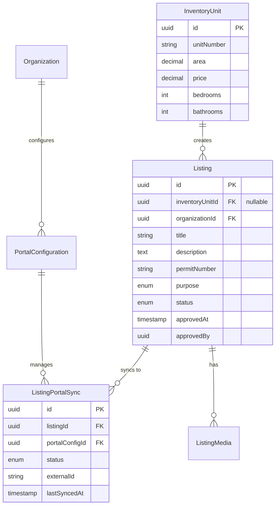

## Module Overview

The Portal Syndication Module allows real estate agents to publish property listings to three UAE property portals directly from PropWise CRM, and automatically receive leads back into the CRM pipeline.

### Three-Tier Architecture

```
InventoryUnit  →  Listing  →  ListingPortalSync
  (inventory)     (marketing)   (per-portal state)
```

<CardGroup cols={3}>
  <Card title="InventoryUnit" icon="building">
    What the unit **is** (rooms, area, price, physical attributes). Unchanged by portal syndication logic.
  </Card>
  <Card title="Listing" icon="bullhorn">
    How the unit is **marketed** (title, descriptions, permit number, portal classifications, marketing media). Created by an agent from an InventoryUnit.
  </Card>
  <Card title="ListingPortalSync" icon="sync">
    Where the listing is **published** and its current state on each portal.
  </Card>
</CardGroup>

<Info>
This separation ensures `InventoryUnit` stays a clean inventory record and the `Listing` layer can eventually support off-plan units (`refUnitId`) without any structural change to the sync system.
</Info>

### Integration Model Per Portal

| Portal | Listing Syndication | Lead Ingestion | Listing Timing |
|--------|---------------------|----------------|----------------|
| Property Finder | REST API Push (JSON) | Webhook push (primary) + REST poll fallback (15 min) | Real-time (seconds) |
| Bayut | XML Feed Pull (unified) | Pull API polling — scheduled every 15 min | 30 min – 2 hr delay |
| dubizzle | XML Feed Pull (same as Bayut) | Pull API polling — same API + endpoint as Bayut | 30 min – 2 hr delay |

<Note>
**Bayut / dubizzle lead ingestion note:** Bayut and dubizzle share one API endpoint and one Bearer token (per agency). The `source` field in each lead response (`"bayut"` or `"dubizzle"`) determines which `LeadSource` enum value is used when the CRM lead is created. The Bearer token is stored encrypted in the existing `apiKey` field of the Bayut `PortalConfiguration` row — no new credential columns are needed. Lead ingestion is gated by `PortalConfiguration.leadIngestionEnabled` (per portal): the poller runs only for Bayut rows with `leadIngestionEnabled = true` + a token, and keeps dubizzle-source leads only when the dubizzle row also has `leadIngestionEnabled = true`.
</Note>

### Data Flow Rules

<Check>**CRM → Portals**: Listings flow one direction only (CRM always wins)</Check>
<Check>**Portals → CRM**: Leads flow one direction only</Check>
<Warning>Portal data **never** overwrites CRM data</Warning>
<Info>`Listing` is the **single source of truth** for listing (marketing) content</Info>
<Info>`InventoryUnit` is the **single source of truth** for unit inventory data</Info>

### Module Location

```
src/modules/real-estate/portal-syndication/
```

Imported in `src/modules/real-estate/real-estate.module.ts`.

---

## As-Built Implementation Status

This section reconciles the spec with the shipped implementation. Where the spec and the build diverge, **the build below is authoritative**.

### Phase A — Bayut/dubizzle Outbound (XML Feed)

<Tabs>
  <Tab title="Self-Contained Listing">
    Every field any portal needs now lives on `Listing` (snapshotted from the unit in linked mode via `ListingService.copyUnitToListing`, or entered directly in manual mode).

    **Key Changes:**
    - Adapters + `PortalValidationService` read ONLY `listing.X` — never `listing.inventoryUnit.X`
    - `inventoryUnit` FK is **nullable** (manual listings have none)
    - New `ListingPurpose` enum (`Sale`/`Rent`)
    - Migration: `Migration20260531120000_SelfContainedListingFields`

    **Creation Modes:**
    Two creation modes converge on `ListingService.create(dto, userId, orgId)`:
    - **Linked mode**: Snapshots then applies DTO overrides
    - **Manual mode**: Direct entry without unit link
    - `refreshFromUnit`: Re-pulls snapshot fields while preserving marketing content + agent overrides
  </Tab>

  <Tab title="Value Transforms">
    Centralized value transforms in `src/modules/shared/portal-value-map.ts`:

    ```typescript
    // Purpose mapping
    purposeToBayut(purpose: ListingPurpose): string
    purposeToPfPriceType(purpose: ListingPurpose): string

    // Furnishing status
    furnishedToBayut(furnished: FurnishedStatus): string
    furnishedToPf(furnished: FurnishedStatus): string

    // Room counts
    bedroomsToBayut(bedrooms: number): string
    bedroomsToPf(bedrooms: number): number
    bathroomsToBayut(bathrooms: number): string
    bathroomsToPf(bathrooms: number): number

    // Other attributes
    rentalPeriodToBayut(period: RentalPeriod): string
    finishingToPf(finishing: FinishingStatus): string
    emirateToPfCompliance(emirate: UaeEmirate): string
    ```

    <Info>Both adapters AND the validator consume these transforms</Info>
  </Tab>

  <Tab title="XML Feed">
    **BayutDubizzleFeedAdapter** + CDATA XML serializer (`utils/bayut-xml.serializer.ts`):
    
    ```xml
    <Property_Ref_No>UNIT-{orgShortCode}-{listing.id}</Property_Ref_No>
    ```

    **Public Feed Endpoint:**
    ```
    GET /portal-syndication/feeds/:orgId?token=
    ```

    - `@PublicEndpoint` decorator
    - `PortalFeedController` + `PortalFeedService`
    - Built live via `executeWithBypass`
    - Includes published rows as `Property_Status=live`
    - Recently-removed rows as `deleted` for ≥48h (so portals delist promptly)
  </Tab>
</Tabs>

### Sync State Machine

<Warning>
**State Transition Update:**
- `DRAFT → PUBLISHED` ADDED to `VALID_TRANSITIONS` for feed portals
- Mirrors existing `REMOVED → PUBLISHED`
- `PENDING → PUBLISHED` remains invalid
</Warning>

### Publish Authorization

<Steps>
  <Step title="Gate A: Permission Check">
    `SyndicationService.publish` checks `real_estate.listing.publish` permission:
    
    - **With permission**: Listing published directly
    - **Without permission**: Listing moves to `ListingStatus.PENDING_APPROVAL`
    - Managers hold permission via implication
  </Step>

  <Step title="Approval Flow">
    A `real_estate.manage` user uses `POST /:listingId/approve|reject`:

    **Approve:**
    - Honors submitter's publish intent (`publishOnApproval`)
    - Auto-publishes to enabled portal targets (→ ACTIVE)
    - Approval-only request (no targets) → plain DRAFT
    - Stamps `Listing.approvedAt` / `approvedBy` (set-once, never cleared)

    **Reject:**
    - Moves listing to `ListingStatus.REJECTED`
    - Persists rejection note (`rejectionReason` + `rejectedAt`/`rejectedBy`)
    - Submitter can edit + resubmit or delete
    - Resubmit clears rejection and returns to `PENDING_APPROVAL`
  </Step>

  <Step title="Owner Self-Manage Bypass">
    Post-approval, the listing's **owner** (publisher `createdBy` / `agent` / linked-unit `unitManager`) can:
    
    - Publish / unpublish directly
    - Toggle portals without approval
    - `SyndicationService.publish` skips Gate A when `approvedAt != null && isOwner`

    <Note>
    A brand-new listing (`approvedAt == null`) or non-owner without permission still routes through approval.
    </Note>
  </Step>
</Steps>

### Listing Approval Notifications

<Tabs>
  <Tab title="Submit for Approval">
    **Event:** `LISTING_APPROVAL_REQUESTED`
    
    **Recipients:** All `real_estate.manage` approvers (bulk; resolved via `PermissionService.getUserIdsWithOrgPermission`)
  </Tab>

  <Tab title="Approve">
    **Event:** `LISTING_APPROVED`
    
    **Recipient:** Publisher (`createdBy`)
    
    **Payload:** `published` indicates auto-publish vs approval-only
  </Tab>

  <Tab title="Reject">
    **Event:** `LISTING_REJECTED`
    
    **Recipient:** Publisher
    
    **Payload:** Rejection reason
  </Tab>

  <Tab title="Delete">
    **Event:** `LISTING_DELETED`
    
    **Recipient:** Publisher
    
    **Condition:** ONLY when deleter is not the publisher
  </Tab>
</Tabs>

<Info>
See `NOTIFICATION_IMPLEMENTATION_GUIDE.md` → "Implemented Real Estate Listing Approval Notification Types" for full details.
</Info>

### Inventory Cascade

When an inventory unit is deleted, the system handles linked listings based on user choice:

<Tabs>
  <Tab title="Remove Linked Listings (Default)">
    **Setting:** `removeLinkedListings = true`

    <Steps>
      <Step title="Remove from Portals">
        Call `SyndicationService.removeFromAllPortals()` for the unit's listings
      </Step>
      <Step title="Archive Listings">
        Call `ListingService.archiveByUnit()` with deleting actor for audit attribution
      </Step>
    </Steps>
  </Tab>

  <Tab title="Keep Listings Live">
    **Setting:** `removeLinkedListings = false`

    <Steps>
      <Step title="Sever Unit Link">
        Call `ListingService.unlinkFromUnit()` to set `inventoryUnit = null`
      </Step>
      <Step title="Convert to Manual">
        Listings become self-contained manual listings
      </Step>
      <Step title="Continue Management">
        User can keep editing/publishing the now-manual listings
      </Step>
    </Steps>
  </Tab>
</Tabs>

**API Endpoint:**
```http
DELETE /inventory/units/:id?removeLinkedListings=true|false
```

<Note>
String `"false"` is the only opt-out; anything else defaults to remove. Event-driven via `inventory-unit.deleted` event to avoid circular dependencies.
</Note>

<Warning>
Inventory units are **soft-deleted only — never archived**. There is no `isArchived` write path on `InventoryUnit`, so there is intentionally **no `inventory-unit.archived` event** and no archive-branch listener.
</Warning>

### Phase A.5 — Unified Inbound Lead Capture

New module **`src/modules/crm/lead-capture/`** provides a generalized lead capture system:

<AccordionGroup>
  <Accordion title="Core Components">
    - **`LeadCaptureService.capture()`**: Central capture method
    - **`CapturedLeadInput`**: Standard contract for all lead sources
    - **`LeadCaptureSource`**: Interface for source adapters
    - **`LeadCaptureSourceRegistry`**: Source registration and lookup
    - **`LeadCaptureSettings`**: Organization-default configuration
    - **`CapturedLead`**: Idempotency ledger
    - **`lead-ingestion`**: pg-boss queue + `LeadIngestionWorker`

    <Info>
    This GENERALIZES the spec's portal-only `portal-lead-ingestion`/`PortalLeadWorkerService`.
    </Info>
  </Accordion>

  <Accordion title="Bayut Lead Capture">
    **Components:**
    - **`BayutLeadParserService`**: Pure parser (7 shapes → `NormalizedBayutLead`)
    - **`BayutLeadCaptureAdapter`**: Implements `LeadCaptureSource`
    - **`BayutLeadPollerService`**: Scheduled poller (`@Cron('*/15 ...')`)

    **Polling Logic:**
    <Steps>
      <Step title="Select Organizations">
        Cross-org query for Bayut rows with:
        - `leadIngestionEnabled = true`
        - Valid token in `apiKey` field
      </Step>
      <Step title="Decrypt Token">
        Decrypt Bayut Pull API Bearer token from `PortalConfiguration.apiKey`
      </Step>
      <Step title="Poll 7 Endpoints">
        Poll all lead type combinations
      </Step>
      <Step title="Filter dubizzle Leads">
        Drop dubizzle-source leads unless org's dubizzle row has `leadIngestionEnabled = true`
      </Step>
      <Step title="Enqueue for Processing">
        Enqueue valid leads to `lead-ingestion` queue
      </Step>
      <Step title="Handle Errors">
        On 401 error: Do NOT advance `lastLeadPollAt`
      </Step>
    </Steps>

    **Configuration:**
    ```typescript
    app.bayut.leadApiBaseUrl
    ```
  </Accordion>

  <Accordion title="Migration">
    **Migration:** `Migration20260531130000_LeadCaptureFoundation`
    
    Includes:
    - New tables for lead capture ledger
    - Row-level security (RLS) policies
    - Indexes for efficient querying
  </Accordion>
</AccordionGroup>

### Phase B — Property Finder (REST Push)

<Tabs>
  <Tab title="Core Services">
    <CardGroup cols={2}>
      <Card title="PfTokenService" icon="key">
        - 30-minute token cache
        - Invalidate on 401 response
      </Card>
      <Card title="PfLocationMappingService" icon="map">
        - 24-hour cache
        - Location hierarchy mapping
      </Card>
      <Card title="PfAgentMappingService" icon="users">
        - 24-hour cache
        - `refreshOrgAgentMappings` method
        - Replaces 501 stub
      </Card>
      <Card title="PfComplianceService" icon="shield-check">
        - Compliance validation
        - Required fields enforcement
      </Card>
      <Card title="PfCreditService" icon="coins">
        - Credit balance checking
        - Usage tracking
      </Card>
      <Card title="ListingImageService" icon="image">
        - Sharp validate/auto-fix
        - `processedMedia` cache
        - `constraintHash` tracking
      </Card>
    </CardGroup>
  </Tab>

  <Tab title="Adapter & Workers">
    **PropertyFinderAdapter:**
    - 6-step publish process
    - REST API integration
    - Error handling and retry logic

    **PfSyndicationWorker:**
    - Processes `pf-syndication` queue
    - Handles async syndication tasks
    - Retry and failure handling

    **SyncReconciliationService:**
    - Cron-based reconciliation
    - Ensures sync state consistency

    **ApiKeyExpirationCheckService:**
    - Cron-based monitoring
    - Alerts for expiring keys
  </Tab>

  <Tab title="Webhooks & Leads">
    **PfWebhookSubscriptionService:**
    - Manages webhook subscriptions
    - Auto-registration on portal enable

    **PortalWebhookController:**
    - Public endpoint for webhooks
    - HMAC validation over raw body
    - `@PublicEndpoint` decorator

    **PfLeadCaptureAdapter:**
    - Implements `LeadCaptureSource`
    - Processes incoming PF leads
    - Real-time lead capture
  </Tab>
</Tabs>

**Configuration:**
```typescript
app.propertyFinder.apiBaseUrl
```

<Note>
All PF/Bayut HTTP uses plain `axios` (the codebase convention).
</Note>

---

## Data Models

### Entity Relationships



### Listing Entity

<Tabs>
  <Tab title="Core Fields">
    ```typescript
    {
      id: UUID;
      organizationId: UUID;
      inventoryUnitId?: UUID; // Nullable for manual listings
      
      // Marketing content
      title: string;
      descriptionEn: text;
      descriptionAr?: text;
      
      // Purpose and status
      purpose: ListingPurpose; // Sale | Rent
      status: ListingStatus;
      
      // Approval tracking
      approvedAt?: timestamp;
      approvedBy?: UUID;
      rejectedAt?: timestamp;
      rejectedBy?: UUID;
      rejectionReason?: text;
      
      // Audit fields
      createdAt: timestamp;
      createdBy: UUID;
      updatedAt: timestamp;
      updatedBy: UUID;
      isDeleted: boolean;
    }
    ```
  </Tab>

  <Tab title="Property Details">
    ```typescript
    {
      // Property classification
      propertyType: PropertyType;
      emirate: UaeEmirate;
      community?: string;
      subCommunity?: string;
      
      // Physical attributes
      bedrooms: number;
      bathrooms: number;
      area: decimal;
      
      // Pricing
      price: decimal;
      rentalPeriod?: RentalPeriod;
      
      // Features
      furnished: FurnishedStatus;
      finishing?: FinishingStatus;
      
      // Compliance
      permitNumber?: string;
      reraPermitNumber?: string;
    }
    ```
  </Tab>

  <Tab title="Portal-Specific">
    ```typescript
    {
      // Bayut/dubizzle
      bayutCategory?: string;
      
      // Property Finder
      pfCategoryId?: number;
      pfLocationId?: number;
      
      // Agent assignment
      agentId: UUID;
      agentName: string;
      agentPhone: string;
      agentEmail: string;
    }
    ```
  </Tab>
</Tabs>

### ListingPortalSync Entity

Tracks per-portal publication state:

```typescript
{
  id: UUID;
  listingId: UUID;
  portalConfigId: UUID;
  
  // Sync state
  status: SyncStatus;
  externalId?: string;
  externalUrl?: string;
  
  // Timestamps
  lastSyncedAt?: timestamp;
  lastSuccessAt?: timestamp;
  lastErrorAt?: timestamp;
  lastError?: text;
  
  // Metadata
  syncMetadata?: jsonb;
  validationErrors?: jsonb;
}
```

**SyncStatus Values:**
- `DRAFT`: Not yet published
- `PENDING`: Queued for sync
- `ACTIVE`: Successfully published
- `REMOVED`: Unpublished from portal
- `ERROR`: Sync failed

### PortalConfiguration Entity

```typescript
{
  id: UUID;
  organizationId: UUID;
  portal: PortalType; // PropertyFinder | Bayut | Dubizzle
  
  // Credentials (encrypted)
  apiKey?: string;
  apiSecret?: string;
  accountId?: string;
  
  // Settings
  isEnabled: boolean;
  leadIngestionEnabled: boolean;
  autoPublish: boolean;
  
  // Feed configuration (Bayut/dubizzle)
  feedToken?: string;
  
  // State tracking
  lastLeadPollAt?: timestamp;
  lastSyncAt?: timestamp;
  
  // Metadata
  metadata?: jsonb;
}
```

---

## API Endpoints

### Listing Management

<CodeGroup>
```http POST /listings
POST /real-estate/listings
Content-Type: application/json
Authorization: Bearer {token}

{
  "inventoryUnitId": "uuid", // Optional for manual listings
  "title": "string",
  "descriptionEn": "string",
  "descriptionAr": "string",
  "purpose": "Sale" | "Rent",
  "price": 1000000,
  "bedrooms": 3,
  "bathrooms": 2,
  "area": 150.5,
  "propertyType": "Apartment",
  "emirate": "Dubai",
  "permitNumber": "1234567890"
}
```

```http GET /listings/:id
GET /real-estate/listings/:id
Authorization: Bearer {token}

Response:
{
  "id": "uuid",
  "status": "DRAFT",
  "approvedAt": null,
  "inventoryUnit": { ... },
  "portalSyncs": [ ... ],
  ...
}
```

```http PATCH /listings/:id
PATCH /real-estate/listings/:id
Content-Type: application/json
Authorization: Bearer {token}

{
  "title": "Updated Title",
  "price": 1100000
}
```

```http DELETE /listings/:id
DELETE /real-estate/listings/:id
Authorization: Bearer {token}

Note: Soft-deletes the listing after removing from all portals
```
</CodeGroup>

### Syndication Operations

<CodeGroup>
```http POST /listings/:id/publish
POST /real-estate/listings/:id/publish
Content-Type: application/json
Authorization: Bearer {token}

{
  "portalConfigs": ["uuid1", "uuid2"], // Portal configuration IDs
  "publishOnApproval": true // For non-publishers
}
```

```http POST /listings/:id/unpublish
POST /real-estate/listings/:id/unpublish
Content-Type: application/json
Authorization: Bearer {token}

{
  "portalConfigs": ["uuid1", "uuid2"] // Optional, defaults to all
}
```

```http POST /listings/:id/refresh-from-unit
POST /real-estate/listings/:id/refresh-from-unit
Authorization: Bearer {token}

Note: Re-snapshots inventory data while preserving marketing content
```
</CodeGroup>

### Approval Workflow

<CodeGroup>
```http POST /listings/:id/approve
POST /real-estate/listings/:id/approve
Content-Type: application/json
Authorization: Bearer {token}

{
  "note": "Approved for publication"
}

Requires: real_estate.manage permission
```

```http POST /listings/:id/reject
POST /real-estate/listings/:id/reject
Content-Type: application/json
Authorization: Bearer {token}

{
  "reason": "Missing permit number"
}

Requires: real_estate.manage permission
```

```http GET /listings?type=requests
GET /real-estate/listings?type=requests
Authorization: Bearer {token}

Returns: PENDING_APPROVAL + REJECTED listings
Requires: real_estate.manage permission
```
</CodeGroup>

### Portal Configuration

<CodeGroup>
```http GET /portal-configurations
GET /real-estate/portal-configurations
Authorization: Bearer {token}

Response:
[
  {
    "id": "uuid",
    "portal": "PropertyFinder",
    "isEnabled": true,
    "leadIngestionEnabled": true
  }
]
```

```http PATCH /portal-configurations/:id
PATCH /real-estate/portal-configurations/:id
Content-Type: application/json
Authorization: Bearer {token}

{
  "isEnabled": true,
  "leadIngestionEnabled": true,
  "apiKey": "encrypted_key",
  "autoPublish": false
}
```
</CodeGroup>

### Public Endpoints

<CodeGroup>
```http GET /feeds/:orgId
GET /portal-syndication/feeds/:orgId?token={feedToken}

Content-Type: application/xml

Returns: Bayut/dubizzle XML feed with all published listings
```

```http POST /webhooks/property-finder
POST /portal-syndication/webhooks/property-finder
Content-Type: application/json
X-PF-Signature: {hmac_signature}

{
  "event": "lead.created",
  "data": { ... }
}
```
</CodeGroup>

---

## Workflows

### Publishing a Listing

<Steps>
  <Step title="Create Listing">
    Agent creates a listing from an inventory unit or manually:
    
    ```typescript
    POST /real-estate/listings
    {
      "inventoryUnitId": "uuid", // Optional
      "title": "Luxury 3BR Apartment",
      "purpose": "Rent",
      ...
    }
    ```
    
    Listing starts in `DRAFT` status
  </Step>

  <Step title="Submit for Publishing">
    Agent submits listing for publication:
    
    ```typescript
    POST /real-estate/listings/:id/publish
    {
      "portalConfigs": ["pf-uuid", "bayut-uuid"],
      "publishOnApproval": true
    }
    ```
    
    **If agent has `real_estate.listing.publish`:**
    - Listing publishes directly → `ACTIVE`
    
    **If agent lacks permission:**
    - Listing moves to `PENDING_APPROVAL`
    - Notification sent to all approvers
  </Step>

  <Step title="Approval (if required)">
    Manager reviews and approves/rejects:
    
    **Approve:**
    ```typescript
    POST /real-estate/listings/:id/approve
    ```
    - Honors `publishOnApproval` setting
    - Stamps `approvedAt` + `approvedBy`
    - Notification sent to publisher
    
    **Reject:**
    ```typescript
    POST /real-estate/listings/:id/reject
    {
      "reason": "Missing permit number"
    }
    ```
    - Sets status to `REJECTED`
    - Notification sent to publisher
  </Step>

  <Step title="Portal Syndication">
    **Property Finder (Real-time):**
    - Enqueued to `pf-syndication` queue
    - Worker processes within seconds
    - 6-step publish process
    - Webhook subscription created
    
    **Bayut/dubizzle (Feed-based):**
    - Listing added to XML feed immediately
    - Portal crawls feed (30min - 2hr)
    - Status updated via reconciliation cron
  </Step>

  <Step title="Post-Approval Management">
    Once `approvedAt` is set, the listing owner can:
    - Toggle portals on/off directly
    - Unpublish without approval
    - Re-publish without approval
    - All operations bypass Gate A
  </Step>
</Steps>

### Lead Ingestion Flow

<Tabs>
  <Tab title="Property Finder (Webhook)">
    <Steps>
      <Step title="Webhook Received">
        Property Finder sends webhook to public endpoint:
        ```
        POST /portal-syndication/webhooks/property-finder
        ```
      </Step>

      <Step title="HMAC Validation">
        Controller validates `X-PF-Signature` against raw body
      </Step>

      <Step title="Capture Lead">
        `PfLeadCaptureAdapter` processes webhook payload
      </Step>

      <Step title="Enqueue">
        Lead enqueued to `lead-ingestion` queue
      </Step>

      <Step title="Worker Processing">
        `LeadIngestionWorker` creates CRM lead:
        - Checks for duplicates via `CapturedLead` ledger
        - Associates with listing via `externalId`
        - Sets `LeadSource.PROPERTY_FINDER`
        - Assigns to listing agent
      </Step>
    </Steps>

    <Info>Fallback: REST poll every 15 minutes for missed webhooks</Info>
  </Tab>

  <Tab title="Bayut/dubizzle (Polling)">
    <Steps>
      <Step title="Scheduled Poll">
        `BayutLeadPollerService` runs every 15 minutes
      </Step>

      <Step title="Organization Selection">
        Query Bayut configurations with:
        - `leadIngestionEnabled = true`
        - Valid encrypted token in `apiKey`
      </Step>

      <Step title="API Polling">
        For each organization:
        - Decrypt Bearer token
        - Poll 7 lead endpoint combinations
        - Parse response with `BayutLeadParserService`
      </Step>

      <Step title="Source Filtering">
        For leads with `source: "dubizzle"`:
        - Check if org's dubizzle config has `leadIngestionEnabled = true`
        - Drop if disabled
      </Step>

      <Step title="Capture & Enqueue">
        `BayutLeadCaptureAdapter` processes valid leads:
        - Enqueues to `lead-ingestion` queue
        - Updates `lastLeadPollAt` on success
        - Skips update on 401 error
      </Step>

      <Step title="Worker Processing">
        `LeadIngestionWorker` creates CRM lead:
        - Sets `LeadSource.BAYUT` or `LeadSource.DUBIZZLE`
        - Associates with listing
        - Assigns to agent
      </Step>
    </Steps>
  </Tab>
</Tabs>

### Inventory Unit Deletion

When an inventory unit is deleted, the system handles linked listings:

<Tabs>
  <Tab title="Remove Listings (Default)">
    <Steps>
      <Step title="User Confirms Deletion">
        ```typescript
        DELETE /inventory/units/:id?removeLinkedListings=true
        ```
      </Step>

      <Step title="Event Emitted">
        `inventory-unit.deleted` event with `removeLinkedListings: true`
      </Step>

      <Step title="Remove from Portals">
        `PortalSyndicationEventListener` calls:
        ```typescript
        SyndicationService.removeFromAllPortals(linkedListings)
        ```
      </Step>

      <Step title="Archive Listings">
        ```typescript
        ListingService.archiveByUnit(unitId, deletingUserId)
        ```
        - Sets `isArchived = true`
        - Preserves audit trail
      </Step>
    </Steps>
  </Tab>

  <Tab title="Keep Listings Live">
    <Steps>
      <Step title="User Opts Out">
        ```typescript
        DELETE /inventory/units/:id?removeLinkedListings=false
        ```
      </Step>

      <Step title="Event Emitted">
        `inventory-unit.deleted` event with `removeLinkedListings: false`
      </Step>

      <Step title="Unlink Listings">
        `PortalSyndicationEventListener` calls:
        ```typescript
        ListingService.unlinkFromUnit(unitId)
        ```
        - Sets `inventoryUnit = null` on all linked listings
        - Listings become manual (self-contained)
      </Step>

      <Step title="Continue Management">
        Listings remain live and publishable:
        - Agent can continue editing
        - Publishing/unpublishing works normally
        - No inventory unit reference
      </Step>
    </Steps>
  </Tab>
</Tabs>

---

## Validation & Compliance

### Portal-Specific Requirements

<Tabs>
  <Tab title="Property Finder">
    <AccordionGroup>
      <Accordion title="Mandatory Fields">
        - Title (English)
        - Description (English, ≥50 chars)
        - Price
        - Property type + valid category mapping
        - Location (emirate + community + valid location ID)
        - Agent details (name, phone, email)
        - Bedrooms + bathrooms
        - Area (sqft or sqm)
        - At least 1 image (1200x800+ pixels, <10MB)
      </Accordion>

      <Accordion title="Image Requirements">
        ```typescript
        {
          minWidth: 1200,
          minHeight: 800,
          maxSize: 10 * 1024 * 1024, // 10MB
          formats: ['jpg', 'jpeg', 'png'],
          aspectRatio: '3:2 recommended'
        }
        ```

        **Auto-fix by `ListingImageService`:**
        - Validates dimensions
        - Checks file size
        - Verifies format
        - Caches processed media with `constraintHash`
      </Accordion>

      <Accordion title="Compliance Checks">
        `PfComplianceService` validates:
        
        <Check>Permit number (RERA/DLD) for Dubai properties</Check>
        <Check>Valid agent mapping in PF system</Check>
        <Check>Location ID exists in PF location hierarchy</Check>
        <Check>Category ID matches property type</Check>
        <Check>Price within reasonable range for type</Check>
      </Accordion>

      <Accordion title="Credit System">
        `PfCreditService` checks:
        - Available credits before publishing
        - Credit deduction on successful publish
        - Warning threshold notifications
        - Credit exhaustion prevents publish
      </Accordion>
    </AccordionGroup>
  </Tab>

  <Tab title="Bayut/dubizzle">
    <AccordionGroup>
      <Accordion title="Mandatory Fields">
        - Permit number (mandatory in XML, but not enforced for feed submission)
        - Property reference (`UNIT-{orgShortCode}-{listingId}`)
        - Price
        - Property type + valid Bayut category
        - Bedrooms + bathrooms (mapped to Bayut enums)
        - Area (sqft, converted from sqm if needed)
        - Agent details (name, email, phone)
        - At least 1 image URL
      </Accordion>

      <Accordion title="Feed Format">
        ```xml
        <?xml version="1.0" encoding="UTF-8"?>
        <list last_update="YYYY-MM-DD HH:MM:SS" listing_count="N">
          <property>
            <Property_Ref_No>UNIT-ORG-123</Property_Ref_No>
            <Permit_Number>1234567890</Permit_Number>
            <Property_Status>live</Property_Status>
            <!-- OR -->
            <Property_Status>deleted</Property_Status>
            <Property_purpose>S</Property_purpose> <!-- S=Sale, R=Rent -->
            <!-- ... more fields ... -->
          </property>
        </list>
        ```

        <Info>
        Deleted properties remain in feed with `Property_Status=deleted` for 48 hours to ensure portal delisting.
        </Info>
      </Accordion>

      <Accordion title="Value Mappings">
        Via `portal-value-map.ts`:

        **Purpose:**
        - `Sale` → `"S"`
        - `Rent` → `"R"`

        **Bedrooms:**
        - `0` → `"Studio"`
        - `1-7` → `"1"` - `"7"`
        - `8+` → `"7+"`

        **Bathrooms:**
        - `1-5` → `"1"` - `"5"`
        - `6+` → `"5+"`

        **Furnished:**
        - `Furnished` → `"Furnished"`
        - `Unfurnished` → `"Unfurnished"`
        - `PartFurnished` → `"Partly"`
      </Accordion>

      <Accordion title="Feed Token Security">
        - Feed access controlled by `token` query parameter
        - Token stored in `PortalConfiguration.feedToken`
        - Regenerate token if compromised
        - Token validated before feed generation
      </Accordion>
    </AccordionGroup>
  </Tab>
</Tabs>

### Validation Service

`PortalValidationService` provides centralized validation:

```typescript
interface ValidationResult {
  isValid: boolean;
  errors: ValidationError[];
  warnings: ValidationWarning[];
}

interface ValidationError {
  field: string;
  message: string;
  portal: PortalType;
}
```

<CodeGroup>
```typescript validateForPublish
// Validate before publishing
const result = await validationService.validateForPublish(
  listing,
  portalConfigs
);

if (!result.isValid) {
  throw new BadRequestException(result.errors);
}
```

```typescript validateListing
// Validate listing data
const result = validationService.validateListing(listing, portal);

// Check specific fields
const permitValid = validationService.validatePermitNumber(
  listing.permitNumber,
  listing.emirate
);
```
</CodeGroup>

---

## Error Handling

### Sync Error States

<Tabs>
  <Tab title="Property Finder Errors">
    | Error Code | Meaning | Action |
    |------------|---------|--------|
    | 401 | Invalid/expired token | Refresh token via `PfTokenService`, retry |
    | 402 | Insufficient credits | Block publish, notify admin |
    | 403 | Forbidden | Check agent mapping, verify permissions |
    | 409 | Duplicate listing | Update existing via `PUT /{externalId}` |
    | 422 | Validation failed | Parse errors, update listing, retry |
    | 500 | Server error | Exponential backoff retry (max 3) |

    **Retry Strategy:**
    ```typescript
    {
      maxRetries: 3,
      backoff: 'exponential',
      baseDelay: 1000, // 1s, 2s, 4s
      maxDelay: 10000
    }
    ```
  </Tab>

  <Tab title="Bayut/dubizzle Errors">
    | Error Type | Meaning | Action |
    |------------|---------|--------|
    | Feed unreachable | Portal can't fetch feed | Check feed URL, token validity |
    | Parse error | Invalid XML | Fix serialization, validate against schema |
    | Missing permit | Portal rejects listing | Update listing, wait for next crawl |
    | Duplicate reference | Reference ID collision | Check `Property_Ref_No` uniqueness |
    | Image load failure | Portal can't fetch image | Verify image URLs, check accessibility |

    <Warning>
    Feed portals provide limited error feedback. Use `SyncReconciliationService` to detect and report issues.
    </Warning>
  </Tab>

  <Tab title="Lead Ingestion Errors">
    | Error | Handling |
    |-------|----------|
    | Duplicate lead | Check `CapturedLead` ledger, skip creation |
    | Missing listing | Log warning, create unassigned lead |
    | Invalid data | Parse errors logged, lead marked for manual review |
    | Webhook HMAC fail | Reject request, log security event |
    | API 401 | Don't advance `lastLeadPollAt`, alert admin |
  </Tab>
</Tabs>

### Error Storage

```typescript
// ListingPortalSync tracks errors
{
  lastErrorAt: timestamp,
  lastError: text,
  validationErrors: jsonb
}

// Error structure
{
  timestamp: "2024-01-15T10:30:00Z",
  code: "422",
  message: "Validation failed",
  details: {
    field: "images",
    reason: "Minimum 1 image required"
  },
  retryCount: 2
}
```

### Monitoring & Alerts

<CardGroup cols={2}>
  <Card title="Sync Failures" icon="circle-xmark">
    Alert when:
    - Listing fails after max retries
    - Error rate exceeds threshold
    - Critical validation issues
  </Card>
  <Card title="Credit Warnings" icon="coins">
    Alert when:
    - Credits below warning threshold
    - Credit exhaustion imminent
    - Unexpected credit usage spike
  </Card>
  <Card title="Token Expiration" icon="key">
    Alert when:
    - API token expires within 7 days
    - Token refresh failures
    - 401 errors detected
  </Card>
  <Card title="Lead Ingestion" icon="inbox">
    Alert when:
    - Poller fails repeatedly
    - Webhook signature validation fails
    - Lead processing errors spike
  </Card>
</CardGroup>

---

## Background Jobs

### Queue Workers

<Tabs>
  <Tab title="pf-syndication">
    **Purpose:** Process Property Finder listing publications
    
    **Worker:** `PfSyndicationWorker`
    
    **Configuration:**
    ```typescript
    {
      queue: 'pf-syndication',
      concurrency: 5,
      retryLimit: 3,
      retryDelay: 60, // seconds
      expireIn: '1 hour'
    }
    ```

    **Job Payload:**
    ```typescript
    {
      listingId: UUID,
      action: 'publish' | 'update' | 'remove',
      portalConfigId: UUID,
      attempt: number
    }
    ```

    **Processing Steps:**
    1. Validate token (refresh if needed)
    2. Check credits
    3. Validate compliance
    4. Process images
    5. Call PF API
    6. Update sync state
  </Tab>

  <Tab title="lead-ingestion">
    **Purpose:** Process captured leads from all sources
    
    **Worker:** `LeadIngestionWorker`
    
    **Configuration:**
    ```typescript
    {
      queue: 'lead-ingestion',
      concurrency: 10,
      retryLimit: 5,
      retryDelay: 30,
      expireIn: '6 hours'
    }
    ```

    **Job Payload:**
    ```typescript
    {
      capturedLeadId: UUID,
      source: LeadCaptureSource,
      organizationId: UUID
    }
    ```

    **Processing Steps:**
    1. Check for duplicate via `CapturedLead` ledger
    2. Resolve listing via `externalId`
    3. Create CRM lead
    4. Assign to agent
    5. Trigger notifications
  </Tab>
</Tabs>

### Scheduled Jobs

<AccordionGroup>
  <Accordion title="Bayut Lead Poller">
    **Cron:** Every 15 minutes
    
    **Service:** `BayutLeadPollerService`
    
    ```typescript
    @Cron('*/15 * * * *')
    async pollLeads() {
      // Query enabled Bayut configs
      // Decrypt tokens
      // Poll 7 endpoint combinations
      // Filter dubizzle leads
      // Enqueue to lead-ingestion
    }
    ```

    **Error Handling:**
    - On 401: Don't advance `lastLeadPollAt`
    - On network error: Log and continue to next org
    - On parse error: Log and skip invalid leads
  </Accordion>

  <Accordion title="PF Lead Fallback Poller">
    **Cron:** Every 15 minutes
    
    **Purpose:** Catch leads missed by webhooks
    
    ```typescript
    @Cron('*/15 * * * *')
    async pollPfLeads() {
      // Query enabled PF configs
      // Poll leads since lastLeadPollAt
      // Check for duplicates
      // Enqueue to lead-ingestion
    }
    ```
  </Accordion>

  <Accordion title="Sync Reconciliation">
    **Cron:** Every 6 hours
    
    **Service:** `SyncReconciliationService`
    
    ```typescript
    @Cron('0 */6 * * *')
    async reconcileSyncs() {
      // Find ACTIVE syncs with old lastSyncedAt
      // Verify listing still exists on portal
      // Update status if removed
      // Report discrepancies
    }
    ```

    **Checks:**
    - Property Finder: Query API for each `externalId`
    - Bayut/dubizzle: Infer from feed crawl timestamps
    - Update stale sync states
    - Alert on unexpected removals
  </Accordion>

  <Accordion title="API Key Expiration Check">
    **Cron:** Daily at 9 AM
    
    **Service:** `ApiKeyExpirationCheckService`
    
    ```typescript
    @Cron('0 9 * * *')
    async checkExpirations() {
      // Query portal configs with expiring keys
      // Alert admins for keys expiring <7 days
      // Disable configs with expired keys
    }
    ```
  </Accordion>
</AccordionGroup>

---

## Security & Permissions

### Permission Model

<Tabs>
  <Tab title="Listing Permissions">
    | Permission | Scope | Grants |
    |------------|-------|--------|
    | `real_estate.listing.create` | Organization | Create listings |
    | `real_estate.listing.edit` | Organization | Edit own listings |
    | `real_estate.listing.publish` | Organization | Publish directly (skip approval) |
    | `real_estate.listing.view` | Organization | View all listings |
    | `real_estate.listing.delete` | Organization | Delete own listings |
    | `real_estate.manage` | Organization | Approve, reject, delete any listing |

    <Note>
    Listing owners can always edit/delete their own listings, regardless of permissions.
    </Note>
  </Tab>

  <Tab title="Portal Configuration">
    | Permission | Grants |
    |------------|--------|
    | `real_estate.portal.configure` | Update portal credentials |
    | `real_estate.portal.view` | View portal configurations |
    | `real_estate.manage` | Full portal configuration access |

    <Warning>
    Portal credentials (API keys, tokens) are encrypted at rest using AES-256.
    </Warning>
  </Tab>

  <Tab title="Ownership Rules">
    A user is considered a listing **owner** if they are:
    1. The listing creator (`createdBy`)
    2. The assigned agent (`agentId`)
    3. The linked unit's manager (`inventoryUnit.unitManager`)

    **Owner Privileges:**
    - Edit listing content
    - Delete listing (before approval)
    - Publish/unpublish (after approval, bypasses Gate A)
    - Toggle portal targets
    - Refresh from unit (linked mode)
  </Tab>
</Tabs>

### API Security

<CardGroup cols={2}>
  <Card title="Authentication" icon="shield-halved">
    - JWT Bearer tokens
    - Organization context required
    - User permissions validated
  </Card>
  <Card title="Feed Token" icon="key">
    - Random UUID per organization
    - Validated before feed generation
    - Regenerate on compromise
  </Card>
  <Card title="Webhook Validation" icon="shield-check">
    - HMAC signature verification
    - Raw body validation
    - Timestamp checks (anti-replay)
  </Card>
  <Card title="Credential Encryption" icon="lock">
    - AES-256 for API keys/tokens
    - Environment-based encryption keys
    - No plaintext storage
  </Card>
</CardGroup>

### Row-Level Security (RLS)

All portal syndication tables enforce organization-based RLS:

```sql
-- Listing access
CREATE POLICY listing_org_isolation ON listings
  USING (organization_id = current_setting('app.current_org_id')::uuid);

-- Portal config access
CREATE POLICY portal_config_org_isolation ON portal_configurations
  USING (organization_id = current_setting('app.current_org_id')::uuid);

-- Sync state access
CREATE POLICY sync_org_isolation ON listing_portal_syncs
  USING (
    listing_id IN (
      SELECT id FROM listings 
      WHERE organization_id = current_setting('app.current_org_id')::uuid
    )
  );
```

---

## Testing Strategy

### Unit Tests

<Tabs>
  <Tab title="Services">
    **Test Coverage:**
    - `ListingService`: Create, update, refresh, archive, unlink
    - `SyndicationService`: Publish, unpublish, approval flow
    - `PfTokenService`: Token refresh, cache, invalidation
    - `BayutLeadParserService`: All 7 lead shapes
    - `PortalValidationService`: Field validation, compliance

    **Example:**
    ```typescript
    describe('ListingService', () => {
      describe('create', () => {
        it('snapshots unit data in linked mode', async () => {
          const listing = await service.create(
            { inventoryUnitId: unitId, ... },
            userId,
            orgId
          );
          expect(listing.bedrooms).toBe(unit.bedrooms);
        });

        it('creates manual listing without unit', async () => {
          const listing = await service.create(
            { bedrooms: 3, ... },
            userId,
            orgId
          );
          expect(listing.inventoryUnitId).toBeNull();
        });
      });
    });
    ```
  </Tab>

  <Tab title="Adapters">
    **Test Coverage:**
    - `PropertyFinderAdapter`: API calls, error handling, retries
    - `BayutDubizzleFeedAdapter`: XML generation, CDATA encoding
    - `BayutLeadCaptureAdapter`: Lead normalization
    - `PfLeadCaptureAdapter`: Webhook payload parsing

    **Mocking:**
    - HTTP requests via `nock`
    - External API responses
    - Error scenarios (401, 422, 500)
  </Tab>

  <Tab title="Value Transforms">
    **Test Coverage:**
    - `portal-value-map.ts`: All enum conversions
    - Edge cases (0 bedrooms, 8+ bathrooms, etc.)
    - Bidirectional mappings where applicable

    **Example:**
    ```typescript
    describe('bedroomsToBayut', () => {
      it('maps 0 to Studio', () => {
        expect(bedroomsToBayut(0)).toBe('Studio');
      });
      it('maps 8+ to 7+', () => {
        expect(bedroomsToBayut(10)).toBe('7+');
      });
    });
    ```
  </Tab>
</Tabs>

### Integration Tests

<AccordionGroup>
  <Accordion title="End-to-End Publish">
    Test complete publish flow:

    <Steps>
      <Step title="Setup">
        - Create test organization
        - Configure portal credentials
        - Create test inventory unit
      </Step>
      <Step title="Create Listing">
        - POST `/real-estate/listings`
        - Verify snapshot from unit
      </Step>
      <Step title="Publish">
        - POST `/real-estate/listings/:id/publish`
        - Mock portal API responses
        - Verify queue job enqueued
      </Step>
      <Step title="Worker Processing">
        - Process queue job
        - Verify API called with correct data
        - Check sync state updated
      </Step>
      <Step title="Lead Ingestion">
        - Simulate webhook/poll
        - Verify lead created
        - Check agent assignment
      </Step>
    </Steps>
  </Accordion>

  <Accordion title="Approval Workflow">
    Test Gate A approval flow:

    <Steps>
      <Step title="Submit Without Permission">
        - Create listing as agent without `publish` permission
        - Attempt publish
        - Verify status → `PENDING_APPROVAL`
        - Check notification sent to approvers
      </Step>
      <Step title="Approve">
        - POST `/real-estate/listings/:id/approve` as manager
        - Verify status → `DRAFT` or `ACTIVE` (based on targets)
        - Check `approvedAt` stamped
        - Verify notification sent to publisher
      </Step>
      <Step title="Post-Approval Publish">
        - Publish as owner without permission
        - Verify Gate A bypassed (no `PENDING_APPROVAL`)
        - Check listing goes to `ACTIVE`
      </Step>
    </Steps>
  </Accordion>

  <Accordion title="Inventory Cascade">
    Test unit deletion handling:

    <Steps>
      <Step title="Setup">
        - Create unit with linked listing
        - Publish listing to portals
      </Step>
      <Step title="Delete with Remove">
        - DELETE `/inventory/units/:id?removeLinkedListings=true`
        - Verify listing removed from portals
        - Check listing archived
      </Step>
      <Step title="Delete with Keep">
        - DELETE `/inventory/units/:id?removeLinkedListings=false`
        - Verify listing stays published
        - Check `inventoryUnitId` nulled
      </Step>
    </Steps>
  </Accordion>
</AccordionGroup>

### Manual Testing Checklist

<Steps>
  <Step title="Portal Credentials">
    <Check>Configure Property Finder API credentials</Check>
    <Check>Configure Bayut/dubizzle feed token</Check>
    <Check>Test token refresh for PF</Check>
    <Check>Verify encrypted storage</Check>
  </Step>

  <Step title="Listing Creation">
    <Check>Create linked listing from unit</Check>
    <Check>Create manual listing without unit</Check>
    <Check>Verify snapshot in linked mode</Check>
    <Check>Test refresh from unit</Check>
  </Step>

  <Step title="Publishing">
    <Check>Publish to Property Finder (real-time)</Check>
    <Check>Publish to Bayut/dubizzle (feed)</Check>
    <Check>Verify feed XML generation</Check>
    <Check>Test approval workflow</Check>
    <Check>Test post-approval owner bypass</Check>
  </Step>

  <Step title="Lead Ingestion">
    <Check>Receive PF webhook lead</Check>
    <Check>Test PF fallback poller</Check>
    <Check>Test Bayut lead poller</Check>
    <Check>Verify lead assignment to agent</Check>
    <Check>Check duplicate detection</Check>
  </Step>

  <Step title="Error Scenarios">
    <Check>Test 401 token expiration</Check>
    <Check>Test 422 validation errors</Check>
    <Check>Test credit exhaustion</Check>
    <Check>Test image processing failures</Check>
    <Check>Test webhook HMAC failure</Check>
  </Step>
</Steps>

---

## Performance Considerations

### Caching Strategy

<Tabs>
  <Tab title="Token Cache">
    **PfTokenService:**
    - 30-minute cache per organization
    - Invalidate on 401 response
    - Concurrent request deduplication
    
    ```typescript
    private tokenCache = new Map<string, {
      token: string;
      expiresAt: Date;
    }>();
    ```
  </Tab>

  <Tab title="Location/Agent Mappings">
    **PfLocationMappingService & PfAgentMappingService:**
    - 24-hour cache per organization
    - Lazy loading on first use
    - Manual refresh endpoint
    
    ```typescript
    @Cacheable({
      ttl: 24 * 60 * 60, // 24 hours
      key: (orgId) => `pf-locations-${orgId}`
    })
    async getLocationMappings(orgId: UUID): Promise<Map> { ... }
    ```
  </Tab>

  <Tab title="Processed Media">
    **ListingImageService:**
    - Cache processed images with `constraintHash`
    - Avoid re-processing same images
    - Store in S3 or CDN
    
    ```typescript
    {
      originalUrl: string;
      processedUrl: string;
      constraintHash: string; // MD5 of validation rules
      processedAt: timestamp;
    }
    ```
  </Tab>
</Tabs>

### Database Optimization

<AccordionGroup>
  <Accordion title="Indexes">
    ```sql
    -- Listing queries
    CREATE INDEX idx_listings_org_status 
      ON listings(organization_id, status) 
      WHERE is_deleted = false;

    CREATE INDEX idx_listings_unit 
      ON listings(inventory_unit_id) 
      WHERE inventory_unit_id IS NOT NULL;

    -- Sync state queries
    CREATE INDEX idx_portal_syncs_listing 
      ON listing_portal_syncs(listing_id);

    CREATE INDEX idx_portal_syncs_portal_status 
      ON listing_portal_syncs(portal_config_id, status);

    -- Lead ingestion
    CREATE INDEX idx_captured_leads_external 
      ON captured_leads(external_id, source);

    CREATE INDEX idx_portal_configs_lead_poll 
      ON portal_configurations(organization_id, last_lead_poll_at) 
      WHERE lead_ingestion_enabled = true;
    ```
  </Accordion>

  <Accordion title="Query Optimization">
    **Listing List:**
    - Paginate results (default 50 per page)
    - Filter by status, portal, date range
    - Use `inventoryUnit` join sparingly (select only needed fields)

    **Sync State:**
    - Eager load `portalSyncs` only when needed
    - Use projection to exclude large JSONB fields
    - Index on frequently filtered fields

    **Lead Polling:**
    - Query only orgs with `leadIngestionEnabled = true`
    - Use `lastLeadPollAt` to limit API calls
    - Batch process leads (max 100 per poll)
  </Accordion>

  <Accordion title="Connection Pooling">
    ```typescript
    {
      max: 20, // Max connections
      min: 2,  // Min idle connections
      acquire: 30000, // Max time to acquire
      idle: 10000     // Max idle time
    }
    ```
  </Accordion>
</Tabs>

### Queue Performance

<CardGroup cols={2}>
  <Card title="Concurrency" icon="arrows-spin">
    - `pf-syndication`: 5 concurrent workers
    - `lead-ingestion`: 10 concurrent workers
    - Adjust based on API rate limits
  </Card>
  <Card title="Batching" icon="layer-group">
    - Process leads in batches of 100
    - Group similar jobs when possible
    - Avoid thundering herd
  </Card>
  <Card title="Retry Strategy" icon="rotate-right">
    - Exponential backoff for transient errors
    - Max 3-5 retries per job
    - Dead letter queue for permanent failures
  </Card>
  <Card title="Monitoring" icon="chart-line">
    - Job completion time
    - Failure rate
    - Queue depth
    - Worker utilization
  </Card>
</CardGroup>

---

## Monitoring & Observability

### Metrics

<Tabs>
  <Tab title="Syndication Metrics">
    ```typescript
    // Track per portal
    - syndication.publish.success (counter)
    - syndication.publish.failure (counter)
    - syndication.publish.duration (histogram)
    - syndication.queue.depth (gauge)
    - syndication.api.requests (counter)
    - syndication.api.errors (counter)
    ```
  </Tab>

  <Tab title="Lead Metrics">
    ```typescript
    // Track per source
    - leads.captured (counter)
    - leads.duplicates (counter)
    - leads.processing_time (histogram)
    - leads.api.poll_duration (histogram)
    - leads.webhook.received (counter)
    - leads.webhook.invalid (counter)
    ```
  </Tab>

  <Tab title="Business Metrics">
    ```typescript
    // Dashboard KPIs
    - listings.total (gauge)
    - listings.published (gauge)
    - listings.pending_approval (gauge)
    - portals.active_per_org (gauge)
    - credits.remaining.pf (gauge)
    - leads.conversion_rate (gauge)
    ```
  </Tab>
</Tabs>

### Logging

<AccordionGroup>
  <Accordion title="Structured Logging">
    ```typescript
    logger.info('Listing published', {
      listingId: listing.id,
      portal: 'PropertyFinder',
      externalId: sync.externalId,
      duration: publishDuration,
      organizationId: listing.organizationId
    });

    logger.error('Publish failed', {
      listingId: listing.id,
      portal: 'Bayut',
      error: error.message,
      errorCode: error.code,
      retryCount: job.attemptsMade
    });
    ```
  </Accordion>

  <Accordion title="Log Levels">
    - **DEBUG**: Detailed flow (dev only)
    - **INFO**: Normal operations (publish success, lead captured)
    - **WARN**: Retryable failures, validation warnings
    - **ERROR**: Permanent failures, unexpected errors
    - **FATAL**: System-level issues
  </Accordion>

  <Accordion title="Sensitive Data">
    <Warning>Never log:</Warning>
    - API keys/tokens (even encrypted)
    - Full credential objects
    - User personal data (beyond IDs)
    - Raw webhook payloads (may contain PII)
  </Accordion>
</AccordionGroup>

### Alerts

<Steps>
  <Step title="Critical Alerts">
    **Immediate response required:**
    - Portal API down (all requests failing)
    - Database connection pool exhausted
    - Queue worker crashed
    - Webhook HMAC validation spike
  </Step>

  <Step title="High Priority">
    **Response within 1 hour:**
    - Publish failure rate >10%
    - Lead ingestion stopped
    - Token refresh failing repeatedly
    - Credit balance critical
  </Step>

  <Step title="Medium Priority">
    **Response within 4 hours:**
    - Sync reconciliation issues
    - Feed generation slow
    - Queue depth growing
    - Image processing failures
  </Step>

  <Step title="Low Priority">
    **Review daily:**
    - Token expiring <7 days
    - Duplicate lead rate high
    - Validation warning trends
    - Unusual usage patterns
  </Step>
</Steps>

---

## Future Enhancements

<CardGroup cols={2}>
  <Card title="Additional Portals" icon="plus">
    - Propertyfinder International
    - Domain.ae
    - JustProperty
    - Use existing adapter pattern
  </Card>
  
  <Card title="Off-Plan Support" icon="building-circle-arrow-right">
    - Support `refUnitId` for projects
    - No changes to sync architecture
    - Listing layer already ready
  </Card>
  
  <Card title="Bulk Operations" icon="layer-group">
    - Bulk publish/unpublish
    - CSV import/export
    - Template-based creation
  </Card>
  
  <Card title="Advanced Analytics" icon="chart-mixed">
    - Listing performance metrics
    - Lead conversion tracking
    - ROI per portal
    - A/B testing support
  </Card>
  
  <Card title="Automated Optimization" icon="wand-magic-sparkles">
    - Auto-improve titles/descriptions
    - Optimal pricing suggestions
    - Best image selection
    - Publishing time recommendations
  </Card>
  
  <Card title="Multi-Language" icon="language">
    - Full Arabic support
    - Auto-translation
    - Language-specific validation
  </Card>
</CardGroup>

---

## Glossary

<AccordionGroup>
  <Accordion title="Portal Syndication Terms">
    - **Listing**: Marketing representation of a property unit
    - **Sync State**: Current publication status on a specific portal
    - **Feed Portal**: Portals that pull data via XML feed (Bayut/dubizzle)
    - **Push Portal**: Portals that accept data via REST API (Property Finder)
    - **External ID**: Portal's unique identifier for a listing
    - **Property Reference**: CRM's unique identifier sent to portals