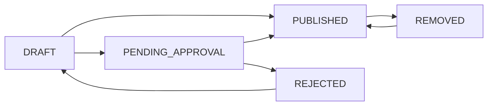

## Module Overview

The Portal Syndication Module allows real estate agents to publish property listings to three UAE property portals directly from PropWise CRM, and automatically receive leads back into the CRM pipeline.

<Info>
**Version:** 4.0 — Architectural revision introducing `Listing` entity as the marketing layer between `InventoryUnit` (inventory) and `ListingPortalSync` (per-portal state).
</Info>

### Three-Tier Architecture

```
InventoryUnit  →  Listing  →  ListingPortalSync
  (inventory)     (marketing)   (per-portal state)
```

- **`InventoryUnit`** — what the unit *is* (rooms, area, price, physical attributes). Unchanged by portal syndication logic.
- **`Listing`** — how the unit is *marketed* (title, descriptions, permit number, portal classifications, marketing media). Created by an agent from a `InventoryUnit`.
- **`ListingPortalSync`** — where the listing is *published* and its current state on each portal.

<Note>
This separation ensures `InventoryUnit` stays a clean inventory record and the `Listing` layer can eventually support off-plan units (`refUnitId`) without any structural change to the sync system.
</Note>

### Integration Model Per Portal

| Portal | Listing Syndication | Lead Ingestion | Listing Timing |
|---|---|---|---|
| Property Finder | REST API Push (JSON) | Webhook push (primary) + REST poll fallback (15 min) | Real-time (seconds) |
| Bayut | XML Feed Pull (unified) | Pull API polling — scheduled every 15 min | 30 min – 2 hr delay |
| dubizzle | XML Feed Pull (same as Bayut) | Pull API polling — same API + endpoint as Bayut | 30 min – 2 hr delay |

<Warning>
**Bayut / dubizzle lead ingestion note:** Bayut and dubizzle share one API endpoint and one Bearer token (per agency). The `source` field in each lead response determines which `LeadSource` enum value is used when the CRM lead is created.
</Warning>

### Data Flow Rules

- Listings flow **one direction only**: CRM → portals (CRM always wins)
- Leads flow **one direction only**: portals → CRM
- Portal data **never** overwrites CRM data
- `Listing` is the **single source of truth** for listing (marketing) content
- `InventoryUnit` is the **single source of truth** for unit inventory data

### Module Location

```typescript
src/modules/real-estate/portal-syndication/
```

Imported in `src/modules/real-estate/real-estate.module.ts`.

## Implementation Status

This section reconciles the specification with the shipped implementation. Where the spec and the build diverge, **the build is authoritative**.

### Phase A — Bayut/dubizzle Outbound (XML Feed) — BUILT

<Check>
**Self-contained `Listing`** — Every field any portal needs now lives on `Listing`, snapshotted from the unit in linked mode or entered directly in manual mode.
</Check>

#### Key Features Implemented

<Tabs>
  <Tab title="Listing Creation">
    **Two creation modes** converge on `ListingService.create(dto, userId, orgId)`:
    - **Linked mode**: snapshots from unit then applies DTO overrides
    - **Manual mode**: direct entry without unit connection
    - `refreshFromUnit`: re-pulls snapshot fields while preserving marketing content
  </Tab>
  
  <Tab title="Value Transforms">
    **Centralized value transforms** in `src/modules/shared/portal-value-map.ts`:
    - `purposeToBayut/purposeToPfPriceType`
    - `furnishedToBayut/Pf`
    - `bedroomsToBayut/Pf`
    - `bathroomsToBayut/Pf`
    - `rentalPeriodToBayut`
    - `finishingToPf`
    - `emirateToPfCompliance/UaeEmirate`
  </Tab>
  
  <Tab title="XML Feed">
    **`BayutDubizzleFeedAdapter`** + CDATA XML serializer:
    - `Property_Ref_No = UNIT-{orgShortCode}-{listing.id}`
    - Public feed: `GET /portal-syndication/feeds/:orgId?token=`
    - Includes published rows as `Property_Status=live`
    - Recently-removed rows as `deleted` for ≥48h
  </Tab>
</Tabs>

#### Sync State Machine



<Steps>
  <Step title="Draft Creation">
    New listings start in `DRAFT` status
  </Step>
  <Step title="Publish Authorization">
    Gate A checks `real_estate.listing.publish` permission
  </Step>
  <Step title="Approval Process">
    Without permission, listing goes to `PENDING_APPROVAL`
  </Step>
  <Step title="Manager Review">
    `real_estate.manage` user can approve or reject
  </Step>
</Steps>

### Publish Authorization

<AccordionGroup>
  <Accordion title="Gate A - Permission Check">
    `SyndicationService.publish` checks `real_estate.listing.publish` permission. Managers hold it via implication. Without it, the listing goes to `ListingStatus.PENDING_APPROVAL`.
  </Accordion>
  
  <Accordion title="Approval Workflow">
    A `real_estate.manage` user uses `POST /:listingId/approve|reject`:
    - **Reject**: moves to `ListingStatus.REJECTED` with rejection reason
    - **Approve**: honors submitter's publish intent (`publishOnApproval`)
  </Accordion>
  
  <Accordion title="Delete Process">
    `DELETE /:listingId` soft-deletes (`isDeleted=true`) after removing from portals. No user-facing archived state exists.
  </Accordion>
</AccordionGroup>

### Listing Approval Notifications

<CardGroup cols={2}>
  <Card title="Submit for Approval" icon="paper-plane">
    `LISTING_APPROVAL_REQUESTED` to every `real_estate.manage` approver
  </Card>
  <Card title="Approve" icon="check">
    `LISTING_APPROVED` to the publisher with publish status
  </Card>
  <Card title="Reject" icon="x">
    `LISTING_REJECTED` to the publisher with rejection reason
  </Card>
  <Card title="Delete" icon="trash">
    `LISTING_DELETED` to publisher (only when deleter ≠ publisher)
  </Card>
</CardGroup>

### Inventory Cascade

When an inventory unit is deleted, users choose the impact on linked listings:

<Tabs>
  <Tab title="Remove Linked Listings (Default)">
    ```typescript
    removeLinkedListings = true
    ```
    - Remove unit's listings from all portals
    - Archive listings with audit attribution
  </Tab>
  
  <Tab title="Keep Listings">
    ```typescript
    removeLinkedListings = false
    ```
    - Keep listings live but sever unit link
    - Convert to self-contained manual listings
  </Tab>
</Tabs>

### Phase A.5 — Unified Lead Capture — BUILT

<Check>
New module `src/modules/crm/lead-capture/` owns the unified lead capture system.
</Check>

#### Lead Capture Components

- **`LeadCaptureService.capture()`** - Main capture service
- **`CapturedLeadInput`** - Input contract
- **`LeadCaptureSource`** - Source interface
- **`LeadCaptureSourceRegistry`** - Source registry
- **`CapturedLead`** - Idempotency ledger
- **`lead-ingestion`** - pg-boss queue + worker

#### Bayut Lead Integration

<Steps>
  <Step title="Lead Parser">
    **`BayutLeadParserService`** handles 7 shapes → `NormalizedBayutLead`
  </Step>
  <Step title="Lead Adapter">
    **`BayutLeadCaptureAdapter`** processes normalized leads
  </Step>
  <Step title="Lead Poller">
    **`BayutLeadPollerService`** runs every 15 minutes across organizations
  </Step>
  <Step title="Lead Processing">
    Polls enabled Bayut configurations, handles dubizzle leads conditionally
  </Step>
</Steps>

### Phase B — Property Finder (REST Push) — BUILT

<Tip>
Property Finder integration uses real-time REST API push with comprehensive validation and compliance checking.
</Tip>

#### Core Services

<AccordionGroup>
  <Accordion title="Token Management">
    **`PfTokenService`** - 30-minute token cache with automatic 401 invalidation
  </Accordion>
  
  <Accordion title="Location Mapping">
    **`PfLocationMappingService`** - 24-hour cache for location data
  </Accordion>
  
  <Accordion title="Agent Mapping">
    **`PfAgentMappingService`** - 24-hour cache + `refreshOrgAgentMappings`
  </Accordion>
  
  <Accordion title="Compliance Service">
    **`PfComplianceService`** - Handles RERA, DTCM, ADREC compliance requirements
  </Accordion>
  
  <Accordion title="Image Processing">
    **`ListingImageService`** - Sharp validation/auto-fix with `processedMedia` cache
  </Accordion>
</AccordionGroup>

#### Property Finder Contract Fixes

<Warning>
The following fixes have been applied and verified against PF API documentation:
</Warning>

- **Mortgage Structure**: `price.mortgage = { enabled, comment }` + `price.numberOfMortgageYears`
- **Bedroom/Bathroom Enums**: STRING enums (`studio|"1".."30"`, `none|"1".."20"`)
- **Size Calculations**: Plot area for UAE villa/townhouse/bungalow, built-up area for those types
- **Compliance Types**: Handles Dubai `rera` and `dtcm`, Abu Dhabi `adrec`, Northern Emirates exempt

#### Compliance Type Resolution

```typescript
// Auto-derived from emirate + purpose/rentalPeriod
const complianceType = resolvePfComplianceType(emirate, purpose, rentalPeriod);

// Override with explicit permitType
if (listing.permitType !== 'AUTO') {
  complianceType = listing.permitType;
}
```

<CodeGroup>
```typescript Dubai RERA
{
  type: 'rera',
  permitNumber: listing.permitNumber
}
```

```typescript Dubai DTCM (Holiday Homes)
{
  type: 'dtcm',
  permitNumber: listing.permitNumber
}
```

```typescript Abu Dhabi ADREC
{
  type: 'adrec',
  permitNumber: `${permitNumber}#${brokerRegistrationNo}`
}
```

```typescript Exempt Zones
{
  type: 'none'
  // DIFC, JAFZA, Northern Emirates
}
```
</CodeGroup>

## API Endpoints

### Listing Management

| Method | Endpoint | Description |
|--------|----------|-------------|
| `POST` | `/listings` | Create new listing |
| `GET` | `/listings` | List listings with filters |
| `GET` | `/listings/:id` | Get listing details |
| `PUT` | `/listings/:id` | Update listing |
| `DELETE` | `/listings/:id` | Soft delete listing |

### Syndication Operations

| Method | Endpoint | Description |
|--------|----------|-------------|
| `POST` | `/listings/:id/publish` | Publish to portals |
| `POST` | `/listings/:id/unpublish` | Remove from portals |
| `POST` | `/listings/:id/approve` | Approve pending listing |
| `POST` | `/listings/:id/reject` | Reject pending listing |
| `POST` | `/listings/:id/refresh-from-unit` | Sync with inventory unit |

### Portal Feeds

| Method | Endpoint | Description |
|--------|----------|-------------|
| `GET` | `/portal-syndication/feeds/:orgId` | Public XML feed for Bayut/dubizzle |

<Note>
Feed endpoint requires `?token=` parameter for authentication.
</Note>

### Webhook Endpoints

| Method | Endpoint | Description |
|--------|----------|-------------|
| `POST` | `/portal-webhooks/property-finder` | Property Finder lead webhooks |

## Database Schema

### Core Tables

<Tabs>
  <Tab title="Listing">
    ```sql
    CREATE TABLE listing (
      id UUID PRIMARY KEY,
      inventory_unit_id UUID REFERENCES inventory_unit(id),
      organization_id UUID NOT NULL,
      created_by UUID NOT NULL,
      
      -- Marketing fields
      title VARCHAR(255),
      description_en TEXT,
      description_ar TEXT,
      permit_number VARCHAR(100),
      permit_type permit_type_enum,
      
      -- Snapshotted unit data
      property_type property_type_enum,
      purpose listing_purpose_enum,
      price_aed DECIMAL(15,2),
      bedrooms INTEGER,
      bathrooms INTEGER,
      area_sqft DECIMAL(10,2),
      
      -- Status and timestamps
      status listing_status_enum DEFAULT 'DRAFT',
      created_at TIMESTAMP DEFAULT NOW(),
      updated_at TIMESTAMP DEFAULT NOW(),
      is_deleted BOOLEAN DEFAULT FALSE
    );
    ```
  </Tab>
  
  <Tab title="ListingPortalSync">
    ```sql
    CREATE TABLE listing_portal_sync (
      id UUID PRIMARY KEY,
      listing_id UUID NOT NULL REFERENCES listing(id),
      portal portal_enum NOT NULL,
      
      -- Sync state
      sync_status sync_status_enum DEFAULT 'DRAFT',
      portal_listing_id VARCHAR(255),
      last_synced_at TIMESTAMP,
      
      -- Error tracking
      error_message TEXT,
      retry_count INTEGER DEFAULT 0,
      next_retry_at TIMESTAMP,
      
      UNIQUE(listing_id, portal)
    );
    ```
  </Tab>
  
  <Tab title="PortalConfiguration">
    ```sql
    CREATE TABLE portal_configuration (
      id UUID PRIMARY KEY,
      organization_id UUID NOT NULL,
      portal portal_enum NOT NULL,
      
      -- Credentials (encrypted)
      api_key TEXT, -- Bearer token for Bayut/dubizzle
      client_id VARCHAR(255), -- Property Finder
      client_secret TEXT, -- Property Finder (encrypted)
      
      -- Settings
      is_enabled BOOLEAN DEFAULT FALSE,
      lead_ingestion_enabled BOOLEAN DEFAULT FALSE,
      last_lead_poll_at TIMESTAMP,
      
      UNIQUE(organization_id, portal)
    );
    ```
  </Tab>
</Tabs>

### Enums

<CodeGroup>
```sql Listing Status
CREATE TYPE listing_status_enum AS ENUM (
  'DRAFT',
  'PENDING_APPROVAL', 
  'REJECTED',
  'PUBLISHED',
  'REMOVED'
);
```

```sql Portal Enum
CREATE TYPE portal_enum AS ENUM (
  'PROPERTY_FINDER',
  'BAYUT', 
  'DUBIZZLE'
);
```

```sql Sync Status
CREATE TYPE sync_status_enum AS ENUM (
  'DRAFT',
  'PENDING',
  'ACTIVE', 
  'FAILED',
  'REMOVED'
);
```

```sql Listing Purpose
CREATE TYPE listing_purpose_enum AS ENUM (
  'SALE',
  'RENT'
);
```
</CodeGroup>

## Error Handling

### Retry Strategy

<Steps>
  <Step title="Immediate Retry">
    First failure: retry immediately
  </Step>
  <Step title="Exponential Backoff">
    Subsequent failures: exponential backoff (1min, 2min, 4min, 8min, 16min)
  </Step>
  <Step title="Max Retries">
    After 5 failures, mark as permanently failed
  </Step>
  <Step title="Manual Intervention">
    Failed syncs require manual review and retry
  </Step>
</Steps>

### Common Error Types

<AccordionGroup>
  <Accordion title="Validation Errors">
    - Missing required fields
    - Invalid property type mappings
    - Compliance violations
    - Image processing failures
  </Accordion>
  
  <Accordion title="Authentication Errors">
    - Expired tokens
    - Invalid credentials
    - Rate limiting
  </Accordion>
  
  <Accordion title="Portal Errors">
    - Portal maintenance windows
    - API changes
    - Network timeouts
  </Accordion>
</AccordionGroup>

## Monitoring and Analytics

### Key Metrics

- **Sync Success Rate**: Percentage of successful publications per portal
- **Lead Conversion Rate**: Portal leads converted to CRM opportunities  
- **Response Times**: Average time from publish to portal availability
- **Error Frequency**: Common failure patterns and resolution times

### Logging Strategy

<Tip>
All portal interactions are logged with correlation IDs for full traceability from listing creation through lead capture.
</Tip>

```typescript
// Example log structure
{
  correlationId: "uuid",
  listingId: "uuid", 
  portal: "PROPERTY_FINDER",
  action: "PUBLISH",
  status: "SUCCESS|ERROR",
  duration: 1234,
  portalListingId: "PF123456",
  timestamp: "2024-01-01T00:00:00Z"
}
```

## Security Considerations

### Data Protection

- All portal credentials encrypted at rest
- API keys rotated regularly
- Webhook signatures validated
- Rate limiting on all external API calls

### Access Control

<CardGroup cols={2}>
  <Card title="Listing Permissions" icon="shield-check">
    - `real_estate.listing.publish` - Publish listings
    - `real_estate.manage` - Approve/reject listings
  </Card>
  <Card title="Portal Configuration" icon="gear">
    - `real_estate.admin` - Manage portal credentials
    - `real_estate.manage` - View sync status
  </Card>
</CardGroup>

### Audit Trail

All listing and syndication actions are logged with:
- User ID and organization
- Timestamp and IP address  
- Before/after state changes
- Portal responses and error details