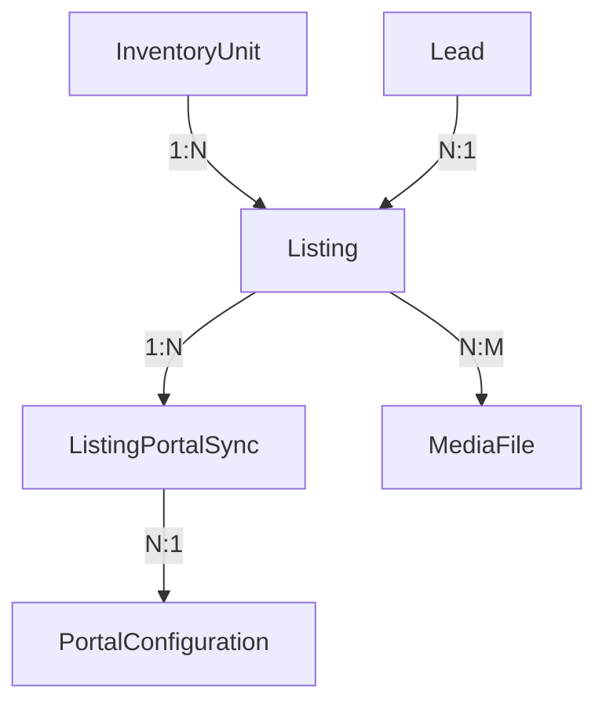

## Module Overview

The Portal Syndication Module allows real estate agents to publish property listings to three UAE property portals directly from PropWise CRM, and automatically receive leads back into the CRM pipeline.

### Three-Tier Architecture

```
InventoryUnit  →  Listing  →  ListingPortalSync
  (inventory)     (marketing)   (per-portal state)
```

- **`InventoryUnit`** — what the unit *is* (rooms, area, price, physical attributes). Unchanged by portal syndication logic.
- **`Listing`** — how the unit is *marketed* (title, descriptions, permit number, portal classifications, marketing media). Created by an agent from a `InventoryUnit`.
- **`ListingPortalSync`** — where the listing is *published* and its current state on each portal.

<Note>
This separation ensures `InventoryUnit` stays a clean inventory record and the `Listing` layer can eventually support off-plan units (`refUnitId`) without any structural change to the sync system.
</Note>

### Integration Model Per Portal

| Portal | Listing Syndication | Lead Ingestion | Listing Timing |
|---|---|---|---|
| Property Finder | REST API Push (JSON) | Webhook push (primary) + REST poll fallback (15 min) | Real-time (seconds) |
| Bayut | XML Feed Pull (unified) | Pull API polling — scheduled every 15 min | 30 min – 2 hr delay |
| dubizzle | XML Feed Pull (same as Bayut) | Pull API polling — same API + endpoint as Bayut | 30 min – 2 hr delay |

<Info>
**Bayut / dubizzle lead ingestion note:** Bayut and dubizzle share one API endpoint and one Bearer token (per agency). The `source` field in each lead response (`"bayut"` or `"dubizzle"`) determines which `LeadSource` enum value is used when the CRM lead is created.
</Info>

### Data Flow Rules

- Listings flow **one direction only**: CRM → portals (CRM always wins)
- Leads flow **one direction only**: portals → CRM
- Portal data **never** overwrites CRM data
- `Listing` is the **single source of truth** for listing (marketing) content
- `InventoryUnit` is the **single source of truth** for unit inventory data

### Module Location

```
src/modules/real-estate/portal-syndication/
```

Imported in `src/modules/real-estate/real-estate.module.ts`.

## Implementation Status

This section reconciles the specification with the shipped implementation. Where the spec and the build diverge, **the build below is authoritative**.

### Phase A — Bayut/dubizzle Outbound (XML Feed) — Built

<Tabs>
  <Tab title="Self-Contained Listing">
    - **Self-contained `Listing`**: every field any portal needs now lives on `Listing`
    - Snapshotted from the unit in linked mode via `ListingService.copyUnitToListing`
    - Can be entered directly in manual mode
    - Adapters + `PortalValidationService` read ONLY `listing.X` — never `listing.inventoryUnit.X`
    - `inventoryUnit` FK is **nullable** (manual listings have none)
    - New `ListingPurpose` enum (`Sale`/`Rent`)
    - New columns added by `Migration20260531120000_SelfContainedListingFields`
  </Tab>
  
  <Tab title="Creation Modes">
    Two creation modes converge on `ListingService.create(dto, userId, orgId)`:
    
    - **Linked mode**: snapshots then applies DTO overrides
    - **Manual mode**: direct entry without unit connection
    - `refreshFromUnit`: re-pulls snapshot fields while preserving marketing content + agent overrides
  </Tab>
</Tabs>

### Centralized Value Transforms

Located in `src/modules/shared/portal-value-map.ts`:

```typescript
// Purpose mappings
purposeToBayut()
purposeToPfPriceType()

// Property condition mappings  
furnishedToBayut()
furnishedToPf()

// Room mappings
bedroomsToBayut()
bedroomsToPf()
bathroomsToBayut()
bathroomsToPf()

// Location mappings
emirateToPfCompliance()
emirateToUaeEmirate()

// Additional mappings
rentalPeriodToBayut()
finishingToPf()
```

<Note>
Both adapters AND the validator consume these centralized transforms to ensure consistency.
</Note>

### Bayut/dubizzle XML Feed

- **`BayutDubizzleFeedAdapter`** with CDATA XML serializer (`utils/bayut-xml.serializer.ts`)
- `Property_Ref_No = UNIT-{orgShortCode}-{listing.id}` with null-`orgShortCode` fallback
- **Public feed**: `GET /portal-syndication/feeds/:orgId?token=` (`@PublicEndpoint`)
- Feed includes published rows as `Property_Status=live` AND recently-removed rows as `deleted` for ≥48h

### Sync State Machine

<Steps>
  <Step title="Draft to Published">
    `DRAFT → PUBLISHED` added to `VALID_TRANSITIONS` for feed portals
  </Step>
  
  <Step title="Removed to Published">  
    `REMOVED → PUBLISHED` remains valid (existing)
  </Step>
  
  <Step title="Invalid Transition">
    `PENDING → PUBLISHED` remains invalid
  </Step>
</Steps>

### Publish Authorization

<Warning>
Publish authorization follows a two-gate system with owner bypass capabilities.
</Warning>

**Gate A - Permission Check:**
- `SyndicationService.publish` checks `real_estate.listing.publish`
- Managers hold this permission via implication
- Without permission: listing goes to `ListingStatus.PENDING_APPROVAL`

**Approval Workflow:**
- `POST /:listingId/approve|reject` for users with `real_estate.manage`
- **Reject**: moves to `ListingStatus.REJECTED`, persists rejection reason
- **Approve**: honors submitter's publish intent (`publishOnApproval`)

**Owner Self-Manage Bypass:**
- Approval gate only blocks non-publisher's **first** publish
- Once `Listing.approvedAt` is set, owner can publish/unpublish directly
- Owner = publisher (`createdBy`), agent, or linked-unit manager (`unitManager`)

### Phase A.5 — Unified Inbound Lead Capture — Built

New module **`src/modules/crm/lead-capture/`** includes:

<CardGroup cols={2}>
  <Card title="Core Services" icon="gear">
    - `LeadCaptureService.capture()`
    - `CapturedLeadInput` contract
    - `LeadCaptureSource` interface
    - `LeadCaptureSourceRegistry`
  </Card>
  
  <Card title="Infrastructure" icon="server">
    - Org-default `LeadCaptureSettings` 
    - `CapturedLead` idempotency ledger
    - `lead-ingestion` pg-boss queue
    - `LeadIngestionWorker`
  </Card>
</CardGroup>

**Bayut Lead Integration:**
- **`BayutLeadParserService`**: handles 7 lead shapes → `NormalizedBayutLead`
- **`BayutLeadCaptureAdapter`**: transforms normalized leads to CRM format
- **`BayutLeadPollerService`**: `@Cron('*/15 …')` cross-org polling

<Info>
Polls Bayut rows with `leadIngestionEnabled = true` + token, drops dubizzle-source leads unless org's dubizzle row also has `leadIngestionEnabled = true`.
</Info>

### Phase B — Property Finder (REST Push) — Built

<AccordionGroup>
  <Accordion title="Core Services">
    - `PfTokenService` (30-min token cache, invalidate-on-401)
    - `PfLocationMappingService` (24h cache)  
    - `PfAgentMappingService` (24h cache + `refreshOrgAgentMappings`)
    - `PfComplianceService`
    - `PfCreditService`
  </Accordion>
  
  <Accordion title="Media & Publishing">
    - `ListingImageService` (sharp validate/auto-fix + `processedMedia` cache)
    - `PropertyFinderAdapter` (6-step publish process)
    - `PfSyndicationWorker` (`pf-syndication` queue)
  </Accordion>
  
  <Accordion title="Lead Integration">
    - `PfWebhookSubscriptionService`
    - Public `PortalWebhookController` (HMAC over raw body)
    - `PfLeadCaptureAdapter`
  </Accordion>
  
  <Accordion title="Background Services">
    - `SyncReconciliationService` (cron)
    - `ApiKeyExpirationCheckService` (cron)
  </Accordion>
</AccordionGroup>

## Listing Approval Notifications

The system emits notifications via `EventEmitter2` for key approval workflow events:

<Tabs>
  <Tab title="Submit for Approval">
    **Event**: `LISTING_APPROVAL_REQUESTED`
    - **To**: Every `real_estate.manage` approver (bulk)
    - **Resolved via**: `PermissionService.getUserIdsWithOrgPermission`
  </Tab>
  
  <Tab title="Approve">
    **Event**: `LISTING_APPROVED` 
    - **To**: Publisher (`createdBy`)
    - **Payload**: `published` indicates auto-publish vs approval-only
  </Tab>
  
  <Tab title="Reject">
    **Event**: `LISTING_REJECTED`
    - **To**: Publisher
    - **Includes**: Rejection reason
  </Tab>
  
  <Tab title="Delete">
    **Event**: `LISTING_DELETED`
    - **To**: Publisher
    - **Condition**: ONLY when deleter ≠ publisher
  </Tab>
</Tabs>

## Inventory Cascade Management

<Warning>
When deleting inventory units, users can choose how to handle linked listings.
</Warning>

The `inventory-unit.deleted` event carries `removeLinkedListings` (user choice):

<Steps>
  <Step title="Remove Linked Listings (Default)">
    `removeLinkedListings = true`
    - Remove unit's listings from all portals via `SyndicationService.removeFromAllPortals`
    - Archive listings via `ListingService.archiveByUnit` with audit attribution
  </Step>
  
  <Step title="Preserve as Manual Listings">
    `removeLinkedListings = false`  
    - Keep listings live but sever unit link
    - `ListingService.unlinkFromUnit` sets `inventoryUnit = null`
    - Converts to self-contained manual listings
  </Step>
</Steps>

**API Endpoint**: `DELETE /inventory/units/:id?removeLinkedListings=true|false`

<Note>
String `"false"` is the only opt-out; anything else defaults to remove. Implementation is event-driven to avoid circular dependencies.
</Note>

## Data Architecture

### Entity Relationships



### Key Enums

<CodeGroup>
```typescript ListingStatus
enum ListingStatus {
  DRAFT = 'draft',
  PENDING_APPROVAL = 'pending_approval', 
  REJECTED = 'rejected',
  PUBLISHED = 'published',
  REMOVED = 'removed'
}
```

```typescript ListingPurpose  
enum ListingPurpose {
  SALE = 'sale',
  RENT = 'rent'
}
```

```typescript SyncStatus
enum SyncStatus {
  PENDING = 'pending',
  ACTIVE = 'active', 
  FAILED = 'failed',
  REMOVED = 'removed'
}
```

```typescript Portal
enum Portal {
  PROPERTY_FINDER = 'property_finder',
  BAYUT = 'bayut', 
  DUBIZZLE = 'dubizzle'
}
```
</CodeGroup>

## API Endpoints

### Listing Management

<AccordionGroup>
  <Accordion title="Core CRUD Operations">
    - `POST /listings` - Create new listing
    - `GET /listings/:id` - Get listing details  
    - `PATCH /listings/:id` - Update listing
    - `DELETE /listings/:id` - Soft delete listing
    - `POST /listings/:id/refresh-from-unit` - Refresh from linked unit
  </Accordion>
  
  <Accordion title="Publishing & Approval">
    - `POST /listings/:id/publish` - Publish to portals
    - `POST /listings/:id/unpublish` - Remove from portals
    - `POST /listings/:id/approve` - Approve pending listing
    - `POST /listings/:id/reject` - Reject pending listing
  </Accordion>
  
  <Accordion title="Specialized Views">
    - `GET /listings?type=requests` - Approval queue (managers only)
    - `GET /listings?status=pending_approval` - Pending approvals
    - `GET /listings?status=rejected` - Rejected listings
  </Accordion>
</AccordionGroup>

### Portal Integration

<AccordionGroup>
  <Accordion title="Feed Endpoints (Public)">
    - `GET /portal-syndication/feeds/:orgId?token=` - Bayut/dubizzle XML feed
    - `POST /portal-syndication/webhooks/property-finder` - PF webhook receiver
  </Accordion>
  
  <Accordion title="Configuration">
    - `GET /portal-configurations` - List portal configs
    - `POST /portal-configurations` - Create portal config  
    - `PATCH /portal-configurations/:id` - Update portal config
  </Accordion>
</AccordionGroup>

## Configuration

### Environment Variables

<CodeGroup>
```bash Property Finder
PF_API_BASE_URL=https://api.propertyfinder.ae
PF_WEBHOOK_SECRET=your-webhook-secret
PF_TOKEN_CACHE_TTL=1800 # 30 minutes
```

```bash Bayut/dubizzle  
BAYUT_LEAD_API_BASE_URL=https://leads-api.bayut.com
BAYUT_FEED_TOKEN_LENGTH=32
BAYUT_DELETED_RETENTION_HOURS=48
```

```bash General
PORTAL_SYNC_BATCH_SIZE=50
LEAD_INGESTION_POLL_INTERVAL=15 # minutes
IMAGE_PROCESSING_MAX_SIZE=5242880 # 5MB
```
</CodeGroup>

### Portal Configuration Schema

```typescript
interface PortalConfiguration {
  id: string
  organizationId: string
  portal: Portal
  isEnabled: boolean
  leadIngestionEnabled: boolean
  apiKey?: string // Encrypted
  feedToken?: string // For Bayut/dubizzle
  lastLeadPollAt?: Date
  createdAt: Date
  updatedAt: Date
}
```

## Error Handling

<Warning>
All portal integrations implement comprehensive error handling with retry mechanisms.
</Warning>

### Common Error Scenarios

<Tabs>
  <Tab title="Authentication Errors">
    - **401 Unauthorized**: Token refresh attempted automatically
    - **403 Forbidden**: Manual intervention required
    - **API Key Expiration**: Automated notifications sent to org admins
  </Tab>
  
  <Tab title="Validation Errors">
    - **Missing Required Fields**: Detailed field-level error messages
    - **Invalid Data Format**: Auto-correction attempted where possible
    - **Portal-Specific Rules**: Compliance validation before submission
  </Tab>
  
  <Tab title="Network Errors">
    - **Timeout**: Exponential backoff retry (max 3 attempts)
    - **Rate Limiting**: Respect portal-specific rate limits
    - **Service Unavailable**: Queue for later retry
  </Tab>
</Tabs>

### Error Monitoring

All errors are logged with structured data for monitoring:

```typescript
{
  level: 'error',
  message: 'Portal sync failed',
  listingId: 'uuid',
  portal: 'property_finder', 
  error: {
    code: 'VALIDATION_ERROR',
    details: {...}
  },
  context: {
    organizationId: 'uuid',
    userId: 'uuid'
  }
}
```

## Performance Considerations

<Tips>
- **Caching**: Location and agent mappings cached for 24h
- **Batching**: Portal syncs processed in configurable batches
- **Queue Management**: Separate queues for different portal operations
- **Image Optimization**: Automatic image processing and optimization
- **Database Indexing**: Strategic indexes on frequently queried fields
</Tips>

### Monitoring Metrics

Key metrics to monitor for system health:

- Sync success/failure rates per portal
- Average sync processing time  
- Queue depth and processing lag
- Lead ingestion rates and delays
- API quota usage per portal
- Error rates by error type

## Security

<Warning>
All sensitive portal credentials are encrypted at rest and transmitted securely.
</Warning>

### Security Measures

<Steps>
  <Step title="Credential Protection">
    - API keys encrypted using organization-specific keys
    - Webhook signatures validated using HMAC
    - Feed tokens regularly rotated
  </Step>
  
  <Step title="Access Control">
    - Role-based permissions for listing management
    - Approval workflow for non-managers
    - Owner-based access for post-approval operations  
  </Step>
  
  <Step title="Data Validation">
    - Input sanitization for all user data
    - Portal-specific validation rules enforced
    - Media file type and size restrictions
  </Step>
</Steps>

### Compliance

- **GDPR**: Lead data handling complies with data protection regulations
- **Portal ToS**: Adherence to each portal's terms of service
- **UAE Regulations**: Compliance with local real estate regulations including DLD requirements