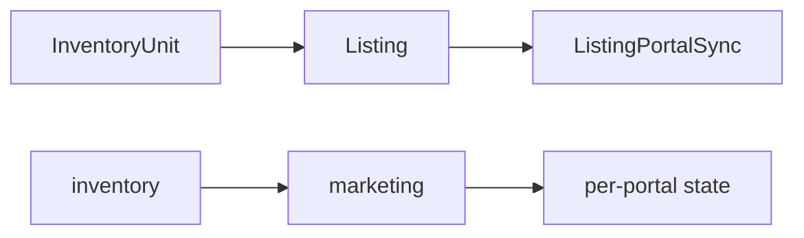
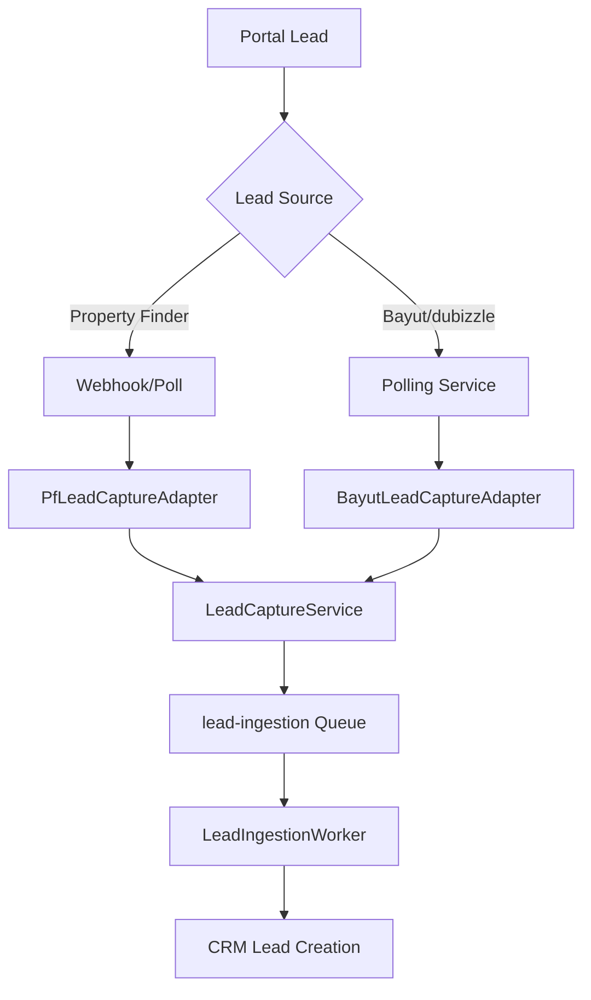

## Module Overview

The Portal Syndication Module allows real estate agents to publish property listings to three UAE property portals directly from PropWise CRM, and automatically receive leads back into the CRM pipeline.

### Three-Tier Architecture



<CardGroup cols={3}>
  <Card title="InventoryUnit" icon="building">
    What the unit *is* - rooms, area, price, physical attributes. Unchanged by portal syndication logic.
  </Card>
  <Card title="Listing" icon="megaphone">
    How the unit is *marketed* - title, descriptions, permit number, portal classifications, marketing media.
  </Card>
  <Card title="ListingPortalSync" icon="link">
    Where the listing is *published* and its current state on each portal.
  </Card>
</CardGroup>

<Note>
This separation ensures `InventoryUnit` stays a clean inventory record and the `Listing` layer can eventually support off-plan units (`refUnitId`) without any structural change to the sync system.
</Note>

### Integration Model Per Portal

| Portal | Listing Syndication | Lead Ingestion | Listing Timing |
|---|---|---|---|
| Property Finder | REST API Push (JSON) | Webhook push (primary) + REST poll fallback (15 min) | Real-time (seconds) |
| Bayut | XML Feed Pull (unified) | Pull API polling — scheduled every 15 min | 30 min – 2 hr delay |
| dubizzle | XML Feed Pull (same as Bayut) | Pull API polling — same API + endpoint as Bayut | 30 min – 2 hr delay |

<Warning>
Bayut and dubizzle share one API endpoint and one Bearer token (per agency). The `source` field in each lead response determines which `LeadSource` enum value is used when the CRM lead is created.
</Warning>

### Data Flow Rules

<Check>CRM → portals (CRM always wins)</Check>
<Check>portals → CRM (leads only)</Check>
<Check>`Listing` is the single source of truth for marketing content</Check>
<Check>`InventoryUnit` is the single source of truth for inventory data</Check>

### Module Location

```typescript
src/modules/real-estate/portal-syndication/
```

Imported in `src/modules/real-estate/real-estate.module.ts`.

## Implementation Status (Bayut Listing Syndication)

This section reconciles the spec with the shipped implementation. Where the spec and the build diverge, **the build below is authoritative**.

### Phase A — Bayut/dubizzle outbound (XML feed) — BUILT

<Tabs>
  <Tab title="Self-contained Listing">
    Every field any portal needs now lives on `Listing` (snapshotted from the unit in linked mode via `ListingService.copyUnitToListing`, or entered directly in manual mode). 
    
    - Adapters + `PortalValidationService` read ONLY `listing.X` — never `listing.inventoryUnit.X`
    - `inventoryUnit` FK is **nullable** (manual listings have none)
    - New `ListingPurpose` enum (`Sale`/`Rent`)
    - New columns added by `Migration20260531120000_SelfContainedListingFields`
  </Tab>
  
  <Tab title="Creation Modes">
    Two creation modes converge on `ListingService.create(dto, userId, orgId)`:
    
    - **Linked mode**: snapshots then applies DTO overrides
    - **Manual mode**: direct entry without unit reference
    - `refreshFromUnit` re-pulls snapshot fields while preserving marketing content + agent overrides
  </Tab>
  
  <Tab title="Value Transforms">
    Centralized value transforms in `src/modules/shared/portal-value-map.ts`:
    
    ```typescript
    // Purpose mappings
    purposeToBayut(purpose: ListingPurpose): string
    purposeToPfPriceType(purpose: ListingPurpose): string
    
    // Furnishing mappings
    furnishedToBayut(furnished: Furnished): string
    furnishedToPf(furnished: Furnished): string
    
    // Room mappings
    bedroomsToBayut(bedrooms: number): string
    bathroomsToBayut(bathrooms: number): string
    
    // Location mappings
    emirateToPfCompliance(emirate: string): string
    ```
  </Tab>
</Tabs>

### Phase A.5 — Unified Inbound Lead Capture — BUILT

<Steps>
  <Step title="Lead Capture Module">
    New module `src/modules/crm/lead-capture/` owns:
    - `LeadCaptureService.capture()`
    - `CapturedLeadInput` contract
    - `LeadCaptureSource` interface
    - `LeadCaptureSourceRegistry`
    - Org-default `LeadCaptureSettings`
    - `CapturedLead` idempotency ledger
    - Source-agnostic `lead-ingestion` pg-boss queue + `LeadIngestionWorker`
  </Step>
  
  <Step title="Bayut Lead Processing">
    **BayutLeadParserService** (pure, 7 shapes → `NormalizedBayutLead`) + **BayutLeadCaptureAdapter** + **BayutLeadPollerService**:
    
    - `@Cron('*/15 …')` polling across organizations
    - Selects Bayut rows with `leadIngestionEnabled = true` + token
    - Decrypts Bearer token from `PortalConfiguration.apiKey`
    - Drops dubizzle-source leads unless org's dubizzle row has `leadIngestionEnabled = true`
    - Enqueues `lead-ingestion` jobs
    - On 401 error, does NOT advance `lastLeadPollAt`
  </Step>
  
  <Step title="Configuration">
    ```typescript
    // Environment configuration
    app.bayut.leadApiBaseUrl: string
    ```
  </Step>
</Steps>

### Phase B — Property Finder (REST push) — BUILT

<AccordionGroup>
  <Accordion title="Core Services">
    - **PfTokenService**: 30-min token cache, invalidate-on-401
    - **PfLocationMappingService**: 24h cache
    - **PfAgentMappingService**: 24h cache + `refreshOrgAgentMappings`
    - **PfComplianceService**: Compliance validation
    - **PfCreditService**: Credit management
    - **ListingImageService**: Sharp validate/auto-fix + `processedMedia` cache
  </Accordion>
  
  <Accordion title="Syndication Components">
    - **PropertyFinderAdapter**: 6-step publish process
    - **PfWebhookSubscriptionService**: Webhook management
    - **PfSyndicationWorker**: `pf-syndication` queue processing
    - **SyncReconciliationService**: Cron-based reconciliation
    - **ApiKeyExpirationCheckService**: API key monitoring
  </Accordion>
  
  <Accordion title="Lead Integration">
    - **Public PortalWebhookController**: HMAC verification over raw body
    - **PfLeadCaptureAdapter**: Property Finder lead processing
    - Real-time webhook processing with REST poll fallback
  </Accordion>
</AccordionGroup>

## Listing Management

### Publish Authorization

<Info>
The publish authorization system implements a two-gate approval process for listing publication.
</Info>

#### Gate A: Publish Permission Check

```typescript
// SyndicationService.publish
if (!hasPermission('real_estate.listing.publish')) {
  // Route to approval workflow
  listing.status = ListingStatus.PENDING_APPROVAL;
  // Notify managers with real_estate.manage permission
}
```

<Steps>
  <Step title="Permission Check">
    Gate A checks `real_estate.listing.publish` permission. Managers hold it via implication.
  </Step>
  
  <Step title="Approval Workflow">
    Without permission, listing goes to `ListingStatus.PENDING_APPROVAL` and a `real_estate.manage` user uses:
    - `POST /:listingId/approve` 
    - `POST /:listingId/reject`
  </Step>
  
  <Step title="Rejection Handling">
    **Reject** moves listing to `ListingStatus.REJECTED` and persists:
    - `rejectionReason` (approver's note)
    - `rejectedAt` / `rejectedBy`
    
    Submitter can edit + resubmit or delete.
  </Step>
  
  <Step title="Approval Process">
    **Approve** honors submitter's publish intent via `publishOnApproval`:
    - With portal targets: auto-publishes to them (→ ACTIVE)
    - Approval-only: vetted into plain DRAFT without publishing
    
    Stamps `Listing.approvedAt` / `approvedBy` (set-once, never cleared).
  </Step>
</Steps>

#### Owner Self-Manage Bypass

<Tip>
After initial approval, listing owners can manage their listings directly without going through the approval process again.
</Tip>

The approval gate only blocks a non-publisher's **first** publish. Once `Listing.approvedAt` is set, the listing's **owner** can:

- Publish/unpublish directly
- Toggle portal syndication
- Manage listing without approval

**Owner definition**: publisher (`createdBy`) / `agent` / linked-unit `unitManager`

### Inventory Cascade on Delete

When deleting an inventory unit, users choose how to handle linked listings:

<Tabs>
  <Tab title="Remove Linked Listings (Default)">
    ```typescript
    // removeLinkedListings = true
    removeLinkedListings = true
    ```
    
    - Remove unit's listings from all portals
    - Archive listings with audit attribution
    - Default behavior for most deletions
  </Tab>
  
  <Tab title="Keep Listings Independent">
    ```typescript
    // removeLinkedListings = false  
    removeLinkedListings = false
    ```
    
    - Keep listings live but sever unit link
    - Set `inventoryUnit = null`
    - Convert to self-contained manual listings
    - User can continue editing/publishing
  </Tab>
</Tabs>

### Notification System

Listing approval events trigger notifications via `EventEmitter2`:

| Event | Trigger | Recipients | Payload |
|-------|---------|------------|---------|
| `LISTING_APPROVAL_REQUESTED` | Submit for approval | All `real_estate.manage` approvers | Listing details |
| `LISTING_APPROVED` | Approve listing | Publisher (`createdBy`) | `published` flag |
| `LISTING_REJECTED` | Reject listing | Publisher | Rejection reason |
| `LISTING_DELETED` | Delete listing | Publisher (if not deleter) | Listing details |

## Portal-Specific Implementation

### Bayut/dubizzle XML Feed

<CodeGroup>
```xml Bayut XML Structure
<?xml version="1.0" encoding="UTF-8"?>
<root>
  <property_list>
    <property>
      <Property_Ref_No>UNIT-{orgShortCode}-{listing.id}</Property_Ref_No>
      <Property_Status>live|deleted</Property_Status>
      <Property_Title><![CDATA[...]]></Property_Title>
      <Property_Description><![CDATA[...]]></Property_Description>
      <!-- Additional property fields -->
    </property>
  </property_list>
</root>
```

```typescript Feed Generation
// BayutDubizzleFeedAdapter + CDATA XML serializer
const propertyRefNo = `UNIT-${orgShortCode || 'DEFAULT'}-${listing.id}`;

// Feed includes:
// - Published rows as Property_Status=live
// - Recently-removed rows as deleted for ≥48h (portal delisting)
```
</CodeGroup>

**Public feed endpoint**: `GET /portal-syndication/feeds/:orgId?token=`

- Uses `@PublicEndpoint` decorator
- Built live via `executeWithBypass`
- Includes published + recently-removed listings

### Property Finder REST API

<Steps>
  <Step title="Token Management">
    `PfTokenService` maintains 30-minute token cache with automatic invalidation on 401 errors.
  </Step>
  
  <Step title="Location Mapping">
    `PfLocationMappingService` provides 24-hour cached location mappings for Property Finder compliance.
  </Step>
  
  <Step title="Agent Mapping">
    `PfAgentMappingService` manages agent mappings with `refreshOrgAgentMappings` functionality.
  </Step>
  
  <Step title="Image Processing">
    `ListingImageService` handles image validation and auto-fixing with `processedMedia` cache using `constraintHash`.
  </Step>
  
  <Step title="6-Step Publish Process">
    `PropertyFinderAdapter` implements the complete 6-step publish workflow for Property Finder integration.
  </Step>
  
  <Step title="Webhook Integration">
    Real-time lead capture via HMAC-verified webhooks with REST poll fallback every 15 minutes.
  </Step>
</Steps>

## Lead Ingestion Architecture

### Bayut/dubizzle Lead Processing

The system polls Bayut's unified API endpoint every 15 minutes:

<CodeGroup>
```typescript Polling Configuration
@Cron('*/15 * * * *') // Every 15 minutes
async pollBayutLeads() {
  // Cross-organization polling
  const enabledConfigs = await this.getEnabledBayutConfigs();
  
  for (const config of enabledConfigs) {
    await this.pollConfigLeads(config);
  }
}
```

```typescript Lead Source Filtering
// Drop dubizzle-source leads unless org has dubizzle enabled
if (lead.source === 'dubizzle') {
  const dubizzleEnabled = await this.isDubizzleEnabledForOrg(orgId);
  if (!dubizzleEnabled) {
    continue; // Skip this lead
  }
}
```
</CodeGroup>

### Property Finder Lead Processing

<Tabs>
  <Tab title="Webhook Processing">
    Primary method for real-time lead capture:
    
    - HMAC verification over raw request body
    - Immediate processing and CRM integration
    - Fallback to polling on webhook failures
  </Tab>
  
  <Tab title="REST Poll Fallback">
    Backup method running every 15 minutes:
    
    - Ensures no leads are missed
    - Handles webhook delivery failures
    - Maintains data consistency
  </Tab>
</Tabs>

### Lead Capture Flow



## Configuration Management

### Portal Configuration Schema

```typescript
interface PortalConfiguration {
  id: string;
  organizationId: string;
  portal: Portal; // PROPERTY_FINDER, BAYUT, DUBIZZLE
  isEnabled: boolean;
  leadIngestionEnabled: boolean;
  apiKey: string; // Encrypted storage
  apiSecret?: string;
  feedToken?: string; // For XML feed access
  lastLeadPollAt?: Date;
  lastSyncAt?: Date;
  settings: Record<string, any>;
}
```

### Environment Configuration

<CodeGroup>
```typescript Property Finder Config
app.propertyFinder.apiBaseUrl: string
app.propertyFinder.webhookSecret: string
```

```typescript Bayut Config  
app.bayut.leadApiBaseUrl: string
app.bayut.xmlFeedUrl: string
```

```typescript General Config
app.portal.reconciliationInterval: string // Cron expression
app.portal.tokenCacheTtl: number // Seconds
app.portal.imageCacheTtl: number // Seconds
```
</CodeGroup>

## Error Handling & Monitoring

### API Error Handling

<Warning>
All portal API integrations include comprehensive error handling with automatic retries and fallback mechanisms.
</Warning>

- **401 Unauthorized**: Automatic token refresh and retry
- **Rate Limiting**: Exponential backoff with jitter
- **Network Failures**: Circuit breaker pattern with fallback
- **Data Validation**: Portal-specific validation with detailed error messages

### Monitoring & Reconciliation

<Steps>
  <Step title="Sync Reconciliation">
    `SyncReconciliationService` runs periodic reconciliation to ensure data consistency between CRM and portals.
  </Step>
  
  <Step title="API Key Monitoring">
    `ApiKeyExpirationCheckService` monitors API key expiration and sends alerts before expiry.
  </Step>
  
  <Step title="Lead Processing Monitoring">
    Track lead ingestion success rates and processing delays for each portal.
  </Step>
  
  <Step title="Queue Health">
    Monitor `pf-syndication` and `lead-ingestion` queue health and processing times.
  </Step>
</Steps>

## Security Considerations

### API Key Management

- All API keys stored encrypted in `PortalConfiguration.apiKey`
- Automatic key rotation support for supported portals
- Secure token caching with TTL-based expiration

### Webhook Security

- HMAC signature verification for Property Finder webhooks
- Raw body preservation for signature validation
- IP whitelist support for additional security

### Data Protection

- Lead data encrypted in transit and at rest
- PII handling compliance for UAE regulations
- Audit logging for all portal interactions

<Note>
This specification represents the current authoritative design for the Portal Syndication Module. Implementation progress is tracked in `.cursor/plans/portal_syndication_system_design`.
</Note>