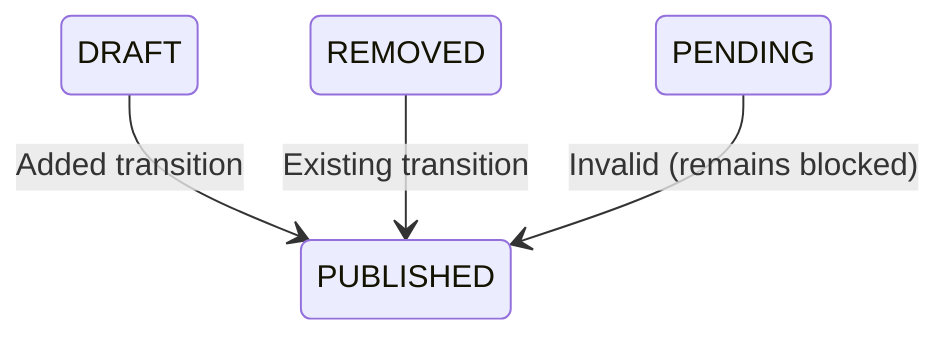

<Note>
**Version:** 3.0 — Architectural revision introducing `Listing` entity as the marketing layer between `InventoryUnit` (inventory) and `ListingPortalSync` (per-portal state). Consolidated from system design plan, PF API guide, Bayut/dubizzle XML guide, and gap analysis.

**Status:** Authoritative design document. The `.cursor/plans/portal_syndication_system_design` plan tracks implementation progress against this spec.
</Note>

## Module Overview

The Portal Syndication Module allows real estate agents to publish property listings to three UAE property portals directly from PropWise CRM, and automatically receive leads back into the CRM pipeline.

### Three-Tier Architecture

```
InventoryUnit  →  Listing  →  ListingPortalSync
  (inventory)     (marketing)   (per-portal state)
```

<CardGroup cols={3}>
  <Card title="InventoryUnit" icon="warehouse">
    What the unit **is** (rooms, area, price, physical attributes). Unchanged by portal syndication logic.
  </Card>
  <Card title="Listing" icon="megaphone">
    How the unit is **marketed** (title, descriptions, permit number, portal classifications, marketing media). Created by an agent from an InventoryUnit.
  </Card>
  <Card title="ListingPortalSync" icon="arrows-rotate">
    Where the listing is **published** and its current state on each portal.
  </Card>
</CardGroup>

<Info>
This separation ensures `InventoryUnit` stays a clean inventory record and the `Listing` layer can eventually support off-plan units (`refUnitId`) without any structural change to the sync system.
</Info>

### Integration Model Per Portal

| Portal | Listing Syndication | Lead Ingestion | Listing Timing |
|---|---|---|---|
| Property Finder | REST API Push (JSON) | Webhook push (primary) + REST poll fallback (15 min) | Real-time (seconds) |
| Bayut | XML Feed Pull (unified) | Pull API polling — scheduled every 15 min | 30 min – 2 hr delay |
| dubizzle | XML Feed Pull (same as Bayut) | Pull API polling — same API + endpoint as Bayut | 30 min – 2 hr delay |

<Warning>
**Bayut / dubizzle lead ingestion note:** Bayut and dubizzle share one API endpoint and one Bearer token (per agency). The `source` field in each lead response (`"bayut"` or `"dubizzle"`) determines which `LeadSource` enum value is used when the CRM lead is created. The Bearer token is stored encrypted in the existing `apiKey` field of the Bayut `PortalConfiguration` row — no new credential columns are needed. Lead ingestion is gated by `PortalConfiguration.leadIngestionEnabled` (per portal).
</Warning>

### Data Flow Rules

<Check>**Listings flow one direction only:** CRM → portals (CRM always wins)</Check>
<Check>**Leads flow one direction only:** portals → CRM</Check>
<Check>**Portal data never overwrites CRM data**</Check>
<Check>**`Listing` is the single source of truth** for listing (marketing) content</Check>
<Check>**`InventoryUnit` is the single source of truth** for unit inventory data</Check>

### Module Location

```
src/modules/real-estate/portal-syndication/
```

Imported in `src/modules/real-estate/real-estate.module.ts`.

---

## As-Built Implementation Status

This section reconciles the spec with the shipped implementation. Where the spec and the build diverge, **the build below is authoritative**.

### Phase A — Bayut/dubizzle Outbound (XML Feed)

<Tabs>
  <Tab title="Self-Contained Listing">
    Every field any portal needs now lives on `Listing` (snapshotted from the unit in linked mode via `ListingService.copyUnitToListing`, or entered directly in manual mode). 

    **Key changes:**
    - Adapters + `PortalValidationService` read ONLY `listing.X` — never `listing.inventoryUnit.X`
    - `inventoryUnit` FK is **nullable** (manual listings have none)
    - New `ListingPurpose` enum (`Sale`/`Rent`)
    - New columns added by `Migration20260531120000_SelfContainedListingFields`
  </Tab>
  
  <Tab title="Creation Modes">
    Two creation modes converge on `ListingService.create(dto, userId, orgId)`:

    - **Linked mode:** Snapshots then applies DTO overrides
    - **Manual mode:** Direct entry without unit link
    - `refreshFromUnit` re-pulls snapshot fields while preserving marketing content + agent overrides
  </Tab>
  
  <Tab title="Value Transforms">
    Centralized value transforms in `src/modules/shared/portal-value-map.ts`:

    ```typescript
    // Transform functions
    purposeToBayut / purposeToPfPriceType
    furnishedToBayut / furnishedToPf
    bedroomsToBayut / bedroomsToPf
    bathroomsToBayut / bathroomsToPf
    rentalPeriodToBayut
    finishingToPf
    emirateToPfCompliance / emirateToUaeEmirate
    ```

    Both adapters AND the validator consume these.
  </Tab>
</Tabs>

#### BayutDubizzleFeedAdapter

<CodeGroup>
```typescript Property Reference Format
Property_Ref_No = UNIT-{orgShortCode}-{listing.id}
// Falls back when orgShortCode is null
```

```xml Feed Structure
<list last_update="..." listing_count="...">
  <property>
    <Property_Ref_No>UNIT-ABC-123</Property_Ref_No>
    <Property_Status>live</Property_Status>
    <!-- Additional fields -->
  </property>
</list>
```
</CodeGroup>

<Note>
The feed includes published rows as `Property_Status=live` AND recently-removed rows as `deleted` for ≥48h so portals delist promptly.
</Note>

#### Public Feed Endpoint

```http
GET /portal-syndication/feeds/:orgId?token=
```

<Info>
`@PublicEndpoint`, handled by `PortalFeedController` + `PortalFeedService`, built live via `executeWithBypass`.
</Info>

#### Sync State Machine



<Warning>
`DRAFT → PUBLISHED` ADDED to `VALID_TRANSITIONS` for feed portals. `PENDING → PUBLISHED` remains invalid.
</Warning>

### Publish Authorization

<Steps>
  <Step title="Check Permission">
    `SyndicationService.publish` — Gate A checks `real_estate.listing.publish` (managers hold it via implication).
  </Step>
  
  <Step title="Without Permission">
    Without the permission, the listing goes to `ListingStatus.PENDING_APPROVAL` and a `real_estate.manage` user uses:
    
    ```http
    POST /:listingId/approve
    POST /:listingId/reject
    ```
  </Step>
  
  <Step title="Reject Flow">
    **Reject moves the listing to `ListingStatus.REJECTED`** and persists:
    - `rejectionReason`
    - `rejectedAt` / `rejectedBy`
    
    The submitter can edit + resubmit (publish → back to `PENDING_APPROVAL`, which clears the rejection) or delete.
  </Step>
  
  <Step title="Approve Flow">
    **Approve honors the submitter's publish intent** (`publishOnApproval` on the publish body):
    - When the request enabled portal targets, approve auto-publishes to them (→ ACTIVE)
    - An approval-only request (no targets) is vetted into a plain DRAFT without publishing
    - **Stamps `Listing.approvedAt` / `approvedBy` (set-once, never cleared)**
  </Step>
</Steps>

<Info>
A `real_estate.manage`-only **Requests** view (`?type=requests`) lists the `PENDING_APPROVAL` + `REJECTED` queue (approved listings drop out automatically).
</Info>

#### Owner Self-Manage Bypass (Post-Approval)

The approval gate only blocks a non-publisher's **first** publish. Once `Listing.approvedAt` is set, the listing's **owner** (publisher `createdBy` / `agent` / linked-unit `unitManager`) publishes / unpublishes / toggles portals **directly**.

<Tip>
`SyndicationService.publish` skips Gate A for `approvedAt != null && isOwner`, treating the owner as a manager of their own listing.
</Tip>

**Key behaviors:**
- A brand-new listing (`approvedAt == null`), or a non-owner without `real_estate.listing.publish`, still routes the first publish through approval
- The controller `@CheckAccess` OR-gates already admit owners via the `LISTING` resource (ownership) check
- Gate B for feed portals is SKIPPED (permit stays mandatory; Bayut/DLD verify post-crawl)

**New endpoints:**
```http
POST /:listingId/publish
POST /:listingId/approve
POST /:listingId/reject
POST /:listingId/unpublish
POST /:listingId/refresh-from-unit
DELETE /:listingId  # Soft-deletes (isDeleted=true) after removing from portals
```

<Warning>
**Delete (`DELETE /:listingId`) soft-deletes** (`isDeleted=true`) after removing from portals — there is no user-facing archived state. A `real_estate.manage` user may delete **any** listing (including `PENDING_APPROVAL` / `REJECTED`) from the Requests queue.
</Warning>

#### Listing Approval Notifications

Submit / approve / reject / delete emit notifications via `EventEmitter2` (handled by `RealEstateEventListener`):

<AccordionGroup>
  <Accordion title="Submit for Approval">
    **Event:** `LISTING_APPROVAL_REQUESTED`
    
    **Recipient:** Every `real_estate.manage` approver (bulk; resolved via `PermissionService.getUserIdsWithOrgPermission`)
  </Accordion>
  
  <Accordion title="Approve">
    **Event:** `LISTING_APPROVED`
    
    **Recipient:** The publisher (`createdBy`)
    
    **Payload:** `published` indicates auto-publish vs approval-only
  </Accordion>
  
  <Accordion title="Reject">
    **Event:** `LISTING_REJECTED`
    
    **Recipient:** The publisher
    
    **Payload:** Includes the rejection reason
  </Accordion>
  
  <Accordion title="Delete">
    **Event:** `LISTING_DELETED`
    
    **Recipient:** The publisher, ONLY when the deleter is not the publisher
  </Accordion>
</AccordionGroup>

<Info>
See `NOTIFICATION_IMPLEMENTATION_GUIDE.md` → "Implemented Real Estate Listing Approval Notification Types".
</Info>

#### Inventory Cascade (User Choice on Delete)

`inventory-unit.deleted` is emitted from `InventoryUnitService.softDelete` and carries `removeLinkedListings` — the choice the user makes in the delete modal.

`PortalSyndicationEventListener.handleUnitDeleted` branches on it:

<Tabs>
  <Tab title="Remove Linked Listings (Default)">
    `removeLinkedListings = true`
    
    - Remove the unit's listings from all portals (`SyndicationService.removeFromAllPortals`)
    - Archive them (`ListingService.archiveByUnit`, passing the deleting actor for audit attribution)
  </Tab>
  
  <Tab title="Keep Listings Live">
    `removeLinkedListings = false`
    
    - Keep the listings live but sever the unit link
    - `ListingService.unlinkFromUnit` sets `inventoryUnit = null`
    - Turns each into a self-contained manual listing the user can keep editing/publishing
  </Tab>
</Tabs>

```http
DELETE /inventory/units/:id?removeLinkedListings=true|false
```

<Note>
The flag defaults to remove (string `"false"` is the only opt-out). Event-driven to avoid a two-way `forwardRef`.
</Note>

<Warning>
Inventory units are **soft-deleted only — never archived** (there is no `isArchived` write path on `InventoryUnit`; `softDelete` is the sole removal hook). There is intentionally **no `inventory-unit.archived` event** and no archive-branch listener.
</Warning>

### Phase A.5 — Unified Inbound Lead Capture

New module **`src/modules/crm/lead-capture/`** owns the complete lead ingestion pipeline.

<CardGroup cols={2}>
  <Card title="Core Service" icon="funnel">
    `LeadCaptureService.capture()` - Entry point for all lead sources
  </Card>
  <Card title="Contracts" icon="file-contract">
    `CapturedLeadInput`, `LeadCaptureSource` interface
  </Card>
  <Card title="Registry" icon="list">
    `LeadCaptureSourceRegistry` - Source registration
  </Card>
  <Card title="Settings" icon="gear">
    Org-default `LeadCaptureSettings`
  </Card>
  <Card title="Idempotency" icon="shield">
    `CapturedLead` ledger for deduplication
  </Card>
  <Card title="Queue" icon="clock">
    Source-agnostic `lead-ingestion` pg-boss queue + `LeadIngestionWorker`
  </Card>
</CardGroup>

<Info>
This GENERALIZES the spec's portal-only `portal-lead-ingestion`/`PortalLeadWorkerService` (§8.5, §9.3, §12).

Migration: `Migration20260531130000_LeadCaptureFoundation` (+ RLS).
</Info>

#### Bayut Lead Integration

<Steps>
  <Step title="Parser">
    **`BayutLeadParserService`** (pure, 7 shapes → `NormalizedBayutLead`)
  </Step>
  
  <Step title="Adapter">
    **`BayutLeadCaptureAdapter`** - Implements `LeadCaptureSource` interface
  </Step>
  
  <Step title="Poller">
    **`BayutLeadPollerService`** with the following behavior:
    
    - `@Cron('*/15 …')` - Runs every 15 minutes
    - Cross-org operation
    - Selects Bayut rows with `leadIngestionEnabled = true` + a token
    - Decrypts the Bayut Pull API Bearer token from `PortalConfiguration.apiKey`
    - Polls the 7 endpoint combinations
    - Drops dubizzle-source leads unless the org's dubizzle row has `leadIngestionEnabled = true`
    - Enqueues to `lead-ingestion` queue
    - On 401: does NOT advance `lastLeadPollAt`
  </Step>
</Steps>

**Configuration:**
```typescript
app.bayut.leadApiBaseUrl
```

### Phase B — Property Finder (REST Push)

<Tabs>
  <Tab title="Services">
    **Core Services:**
    - `PfTokenService` (30-min token cache, invalidate-on-401)
    - `PfLocationMappingService` (24h cache)
    - `PfAgentMappingService` (24h cache + `refreshOrgAgentMappings`)
    - `PfComplianceService`
    - `PfCreditService`
    - `ListingImageService` (sharp validate/auto-fix + `processedMedia` cache with `constraintHash`)
    - `PfWebhookSubscriptionService`
    - `ApiKeyExpirationCheckService` (cron)
  </Tab>
  
  <Tab title="Adapters & Workers">
    **Processing Components:**
    - `PropertyFinderAdapter` (6-step publish)
    - `PfLeadCaptureAdapter`
    - `PfSyndicationWorker` (`pf-syndication` queue)
    - `SyncReconciliationService` (cron)
  </Tab>
  
  <Tab title="Webhook Handling">
    **Public Endpoint:**
    - `PortalWebhookController` (HMAC over raw body)
    
    **Security:**
    - HMAC signature verification
    - Raw body preservation for signature validation
  </Tab>
</Tabs>

**Configuration:**
```typescript
app.propertyFinder.apiBaseUrl
```

<Note>
All PF/Bayut HTTP uses plain `axios` (the codebase convention).
</Note>

---

## Three-Tier Data Model

### Entity Relationships

```mermaid
erDiagram
    InventoryUnit ||--o{ Listing : "creates"
    Listing ||--o{ ListingPortalSync : "publishes to"
    Listing ||--o{ ListingMedia : "has"
    PortalConfiguration ||--o{ ListingPortalSync : "configures"
    
    InventoryUnit {
        uuid id PK
        text unitNumber
        decimal plotArea
        int bedrooms
        decimal listPrice
    }
    
    Listing {
        uuid id PK
        uuid inventoryUnitId FK-nullable
        enum listingPurpose
        text titleEn
        text descriptionEn
        text permitNumber
        enum status
        timestamp approvedAt
    }
    
    ListingPortalSync {
        uuid id PK
        uuid listingId FK
        enum portal
        enum syncStatus
        text externalId
        timestamp lastSyncAt
    }
```

### InventoryUnit (Inventory Layer)

<Info>
**Responsibility:** Physical unit attributes and pricing. Never modified by syndication logic.
</Info>

**Key fields:**
- `unitNumber`, `plotArea`, `bedrooms`, `bathrooms`
- `listPrice`, `rentalPrice`
- Physical attributes (unchanged by portal operations)

<Warning>
`InventoryUnit` is **nullable** on `Listing` to support manual listings that have no inventory link.
</Warning>

### Listing (Marketing Layer)

<Info>
**Responsibility:** Marketing content, portal classifications, and agent-controlled presentation.
</Info>

<Tabs>
  <Tab title="Core Fields">
    ```typescript
    interface Listing {
      id: uuid;
      organizationId: uuid;
      inventoryUnitId?: uuid;  // Nullable for manual listings
      
      // Marketing content
      titleEn: string;
      titleAr?: string;
      descriptionEn: string;
      descriptionAr?: string;
      
      // Purpose & pricing
      listingPurpose: ListingPurpose;  // Sale | Rent
      price: decimal;
      rentalPeriod?: RentalPeriod;
      
      // Portal compliance
      permitNumber?: string;
      reraPermitNumber?: string;
      reraPermitIssueDate?: date;
      reraPermitExpirationDate?: date;
    }
    ```
  </Tab>
  
  <Tab title="Status & Approval">
    ```typescript
    enum ListingStatus {
      DRAFT = 'DRAFT',
      PENDING_APPROVAL = 'PENDING_APPROVAL',
      REJECTED = 'REJECTED',
      PUBLISHED = 'PUBLISHED',
      ARCHIVED = 'ARCHIVED'
    }
    
    // Approval tracking
    approvedAt?: timestamp;
    approvedBy?: uuid;
    rejectedAt?: timestamp;
    rejectedBy?: uuid;
    rejectionReason?: text;
    ```
  </Tab>
  
  <Tab title="Snapshot Fields">
    Fields copied from `InventoryUnit` in linked mode:
    
    ```typescript
    // Physical attributes
    bedrooms: int;
    bathrooms: decimal;
    plotArea: decimal;
    builtUpArea?: decimal;
    
    // Classification
    propertyType: PropertyType;
    propertySubtype?: PropertySubtype;
    furnished: FurnishingStatus;
    
    // Location (from project/building)
    emirate: Emirate;
    community?: string;
    subCommunity?: string;
    ```
  </Tab>
</Tabs>

#### Creation Modes

<CodeGroup>
```typescript Linked Mode
// Snapshot from unit, apply DTO overrides
const listing = await listingService.create({
  inventoryUnitId: unitId,
  titleEn: 'Luxury Villa',  // Override
  // ... other marketing fields
}, userId, orgId);

// Refresh snapshot while preserving marketing content
await listingService.refreshFromUnit(listingId);
```

```typescript Manual Mode
// Direct entry, no unit link
const listing = await listingService.create({
  inventoryUnitId: null,
  bedrooms: 3,
  bathrooms: 2.5,
  titleEn: 'Off-Plan Apartment',
  // ... all fields entered directly
}, userId, orgId);
```
</CodeGroup>

### ListingPortalSync (Per-Portal State)

<Info>
**Responsibility:** Track publication state and external IDs for each portal separately.
</Info>

```typescript
interface ListingPortalSync {
  id: uuid;
  listingId: uuid;
  portal: PortalEnum;  // PropertyFinder | Bayut | Dubizzle
  
  // Sync state
  syncStatus: SyncStatus;
  externalId?: string;
  lastSyncAt?: timestamp;
  lastSyncAttemptAt?: timestamp;
  
  // Error tracking
  lastError?: jsonb;
  failureCount: int;
  
  // Portal-specific metadata
  metadata?: jsonb;
}
```

<Tabs>
  <Tab title="Sync Status Enum">
    ```typescript
    enum SyncStatus {
      ACTIVE = 'ACTIVE',          // Successfully published
      PENDING = 'PENDING',         // Queued for sync
      SYNCING = 'SYNCING',         // Sync in progress
      FAILED = 'FAILED',           // Sync error
      REMOVED = 'REMOVED',         // Delisted from portal
      PAUSED = 'PAUSED'            // Manually paused
    }
    ```
  </Tab>
  
  <Tab title="State Transitions">
    ```mermaid
    stateDiagram-v2
        [*] --> PENDING: Publish
        PENDING --> SYNCING: Worker picks up
        SYNCING --> ACTIVE: Success
        SYNCING --> FAILED: Error
        FAILED --> PENDING: Retry
        ACTIVE --> REMOVED: Unpublish
        ACTIVE --> PAUSED: Pause
        PAUSED --> PENDING: Resume
    ```
  </Tab>
</Tabs>

### PortalConfiguration

Global per-portal settings at the organization level.

<AccordionGroup>
  <Accordion title="Property Finder Configuration">
    ```typescript
    {
      portal: 'PropertyFinder',
      apiKey: string,           // Encrypted API key
      agentId: string,          // Primary agent PF ID
      enabled: boolean,
      leadIngestionEnabled: boolean,
      webhookSecret?: string,   // For HMAC verification
      
      // Feature flags
      autoPublish: boolean,
      requirePermit: boolean,
      
      // Rate limiting
      dailyCreditLimit?: int,
      currentDailyCredits: int,
      creditsResetAt: timestamp
    }
    ```
  </Accordion>
  
  <Accordion title="Bayut Configuration">
    ```typescript
    {
      portal: 'Bayut',
      apiKey: string,           // Encrypted feed token
      feedUrl: string,          // Organization's public feed URL
      enabled: boolean,
      leadIngestionEnabled: boolean,
      
      // Lead API credentials (shared with dubizzle)
      leadApiToken?: string,    // Encrypted Bearer token
      lastLeadPollAt?: timestamp,
      
      // Validation
      requirePermit: boolean,
      agencyTrnNumber?: string
    }
    ```
  </Accordion>
  
  <Accordion title="dubizzle Configuration">
    ```typescript
    {
      portal: 'Dubizzle',
      apiKey: string,           // Same encrypted token as Bayut
      feedUrl: string,          // Points to same XML feed
      enabled: boolean,
      leadIngestionEnabled: boolean,  // Controls dubizzle lead acceptance
      
      // Shares Bayut's lead API credentials
      // leadApiToken inherited from Bayut config
      
      requirePermit: boolean
    }
    ```
    
    <Warning>
    dubizzle and Bayut share the same lead API endpoint. The `source` field in the API response determines which portal the lead came from. The dubizzle `leadIngestionEnabled` flag gates whether dubizzle-source leads are kept.
    </Warning>
  </Accordion>
</AccordionGroup>

---

## Portal Value Transformations

Centralized transforms in `src/modules/shared/portal-value-map.ts` ensure consistent mapping between PropWise enums and portal-specific values.

### Purpose & Price Type

<CodeGroup>
```typescript Bayut
function purposeToBayut(purpose: ListingPurpose): string {
  return {
    Sale: 'Sale',
    Rent: 'Rent'
  }[purpose];
}
```

```typescript Property Finder
function purposeToPfPriceType(purpose: ListingPurpose): string {
  return {
    Sale: 'sale',
    Rent: 'rent'
  }[purpose];
}
```
</CodeGroup>

### Furnishing Status

<CodeGroup>
```typescript Bayut
function furnishedToBayut(status: FurnishingStatus): string {
  return {
    Furnished: 'Furnished',
    Unfurnished: 'Unfurnished',
    PartlyFurnished: 'Partly'
  }[status];
}
```

```typescript Property Finder
function furnishedToPf(status: FurnishingStatus): string {
  return {
    Furnished: 'furnished',
    Unfurnished: 'unfurnished',
    PartlyFurnished: 'partly'
  }[status] || 'unfurnished';
}
```
</CodeGroup>

### Bedrooms & Bathrooms

<Tabs>
  <Tab title="Bayut">
    ```typescript
    function bedroomsToBayut(count: number): string {
      if (count === 0) return 'Studio';
      if (count >= 7) return '7+';
      return count.toString();
    }
    
    function bathroomsToBayut(count: number): string {
      if (count >= 7) return '7+';
      return Math.floor(count).toString();
    }
    ```
  </Tab>
  
  <Tab title="Property Finder">
    ```typescript
    function bedroomsToPf(count: number): number {
      if (count === 0) return 0;  // Studio
      return Math.min(count, 20);  // PF supports up to 20
    }
    
    function bathroomsToPf(count: number): number {
      return Math.max(1, Math.floor(count));
    }
    ```
  </Tab>
</Tabs>

### Rental Period

```typescript Bayut
function rentalPeriodToBayut(period?: RentalPeriod): string | undefined {
  if (!period) return undefined;
  
  return {
    Yearly: 'Yearly',
    Monthly: 'Monthly',
    Weekly: 'Weekly',
    Daily: 'Daily'
  }[period];
}
```

<Info>
Property Finder does not require rental period mapping — it's derived from `price_on_application` and frequency fields.
</Info>

### Emirate Compliance

```typescript
function emirateToPfCompliance(emirate: Emirate): string {
  return {
    Dubai: 'dubai',
    AbuDhabi: 'abu_dhabi',
    Sharjah: 'sharjah',
    // ... other emirates
  }[emirate];
}

function emirateToUaeEmirate(emirate: Emirate): string {
  // For UAE-wide classifications
  return emirate.toLowerCase().replace(/\s+/g, '_');
}
```

### Finishing Quality

```typescript Property Finder
function finishingToPf(finishing?: FinishingQuality): string {
  if (!finishing) return 'finished';
  
  return {
    Finished: 'finished',
    SemiFinished: 'semi_finished',
    Unfurnished: 'unfurnished',
    LuxuryFinished: 'luxury'
  }[finishing] || 'finished';
}
```

<Note>
Both adapters and `PortalValidationService` consume these transforms to ensure consistent validation and serialization.
</Note>

---

## Syndication Workflows

### Publishing Flow

<Steps>
  <Step title="Initiate Publish">
    User clicks "Publish" and selects target portals in the Listing detail sheet.
    
    ```http
    POST /portal-syndication/listings/:listingId/publish
    {
      "portals": ["PropertyFinder", "Bayut"],
      "publishOnApproval": true
    }
    ```
  </Step>
  
  <Step title="Permission Check (Gate A)">
    `SyndicationService.publish` checks `real_estate.listing.publish`:
    
    - **Has permission OR is owner with `approvedAt` set:** Continue to validation
    - **No permission:** Move listing to `PENDING_APPROVAL` status, send notification to approvers
  </Step>
  
  <Step title="Validation (Gate B - PF only)">
    For Property Finder (feed portals skip this):
    
    - Permit number required unless org has exemption
    - Agent mapping must exist
    - Location must be in PF's taxonomy
    - Images must meet size/format requirements
    
    Validation errors block publish and return detailed messages.
  </Step>
  
  <Step title="Create ListingPortalSync Records">
    For each target portal:
    
    ```typescript
    await listingPortalSyncRepository.upsert({
      listingId,
      portal,
      syncStatus: SyncStatus.PENDING,
      lastSyncAttemptAt: new Date()
    });
    ```
  </Step>
  
  <Step title="Queue Sync Jobs">
    - **Property Finder:** Enqueue to `pf-syndication` queue (processed within seconds)
    - **Bayut/dubizzle:** No queue — listing appears in next XML feed poll (30 min – 2 hr)
  </Step>
  
  <Step title="Update Listing Status">
    ```typescript
    listing.status = ListingStatus.PUBLISHED;
    listing.publishedAt = new Date();
    ```
  </Step>
</Steps>

### Approval Workflow (Non-Publishers)

<Tabs>
  <Tab title="Submit for Approval">
    ```mermaid
    sequenceDiagram
        Agent->>API: POST /publish (no permission)
        API->>Listing: status = PENDING_APPROVAL
        API->>EventBus: LISTING_APPROVAL_REQUESTED
        EventBus->>Approvers: Notification (all with real_estate.manage)
        API->>Agent: 202 Accepted
    ```
  </Tab>
  
  <Tab title="Approve">
    ```mermaid
    sequenceDiagram
        Manager->>API: POST /:listingId/approve
        API->>Listing: approvedAt = now, approvedBy = manager
        alt publishOnApproval = true
            API->>Portals: Auto-publish to requested portals
            API->>Listing: status = PUBLISHED
        else publishOnApproval = false
            API->>Listing: status = DRAFT (vetted, no publish)
        end
        API->>EventBus: LISTING_APPROVED
        EventBus->>Agent: Notification with published flag
    ```
  </Tab>
  
  <Tab title="Reject">
    ```mermaid
    sequenceDiagram
        Manager->>API: POST /:listingId/reject { reason }
        API->>Listing: status = REJECTED
        API->>Listing: rejectedAt = now, rejectedBy = manager
        API->>Listing: rejectionReason = reason
        API->>EventBus: LISTING_REJECTED
        EventBus->>Agent: Notification with reason
    ```
    
    <Info>
    Agent can edit and resubmit, which clears rejection fields and moves back to `PENDING_APPROVAL`.
    </Info>
  </Tab>
</Tabs>

### Property Finder 6-Step Publish

<Steps>
  <Step title="Validate Listing">
    ```typescript
    const validation = await portalValidationService.validateForPortal(
      listing,
      PortalEnum.PropertyFinder
    );
    
    if (!validation.isValid) {
      throw new ValidationException(validation.errors);
    }
    ```
  </Step>
  
  <Step title="Get Fresh Token">
    ```typescript
    const token = await pfTokenService.getToken(orgId);
    // 30-min cache, auto-refresh on 401
    ```
  </Step>
  
  <Step title="Map Location">
    ```typescript
    const locationId = await pfLocationMappingService.mapLocation({
      emirate: listing.emirate,
      community: listing.community,
      subCommunity: listing.subCommunity
    }, orgId);
    ```
  </Step>
  
  <Step title="Map Agent">
    ```typescript
    const pfAgentId = await pfAgentMappingService.getAgentMapping(
      listing.agentId,
      orgId
    );
    ```
  </Step>
  
  <Step title="Process Images">
    ```typescript
    const processedImages = await listingImageService.processForPortal(
      listing.media,
      PortalEnum.PropertyFinder
    );
    
    // Validates dimensions, auto-fixes orientation, caches with constraintHash
    ```
  </Step>
  
  <Step title="Push to PF API">
    ```typescript
    const payload = propertyFinderAdapter.transform(listing, {
      locationId,
      pfAgentId,
      processedImages
    });
    
    const response = await axios.post(
      `${pfApiBaseUrl}/properties`,
      payload,
      { headers: { Authorization: `Bearer ${token}` } }
    );
    
    // Update sync record with externalId
    await updateSyncRecord(response.data.id, SyncStatus.ACTIVE);
    ```
  </Step>
</Steps>

<Warning>
On any step failure, the sync record is updated with `syncStatus = FAILED` and the error is logged in `lastError` JSONB field. Retries follow exponential backoff via the `pf-syndication` queue.
</Warning>

### Bayut/dubizzle XML Feed Generation

<Steps>
  <Step title="Feed Request">
    Portal crawlers poll the public feed endpoint:
    
    ```http
    GET /portal-syndication/feeds/:orgId?token=<feed_token>
    ```
  </Step>
  
  <Step title="Query Published Listings">
    ```typescript
    const listings = await listingRepository.find({
      where: {
        organizationId: orgId,
        status: ListingStatus.PUBLISHED,
        // Include recently removed (for delisting)
        OR: [
          { deletedAt: IsNull() },
          { deletedAt: MoreThan(subHours(new Date(), 48)) }
        ]
      },
      relations: ['inventoryUnit', 'media', 'portalSyncs']
    });
    ```
  </Step>
  
  <Step title="Filter by Portal">
    ```typescript
    const bayutListings = listings.filter(l => 
      l.portalSyncs.some(s => 
        s.portal === PortalEnum.Bayut && 
        [SyncStatus.ACTIVE, SyncStatus.REMOVED].includes(s.syncStatus)
      )
    );
    ```
  </Step>
  
  <Step title="Transform to XML">
    ```typescript
    const properties = bayutListings.map(listing => 
      bayutDubizzleFeedAdapter.transform(listing)
    );
    
    const xml = bayutXmlSerializer.serialize({
      last_update: new Date().toISOString(),
      listing_count: properties.length,
      properties
    });
    ```
  </Step>
  
  <Step title="Return XML Response">
    ```xml
    <?xml version="1.0" encoding="UTF-8"?>
    <list last_update="2025-06-01T12:00:00Z" listing_count="42">
      <property>
        <Property_Ref_No>UNIT-ABC-123</Property_Ref_No>
        <Property_Status>live</Property_Status>
        <Permit_Number>71234567890</Permit_Number>
        <!-- ... -->
      </property>
      <property>
        <Property_Ref_No>UNIT-ABC-999</Property_Ref_No>
        <Property_Status>deleted</Property_Status>
        <!-- Removed within 48h, included for delisting -->
      </property>
    </list>
    ```
  </Step>
</Steps>

<Info>
The feed is built live on each request using `executeWithBypass` to honor RLS while allowing unauthenticated access via the secret token.
</Info>

### Unpublish Flow

<Steps>
  <Step title="User Action">
    ```http
    POST /portal-syndication/listings/:listingId/unpublish
    {
      "portals": ["PropertyFinder"]  // Optional, defaults to all
    }
    ```
  </Step>
  
  <Step title="Update Sync Records">
    For each portal:
    
    ```typescript
    await listingPortalSyncRepository.update(
      { listingId, portal },
      { syncStatus: SyncStatus.REMOVED }
    );
    ```
  </Step>
  
  <Step title="Portal-Specific Removal">
    - **Property Finder:** DELETE request to PF API (immediate)
    - **Bayut/dubizzle:** Mark as `deleted` in XML feed, remains for 48 hours
  </Step>
  
  <Step title="Update Listing Status">
    If all portals removed:
    
    ```typescript
    listing.status = ListingStatus.DRAFT;
    listing.publishedAt = null;
    ```
  </Step>
</Steps>

---

## Lead Ingestion Architecture

### Unified Lead Capture Module

**Location:** `src/modules/crm/lead-capture/`

<Tabs>
  <Tab title="Core Components">
    ```typescript
    // Entry point
    class LeadCaptureService {
      async capture(
        input: CapturedLeadInput,
        source: LeadCaptureSource
      ): Promise<Lead> {
        // Idempotency check
        // Enqueue to lead-ingestion queue
        // Return acknowledgment
      }
    }
    
    // Contract
    interface CapturedLeadInput {
      externalId: string;
      source: string;
      firstName?: string;
      lastName?: string;
      email?: string;
      phone?: string;
      message?: string;
      listingExternalRef?: string;
      metadata?: Record<string, any>;
    }
    ```
  </Tab>
  
  <Tab title="Source Interface">
    ```typescript
    interface LeadCaptureSource {
      readonly name: string;
      
      normalize(raw: unknown): CapturedLeadInput;
      findListing(externalRef: string, orgId: string): Promise<Listing | null>;
      mapToLeadSource(): LeadSource;  // CRM enum
    }
    ```
    
    <Info>
    Each portal implements this interface to provide portal-specific logic.
    </Info>
  </Tab>
  
  <Tab title="Registry">
    ```typescript
    @Injectable()
    class LeadCaptureSourceRegistry {
      private sources = new Map<string, LeadCaptureSource>();
      
      register(source: LeadCaptureSource): void {
        this.sources.set(source.name, source);
      }
      
      get(name: string): LeadCaptureSource {
        const source = this.sources.get(name);
        if (!source) {
          throw new Error(`Unknown lead source: ${name}`);
        }
        return source;
      }
    }
    ```
  </Tab>
</Tabs>

### Property Finder Lead Integration

<Tabs>
  <Tab title="Webhook (Primary)">
    ```http
    POST /portal-syndication/webhooks/property-finder
    X-PF-Signature: sha256=<hmac>
    
    {
      "lead_id": "pf_123456",
      "listing_id": "7890",
      "name": "Ahmed Ali",
      "email": "ahmed@example.com",
      "phone": "+971501234567",
      "message": "Interested in viewing",
      "created_at": "2025-06-01T14:30:00Z"
    }
    ```
    
    **Processing:**
    <Steps>
      <Step title="Verify HMAC">
        ```typescript
        const signature = req.headers['x-pf-signature'];
        const computed = crypto
          .createHmac('sha256', webhookSecret)
          .update(rawBody)
          .digest('hex');
        
        if (!crypto.timingSafeEqual(
          Buffer.from(signature),
          Buffer.from(`sha256=${computed}`)
        )) {
          throw new UnauthorizedException('Invalid signature');
        }
        ```
      </Step>
      
      <Step title="Parse & Normalize">
        ```typescript
        const input = pfLeadCaptureAdapter.normalize(req.body);
        ```
      </Step>
      
      <Step title="Capture">
        ```typescript
        await leadCaptureService.capture(input, pfLeadCaptureAdapter);
        ```
      </Step>
    </Steps>
  </Tab>
  
  <Tab title="Poll Fallback">
    ```typescript
    @Cron('*/15 * * * *')  // Every 15 minutes
    async pollPropertyFinderLeads() {
      const orgs = await portalConfigRepository.find({
        where: {
          portal: PortalEnum.PropertyFinder,
          enabled: true,
          leadIngestionEnabled: true,
          apiKey: Not(IsNull())
        }
      });
      
      for (const config of orgs) {
        const token = await pfTokenService.getToken(config.organizationId);
        const since = config.lastLeadPollAt || subHours(new Date(), 24);
        
        const response = await axios.get(
          `${pfApiBaseUrl}/leads`,
          {
            headers: { Authorization: `Bearer ${token}` },
            params: { since: since.toISOString() }
          }
        );
        
        for (const rawLead of response.data.leads) {
          const input = pfLeadCaptureAdapter.normalize(rawLead);
          await leadCaptureService.capture(input, pfLeadCaptureAdapter);
        }
        
        await portalConfigRepository.update(config.id, {
          lastLeadPollAt: new Date()
        });
      }
    }
    ```
    
    <Note>
    Polls only run for orgs with `leadIngestionEnabled = true` and a valid API key.
    </Note>
  </Tab>
</Tabs>

### Bayut/dubizzle Lead Integration

<Steps>
  <Step title="Scheduled Poll">
    ```typescript
    @Cron('*/15 * * * *')  // Every 15 minutes
    async pollBayutLeads() {
      const bayutConfigs = await portalConfigRepository.find({
        where: {
          portal: PortalEnum.Bayut,
          leadIngestionEnabled: true,
          apiKey: Not(IsNull())  // Lead API Bearer token
        }
      });
      
      for (const config of bayutConfigs) {
        await this.pollForOrg(config);
      }
    }
    ```
  </Step>
  
  <Step title="Poll 7 Endpoint Combinations">
    ```typescript
    async pollForOrg(config: PortalConfiguration) {
      const token = await encryptionService.decrypt(config.apiKey);
      const since = config.lastLeadPollAt || subHours(new Date(), 24);
      
      const endpoints = [
        { type: 'residential', purpose: 'sale' },
        { type: 'residential', purpose: 'rent' },
        { type: 'commercial', purpose: 'sale' },
        { type: 'commercial', purpose: 'rent' },
        { type: 'land', purpose: 'sale' },
        { type: 'land', purpose: 'rent' },
        { type: 'multiple', purpose: 'sale' }
      ];
      
      for (const { type, purpose } of endpoints) {
        const url = `${bayutLeadApiBaseUrl}/lead/${type}/${purpose}`;
        // ... fetch and process
      }
    }
    ```
  </Step>
  
  <Step title="Parse 7 Response Shapes">
    ```typescript
    @Injectable()
    class BayutLeadParserService {
      normalize(raw: unknown, type: string, purpose: string): NormalizedBayutLead {
        // Each combo has slightly different field names
        // Extract common fields: name, email, phone, message, ref, source
        
        if (type === 'residential' && purpose === 'sale') {
          return this.parseResidentialSale(raw);
        }
        // ... 6 more parsers
      }
    }
    ```
  </Step>
  
  <Step title="Filter dubizzle Leads">
    ```typescript
    const dubizzleConfig = await portalConfigRepository.findOne({
      where: {
        organizationId: config.organizationId,
        portal: PortalEnum.Dubizzle
      }
    });
    
    const dubizzleEnabled = dubizzleConfig?.leadIngestionEnabled ?? false;
    
    for (const normalizedLead of leads) {
      if (normalizedLead.source === 'dubizzle' && !dubizzleEnabled) {
        continue;  // Drop dubizzle-source leads
      }
      
      const input = bayutLeadCaptureAdapter.toInput(normalizedLead);
      await leadCaptureService.capture(input, bayutLeadCaptureAdapter);
    }
    ```
    
    <Warning>
    Bayut poller runs for orgs with Bayut `leadIngestionEnabled = true`. It fetches leads from both Bayut and dubizzle (same API). The `source` field determines portal attribution. dubizzle-source leads are kept only if the org's dubizzle config also has `leadIngestionEnabled = true`.
    </Warning>
  </Step>
  
  <Step title="Update Poll Timestamp">
    ```typescript
    // Only on success (non-401)
    await portalConfigRepository.update(config.id, {
      lastLeadPollAt: new Date()
    });
    ```
    
    <Info>
    On 401 (invalid token), the poll timestamp is NOT advanced, forcing retry on next cron run after token refresh.
    </Info>
  </Step>
</Steps>

### Lead Processing Queue

<Tabs>
  <Tab title="Queue Job">
    ```typescript
    interface LeadIngestionJob {
      capturedLeadId: string;
      sourceName: string;
      organizationId: string;
    }
    ```
  </Tab>
  
  <Tab title="Worker">
    ```typescript
    @Injectable()
    class LeadIngestionWorker {
      @OnQueueJob('lead-ingestion')
      async process(job: Job<LeadIngestionJob>) {
        const { capturedLeadId, sourceName, organizationId } = job.data;
        
        // 1. Fetch captured lead
        const captured = await capturedLeadRepo.findOne(capturedLeadId);
        
        // 2. Get source adapter
        const source = leadCaptureSourceRegistry.get(sourceName);
        
        // 3. Find associated listing (if ref provided)
        let listing: Listing | null = null;
        if (captured.listingExternalRef) {
          listing = await source.findListing(
            captured.listingExternalRef,
            organizationId
          );
        }
        
        // 4. Create CRM lead
        const lead = await leadService.create({
          organizationId,
          source: source.mapToLeadSource(),
          firstName: captured.firstName,
          lastName: captured.lastName,
          email: captured.email,
          phone: captured.phone,
          message: captured.message,
          listingId: listing?.id,
          inventoryUnitId: listing?.inventoryUnitId,
          externalId: captured.externalId,
          metadata: captured.metadata
        });
        
        // 5. Mark captured lead as processed
        await capturedLeadRepo.update(capturedLeadId, {
          processed: true,
          processedAt: new Date(),
          crmLeadId: lead.id
        });
        
        // 6. Emit lead.created event for notifications
        eventEmitter.emit('lead.created', { lead });
      }
    }
    ```
  </Tab>
  
  <Tab title="Idempotency">
    ```typescript
    // In LeadCaptureService.capture()
    const existing = await capturedLeadRepo.findOne({
      where: {
        organizationId,
        externalId: input.externalId,
        source: input.source
      }
    });
    
    if (existing) {
      if (existing.processed) {
        // Already converted to CRM lead
        return existingLead;
      }
      // Re-enqueue if processing failed
      await leadIngestionQueue.add(existing.id);
      return acknowledgment;
    }
    
    // New lead - create captured record
    const captured = await capturedLeadRepo.save({
      organizationId,
      externalId: input.externalId,
      source: input.source,
      // ... other fields
    });
    
    await leadIngestionQueue.add(captured.id);
    ```
  </Tab>
</Tabs>

---

## Validation & Compliance

### Portal Validation Service

Centralized validation logic used before publishing to any portal.

```typescript
@Injectable()
class PortalValidationService {
  async validateForPortal(
    listing: Listing,
    portal: PortalEnum
  ): Promise<ValidationResult> {
    const errors: ValidationError[] = [];
    
    // Common validations
    errors.push(...this.validateCommon(listing));
    
    // Portal-specific validations
    switch (portal) {
      case PortalEnum.PropertyFinder:
        errors.push(...await this.validatePropertyFinder(listing));
        break;
      case PortalEnum.Bayut:
      case PortalEnum.Dubizzle:
        errors.push(...this.validateBayutDubizzle(listing));
        break;
    }
    
    return {
      isValid: errors.length === 0,
      errors
    };
  }
}
```

### Common Validations

<AccordionGroup>
  <Accordion title="Required Fields">
    ```typescript
    validateCommon(listing: Listing): ValidationError[] {
      const errors = [];
      
      if (!listing.titleEn) {
        errors.push({ field: 'titleEn', message: 'Title is required' });
      }
      
      if (!listing.descriptionEn || listing.descriptionEn.length < 50) {
        errors.push({ 
          field: 'descriptionEn', 
          message: 'Description must be at least 50 characters' 
        });
      }
      
      if (!listing.price || listing.price <= 0) {
        errors.push({ field: 'price', message: 'Valid price is required' });
      }
      
      if (!listing.bedrooms && listing.bedrooms !== 0) {
        errors.push({ field: 'bedrooms', message: 'Bedrooms count is required' });
      }
      
      if (!listing.bathrooms) {
        errors.push({ field: 'bathrooms', message: 'Bathrooms count is required' });
      }
      
      return errors;
    }
    ```
  </Accordion>
  
  <Accordion title="Media Requirements">
    ```typescript
    validateMedia(listing: Listing, minImages: number = 1): ValidationError[] {
      const errors = [];
      const images = listing.media.filter(m => m.type === MediaType.IMAGE);
      
      if (images.length < minImages) {
        errors.push({
          field: 'media',
          message: `At least ${minImages} image(s) required`
        });
      }
      
      for (const image of images) {
        if (!image.url) {
          errors.push({
            field: 'media',
            message: `Image ${image.id} has no URL`
          });
        }
      }
      
      return errors;
    }
    ```
  </Accordion>
  
  <Accordion title="Location Data">
    ```typescript
    validateLocation(listing: Listing): ValidationError[] {
      const errors = [];
      
      if (!listing.emirate) {
        errors.push({ field: 'emirate', message: 'Emirate is required' });
      }
      
      if (!listing.community) {
        errors.push({ field: 'community', message: 'Community is required' });
      }
      
      return errors;
    }
    ```
  </Accordion>
</AccordionGroup>

### Property Finder Specific Validations

<Steps>
  <Step title="Permit Validation">
    ```typescript
    async validatePropertyFinder(listing: Listing): Promise<ValidationError[]> {
      const errors = [];
      const config = await this.getPortalConfig(
        listing.organizationId,
        PortalEnum.PropertyFinder
      );
      
      if (config.requirePermit && !listing.permitNumber) {
        errors.push({
          field: 'permitNumber',
          message: 'Permit number is required for Property Finder'
        });
      }
      
      return errors;
    }
    ```
  </Step>
  
  <Step title="Agent Mapping">
    ```typescript
    const agentMapping = await pfAgentMappingService.getAgentMapping(
      listing.agentId,
      listing.organizationId
    );
    
    if (!agentMapping) {
      errors.push({
        field: 'agent',
        message: 'Agent must be registered with Property Finder'
      });
    }
    ```
  </Step>
  
  <Step title="Location Mapping">
    ```typescript
    const locationId = await pfLocationMappingService.mapLocation({
      emirate: listing.emirate,
      community: listing.community,
      subCommunity: listing.subCommunity
    }, listing.organizationId);
    
    if (!locationId) {
      errors.push({
        field: 'location',
        message: 'Location not found in Property Finder taxonomy'
      });
    }
    ```
  </Step>
  
  <Step title="Image Constraints">
    ```typescript
    const processedImages = await listingImageService.processForPortal(
      listing.media,
      PortalEnum.PropertyFinder
    );
    
    if (processedImages.length < 1) {
      errors.push({
        field: 'media',
        message: 'At least 1 valid image required'
      });
    }
    
    for (const img of processedImages) {
      if (img.error) {
        errors.push({
          field: 'media',
          message: `Image ${img.originalId}: ${img.error}`
        });
      }
    }
    ```
  </Step>
</Steps>

### Bayut/dubizzle Specific Validations

```typescript
validateBayutDubizzle(listing: Listing): ValidationError[] {
  const errors = [];
  
  // Permit not validated here (Bayut/DLD verify post-crawl)
  // but we still recommend it in warnings
  
  if (!listing.permitNumber) {
    errors.push({
      field: 'permitNumber',
      severity: 'warning',
      message: 'Permit number recommended for faster approval'
    });
  }
  
  // Bayut requires Property_Ref_No (auto-generated)
  // No additional validations at publish time
  
  return errors;
}
```

<Info>
Feed portals (Bayut/dubizzle) have minimal pre-publish validation. The portal crawlers perform their own validation after ingesting the XML feed.
</Info>

### PF Compliance Service

Handles compliance checks specific to Property Finder's requirements.

<Tabs>
  <Tab title="Permit Verification">
    ```typescript
    @Injectable()
    class PfComplianceService {
      async verifyPermit(
        permitNumber: string,
        emirate: Emirate
      ): Promise<PermitVerificationResult> {
        // Call PF's permit verification endpoint
        const response = await axios.post(
          `${pfApiBaseUrl}/compliance/verify-permit`,
          {
            permit_number: permitNumber,
            emirate: emirateToPfCompliance(emirate)
          },
          { headers: { Authorization: `Bearer ${token}` } }
        );
        
        return {
          valid: response.data.valid,
          reason: response.data.reason,
          expiryDate: response.data.expiry_date
        };
      }
    }
    ```
  </Tab>
  
  <Tab title="RERA Compliance">
    ```typescript
    validateReraPermit(listing: Listing): ValidationError[] {
      const errors = [];
      
      if (listing.emirate === Emirate.Dubai && listing.listingPurpose === ListingPurpose.Rent) {
        if (!listing.reraPermitNumber) {
          errors.push({
            field: 'reraPermitNumber',
            message: 'RERA permit required for Dubai rental listings'
          });
        }
        
        if (!listing.reraPermitExpirationDate) {
          errors.push({
            field: 'reraPermitExpirationDate',
            message: 'RERA permit expiration date required'
          });
        } else if (new Date(listing.reraPermitExpirationDate) < new Date()) {
          errors.push({
            field: 'reraPermitExpirationDate',
            severity: 'error',
            message: 'RERA permit has expired'
          });
        }
      }
      
      return errors;
    }
    ```
  </Tab>
</Tabs>

---

## Media Handling

### ListingImageService

Validates, processes, and caches images to meet portal-specific requirements.

<Steps>
  <Step title="Fetch Original">
    ```typescript
    const response = await axios.get(imageUrl, {
      responseType: 'arraybuffer',
      timeout: 10000
    });
    
    const buffer = Buffer.from(response.data);
    ```
  </Step>
  
  <Step title="Validate with Sharp">
    ```typescript
    const metadata = await sharp(buffer).metadata();
    
    if (!['jpeg', 'jpg', 'png'].includes(metadata.format)) {
      return { error: 'Unsupported format. Use JPEG or PNG.' };
    }
    
    if (metadata.width < 800 || metadata.height < 600) {
      return { error: 'Minimum dimensions: 800x600' };
    }
    ```
  </Step>
  
  <Step title="Auto-Fix Orientation">
    ```typescript
    let processedBuffer = buffer;
    
    if (metadata.orientation && metadata.orientation !== 1) {
      processedBuffer = await sharp(buffer)
        .rotate()  // Auto-rotates based on EXIF
        .toBuffer();
    }
    ```
  </Step>
  
  <Step title="Generate Constraint Hash">
    ```typescript
    const constraints = {
      portal: PortalEnum.PropertyFinder,
      minWidth: 800,
      minHeight: 600,
      formats: ['jpeg', 'png']
    };
    
    const constraintHash = crypto
      .createHash('sha256')
      .update(JSON.stringify(constraints))
      .digest('hex')
      .substring(0, 16);
    ```
  </Step>
  
  <Step title="Check Cache">
    ```typescript
    const cached = await processedMediaRepo.findOne({
      where: {
        originalMediaId: image.id,
        constraintHash
      }
    });
    
    if (cached && cached.expiresAt > new Date()) {
      return cached;
    }
    ```
  </Step>
  
  <Step title="Store Processed Image">
    ```typescript
    const processedUrl = await storageService.upload(
      processedBuffer,
      `processed/${constraintHash}/${image.id}.jpg`
    );
    
    await processedMediaRepo.save({
      originalMediaId: image.id,
      constraintHash,
      processedUrl,
      expiresAt: addHours(new Date(), 24)
    });
    ```
  </Step>
</Steps>

<Info>
The `constraintHash` ensures that different portal requirements generate separate cached versions of the same original image.
</Info>

### Media Requirements by Portal

| Portal | Min Dimensions | Max File Size | Formats | Min Count |
|---|---|---|---|---|
| Property Finder | 800x600 | 10 MB | JPEG, PNG | 1 |
| Bayut | 500x500 | 5 MB | JPEG, PNG | 1 |
| dubizzle | 500x500 | 5 MB | JPEG, PNG | 1 |

<Warning>
All portals reject images with incorrect EXIF orientation. The `ListingImageService` auto-rotates based on EXIF data before caching.
</Warning>

---

## Credit Management (Property Finder)

### PfCreditService

Tracks daily credit usage and enforces limits.

<Tabs>
  <Tab title="Check Available Credits">
    ```typescript
    async checkCredits(
      orgId: string,
      required: number = 1
    ): Promise<CreditCheckResult> {
      const config = await portalConfigRepo.findOne({
        where: { organizationId: orgId, portal: PortalEnum.PropertyFinder }
      });
      
      // Reset if past reset time
      if (config.creditsResetAt < new Date()) {
        await this.resetDailyCredits(config);
      }
      
      const available = config.dailyCreditLimit - config.currentDailyCredits;
      
      return {
        available,
        required,
        sufficient: available >= required
      };
    }
    ```
  </Tab>
  
  <Tab title="Consume Credits">
    ```typescript
    async consumeCredits(orgId: string, count: number): Promise<void> {
      await portalConfigRepo.increment(
        { organizationId: orgId, portal: PortalEnum.PropertyFinder },
        'currentDailyCredits',
        count
      );
      
      // Log credit transaction
      await creditTransactionRepo.save({
        organizationId: orgId,
        portal: PortalEnum.PropertyFinder,
        amount: count,
        type: 'LISTING_PUBLISH',
        timestamp: new Date()
      });
    }
    ```
  </Tab>
  
  <Tab title="Reset Daily Credits">
    ```typescript
    async resetDailyCredits(config: PortalConfiguration): Promise<void> {
      const