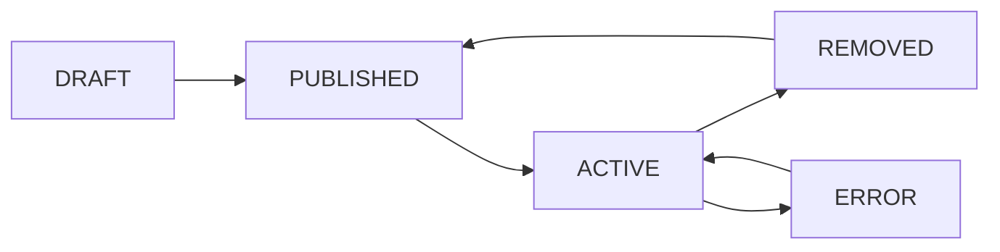

## Module Overview

The Portal Syndication Module allows real estate agents to publish property listings to three UAE property portals directly from PropWise CRM, and automatically receive leads back into the CRM pipeline.

### Three-Tier Architecture

```
InventoryUnit  →  Listing  →  ListingPortalSync
  (inventory)     (marketing)   (per-portal state)
```

<CardGroup cols={3}>
  <Card title="InventoryUnit" icon="building">
    What the unit *is* (rooms, area, price, physical attributes). Unchanged by portal syndication logic.
  </Card>
  <Card title="Listing" icon="megaphone">
    How the unit is *marketed* (title, descriptions, permit number, portal classifications, marketing media). Created by an agent from an InventoryUnit.
  </Card>
  <Card title="ListingPortalSync" icon="sync">
    Where the listing is *published* and its current state on each portal.
  </Card>
</CardGroup>

<Note>
This separation ensures `InventoryUnit` stays a clean inventory record and the `Listing` layer can eventually support off-plan units (`refUnitId`) without any structural change to the sync system.
</Note>

### Integration Model Per Portal

| Portal | Listing Syndication | Lead Ingestion | Listing Timing |
|---|---|---|---|
| Property Finder | REST API Push (JSON) | Webhook push (primary) + REST poll fallback (15 min) | Real-time (seconds) |
| Bayut | XML Feed Pull (unified) | Pull API polling — scheduled every 15 min | 30 min – 2 hr delay |
| dubizzle | XML Feed Pull (same as Bayut) | Pull API polling — same API + endpoint as Bayut | 30 min – 2 hr delay |

<Info>
**Bayut / dubizzle lead ingestion note:** Bayut and dubizzle share one API endpoint and one Bearer token (per agency). The `source` field in each lead response (`"bayut"` or `"dubizzle"`) determines which `LeadSource` enum value is used when the CRM lead is created. The Bearer token is stored encrypted in the existing `apiKey` field of the Bayut `PortalConfiguration` row — no new credential columns are needed. Lead ingestion is gated by `PortalConfiguration.leadIngestionEnabled` (per portal): the poller runs only for Bayut rows with `leadIngestionEnabled = true` + a token, and keeps dubizzle-source leads only when the dubizzle row also has `leadIngestionEnabled = true`.
</Info>

### Data Flow Rules

<Check>**CRM → Portals**: Listings flow one direction only (CRM always wins)</Check>
<Check>**Portals → CRM**: Leads flow one direction only</Check>
<Warning>Portal data **never** overwrites CRM data</Warning>
<Tip>`Listing` is the **single source of truth** for listing (marketing) content</Tip>
<Tip>`InventoryUnit` is the **single source of truth** for unit inventory data</Tip>

### Module Location

```typescript
src/modules/real-estate/portal-syndication/
```

Imported in `src/modules/real-estate/real-estate.module.ts`.

---

## As-Built Implementation Status

This section reconciles the spec with the shipped implementation. Where the spec and the build diverge, **the build below is authoritative**.

### Phase A — Bayut/dubizzle Outbound (XML Feed)

<Tabs>
  <Tab title="Self-Contained Listing">
    Every field any portal needs now lives on `Listing` (snapshotted from the unit in linked mode via `ListingService.copyUnitToListing`, or entered directly in manual mode).

    **Key Changes:**
    - Adapters + `PortalValidationService` read ONLY `listing.X` — never `listing.inventoryUnit.X`
    - `inventoryUnit` FK is **nullable** (manual listings have none)
    - New `ListingPurpose` enum (`Sale`/`Rent`)
    - New columns added by `Migration20260531120000_SelfContainedListingFields`
  </Tab>

  <Tab title="Creation Modes">
    Two creation modes converge on `ListingService.create(dto, userId, orgId)`:

    - **Linked mode**: Snapshots then applies DTO overrides
    - **Manual mode**: Direct entry without unit connection
    - `refreshFromUnit`: Re-pulls snapshot fields while preserving marketing content + agent overrides
  </Tab>

  <Tab title="Value Transforms">
    Centralized value transforms in `src/modules/shared/portal-value-map.ts`:

    ```typescript
    // Purpose transforms
    purposeToBayut()
    purposeToPfPriceType()

    // Furnishing transforms
    furnishedToBayut()
    furnishedToPf()

    // Room transforms
    bedroomsToBayut()
    bedroomsToPf()
    bathroomsToBayut()
    bathroomsToPf()

    // Other transforms
    rentalPeriodToBayut()
    finishingToPf()
    emirateToPfCompliance()
    emirateToUaeEmirate()
    ```

    Both adapters AND the validator consume these.
  </Tab>
</Tabs>

#### Feed Architecture

<Steps>
  <Step title="BayutDubizzleFeedAdapter">
    Uses CDATA XML serializer (`utils/bayut-xml.serializer.ts`).
    
    Property reference format:
    ```
    Property_Ref_No = UNIT-{orgShortCode}-{listing.id}
    ```
    
    With null-`orgShortCode` fallback.
  </Step>

  <Step title="Public Feed Endpoint">
    ```http
    GET /portal-syndication/feeds/:orgId?token=
    ```

    - `@PublicEndpoint` decorator
    - `PortalFeedController` + `PortalFeedService`
    - Built live via `executeWithBypass`
    - Includes published rows as `Property_Status=live`
    - Includes recently-removed rows as `deleted` for ≥48h so portals delist promptly
  </Step>

  <Step title="Sync State Machine">
    Valid transitions updated:
    - `DRAFT → PUBLISHED` ADDED for feed portals
    - `REMOVED → PUBLISHED` (existing)
    - `PENDING → PUBLISHED` remains invalid
  </Step>
</Steps>

### Publish Authorization Flow

<AccordionGroup>
  <Accordion title="Gate A — Permission Check">
    `SyndicationService.publish` checks `real_estate.listing.publish` permission:

    - **With permission**: Direct publish (managers hold it via implication)
    - **Without permission**: Listing goes to `ListingStatus.PENDING_APPROVAL`
    - A `real_estate.manage` user uses `POST /:listingId/approve|reject`
  </Accordion>

  <Accordion title="Rejection Flow">
    **Reject moves the listing to `ListingStatus.REJECTED`** and persists:
    - Approver's note on the listing
    - `rejectionReason` field
    - `rejectedAt` / `rejectedBy` timestamps

    The submitter can:
    - Edit and resubmit (publish → back to `PENDING_APPROVAL`, which clears the rejection)
    - Delete the listing
  </Accordion>

  <Accordion title="Approval Flow">
    **Approve honors the submitter's publish intent** (`publishOnApproval` on the publish body):

    - **With portal targets enabled**: Auto-publishes to them (→ ACTIVE)
    - **Approval-only request** (no targets): Vetted into a plain DRAFT without publishing

    **Approval stamps:**
    - `Listing.approvedAt` (set-once, never cleared)
    - `Listing.approvedBy`

    A `real_estate.manage`-only **Requests** view (`?type=requests`) lists the `PENDING_APPROVAL` + `REJECTED` queue. Approved listings drop out automatically.
  </Accordion>

  <Accordion title="Owner Self-Manage Bypass">
    The approval gate only blocks a non-publisher's **first** publish.

    Once `Listing.approvedAt` is set, the listing's **owner** (publisher `createdBy` / `agent` / linked-unit `unitManager`) can:
    - Publish / unpublish directly
    - Toggle portals directly

    `SyndicationService.publish` skips Gate A for `approvedAt != null && isOwner`, treating the owner as a manager of their own listing.

    <Note>
    Gate B for feed portals is SKIPPED (permit stays mandatory; Bayut/DLD verify post-crawl).
    </Note>
  </Accordion>
</AccordionGroup>

#### Available Endpoints

<CodeGroup>
```http POST Publish
POST /:listingId/publish
```

```http POST Approve
POST /:listingId/approve
```

```http POST Reject
POST /:listingId/reject
```

```http POST Unpublish
POST /:listingId/unpublish
```

```http POST Refresh From Unit
POST /:listingId/refresh-from-unit
```

```http DELETE Delete Listing
DELETE /:listingId
```
</CodeGroup>

<Warning>
**Delete** (`DELETE /:listingId`) soft-deletes (`isDeleted=true`) after removing from portals — there is no user-facing archived state. A `real_estate.manage` user may delete **any** listing (including `PENDING_APPROVAL` / `REJECTED`) from the Requests queue.
</Warning>

### Listing Approval Notifications

Submit / approve / reject / delete emit notifications via `EventEmitter2` (handled by `RealEstateEventListener`):

<CardGroup cols={2}>
  <Card title="Submit for Approval" icon="bell">
    `LISTING_APPROVAL_REQUESTED` to every `real_estate.manage` approver (bulk; resolved via `PermissionService.getUserIdsWithOrgPermission`)
  </Card>
  <Card title="Approve" icon="check">
    `LISTING_APPROVED` to the publisher (`createdBy`); payload `published` indicates auto-publish vs approval-only
  </Card>
  <Card title="Reject" icon="xmark">
    `LISTING_REJECTED` to the publisher (with the rejection reason)
  </Card>
  <Card title="Delete" icon="trash">
    `LISTING_DELETED` to the publisher, ONLY when the deleter is not the publisher
  </Card>
</CardGroup>

<Info>
See `NOTIFICATION_IMPLEMENTATION_GUIDE.md` → "Implemented Real Estate Listing Approval Notification Types" for complete details.
</Info>

### Inventory Cascade (User Choice on Delete)

`inventory-unit.deleted` is emitted from `InventoryUnitService.softDelete` and carries `removeLinkedListings` — the choice the user makes in the delete modal.

`PortalSyndicationEventListener.handleUnitDeleted` branches on it:

<Tabs>
  <Tab title="Remove Listings (Default)">
    **`removeLinkedListings = true`**

    - Remove the unit's listings from all portals (`SyndicationService.removeFromAllPortals`)
    - Archive them (`ListingService.archiveByUnit`, passing the deleting actor for audit attribution)
  </Tab>

  <Tab title="Keep Listings">
    **`removeLinkedListings = false`**

    - Keep the listings live but sever the unit link
    - `ListingService.unlinkFromUnit` sets `inventoryUnit = null`
    - Turns each into a self-contained manual listing the user can keep editing/publishing
  </Tab>
</Tabs>

The flag is passed from:
```http
DELETE /inventory/units/:id?removeLinkedListings=true|false
```

<Note>
String `"false"` is the only opt-out; anything else defaults to remove. Event-driven to avoid a two-way `forwardRef`.
</Note>

<Warning>
Inventory units are **soft-deleted only — never archived** (there is no `isArchived` write path on `InventoryUnit`; `softDelete` is the sole removal hook), so there is intentionally **no `inventory-unit.archived` event** and no archive-branch listener.
</Warning>

---

## Phase A.5 — Unified Inbound Lead Capture

### Lead Capture Module

New module **`src/modules/crm/lead-capture/`** owns:

- `LeadCaptureService.capture()` — unified entry point
- `CapturedLeadInput` contract
- `LeadCaptureSource` interface
- `LeadCaptureSourceRegistry` — source registration system
- Org-default `LeadCaptureSettings`
- `CapturedLead` idempotency ledger
- Source-agnostic **`lead-ingestion`** pg-boss queue + `LeadIngestionWorker`

<Info>
This GENERALIZES the spec's portal-only `portal-lead-ingestion`/`PortalLeadWorkerService` design.
</Info>

**Migration:** `Migration20260531130000_LeadCaptureFoundation` (+ RLS)

### Bayut Lead Processing

<Steps>
  <Step title="BayutLeadParserService">
    Pure parser service that handles 7 shapes → `NormalizedBayutLead`
  </Step>

  <Step title="BayutLeadCaptureAdapter">
    Implements the `LeadCaptureSource` interface for Bayut/dubizzle leads
  </Step>

  <Step title="BayutLeadPollerService">
    ```typescript
    @Cron('*/15 …') // Runs every 15 minutes
    ```

    **Process:**
    - Cross-org polling
    - Selects Bayut rows with `leadIngestionEnabled = true` + a token
    - Decrypts the Bayut Pull API Bearer token from `PortalConfiguration.apiKey`
    - Polls the 7 endpoint combinations
    - Drops dubizzle-source leads unless the org's dubizzle row has `leadIngestionEnabled = true`
    - Enqueues to `lead-ingestion` queue
    - On 401: Does NOT advance `lastLeadPollAt`
  </Step>
</Steps>

**Configuration:**
```typescript
app.bayut.leadApiBaseUrl
```

---

## Phase B — Property Finder (REST Push)

### Core Services

<AccordionGroup>
  <Accordion title="PfTokenService">
    - 30-minute token cache
    - Invalidate-on-401 mechanism
  </Accordion>

  <Accordion title="PfLocationMappingService">
    - 24-hour cache
    - Maps PropWise locations to Property Finder location IDs
  </Accordion>

  <Accordion title="PfAgentMappingService">
    - 24-hour cache
    - `refreshOrgAgentMappings` method
    - Replaces the 501 stub
  </Accordion>

  <Accordion title="PfComplianceService">
    - Validates Property Finder compliance requirements
    - Checks permit numbers, DLD compliance
  </Accordion>

  <Accordion title="PfCreditService">
    - Manages Property Finder credit balance
    - Tracks listing publication costs
  </Accordion>

  <Accordion title="ListingImageService">
    - Sharp validate/auto-fix for images
    - `processedMedia` cache with `constraintHash`
    - Ensures images meet portal requirements
  </Accordion>
</AccordionGroup>

### Property Finder Adapter

**`PropertyFinderAdapter`** implements 6-step publish process:

<Steps>
  <Step title="Validation">
    Validate listing data against Property Finder requirements
  </Step>

  <Step title="Image Processing">
    Process and optimize images via `ListingImageService`
  </Step>

  <Step title="Location Mapping">
    Map PropWise locations to PF location IDs
  </Step>

  <Step title="Agent Mapping">
    Map PropWise agents to PF agent IDs
  </Step>

  <Step title="Payload Construction">
    Build Property Finder JSON payload
  </Step>

  <Step title="API Push">
    POST to Property Finder REST API
  </Step>
</Steps>

### Lead Integration

<CardGroup cols={2}>
  <Card title="PfWebhookSubscriptionService" icon="webhook">
    Manages webhook subscriptions to Property Finder
  </Card>
  <Card title="PortalWebhookController" icon="shield">
    Public controller with HMAC verification over raw body
  </Card>
  <Card title="PfLeadCaptureAdapter" icon="user-plus">
    Transforms Property Finder leads to `CapturedLeadInput`
  </Card>
  <Card title="PfSyndicationWorker" icon="briefcase">
    Processes `pf-syndication` queue for async operations
  </Card>
</CardGroup>

### Background Services

<Tabs>
  <Tab title="SyncReconciliationService">
    **Cron job** that reconciles sync state between PropWise and Property Finder:
    - Identifies drift between local state and portal state
    - Corrects sync status mismatches
    - Runs on configurable schedule
  </Tab>

  <Tab title="ApiKeyExpirationCheckService">
    **Cron job** that monitors API key expiration:
    - Checks Property Finder API key validity
    - Notifies administrators before expiration
    - Prevents service interruption
  </Tab>
</Tabs>

### Configuration

```typescript
app.propertyFinder.apiBaseUrl
```

<Note>
All PF/Bayut HTTP uses plain `axios` (the codebase convention).
</Note>

---

## Data Models

### Listing Entity

The central marketing entity that bridges inventory and portal syndication:

```typescript
class Listing {
  // Core
  id: number;
  organizationId: number;
  inventoryUnit?: InventoryUnit; // Nullable for manual listings
  
  // Purpose
  purpose: ListingPurpose; // 'Sale' | 'Rent'
  
  // Marketing Content
  title: string;
  descriptionEn: string;
  descriptionAr?: string;
  
  // Snapshotted Unit Data
  propertyType: PropertyType;
  bedrooms: number;
  bathrooms: number;
  size: number;
  price: number;
  furnished: FurnishingType;
  
  // Portal Classifications
  permitNumber?: string;
  rentalPeriod?: RentalPeriod;
  finishing?: FinishingType;
  
  // Media
  media: ListingMedia[];
  
  // Approval Workflow
  status: ListingStatus;
  approvedAt?: Date;
  approvedBy?: number;
  rejectedAt?: Date;
  rejectedBy?: number;
  rejectionReason?: string;
  
  // Audit
  createdAt: Date;
  updatedAt: Date;
  createdBy: number;
  isDeleted: boolean;
}
```

### ListingPortalSync Entity

Per-portal state tracking:

```typescript
class ListingPortalSync {
  id: number;
  listingId: number;
  portal: PortalType; // 'PROPERTY_FINDER' | 'BAYUT' | 'DUBIZZLE'
  
  // Sync State
  status: PortalSyncStatus;
  externalId?: string;
  externalUrl?: string;
  
  // Tracking
  lastSyncAt?: Date;
  lastSyncError?: string;
  syncAttempts: number;
  
  // Audit
  createdAt: Date;
  updatedAt: Date;
}
```

### Portal Sync Status Flow



<Info>
`PENDING → PUBLISHED` is intentionally invalid — listings must go through approval before direct publication.
</Info>

---

## API Endpoints

### Listing Management

<CodeGroup>
```http POST Create Listing
POST /portal-syndication/listings
```

```http GET List Listings
GET /portal-syndication/listings
```

```http GET Get Listing
GET /portal-syndication/listings/:id
```

```http PATCH Update Listing
PATCH /portal-syndication/listings/:id
```

```http DELETE Delete Listing
DELETE /portal-syndication/listings/:id
```
</CodeGroup>

### Syndication Operations

<CodeGroup>
```http POST Publish to Portals
POST /portal-syndication/listings/:id/publish
```

```http POST Unpublish from Portals
POST /portal-syndication/listings/:id/unpublish
```

```http POST Refresh from Unit
POST /portal-syndication/listings/:id/refresh-from-unit
```

```http GET Portal Status
GET /portal-syndication/listings/:id/portal-status
```
</CodeGroup>

### Approval Workflow

<CodeGroup>
```http POST Submit for Approval
POST /portal-syndication/listings/:id/submit
```

```http POST Approve Listing
POST /portal-syndication/listings/:id/approve
```

```http POST Reject Listing
POST /portal-syndication/listings/:id/reject
```

```http GET Pending Requests
GET /portal-syndication/listings?type=requests
```
</CodeGroup>

### Feed & Webhooks

<CodeGroup>
```http GET Organization Feed
GET /portal-syndication/feeds/:orgId?token=xxx
```

```http POST Property Finder Webhook
POST /portal-syndication/webhooks/property-finder
```
</CodeGroup>

---

## Permissions & Access Control

### Required Permissions

<CardGroup cols={2}>
  <Card title="real_estate.listing.publish" icon="upload">
    Direct publish to portals (typically managers)
  </Card>
  <Card title="real_estate.manage" icon="user-shield">
    Approve/reject listings, access Requests queue, delete any listing
  </Card>
  <Card title="real_estate.listing.read" icon="eye">
    View listings and portal status
  </Card>
  <Card title="real_estate.listing.write" icon="pen">
    Create and edit listings
  </Card>
</CardGroup>

### Ownership Rules

A user is considered a listing **owner** if they are:
- The listing creator (`createdBy`)
- The assigned agent (`agent`)
- The linked unit's manager (`unitManager`)

<Tip>
Owners can manage their own listings (publish/unpublish/toggle portals) **after approval** without needing `real_estate.listing.publish` permission.
</Tip>

---

## Queue Processing

### Lead Ingestion Queue

```typescript
Queue: 'lead-ingestion'
Worker: LeadIngestionWorker
```

**Processing:**
<Steps>
  <Step title="Deduplication">
    Check `CapturedLead` ledger for existing lead by external ID
  </Step>

  <Step title="Transformation">
    Transform portal-specific lead data to CRM lead format
  </Step>

  <Step title="Lead Creation">
    Create CRM lead with proper source attribution
  </Step>

  <Step title="Ledger Update">
    Record in `CapturedLead` for idempotency
  </Step>
</Steps>

### Property Finder Syndication Queue

```typescript
Queue: 'pf-syndication'
Worker: PfSyndicationWorker
```

**Handles:**
- Async publish operations
- Image processing
- Retry logic for failed publishes

---

## Error Handling

### Portal Sync Errors

<AccordionGroup>
  <Accordion title="Authentication Errors (401)">
    - Do NOT advance `lastLeadPollAt`
    - Notify administrators
    - Automatically retry with token refresh (Property Finder)
  </Accordion>

  <Accordion title="Validation Errors (400)">
    - Mark sync status as `ERROR`
    - Store detailed error message in `lastSyncError`
    - Prevent further sync attempts until listing is corrected
  </Accordion>

  <Accordion title="Rate Limiting (429)">
    - Implement exponential backoff
    - Respect `Retry-After` header
    - Queue for later retry
  </Accordion>

  <Accordion title="Server Errors (5xx)">
    - Increment `syncAttempts` counter
    - Retry with exponential backoff
    - Alert on sustained failures
  </Accordion>
</AccordionGroup>

### Feed Processing Errors

<Warning>
For Bayut/dubizzle XML feeds, if the portal returns errors during crawl:
- Errors are logged but do NOT block feed generation
- Portal performs post-crawl validation
- Invalid listings are rejected by the portal directly
</Warning>

---

## Validation Rules

### Pre-Publish Validation

All listings must pass validation before publish:

<Tabs>
  <Tab title="Common Requirements">
    - Valid property type with portal mapping
    - Non-zero price
    - Valid coordinates (if location-based)
    - At least one media item
    - Complete address information
  </Tab>

  <Tab title="Property Finder Specific">
    - Valid Property Finder location ID mapping
    - Valid agent mapping
    - DLD permit number (for specific property types)
    - Sufficient credit balance
    - Images meet size/format requirements (validated by `ListingImageService`)
  </Tab>

  <Tab title="Bayut/dubizzle Specific">
    - Permit number (mandatory by spec; enforcement deferred to portal)
    - Valid XML structure
    - CDATA-safe content (handled by serializer)
  </Tab>
</Tabs>

### Validation Service

```typescript
PortalValidationService.validateForPortal(listing, portal)
```

Returns:
```typescript
{
  isValid: boolean;
  errors: ValidationError[];
  warnings: ValidationWarning[];
}
```

<Note>
All validation reads ONLY from `listing.X` fields — never `listing.inventoryUnit.X`.
</Note>

---

## Monitoring & Reconciliation

### Sync Reconciliation

**`SyncReconciliationService`** runs periodically to detect and correct drift:

<Steps>
  <Step title="State Comparison">
    Compare PropWise `ListingPortalSync` status with actual portal state
  </Step>

  <Step title="Drift Detection">
    Identify mismatches:
    - Listings marked ACTIVE but delisted on portal
    - Listings marked REMOVED but still live on portal
    - External ID mismatches
  </Step>

  <Step title="Correction">
    Automatically correct detected drift:
    - Update sync status to match reality
    - Re-publish if needed
    - Log all corrections for audit
  </Step>

  <Step title="Reporting">
    Generate reconciliation report with:
    - Number of corrections made
    - Types of drift detected
    - Listings requiring manual intervention
  </Step>
</Steps>

### API Key Monitoring

**`ApiKeyExpirationCheckService`** monitors credential health:

<Check>Property Finder API keys — check expiration dates</Check>
<Check>Bayut Pull API tokens — verify validity on each poll</Check>
<Check>Administrator notifications before expiration</Check>

---

## Security Considerations

### Credential Storage

<AccordionGroup>
  <Accordion title="API Keys">
    - Stored encrypted in `PortalConfiguration.apiKey`
    - Decrypted only when needed for API calls
    - Never logged or exposed in responses
  </Accordion>

  <Accordion title="Feed Tokens">
    - Organization-specific tokens for XML feed access
    - Validated on each feed request
    - Rate-limited to prevent abuse
  </Accordion>

  <Accordion title="Webhook Secrets">
    - HMAC verification over raw request body
    - Property Finder webhook signatures validated
    - Replay attack prevention
  </Accordion>
</AccordionGroup>

### Row-Level Security

All portal syndication tables enforce RLS:

```sql
-- Listings
CREATE POLICY listing_org_isolation ON listings
  USING (organization_id = current_setting('app.current_org_id')::int);

-- Portal Syncs
CREATE POLICY portal_sync_org_isolation ON listing_portal_syncs
  USING (listing_id IN (
    SELECT id FROM listings 
    WHERE organization_id = current_setting('app.current_org_id')::int
  ));

-- Lead Capture
CREATE POLICY captured_lead_org_isolation ON captured_leads
  USING (organization_id = current_setting('app.current_org_id')::int);
```

---

## Migration Path

### Database Migrations

<Steps>
  <Step title="Foundation">
    `Migration20260531120000_SelfContainedListingFields`
    - Add `ListingPurpose` enum
    - Add snapshotted unit fields to `Listing`
    - Make `inventoryUnit` FK nullable
    - Add approval workflow fields
  </Step>

  <Step title="Lead Capture">
    `Migration20260531130000_LeadCaptureFoundation`
    - Create `captured_leads` table
    - Create `lead_capture_settings` table
    - Add RLS policies
    - Create indexes for deduplication
  </Step>

  <Step title="Portal Sync">
    Existing tables updated:
    - `listing_portal_syncs` — add new status values
    - `portal_configurations` — add `leadIngestionEnabled` flag
  </Step>
</Steps>

### Data Migration

<Warning>
**No automatic data migration** from old to new listing structure. Existing listings continue to work with the nullable `inventoryUnit` FK.
</Warning>

New listings created after migration automatically use the self-contained model.

---

## Configuration Reference

### Environment Variables

```bash
# Property Finder
APP_PROPERTY_FINDER_API_BASE_URL=https://api.propertyfinder.ae
APP_PROPERTY_FINDER_WEBHOOK_SECRET=xxx

# Bayut/dubizzle
APP_BAYUT_LEAD_API_BASE_URL=https://api.bayut.com

# Feed Configuration
APP_PORTAL_FEED_TOKEN_EXPIRY=2592000 # 30 days in seconds

# Queue Configuration
APP_LEAD_INGESTION_CONCURRENCY=5
APP_PF_SYNDICATION_CONCURRENCY=3

# Polling Configuration
APP_BAYUT_LEAD_POLL_INTERVAL=15 # minutes
APP_SYNC_RECONCILIATION_INTERVAL=60 # minutes
APP_API_KEY_CHECK_INTERVAL=1440 # minutes (daily)
```

### Portal-Specific Settings

<Tabs>
  <Tab title="Property Finder">
    ```typescript
    {
      portal: 'PROPERTY_FINDER',
      apiBaseUrl: process.env.APP_PROPERTY_FINDER_API_BASE_URL,
      tokenCacheTTL: 1800, // 30 minutes
      locationCacheTTL: 86400, // 24 hours
      agentCacheTTL: 86400, // 24 hours
      webhookSecret: process.env.APP_PROPERTY_FINDER_WEBHOOK_SECRET,
      maxImageSize: 10485760, // 10 MB
      allowedImageFormats: ['jpg', 'jpeg', 'png']
    }
    ```
  </Tab>

  <Tab title="Bayut/dubizzle">
    ```typescript
    {
      portals: ['BAYUT', 'DUBIZZLE'],
      feedType: 'XML',
      leadPollInterval: 15, // minutes
      leadPollCombinations: 7,
      feedDelayMinutes: 30,
      feedDelayMaxMinutes: 120,
      recentlyRemovedRetentionHours: 48
    }
    ```
  </Tab>
</Tabs>

---

## Testing Strategy

### Unit Tests

<CardGroup cols={2}>
  <Card title="Adapters" icon="plug">
    - Property Finder adapter 6-step process
    - Bayut XML serialization
    - Lead parser transformations
  </Card>
  <Card title="Services" icon="gear">
    - Validation logic
    - Sync state transitions
    - Approval workflow
  </Card>
  <Card title="Value Maps" icon="map">
    - Portal value transformations
    - Enum mappings
    - Edge cases and nulls
  </Card>
  <Card title="Parsers" icon="code">
    - Bayut lead 7 shapes
    - Property Finder webhook payloads
    - XML CDATA handling
  </Card>
</CardGroup>

### Integration Tests

<Steps>
  <Step title="End-to-End Publish">
    Test complete publish flow from listing creation to portal confirmation
  </Step>

  <Step title="Lead Ingestion">
    Test webhook receipt → queue processing → CRM lead creation
  </Step>

  <Step title="Feed Generation">
    Test XML feed generation with various listing states
  </Step>

  <Step title="Approval Workflow">
    Test submit → approve/reject → publish flow with notifications
  </Step>
</Steps>

### Portal Sandbox Testing

<Tabs>
  <Tab title="Property Finder">
    Use Property Finder staging API:
    - Create test listings
    - Verify webhook delivery
    - Test credit deduction
    - Validate location/agent mappings
  </Tab>

  <Tab title="Bayut/dubizzle">
    Use Bayut test feed endpoint:
    - Generate test XML feeds
    - Verify crawl success
    - Test lead API with test credentials
    - Validate 48-hour delisting
  </Tab>
</Tabs>

---

## Troubleshooting

### Common Issues

<AccordionGroup>
  <Accordion title="Listings Not Appearing on Portal">
    **Checklist:**
    <Check>Listing status is `PUBLISHED` and sync status is `ACTIVE`</Check>
    <Check>No validation errors in `lastSyncError`</Check>
    <Check>For Property Finder: Sufficient credit balance</Check>
    <Check>For Bayut/dubizzle: Feed was crawled (check portal dashboard)</Check>
    <Check>For Bayut/dubizzle: 48 hours haven't passed since removal</Check>
  </Accordion>

  <Accordion title="Leads Not Coming In">
    **Checklist:**
    <Check>`leadIngestionEnabled = true` in `PortalConfiguration`</Check>
    <Check>For Property Finder: Webhook subscription is active</Check>
    <Check>For Property Finder: HMAC validation is passing</Check>
    <Check>For Bayut: API token is valid (not 401)</Check>
    <Check>For Bayut: `lastLeadPollAt` is advancing</Check>
    <Check>For dubizzle: dubizzle row also has `leadIngestionEnabled = true`</Check>
    <Check>Check `lead-ingestion` queue for errors</Check>
  </Accordion>

  <Accordion title="Approval Workflow Stuck">
    **Checklist:**
    <Check>Submitter has `real_estate.listing.write` permission</Check>
    <Check>Approvers have `real_estate.manage` permission</Check>
    <Check>Notifications are being delivered</Check>
    <Check>Listing is in `PENDING_APPROVAL` status (not `DRAFT` or `REJECTED`)</Check>
    <Check>Check for approval notification events in logs</Check>
  </Accordion>

  <Accordion title="Sync Drift Detected">
    **Resolution:**
    1. Check `SyncReconciliationService` logs for drift details
    2. Verify portal dashboard matches PropWise state
    3. If auto-correction failed, manually re-publish or remove listing
    4. For persistent drift, check portal API credentials
  </Accordion>
</AccordionGroup>

### Debug Tools

```bash
# Check sync status for a listing
GET /portal-syndication/listings/:id/portal-status

# View recent queue jobs
# (via pg-boss admin UI or direct DB query)

# Check lead capture ledger
SELECT * FROM captured_leads 
WHERE organization_id = :orgId 
ORDER BY created_at DESC 
LIMIT 100;

# View pending approvals
GET /portal-syndication/listings?type=requests

# Reconciliation report
# (check SyncReconciliationService logs)
```

---

## Version History

<Steps>
  <Step title="Version 3.0">
    **Architectural Revision** — Introduced `Listing` entity as marketing layer between `InventoryUnit` and `ListingPortalSync`
    
    - Self-contained listing model
    - Approval workflow with owner bypass
    - Unified lead capture module
  </Step>

  <Step title="Phase A Implementation">
    **Bayut/dubizzle XML Feed** — Complete
    
    - XML feed adapter and serializer
    - Public feed endpoint with 48h delisting
    - Value transformation maps
  </Step>

  <Step title="Phase A.5 Implementation">
    **Unified Lead Capture** — Complete
    
    - Lead capture module
    - Bayut lead parser and poller
    - Idempotency ledger
  </Step>

  <Step title="Phase B Implementation">
    **Property Finder REST Push** — Complete
    
    - 6-step publish adapter
    - Webhook integration with HMAC validation
    - Background workers and reconciliation
  </Step>
</Steps>

---

## Related Documentation

<CardGroup cols={2}>
  <Card title="Property Finder API Guide" icon="book" href="/backend/real-estate/property-finder-api-guide">
    Complete Property Finder API integration reference
  </Card>
  <Card title="Bayut/dubizzle XML Guide" icon="code" href="/backend/real-estate/bayut-dubizzle-xml-guide">
    XML feed specification and examples
  </Card>
  <Card title="Portal Syndication Resource" icon="database" href="/backend/real-estate/portal-syndication-resource">
    Database schema and entity relationships
  </Card>
  <Card title="Gap Analysis" icon="magnifying-glass" href="/backend/real-estate/portal-syndication-gap-analysis">
    Feature gap analysis and roadmap
  </Card>
  <Card title="Notification Guide" icon="bell" href="/backend/notifications/notification-implementation-guide">
    Notification system and event types
  </Card>
</CardGroup>