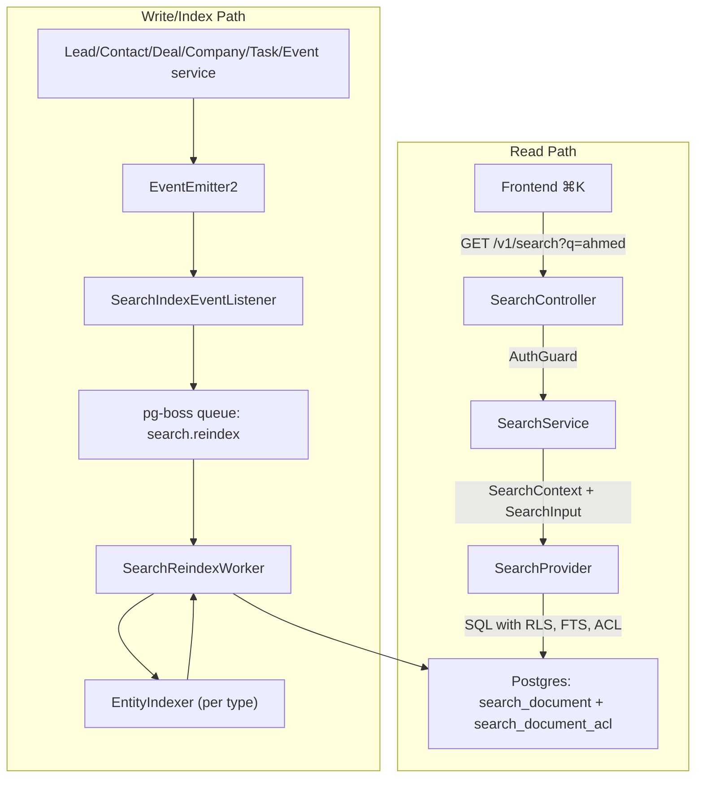

The PropWise CRM global search module provides a unified, permission-aware search experience across all CRM entities through a single endpoint and command palette interface.

<Note>
**Status:** Phase 1 complete (backend + frontend ⌘K). Version 0.6 includes Lead, Contact, Deal, Company, Task, and Event entities with full permission awareness.
</Note>

## Design Summary

The global search feature consists of five key architectural decisions:

### What Ships
One tenant-scoped read endpoint — `GET /v1/search` — backed by a denormalized `search_document` table (one row per Lead, Contact, Deal, Company, Task, Event). Stakeholder-gated entities also get rows in `search_document_acl`. The frontend ⌘K palette consumes lightweight hits; full detail loads on click.

### Two Pipelines, One Table
Search is **read** (sync SQL, P95 < 300ms) and **index** (async, ~2s P95 lag) decoupled. Domain services emit events → pg-boss queue `search.reindex` → `SearchReindexWorker` → per-entity `EntityIndexer.toDocument()` → upsert + ACL diff refresh.

<Warning>
A slow indexer must not block CRM writes or search reads.
</Warning>

### Implementation Components
Migrations for `search_document` / `search_document_acl`, `SearchModule` + `PostgresSearchProvider`, the reindex worker, **`LeadIndexer` and `ContactIndexer`** in their owning CRM modules (registered via `SEARCH_INDEXERS`), event wiring in services, shared **`normalizeSearchText()`**, and E2E persona + Arabic normalization tests.

### Permission Enforcement
Contact, Deal, and Company use `visibility = 'stakeholder_only'` — indexers project `(user_id, team_id, access_level)` into `search_document_acl`; the read path filters with a fast `EXISTS`. **Lead** is normally `stakeholder_only` but switches to `'org_wide'` while it is **unassigned** (zero active stakeholders → global pool).

<Info>
If search returns a row the user cannot open in list view, the feature is broken.
</Info>

### Arabic & Mixed-Script Support
Typing `أحمد`, `احمد`, or `ahmed` finds the same lead when the record uses any of those forms; Arabic-Indic phone digits match Western digits for UAE market requirements.

## Architecture Flow



## Goals & Acceptance Criteria

<CardGroup cols={2}>
<Card title="Unified Search" icon="magnifying-glass">
One endpoint covers Lead, Contact, Deal, Company, Task, Event with results returned in a single ranked list
</Card>

<Card title="Permission Aware" icon="shield-check">
Results respect existing org RLS and per-row stakeholder ACLs - users never see records they can't access in list views
</Card>

<Card title="Read-Your-Writes" icon="clock">
Backend: newly created/updated entities appear within ~2s P95 lag. Frontend: creators see just-created items immediately via client-side pins
</Card>

<Card title="Provider Swappable" icon="arrows-rotate">
Architecture supports swapping Postgres provider for OpenSearch/Typesense without changes to controllers or services
</Card>
</CardGroup>

### Additional Requirements

<Tabs>
<Tab title="PII Matching">
Phone and email substring matching for sensitive data:
- Typing `+9715…` or `ahmed@` returns matching persons
- Supports partial phone number and email domain searches
</Tab>

<Tab title="Response Format">
Picker-style lightweight hits containing:
- Entity ID, title, subtitle, type
- Permission metadata and relevance score
- Frontend fetches full detail on selection
</Tab>
</Tabs>

## Phase 1 Scope

<Steps>
<Step title="Core Entities">
Supports Lead, Contact, Deal, Company, Task, and Event entities
</Step>

<Step title="Permission Models">
- **Stakeholder-only**: Contact, Deal, Company (ACL-gated)
- **Conditional**: Lead (stakeholder-only when assigned, org-wide when unassigned)
- **Organization-wide**: Task, Event (no ACL restrictions)
</Step>

<Step title="Search Features">
- Arabic and mixed-script normalization
- Phone/email substring matching
- Full-text search with ranking
- Real-time indexing pipeline
</Step>
</Steps>

## Non-Goals (Phase 1)

<AccordionGroup>
<Accordion title="Excluded Entity Types">
- User, Team, Off-plan project/unit
- Conversation, Message, KnowledgeSource
- Notification, Subscription, Commission Payment
- Audit log data (remains in admin-only UI)
</Accordion>

<Accordion title="Advanced Features">
- Cross-org/global search for system admins
- Search analytics and query tracking
- Saved searches, pinned results, alerts
- Synchronous search index on create
</Accordion>
</AccordionGroup>

## Key Implementation Files

The search module follows a distributed architecture with indexers living in their respective domain modules:

```
src/modules/search/                    # Core search module
├── search.module.ts                   # Module definition
├── providers/postgres-search.provider.ts  # Primary implementation
├── workers/search-reindex.worker.ts   # Async indexing
└── services/search.service.ts         # Business logic

src/modules/lead/indexers/lead.indexer.ts      # Lead-specific indexing
src/modules/contact/indexers/contact.indexer.ts # Contact-specific indexing
```

<Tip>
Each domain module owns its indexer implementation while the search module provides the infrastructure and contracts.
</Tip>

## Getting Started

<CardGroup cols={2}>
<Card title="API Reference" icon="code" href="/api/search">
Complete API documentation for the search endpoints
</Card>

<Card title="Implementation Guide" icon="wrench" href="/backend/search/implementation">
Step-by-step guide for implementing search indexers
</Card>

<Card title="Testing Strategy" icon="flask" href="/backend/search/testing">
Testing approaches for search functionality and performance
</Card>

<Card title="Monitoring" icon="chart-line" href="/backend/search/monitoring">
Operational monitoring and performance tracking
</Card>
</CardGroup>