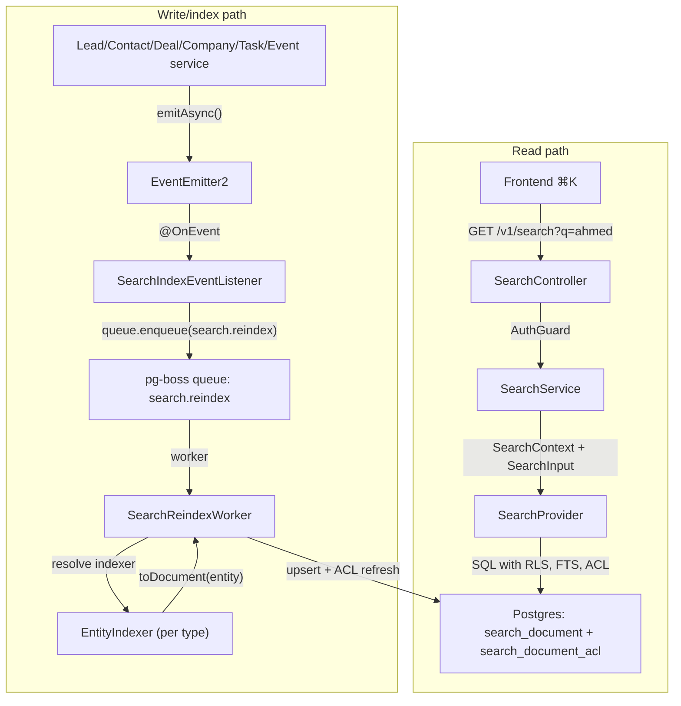

<Note>
**Version:** 0.6 (Phase 1 complete — backend + frontend ⌘K)  
**Last Updated:** May 2026  
**Status:** **Phase 1 (backend read/index + frontend ⌘K) landed** — Phase 1B **Steps 1–12**, Phase 1C **Steps 1–8**, Phase 1D **Steps 1–6**, Phase 1E **Steps 1–8** (frontend palette + Playwright smoke + §10 doc sync). **Remaining backend-only gaps:** `PostgresSearchProvider.reindexOrg()` (backfill orchestration helper) and §13.2 `search-backfill.e2e-spec.ts`. Cross-doc §16 rows for Steps 10–12 and Phase 1C/1D Step 6/8 are complete; Phase 1E Step 8 confirms no new backend cross-docs beyond this file §10.  
**Scope (Phase 1):** Lead, Contact, Deal, Company, Task, Event  
**Owner:** Backend Platform
</Note>

This document specifies the design of a permission-aware **global search** feature for PropWise CRM. Foundation work (Steps 2–9: module scaffold, worker/maintenance handlers, `SearchProvider` interface, indexer infrastructure, `normalizeSearchText()` §6.8, `buildSearchPermissionWhereClause()` §7.3, backfill script §6.4, unit tests) is implemented under `src/modules/search/`. **Phase 1B–1D** backend indexer/read paths and cross-doc sync are landed (see status banner). **Phase 1E** frontend ⌘K palette is landed in `propwise-crm-frontend` (§10).

## Design summary in 5 bullets

Read this section first. It is enough to know **what to build** before diving into §4 (per-entity field mapping) or the full 1,400+ line spec.

1. **What ships:** One tenant-scoped read endpoint — `GET /v1/search` — backed by a denormalized `search_document` table (one row per Lead, Contact, Deal, Company, Task, Event). Stakeholder-gated entities also get rows in `search_document_acl`. The frontend ⌘K palette consumes lightweight hits; full detail loads on click (§9–§10).

2. **Two pipelines, one table:** Search is **read** (sync SQL, P95 < 300ms) and **index** (async, ~2s P95 lag) decoupled. Domain services emit events → pg-boss queue `search.reindex` → `SearchReindexWorker` → per-entity `EntityIndexer.toDocument()` → upsert + ACL diff refresh. A slow indexer must not block CRM writes or search reads. See diagram below (canonical copy also in §2.2).

3. **What you implement (Phase 1B slice):** Migrations for `search_document` / `search_document_acl`, `SearchModule` + `PostgresSearchProvider`, the reindex worker, **`LeadIndexer` and `ContactIndexer`** in their owning CRM modules (registered via `SEARCH_INDEXERS`), event wiring in `LeadService` / `ContactService` / `PersonService` / `EntityStakeholderService`, shared **`normalizeSearchText()`** (§6.8), and E2E persona + Arabic normalization tests (§12, §13). File layout: §2.5.

4. **Permissions are not optional:** Contact, Deal, and Company use `visibility = 'stakeholder_only'` — indexers project `(user_id, team_id, access_level)` into `search_document_acl`; the read path filters with a fast `EXISTS` (§7). **Lead** is normally `stakeholder_only` but switches to `'org_wide'` while it is **unassigned** (zero active stakeholders → global pool), matching the always-available POOL list tab (§4.1). Task and Event are always `org_wide` (no ACL rows). If search returns a row the user cannot open in list view, the feature is broken.

5. **Where to read next:** **§4** — exact `title` / `subtitle` / `body` / ACL / reindex triggers per entity (read before writing any indexer). **§6** — queue config, worker contract, failure handling, cascades. **§12** — phase gates (1B = Lead + Contact only). Skip the rest until your slice needs it.

<CodeGroup>



</CodeGroup>

## Overview & goals

### Definition

**Global search** is a single endpoint (`GET /v1/search`) and a single frontend surface (the ⌘K command palette) that lets a user type any keyword, name, public ID, email, or phone fragment and see matching CRM records they are authorized to view, ranked by relevance and recency. It is permission-aware and tenant-scoped. **Backend** indexing is eventually consistent (~2s p95; longer under backlog). **Frontend** shows the creator their own just-created items immediately via client-side pins (§10.3.1) so "create → ⌘K" never feels broken.

### Goals (Phase 1)

| #   | Goal                                                                | Acceptance                                                                                                                                                                                                                                                                                                                                   |
| --- | ------------------------------------------------------------------- | -------------------------------------------------------------------------------------------------------------------------------------------------------------------------------------------------------------------------------------------------------------------------------------------------------------------------------------------- |
| G1  | One endpoint covers Lead, Contact, Deal, Company, Task, Event       | A single request returns hits across all six entity types in one ranked list                                                                                                                                                                                                                                                                 |
| G2  | Results respect existing org RLS and per-row stakeholder ACLs       | An agent searching `ahmed` never sees a lead they are not a stakeholder on (and would not see in `/v1/leads/list`)                                                                                                                                                                                                                           |
| G3  | Read-your-writes within ~2 seconds (indexer) + immediate creator UX | Backend: newly created/updated entity appears in `GET /v1/search` within indexer P95 lag (~2s under normal load; longer during queue backlog per §13.4). **Frontend:** creator sees their own just-created items in ⌘K immediately via client-side "Just created" group (§10.3.1) — no synchronous index or source-table fallback in Phase 1 |
| G4  | Provider-swappable architecture                                     | Swapping the Postgres provider for OpenSearch/Typesense in the future requires zero changes to controllers, services, or domain indexers                                                                                                                                                                                                     |
| G5  | Phone and email substring matching for PII                          | Typing `+9715…` or `ahmed@` returns the matching person                                                                                                                                                                                                                                                                                      |
| G6  | Picker-style response shape                                         | Lightweight hits (id, title, subtitle, entity type, permissions, score); the frontend fetches full detail on click                                                                                                                                                                                                                           |
| G7  | Arabic + mixed-script search (UAE market)                           | Typing `أحمد`, `احمد`, or `ahmed` finds the same lead when the record uses any of those forms; Arabic-Indic phone digits match Western digits                                                                                                                                                                                                |

### Non-goals (Phase 1)

<AccordionGroup>

<Accordion title="Phase 1 non-goals">

| Non-goal                                                                                                                  | Why                                                                                                                          |
| ------------------------------------------------------------------------------------------------------------------------- | ---------------------------------------------------------------------------------------------------------------------------- |
| Searching the audit log (`audit_log` table)                                                                               | Audit data is sensitive and lives in its own admin-only UI. See `Docs/AUDIT_LOG_SYSTEM.md`.                                  |
| Cross-org / global search for system admins                                                                               | System admin is scoped to the **currently selected org** (i.e. `executeInOrg(orgId)`) — same as every other tenant endpoint. |
| User, Team, Off-plan project/unit, Conversation, Message, KnowledgeSource, Notification, Subscription, Commission Payment | Reserved for Phase 2 / Phase 3.                                                                                              |
| Search-as-you-type analytics ("what are people searching for")                                                            | Out of scope. Only operational metrics (latency, hit count) are collected.                                                   |
| Saved searches / pinned results / alerts                                                                                  | Phase 2.                                                                                                                     |
| Synchronous search index on create (blocking CRM write)                                                                   | Async indexer only — see §10.3.1 for creator UX without backend coupling.                                                    |

</Accordion>

</AccordionGroup>

## Architecture

### Read/write decoupling

The search system is built on **read/write decoupling**:

- **Read path:** Synchronous, fast (`GET /v1/search` → SQL query → response)
- **Write path:** Asynchronous, eventual consistency (domain event → queue → worker → index)

This ensures that:
- Search queries remain fast even when indexing is slow
- CRM operations are never blocked by search indexing
- The system can handle bursts of updates without degrading search performance

<Tip>
The indexer P95 target is ~2 seconds under normal load, but may be longer during queue backlogs. The frontend handles this with client-side "Just created" pins for immediate creator feedback.
</Tip>

### Module structure

```
src/modules/search/
├── search.module.ts                 # Main module definition
├── controllers/
│   └── search.controller.ts         # REST endpoint
├── services/
│   ├── search.service.ts           # Business logic
│   └── postgres-search.provider.ts # PostgreSQL implementation
├── workers/
│   └── search-reindex.worker.ts    # Queue worker for indexing
├── indexers/
│   ├── base/
│   │   └── entity-indexer.base.ts  # Abstract base class
│   └── search-indexer.registry.ts  # Indexer discovery
├── dto/
│   ├── search-input.dto.ts         # Request validation
│   └── search-result.dto.ts        # Response shape
├── entities/
│   ├── search-document.entity.ts   # Main search table
│   └── search-document-acl.entity.ts # Permission table
└── migrations/
    ├── 20240515000001-create-search-document.ts
    └── 20240515000002-create-search-document-acl.ts
```

## Data model

### Search document table

The core `search_document` table stores denormalized search data:

<CodeGroup>

```sql SQL Schema
CREATE TABLE search_document (
    id UUID PRIMARY KEY DEFAULT gen_random_uuid(),
    org_id UUID NOT NULL,
    entity_type VARCHAR(50) NOT NULL,
    entity_id UUID NOT NULL,
    visibility VARCHAR(20) NOT NULL, -- 'org_wide' | 'stakeholder_only'
    
    -- Search fields
    title TEXT NOT NULL,
    subtitle TEXT,
    body TEXT,
    
    -- Full-text search vectors
    search_vector tsvector GENERATED ALWAYS AS (
        setweight(to_tsvector('english', coalesce(title, '')), 'A') ||
        setweight(to_tsvector('english', coalesce(subtitle, '')), 'B') ||
        setweight(to_tsvector('english', coalesce(body, '')), 'C')
    ) STORED,
    
    -- Metadata
    created_at TIMESTAMPTZ NOT NULL DEFAULT now(),
    updated_at TIMESTAMPTZ NOT NULL DEFAULT now(),
    indexed_at TIMESTAMPTZ NOT NULL DEFAULT now(),
    
    CONSTRAINT search_document_org_entity_unique 
        UNIQUE (org_id, entity_type, entity_id)
);

-- Indexes
CREATE INDEX idx_search_document_org_visibility 
    ON search_document (org_id, visibility);
    
CREATE INDEX idx_search_document_search_vector 
    ON search_document USING gin(search_vector);
```

</CodeGroup>

### Permission ACL table

For `stakeholder_only` entities, permissions are stored in `search_document_acl`:

<CodeGroup>

```sql SQL Schema
CREATE TABLE search_document_acl (
    id UUID PRIMARY KEY DEFAULT gen_random_uuid(),
    search_document_id UUID NOT NULL REFERENCES search_document(id) ON DELETE CASCADE,
    user_id UUID,
    team_id UUID,
    access_level VARCHAR(20) NOT NULL,
    created_at TIMESTAMPTZ NOT NULL DEFAULT now(),
    
    CONSTRAINT search_document_acl_user_or_team 
        CHECK ((user_id IS NOT NULL) != (team_id IS NOT NULL))
);

-- Indexes for fast permission lookups
CREATE INDEX idx_search_document_acl_user 
    ON search_document_acl (search_document_id, user_id);
    
CREATE INDEX idx_search_document_acl_team 
    ON search_document_acl (search_document_id, team_id);
```

</CodeGroup>

## Per-entity field mapping

This section defines exactly what gets indexed for each entity type. **Read this before implementing any indexer.**

### Lead indexer

<CardGroup cols={2}>

<Card title="Lead Mapping" icon="user-plus">

**Title:** `${firstName} ${lastName}` (required)  
**Subtitle:** `${email}` or `${primaryPhone}` or `Lead #${publicId}`  
**Body:** `${publicId} ${email} ${primaryPhone} ${secondaryPhone} ${description}`  
**Visibility:** `stakeholder_only` if assigned, `org_wide` if unassigned (zero stakeholders)

</Card>

<Card title="Reindex Triggers" icon="refresh">

- `lead.created`
- `lead.updated` (name, email, phone, description changes)
- `lead.assigned` / `lead.unassigned`
- `lead_stakeholder.added` / `lead_stakeholder.removed`

</Card>

</CardGroup>

<Warning>
**Lead visibility is special:** Unlike other stakeholder entities, leads switch between `stakeholder_only` and `org_wide` based on assignment status. This matches the POOL tab behavior in the leads list view.
</Warning>

### Contact indexer

<CardGroup cols={2}>

<Card title="Contact Mapping" icon="user">

**Title:** `${firstName} ${lastName}` (required)  
**Subtitle:** `${email}` or `${primaryPhone}` or `Contact #${publicId}`  
**Body:** `${publicId} ${email} ${primaryPhone} ${secondaryPhone} ${jobTitle} ${company.name} ${description}`  
**Visibility:** Always `stakeholder_only`

</Card>

<Card title="Reindex Triggers" icon="refresh">

- `contact.created`
- `contact.updated` (name, email, phone, job, description changes)
- `contact_stakeholder.added` / `contact_stakeholder.removed`
- `company.updated` (when contact.companyId matches - for company name)

</Card>

</CardGroup>

### Deal, Company, Task, Event indexers

<AccordionGroup>

<Accordion title="Deal indexer">

**Title:** Deal name (required)  
**Subtitle:** `${formatMoney(value)} • ${stage}` or `Deal #${publicId}`  
**Body:** `${publicId} ${description} ${company.name} ${primaryContact.fullName}`  
**Visibility:** Always `stakeholder_only`

**Triggers:**
- `deal.created`, `deal.updated`
- `deal_stakeholder.added` / `deal_stakeholder.removed`
- `company.updated`, `contact.updated` (related entities)

</Accordion>

<Accordion title="Company indexer">

**Title:** Company name (required)  
**Subtitle:** `${industry}` or `Company #${publicId}`  
**Body:** `${publicId} ${website} ${description} ${address}`  
**Visibility:** Always `stakeholder_only`

**Triggers:**
- `company.created`, `company.updated`
- `company_stakeholder.added` / `company_stakeholder.removed`

</Accordion>

<Accordion title="Task indexer">

**Title:** Task title (required)  
**Subtitle:** `Due ${formatDate(dueDate)}` or `Task #${publicId}`  
**Body:** `${publicId} ${description} ${assignee.fullName}`  
**Visibility:** Always `org_wide` (no ACL)

**Triggers:**
- `task.created`, `task.updated`
- `user.updated` (assignee name changes)

</Accordion>

<Accordion title="Event indexer">

**Title:** Event title (required)  
**Subtitle:** `${formatDate(startDate)}` or `Event #${publicId}`  
**Body:** `${publicId} ${description} ${location} ${attendee.fullName}`  
**Visibility:** Always `org_wide` (no ACL)

**Triggers:**
- `event.created`, `event.updated`
- `user.updated` (attendee name changes)

</Accordion>

</AccordionGroup>

## Indexing pipeline

### Queue configuration

<Steps>

<Step title="Event emission">
Domain services emit async events when entities change:

```typescript
// Example from LeadService
async updateLead(id: string, data: UpdateLeadDto): Promise<Lead> {
  const lead = await this.leadRepository.save({ id, ...data });
  
  // Emit async event for search indexing
  this.eventEmitter.emitAsync('lead.updated', { 
    leadId: id, 
    orgId: lead.orgId 
  });
  
  return lead;
}
```

</Step>

<Step title="Event listener">
The search module listens for events and queues reindex jobs:

```typescript
@OnEvent('lead.updated')
async handleLeadUpdated(payload: { leadId: string; orgId: string }) {
  await this.searchQueue.enqueue('search.reindex', {
    entityType: 'lead',
    entityId: payload.leadId,
    orgId: payload.orgId,
  });
}
```

</Step>

<Step title="Worker processing">
The worker processes jobs and updates the search index:

```typescript
async process(job: Job<SearchReindexPayload>) {
  const { entityType, entityId, orgId } = job.data;
  
  // Resolve the appropriate indexer
  const indexer = this.getIndexer(entityType);
  
  // Generate search document
  const document = await indexer.toDocument(entityId, orgId);
  
  // Upsert to search_document table
  await this.searchProvider.upsertDocument(document);
}
```

</Step>

</Steps>

### Text normalization

The `normalizeSearchText()` function handles Arabic and mixed-script content:

<CodeGroup>

```typescript TypeScript
export function normalizeSearchText(text: string): string {
  if (!text) return '';
  
  // Arabic normalization
  text = text
    .replace(/[أإآا]/g, 'ا')  // Normalize alef forms
    .replace(/[ىي]/g, 'ي')    // Normalize yeh forms
    .replace(/[ؤئء]/g, 'و')   // Normalize hamza forms
    
    // Arabic-Indic to Western digits
    .replace(/[٠-٩]/g, (d) => String.fromCharCode(d.charCodeAt(0) - '٠'.charCodeAt(0) + '0'.charCodeAt(0)));
  
  return text.toLowerCase().trim();
}
```

```sql PostgreSQL
-- Usage in search query
SELECT * FROM search_document 
WHERE search_vector @@ plainto_tsquery('english', normalize_search_text($1))
ORDER BY ts_rank(search_vector, plainto_tsquery('english', normalize_search_text($1))) DESC;
```

</CodeGroup>

### Failure handling

<Info>
Failed indexing jobs are retried with exponential backoff. After 3 failures, jobs go to a dead letter queue for manual investigation. The read path continues to work with stale data.
</Info>

## Permission gate

### ACL query pattern

For `stakeholder_only` entities, the search query includes an ACL check:

<CodeGroup>

```sql PostgreSQL
WITH user_permissions AS (
  SELECT DISTINCT search_document_id 
  FROM search_document_acl 
  WHERE user_id = $userId 
     OR team_id = ANY($userTeamIds)
)
SELECT 
  sd.id,
  sd.entity_type,
  sd.entity_id,
  sd.title,
  sd.subtitle,
  ts_rank(sd.search_vector, query) as score
FROM search_document sd
CROSS JOIN plainto_tsquery('english', $normalizedQuery) query
WHERE sd.org_id = $orgId
  AND sd.search_vector @@ query
  AND (
    sd.visibility = 'org_wide' 
    OR EXISTS (
      SELECT 1 FROM user_permissions up 
      WHERE up.search_document_id = sd.id
    )
  )
ORDER BY score DESC, sd.updated_at DESC
LIMIT $limit;
```

</CodeGroup>

### Special case: unassigned leads

<Note>
Unassigned leads (zero stakeholders) are indexed with `visibility = 'org_wide'` and have no ACL rows. This matches the behavior of the POOL tab in the leads list, which is always visible to all org members.
</Note>

## API contract

### Search endpoint

<CodeGroup>

```http HTTP Request
GET /v1/search?q=ahmed&limit=10&entityTypes=lead,contact

Authorization: Bearer <token>
```

```json Response
{
  "hits": [
    {
      "id": "doc-uuid",
      "entityType": "lead",
      "entityId": "lead-uuid",
      "title": "Ahmed Hassan",
      "subtitle": "ahmed@example.com",
      "score": 0.95,
      "permissions": {
        "canView": true,
        "canEdit": true
      }
    }
  ],
  "totalCount": 1,
  "took": 45
}
```

</CodeGroup>

### Query parameters

| Parameter    | Type     | Description                                    | Default |
|-------------|----------|------------------------------------------------|---------|
| `q`         | string   | Search query (required, min 1 char)           | -       |
| `limit`     | number   | Max results to return (1-50)                  | 10      |
| `entityTypes` | string[] | Filter by entity types (comma-separated)      | all     |

## Frontend contract

### Command palette integration

The frontend ⌘K palette integrates with the search API:

<Tabs>
<Tab title="Search Hook">

```typescript
// Custom hook for search
export function useSearch() {
  const [query, setQuery] = useState('');
  const [results, setResults] = useState<SearchResult[]>([]);
  
  const { data, isLoading } = useQuery({
    queryKey: ['search', query],
    queryFn: () => searchApi.search({ q: query, limit: 10 }),
    enabled: query.length > 0,
    staleTime: 30 * 1000, // 30 second cache
  });
  
  return { query, setQuery, results: data?.hits || [], isLoading };
}
```

</Tab>
<Tab title="Palette Component">

```tsx
export function SearchPalette() {
  const { query, setQuery, results, isLoading } = useSearch();
  const recentCreations = useRecentCreations(); // Client-side pins
  
  return (
    <CommandPalette>
      <CommandPalette.Input 
        value={query}
        onChange={setQuery}
        placeholder="Search leads, contacts, deals..."
      />
      
      {recentCreations.length > 0 && (
        <CommandPalette.Group heading="Just created">
          {recentCreations.map(item => (
            <SearchResultItem key={item.id} item={item} />
          ))}
        </CommandPalette.Group>
      )}
      
      <CommandPalette.Group heading="Search results">
        {results.map(hit => (
          <SearchResultItem key={hit.id} item={hit} />
        ))}
      </CommandPalette.Group>
    </CommandPalette>
  );
}
```

</Tab>
</Tabs>

### Client-side "just created" pins

<Tip>
The frontend maintains a client-side list of recently created items to show immediate feedback before the async indexer catches up. This provides a smooth "create → ⌘K" experience without backend coupling.
</Tip>

## Phased rollout

### Phase 1B: Lead + Contact (current)

<Steps>

<Step title="Backend foundation">
- `search_document` and `search_document_acl` migrations
- `SearchModule`, `PostgresSearchProvider`, `SearchReindexWorker`
- `LeadIndexer` and `ContactIndexer` implementations
- Event wiring in lead and contact services
</Step>

<Step title="Testing">
- Unit tests for indexers and normalization
- E2E tests for permission scenarios
- Arabic text normalization tests
</Step>

<Step title="Monitoring">
- Queue metrics and worker health checks
- Search latency and error rate monitoring
</Step>

</Steps>

### Phase 1C: Deal + Company

<Check>Add deal and company indexers with stakeholder permission support</Check>

### Phase 1D: Task + Event  

<Check>Add task and event indexers with org-wide visibility</Check>

### Phase 1E: Frontend ⌘K

<Check>Complete command palette integration with client-side pins</Check>

## Testing strategy

### Unit tests

- **Indexer tests:** Verify `toDocument()` output for each entity type
- **Normalization tests:** Arabic text handling, phone/email matching
- **Permission tests:** ACL query generation and filtering

### Integration tests

- **End-to-end search:** Create entity → trigger reindex → verify searchable
- **Permission scenarios:** Stakeholder-only vs org-wide visibility
- **Bulk throughput:** Handle queue backlogs and measure P95 latency

<Warning>
**Bulk throughput gate (§13.4):** The system must handle at least 1000 concurrent reindex jobs with P95 latency under 10 seconds. This ensures the system can handle realistic bulk import and update scenarios.
</Warning>

### Frontend tests

- **Playwright smoke tests:** Basic ⌘K palette functionality  
- **Client-side pins:** Verify "just created" items appear immediately
- **Error handling:** Network failures, empty results, permission errors

## Operations & monitoring

### Key metrics

| Metric | Target | Alert Threshold |
|--------|---------|-----------------|
| Search P95 latency | < 300ms | > 500ms |
| Indexer P95 latency | < 2s | > 10s |
| Queue backlog | < 100 jobs | > 1000 jobs |
| Error rate | < 1% | > 5% |

### Health checks

<Steps>

<Step title="Search endpoint health">
```typescript
GET /health/search
```
Returns 200 if search_document table is readable and FTS indexes are healthy.
</Step>

<Step title="Queue worker health">
```typescript  
GET /health/search-worker
```
Returns 200 if worker is processing jobs and queue connection is active.
</Step>

<Step title="Index freshness">
```typescript
GET /health/search-freshness  
```
Returns 200 if average `indexed_at` lag is under threshold (2 minutes).
</Step>

</Steps>

## Open risks

<AccordionGroup>

<Accordion title="Arabic text performance">
**Risk:** Complex Arabic normalization may impact search latency  
**Mitigation:** Cache normalized queries, benchmark with realistic UAE data  
**Status:** Monitoring in Phase 1B
</Accordion>

<Accordion title="Queue backlog during bulk operations">
**Risk:** Large data imports could create indexing backlogs  
**Mitigation:** Bulk reindex API (§6.4), queue monitoring, worker scaling  
**Status:** Throughput gates in Phase 1C (§13.4)
</Accordion>

<Accordion title="Permission complexity">
**Risk:** ACL queries may be slow with large stakeholder lists  
**Mitigation:** Optimized indexes, query plan monitoring, consider permission caching  
**Status:** Performance testing in Phase 1C
</Accordion>

</AccordionGroup>

## Cross-doc updates required

The following files need updates to support search integration:

### Phase 1B (Lead + Contact)
- `src/modules/lead/lead.service.ts` - Add event emission
- `src/modules/contact/contact.service.ts` - Add event emission  
- `src/modules/person/person.service.ts` - Add event emission
- `src/modules/stakeholder/entity-stakeholder.service.ts` - Add event emission

### Phase 1C-1D (Deal, Company, Task, Event)
- Similar service updates for deal, company, task, and event modules

### Phase 1E (Frontend)
- Complete frontend palette implementation in `propwise-crm-frontend`

<Note>
All cross-doc updates are tracked in the main project board. See §16 for the complete checklist.
</Note>

## References

- [Entity Stakeholder System](../stakeholder/ENTITY_STAKEHOLDER_SYSTEM.md) - Permission model
- [Audit Log System](../audit/AUDIT_LOG_SYSTEM.md) - Why audit is excluded
- [Frontend Architecture](../../frontend/ARCHITECTURE.md) - Command palette patterns
- [Queue System](../queue/QUEUE_SYSTEM.md) - pg-boss configuration