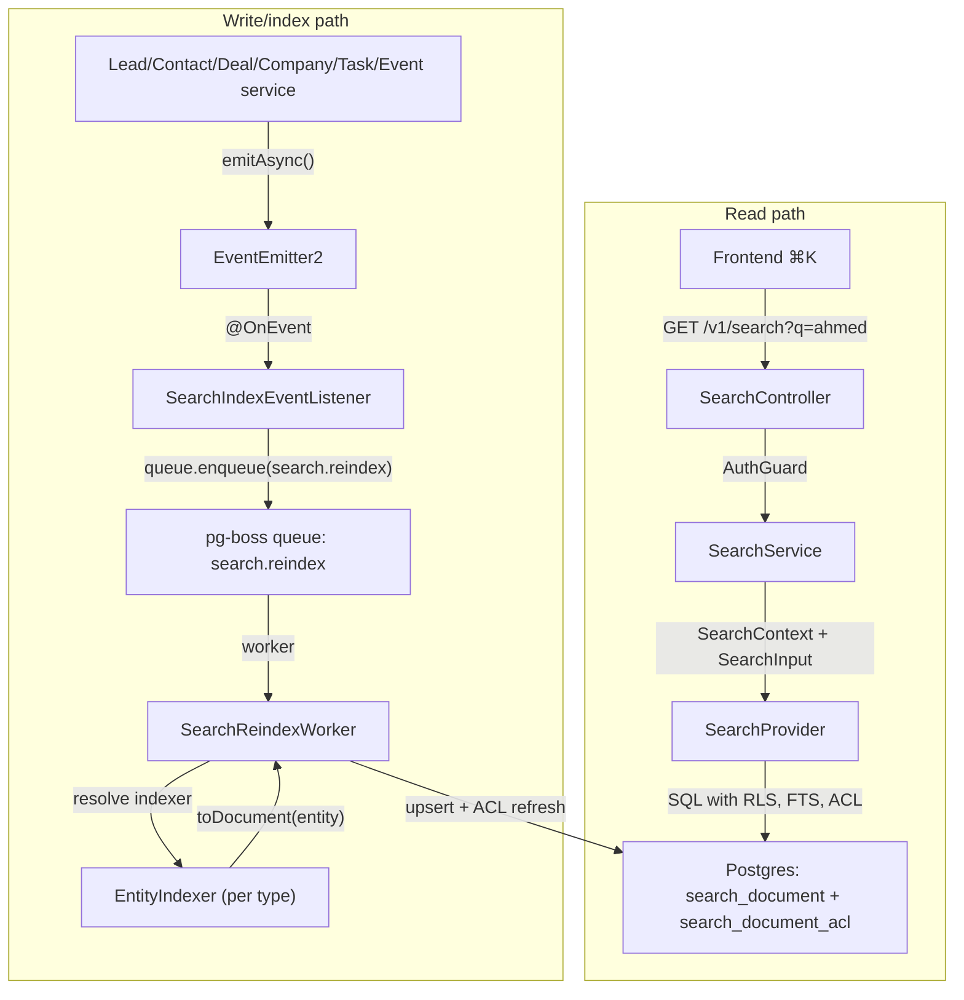
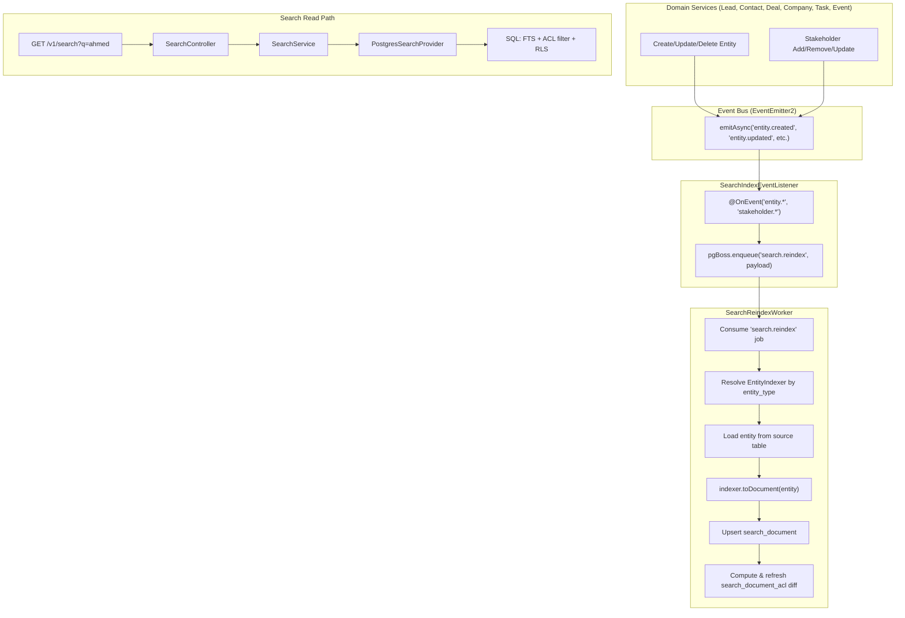

<Note>
**Version:** 0.6 (Phase 1 complete — backend + frontend ⌘K)  
**Last Updated:** May 2026  
**Status:** **Phase 1 (backend read/index + frontend ⌘K) landed** — Phase 1B **Steps 1–12**, Phase 1C **Steps 1–8**, Phase 1D **Steps 1–6**, Phase 1E **Steps 1–8** (frontend palette + Playwright smoke + §10 doc sync).  
**Scope (Phase 1):** Lead, Contact, Deal, Company, Task, Event  
**Owner:** Backend Platform
</Note>

This document specifies the design of a permission-aware **global search** feature for PropWise CRM. Foundation work (Steps 2–9: module scaffold, worker/maintenance handlers, `SearchProvider` interface, indexer infrastructure, `normalizeSearchText()` §6.8, `buildSearchPermissionWhereClause()` §7.3, backfill script §6.4, unit tests) is implemented under `src/modules/search/`. **Phase 1B–1D** backend indexer/read paths and cross-doc sync are landed. **Phase 1E** frontend ⌘K palette is landed in `propwise-crm-frontend` (§10).

## Design Summary in 5 Bullets

<Info>
Read this section first. It is enough to know **what to build** before diving into §4 (per-entity field mapping) or the full specification.
</Info>

<Steps>
<Step title="What Ships">
One tenant-scoped read endpoint — `GET /v1/search` — backed by a denormalized `search_document` table (one row per Lead, Contact, Deal, Company, Task, Event). Stakeholder-gated entities also get rows in `search_document_acl`. The frontend ⌘K palette consumes lightweight hits; full detail loads on click (§9–§10).
</Step>

<Step title="Two Pipelines, One Table">
Search is **read** (sync SQL, P95 < 300ms) and **index** (async, ~2s P95 lag) decoupled. Domain services emit events → pg-boss queue `search.reindex` → `SearchReindexWorker` → per-entity `EntityIndexer.toDocument()` → upsert + ACL diff refresh. A slow indexer must not block CRM writes or search reads.


</Step>

<Step title="What You Implement (Phase 1B Slice)">
Migrations for `search_document` / `search_document_acl`, `SearchModule` + `PostgresSearchProvider`, the reindex worker, **`LeadIndexer` and `ContactIndexer`** in their owning CRM modules (registered via `SEARCH_INDEXERS`), event wiring in `LeadService` / `ContactService` / `PersonService` / `EntityStakeholderService`, shared **`normalizeSearchText()`** (§6.8), and E2E persona + Arabic normalization tests (§12, §13).
</Step>

<Step title="Permissions Are Not Optional">
Contact, Deal, and Company use `visibility = 'stakeholder_only'` — indexers project `(user_id, team_id, access_level)` into `search_document_acl`; the read path filters with a fast `EXISTS` (§7). **Lead** is normally `stakeholder_only` but switches to `'org_wide'` while it is **unassigned** (zero active stakeholders → global pool), matching the always-available POOL list tab (§4.1). Task and Event are always `org_wide` (no ACL rows). If search returns a row the user cannot open in list view, the feature is broken.
</Step>

<Step title="Where to Read Next">
**§4** — exact `title` / `subtitle` / `body` / ACL / reindex triggers per entity (read before writing any indexer). **§6** — queue config, worker contract, failure handling, cascades. **§12** — phase gates (1B = Lead + Contact only). Skip the rest until your slice needs it.
</Step>
</Steps>

## 1. Overview & Goals

### 1.1 Definition

**Global search** is a single endpoint (`GET /v1/search`) and a single frontend surface (the ⌘K command palette) that lets a user type any keyword, name, public ID, email, or phone fragment and see matching CRM records they are authorized to view, ranked by relevance and recency. It is permission-aware and tenant-scoped. **Backend** indexing is eventually consistent (~2s p95; longer under backlog). **Frontend** shows the creator their own just-created items immediately via client-side pins (§10.3.1) so "create → ⌘K" never feels broken.

### 1.2 Goals (Phase 1)

| # | Goal | Acceptance |
|---|------|-----------|
| G1 | One endpoint covers Lead, Contact, Deal, Company, Task, Event | A single request returns hits across all six entity types in one ranked list |
| G2 | Results respect existing org RLS and per-row stakeholder ACLs | An agent searching `ahmed` never sees a lead they are not a stakeholder on (and would not see in `/v1/leads/list`) |
| G3 | Read-your-writes within ~2 seconds (indexer) + immediate creator UX | Backend: newly created/updated entity appears in `GET /v1/search` within indexer P95 lag (~2s under normal load; longer during queue backlog per §13.4). **Frontend:** creator sees their own just-created items in ⌘K immediately via client-side "Just created" group (§10.3.1) — no synchronous index or source-table fallback in Phase 1 |
| G4 | Provider-swappable architecture | Swapping the Postgres provider for OpenSearch/Typesense in the future requires zero changes to controllers, services, or domain indexers |
| G5 | Phone and email substring matching for PII | Typing `+9715…` or `ahmed@` returns the matching person |
| G6 | Picker-style response shape | Lightweight hits (id, title, subtitle, entity type, permissions, score); the frontend fetches full detail on click |
| G7 | Arabic + mixed-script search (UAE market) | Typing `أحمد`, `احمد`, or `ahmed` finds the same lead when the record uses any of those forms; Arabic-Indic phone digits match Western digits |

### 1.3 Non-goals (Phase 1)

<AccordionGroup>
<Accordion title="Audit Log Search">
Audit data is sensitive and lives in its own admin-only UI. See `Docs/AUDIT_LOG_SYSTEM.md`.
</Accordion>

<Accordion title="Cross-org / Global Search for System Admins">
System admin is scoped to the **currently selected org** (i.e. `executeInOrg(orgId)`) — same as every other tenant endpoint.
</Accordion>

<Accordion title="Additional Entity Types">
User, Team, Off-plan project/unit, Conversation, Message, KnowledgeSource, Notification, Subscription, Commission Payment are reserved for Phase 2 / Phase 3.
</Accordion>

<Accordion title="Search Analytics">
Search-as-you-type analytics ("what are people searching for") are out of scope. Only operational metrics (latency, hit count) are collected.
</Accordion>

<Accordion title="Advanced Features">
Saved searches / pinned results / alerts are Phase 2.
</Accordion>

<Accordion title="Synchronous Indexing">
Async indexer only — see §10.3.1 for creator UX without backend coupling.
</Accordion>

<Accordion title="Server-side Source Table Fallback">
No "query source tables on every search" fallback for the creator's just-created items. Frontend handles this via client-side pinning (§10.3.1).
</Accordion>
</AccordionGroup>

## 2. Architecture

### 2.1 Read vs. Index Decoupling

<Tip>
**Key Design Principle:** Search **read** and **index** are completely decoupled. The read path is synchronous SQL (P95 < 300ms). The index path is asynchronous (pg-boss queue, ~2s P95 lag).
</Tip>

**Why this matters:**
- A slow indexer (e.g., fetching stakeholders for a deal with 50 watchers) must not block CRM writes
- The read path never queries `lead`, `contact`, `deal`, etc. directly — only the denormalized `search_document` table
- Domain services emit events; they do not await indexing
- The frontend handles "just created" UX via client-side pinning (§10.3.1), not by forcing synchronous indexing

### 2.2 Data Flow Diagram



### 2.3 Layering

<CodeGroup>
```typescript src/modules/search/search.module.ts
@Module({
  imports: [
    TypeOrmModule.forFeature([SearchDocument, SearchDocumentACL]),
    PgBossModule,
  ],
  controllers: [SearchController],
  providers: [
    SearchService,
    {
      provide: SEARCH_PROVIDER,
      useClass: PostgresSearchProvider,
    },
    SearchReindexWorker,
    SearchIndexEventListener,
    SearchMaintenanceService,
  ],
  exports: [SearchService, SEARCH_PROVIDER],
})
export class SearchModule {}
```

```typescript Layer Responsibilities
/**
 * Layer responsibilities:
 * 
 * 1. Controller (SearchController):
 *    - Guards (AuthGuard, OrgGuard)
 *    - DTO validation (SearchQueryDto)
 *    - Context extraction (req.user, req.org)
 * 
 * 2. Service (SearchService):
 *    - Business logic orchestration
 *    - Context building (SearchContext)
 *    - Provider delegation
 * 
 * 3. Provider (PostgresSearchProvider):
 *    - Query construction
 *    - SQL execution
 *    - Result mapping
 * 
 * 4. Worker (SearchReindexWorker):
 *    - Job consumption
 *    - Indexer resolution
 *    - Document upsert
 *    - ACL refresh
 * 
 * 5. Indexers (EntityIndexer implementations):
 *    - Entity-to-document transformation
 *    - Stakeholder resolution
 *    - Field mapping
 */
```
</CodeGroup>

### 2.4 Provider Abstraction

The `SearchProvider` interface isolates search engine concerns:

```typescript
export interface SearchProvider {
  search(context: SearchContext, input: SearchInput): Promise<SearchResult>;
  reindex(document: SearchDocument): Promise<void>;
  deleteDocument(orgId: string, entityType: string, entityId: string): Promise<void>;
  refreshACL(orgId: string, documentId: string, acls: SearchACL[]): Promise<void>;
}
```

<Info>
**Phase 1:** `PostgresSearchProvider` uses native Postgres full-text search (pg_trgm + tsvector).  
**Future:** Swap for `OpenSearchProvider` or `TypesenseProvider` without changing controllers, services, or domain indexers.
</Info>

### 2.5 File Layout

```
src/modules/search/
├── search.module.ts
├── controllers/
│   └── search.controller.ts
├── services/
│   ├── search.service.ts
│   └── search-maintenance.service.ts
├── providers/
│   ├── search-provider.interface.ts
│   └── postgres-search.provider.ts
├── workers/
│   └── search-reindex.worker.ts
├── listeners/
│   └── search-index-event.listener.ts
├── indexers/
│   └── entity-indexer.interface.ts
├── entities/
│   ├── search-document.entity.ts
│   └── search-document-acl.entity.ts
├── dto/
│   ├── search-query.dto.ts
│   ├── search-result.dto.ts
│   └── search-document.dto.ts
├── utils/
│   ├── normalize-search-text.ts
│   └── build-search-permission-where-clause.ts
└── scripts/
    └── search-backfill.ts

src/modules/lead/
├── indexers/
│   └── lead.indexer.ts

src/modules/contact/
├── indexers/
│   └── contact.indexer.ts

src/modules/deal/
├── indexers/
│   └── deal.indexer.ts

src/modules/company/
├── indexers/
│   └── company.indexer.ts

src/modules/task/
├── indexers/
│   └── task.indexer.ts

src/modules/event/
├── indexers/
│   └── event.indexer.ts
```

## 3. Data Model

### 3.1 `search_document` Table

<Note>
**Primary search table.** One row per searchable entity. All text fields are normalized via `normalizeSearchText()` before insert/update (§6.8).
</Note>

```sql
CREATE TABLE search_document (
  id UUID PRIMARY KEY DEFAULT uuid_generate_v4(),
  org_id UUID NOT NULL REFERENCES organization(id) ON DELETE CASCADE,
  entity_type TEXT NOT NULL CHECK (entity_type IN ('lead', 'contact', 'deal', 'company', 'task', 'event')),
  entity_id UUID NOT NULL,
  
  -- Display fields (picker response)
  title TEXT NOT NULL,
  subtitle TEXT,
  
  -- Searchable content (normalized)
  body TEXT, -- normalized concatenation of searchable fields
  search_vector tsvector GENERATED ALWAYS AS (to_tsvector('english', coalesce(body, ''))) STORED,
  
  -- Metadata
  visibility TEXT NOT NULL CHECK (visibility IN ('org_wide', 'stakeholder_only')),
  created_by UUID REFERENCES "user"(id) ON DELETE SET NULL,
  created_at TIMESTAMPTZ NOT NULL DEFAULT NOW(),
  updated_at TIMESTAMPTZ NOT NULL DEFAULT NOW(),
  
  -- Indexing metadata
  indexed_at TIMESTAMPTZ NOT NULL DEFAULT NOW(),
  index_version INTEGER NOT NULL DEFAULT 1,
  
  UNIQUE(org_id, entity_type, entity_id)
);

CREATE INDEX idx_search_document_org_entity ON search_document(org_id, entity_type);
CREATE INDEX idx_search_document_vector ON search_document USING gin(search_vector);
CREATE INDEX idx_search_document_body_trigram ON search_document USING gin(body gin_trgm_ops);
CREATE INDEX idx_search_document_updated_at ON search_document(org_id, updated_at DESC);
```

<Accordion title="Column Descriptions">
| Column | Type | Description |
|--------|------|-------------|
| `id` | UUID | Internal PK. Not exposed to frontend. |
| `org_id` | UUID | Tenant scope. RLS filter. |
| `entity_type` | TEXT | One of: `lead`, `contact`, `deal`, `company`, `task`, `event` |
| `entity_id` | UUID | FK to source entity. Not enforced (cross-module) |
| `title` | TEXT | Primary display text (e.g., "Ahmed Hassan") |
| `subtitle` | TEXT | Secondary display text (e.g., "+971501234567") |
| `body` | TEXT | Normalized concatenation of all searchable fields (§6.8) |
| `search_vector` | tsvector | Generated column for full-text search |
| `visibility` | TEXT | `org_wide` or `stakeholder_only` |
| `created_by` | UUID | Original creator (for "Just created" client-side pin) |
| `created_at` | TIMESTAMPTZ | Original entity creation time |
| `updated_at` | TIMESTAMPTZ | Last entity update time (for recency ranking) |
| `indexed_at` | TIMESTAMPTZ | Last successful reindex timestamp |
| `index_version` | INTEGER | Schema version (for backfill detection) |
</Accordion>

### 3.2 `search_document_acl` Table

<Warning>
**Only used for stakeholder-gated entities** (Contact, Deal, Company). Lead uses conditional `org_wide` visibility (§4.1). Task and Event are always `org_wide` (no rows).
</Warning>

```sql
CREATE TABLE search_document_acl (
  id UUID PRIMARY KEY DEFAULT uuid_generate_v4(),
  document_id UUID NOT NULL REFERENCES search_document(id) ON DELETE CASCADE,
  user_id UUID REFERENCES "user"(id) ON DELETE CASCADE,
  team_id UUID REFERENCES team(id) ON DELETE CASCADE,
  access_level TEXT NOT NULL CHECK (access_level IN ('owner', 'editor', 'viewer')),
  
  CONSTRAINT chk_user_or_team CHECK (
    (user_id IS NOT NULL AND team_id IS NULL) OR
    (user_id IS NULL AND team_id IS NOT NULL)
  )
);

CREATE INDEX idx_search_document_acl_document ON search_document_acl(document_id);
CREATE INDEX idx_search_document_acl_user ON search_document_acl(user_id) WHERE user_id IS NOT NULL;
CREATE INDEX idx_search_document_acl_team ON search_document_acl(team_id) WHERE team_id IS NOT NULL;
```

### 3.3 RLS Policies

<Info>
All queries are automatically filtered by `org_id` via Postgres row-level security. The `SearchProvider` uses `executeInOrg(orgId)` to set `app.current_org_id`.
</Info>

```sql
ALTER TABLE search_document ENABLE ROW LEVEL SECURITY;

CREATE POLICY search_document_org_isolation ON search_document
  USING (org_id = current_setting('app.current_org_id')::uuid);

ALTER TABLE search_document_acl ENABLE ROW LEVEL SECURITY;

CREATE POLICY search_document_acl_via_document ON search_document_acl
  USING (
    document_id IN (
      SELECT id FROM search_document
      WHERE org_id = current_setting('app.current_org_id')::uuid
    )
  );
```

## 4. Per-Entity Field Mapping

<Warning>
**Critical section.** Read this before implementing any indexer. Inconsistent field mapping breaks search UX.
</Warning>

### 4.1 Lead

<Tabs>
<Tab title="Fields">
```typescript
interface LeadSearchDocument {
  entity_type: 'lead';
  entity_id: lead.id;
  title: lead.person.full_name || lead.person.phone || lead.person.email;
  subtitle: lead.public_id + ' · ' + lead.source;
  body: normalizeSearchText([
    lead.person.full_name,
    lead.person.phone,
    lead.person.email,
    lead.person.alt_phone,
    lead.public_id,
    lead.notes,
    lead.address?.formatted_address,
  ]);
  visibility: lead has active stakeholders ? 'stakeholder_only' : 'org_wide';
  created_by: lead.created_by;
  created_at: lead.created_at;
  updated_at: lead.updated_at;
}
```
</Tab>

<Tab title="Visibility Logic">
<Check>
**Lead is `org_wide` when unassigned** (zero active stakeholders). This matches the POOL tab behavior where any agent can claim unassigned leads.
</Check>

```typescript
async getLeadVisibility(leadId: string): Promise<'org_wide' | 'stakeholder_only'> {
  const stakeholderCount = await this.entityStakeholderRepository.count({
    where: {
      entity_type: 'lead',
      entity_id: leadId,
      is_active: true,
    },
  });
  return stakeholderCount > 0 ? 'stakeholder_only' : 'org_wide';
}
```
</Tab>

<Tab title="ACL Projection">
```typescript
// Only if visibility = 'stakeholder_only'
acls = await this.entityStakeholderRepository.find({
  where: { entity_type: 'lead', entity_id: leadId, is_active: true },
  select: ['user_id', 'team_id', 'access_level'],
});
```
</Tab>

<Tab title="Reindex Triggers">
- `lead.created`
- `lead.updated` (person, notes, address changes)
- `stakeholder.added` / `stakeholder.removed` / `stakeholder.access_level_changed` (for Lead)
- `person.updated` (if person is linked to a lead)
</Tab>
</Tabs>

### 4.2 Contact

<Tabs>
<Tab title="Fields">
```typescript
interface ContactSearchDocument {
  entity_type: 'contact';
  entity_id: contact.id;
  title: contact.person.full_name || contact.person.phone || contact.person.email;
  subtitle: contact.public_id + ' · ' + contact.company?.name;
  body: normalizeSearchText([
    contact.person.full_name,
    contact.person.phone,
    contact.person.email,
    contact.person.alt_phone,
    contact.public_id,
    contact.role,
    contact.notes,
    contact.company?.name,
    contact.person.address?.formatted_address,
  ]);
  visibility: 'stakeholder_only'; // always
  created_by: contact.created_by;
  created_at: contact.created_at;
  updated_at: contact.updated_at;
}
```
</Tab>

<Tab title="ACL Projection">
```typescript
acls = await this.entityStakeholderRepository.find({
  where: { entity_type: 'contact', entity_id: contactId, is_active: true },
  select: ['user_id', 'team_id', 'access_level'],
});
```
</Tab>

<Tab title="Reindex Triggers">
- `contact.created`
- `contact.updated` (person, role, notes, company changes)
- `stakeholder.added` / `stakeholder.removed` / `stakeholder.access_level_changed` (for Contact)
- `person.updated` (if person is linked to a contact)
- `company.updated` (if company name changes and is linked to contacts)
</Tab>
</Tabs>

### 4.3 Deal

<Tabs>
<Tab title="Fields">
```typescript
interface DealSearchDocument {
  entity_type: 'deal';
  entity_id: deal.id;
  title: deal.title;
  subtitle: deal.public_id + ' · ' + formatCurrency(deal.value) + ' · ' + deal.stage;
  body: normalizeSearchText([
    deal.title,
    deal.public_id,
    deal.description,
    deal.contact?.person.full_name,
    deal.contact?.person.phone,
    deal.contact?.person.email,
    deal.company?.name,
    deal.project?.name,
    deal.unit?.public_id,
  ]);
  visibility: 'stakeholder_only'; // always
  created_by: deal.created_by;
  created_at: deal.created_at;
  updated_at: deal.updated_at;
}
```
</Tab>

<Tab title="ACL Projection">
```typescript
acls = await this.entityStakeholderRepository.find({
  where: { entity_type: 'deal', entity_id: dealId, is_active: true },
  select: ['user_id', 'team_id', 'access_level'],
});
```
</Tab>

<Tab title="Reindex Triggers">
- `deal.created`
- `deal.updated` (title, description, value, stage, contact, company, project, unit changes)
- `stakeholder.added` / `stakeholder.removed` / `stakeholder.access_level_changed` (for Deal)
- `contact.updated` (if linked to a deal)
- `company.updated` (if linked to a deal)
- `project.updated` / `unit.updated` (if linked to a deal)
</Tab>
</Tabs>

### 4.4 Company

<Tabs>
<Tab title="Fields">
```typescript
interface CompanySearchDocument {
  entity_type: 'company';
  entity_id: company.id;
  title: company.name;
  subtitle: company.public_id + ' · ' + company.industry;
  body: normalizeSearchText([
    company.name,
    company.public_id,
    company.registration_number,
    company.trade_license_number,
    company.website,
    company.notes,
    company.address?.formatted_address,
  ]);
  visibility: 'stakeholder_only'; // always
  created_by: company.created_by;
  created_at: company.created_at;
  updated_at: company.updated_at;
}
```
</Tab>

<Tab title="ACL Projection">
```typescript
acls = await this.entityStakeholderRepository.find({
  where: { entity_type: 'company', entity_id: companyId, is_active: true },
  select: ['user_id', 'team_id', 'access_level'],
});
```
</Tab>

<Tab title="Reindex Triggers">
- `company.created`
- `company.updated` (name, registration_number, trade_license_number, website, notes, address changes)
- `stakeholder.added` / `stakeholder.removed` / `stakeholder.access_level_changed` (for Company)
</Tab>
</Tabs>

### 4.5 Task

<Tabs>
<Tab title="Fields">
```typescript
interface TaskSearchDocument {
  entity_type: 'task';
  entity_id: task.id;
  title: task.title;
  subtitle: task.public_id + ' · ' + task.status + ' · Due: ' + task.due_date;
  body: normalizeSearchText([
    task.title,
    task.public_id,
    task.description,
    task.related_entity_public_id, // if linked to lead/contact/deal
  ]);
  visibility: 'org_wide'; // always
  created_by: task.created_by;
  created_at: task.created_at;
  updated_at: task.updated_at;
}
```
</Tab>

<Tab title="ACL Projection">
No ACL rows. Task is always `org_wide`.
</Tab>

<Tab title="Reindex Triggers">
- `task.created`
- `task.updated` (title, description, status, due_date changes)
</Tab>
</Tabs>

### 4.6 Event

<Tabs>
<Tab title="Fields">
```typescript
interface EventSearchDocument {
  entity_type: 'event';
  entity_id: event.id;
  title: event.title;
  subtitle: event.public_id + ' · ' + event.event_type + ' · ' + event.start_time;
  body: normalizeSearchText([
    event.title,
    event.public_id,
    event.description,
    event.location,
    event.related_entity_public_id, // if linked to lead/contact/deal
  ]);
  visibility: 'org_wide'; // always
  created_by: event.created_by;
  created_at: event.created_at;
  updated_at: event.updated_at;
}
```
</Tab>

<Tab title="ACL Projection">
No ACL rows. Event is always `org_wide`.
</Tab>

<Tab title="Reindex Triggers">
- `event.created`
- `event.updated` (title, description, event_type, start_time, location changes)
</Tab>
</Tabs>

## 5. Adding a New Entity to Search (Future Playbook)

<Steps>
<Step title="Implement EntityIndexer">
Create `src/modules/{entity}/{entity}.indexer.ts`:

```typescript
@Injectable()
export class EntityIndexer implements EntityIndexer {
  async toDocument(entity: Entity): Promise<SearchDocumentDto> {
    // Map entity fields to search document
  }
  
  async getVisibility(entityId: string): Promise<'org_wide' | 'stakeholder_only'> {
    // Determine visibility
  }
  
  async getACLs(entityId: string): Promise<SearchACL[]> {
    // Load stakeholders if stakeholder_only
  }
}
```
</Step>

<Step title="Register Indexer">
```typescript
// src/modules/{entity}/{entity}.module.ts
providers: [
  {
    provide: SEARCH_INDEXERS,
    useFactory: (indexer: EntityIndexer) => ({
      [SearchEntityType.ENTITY]: indexer,
    }),
    inject: [EntityIndexer],
  },
],
```
</Step>

<Step title="Wire Events">
```typescript
// src/modules/{entity}/{entity}.service.ts
async create(dto: CreateEntityDto): Promise<Entity> {
  const entity = await this.repository.save(dto);
  this.eventEmitter.emitAsync('entity.created', { entity });
  return entity;
}
```
</Step>

<Step title="Add to SearchEntityType Enum">
```typescript
export enum SearchEntityType {
  LEAD = 'lead',
  CONTACT = 'contact',
  DEAL = 'deal',
  COMPANY = 'company',
  TASK = 'task',
  EVENT = 'event',
  ENTITY = 'entity', // new
}
```
</Step>

<Step title="Update Frontend Type Discriminator">
```typescript
// propwise-crm-frontend/src/lib/api/search.ts
export type SearchHit =
  | LeadSearchHit
  | ContactSearchHit
  | DealSearchHit
  | CompanySearchHit
  | TaskSearchHit
  | EventSearchHit
  | EntitySearchHit; // new
```
</Step>

<Step title="Add E2E Tests">
```typescript
describe('Entity Search', () => {
  it('indexes entity on create', async () => {
    // test reindex pipeline
  });
  
  it('respects entity visibility', async () => {
    // test ACL filtering
  });
});
```
</Step>
</Steps>

## 6. Indexing Pipeline

### 6.1 Event Flow

<CodeGroup>
```typescript Domain Service
// src/modules/lead/lead.service.ts
async create(dto: CreateLeadDto): Promise<Lead> {
  const lead = await this.repository.save(dto);
  
  // Async event emission (non-blocking)
  this.eventEmitter.emitAsync('lead.created', {
    orgId: lead.org_id,
    entityType: 'lead',
    entityId: lead.id,
  });
  
  return lead; // Returns immediately, before indexing
}
```

```typescript Event Listener
// src/modules/search/listeners/search-index-event.listener.ts
@Injectable()
export class SearchIndexEventListener {
  @OnEvent('lead.created')
  @OnEvent('lead.updated')
  @OnEvent('contact.created')
  // ... all entity events
  async handleEntityEvent(payload: SearchIndexEvent) {
    await this.pgBoss.enqueue('search.reindex', payload, {
      retryLimit: 3,
      retryDelay: 60,
      expireInSeconds: 3600,
    });
  }
  
  @OnEvent('stakeholder.added')
  @OnEvent('stakeholder.removed')
  @OnEvent('stakeholder.access_level_changed')
  async handleStakeholderEvent(payload: StakeholderChangeEvent) {
    // Reindex the parent entity
    await this.pgBoss.enqueue('search.reindex', {
      orgId: payload.orgId,
      entityType: payload.entityType,
      entityId: payload.entityId,
    });
  }
}
```

```typescript Worker
// src/modules/search/workers/search-reindex.worker.ts
@Injectable()
export class SearchReindexWorker {
  @OnJob('search.reindex')
  async handle(job: Job<SearchIndexEvent>) {
    const { orgId, entityType, entityId } = job.data;
    
    return this.executeInOrg(orgId, async () => {
      // 1. Resolve indexer
      const indexer = this.indexers[entityType];
      if (!indexer) throw new Error(`No indexer for ${entityType}`);
      
      // 2. Load entity
      const entity = await indexer.load(entityId);
      if (!entity) {
        // Entity deleted → remove from search
        await this.provider.deleteDocument(orgId, entityType, entityId);
        return;
      }
      
      // 3. Transform to document
      const document = await indexer.toDocument(entity);
      
      // 4. Upsert document
      await this.provider.reindex(document);
      
      // 5. Refresh ACL (if stakeholder_only)
      if (document.visibility === 'stakeholder_only') {
        const acls = await indexer.getACLs(entityId);
        await this.provider.refreshACL(orgId, document.id, acls);
      }
    });
  }
}
```
</CodeGroup>

### 6.2 Queue Configuration

```typescript
// pg-boss queue config
{
  name: 'search.reindex',
  teamSize: 5, // concurrent workers per instance
  teamConcurrency: 1, // jobs per worker
  retryLimit: 3,
  retryDelay: 60, // seconds
  retryBackoff: true,
  expireInSeconds: 3600, // 1 hour
}
```

<Warning>
**Retry Strategy:** 3 retries with exponential backoff. After 3 failures, the job moves to the dead-letter queue and triggers an alert. Manual intervention required (see §14.3).
</Warning>

### 6.3 Worker Failure Handling

<AccordionGroup>
<Accordion title="Transient Failures (DB connection, timeout)">
**Action:** Job is retried automatically (up to 3 times).  
**Alert:** No alert until retry limit exceeded.
</Accordion>

<Accordion title="Permanent Failures (entity deleted, indexer bug)">
**Action:** Job fails permanently after 3 retries → dead-letter queue.  
**Alert:** Slack alert to `#search-alerts` with job details.  
**Manual Fix:** Investigate logs, fix bug, re-enqueue job or trigger backfill.
</Accordion>

<Accordion title="ACL Refresh Failure">
**Action:** Document is indexed but ACL rows are stale. User may see unauthorized results.  
**Detection:** `search_document.indexed_at` advances but ACL count mismatches stakeholder count.  
**Mitigation:** Weekly maintenance job (§6.6) detects and fixes stale ACLs.
</Accordion>
</AccordionGroup>

### 6.4 Backfill Script

<Note>
**Purpose:** Reindex all entities in an org (or globally) after a schema migration or indexer bug fix.
</Note>

```bash
# Backfill all entities in org
npm run search:backfill -- --org-id=<uuid>

# Backfill specific entity type
npm run search:backfill -- --org-id=<uuid> --entity-type=lead

# Global backfill (all orgs, all entities)
npm run search:backfill -- --all-orgs

# Dry run (no writes)
npm run search:backfill -- --org-id=<uuid> --dry-run
```

<CodeGroup>
```typescript src/modules/search/scripts/search-backfill.ts
async function backfillOrg(orgId: string, entityType?: string) {
  const types = entityType ? [entityType] : ['lead', 'contact', 'deal', 'company', 'task', 'event'];
  
  for (const type of types) {
    console.log(`Backfilling ${type} for org ${orgId}...`);
    
    const ids = await getEntityIds(orgId, type);
    console.log(`Found ${ids.length} entities`);
    
    for (const id of ids) {
      await pgBoss.enqueue('search.reindex', {
        orgId,
        entityType: type,
        entityId: id,
      });
    }
  }
}
```

```typescript Throughput Control
// Enqueue in batches to avoid overwhelming the queue
const BATCH_SIZE = 1000;
const BATCH_DELAY_MS = 5000;

for (let i = 0; i < ids.length; i += BATCH_SIZE) {
  const batch = ids.slice(i, i + BATCH_SIZE);
  await Promise.all(
    batch.map(id => pgBoss.enqueue('search.reindex', { orgId, entityType, entityId: id }))
  );
  
  if (i + BATCH_SIZE < ids.length) {
    await sleep(BATCH_DELAY_MS);
  }
}
```
</CodeGroup>

### 6.5 Cascade Rules

<Tip>
When an entity is **soft-deleted** (e.g., `lead.deleted_at IS NOT NULL`), the search document must be removed.
</Tip>

| Trigger | Action |
|---------|--------|
| `lead.deleted` | Delete `search_document` row |
| `contact.deleted` | Delete `search_document` row |
| `deal.deleted` | Delete `search_document` row |
| `company.deleted` | Delete `search_document` row + reindex linked contacts/deals |
| `task.deleted` | Delete `search_document` row |
| `event.deleted` | Delete `search_document` row |
| `person.deleted` | Reindex linked leads/contacts (or delete if person is the primary identifier) |
| `stakeholder.removed` (last stakeholder) | For Lead: flip visibility to `org_wide`, delete ACL rows. For Contact/Deal/Company: no change (still requires >= 1 stakeholder) |

### 6.6 Maintenance Jobs

<CodeGroup>
```typescript Weekly ACL Reconciliation
// Detects and fixes stale ACL rows
@Cron('0 3 * * 0') // Every Sunday 3 AM
async reconcileACLs() {
  const stale = await this.query(`
    SELECT d.id, d.entity_type, d.entity_id
    FROM search_document d
    WHERE d.visibility = 'stakeholder_only'
      AND (
        SELECT COUNT(*) FROM search_document_acl WHERE document_id = d.id
      ) != (
        SELECT COUNT(*) FROM entity_stakeholder
        WHERE entity_type = d.entity_type
          AND entity_id = d.entity_id
          AND is_active = true
      )
  `);
  
  for (const doc of stale) {
    await this.pgBoss.enqueue('search.reindex', {
      orgId: doc.org_id,
      entityType: doc.entity_type,
      entityId: doc.entity_id,
    });
  }
  
  console.log(`Reconciled ${stale.length} stale ACL documents`);
}
```

```typescript Monthly Index Health Check
// Detects missing documents (entities that should be indexed but aren't)
@Cron('0 4 1 * *') // First day of month, 4 AM
async checkIndexHealth() {
  const types = ['lead', 'contact', 'deal', 'company', 'task', 'event'];
  
  for (const type of types) {
    const missing = await this.query(`
      SELECT e.id, e.org_id
      FROM ${type} e
      WHERE e.deleted_at IS NULL
        AND NOT EXISTS (
          SELECT 1 FROM search_document d
          WHERE d.entity_type = $1
            AND d.entity_id = e.id
            AND d.org_id = e.org_id
        )
    `, [type]);
    
    if (missing.length > 0) {
      console.warn(`${type}: ${missing.length} missing documents`);
      // Trigger backfill or alert
    }
  }
}
```
</CodeGroup>

### 6.7 Indexer Contract (EntityIndexer Interface)

```typescript
export interface EntityIndexer<T = any> {
  /**
   * Load entity from source table (with relations needed for indexing).
   * Return null if entity is deleted or not found.
   */
  load(entityId: string): Promise<T | null>;
  
  /**
   * Transform entity to search document.
   * All text fields MUST be normalized via normalizeSearchText() before concatenation.
   */
  toDocument(entity: T): Promise<SearchDocumentDto>;
  
  /**
   * Determine visibility. For Lead: check stakeholder count.
   * For Contact/Deal/Company: always 'stakeholder_only'.
   * For Task/Event: always 'org_wide'.
   */
  getVisibility(entityId: string): Promise<'org_wide' | 'stakeholder_only'>;
  
  /**
   * Load ACLs (only called if visibility = 'stakeholder_only').
   * Return array of { user_id?, team_id?, access_level }.
   */
  getACLs(entityId: string): Promise<SearchACL[]>;
}
```

### 6.8 Text Normalization (`normalizeSearchText`)

<Warning>
**Critical:** All text fields MUST be normalized before indexing. Inconsistent normalization breaks Arabic + mixed-script search (G7).
</Warning>

```typescript
/**
 * Normalize text for search indexing and querying.
 * Handles Arabic diacritics, Arabic-Indic digits, extra whitespace.
 * 
 * @example
 * normalizeSearchText('أحمد حسن') → 'احمد حسن' (diacritics removed)
 * normalizeSearchText('+971 50 123 4567') → '+971501234567' (spaces removed)
 * normalizeSearchText('٠١٢٣٤٥٦٧٨٩') → '0123456789' (Arabic-Indic → Western)
 */
export function normalizeSearchText(input: string | string[] | null | undefined): string {
  if (!input) return '';
  
  const texts = Array.isArray(input) ? input : [input];
  const filtered = texts.filter(t => t != null && t.trim() !== '');
  
  return filtered
    .map(text => {
      let normalized = text
        // Remove Arabic diacritics (ً ٌ ٍ َ ُ ِ ّ ْ)
        .replace(/[\u064B-\u065F]/g, '')
        // Convert Arabic-Indic digits (٠-٩) to Western (0-9)
        .replace(/[٠-٩]/g, d => String.fromCharCode(d.charCodeAt(0) - 1632 + 48))
        // Remove extra whitespace
        .replace(/\s+/g, ' ')
        .trim()
        // Lowercase for case-insensitive matching
        .toLowerCase();
      
      return normalized;
    })
    .join(' ');
}
```

<Accordion title="Test Cases (§13.2)">
```typescript
describe('normalizeSearchText', () => {
  it('removes Arabic diacritics', () => {
    expect(normalizeSearchText('أحْمَد')).toBe('احمد');
  });
  
  it('converts Arabic-Indic digits', () => {
    expect(normalizeSearchText('٠١٢٣٤٥٦٧٨٩')).toBe('0123456789');
  });
  
  it('handles phone numbers', () => {
    expect(normalizeSearchText('+971 50 123 4567')).toBe('+971 50 123 4567');
  });
  
  it('handles mixed Arabic/English', () => {
    expect(normalizeSearchText('Ahmed أحمد')).toBe('ahmed احمد');
  });
  
  it('handles null/undefined', () => {
    expect(normalizeSearchText(null)).toBe('');
    expect(normalizeSearchText(undefined)).toBe('');
  });
  
  it('handles arrays', () => {
    expect(normalizeSearchText(['Ahmed', 'Hassan', null, 'أحمد']))
      .toBe('ahmed hassan احمد');
  });
});
```
</Accordion>

## 7. Permission Gate

### 7.1 Read Path Authorization

<Info>
**Three-layer filter:**
1. **RLS:** `org_id = current_setting('app.current_org_id')`
2. **Visibility:** `visibility = 'org_wide'` OR user/team ACL match
3. **Entity-level:** Final authorization happens in the detail view (when user clicks a result)
</Info>

### 7.2 ACL Matching Logic

```sql
-- User is authorized if:
-- 1. Document is org_wide, OR
-- 2. User has direct ACL, OR
-- 3. User's team has ACL

WHERE (
  d.visibility = 'org_wide'
  OR EXISTS (
    SELECT 1 FROM search_document_acl acl
    WHERE acl.document_id = d.id
      AND (
        acl.user_id = :currentUserId
        OR acl.team_id = ANY(:currentUserTeamIds)
      )
  )
)
```

### 7.3 `buildSearchPermissionWhereClause()` Helper

```typescript
/**
 * Build WHERE clause for search permission filtering.
 * Used by PostgresSearchProvider.
 */
export function buildSearchPermissionWhereClause(
  context: SearchContext
): { sql: string; params: Record<string, any> } {
  const { userId, teamIds } = context;
  
  return {
    sql: `
      (
        d.visibility = 'org_wide'
        OR EXISTS (
          SELECT 1 FROM search_document_acl acl
          WHERE acl.document_id = d.id
            AND (
              acl.user_id = :userId
              OR acl.team_id = ANY(:teamIds)
            )
        )
      )
    `,
    params: { userId, teamIds },
  };
}
```

### 7.4 Lead Unassigned → Org-Wide Logic

<Check>
**Lead-specific rule:** When a lead has **zero active stakeholders**, it appears in the global POOL tab. Search must match this behavior by flipping `visibility` to `'org_wide'`.
</Check>

```typescript
// src/modules/lead/indexers/lead.indexer.ts
async getVisibility(leadId: string): Promise<'org_wide' | 'stakeholder_only'> {
  const stakeholderCount = await this.entityStakeholderRepository.count({
    where: {
      entity_type: 'lead',
      entity_id: leadId,
      is_active: true,
    },
  });
  
  // Unassigned leads are globally visible (POOL tab)
  return stakeholderCount > 0 ? 'stakeholder_only' : 'org_wide';
}
```

**Reindex trigger:** When the last stakeholder is removed from a lead, the worker must:
1. Update `search_document.visibility = 'org_wide'`
2. Delete all `search_document_acl` rows for that document

## 8. Ranking & Query Construction

### 8.1 Ranking Formula

```typescript
/**
 * Scoring formula (Postgres implementation):
 * 
 * score = (
 *   ts_rank(search_vector, query) * 10 +          -- FTS relevance (0-1 range, scaled)
 *   similarity(body, query_text) * 5 +            -- Trigram similarity (0-1 range, scaled)
 *   CASE WHEN title ILIKE query_pattern THEN 3 ELSE 0 END + -- Title prefix boost
 *   recency_boost                                  -- More recent = higher score
 * )
 * 
 * recency_boost = EXTRACT(EPOCH FROM (NOW() - updated_at)) / 86400 / 365 * -0.1
 *   → Decays ~0.1 points per year
 */
```

### 8.2 Query Construction (PostgresSearchProvider)

<CodeGroup>
```typescript FTS + Trigram Query
async search(context: SearchContext, input: SearchInput): Promise<SearchResult> {
  const { q, entity_types, limit = 20 } = input;
  const normalized = normalizeSearchText(q);
  
  // Build tsquery (FTS)
  const tsquery = normalized
    .split(/\s+/)
    .map(term => `${term}:*`) // Prefix matching
    .join(' & ');
  
  // Build permission clause
  const { sql: permSql, params: permParams } = buildSearchPermissionWhereClause(context);
  
  const query = `
    SELECT
      d.entity_type,
      d.entity_id,
      d.title,
      d.subtitle,
      d.visibility,
      d.created_by,
      (
        ts_rank(d.search_vector, to_tsquery('english', $1)) * 10 +
        similarity(d.body, $2) * 5 +
        CASE WHEN d.title ILIKE $3 THEN 3 ELSE 0 END +
        EXTRACT(EPOCH FROM (NOW() - d.updated_at)) / 86400 / 365 * -0.1
      ) AS score
    FROM search_document d
    WHERE
      d.org_id = $4
      AND ($5::text[] IS NULL OR d.entity_type = ANY($5))
      AND (
        d.search_vector @@ to_tsquery('english', $1)
        OR d.body % $2
      )
      AND ${permSql}
    ORDER BY score DESC
    LIMIT $6
  `;
  
  const results = await this.query(query, [
    tsquery,           // $1
    normalized,        // $2
    `${normalized}%`,  // $3
    context.orgId,     // $4
    entity_types,      // $5
    limit,             // $6
    ...Object.values(permParams),
  ]);
  
  return { hits: results, total: results.length };
}
```

```typescript Example Queries
// Search: "ahmed"
// → tsquery: "ahmed:*"
// → trigram: similarity(body, 'ahmed')
// → title boost: title ILIKE 'ahmed%'

// Search: "ahmed hassan"
// → tsquery: "ahmed:* & hassan:*"
// → trigram: similarity(body, 'ahmed hassan')
// → title boost: title ILIKE 'ahmed hassan%'

// Search: "+971501234567"
// → tsquery: "+971501234567:*"
// → trigram: similarity(body, '+971501234567')
// → Matches normalized phone in body
```
</CodeGroup>

### 8.3 Entity Type Filtering

<Tabs>
<Tab title="All Types (Default)">
```typescript
GET /v1/search?q=ahmed
// Returns: leads, contacts, deals, companies, tasks, events
```
</Tab>

<Tab title="Single Type">
```typescript
GET /v1/search?q=ahmed&entity_types=lead
// Returns: leads only
```
</Tab>

<Tab title="Multiple Types">
```typescript
GET /v1/search?q=ahmed&entity_types=lead&entity_types=contact
// Returns: leads and contacts only
```
</Tab>
</Tabs>

### 8.4 Pagination

<Warning>
**Phase 1:** Cursor pagination is **not implemented**. The frontend uses `limit` only (default 20, max 100). Phase 2 will add `cursor` support for infinite scroll.
</Warning>

```typescript
// Phase 1 (limit only)
GET /v1/search?q=ahmed&limit=50

// Phase 2 (cursor-based)
GET /v1/search?q=ahmed&limit=20&cursor=eyJzY29yZSI6MC44...
```

## 9. API Contract

### 9.1 Endpoint

```
GET /v1/search
```

**Guards:**
- `AuthGuard` (JWT required)
- `OrgGuard` (tenant context required)

### 9.2 Request

<Tabs>
<Tab title="Query Parameters">
```typescript
interface SearchQueryDto {
  /** Search query (required) */
  q: string; // min: 2 chars, max: 200 chars
  
  /** Filter by entity types (optional) */
  entity_types?: ('lead' | 'contact' | 'deal' | 'company' | 'task' | 'event')[];
  
  /** Max results (optional, default: 20, max: 100) */
  limit?: number;
  
  /** Cursor for pagination (Phase 2) */
  cursor?: string;
}
```
</Tab>

<Tab title="Example Requests">
```bash
# Basic search
GET /v1/search?q=ahmed

# Type filter
GET /v1/search?q=ahmed&entity_types=lead&entity_types=contact

# Limit results
GET /v1/search?q=ahmed&limit=10

# Phone search
GET /v1/search?q=%2B971501234567

# Email search
GET /v1/search?q=ahmed%40example.com

# Public ID search
GET /v1/search?q=LEAD-1234
```
</Tab>
</Tabs>

### 9.3 Response

<Tabs>
<Tab title="Success Response">
```typescript
interface SearchResultDto {
  hits: SearchHitDto[];
  total: number;
  cursor?: string; // Phase 2
}

interface SearchHitDto {
  entity_type: 'lead' | 'contact' | 'deal' | 'company' | 'task' | 'event';
  entity_id: string;
  title: string;
  subtitle?: string;
  score: number;
  visibility: 'org_wide' | 'stakeholder_only';
  created_by?: string;
  highlighted_fields?: Record<string, string>; // Phase 2
}
```

```json
{
  "hits": [
    {
      "entity_type": "lead",
      "entity_id": "123e4567-e89b-12d3-a456-426614174000",
      "title": "Ahmed Hassan",
      "subtitle": "LEAD-1234 · Website",
      "score": 12.5,
      "visibility": "stakeholder_only",
      "created_by": "789e4567-e89b-12d3-a456-426614174000"
    },
    {
      "entity_type": "contact",
      "entity_id": "223e4567-e89b-12d3-a456-426614174000",
      "title": "Ahmed Ali",
      "subtitle": "CONT-5678 · ABC Real Estate",
      "score": 11.2,
      "visibility": "stakeholder_only",
      "created_by": "789e4567-e89b-12d3-a456-426614174000"
    }
  ],
  "total": 2
}
```
</Tab>

<Tab title="Empty Results">
```json
{
  "hits": [],
  "total": 0
}
```
</Tab>

<Tab title="Error Responses">
```json
// 400 Bad Request (query too short)
{
  "statusCode": 400,
  "message": ["q must be at least 2 characters"],
  "error": "Bad Request"
}

// 401 Unauthorized (missing JWT)
{
  "statusCode": 401,
  "message": "Unauthorized"
}

// 500 Internal Server Error (indexer failure)
{
  "statusCode": 500,
  "message": "Search failed",
  "error": "Internal Server Error"
}
```
</Tab>
</Tabs>

### 9.4 Rate Limiting

<Info>
**Phase 1:** Standard rate limit (100 req/min per user). No search-specific throttling.  
**Phase 2:** May add stricter limits for expensive queries (e.g., 20 req/min for queries with `limit > 50`).
</Info>

## 10. Frontend Contract

### 10.1 Integration Points

<Note>
**Phase 1E landed:** Frontend ⌘K palette is implemented in `propwise-crm-frontend`. This section documents the contract for cross-team alignment.
</Note>

<Tabs>
<Tab title="Command Palette (⌘K)">
```typescript
// Keyboard shortcut: Cmd+K (Mac) / Ctrl+K (Windows/Linux)
// Location: Global overlay (renders above all content)
// API: GET /v1/search

<CommandPalette
  onSearch={(query: string) => searchAPI.search({ q: query })}
  onSelect={(hit: SearchHit) => navigateToEntity(hit)}
  placeholder="Search leads, contacts, deals..."
  recentSearches={getRecentSearches()}
  justCreated={getJustCreatedItems()} // Client-side pins (§10.3.1)
/>
```
</Tab>

<Tab title="Quick Search (List Headers)">
```typescript
// Location: Above each entity list (leads, contacts, etc.)
// API: GET /v1/search?entity_types={current_type}

<QuickSearch
  entityType="lead"
  onSearch={(query: string) => searchAPI.search({ q: query, entity_types: ['lead'] })}
  onSelect={(hit: SearchHit) => openDetailDrawer(hit.entity_id)}
/>
```
</Tab>

<Tab title="Picker Components (Future)">
```typescript
// Location: Form fields (e.g., "Select Contact" in Deal form)
// API: GET /v1/search?entity_types=contact

<ContactPicker
  onSearch={(query: string) => searchAPI.search({ q: query, entity_types: ['contact'] })}
  onSelect={(contact: ContactSearchHit) => setFieldValue('contact_id', contact.entity_id)}
/>
```
</Tab>
</Tabs>

### 10.2 Type Discriminator

```typescript
// propwise-crm-frontend/src/lib/api/search.ts

export type SearchHit =
  | LeadSearchHit
  | ContactSearchHit
  | DealSearchHit
  | CompanySearchHit
  | TaskSearchHit
  | EventSearchHit;

export interface LeadSearchHit extends BaseSearchHit {
  entity_type: 'lead';
  // Lead-specific fields (if needed in Phase 2)
}

export interface ContactSearchHit extends BaseSearchHit {
  entity_type: 'contact';
  // Contact-specific fields
}

// Pattern-match in UI:
function renderHit(hit: SearchHit) {
  switch (hit.entity_type) {
    case 'lead':
      return <LeadHitRow hit={hit} />;
    case 'contact':
      return <ContactHitRow hit={hit} />;
    // ...
  }
}
```

### 10.3 UX Requirements

<Steps>
<Step title="⌘K Opens Command Palette">
Keyboard shortcut (Cmd+K / Ctrl+K) opens overlay. Search input is auto-focused. No results shown until user types >= 2 characters.
</Step>

<Step title="Debounced API Calls">
Frontend debounces search input (300ms). API is called only when user stops typing.
</Step>

<Step title="Loading State">
Show spinner in palette while API request is in flight. If request fails, show error toast (do not crash palette).
</Step>

<Step title="Grouped Results">
Group hits by entity type:
```
Leads (3)
- Ahmed Hassan (LEAD-1234)
- Ahmed Ali (LEAD-5678)

Contacts (2)
- Ahmed Khan (CONT-9012)

Deals (1)
- Dubai Marina Tower (DEAL-3456)
```
</Step>

<Step title="Keyboard Navigation">
Arrow keys navigate results. Enter opens selected hit. Escape closes palette. Tab cycles between groups.
</Step>

<Step title="Click to Open">
Clicking a hit navigates to the entity detail page (e.g., `/leads/{id}`). The backend returns lightweight hits; the detail page loads full data.
</Step>
</Steps>

### 10.3.1 "Just Created" Client-Side Pinning

<Check>
**Goal:** Creator sees their own just-created items in ⌘K **immediately**, even though backend indexing lags ~2s (or longer under backlog).
</Check>

**How it works:**
1. When user creates a Lead/Contact/Deal/Company/Task/Event, the frontend stores a lightweight "pin" in `localStorage` (or React Context):
   ```typescript
   interface JustCreatedItem {
     entity_type: string;
     entity_id: string;
     title: string;
     subtitle: string;
     created_at: number; // Unix timestamp
   }
   ```

2. The ⌘K palette merges backend results + just-created pins, showing pins in a separate "Just created" group at the top.

3. Pins **expire after 5 minutes** (removed from `localStorage`). By then, backend indexing has caught up.

4.