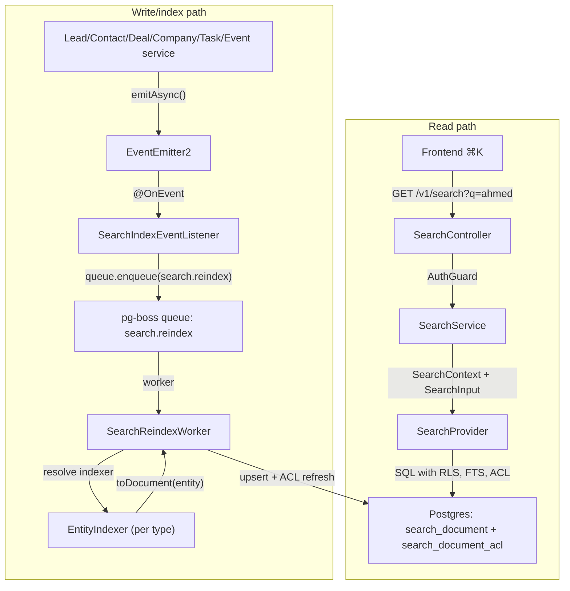
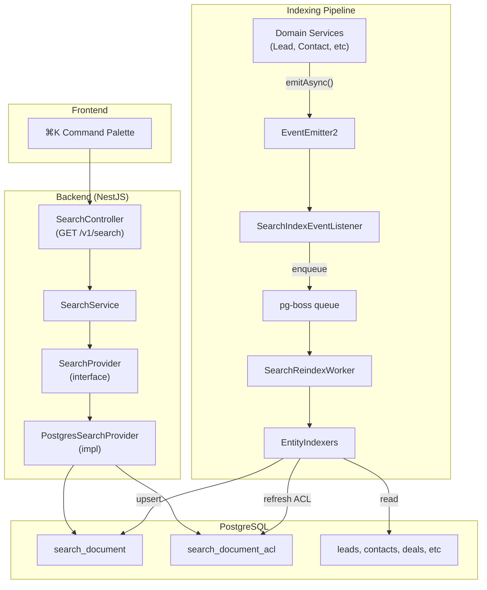

<Note>
**Version:** 0.6 (Phase 1 complete — backend + frontend ⌘K)  
**Last Updated:** May 2026  
**Status:** Phase 1 (backend read/index + frontend ⌘K) landed — Phase 1B Steps 1–12, Phase 1C Steps 1–8, Phase 1D Steps 1–6, Phase 1E Steps 1–8 (frontend palette + Playwright smoke + §10 doc sync) complete.  
**Scope (Phase 1):** Lead, Contact, Deal, Company, Task, Event  
**Owner:** Backend Platform
</Note>

This document specifies the design of a permission-aware **global search** feature for PropWise CRM. Foundation work (Steps 2–9: module scaffold, worker/maintenance handlers, `SearchProvider` interface, indexer infrastructure, `normalizeSearchText()` §6.8, `buildSearchPermissionWhereClause()` §7.3, backfill script §6.4, unit tests) is implemented under `src/modules/search/`.

## Design Summary in 5 Bullets

Read this section first. It is enough to know **what to build** before diving into §4 (per-entity field mapping) or the full specification.

<CardGroup cols={1}>
<Card title="What Ships" icon="rocket">
One tenant-scoped read endpoint — `GET /v1/search` — backed by a denormalized `search_document` table (one row per Lead, Contact, Deal, Company, Task, Event). Stakeholder-gated entities also get rows in `search_document_acl`. The frontend ⌘K palette consumes lightweight hits; full detail loads on click.
</Card>

<Card title="Two Pipelines, One Table" icon="split">
Search is **read** (sync SQL, P95 < 300ms) and **index** (async, ~2s P95 lag) decoupled. Domain services emit events → pg-boss queue `search.reindex` → `SearchReindexWorker` → per-entity `EntityIndexer.toDocument()` → upsert + ACL diff refresh. A slow indexer must not block CRM writes or search reads.
</Card>

<Card title="What You Implement" icon="code">
Migrations for `search_document` / `search_document_acl`, `SearchModule` + `PostgresSearchProvider`, the reindex worker, **`LeadIndexer` and `ContactIndexer`** in their owning CRM modules (registered via `SEARCH_INDEXERS`), event wiring in services, shared **`normalizeSearchText()`**, and E2E persona + Arabic normalization tests.
</Card>

<Card title="Permissions Are Not Optional" icon="lock">
Contact, Deal, and Company use `visibility = 'stakeholder_only'` — indexers project `(user_id, team_id, access_level)` into `search_document_acl`; the read path filters with a fast `EXISTS`. **Lead** is normally `stakeholder_only` but switches to `'org_wide'` while unassigned (zero active stakeholders → global pool), matching the always-available POOL list tab. Task and Event are always `org_wide` (no ACL rows).
</Card>

<Card title="Where to Read Next" icon="arrow-right">
**§4** — exact `title` / `subtitle` / `body` / ACL / reindex triggers per entity (read before writing any indexer).  
**§6** — queue config, worker contract, failure handling, cascades.  
**§12** — phase gates (1B = Lead + Contact only).
</Card>
</CardGroup>



## Overview & Goals

### Definition

**Global search** is a single endpoint (`GET /v1/search`) and a single frontend surface (the ⌘K command palette) that lets a user type any keyword, name, public ID, email, or phone fragment and see matching CRM records they are authorized to view, ranked by relevance and recency. It is permission-aware and tenant-scoped.

<Info>
**Backend** indexing is eventually consistent (~2s p95; longer under backlog). **Frontend** shows the creator their own just-created items immediately via client-side pins so "create → ⌘K" never feels broken.
</Info>

### Goals (Phase 1)

| # | Goal | Acceptance |
|---|------|------------|
| G1 | One endpoint covers Lead, Contact, Deal, Company, Task, Event | A single request returns hits across all six entity types in one ranked list |
| G2 | Results respect existing org RLS and per-row stakeholder ACLs | An agent searching `ahmed` never sees a lead they are not a stakeholder on (and would not see in `/v1/leads/list`) |
| G3 | Read-your-writes within ~2 seconds (indexer) + immediate creator UX | Backend: newly created/updated entity appears in `GET /v1/search` within indexer P95 lag (~2s under normal load; longer during queue backlog). **Frontend:** creator sees their own just-created items in ⌘K immediately via client-side "Just created" group — no synchronous index or source-table fallback in Phase 1 |
| G4 | Provider-swappable architecture | Swapping the Postgres provider for OpenSearch/Typesense in the future requires zero changes to controllers, services, or domain indexers |
| G5 | Phone and email substring matching for PII | Typing `+9715…` or `ahmed@` returns the matching person |
| G6 | Picker-style response shape | Lightweight hits (id, title, subtitle, entity type, permissions, score); the frontend fetches full detail on click |
| G7 | Arabic + mixed-script search (UAE market) | Typing `أحمد`, `احمد`, or `ahmed` finds the same lead when the record uses any of those forms; Arabic-Indic phone digits match Western digits |

### Non-goals (Phase 1)

<AccordionGroup>
<Accordion title="Audit Log Search">
Audit data is sensitive and lives in its own admin-only UI. See `Docs/AUDIT_LOG_SYSTEM.md`.
</Accordion>

<Accordion title="Cross-Org / Global Search for System Admins">
System admin is scoped to the **currently selected org** (i.e. `executeInOrg(orgId)`) — same as every other tenant endpoint.
</Accordion>

<Accordion title="Additional Entity Types">
User, Team, Off-plan project/unit, Conversation, Message, KnowledgeSource, Notification, Subscription, Commission Payment are reserved for Phase 2 / Phase 3.
</Accordion>

<Accordion title="Search Analytics">
Search-as-you-type analytics ("what are people searching for") is out of scope. Only operational metrics (latency, hit count) are collected.
</Accordion>

<Accordion title="Advanced Features">
Saved searches, pinned results, and alerts are reserved for Phase 2.
</Accordion>

<Accordion title="Synchronous Indexing">
Async indexer only — see §10.3.1 for creator UX without backend coupling. No server-side "query source tables on every search" fallback for the creator's just-created items.
</Accordion>
</AccordionGroup>

## Architecture

### System Boundary

<Steps>
<Step title="User initiates search">
User types in the ⌘K command palette in the frontend web app
</Step>

<Step title="Request hits API">
Frontend sends `GET /v1/search?q=ahmed` with JWT auth
</Step>

<Step title="Controller validates">
`SearchController` validates input via `SearchInputDto` (max length, sanitization)
</Step>

<Step title="Service applies context">
`SearchService` builds `SearchContext` (orgId, userId, teams, roles) from JWT claims
</Step>

<Step title="Provider executes query">
`PostgresSearchProvider` constructs SQL with FTS ranking, ACL filtering, and RLS
</Step>

<Step title="Results returned">
Lightweight hits returned to frontend for display in command palette
</Step>
</Steps>

<Warning>
The indexing pipeline is **asynchronous** and **decoupled** from the read path. Domain services emit events → queue → worker → upsert. If the queue is backlogged, indexing lag increases but search reads remain fast.
</Warning>

### Component Diagram



### Data Flow

<Tabs>
<Tab title="Read Path (Sync)">
```typescript
// 1. Frontend sends request
GET /v1/search?q=ahmed&entity_types=lead,contact&limit=20

// 2. Controller validates and extracts context
const context: SearchContext = {
  orgId: user.currentOrgId,
  userId: user.id,
  teamIds: user.teamMemberships.map(tm => tm.teamId),
  roles: user.roles
};

// 3. Service calls provider
const result = await this.searchProvider.search(context, input);

// 4. Provider builds SQL with FTS + ACL filtering
SELECT 
  document_id,
  entity_type,
  title,
  subtitle,
  ts_rank(search_vector, query) as score
FROM search_document
WHERE org_id = $1
  AND search_vector @@ query
  AND visibility_check_passes(...)
ORDER BY score DESC, updated_at DESC
LIMIT 20;
```
</Tab>

<Tab title="Index Path (Async)">
```typescript
// 1. Domain service emits event
await this.eventEmitter.emitAsync('lead.created', {
  orgId,
  entityId: lead.id,
  entityType: 'lead'
});

// 2. Listener enqueues job
@OnEvent('lead.created')
async handleLeadCreated(event: SearchIndexEvent) {
  await this.queue.enqueue('search.reindex', event);
}

// 3. Worker processes job
async processJob(job: Job<SearchIndexEvent>) {
  const indexer = this.getIndexer(job.data.entityType);
  const entity = await this.loadEntity(job.data);
  const document = await indexer.toDocument(entity);
  
  await this.searchProvider.upsertDocument(document);
  
  if (document.visibility === 'stakeholder_only') {
    await this.refreshACL(document);
  }
}
```
</Tab>
</Tabs>

### File Layout

<CodeGroup>
```plaintext Backend Structure
src/modules/search/
├── search.module.ts                    # Module definition, SEARCH_INDEXERS provider
├── controllers/
│   └── search.controller.ts            # GET /v1/search
├── services/
│   ├── search.service.ts               # Orchestrates search, builds SearchContext
│   └── search-index-event-listener.ts  # @OnEvent handlers → pg-boss
├── providers/
│   ├── search.provider.ts              # Interface (search, upsertDocument, deleteDocument)
│   └── postgres-search.provider.ts     # Postgres FTS implementation
├── workers/
│   ├── search-reindex.worker.ts        # pg-boss consumer for search.reindex queue
│   └── search-maintenance.worker.ts    # Scheduled consistency checks
├── indexers/
│   └── entity-indexer.interface.ts     # toDocument(entity) contract
├── dto/
│   ├── search-input.dto.ts             # Query validation
│   ├── search-result.dto.ts            # Response shape
│   └── search-document.dto.ts          # Internal document model
├── utils/
│   ├── normalize-search-text.ts        # Arabic normalization, Tashkeel removal
│   └── build-search-permission-where-clause.ts  # ACL SQL fragment builder
└── scripts/
    └── backfill-search-index.ts        # One-time reindex for org

src/modules/crm-lead/indexers/
└── lead.indexer.ts                     # Implements EntityIndexer for Lead

src/modules/crm-contact/indexers/
└── contact.indexer.ts                  # Implements EntityIndexer for Contact

src/modules/crm-deal/indexers/
└── deal.indexer.ts                     # Implements EntityIndexer for Deal

src/modules/crm-company/indexers/
└── company.indexer.ts                  # Implements EntityIndexer for Company

src/modules/task/indexers/
└── task.indexer.ts                     # Implements EntityIndexer for Task

src/modules/event/indexers/
└── event.indexer.ts                    # Implements EntityIndexer for Event
```

```plaintext Migrations
src/migrations/
├── 1234567890123-CreateSearchDocument.ts
└── 1234567890124-CreateSearchDocumentACL.ts
```

```plaintext Tests
src/modules/search/
├── __tests__/
│   ├── search.service.spec.ts
│   ├── postgres-search.provider.spec.ts
│   ├── normalize-search-text.spec.ts
│   └── build-search-permission-where-clause.spec.ts
└── __e2e__/
    ├── search.e2e-spec.ts              # Persona tests (agent, manager, admin)
    └── search-backfill.e2e-spec.ts     # Bulk throughput validation
```
</CodeGroup>

### Technology Choices

| Component | Choice | Rationale |
|-----------|--------|-----------|
| **Full-text search** | PostgreSQL `tsvector` + GIN index | Already in stack; sufficient for <100K docs/org; Arabic `simple` config tested in dev |
| **Queue** | pg-boss | Already used for jobs; transactional enqueue; no new infra |
| **Indexer dispatch** | `SEARCH_INDEXERS` injection token | Type-safe, testable, follows NestJS DI patterns |
| **Normalization** | `normalizeSearchText()` shared utility | Arabic Tashkeel removal, Arabic-Indic → Western digits, Unicode NFKD, lowercase, trim |
| **ACL storage** | Separate `search_document_acl` table | Avoids JSONB array in `search_document`; cleaner SQL; easier audit |

## Data Model

### `search_document` Table

<Info>
One row per searchable entity. The `search_vector` column is a PostgreSQL `tsvector` built from `title`, `subtitle`, `body`, and normalized variants.
</Info>

```sql
CREATE TABLE search_document (
  id                 UUID PRIMARY KEY DEFAULT gen_random_uuid(),
  org_id             UUID NOT NULL REFERENCES organizations(id) ON DELETE CASCADE,
  document_id        UUID NOT NULL,        -- FK to leads.id / contacts.id / etc
  entity_type        TEXT NOT NULL,        -- 'lead' | 'contact' | 'deal' | 'company' | 'task' | 'event'
  
  -- Display fields (picker payload)
  title              TEXT NOT NULL,
  subtitle           TEXT,
  
  -- Search corpus
  body               TEXT,                 -- Concatenated searchable fields (JSON serialized for complex types)
  search_vector      tsvector NOT NULL,    -- GIN indexed FTS column
  
  -- Metadata
  visibility         TEXT NOT NULL,        -- 'org_wide' | 'stakeholder_only'
  status             TEXT,                 -- Entity-specific status (e.g., 'active', 'archived')
  updated_at         TIMESTAMPTZ NOT NULL DEFAULT now(),
  indexed_at         TIMESTAMPTZ NOT NULL DEFAULT now(),
  
  CONSTRAINT search_document_org_entity_unique UNIQUE (org_id, entity_type, document_id)
);

CREATE INDEX idx_search_document_org_vector ON search_document USING GIN (org_id, search_vector);
CREATE INDEX idx_search_document_org_type_updated ON search_document (org_id, entity_type, updated_at DESC);
```

<Tip>
The `UNIQUE` constraint on `(org_id, entity_type, document_id)` allows `ON CONFLICT ... DO UPDATE` upserts from the worker.
</Tip>

### `search_document_acl` Table

<Warning>
Only created for entities with `visibility = 'stakeholder_only'`. Lead, Contact, Deal, Company populate this table. Task and Event do not.
</Warning>

```sql
CREATE TABLE search_document_acl (
  id                    UUID PRIMARY KEY DEFAULT gen_random_uuid(),
  search_document_id    UUID NOT NULL REFERENCES search_document(id) ON DELETE CASCADE,
  org_id                UUID NOT NULL REFERENCES organizations(id) ON DELETE CASCADE,
  
  -- Permission triple (user XOR team)
  user_id               UUID REFERENCES users(id) ON DELETE CASCADE,
  team_id               UUID REFERENCES teams(id) ON DELETE CASCADE,
  access_level          TEXT NOT NULL,    -- 'viewer' | 'editor' | 'owner'
  
  CONSTRAINT search_document_acl_check_user_or_team CHECK (
    (user_id IS NOT NULL AND team_id IS NULL) OR 
    (user_id IS NULL AND team_id IS NOT NULL)
  )
);

CREATE INDEX idx_search_document_acl_user ON search_document_acl (org_id, user_id) WHERE user_id IS NOT NULL;
CREATE INDEX idx_search_document_acl_team ON search_document_acl (org_id, team_id) WHERE team_id IS NOT NULL;
CREATE INDEX idx_search_document_acl_document ON search_document_acl (search_document_id);
```

### Document Shape (DTO)

```typescript
export interface SearchDocument {
  id: string;              // search_document.id (UUID)
  orgId: string;
  documentId: string;      // FK to source entity
  entityType: EntityType;  // 'lead' | 'contact' | 'deal' | 'company' | 'task' | 'event'
  
  // Display
  title: string;
  subtitle?: string;
  
  // Search corpus
  body?: string;
  searchVector?: string;   // PostgreSQL tsvector (not exposed in API)
  
  // Metadata
  visibility: 'org_wide' | 'stakeholder_only';
  status?: string;
  updatedAt: Date;
  indexedAt: Date;
}
```

## Per-Entity Field Mapping

<Note>
This section is the **authoritative source** for what goes into `title`, `subtitle`, `body`, and `search_vector` for each entity type. Read this before implementing any indexer.
</Note>

### Lead

<Steps>
<Step title="Title">
`lead.publicId` (e.g., `"L-12345"`)
</Step>

<Step title="Subtitle">
`lead.person.fullName` (e.g., `"Ahmed Al Mansoori"`)
</Step>

<Step title="Body (searchable text)">
Concatenation of:
- `lead.person.fullName` (normalized via `normalizeSearchText()`)
- `lead.person.primaryEmail?.email` (normalized)
- `lead.person.primaryPhone?.number` (normalized, Arabic-Indic → Western)
- `lead.person.emails[]` (all email addresses, normalized)
- `lead.person.phones[]` (all phone numbers, normalized)
- `lead.notes` (if non-empty, normalized)
- `lead.source` (e.g., `"website"`, normalized)

Serialized as JSON for complex arrays, then all text normalized and concatenated with space separators.
</Step>

<Step title="Visibility Logic (CRITICAL)">
**Dynamic based on stakeholder count:**
- If `lead.stakeholders.length === 0` (no active stakeholders) → `visibility = 'org_wide'` (global pool, no ACL rows)
- If `lead.stakeholders.length > 0` → `visibility = 'stakeholder_only'` (ACL rows required)

This matches the POOL tab behavior where unassigned leads are visible to all agents.
</Step>

<Step title="ACL Projection (when stakeholder_only)">
For each active stakeholder:
```typescript
{
  userId: stakeholder.userId || null,
  teamId: stakeholder.teamId || null,
  accessLevel: stakeholder.accessLevel  // 'viewer' | 'editor' | 'owner'
}
```
</Step>

<Step title="Reindex Triggers">
- `lead.created`
- `lead.updated` (any field)
- `person.updated` (when `person.id === lead.personId`)
- `lead.stakeholder.added`
- `lead.stakeholder.removed`
- `lead.stakeholder.updated` (access level change)
- `lead.deleted` → **delete from index**
</Step>
</Steps>

<Check>
**Test case:** Create unassigned lead → search by name → all agents see it. Assign stakeholder → search → only stakeholders see it.
</Check>

### Contact

<Steps>
<Step title="Title">
`contact.person.fullName` (e.g., `"Fatima Hassan"`)
</Step>

<Step title="Subtitle">
`contact.company.name` (if linked) + role (e.g., `"Emaar Properties • CEO"`)
</Step>

<Step title="Body">
- `contact.person.fullName`
- `contact.person.primaryEmail?.email`
- `contact.person.primaryPhone?.number`
- `contact.person.emails[]`
- `contact.person.phones[]`
- `contact.company.name` (if linked)
- `contact.role`
- `contact.notes`

All normalized via `normalizeSearchText()`.
</Step>

<Step title="Visibility">
Always `'stakeholder_only'` (no global pool concept for contacts).
</Step>

<Step title="ACL Projection">
Same as Lead — project all active stakeholders.
</Step>

<Step title="Reindex Triggers">
- `contact.created`
- `contact.updated`
- `person.updated` (when `person.id === contact.personId`)
- `company.updated` (when `company.id === contact.companyId`)
- `contact.stakeholder.added`
- `contact.stakeholder.removed`
- `contact.stakeholder.updated`
- `contact.deleted` → delete
</Step>
</Steps>

### Deal

<Steps>
<Step title="Title">
`deal.publicId` (e.g., `"D-98765"`)
</Step>

<Step title="Subtitle">
`deal.name` + stage (e.g., `"Palm Jumeirah Villa • Negotiation"`)
</Step>

<Step title="Body">
- `deal.name`
- `deal.publicId`
- `deal.stage`
- `deal.lead.person.fullName` (if linked)
- `deal.contact.person.fullName` (if linked)
- `deal.company.name` (if linked)
- `deal.notes`

All normalized.
</Step>

<Step title="Visibility">
Always `'stakeholder_only'`.
</Step>

<Step title="ACL Projection">
Same as Lead/Contact.
</Step>

<Step title="Reindex Triggers">
- `deal.created`
- `deal.updated`
- `deal.lead.updated` (if `deal.leadId` changes)
- `deal.contact.updated` (if `deal.contactId` changes)
- `deal.company.updated` (if `deal.companyId` changes)
- `deal.stakeholder.added`
- `deal.stakeholder.removed`
- `deal.stakeholder.updated`
- `deal.deleted` → delete
</Step>
</Steps>

### Company

<Steps>
<Step title="Title">
`company.name` (e.g., `"Emaar Properties"`)
</Step>

<Step title="Subtitle">
`company.industry` + city (e.g., `"Real Estate • Dubai"`)
</Step>

<Step title="Body">
- `company.name`
- `company.industry`
- `company.website`
- `company.address` (full address string)
- `company.notes`

All normalized.
</Step>

<Step title="Visibility">
Always `'stakeholder_only'`.
</Step>

<Step title="ACL Projection">
Same as above.
</Step>

<Step title="Reindex Triggers">
- `company.created`
- `company.updated`
- `company.stakeholder.added`
- `company.stakeholder.removed`
- `company.stakeholder.updated`
- `company.deleted` → delete
</Step>
</Steps>

### Task

<Steps>
<Step title="Title">
`task.title` (e.g., `"Call Ahmed to confirm viewing"`)
</Step>

<Step title="Subtitle">
Assigned user name + due date (e.g., `"Assigned to Sarah • Due May 15"`)
</Step>

<Step title="Body">
- `task.title`
- `task.description`
- `task.assignedTo.fullName` (if assigned)
- `task.relatedEntity.title` (if linked to Lead/Contact/Deal)

All normalized.
</Step>

<Step title="Visibility">
Always `'org_wide'` (no ACL rows created).
</Step>

<Step title="Reindex Triggers">
- `task.created`
- `task.updated`
- `task.deleted` → delete
</Step>
</Steps>

<Info>
Tasks are intentionally org-wide to support team collaboration and visibility. If a task is linked to a stakeholder-gated entity (e.g., a Deal), the user must still have access to that Deal to see its full details, but the task itself appears in search for all org members.
</Info>

### Event

<Steps>
<Step title="Title">
`event.title` (e.g., `"Property viewing at Marina Walk"`)
</Step>

<Step title="Subtitle">
Event type + start time (e.g., `"Viewing • May 15, 2:00 PM"`)
</Step>

<Step title="Body">
- `event.title`
- `event.description`
- `event.location`
- `event.participants[]` (user names)
- `event.relatedEntity.title` (if linked)

All normalized.
</Step>

<Step title="Visibility">
Always `'org_wide'`.
</Step>

<Step title="Reindex Triggers">
- `event.created`
- `event.updated`
- `event.deleted` → delete
</Step>
</Steps>

## Adding a New Entity to Search (Future Playbook)

<Note>
This section is a **playbook** for Phase 2/3 when adding User, Team, Conversation, etc. to search.
</Note>

<Steps>
<Step title="Define field mapping">
Document in §4 (this file):
- What goes in `title`, `subtitle`, `body`
- Visibility logic (`org_wide` vs `stakeholder_only`)
- ACL projection (if stakeholder-gated)
- Reindex triggers
</Step>

<Step title="Create indexer">
In the entity's owning module (e.g., `src/modules/user/indexers/user.indexer.ts`):

```typescript
@Injectable()
export class UserIndexer implements EntityIndexer<'user'> {
  entityType = 'user' as const;
  
  async toDocument(user: User): Promise<SearchDocument> {
    return {
      documentId: user.id,
      orgId: user.orgId,
      entityType: 'user',
      title: user.fullName,
      subtitle: user.email,
      body: normalizeSearchText(`${user.fullName} ${user.email} ${user.role}`),
      visibility: 'org_wide',  // or 'stakeholder_only' if applicable
      status: user.status,
      updatedAt: user.updatedAt,
      indexedAt: new Date()
    };
  }
}
```
</Step>

<Step title="Register indexer">
In the entity's module:

```typescript
@Module({
  providers: [
    UserIndexer,
    {
      provide: SEARCH_INDEXERS,
      useExisting: UserIndexer,
      multi: true
    }
  ],
  exports: [UserIndexer]
})
export class UserModule {}
```
</Step>

<Step title="Wire up events">
In `UserService`:

```typescript
async create(input: CreateUserInput): Promise<User> {
  const user = await this.repo.save(input);
  
  await this.eventEmitter.emitAsync('user.created', {
    orgId: user.orgId,
    entityId: user.id,
    entityType: 'user'
  });
  
  return user;
}
```
</Step>

<Step title="Add migrations">
Update enum constraint on `search_document.entity_type` to include `'user'`.
</Step>

<Step title="Add tests">
- Unit: `user.indexer.spec.ts`
- E2E: Add User to `search.e2e-spec.ts` persona tests
</Step>

<Step title="Update frontend">
Add User icon/badge to `CommandPalette.tsx` and detail route in `SearchResult.tsx`.
</Step>

<Step title="Backfill">
Run `backfill-search-index.ts --entity-type=user` for existing users in all orgs.
</Step>
</Steps>

## Indexing Pipeline

### Queue Configuration

<CodeGroup>
```typescript pg-boss Config
// In SearchModule
PgBossModule.registerQueue({
  name: 'search.reindex',
  options: {
    retryLimit: 3,
    retryDelay: 60,        // 1 minute
    expireInSeconds: 300,  // 5 minutes
    retentionDays: 7
  }
})
```

```typescript Worker Registration
@Processor('search.reindex')
export class SearchReindexWorker {
  @Process()
  async processJob(job: Job<SearchIndexEvent>) {
    // Implementation in §6.3
  }
}
```
</CodeGroup>

### Event Schema

```typescript
export interface SearchIndexEvent {
  orgId: string;
  entityId: string;
  entityType: EntityType;
  operation?: 'upsert' | 'delete';  // Default: 'upsert'
}

// Example emission
await this.eventEmitter.emitAsync('lead.created', {
  orgId: lead.orgId,
  entityId: lead.id,
  entityType: 'lead'
});
```

### Worker Implementation

```typescript
@Processor('search.reindex')
export class SearchReindexWorker {
  constructor(
    @Inject(SEARCH_INDEXERS) private indexers: EntityIndexer<any>[],
    private searchProvider: SearchProvider,
    private leadRepo: Repository<Lead>,
    private contactRepo: Repository<Contact>,
    // ... other repos
    private logger: Logger
  ) {}

  @Process()
  async processJob(job: Job<SearchIndexEvent>): Promise<void> {
    const { orgId, entityId, entityType, operation = 'upsert' } = job.data;
    
    if (operation === 'delete') {
      await this.searchProvider.deleteDocument(orgId, entityType, entityId);
      return;
    }
    
    // 1. Resolve indexer
    const indexer = this.indexers.find(i => i.entityType === entityType);
    if (!indexer) {
      throw new Error(`No indexer registered for ${entityType}`);
    }
    
    // 2. Load entity with relations
    const entity = await this.loadEntity(entityType, entityId, orgId);
    if (!entity) {
      this.logger.warn(`Entity ${entityType}:${entityId} not found, skipping index`);
      return;
    }
    
    // 3. Transform to document
    const document = await indexer.toDocument(entity);
    
    // 4. Upsert
    await this.searchProvider.upsertDocument(document);
    
    // 5. Refresh ACL if stakeholder-gated
    if (document.visibility === 'stakeholder_only') {
      await this.refreshACL(document, entity);
    }
  }
  
  private async loadEntity(type: EntityType, id: string, orgId: string): Promise<any> {
    switch (type) {
      case 'lead':
        return this.leadRepo.findOne({
          where: { id, orgId },
          relations: ['person', 'person.emails', 'person.phones', 'stakeholders']
        });
      case 'contact':
        return this.contactRepo.findOne({
          where: { id, orgId },
          relations: ['person', 'person.emails', 'person.phones', 'company', 'stakeholders']
        });
      // ... other cases
    }
  }
  
  private async refreshACL(document: SearchDocument, entity: any): Promise<void> {
    const searchDocId = document.id;
    
    // Delete existing ACL
    await this.searchProvider.deleteACL(searchDocId);
    
    // Insert new ACL rows
    const stakeholders = entity.stakeholders || [];
    for (const s of stakeholders) {
      await this.searchProvider.insertACL({
        searchDocumentId: searchDocId,
        orgId: document.orgId,
        userId: s.userId || null,
        teamId: s.teamId || null,
        accessLevel: s.accessLevel
      });
    }
  }
}
```

<Warning>
**Failure handling:** If `toDocument()` or `upsertDocument()` throws, pg-boss will retry up to 3 times with 1-minute delays. After exhaustion, the job moves to the failed queue. A separate maintenance worker (§6.7) will detect and re-enqueue failed jobs.
</Warning>

### Backfill Script

```typescript
// src/modules/search/scripts/backfill-search-index.ts
export async function backfillSearchIndex(options: {
  orgId?: string;          // If omitted, process all orgs
  entityType?: EntityType; // If omitted, process all types
  batchSize?: number;      // Default: 100
}) {
  const orgs = options.orgId 
    ? [await orgRepo.findOne(options.orgId)]
    : await orgRepo.find();
  
  for (const org of orgs) {
    for (const entityType of ENTITY_TYPES) {
      if (options.entityType && entityType !== options.entityType) continue;
      
      let offset = 0;
      while (true) {
        const entities = await loadBatch(entityType, org.id, offset, options.batchSize);
        if (entities.length === 0) break;
        
        for (const entity of entities) {
          await queue.enqueue('search.reindex', {
            orgId: org.id,
            entityId: entity.id,
            entityType
          });
        }
        
        offset += entities.length;
        logger.log(`Enqueued ${offset} ${entityType} for org ${org.id}`);
      }
    }
  }
}
```

<Tip>
Run via CLI: `npm run cli -- search:backfill --org-id=<uuid> --entity-type=lead`
</Tip>

### Cascade Deletes

<Steps>
<Step title="Source entity deleted">
Domain service emits `entity.deleted` event
</Step>

<Step title="Listener enqueues delete job">
```typescript
await this.queue.enqueue('search.reindex', {
  orgId,
  entityId,
  entityType,
  operation: 'delete'
});
```
</Step>

<Step title="Worker deletes document">
```typescript
await this.searchProvider.deleteDocument(orgId, entityType, entityId);
```
</Step>

<Step title="Database cascade">
`search_document_acl` rows auto-deleted via `ON DELETE CASCADE` FK
</Step>
</Steps>

<Check>
No orphan rows remain after entity deletion.
</Check>

### Person Cascade (Lead/Contact)

<Warning>
**Special case:** When `person.deleted` fires, must delete **both** associated Lead and Contact search documents (if they exist).
</Warning>

```typescript
@OnEvent('person.deleted')
async handlePersonDeleted(event: { orgId: string; personId: string }) {
  // Check for Lead
  const lead = await this.leadRepo.findOne({ 
    where: { personId: event.personId, orgId: event.orgId } 
  });
  if (lead) {
    await this.queue.enqueue('search.reindex', {
      orgId: event.orgId,
      entityId: lead.id,
      entityType: 'lead',
      operation: 'delete'
    });
  }
  
  // Check for Contact
  const contact = await this.contactRepo.findOne({ 
    where: { personId: event.personId, orgId: event.orgId } 
  });
  if (contact) {
    await this.queue.enqueue('search.reindex', {
      orgId: event.orgId,
      entityId: contact.id,
      entityType: 'contact',
      operation: 'delete'
    });
  }
}
```

### Maintenance Worker (Scheduled)

```typescript
@Cron('0 */6 * * *')  // Every 6 hours
async detectInconsistencies() {
  // 1. Find search_document rows with no source entity
  const orphans = await this.em.query(`
    SELECT sd.id, sd.entity_type, sd.document_id
    FROM search_document sd
    WHERE NOT EXISTS (
      SELECT 1 FROM leads WHERE id = sd.document_id AND sd.entity_type = 'lead'
    )
    AND NOT EXISTS (
      SELECT 1 FROM contacts WHERE id = sd.document_id AND sd.entity_type = 'contact'
    )
    -- ... repeat for all types
  `);
  
  for (const orphan of orphans) {
    await this.searchProvider.deleteDocument(orphan.entity_type, orphan.document_id);
  }
  
  // 2. Find source entities with no search_document
  const missing = await this.em.query(`
    SELECT l.id, l.org_id
    FROM leads l
    WHERE NOT EXISTS (
      SELECT 1 FROM search_document WHERE document_id = l.id AND entity_type = 'lead'
    )
  `);
  
  for (const m of missing) {
    await this.queue.enqueue('search.reindex', {
      orgId: m.org_id,
      entityId: m.id,
      entityType: 'lead'
    });
  }
}
```

### `normalizeSearchText()` Utility

```typescript
export function normalizeSearchText(input: string | null | undefined): string {
  if (!input) return '';
  
  let normalized = input;
  
  // 1. Remove Arabic Tashkeel (diacritics)
  normalized = normalized.replace(/[\u064B-\u065F\u0670]/g, '');
  
  // 2. Normalize Arabic letters
  const arabicMap: Record<string, string> = {
    'أ': 'ا', 'إ': 'ا', 'آ': 'ا',  // Alef variants → plain Alef
    'ة': 'ه',                      // Ta Marbuta → Ha
    'ى': 'ي'                       // Alef Maksura → Ya
  };
  for (const [from, to] of Object.entries(arabicMap)) {
    normalized = normalized.replace(new RegExp(from, 'g'), to);
  }
  
  // 3. Convert Arabic-Indic digits to Western
  const digitMap: Record<string, string> = {
    '٠': '0', '١': '1', '٢': '2', '٣': '3', '٤': '4',
    '٥': '5', '٦': '6', '٧': '7', '٨': '8', '٩': '9'
  };
  for (const [from, to] of Object.entries(digitMap)) {
    normalized = normalized.replace(new RegExp(from, 'g'), to);
  }
  
  // 4. Unicode NFKD decomposition + lowercase + trim
  normalized = normalized.normalize('NFKD').toLowerCase().trim();
  
  // 5. Collapse multiple spaces
  normalized = normalized.replace(/\s+/g, ' ');
  
  return normalized;
}
```

<Check>
**Test cases:**
- `normalizeSearchText('أحمد')` → `'احمد'`
- `normalizeSearchText('٠٥٥١٢٣٤٥٦٧')` → `'0551234567'`
- `normalizeSearchText('Café  Résumé')` → `'cafe resume'`
</Check>

## Permission Gate

### RLS (Row-Level Security)

All queries include `WHERE org_id = :currentOrgId`. This is enforced by `SearchService` before calling the provider.

```typescript
// SearchService.search()
if (context.orgId !== input.orgId) {
  throw new ForbiddenException('Cross-org search not allowed');
}

const results = await this.searchProvider.search(context, {
  ...input,
  orgId: context.orgId  // Force org scope
});
```

### ACL Filtering (Stakeholder-Only Entities)

<Steps>
<Step title="Build user context">
```typescript
const context: SearchContext = {
  orgId: user.currentOrgId,
  userId: user.id,
  teamIds: user.teamMemberships.map(tm => tm.teamId),
  roles: user.roles
};
```
</Step>

<Step title="Construct WHERE clause">
```typescript
function buildSearchPermissionWhereClause(context: SearchContext): string {
  // Admins bypass ACL
  if (context.roles.includes('admin')) {
    return '1=1';
  }
  
  return `
    (
      -- Org-wide entities (Task, Event, or unassigned Lead)
      sd.visibility = 'org_wide'
      
      OR
      
      -- Stakeholder-only entities where user has access
      (
        sd.visibility = 'stakeholder_only'
        AND EXISTS (
          SELECT 1 FROM search_document_acl acl
          WHERE acl.search_document_id = sd.id
            AND acl.org_id = :orgId
            AND (
              acl.user_id = :userId
              OR acl.team_id IN (:...teamIds)
            )
        )
      )
    )
  `;
}
```
</Step>

<Step title="Apply to query">
```typescript
const query = `
  SELECT 
    sd.id,
    sd.document_id,
    sd.entity_type,
    sd.title,
    sd.subtitle,
    ts_rank(sd.search_vector, query) as score
  FROM search_document sd,
       to_tsquery('simple', :tsQuery) query
  WHERE sd.org_id = :orgId
    AND sd.search_vector @@ query
    AND ${buildSearchPermissionWhereClause(context)}
  ORDER BY score DESC, sd.updated_at DESC
  LIMIT :limit;
`;
```
</Step>
</Steps>

<Warning>
**Critical:** The ACL `EXISTS` subquery must be fast. Indexes on `(org_id, user_id)` and `(org_id, team_id)` are mandatory.
</Warning>

### Admin Override

Users with `role = 'admin'` or `role = 'system_admin'` bypass ACL checks and see all `search_document` rows in their org (via the `1=1` clause in §7.3).

### Unassigned Lead Pool Visibility

```typescript
// LeadIndexer.toDocument()
const hasStakeholders = lead.stakeholders && lead.stakeholders.length > 0;

return {
  // ...
  visibility: hasStakeholders ? 'stakeholder_only' : 'org_wide',
  // ...
};

// No ACL rows created when visibility = 'org_wide'
```

<Info>
When a lead's **first** stakeholder is added, the indexer switches visibility to `'stakeholder_only'` and creates ACL rows. When the **last** stakeholder is removed, visibility switches back to `'org_wide'` and ACL rows are deleted.
</Info>

## Ranking & Query Construction

### FTS Query Builder

```typescript
function buildTsQuery(userInput: string): string {
  // 1. Normalize
  const normalized = normalizeSearchText(userInput);
  
  // 2. Tokenize
  const tokens = normalized.split(/\s+/).filter(t => t.length > 0);
  
  // 3. Build prefix query (e.g., "ahm:* & sal:*" for "ahm sal")
  const prefixTerms = tokens.map(t => `${t}:*`).join(' & ');
  
  return prefixTerms;
}

// Example:
// buildTsQuery('ahmed +971')  →  'احمد:* & 971:*'
```

<Tip>
The `:*` suffix enables **prefix matching** so "ahm" matches "ahmed", "ahmad", etc.
</Tip>

### Ranking Formula

```sql
ts_rank(
  search_document.search_vector,
  to_tsquery('simple', :tsQuery),
  1  -- normalization mode (divides rank by document length)
) as fts_score
```

Combined with recency:

```sql
ORDER BY 
  fts_score DESC,
  search_document.updated_at DESC
```

<Info>
Phase 1 uses simple FTS ranking. Phase 2 may add **entity type boosts** (e.g., Deal > Lead) or **access level boosts** (owner > viewer).
</Info>

### Exact Match Bonus (Future)

Reserved for Phase 2:

```sql
CASE 
  WHEN sd.title ILIKE :query || '%' THEN 1.5
  WHEN sd.subtitle ILIKE :query || '%' THEN 1.3
  ELSE 1.0
END * fts_score
```

## API Contract

### `GET /v1/search`

<CodeGroup>
```typescript Request DTO
export class SearchInputDto {
  @IsString()
  @Length(1, 100)
  q: string;  // Query string
  
  @IsOptional()
  @IsArray()
  @IsEnum(EntityType, { each: true })
  entity_types?: EntityType[];  // Filter by types (default: all)
  
  @IsOptional()
  @IsInt()
  @Min(1)
  @Max(100)
  limit?: number;  // Default: 20
  
  @IsOptional()
  @IsInt()
  @Min(0)
  offset?: number;  // Default: 0 (pagination)
}
```

```typescript Response DTO
export class SearchResultDto {
  id: string;              // search_document.id
  documentId: string;      // FK to source entity
  entityType: EntityType;
  
  title: string;
  subtitle?: string;
  
  score: number;           // FTS rank (0-1)
  updatedAt: string;       // ISO8601
  
  // Permission metadata (for frontend to decide if clickable)
  canView: boolean;
  canEdit: boolean;
}

export class SearchResponseDto {
  results: SearchResultDto[];
  total: number;           // Total matches (for pagination)
  took: number;            // Query time in ms
}
```

```typescript Example Request
GET /v1/search?q=ahmed+971&entity_types=lead,contact&limit=10

Authorization: Bearer <jwt>
```

```json Example Response
{
  "results": [
    {
      "id": "550e8400-e29b-41d4-a716-446655440000",
      "documentId": "123e4567-e89b-12d3-a456-426614174000",
      "entityType": "lead",
      "title": "L-12345",
      "subtitle": "Ahmed Al Mansoori",
      "score": 0.87,
      "updatedAt": "2026-05-15T14:30:00Z",
      "canView": true,
      "canEdit": true
    },
    {
      "id": "660e8400-e29b-41d4-a716-446655440001",
      "documentId": "234e4567-e89b-12d3-a456-426614174001",
      "entityType": "contact",
      "title": "Ahmed Hassan",
      "subtitle": "Emaar Properties • CEO",
      "score": 0.76,
      "updatedAt": "2026-05-14T10:15:00Z",
      "canView": true,
      "canEdit": false
    }
  ],
  "total": 2,
  "took": 45
}
```
</CodeGroup>

### Rate Limiting

<Warning>
Search endpoint is rate-limited to **30 requests/minute per user** to prevent abuse.
</Warning>

```typescript
@UseGuards(JwtAuthGuard, ThrottlerGuard)
@Throttle(30, 60)  // 30 requests per 60 seconds
@Get('search')
async search(...) { }
```

### Error Responses

| Status | Code | Reason |
|--------|------|--------|
| 400 | `INVALID_QUERY` | Query string empty or too long (>100 chars) |
| 401 | `UNAUTHORIZED` | Missing or invalid JWT |
| 403 | `FORBIDDEN` | Cross-org search attempt |
| 429 | `RATE_LIMIT_EXCEEDED` | >30 requests/minute |
| 500 | `INTERNAL_ERROR` | Database or indexer error |

## Frontend Contract

<Note>
This section specifies the **frontend integration points**. The frontend implementation lives in `propwise-crm-frontend` repo (see `Docs/FRONTEND_CMD_K_PALETTE.md` cross-doc).
</Note>

### Command Palette Component

<Steps>
<Step title="Activation">
User presses `⌘K` (Mac) or `Ctrl+K` (Windows/Linux) → `<CommandPalette>` modal opens
</Step>

<Step title="Search as you type">
User types → debounced (300ms) API call to `GET /v1/search?q=...`
</Step>

<Step title="Display results">
Grouped by entity type (Lead, Contact, Deal, etc.) with icons and badges
</Step>

<Step title="Navigation">
Arrow keys + Enter to select → navigate to entity detail page
</Step>

<Step title="Close">
`Esc` key or click outside → modal closes
</Step>
</Steps>

### Just Created Pin (Client-Side)

<Warning>
**Critical for UX:** Backend indexing is async (~2s lag). To avoid "I just created a lead but can't find it in search" confusion, the frontend **pins** the user's own just-created items at the top of search results for 10 seconds after creation.
</Warning>

```typescript
// Frontend-only logic (not in backend spec, documented here for completeness)
const justCreatedItems = useRecentlyCreated();  // Local state, 10s TTL

function mergeResults(apiResults: SearchResult[], justCreated: RecentItem[]) {
  const pinned = justCreated.filter(item => 
    item.title.toLowerCase().includes(query.toLowerCase())
  );
  
  return [
    ...pinned.map(item => ({ ...item, isPinned: true })),
    ...apiResults.filter(r => !pinned.some(p => p.id === r.documentId))
  ];
}
```

<Info>
The "Just created" items are **not** fetched from the backend on every search. They are stored in React state after `POST /v1/leads`, `POST /v1/contacts`, etc. and expire after 10 seconds.
</Info>

### Entity Type Icons

| Entity | Icon | Color |
|--------|------|-------|
| Lead | `UserPlus` | Blue |
| Contact | `User` | Green |
| Deal | `DollarSign` | Gold |
| Company | `Building` | Purple |
| Task | `CheckSquare` | Orange |
| Event | `Calendar` | Red |

### Empty States

<Tabs>
<Tab title="No Query">
Shows recent entities (fetched separately, not via search endpoint):
- Last 5 leads user viewed
- Last 5 contacts user viewed
- Pinned searches (Phase 2)
</Tab>

<Tab title="No Results">
```
No results found for "xyz"

Try:
• Checking your spelling
• Using different keywords
• Searching by email or phone number
```
</Tab>

<Tab title="Error">
```
⚠️ Search temporarily unavailable

Please try again in a moment.
```
</Tab>
</Tabs>

### Accessibility

<Check>
- `role="combobox"` on input
- `aria-expanded`, `aria-controls` for result list
- `aria-activedescendant` for keyboard navigation
- Screen reader announces result count ("5 results found")
</Check>

## `SearchProvider` Abstraction

### Interface Definition

```typescript
export interface SearchProvider {
  search(context: SearchContext, input: SearchInput): Promise<SearchResult[]>;
  
  upsertDocument(document: SearchDocument): Promise<void>;
  
  deleteDocument(orgId: string, entityType: EntityType, documentId: string): Promise<void>;
  
  deleteACL(searchDocumentId: string): Promise<void>;
  
  insertACL(acl: SearchDocumentACL): Promise<void>;
  
  // Phase 1C: Backfill helper
  reindexOrg(orgId: string, entityTypes?: EntityType[]): Promise<void>;
}
```

### PostgreSQL Implementation

```typescript
@Injectable()
export class PostgresSearchProvider implements SearchProvider {
  constructor(
    @InjectEntityManager() private em: EntityManager,
    private logger: Logger
  ) {}
  
  async search(context: SearchContext, input: SearchInput): Promise<SearchResult[]> {
    const tsQuery = buildTsQuery(input.q);
    const permissionClause = buildSearchPermissionWhereClause(context);
    
    const query = `
      SELECT 
        sd.id,
        sd.document_id,
        sd.entity_type,
        sd.title,
        sd.subtitle,
        ts_rank(sd.search_vector, query) as score,
        sd.updated_at
      FROM search_document sd,
           to_tsquery('simple', $1) query
      WHERE sd.org_id = $2
        AND sd.search_vector @@ query
        AND ${permissionClause}
      ${input.entityTypes ? `AND sd.entity_type = ANY($3)` : ''}
      ORDER BY score DESC, sd.updated_at DESC
      LIMIT $4 OFFSET $5
    `;
    
    const params = [
      tsQuery,
      context.orgId,
      input.entityTypes || null,
      input.limit || 20,
      input.offset || 0
    ].filter(p => p !== null);
    
    const rows = await this.em.query(query, params);
    
    return rows.map(r => ({
      id: r.id,
      documentId: r.document_id,
      entityType: r.entity_type,
      title: r.title,
      subtitle: r.subtitle,
      score: parseFloat(r.score),
      updatedAt: r.updated_at.toISOString(),
      canView: true,  // TODO: derive from ACL
      canEdit: false  // TODO: derive from ACL
    }));
  }
  
  async upsertDocument(document: SearchDocument): Promise<void> {
    const searchVector = this.buildSearchVector(document);
    
    await this.em.query(`
      INSERT INTO search_document (
        org_id, document_id, entity_type, title, subtitle, body, 
        search_vector, visibility, status, updated_at, indexed_at
      ) VALUES ($1, $2, $3, $4, $5, $6, to_tsvector('simple', $7), $8, $9, $10, $11)
      ON CONFLICT (org_id, entity_type, document_id) DO UPDATE SET
        title = EXCLUDED.title,
        subtitle = EXCLUDED.subtitle,
        body = EXCLUDED.body,
        search_vector = EXCLUDED.search_vector,
        visibility = EXCLUDED.visibility,
        status = EXCLUDED.status,
        updated_at = EXCLUDED.updated_at,
        indexed_at = EXCLUDED.indexed_at
    `, [
      document.orgId,
      document.documentId,
      document.entityType,
      document.title,
      document.subtitle,
      document.body,
      searchVector,  // Plain text passed to to_tsvector()
      document.visibility,
      document.status,
      document.updatedAt,
      document.indexedAt
    ]);
  }
  
  async deleteDocument(orgId: string, entityType: EntityType, documentId: string): Promise<void> {
    await this.em.query(`
      DELETE FROM search_document
      WHERE org_id = $1 AND entity_type = $2 AND document_id = $3
    `, [orgId, entityType, documentId]);
    
    // ACL rows cascade-deleted via FK
  }
  
  async deleteACL(searchDocumentId: string): Promise<void> {
    await this.em.query(`
      DELETE FROM search_document_acl WHERE search_document_id = $1
    `, [searchDocumentId]);
  }
  
  async insertACL(acl: SearchDocumentACL): Promise<void> {
    await this.em.query(`
      INSERT INTO search_document_acl (search_document_id, org_id, user_id, team_id, access_level)
      VALUES ($1, $2, $3, $4, $5)
    `, [acl.searchDocumentId, acl.orgId, acl.userId, acl.teamId, acl.accessLevel]);
  }
  
  private buildSearchVector(document: SearchDocument): string {
    // Concatenate title, subtitle, body with spaces
    const parts = [
      document.title,
      document.subtitle,
      document.body
    ].filter(Boolean);
    
    return normalizeSearchText(parts.join(' '));
  }
}
```

### Future: OpenSearch Provider

```typescript
@Injectable()
export class OpenSearchProvider implements SearchProvider {
  constructor(private client: Client) {}
  
  async search(context: SearchContext, input: SearchInput): Promise<SearchResult[]> {
    const response = await this.client.search({
      index: `search-${context.orgId}`,
      body: {
        query: {
          bool: {
            must: [
              { multi_match: { query: input.q, fields: ['title^3', 'subtitle^2', 'body'] } }
            ],
            filter: [
              { term: { visibility: 'org_wide' } },
              // OR ACL filter
            ]
          }
        }
      }
    });
    
    return response.hits.hits.map(hit => ({
      id: hit._id,
      documentId: hit._source.documentId,
      entityType: hit._source.entityType,
      title: hit._source.title,
      subtitle: hit._source.subtitle,
      score: hit._score,
      updatedAt: hit._source.updatedAt,
      canView: true,
      canEdit: false
    }));
  }
  
  // ... other methods
}
```

<Info>
Swapping providers is as simple as changing the binding in `SearchModule`:

```typescript
{
  provide: SearchProvider,
  useClass: OpenSearchProvider  // or PostgresSearchProvider
}
```
</Info>

## Phased Rollout

### Phase 1A: Foundation (Complete)

<Check>
**Status:** Landed

- Module scaffold (`SearchModule`, `SearchController`, `SearchService`)
- `SearchProvider` interface
- Migrations for `search_document` and `search_document_acl`
- `normalizeSearchText()` utility (§6.8)
- `buildSearchPermissionWhereClause()` utility (§7.3)
- Backfill script skeleton (§6.4)
- Unit tests for utilities
</Check>

### Phase 1B: Lead + Contact (Complete)

<Check>
**Status:** Landed

Steps:
1. `LeadIndexer` in `src/modules/crm-lead/indexers/`
2. `ContactIndexer` in `src/modules/crm-contact/indexers/`
3. Register indexers via `SEARCH_INDEXERS` token
4. Event wiring in `LeadService` and `ContactService`
5. `PersonService` event wiring (affects both Lead and Contact)
6. `EntityStakeholderService` event wiring
7. `SearchReindexWorker` implementation
8. `PostgresSearchProvider` implementation
9. E2E persona tests (agent, manager, admin) for Lead and Contact
10. E2E Arabic normalization test (see §13.3)
11. Run backfill script for all orgs (Lead + Contact only)
12. Deploy to staging → smoke test → prod

**Acceptance:**
- Agent searches `ahmed` → sees only leads/contacts they are stakeholder on
- Admin searches `ahmed` → sees all leads/contacts in org
- Typing `أحمد` finds leads with name `ahmed` (normalized match)
- P95 latency < 300ms for search reads
- P95 lag < 2s for indexer (normal load)
</Check>

### Phase 1C: Deal + Company (Complete)

<Check>
**Status:** Landed

Steps:
1. `DealIndexer` in `src/modules/crm-deal/indexers/`
2. `CompanyIndexer` in `