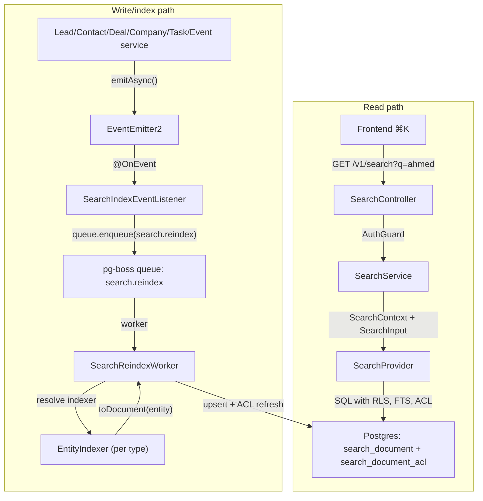
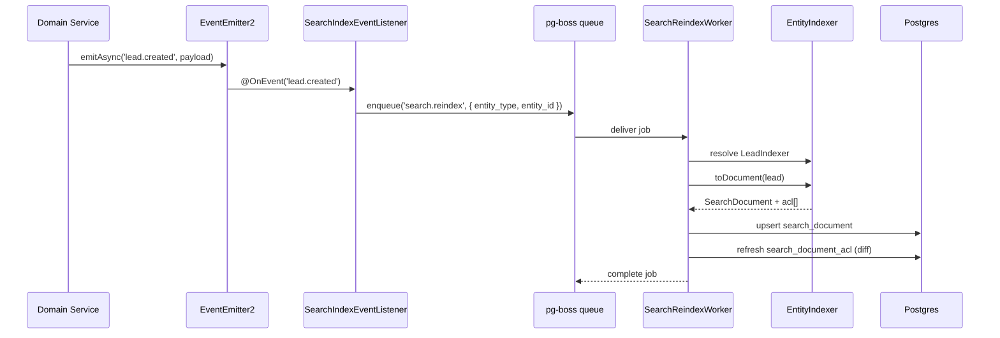

<Note>
**Version:** 0.6 (Phase 1 complete — backend + frontend ⌘K)  
**Last Updated:** May 2026  
**Status:** Phase 1 (backend read/index + frontend ⌘K) landed — Phase 1B Steps 1–12, Phase 1C Steps 1–8, Phase 1D Steps 1–6, Phase 1E Steps 1–8 (frontend palette + Playwright smoke + §10 doc sync). **Remaining backend-only gaps:** `PostgresSearchProvider.reindexOrg()` (backfill orchestration helper) and §13.2 `search-backfill.e2e-spec.ts`.  
**Scope (Phase 1):** Lead, Contact, Deal, Company, Task, Event  
**Owner:** Backend Platform
</Note>

This document specifies the design of a permission-aware **global search** feature for PropWise CRM. Foundation work (Steps 2–9: module scaffold, worker/maintenance handlers, `SearchProvider` interface, indexer infrastructure, `normalizeSearchText()` §6.8, `buildSearchPermissionWhereClause()` §7.3, backfill script §6.4, unit tests) is implemented under `src/modules/search/`. **Phase 1B–1D** backend indexer/read paths and cross-doc sync are landed. **Phase 1E** frontend ⌘K palette is landed in `propwise-crm-frontend` (§10).

---

## Design Summary in 5 Bullets

<Info>
Read this section first. It is enough to know **what to build** before diving into §4 (per-entity field mapping) or the full specification.
</Info>

1. **What ships:** One tenant-scoped read endpoint — `GET /v1/search` — backed by a denormalized `search_document` table (one row per Lead, Contact, Deal, Company, Task, Event). Stakeholder-gated entities also get rows in `search_document_acl`. The frontend ⌘K palette consumes lightweight hits; full detail loads on click (§9–§10).

2. **Two pipelines, one table:** Search is **read** (sync SQL, P95 < 300ms) and **index** (async, ~2s P95 lag) decoupled. Domain services emit events → pg-boss queue `search.reindex` → `SearchReindexWorker` → per-entity `EntityIndexer.toDocument()` → upsert + ACL diff refresh. A slow indexer must not block CRM writes or search reads. See diagram below.

3. **What you implement (Phase 1B slice):** Migrations for `search_document` / `search_document_acl`, `SearchModule` + `PostgresSearchProvider`, the reindex worker, **`LeadIndexer` and `ContactIndexer`** in their owning CRM modules (registered via `SEARCH_INDEXERS`), event wiring in `LeadService` / `ContactService` / `PersonService` / `EntityStakeholderService`, shared **`normalizeSearchText()`** (§6.8), and E2E persona + Arabic normalization tests (§12, §13). File layout: §2.5.

4. **Permissions are not optional:** Contact, Deal, and Company use `visibility = 'stakeholder_only'` — indexers project `(user_id, team_id, access_level)` into `search_document_acl`; the read path filters with a fast `EXISTS` (§7). **Lead** is normally `stakeholder_only` but switches to `'org_wide'` while it is **unassigned** (zero active stakeholders → global pool), matching the always-available POOL list tab (§4.1). Task and Event are always `org_wide` (no ACL rows). If search returns a row the user cannot open in list view, the feature is broken.

5. **Where to read next:** **§4** — exact `title` / `subtitle` / `body` / ACL / reindex triggers per entity (read before writing any indexer). **§6** — queue config, worker contract, failure handling, cascades. **§12** — phase gates (1B = Lead + Contact only). Skip the rest until your slice needs it.



---

## 1. Overview & Goals

### 1.1 Definition

**Global search** is a single endpoint (`GET /v1/search`) and a single frontend surface (the ⌘K command palette) that lets a user type any keyword, name, public ID, email, or phone fragment and see matching CRM records they are authorized to view, ranked by relevance and recency. It is permission-aware and tenant-scoped. **Backend** indexing is eventually consistent (~2s p95; longer under backlog). **Frontend** shows the creator their own just-created items immediately via client-side pins (§10.3.1) so "create → ⌘K" never feels broken.

### 1.2 Goals (Phase 1)

<AccordionGroup>
<Accordion title="G1: One endpoint covers Lead, Contact, Deal, Company, Task, Event">
A single request returns hits across all six entity types in one ranked list
</Accordion>

<Accordion title="G2: Results respect existing org RLS and per-row stakeholder ACLs">
An agent searching `ahmed` never sees a lead they are not a stakeholder on (and would not see in `/v1/leads/list`)
</Accordion>

<Accordion title="G3: Read-your-writes within ~2 seconds (indexer) + immediate creator UX">
Backend: newly created/updated entity appears in `GET /v1/search` within indexer P95 lag (~2s under normal load; longer during queue backlog per §13.4). **Frontend:** creator sees their own just-created items in ⌘K immediately via client-side "Just created" group (§10.3.1) — no synchronous index or source-table fallback in Phase 1
</Accordion>

<Accordion title="G4: Provider-swappable architecture">
Swapping the Postgres provider for OpenSearch/Typesense in the future requires zero changes to controllers, services, or domain indexers
</Accordion>

<Accordion title="G5: Phone and email substring matching for PII">
Typing `+9715…` or `ahmed@` returns the matching person
</Accordion>

<Accordion title="G6: Picker-style response shape">
Lightweight hits (id, title, subtitle, entity type, permissions, score); the frontend fetches full detail on click
</Accordion>

<Accordion title="G7: Arabic + mixed-script search (UAE market)">
Typing `أحمد`, `احمد`, or `ahmed` finds the same lead when the record uses any of those forms; Arabic-Indic phone digits match Western digits
</Accordion>
</AccordionGroup>

### 1.3 Non-goals (Phase 1)

<Warning>
The following features are explicitly out of scope for Phase 1:
</Warning>

- **Searching the audit log** (`audit_log` table) — Audit data is sensitive and lives in its own admin-only UI. See `Docs/AUDIT_LOG_SYSTEM.md`.
- **Cross-org / global search for system admins** — System admin is scoped to the **currently selected org** (i.e. `executeInOrg(orgId)`) — same as every other tenant endpoint.
- **User, Team, Off-plan project/unit, Conversation, Message, KnowledgeSource, Notification, Subscription, Commission Payment** — Reserved for Phase 2 / Phase 3.
- **Search-as-you-type analytics** ("what are people searching for") — Out of scope. Only operational metrics (latency, hit count) are collected.
- **Saved searches / pinned results / alerts** — Phase 2.
- **Synchronous search index on create** (blocking CRM write) — Async indexer only — see §10.3.1 for creator UX without backend coupling.
- **Server-side "query source tables on every search" fallback** for the creator — Client-side "Just created" section only (§10.3.1).

---

## 2. Architecture

### 2.1 High-level Flow

<Steps>
<Step title="User types in ⌘K palette">
Frontend sends `GET /v1/search?q=ahmed&limit=50`
</Step>

<Step title="SearchController validates request">
Extracts tenant context via `@CurrentTenant()` and user via `@CurrentUser()`
</Step>

<Step title="SearchService builds SearchContext">
Constructs `SearchContext` with org_id, user_id, team_ids, role
</Step>

<Step title="PostgresSearchProvider executes SQL">
Runs SQL with:
- RLS filter (`org_id = ?`)
- Full-text search against normalized fields
- Permission check via `buildSearchPermissionWhereClause()` (§7.3)
- Ranking by score + recency
</Step>

<Step title="Return lightweight hits">
Returns `SearchHit[]` with id, title, subtitle, entity_type, permissions, score
</Step>
</Steps>

### 2.2 Index Pipeline (Canonical Diagram)



<Info>
The index pipeline is **asynchronous** and **eventually consistent**. A slow indexer must not block CRM writes or search reads.
</Info>

### 2.3 Permission Model

<CardGroup cols={2}>
<Card title="Org-wide entities" icon="globe">
**Task, Event**

No ACL rows. All org members can search.
</Card>

<Card title="Stakeholder-gated entities" icon="lock">
**Contact, Deal, Company**

Always `stakeholder_only`. ACL rows required.
</Card>

<Card title="Hybrid entity" icon="users">
**Lead**

`stakeholder_only` when assigned. Switches to `org_wide` when unassigned (zero active stakeholders → global pool).
</Card>
</CardGroup>

### 2.4 Indexer Registration

Each CRM module registers its indexer via `SEARCH_INDEXERS` token:

```typescript
// src/modules/lead/lead.module.ts
@Module({
  providers: [
    LeadService,
    LeadIndexer,
    {
      provide: SEARCH_INDEXERS,
      useExisting: LeadIndexer,
      multi: true,
    },
  ],
})
export class LeadModule {}
```

### 2.5 File Layout

<CodeGroup>
```bash Search Module Structure
src/modules/search/
├── search.module.ts                  # SearchModule + exports
├── search.controller.ts              # GET /v1/search endpoint
├── search.service.ts                 # Orchestrator (calls provider)
├── providers/
│   ├── search-provider.interface.ts  # SearchProvider abstraction
│   └── postgres/
│       ├── postgres-search.provider.ts
│       └── postgres-search.provider.spec.ts
├── workers/
│   ├── search-reindex.worker.ts      # pg-boss consumer
│   └── search-reindex.worker.spec.ts
├── listeners/
│   ├── search-index-event.listener.ts
│   └── search-index-event.listener.spec.ts
├── indexers/
│   ├── entity-indexer.interface.ts   # Base interface
│   └── README.md                     # "Indexers live in domain modules"
├── utils/
│   ├── normalize-search-text.ts      # §6.8 Arabic/diacritic normalizer
│   ├── normalize-search-text.spec.ts
│   ├── build-search-permission-where-clause.ts  # §7.3
│   └── build-search-permission-where-clause.spec.ts
├── scripts/
│   └── backfill-search-index.ts      # §6.4 backfill script
└── dto/
    ├── search-input.dto.ts
    ├── search-hit.dto.ts
    └── search-context.dto.ts
```

```bash Domain Module Indexers
src/modules/lead/
└── indexers/
    ├── lead.indexer.ts
    └── lead.indexer.spec.ts

src/modules/contact/
└── indexers/
    ├── contact.indexer.ts
    └── contact.indexer.spec.ts

src/modules/deal/
└── indexers/
    ├── deal.indexer.ts
    └── deal.indexer.spec.ts
```
</CodeGroup>

---

## 3. Data Model

### 3.1 `search_document` Table

<Info>
One row per searchable entity (Lead, Contact, Deal, Company, Task, Event). Uses GIN indexes for full-text search and jsonb queries.
</Info>

```sql
CREATE TABLE search_document (
  id UUID PRIMARY KEY DEFAULT gen_random_uuid(),
  org_id UUID NOT NULL REFERENCES organization(id) ON DELETE CASCADE,
  
  entity_type TEXT NOT NULL CHECK (entity_type IN ('lead', 'contact', 'deal', 'company', 'task', 'event')),
  entity_id UUID NOT NULL,
  
  -- Display fields (lightweight for picker)
  title TEXT NOT NULL,              -- e.g., "Ahmed Al Mansoori"
  subtitle TEXT,                    -- e.g., "Lead · +971 50 123 4567"
  entity_metadata JSONB,            -- Minimal fields for frontend display
  
  -- Search corpus (normalized, concatenated)
  search_text_normalized TEXT NOT NULL,  -- Lowercased, Arabic-normalized, diacritic-removed
  
  -- Ranking signals
  relevance_score REAL DEFAULT 0.0,
  last_activity_at TIMESTAMP WITH TIME ZONE,
  created_at TIMESTAMP WITH TIME ZONE DEFAULT NOW(),
  indexed_at TIMESTAMP WITH TIME ZONE DEFAULT NOW(),
  
  -- Permission hint
  visibility TEXT NOT NULL CHECK (visibility IN ('org_wide', 'stakeholder_only')),
  
  UNIQUE (org_id, entity_type, entity_id)
);

CREATE INDEX idx_search_document_org_entity ON search_document(org_id, entity_type);
CREATE INDEX idx_search_document_fts ON search_document USING GIN (to_tsvector('english', search_text_normalized));
CREATE INDEX idx_search_document_metadata ON search_document USING GIN (entity_metadata);
CREATE INDEX idx_search_document_activity ON search_document(org_id, last_activity_at DESC) WHERE last_activity_at IS NOT NULL;
```

### 3.2 `search_document_acl` Table

<Warning>
Only populated for `visibility = 'stakeholder_only'` entities (Contact, Deal, Company, assigned Lead). Empty for Task/Event/unassigned Lead.
</Warning>

```sql
CREATE TABLE search_document_acl (
  id UUID PRIMARY KEY DEFAULT gen_random_uuid(),
  search_document_id UUID NOT NULL REFERENCES search_document(id) ON DELETE CASCADE,
  
  user_id UUID REFERENCES "user"(id) ON DELETE CASCADE,
  team_id UUID REFERENCES team(id) ON DELETE CASCADE,
  access_level TEXT NOT NULL CHECK (access_level IN ('viewer', 'editor', 'admin')),
  
  CHECK ((user_id IS NOT NULL AND team_id IS NULL) OR (user_id IS NULL AND team_id IS NOT NULL))
);

CREATE INDEX idx_search_acl_document ON search_document_acl(search_document_id);
CREATE INDEX idx_search_acl_user ON search_document_acl(user_id) WHERE user_id IS NOT NULL;
CREATE INDEX idx_search_acl_team ON search_document_acl(team_id) WHERE team_id IS NOT NULL;
```

<Tip>
The ACL table uses a `CHECK` constraint to ensure each row grants access to **either** a user **or** a team, never both.
</Tip>

### 3.3 Visibility Rules Summary

| Entity  | Visibility Logic                                                    | ACL Rows                              |
| ------- | ------------------------------------------------------------------- | ------------------------------------- |
| Lead    | `stakeholder_only` if assigned; `org_wide` if unassigned (zero ACL) | Only when assigned                    |
| Contact | Always `stakeholder_only`                                           | Always                                |
| Deal    | Always `stakeholder_only`                                           | Always                                |
| Company | Always `stakeholder_only`                                           | Always                                |
| Task    | Always `org_wide`                                                   | Never                                 |
| Event   | Always `org_wide`                                                   | Never                                 |

---

## 4. Per-Entity Field Mapping

<Note>
This section is the **source of truth** for what each indexer must implement. Read this before writing any `EntityIndexer.toDocument()` method.
</Note>

### 4.1 Lead

<Tabs>
<Tab title="Display Fields">
```typescript
{
  title: `${lead.firstName} ${lead.lastName}`.trim() || lead.email || lead.phone || lead.publicId,
  subtitle: `Lead · ${lead.phone || lead.email || ''}`,
  entity_metadata: {
    publicId: lead.publicId,
    status: lead.status,
    source: lead.source,
    assignedTo: lead.assignedTo?.name,
    createdBy: lead.createdBy?.name,
  }
}
```
</Tab>

<Tab title="Search Corpus">
```typescript
const parts = [
  lead.publicId,
  lead.firstName,
  lead.lastName,
  lead.email,
  lead.phone,
  lead.companyName,
  lead.jobTitle,
  lead.notes,
  lead.assignedTo?.name,
];
search_text_normalized = normalizeSearchText(parts.filter(Boolean).join(' '));
```
</Tab>

<Tab title="Visibility Logic">
```typescript
// Lead is org_wide when unassigned (zero active stakeholders)
const activeStakeholders = await this.stakeholderService.findActiveStakeholders({
  entityType: 'lead',
  entityId: lead.id,
});

if (activeStakeholders.length === 0) {
  visibility = 'org_wide';
  acl = []; // No ACL rows
} else {
  visibility = 'stakeholder_only';
  acl = activeStakeholders.map(s => ({
    userId: s.type === 'user' ? s.typeId : null,
    teamId: s.type === 'team' ? s.typeId : null,
    accessLevel: s.accessLevel,
  }));
}
```
</Tab>

<Tab title="Reindex Triggers">
<Steps>
<Step title="Lead events">
- `lead.created`
- `lead.updated`
- `lead.deleted`
</Step>

<Step title="Person events (for email/phone changes)">
- `person.updated` (if affects lead's contact info)
</Step>

<Step title="Stakeholder events">
- `stakeholder.created` (lead may switch from org_wide → stakeholder_only)
- `stakeholder.updated` (access_level change)
- `stakeholder.deleted` (if last stakeholder removed → org_wide)
</Step>

<Step title="User/Team events">
- `user.updated` (name change affects assignedTo in metadata)
- `team.updated` (name change affects team stakeholder display)
</Step>
</Steps>
</Tab>
</Tabs>

### 4.2 Contact

<Tabs>
<Tab title="Display Fields">
```typescript
{
  title: `${contact.firstName} ${contact.lastName}`.trim() || contact.email || contact.phone || contact.publicId,
  subtitle: `Contact · ${contact.phone || contact.email || ''}`,
  entity_metadata: {
    publicId: contact.publicId,
    companyName: contact.company?.name,
    jobTitle: contact.jobTitle,
    assignedTo: contact.assignedTo?.name,
    createdBy: contact.createdBy?.name,
  }
}
```
</Tab>

<Tab title="Search Corpus">
```typescript
const parts = [
  contact.publicId,
  contact.firstName,
  contact.lastName,
  contact.email,
  contact.phone,
  contact.company?.name,
  contact.jobTitle,
  contact.notes,
  contact.assignedTo?.name,
];
search_text_normalized = normalizeSearchText(parts.filter(Boolean).join(' '));
```
</Tab>

<Tab title="Visibility Logic">
```typescript
// Contact is always stakeholder_only
visibility = 'stakeholder_only';
acl = await this.stakeholderService.findActiveStakeholders({
  entityType: 'contact',
  entityId: contact.id,
}).map(s => ({
  userId: s.type === 'user' ? s.typeId : null,
  teamId: s.type === 'team' ? s.typeId : null,
  accessLevel: s.accessLevel,
}));
```
</Tab>

<Tab title="Reindex Triggers">
<Steps>
<Step title="Contact events">
- `contact.created`
- `contact.updated`
- `contact.deleted`
</Step>

<Step title="Company events">
- `company.updated` (name change)
</Step>

<Step title="Person events">
- `person.updated` (email/phone change)
</Step>

<Step title="Stakeholder events">
- `stakeholder.created`
- `stakeholder.updated`
- `stakeholder.deleted`
</Step>
</Steps>
</Tab>
</Tabs>

### 4.3 Deal

<Tabs>
<Tab title="Display Fields">
```typescript
{
  title: deal.title || `Deal ${deal.publicId}`,
  subtitle: `Deal · ${formatCurrency(deal.value)} · ${deal.stage}`,
  entity_metadata: {
    publicId: deal.publicId,
    value: deal.value,
    currency: deal.currency,
    stage: deal.stage,
    probability: deal.probability,
    expectedCloseDate: deal.expectedCloseDate,
    contactName: deal.contact?.name,
    companyName: deal.company?.name,
    assignedTo: deal.assignedTo?.name,
  }
}
```
</Tab>

<Tab title="Search Corpus">
```typescript
const parts = [
  deal.publicId,
  deal.title,
  deal.description,
  deal.contact?.name,
  deal.company?.name,
  deal.assignedTo?.name,
  deal.stage,
];
search_text_normalized = normalizeSearchText(parts.filter(Boolean).join(' '));
```
</Tab>

<Tab title="Visibility Logic">
```typescript
// Deal is always stakeholder_only
visibility = 'stakeholder_only';
acl = await this.stakeholderService.findActiveStakeholders({
  entityType: 'deal',
  entityId: deal.id,
}).map(s => ({
  userId: s.type === 'user' ? s.typeId : null,
  teamId: s.type === 'team' ? s.typeId : null,
  accessLevel: s.accessLevel,
}));
```
</Tab>

<Tab title="Reindex Triggers">
<Steps>
<Step title="Deal events">
- `deal.created`
- `deal.updated`
- `deal.deleted`
</Step>

<Step title="Contact/Company events">
- `contact.updated` (name change)
- `company.updated` (name change)
</Step>

<Step title="Stakeholder events">
- `stakeholder.created`
- `stakeholder.updated`
- `stakeholder.deleted`
</Step>
</Steps>
</Tab>
</Tabs>

### 4.4 Company

<Tabs>
<Tab title="Display Fields">
```typescript
{
  title: company.name || company.publicId,
  subtitle: `Company · ${company.industry || ''} · ${company.city || ''}`,
  entity_metadata: {
    publicId: company.publicId,
    industry: company.industry,
    website: company.website,
    phone: company.phone,
    city: company.city,
    country: company.country,
    assignedTo: company.assignedTo?.name,
  }
}
```
</Tab>

<Tab title="Search Corpus">
```typescript
const parts = [
  company.publicId,
  company.name,
  company.industry,
  company.website,
  company.phone,
  company.address,
  company.city,
  company.country,
  company.notes,
  company.assignedTo?.name,
];
search_text_normalized = normalizeSearchText(parts.filter(Boolean).join(' '));
```
</Tab>

<Tab title="Visibility Logic">
```typescript
// Company is always stakeholder_only
visibility = 'stakeholder_only';
acl = await this.stakeholderService.findActiveStakeholders({
  entityType: 'company',
  entityId: company.id,
}).map(s => ({
  userId: s.type === 'user' ? s.typeId : null,
  teamId: s.type === 'team' ? s.typeId : null,
  accessLevel: s.accessLevel,
}));
```
</Tab>

<Tab title="Reindex Triggers">
<Steps>
<Step title="Company events">
- `company.created`
- `company.updated`
- `company.deleted`
</Step>

<Step title="Stakeholder events">
- `stakeholder.created`
- `stakeholder.updated`
- `stakeholder.deleted`
</Step>
</Steps>
</Tab>
</Tabs>

### 4.5 Task

<Tabs>
<Tab title="Display Fields">
```typescript
{
  title: task.title || `Task ${task.publicId}`,
  subtitle: `Task · ${task.status} · Due ${formatDate(task.dueDate)}`,
  entity_metadata: {
    publicId: task.publicId,
    status: task.status,
    priority: task.priority,
    dueDate: task.dueDate,
    assignedTo: task.assignedTo?.name,
    relatedEntity: task.relatedEntityType ? `${task.relatedEntityType} ${task.relatedEntityId}` : null,
  }
}
```
</Tab>

<Tab title="Search Corpus">
```typescript
const parts = [
  task.publicId,
  task.title,
  task.description,
  task.assignedTo?.name,
  task.createdBy?.name,
];
search_text_normalized = normalizeSearchText(parts.filter(Boolean).join(' '));
```
</Tab>

<Tab title="Visibility Logic">
```typescript
// Task is always org_wide
visibility = 'org_wide';
acl = []; // No ACL rows
```
</Tab>

<Tab title="Reindex Triggers">
<Steps>
<Step title="Task events">
- `task.created`
- `task.updated`
- `task.deleted`
</Step>

<Step title="User events">
- `user.updated` (name change affects assignedTo)
</Step>
</Steps>
</Tab>
</Tabs>

### 4.6 Event

<Tabs>
<Tab title="Display Fields">
```typescript
{
  title: event.title || `Event ${event.publicId}`,
  subtitle: `Event · ${formatDateTime(event.startTime)} · ${event.location || ''}`,
  entity_metadata: {
    publicId: event.publicId,
    eventType: event.eventType,
    startTime: event.startTime,
    endTime: event.endTime,
    location: event.location,
    attendees: event.attendees?.map(a => a.name),
    organizer: event.organizer?.name,
  }
}
```
</Tab>

<Tab title="Search Corpus">
```typescript
const parts = [
  event.publicId,
  event.title,
  event.description,
  event.location,
  event.organizer?.name,
  ...(event.attendees?.map(a => a.name) || []),
];
search_text_normalized = normalizeSearchText(parts.filter(Boolean).join(' '));
```
</Tab>

<Tab title="Visibility Logic">
```typescript
// Event is always org_wide
visibility = 'org_wide';
acl = []; // No ACL rows
```
</Tab>

<Tab title="Reindex Triggers">
<Steps>
<Step title="Event events">
- `event.created`
- `event.updated`
- `event.deleted`
</Step>

<Step title="User events">
- `user.updated` (name change affects organizer/attendees)
</Step>
</Steps>
</Tab>
</Tabs>

---

## 5. Adding a New Entity to Search (Future Playbook)

<Steps>
<Step title="Create indexer class">
```typescript
// src/modules/my-entity/indexers/my-entity.indexer.ts
@Injectable()
export class MyEntityIndexer implements EntityIndexer<MyEntity> {
  entityType = 'my_entity' as const;
  
  async toDocument(entity: MyEntity): Promise<{ doc: SearchDocument; acl: SearchACLEntry[] }> {
    // Implement field mapping per §4
  }
}
```
</Step>

<Step title="Register indexer in module">
```typescript
@Module({
  providers: [
    MyEntityIndexer,
    {
      provide: SEARCH_INDEXERS,
      useExisting: MyEntityIndexer,
      multi: true,
    },
  ],
})
export class MyEntityModule {}
```
</Step>

<Step title="Wire domain events">
```typescript
// In MyEntityService
async create(input: CreateMyEntityInput): Promise<MyEntity> {
  const entity = await this.repo.save(input);
  await this.eventEmitter.emitAsync('my_entity.created', { entityId: entity.id });
  return entity;
}
```
</Step>

<Step title="Update search_document CHECK constraint">
```sql
ALTER TABLE search_document DROP CONSTRAINT IF EXISTS search_document_entity_type_check;
ALTER TABLE search_document ADD CONSTRAINT search_document_entity_type_check 
  CHECK (entity_type IN ('lead', 'contact', 'deal', 'company', 'task', 'event', 'my_entity'));
```
</Step>

<Step title="Add E2E tests">
Create `my-entity-search.e2e-spec.ts` with persona + permission coverage (§13.1)
</Step>

<Step title="Update cross-docs">
Add row to §16 tracking table for each affected doc
</Step>
</Steps>

---

## 6. Indexing Pipeline

### 6.1 Queue Configuration

<CodeGroup>
```typescript Queue Definition
// src/modules/search/search.constants.ts
export const SEARCH_REINDEX_QUEUE = 'search.reindex';

export interface SearchReindexJob {
  entityType: string;
  entityId: string;
  orgId: string;
}
```

```typescript Worker Registration
// src/modules/search/workers/search-reindex.worker.ts
@Injectable()
@Processor(SEARCH_REINDEX_QUEUE)
export class SearchReindexWorker {
  @Process({ concurrency: 10 })
  async handleReindex(job: Job<SearchReindexJob>) {
    const { entityType, entityId, orgId } = job.data;
    
    await this.tenantService.executeInOrg(orgId, async () => {
      const indexer = this.resolveIndexer(entityType);
      const entity = await indexer.loadEntity(entityId);
      
      if (!entity) {
        await this.searchService.deleteDocument(entityType, entityId);
        return;
      }
      
      const { doc, acl } = await indexer.toDocument(entity);
      await this.searchService.upsertDocument(doc, acl);
    });
  }
}
```
</CodeGroup>

<Warning>
**Concurrency:** 10 workers per pod. Under sustained backlog (>1000 jobs), expect P95 lag to grow from ~2s to 10–30s. See §13.4 bulk throughput gate.
</Warning>

### 6.2 Event Listener

```typescript
// src/modules/search/listeners/search-index-event.listener.ts
@Injectable()
export class SearchIndexEventListener {
  constructor(
    @Inject(SEARCH_REINDEX_QUEUE) private readonly queue: Queue<SearchReindexJob>,
    private readonly tenantService: TenantService,
  ) {}

  @OnEvent('lead.created')
  @OnEvent('lead.updated')
  async handleLeadEvent(payload: { entityId: string }) {
    await this.enqueueReindex('lead', payload.entityId);
  }

  @OnEvent('lead.deleted')
  async handleLeadDeleted(payload: { entityId: string }) {
    // Worker will call searchService.deleteDocument()
    await this.enqueueReindex('lead', payload.entityId);
  }

  private async enqueueReindex(entityType: string, entityId: string) {
    const orgId = this.tenantService.getCurrentOrgId();
    await this.queue.send({ entityType, entityId, orgId });
  }
}
```

### 6.3 Failure Handling

<Tabs>
<Tab title="Retry Policy">
```typescript
{
  retryLimit: 3,
  retryDelay: 60, // seconds
  retryBackoff: true,
  expireInHours: 24,
}
```
</Tab>

<Tab title="Dead Letter Queue">
After 3 retries, job moves to `search.reindex_failed` queue for manual investigation. Emit metric: `search.reindex.failed`.
</Tab>

<Tab title="Monitoring">
- Alert if `search.reindex_failed` count > 10 in 1 hour
- Alert if queue depth > 5000 for > 5 minutes
- Dashboard: job throughput, P95 lag, error rate
</Tab>
</Tabs>

### 6.4 Backfill Script

<CodeGroup>
```typescript Backfill Script
// src/modules/search/scripts/backfill-search-index.ts
import { NestFactory } from '@nestjs/core';
import { AppModule } from '../../../app.module';
import { SearchService } from '../search.service';

async function backfillOrg(orgId: string, entityTypes: string[]) {
  const app = await NestFactory.createApplicationContext(AppModule);
  const searchService = app.get(SearchService);
  
  for (const entityType of entityTypes) {
    console.log(`Backfilling ${entityType} for org ${orgId}...`);
    const count = await searchService.reindexOrg(orgId, entityType);
    console.log(`Indexed ${count} ${entityType} documents`);
  }
  
  await app.close();
}

// Usage: npm run search:backfill -- --org-id=<uuid> --entities=lead,contact
```

```bash CLI Usage
npm run search:backfill -- --org-id=abc123 --entities=lead,contact,deal

# Or backfill all entities for all orgs (danger!)
npm run search:backfill -- --all-orgs --entities=lead,contact,deal,company,task,event
```
</CodeGroup>

<Warning>
**Rate limiting:** Backfill script throttles to 100 entities/second to avoid overwhelming pg-boss queue. For large orgs (>10K entities), run during off-peak hours.
</Warning>

### 6.5 Cascade Reindex Rules

When a related entity changes, dependent search documents must reindex:

<AccordionGroup>
<Accordion title="User name change → all entities assigned to that user">
```typescript
@OnEvent('user.updated')
async handleUserUpdated(payload: { userId: string, changedFields: string[] }) {
  if (!payload.changedFields.includes('name')) return;
  
  // Reindex all entities where this user is assignedTo
  const entities = await this.findEntitiesAssignedTo(payload.userId);
  for (const { type, id } of entities) {
    await this.enqueueReindex(type, id);
  }
}
```
</Accordion>

<Accordion title="Company name change → all contacts/deals in that company">
```typescript
@OnEvent('company.updated')
async handleCompanyUpdated(payload: { companyId: string, changedFields: string[] }) {
  if (!payload.changedFields.includes('name')) return;
  
  const contacts = await this.contactRepo.find({ where: { companyId: payload.companyId } });
  const deals = await this.dealRepo.find({ where: { companyId: payload.companyId } });
  
  for (const contact of contacts) {
    await this.enqueueReindex('contact', contact.id);
  }
  for (const deal of deals) {
    await this.enqueueReindex('deal', deal.id);
  }
}
```
</Accordion>

<Accordion title="Stakeholder change → immediate ACL refresh">
```typescript
@OnEvent('stakeholder.created')
@OnEvent('stakeholder.updated')
@OnEvent('stakeholder.deleted')
async handleStakeholderChange(payload: { entityType: string, entityId: string }) {
  // Reindex to refresh ACL rows + possibly flip lead org_wide ↔ stakeholder_only
  await this.enqueueReindex(payload.entityType, payload.entityId);
}
```
</Accordion>

<Accordion title="Person email/phone change → lead/contact using that person">
```typescript
@OnEvent('person.updated')
async handlePersonUpdated(payload: { personId: string, changedFields: string[] }) {
  if (!payload.changedFields.some(f => ['email', 'phone'].includes(f))) return;
  
  // Find lead/contact linked to this person
  const lead = await this.leadRepo.findOne({ where: { personId: payload.personId } });
  const contact = await this.contactRepo.findOne({ where: { personId: payload.personId } });
  
  if (lead) await this.enqueueReindex('lead', lead.id);
  if (contact) await this.enqueueReindex('contact', contact.id);
}
```
</Accordion>
</AccordionGroup>

### 6.6 Delete Handling

```typescript
// In SearchReindexWorker
async handleReindex(job: Job<SearchReindexJob>) {
  const { entityType, entityId, orgId } = job.data;
  
  await this.tenantService.executeInOrg(orgId, async () => {
    const indexer = this.resolveIndexer(entityType);
    const entity = await indexer.loadEntity(entityId);
    
    if (!entity || entity.deletedAt) {
      // Entity deleted → remove from search_document
      await this.searchService.deleteDocument(entityType, entityId);
      return;
    }
    
    // Entity exists → upsert
    const { doc, acl } = await indexer.toDocument(entity);
    await this.searchService.upsertDocument(doc, acl);
  });
}
```

<Info>
**Soft-deletes:** If entity uses soft-delete (`deletedAt IS NOT NULL`), the indexer treats it as deleted and removes the search document.
</Info>

### 6.7 Indexer Loading Contract

Each indexer must implement `loadEntity(entityId: string)`:

```typescript
interface EntityIndexer<T> {
  entityType: string;
  
  // Load entity with all relations needed for toDocument()
  loadEntity(entityId: string): Promise<T | null>;
  
  // Convert entity to search document + ACL
  toDocument(entity: T): Promise<{ doc: SearchDocument; acl: SearchACLEntry[] }>;
}
```

### 6.8 `normalizeSearchText()` Utility

<Info>
**Purpose:** Normalize all search corpus text to handle Arabic diacritics, mixed scripts, and Arabic-Indic vs. Western digits. Called by every indexer.
</Info>

```typescript
// src/modules/search/utils/normalize-search-text.ts

/**
 * Normalize text for search indexing:
 * 1. Lowercase
 * 2. Remove Arabic diacritics (tashkeel)
 * 3. Normalize Arabic characters (ة→ه, ى→ي, etc.)
 * 4. Convert Arabic-Indic digits to Western
 * 5. Strip leading/trailing whitespace
 */
export function normalizeSearchText(text: string): string {
  if (!text) return '';
  
  let normalized = text.toLowerCase();
  
  // Remove Arabic diacritics (U+064B to U+065F)
  normalized = normalized.replace(/[\u064B-\u065F]/g, '');
  
  // Normalize Arabic letters
  normalized = normalized
    .replace(/ة/g, 'ه')  // teh marbuta → heh
    .replace(/ى/g, 'ي')  // alef maksura → yeh
    .replace(/أ|إ|آ/g, 'ا'); // hamza variants → alef
  
  // Convert Arabic-Indic digits (U+0660–U+0669) to Western (0-9)
  normalized = normalized.replace(/[٠-٩]/g, (d) => 
    String.fromCharCode(d.charCodeAt(0) - 0x0660 + 0x0030)
  );
  
  return normalized.trim();
}
```

<Tabs>
<Tab title="Unit Tests">
```typescript
describe('normalizeSearchText', () => {
  it('lowercases English text', () => {
    expect(normalizeSearchText('Ahmed')).toBe('ahmed');
  });

  it('removes Arabic diacritics', () => {
    expect(normalizeSearchText('أَحْمَد')).toBe('احمد');
  });

  it('normalizes teh marbuta to heh', () => {
    expect(normalizeSearchText('شركة')).toBe('شركه');
  });

  it('converts Arabic-Indic digits to Western', () => {
    expect(normalizeSearchText('+٩٧١ ٥٠ ١٢٣ ٤٥٦٧')).toBe('+971 50 123 4567');
  });

  it('normalizes mixed Arabic/English', () => {
    expect(normalizeSearchText('Ahmed أحمد')).toBe('ahmed احمد');
  });
});
```
</Tab>

<Tab title="E2E Test">
```typescript
it('finds lead with Arabic name using normalized query', async () => {
  // Create lead with Arabic name + diacritics
  const lead = await createLead({ firstName: 'أَحْمَد', lastName: 'المنصوري' });
  
  // Wait for indexer
  await waitForIndexer();
  
  // Search with no diacritics
  const response = await request(app.getHttpServer())
    .get('/v1/search')
    .query({ q: 'احمد المنصوري' })
    .expect(200);
  
  expect(response.body.hits).toContainEqual(
    expect.objectContaining({ entity_id: lead.id })
  );
});
```
</Tab>
</Tabs>

---

## 7. Permission Gate

### 7.1 Overview

<Warning>
Every search query MUST filter results to records the user is authorized to view. Returning unauthorized records is a **critical security bug**.
</Warning>

The permission check happens at query time via SQL:

```sql
WHERE org_id = $1
  AND (
    visibility = 'org_wide'
    OR EXISTS (
      SELECT 1 FROM search_document_acl acl
      WHERE acl.search_document_id = search_document.id
        AND (
          acl.user_id = $2
          OR acl.team_id = ANY($3)
        )
    )
  )
```

### 7.2 SearchContext

```typescript
export interface SearchContext {
  orgId: string;
  userId: string;
  teamIds: string[]; // All teams user belongs to
  role: UserRole;
}
```

### 7.3 `buildSearchPermissionWhereClause()`

<CodeGroup>
```typescript Implementation
// src/modules/search/utils/build-search-permission-where-clause.ts

export function buildSearchPermissionWhereClause(
  context: SearchContext,
  tableAlias = 'sd'
): { sql: string; params: any[] } {
  const params = [context.orgId, context.userId, context.teamIds];
  
  const sql = `
    ${tableAlias}.org_id = $1
    AND (
      ${tableAlias}.visibility = 'org_wide'
      OR EXISTS (
        SELECT 1 FROM search_document_acl acl
        WHERE acl.search_document_id = ${tableAlias}.id
          AND (
            acl.user_id = $2
            OR acl.team_id = ANY($3)
          )
      )
    )
  `;
  
  return { sql, params };
}
```

```typescript Unit Test
describe('buildSearchPermissionWhereClause', () => {
  it('generates correct SQL with params', () => {
    const context: SearchContext = {
      orgId: 'org-1',
      userId: 'user-1',
      teamIds: ['team-1', 'team-2'],
      role: 'agent',
    };
    
    const { sql, params } = buildSearchPermissionWhereClause(context);
    
    expect(sql).toContain('sd.org_id = $1');
    expect(sql).toContain("sd.visibility = 'org_wide'");
    expect(sql).toContain('acl.user_id = $2');
    expect(sql).toContain('acl.team_id = ANY($3)');
    expect(params).toEqual(['org-1', 'user-1', ['team-1', 'team-2']]);
  });
});
```
</CodeGroup>

### 7.4 Permission Test Matrix

<AccordionGroup>
<Accordion title="Org-wide entities (Task, Event)">
```typescript
it('returns all org tasks regardless of user', async () => {
  const task = await createTask({ title: 'Review proposal' });
  
  // Agent not assigned to task
  const agent = await createUser({ role: 'agent' });
  const response = await searchAs(agent, 'review');
  
  expect(response.hits).toContainEqual(
    expect.objectContaining({ entity_id: task.id })
  );
});
```
</Accordion>

<Accordion title="Stakeholder-gated entities (Contact, Deal, Company)">
```typescript
it('returns only contacts user is stakeholder on', async () => {
  const contact1 = await createContact({ firstName: 'Ahmed' });
  const contact2 = await createContact({ firstName: 'Ahmed' });
  
  const agent = await createUser({ role: 'agent' });
  await addStakeholder(contact1, agent, 'editor');
  // agent is NOT stakeholder on contact2
  
  const response = await searchAs(agent, 'ahmed');
  
  expect(response.hits).toContainEqual(
    expect.objectContaining({ entity_id: contact1.id })
  );
  expect(response.hits).not.toContainEqual(
    expect.objectContaining({ entity_id: contact2.id })
  );
});
```
</Accordion>

<Accordion title="Lead hybrid visibility">
```typescript
it('returns unassigned leads to any agent (org_wide)', async () => {
  const lead = await createLead({ firstName: 'Ahmed' }); // Zero stakeholders
  
  const agent = await createUser({ role: 'agent' });
  const response = await searchAs(agent, 'ahmed');
  
  expect(response.hits).toContainEqual(
    expect.objectContaining({ entity_id: lead.id })
  );
});

it('hides assigned leads from non-stakeholder agent', async () => {
  const lead = await createLead({ firstName: 'Ahmed' });
  const owner = await createUser({ role: 'agent' });
  await addStakeholder(lead, owner, 'admin');
  
  const otherAgent = await createUser({ role: 'agent' });
  const response = await searchAs(otherAgent, 'ahmed');
  
  expect(response.hits).not.toContainEqual(
    expect.objectContaining({ entity_id: lead.id })
  );
});
```
</Accordion>

<Accordion title="Team stakeholders">
```typescript
it('returns entity when user belongs to stakeholder team', async () => {
  const deal = await createDeal({ title: 'Tower A sale' });
  const team = await createTeam({ name: 'Sales Team' });
  await addStakeholder(deal, team, 'editor');
  
  const agent = await createUser({ role: 'agent', teams: [team] });
  const response = await searchAs(agent, 'tower');
  
  expect(response.hits).toContainEqual(
    expect.objectContaining({ entity_id: deal.id })
  );
});
```
</Accordion>
</AccordionGroup>

---

## 8. Ranking & Query Construction

### 8.1 Ranking Formula

```typescript
relevance_score = 
  (ts_rank(to_tsvector(search_text_normalized), plainto_tsquery(query)) * 10)
  + CASE 
      WHEN title ILIKE '%' || query || '%' THEN 5
      WHEN subtitle ILIKE '%' || query || '%' THEN 3
      ELSE 0
    END
  + (EXTRACT(EPOCH FROM NOW() - last_activity_at) / 86400 * -0.1)  -- Recency decay
```

<Info>
**Ranking components:**
- Full-text search score (weighted x10)
- Exact substring match bonus (title > subtitle)
- Recency decay (-0.1 per day since last activity)
</Info>

### 8.2 Query Construction

<CodeGroup>
```typescript Full Query
// src/modules/search/providers/postgres/postgres-search.provider.ts

async search(context: SearchContext, input: SearchInput): Promise<SearchResult> {
  const normalizedQuery = normalizeSearchText(input.query);
  const { sql: permissionClause, params: permissionParams } = 
    buildSearchPermissionWhereClause(context, 'sd');
  
  const entityTypeFilter = input.entityTypes?.length
    ? `AND sd.entity_type = ANY($${permissionParams.length + 1})`
    : '';
  
  const query = `
    SELECT 
      sd.id,
      sd.entity_type,
      sd.entity_id,
      sd.title,
      sd.subtitle,
      sd.entity_metadata,
      sd.visibility,
      (
        (ts_rank(to_tsvector('english', sd.search_text_normalized), plainto_tsquery('english', $${permissionParams.length + 2})) * 10)
        + CASE 
            WHEN sd.title ILIKE '%' || $${permissionParams.length + 2} || '%' THEN 5
            WHEN sd.subtitle ILIKE '%' || $${permissionParams.length + 2} || '%' THEN 3
            ELSE 0
          END
        + COALESCE(EXTRACT(EPOCH FROM NOW() - sd.last_activity_at) / 86400 * -0.1, 0)
      ) AS score
    FROM search_document sd
    WHERE ${permissionClause}
      ${entityTypeFilter}
      AND (
        to_tsvector('english', sd.search_text_normalized) @@ plainto_tsquery('english', $${permissionParams.length + 2})
        OR sd.search_text_normalized ILIKE '%' || $${permissionParams.length + 2} || '%'
      )
    ORDER BY score DESC
    LIMIT $${permissionParams.length + 3}
    OFFSET $${permissionParams.length + 4}
  `;
  
  const params = [
    ...permissionParams,
    ...(input.entityTypes?.length ? [input.entityTypes] : []),
    normalizedQuery,
    input.limit || 50,
    input.offset || 0,
  ];
  
  const rows = await this.db.query(query, params);
  
  return {
    hits: rows.map(row => this.mapRowToHit(row, context)),
    total: rows.length, // TODO: Add COUNT query for pagination
  };
}
```

```typescript Hit Mapping
private mapRowToHit(row: any, context: SearchContext): SearchHit {
  return {
    id: row.entity_id,
    entityType: row.entity_type,
    title: row.title,
    subtitle: row.subtitle,
    metadata: row.entity_metadata,
    score: row.score,
    permissions: this.buildPermissions(row, context),
  };
}

private buildPermissions(row: any, context: SearchContext): SearchHitPermissions {
  // If org_wide, user has implicit read access
  if (row.visibility === 'org_wide') {
    return { canView: true, canEdit: false }; // Editing requires checking source table
  }
  
  // For stakeholder_only, we know user passed ACL filter, so canView = true
  // canEdit requires checking access_level in ACL (future: cache in entity_metadata)
  return { canView: true, canEdit: false };
}
```
</CodeGroup>

### 8.3 Phone/Email Substring Optimization

<Tip>
Use trigram indexes for fast substring matching on phone/email:
</Tip>

```sql
CREATE EXTENSION IF NOT EXISTS pg_trgm;

CREATE INDEX idx_search_document_search_text_trgm 
  ON search_document USING GIN (search_text_normalized gin_trgm_ops);
```

This allows fast queries like:

```sql
WHERE search_text_normalized ILIKE '%50123456%'  -- Phone fragment
   OR search_text_normalized ILIKE '%ahmed@%'     -- Email prefix
```

---

## 9. API Contract

### 9.1 Request

<CodeGroup>
```typescript GET /v1/search
GET /v1/search?q=ahmed&entity_types=lead,contact&limit=20

Query params:
{
  q: string;                          // Required, min 2 chars
  entity_types?: string;              // Comma-separated: "lead,contact,deal"
  limit?: number;                     // Default 50, max 100
  offset?: number;                    // Default 0 (pagination)
}
```

```typescript SearchInputDto
import { IsString, IsOptional, IsInt, Min, Max, MinLength } from 'class-validator';
import { Transform } from 'class-transformer';

export class SearchInputDto {
  @IsString()
  @MinLength(2, { message: 'Query must be at least 2 characters' })
  q: string;

  @IsOptional()
  @Transform(({ value }) => value?.split(',').map((s: string) => s.trim()))
  @IsString({ each: true })
  entity_types?: string[];

  @IsOptional()
  @Transform(({ value }) => parseInt(value, 10))
  @IsInt()
  @Min(1)
  @Max(100)
  limit?: number = 50;

  @IsOptional()
  @Transform(({ value }) => parseInt(value, 10))
  @IsInt()
  @Min(0)
  offset?: number = 0;
}
```
</CodeGroup>

### 9.2 Response

<CodeGroup>
```typescript SearchResult
{
  hits: SearchHit[];
  total: number;
  query: string;
  took_ms: number;
}
```

```typescript SearchHit
{
  id: string;                         // entity_id
  entity_type: 'lead' | 'contact' | 'deal' | 'company' | 'task' | 'event';
  title: string;                      // e.g., "Ahmed Al Mansoori"
  subtitle: string;                   // e.g., "Lead · +971 50 123 4567"
  metadata: Record<string, any>;      // entity_metadata jsonb
  score: number;                      // Relevance score
  permissions: {
    can_view: boolean;                // Always true (user passed ACL filter)
    can_edit: boolean;                // Computed from ACL access_level
  };
}
```

```json Example Response
{
  "hits": [
    {
      "id": "lead-abc123",
      "entity_type": "lead",
      "title": "Ahmed Al Mansoori",
      "subtitle": "Lead · +971 50 123 4567",
      "metadata": {
        "publicId": "L-00042",
        "status": "new",
        "source": "website",
        "assignedTo": "Sarah Johnson"
      },
      "score": 15.3,
      "permissions": {
        "can_view": true,
        "can_edit": false
      }
    },
    {
      "id": "contact-def456",
      "entity_type": "contact",
      "title": "Ahmed Mohammed",
      "subtitle": "Contact · ahmed.m@example.com",
      "metadata": {
        "publicId": "C-00123",
        "companyName": "Tech Corp",
        "jobTitle": "CTO"
      },
      "score": 12.1,
      "permissions": {
        "can_view": true,
        "can_edit": true
      }
    }
  ],
  "total": 2,
  "query": "ahmed",
  "took_ms": 42
}
```
</CodeGroup>

### 9.3 Error Responses

<Tabs>
<Tab title="400 Bad Request">
```json
{
  "statusCode": 400,
  "message": ["Query must be at least 2 characters"],
  "error": "Bad Request"
}
```
</Tab>

<Tab title="401 Unauthorized">
```json
{
  "statusCode": 401,
  "message": "Unauthorized",
  "error": "Unauthorized"
}
```
</Tab>

<Tab title="500 Internal Server Error">
```json
{
  "statusCode": 500,
  "message": "Search provider error",
  "error": "Internal Server Error"
}
```
</Tab>
</Tabs>

---

## 10. Frontend Contract

<Note>
Frontend implementation lives in `propwise-crm-frontend` repo. This section defines the contract between backend and frontend.
</Note>

### 10.1 ⌘K Palette Requirements

<Steps>
<Step title="Keyboard shortcut">
- ⌘K (Mac) / Ctrl+K (Windows/Linux) opens palette
- ESC closes palette
- ↑/↓ navigate results
- Enter opens selected result
</Step>

<Step title="Search-as-you-type">
- Debounce 300ms
- Show loading spinner during request
- Show "No results" if hits.length === 0
- Group results by entity type
</Step>

<Step title="Result display">
Each hit shows:
- **Title** (bold, 16px)
- **Subtitle** (gray, 14px)
- **Entity type icon** (lead/contact/deal/company/task/event)
- **Score badge** (optional, for debugging)
</Step>

<Step title="Click behavior">
- Lead → `/leads/{id}`
- Contact → `/contacts/{id}`
- Deal → `/deals/{id}`
- Company → `/companies/{id}`
- Task → `/tasks/{id}`
- Event → `/events/{id}`
</Step>
</Steps>

### 10.2 API Client

<CodeGroup>
```typescript Search API Hook
// src/hooks/useSearch.ts
import { useQuery } from '@tanstack/react-query';
import { apiClient } from '@/lib/api-client';

export interface SearchOptions {
  query: string;
  entityTypes?: string[];
  limit?: number;
}

export function useSearch(options: SearchOptions) {
  return useQuery({
    queryKey: ['search', options],
    queryFn: () => apiClient.get('/v1/search', { params: options }),
    enabled: options.query.length >= 2,
    staleTime: 30000, // 30s
  });
}
```

```typescript Palette Component
// src/components/CommandPalette.tsx
import { useState } from 'react';
import { useDebounce } from '@/hooks/useDebounce';
import { useSearch } from '@/hooks/useSearch';

export function CommandPalette() {
  const [query, setQuery] = useState('');
  const debouncedQuery = useDebounce(query, 300);
  
  const { data, isLoading } = useSearch({ query: debouncedQuery });
  
  return (
    <Dialog open={isOpen} onClose={onClose}>
      <Input
        value={query}
        onChange={(e) => setQuery(e.target.value)}
        placeholder="Search leads, contacts, deals..."
      />
      
      {isLoading && <Spinner />}
      
      {data?.hits.length === 0 && (
        <EmptyState message="No results found" />
      )}
      
      {data?.hits.map(hit => (
        <SearchResultItem
          key={hit.id}
          hit={hit}
          onClick={() => navigate(getEntityUrl(hit))}
        />
      ))}
    </Dialog>
  );
}
```
</CodeGroup>

### 10.3 Creator UX: "Just Created" Section

<Warning>
**Problem:** Backend indexer has ~2s P95 lag. If a user creates a lead and immediately opens ⌘K, they won't see it yet. This feels broken.
</Warning>

<Info>
**Solution:** Client-side "Just created" section (§10.3.1). No synchronous backend index or source-table fallback in Phase 1.
</Info>

#### 10.3.1 Client-side "Just Created" Pins

<Steps>
<Step title="After create, store in localStorage">
```typescript
// After successful POST /v1/leads
const lead = await createLead(input);

const justCreated = JSON.parse(localStorage.get