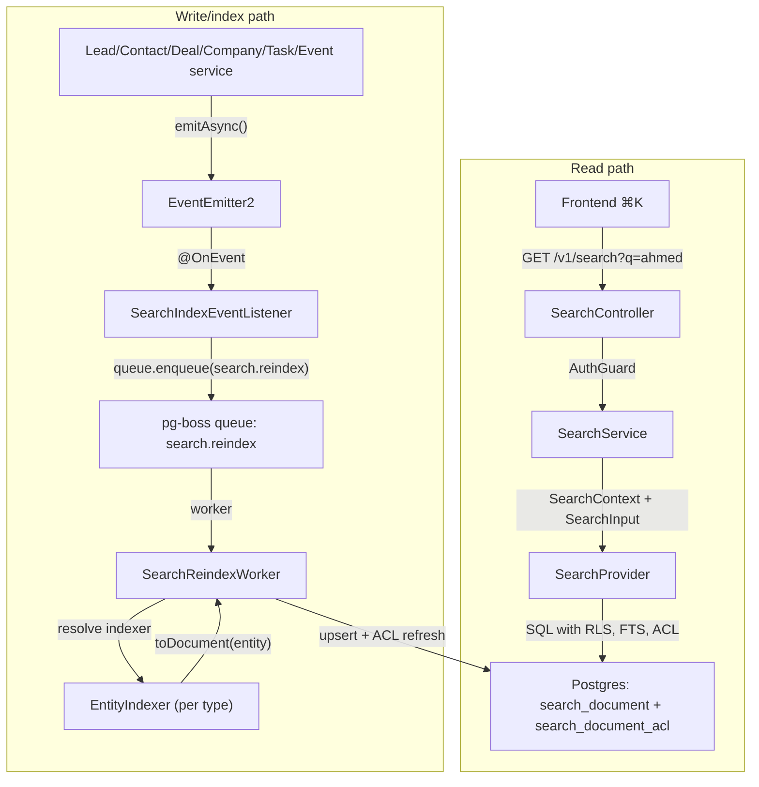

<Note>
**Version:** 0.6 (Phase 1 complete — backend + frontend ⌘K)  
**Last Updated:** May 2026  
**Status:** Phase 1 (backend read/index + frontend ⌘K) landed  
**Scope:** Lead, Contact, Deal, Company, Task, Event  
**Owner:** Backend Platform
</Note>

This document specifies the design of a permission-aware **global search** feature for PropWise CRM. Foundation work (Steps 2–9: module scaffold, worker/maintenance handlers, `SearchProvider` interface, indexer infrastructure, `normalizeSearchText()`, `buildSearchPermissionWhereClause()`, backfill script, unit tests) is implemented under `src/modules/search/`. Phase 1B–1D backend indexer/read paths and cross-doc sync are landed. Phase 1E frontend ⌘K palette is landed in `propwise-crm-frontend`.

## Design summary in 5 bullets

<Info>
Read this section first. It is enough to know **what to build** before diving into the per-entity field mapping or the full specification.
</Info>

<Steps>

<Step title="What ships">
One tenant-scoped read endpoint — `GET /v1/search` — backed by a denormalized `search_document` table (one row per Lead, Contact, Deal, Company, Task, Event). Stakeholder-gated entities also get rows in `search_document_acl`. The frontend ⌘K palette consumes lightweight hits; full detail loads on click.
</Step>

<Step title="Two pipelines, one table">
Search is **read** (sync SQL, P95 < 300ms) and **index** (async, ~2s P95 lag) decoupled. Domain services emit events → pg-boss queue `search.reindex` → `SearchReindexWorker` → per-entity `EntityIndexer.toDocument()` → upsert + ACL diff refresh. A slow indexer must not block CRM writes or search reads.


</Step>

<Step title="What you implement (Phase 1B slice)">
Migrations for `search_document` / `search_document_acl`, `SearchModule` + `PostgresSearchProvider`, the reindex worker, **`LeadIndexer` and `ContactIndexer`** in their owning CRM modules (registered via `SEARCH_INDEXERS`), event wiring in `LeadService` / `ContactService` / `PersonService` / `EntityStakeholderService`, shared **`normalizeSearchText()`**, and E2E persona + Arabic normalization tests.
</Step>

<Step title="Permissions are not optional">
Contact, Deal, and Company use `visibility = 'stakeholder_only'` — indexers project `(user_id, team_id, access_level)` into `search_document_acl`; the read path filters with a fast `EXISTS`. **Lead** is normally `stakeholder_only` but switches to `'org_wide'` while it is **unassigned** (zero active stakeholders → global pool), matching the always-available POOL list tab. Task and Event are always `org_wide` (no ACL rows). If search returns a row the user cannot open in list view, the feature is broken.
</Step>

<Step title="Where to read next">
Read the **Per-Entity Field Mapping** section for exact `title` / `subtitle` / `body` / ACL / reindex triggers per entity before writing any indexer. Read the **Indexing Pipeline** section for queue config, worker contract, failure handling, cascades. Skip the rest until your slice needs it.
</Step>

</Steps>

## Overview & goals

### Definition

**Global search** is a single endpoint (`GET /v1/search`) and a single frontend surface (the ⌘K command palette) that lets a user type any keyword, name, public ID, email, or phone fragment and see matching CRM records they are authorized to view, ranked by relevance and recency. It is permission-aware and tenant-scoped. **Backend** indexing is eventually consistent (~2s p95; longer under backlog). **Frontend** shows the creator their own just-created items immediately via client-side pins so "create → ⌘K" never feels broken.

### Goals (Phase 1)

| # | Goal | Acceptance |
|---|------|-----------|
| G1 | One endpoint covers Lead, Contact, Deal, Company, Task, Event | A single request returns hits across all six entity types in one ranked list |
| G2 | Results respect existing org RLS and per-row stakeholder ACLs | An agent searching `ahmed` never sees a lead they are not a stakeholder on (and would not see in `/v1/leads/list`) |
| G3 | Read-your-writes within ~2 seconds (indexer) + immediate creator UX | Backend: newly created/updated entity appears in `GET /v1/search` within indexer P95 lag (~2s under normal load; longer during queue backlog). **Frontend:** creator sees their own just-created items in ⌘K immediately via client-side "Just created" group — no synchronous index or source-table fallback in Phase 1 |
| G4 | Provider-swappable architecture | Swapping the Postgres provider for OpenSearch/Typesense in the future requires zero changes to controllers, services, or domain indexers |
| G5 | Phone and email substring matching for PII | Typing `+9715…` or `ahmed@` returns the matching person |
| G6 | Picker-style response shape | Lightweight hits (id, title, subtitle, entity type, permissions, score); the frontend fetches full detail on click |
| G7 | Arabic + mixed-script search (UAE market) | Typing `أحمد`, `احمد`, or `ahmed` finds the same lead when the record uses any of those forms; Arabic-Indic phone digits match Western digits |

### Non-goals (Phase 1)

<Warning>
The following are explicitly out of scope for Phase 1:
</Warning>

| Non-goal | Why |
|----------|-----|
| Searching the audit log (`audit_log` table) | Audit data is sensitive and lives in its own admin-only UI. See `Docs/AUDIT_LOG_SYSTEM.md`. |
| Cross-org / global search for system admins | System admin is scoped to the **currently selected org** (i.e. `executeInOrg(orgId)`) — same as every other tenant endpoint. |
| User, Team, Off-plan project/unit, Conversation, Message, KnowledgeSource, Notification, Subscription, Commission Payment | Reserved for Phase 2 / Phase 3. |
| Search-as-you-type analytics ("what are people searching for") | Out of scope. Only operational metrics (latency, hit count) are collected. |
| Saved searches / pinned results / alerts | Phase 2. |
| Synchronous search index on create (blocking CRM write) | Async indexer only — see Frontend Contract section for creator UX without backend coupling. |
| Server-side "query source tables on every search" fallback for the creator | Frontend handles this with client-side just-created pins (no backend changes). |

## Architecture

### System context

```
┌─────────────────────────────────────────────────────────────────────┐
│                          PropWise CRM                                │
│                                                                      │
│  ┌──────────────┐         ┌──────────────┐      ┌───────────────┐  │
│  │  Frontend    │         │  SearchAPI   │      │  Domain CRM   │  │
│  │  (⌘K)        │────────>│  Controller  │      │  Services     │  │
│  │              │  HTTP   │              │      │  (Lead, etc)  │  │
│  └──────────────┘         └──────┬───────┘      └───────┬───────┘  │
│                                   │                      │          │
│                                   v                      │          │
│                          ┌────────────────┐              │          │
│                          │ SearchService  │              │          │
│                          │ + Provider     │              │          │
│                          └────────┬───────┘              │          │
│                                   │                      │          │
│                                   v                      v          │
│                    ┌──────────────────────────┐  ┌──────────────┐  │
│                    │  search_document (table) │  │  pg-boss     │  │
│                    │  search_document_acl     │  │  queue       │  │
│                    └──────────────────────────┘  └──────┬───────┘  │
│                                                          │          │
│                                                          v          │
│                                                ┌─────────────────┐  │
│                                                │ SearchReindex   │  │
│                                                │ Worker          │  │
│                                                └─────────────────┘  │
└─────────────────────────────────────────────────────────────────────┘
```

### Read vs. index decoupling

<Tip>
The read path (sync SQL) and index path (async worker) are completely decoupled. A slow indexer must not block CRM writes or search reads.
</Tip>

**Read path:**
1. User types `ahmed` in ⌘K
2. Frontend calls `GET /v1/search?q=ahmed`
3. `SearchController` → `SearchService` → `PostgresSearchProvider.search()`
4. Provider builds SQL with FTS, ACL filtering, RLS
5. Returns lightweight hits (id, title, subtitle, entity type, permissions, score)
6. **SLA:** P95 < 300ms

**Index path:**
1. Domain service (e.g., `LeadService.create()`) emits `lead.created`
2. `SearchIndexEventListener` enqueues `search.reindex` job
3. `SearchReindexWorker` picks up job
4. Worker resolves entity-specific indexer (e.g., `LeadIndexer`)
5. Indexer calls `toDocument(lead)` → returns `SearchDocument`
6. Worker upserts row in `search_document` + refreshes ACL
7. **SLA:** P95 < 2s under normal load

### Module structure

```
src/modules/search/
├── search.module.ts              # SearchModule, SEARCH_INDEXERS registry
├── controllers/
│   └── search.controller.ts      # GET /v1/search
├── services/
│   └── search.service.ts         # orchestrates provider
├── providers/
│   ├── search.provider.ts        # interface
│   └── postgres-search.provider.ts
├── workers/
│   └── search-reindex.worker.ts  # pg-boss consumer
├── listeners/
│   └── search-index-event.listener.ts
├── indexers/
│   └── entity-indexer.interface.ts
├── dto/
│   ├── search-input.dto.ts
│   └── search-response.dto.ts
├── entities/
│   ├── search-document.entity.ts
│   └── search-document-acl.entity.ts
└── utils/
    ├── normalize-search-text.ts
    └── build-search-permission-where-clause.ts

src/modules/lead/indexers/
└── lead.indexer.ts               # implements EntityIndexer

src/modules/contact/indexers/
└── contact.indexer.ts            # implements EntityIndexer
```

<Note>
Each domain module (lead, contact, deal, company, task, event) provides its own indexer. The `SearchModule` discovers indexers via the `SEARCH_INDEXERS` injection token.
</Note>

### Database tables

The search feature uses two new tables:

```
search_document:
  - id (uuid, PK)
  - org_id (uuid, FK → organization.id)
  - entity_type (enum: LEAD, CONTACT, DEAL, COMPANY, TASK, EVENT)
  - entity_id (uuid)
  - visibility (enum: org_wide, stakeholder_only)
  - title (text, e.g., "Ahmed Hassan")
  - subtitle (text, e.g., "+971501234567")
  - body (text, searchable blob)
  - public_id (text, e.g., "LD-1234")
  - metadata (jsonb, for entity-specific fields)
  - search_vector (tsvector, FTS index)
  - normalized_text (text, for Arabic + phone/email substring)
  - rank_score (numeric, recency + manual boost)
  - indexed_at (timestamptz)
  - created_at, updated_at
  - UNIQUE (org_id, entity_type, entity_id)

search_document_acl:
  - id (uuid, PK)
  - document_id (uuid, FK → search_document.id, CASCADE)
  - user_id (uuid, nullable, FK → user.id, CASCADE)
  - team_id (uuid, nullable, FK → team.id, CASCADE)
  - access_level (enum: read, write, admin)
  - created_at
  - CHECK: (user_id IS NOT NULL) OR (team_id IS NOT NULL)
  - INDEX on (document_id, user_id)
  - INDEX on (document_id, team_id)
```

## Data model

### search_document schema

```sql
CREATE TYPE search_entity_type AS ENUM (
  'LEAD',
  'CONTACT',
  'DEAL',
  'COMPANY',
  'TASK',
  'EVENT'
);

CREATE TYPE search_visibility AS ENUM (
  'org_wide',
  'stakeholder_only'
);

CREATE TABLE search_document (
  id UUID PRIMARY KEY DEFAULT uuid_generate_v4(),
  org_id UUID NOT NULL REFERENCES organization(id) ON DELETE CASCADE,
  entity_type search_entity_type NOT NULL,
  entity_id UUID NOT NULL,
  visibility search_visibility NOT NULL,
  title TEXT NOT NULL,
  subtitle TEXT,
  body TEXT,
  public_id TEXT,
  metadata JSONB DEFAULT '{}',
  search_vector TSVECTOR,
  normalized_text TEXT,
  rank_score NUMERIC DEFAULT 0,
  indexed_at TIMESTAMPTZ NOT NULL DEFAULT NOW(),
  created_at TIMESTAMPTZ NOT NULL DEFAULT NOW(),
  updated_at TIMESTAMPTZ NOT NULL DEFAULT NOW(),
  
  CONSTRAINT uq_search_document_entity UNIQUE (org_id, entity_type, entity_id)
);

CREATE INDEX idx_search_document_org ON search_document(org_id);
CREATE INDEX idx_search_document_vector ON search_document USING GIN(search_vector);
CREATE INDEX idx_search_document_normalized ON search_document USING GIN(normalized_text gin_trgm_ops);
CREATE INDEX idx_search_document_entity_type ON search_document(org_id, entity_type);
CREATE INDEX idx_search_document_rank ON search_document(org_id, rank_score DESC);
```

<Warning>
The `UNIQUE (org_id, entity_type, entity_id)` constraint ensures we never duplicate a search document. Indexers must use `ON CONFLICT ... DO UPDATE`.
</Warning>

### search_document_acl schema

```sql
CREATE TYPE search_access_level AS ENUM (
  'read',
  'write',
  'admin'
);

CREATE TABLE search_document_acl (
  id UUID PRIMARY KEY DEFAULT uuid_generate_v4(),
  document_id UUID NOT NULL REFERENCES search_document(id) ON DELETE CASCADE,
  user_id UUID REFERENCES "user"(id) ON DELETE CASCADE,
  team_id UUID REFERENCES team(id) ON DELETE CASCADE,
  access_level search_access_level NOT NULL DEFAULT 'read',
  created_at TIMESTAMPTZ NOT NULL DEFAULT NOW(),
  
  CONSTRAINT chk_search_acl_principal CHECK (
    (user_id IS NOT NULL AND team_id IS NULL) OR
    (user_id IS NULL AND team_id IS NOT NULL)
  )
);

CREATE INDEX idx_search_acl_document ON search_document_acl(document_id);
CREATE INDEX idx_search_acl_user ON search_document_acl(document_id, user_id);
CREATE INDEX idx_search_acl_team ON search_document_acl(document_id, team_id);
```

### SearchDocument entity

```typescript
@Entity('search_document')
export class SearchDocument extends BaseEntity {
  @PrimaryGeneratedColumn('uuid')
  id: string;

  @Column('uuid')
  @Index()
  orgId: string;

  @Column({
    type: 'enum',
    enum: SearchEntityType,
  })
  @Index()
  entityType: SearchEntityType;

  @Column('uuid')
  entityId: string;

  @Column({
    type: 'enum',
    enum: SearchVisibility,
  })
  visibility: SearchVisibility;

  @Column('text')
  title: string;

  @Column('text', { nullable: true })
  subtitle?: string;

  @Column('text', { nullable: true })
  body?: string;

  @Column('text', { nullable: true })
  publicId?: string;

  @Column('jsonb', { default: {} })
  metadata: Record<string, any>;

  @Column('tsvector', { nullable: true })
  @Index('idx_search_document_vector', { synchronize: false })
  searchVector?: any;

  @Column('text', { nullable: true })
  normalizedText?: string;

  @Column('numeric', { default: 0 })
  rankScore: number;

  @Column('timestamptz')
  indexedAt: Date;

  @CreateDateColumn()
  createdAt: Date;

  @UpdateDateColumn()
  updatedAt: Date;

  @OneToMany(() => SearchDocumentAcl, (acl) => acl.document, { cascade: true })
  acl: SearchDocumentAcl[];
}
```

### SearchDocumentAcl entity

```typescript
@Entity('search_document_acl')
export class SearchDocumentAcl extends BaseEntity {
  @PrimaryGeneratedColumn('uuid')
  id: string;

  @Column('uuid')
  @Index()
  documentId: string;

  @Column('uuid', { nullable: true })
  userId?: string;

  @Column('uuid', { nullable: true })
  teamId?: string;

  @Column({
    type: 'enum',
    enum: SearchAccessLevel,
    default: SearchAccessLevel.READ,
  })
  accessLevel: SearchAccessLevel;

  @CreateDateColumn()
  createdAt: Date;

  @ManyToOne(() => SearchDocument, (doc) => doc.acl, { onDelete: 'CASCADE' })
  @JoinColumn({ name: 'document_id' })
  document: SearchDocument;
}
```

## Per-entity field mapping

<Warning>
This section is **mandatory reading** before implementing any indexer. The exact `title`, `subtitle`, `body`, `visibility`, and reindex triggers are specified here.
</Warning>

### Lead

<Tabs>
  <Tab title="Fields">

| Field | Value | Notes |
|-------|-------|-------|
| **entity_type** | `LEAD` | |
| **entity_id** | `lead.id` | |
| **visibility** | `stakeholder_only` if `lead.stakeholders.length > 0`, else `org_wide` | **Unassigned leads are globally visible** (matches POOL list tab behavior) |
| **title** | `${lead.firstName} ${lead.lastName}` (trimmed) | Never null; use `'(No name)'` if both null |
| **subtitle** | `lead.email` OR first `lead.phoneNumbers[0].number` OR `null` | Prefer email; fallback to first phone |
| **body** | Concatenation (space-separated, de-duped): `firstName`, `lastName`, `email`, all `phoneNumbers[].number`, all `tags[].name`, `source`, `campaign`, `adName`, `notes` | Each field contributes once; null fields skipped |
| **public_id** | `lead.publicId` (e.g., `'LD-1234'`) | |
| **metadata** | `{ status: lead.status, source: lead.source, assignedToId: lead.assignedToId, createdAt: lead.createdAt.toISOString() }` | Used for filtering, not search |
| **rank_score** | `100 - daysSinceCreation` (clamped to 0) | Recent leads rank higher |

  </Tab>
  <Tab title="ACL">

**If `visibility = 'stakeholder_only'`:**

```typescript
// For each active stakeholder:
{
  userId: stakeholder.userId,
  teamId: stakeholder.teamId,
  accessLevel: stakeholder.accessLevel // 'read' | 'write' | 'admin'
}
```

**If `visibility = 'org_wide'`:**
- No ACL rows (empty array)

  </Tab>
  <Tab title="Reindex triggers">

Emit `search.reindex` event when:

1. `lead.created`
2. `lead.updated` (any field change)
3. `lead.deleted` → **delete document**
4. `lead.stakeholder.added` → **refresh ACL + visibility toggle**
5. `lead.stakeholder.removed` → **refresh ACL + visibility toggle**
6. `lead.stakeholder.updated` (access level change) → **refresh ACL**
7. `person.updated` (if person is linked to lead) → **reindex lead** (name/email/phone may have changed)
8. `tag.created` / `tag.updated` / `tag.deleted` (if tag is attached to lead) → **reindex lead**

  </Tab>
</Tabs>

<Info>
**Unassigned lead visibility:** When a lead has zero active stakeholders, it must appear in search for **all org members** (matching the always-visible POOL list tab). When the first stakeholder is added, visibility switches to `stakeholder_only`.
</Info>

### Contact

<Tabs>
  <Tab title="Fields">

| Field | Value | Notes |
|-------|-------|-------|
| **entity_type** | `CONTACT` | |
| **entity_id** | `contact.id` | |
| **visibility** | `stakeholder_only` | Always stakeholder-gated |
| **title** | `${contact.person.firstName} ${contact.person.lastName}` (trimmed) | Never null; use `'(No name)'` if both null |
| **subtitle** | `contact.person.email` OR first `contact.person.phoneNumbers[0].number` OR `null` | Prefer email |
| **body** | `firstName`, `lastName`, `email`, all `phoneNumbers[].number`, all `tags[].name`, `jobTitle`, `department`, `notes`, `company.name` (if linked) | |
| **public_id** | `contact.publicId` (e.g., `'CT-5678'`) | |
| **metadata** | `{ jobTitle, department, companyId, createdAt }` | |
| **rank_score** | `100 - daysSinceCreation` | |

  </Tab>
  <Tab title="ACL">

```typescript
// For each active stakeholder:
{
  userId: stakeholder.userId,
  teamId: stakeholder.teamId,
  accessLevel: stakeholder.accessLevel
}
```

  </Tab>
  <Tab title="Reindex triggers">

1. `contact.created`
2. `contact.updated`
3. `contact.deleted` → **delete document**
4. `contact.stakeholder.added` → **refresh ACL**
5. `contact.stakeholder.removed` → **refresh ACL**
6. `contact.stakeholder.updated` → **refresh ACL**
7. `person.updated` (if person is linked to contact) → **reindex contact**
8. `tag.created` / `tag.updated` / `tag.deleted` (if tag is attached to contact) → **reindex contact**
9. `company.updated` (if company is linked to contact) → **reindex contact** (company name may have changed)

  </Tab>
</Tabs>

### Deal

<Tabs>
  <Tab title="Fields">

| Field | Value | Notes |
|-------|-------|-------|
| **entity_type** | `DEAL` | |
| **entity_id** | `deal.id` | |
| **visibility** | `stakeholder_only` | Always stakeholder-gated |
| **title** | `deal.name` | Never null; use `'(Untitled deal)'` if null |
| **subtitle** | `${deal.stage} · ${formatCurrency(deal.value)}` | e.g., `'Negotiation · AED 500,000'` |
| **body** | `name`, `description`, `stage`, `contact.person.firstName`, `contact.person.lastName`, `company.name`, all `tags[].name` | |
| **public_id** | `deal.publicId` (e.g., `'DL-9012'`) | |
| **metadata** | `{ stage, value, currency, probability, expectedCloseDate, contactId, companyId, createdAt }` | |
| **rank_score** | `(100 - daysSinceCreation) + (probability * 0.5)` | Recent + high-probability deals rank higher |

  </Tab>
  <Tab title="ACL">

```typescript
// For each active stakeholder:
{
  userId: stakeholder.userId,
  teamId: stakeholder.teamId,
  accessLevel: stakeholder.accessLevel
}
```

  </Tab>
  <Tab title="Reindex triggers">

1. `deal.created`
2. `deal.updated`
3. `deal.deleted` → **delete document**
4. `deal.stakeholder.added` → **refresh ACL**
5. `deal.stakeholder.removed` → **refresh ACL**
6. `deal.stakeholder.updated` → **refresh ACL**
7. `contact.updated` / `person.updated` (if linked) → **reindex deal**
8. `company.updated` (if linked) → **reindex deal**
9. `tag.created` / `tag.updated` / `tag.deleted` (if attached) → **reindex deal**

  </Tab>
</Tabs>

### Company

<Tabs>
  <Tab title="Fields">

| Field | Value | Notes |
|-------|-------|-------|
| **entity_type** | `COMPANY` | |
| **entity_id** | `company.id` | |
| **visibility** | `stakeholder_only` | Always stakeholder-gated |
| **title** | `company.name` | Never null; use `'(Untitled company)'` if null |
| **subtitle** | `company.industry` OR `company.website` OR `null` | Prefer industry |
| **body** | `name`, `website`, `industry`, `description`, all `tags[].name`, `address.city`, `address.country` | |
| **public_id** | `company.publicId` (e.g., `'CO-3456'`) | |
| **metadata** | `{ industry, website, size, createdAt }` | |
| **rank_score** | `100 - daysSinceCreation` | |

  </Tab>
  <Tab title="ACL">

```typescript
// For each active stakeholder:
{
  userId: stakeholder.userId,
  teamId: stakeholder.teamId,
  accessLevel: stakeholder.accessLevel
}
```

  </Tab>
  <Tab title="Reindex triggers">

1. `company.created`
2. `company.updated`
3. `company.deleted` → **delete document**
4. `company.stakeholder.added` → **refresh ACL**
5. `company.stakeholder.removed` → **refresh ACL**
6. `company.stakeholder.updated` → **refresh ACL**
7. `tag.created` / `tag.updated` / `tag.deleted` (if attached) → **reindex company**

  </Tab>
</Tabs>

### Task

<Tabs>
  <Tab title="Fields">

| Field | Value | Notes |
|-------|-------|-------|
| **entity_type** | `TASK` | |
| **entity_id** | `task.id` | |
| **visibility** | `org_wide` | **Always visible to all org members** (no ACL rows) |
| **title** | `task.title` | Never null; use `'(Untitled task)'` if null |
| **subtitle** | `Due: ${formatDate(task.dueDate)}` OR `Assigned to: ${assignee.name}` | Show due date if present, else assignee |
| **body** | `title`, `description`, `assignee.firstName`, `assignee.lastName`, `relatedEntity.title` (if linked to lead/contact/deal) | |
| **public_id** | `task.publicId` (e.g., `'TK-7890'`) | |
| **metadata** | `{ status, priority, dueDate, assignedToId, relatedEntityType, relatedEntityId, createdAt }` | |
| **rank_score** | `200 - daysSinceCreation` if overdue, else `100 - daysSinceCreation` | Overdue tasks rank higher |

  </Tab>
  <Tab title="ACL">

**No ACL rows** (empty array). All org members can see all tasks.

  </Tab>
  <Tab title="Reindex triggers">

1. `task.created`
2. `task.updated`
3. `task.deleted` → **delete document**
4. `user.updated` (if user is task assignee) → **reindex task**
5. Related entity updated (lead/contact/deal) → **reindex task** (related entity title may have changed)

  </Tab>
</Tabs>

### Event

<Tabs>
  <Tab title="Fields">

| Field | Value | Notes |
|-------|-------|-------|
| **entity_type** | `EVENT` | |
| **entity_id** | `event.id` | |
| **visibility** | `org_wide` | **Always visible to all org members** (no ACL rows) |
| **title** | `event.title` | Never null; use `'(Untitled event)'` if null |
| **subtitle** | `${formatDateTime(event.startTime)} · ${event.location}` | e.g., `'Jan 15, 2026 2:00 PM · Office'` |
| **body** | `title`, `description`, `location`, all `attendees[].name`, `relatedEntity.title` (if linked) | |
| **public_id** | `event.publicId` (e.g., `'EV-2345'`) | |
| **metadata** | `{ startTime, endTime, location, organizerId, attendeeIds, relatedEntityType, relatedEntityId, createdAt }` | |
| **rank_score** | `300 - daysSinceCreation` if upcoming (startTime > now), else `100 - daysSinceCreation` | Upcoming events rank higher |

  </Tab>
  <Tab title="ACL">

**No ACL rows** (empty array). All org members can see all events.

  </Tab>
  <Tab title="Reindex triggers">

1. `event.created`
2. `event.updated`
3. `event.deleted` → **delete document**
4. `user.updated` (if user is attendee or organizer) → **reindex event**
5. Related entity updated (lead/contact/deal) → **reindex event**

  </Tab>
</Tabs>

## Adding a new entity to search (future playbook)

<Steps>

<Step title="Implement EntityIndexer">
Create `src/modules/{entity}/indexers/{entity}.indexer.ts`:

```typescript
@Injectable()
export class EntityNameIndexer implements EntityIndexer<EntityName> {
  async toDocument(
    entity: EntityName,
    context: SearchIndexerContext,
  ): Promise<SearchDocumentInput> {
    // Map entity fields to SearchDocumentInput
    return {
      entityType: SearchEntityType.ENTITY_NAME,
      entityId: entity.id,
      visibility: this.computeVisibility(entity),
      title: entity.name || '(Untitled)',
      subtitle: entity.subtitle,
      body: this.buildBody(entity),
      publicId: entity.publicId,
      metadata: { /* ... */ },
      acl: await this.buildAcl(entity, context),
      rankScore: this.computeRank(entity),
    };
  }

  async getEntity(id: string, context: SearchIndexerContext): Promise<EntityName | null> {
    // Fetch entity by ID (with necessary relations for indexing)
  }
}
```
</Step>

<Step title="Register indexer in module">
Add to `{entity}.module.ts`:

```typescript
import { SEARCH_INDEXERS } from '@modules/search/search.constants';
import { EntityNameIndexer } from './indexers/entity-name.indexer';

@Module({
  providers: [
    EntityNameIndexer,
    {
      provide: SEARCH_INDEXERS,
      useClass: EntityNameIndexer,
      multi: true,
    },
  ],
})
export class EntityNameModule {}
```
</Step>

<Step title="Emit reindex events">
In `{entity}.service.ts`, emit events after mutations:

```typescript
async create(dto: CreateEntityDto, context: ServiceContext): Promise<EntityName> {
  const entity = await this.repo.save(/* ... */);
  
  await this.eventEmitter.emitAsync('entityName.created', {
    orgId: context.orgId,
    entityId: entity.id,
    userId: context.userId,
  });
  
  return entity;
}
```
</Step>

<Step title="Add migration">
If the entity enum needs updating:

```typescript
// migrations/YYYYMMDDHHMMSS-add-entity-to-search.ts
export class AddEntityToSearch1234567890 implements MigrationInterface {
  public async up(queryRunner: QueryRunner): Promise<void> {
    await queryRunner.query(`
      ALTER TYPE search_entity_type ADD VALUE 'ENTITY_NAME';
    `);
  }
}
```
</Step>

<Step title="Update tests">
Add E2E test in `test/e2e/search/`:

```typescript
describe('Search - EntityName (e2e)', () => {
  it('should index newly created entity', async () => {
    const entity = await createEntity(/* ... */);
    await waitForIndexer(); // ~2s
    
    const results = await search({ q: entity.name });
    expect(results.hits).toContainEqual(
      expect.objectContaining({
        entityType: 'ENTITY_NAME',
        entityId: entity.id,
      }),
    );
  });
});
```
</Step>

</Steps>

<Tip>
Follow the Lead and Contact indexers as reference implementations. Both are fully landed in Phase 1B.
</Tip>

## Indexing pipeline

### Queue configuration

The search indexer uses the `search.reindex` pg-boss queue:

```typescript
// search.constants.ts
export const SEARCH_REINDEX_QUEUE = 'search.reindex';

export const SEARCH_REINDEX_QUEUE_OPTIONS = {
  retryLimit: 3,
  retryDelay: 60, // 1 minute
  retryBackoff: true,
  expireInSeconds: 3600, // 1 hour
  priority: 5, // medium priority
};
```

<Warning>
Do NOT set a short `expireInSeconds` or high `priority` in production. Search indexing is **not critical path**. If the queue backs up, we accept longer lag rather than starving other workers.
</Warning>

### Event → queue flow

```typescript
// search-index-event.listener.ts
@Injectable()
export class SearchIndexEventListener {
  @OnEvent('lead.created', { async: true })
  @OnEvent('lead.updated', { async: true })
  async handleLeadEvent(event: LeadEvent): Promise<void> {
    await this.queueService.enqueue(SEARCH_REINDEX_QUEUE, {
      orgId: event.orgId,
      entityType: SearchEntityType.LEAD,
      entityId: event.entityId,
      operation: event.type.endsWith('.deleted') ? 'delete' : 'upsert',
    }, SEARCH_REINDEX_QUEUE_OPTIONS);
  }

  // Repeat for contact, deal, company, task, event...
}
```

<Info>
The listener uses `{ async: true }` so event emission never blocks the caller. The queue job is fire-and-forget from the domain service's perspective.
</Info>

### Worker contract

```typescript
// search-reindex.worker.ts
@Injectable()
export class SearchReindexWorker {
  @OnQueueJob(SEARCH_REINDEX_QUEUE)
  async process(job: Job<SearchReindexJobPayload>): Promise<void> {
    const { orgId, entityType, entityId, operation } = job.data;

    return await executeInOrg(orgId, async () => {
      const context: SearchIndexerContext = {
        orgId,
        userId: null, // worker context, no user
        timestamp: new Date(),
      };

      if (operation === 'delete') {
        await this.searchService.deleteDocument(entityType, entityId, context);
        return;
      }

      // operation === 'upsert'
      const indexer = this.resolveIndexer(entityType);
      const entity = await indexer.getEntity(entityId, context);

      if (!entity) {
        // Entity was deleted between event and worker pick-up
        await this.searchService.deleteDocument(entityType, entityId, context);
        return;
      }

      const document = await indexer.toDocument(entity, context);
      await this.searchService.upsertDocument(document, context);
    });
  }

  private resolveIndexer(entityType: SearchEntityType): EntityIndexer<any> {
    const indexer = this.indexers.find((i) => i.entityType === entityType);
    if (!indexer) {
      throw new Error(`No indexer registered for ${entityType}`);
    }
    return indexer;
  }
}
```

<Note>
The worker calls `executeInOrg()` to set the org-scoped database connection. All indexer queries run within that org's schema/RLS context.
</Note>

### Failure handling

| Failure scenario | Behavior | Recovery |
|------------------|----------|----------|
| Entity not found (deleted between event and worker) | Delete document silently | Automatic (idempotent delete) |
| Indexer throws error (e.g., DB timeout) | Job retries up to 3 times with exponential backoff | Manual: monitor `pg-boss` failed jobs dashboard |
| Worker crashes mid-job | pg-boss auto-retries on restart | Automatic (pg-boss guarantees at-least-once delivery) |
| Queue backlog (thousands of jobs) | Indexer lag increases; search returns stale results | Acceptable (eventually consistent); add worker capacity if sustained |
| Database unavailable | All jobs fail and retry | Automatic (pg-boss retry) |

<Tip>
Set up alerting on `pg-boss` failed job count and queue depth (see **Operations & Monitoring** section).
</Tip>

### Cascading deletes

The `search_document` and `search_document_acl` tables use `ON DELETE CASCADE`:

```sql
-- When a user is deleted:
search_document_acl.user_id → CASCADE → ACL row deleted

-- When a team is deleted:
search_document_acl.team_id → CASCADE → ACL row deleted

-- When a search document is deleted:
search_document_acl.document_id → CASCADE → all ACL rows deleted
```

<Warning>
When a Lead/Contact/Deal/Company/Task/Event is hard-deleted, the domain service MUST emit a `{entity}.deleted` event. The search indexer will delete the corresponding `search_document` row (which cascades to ACL).

If the domain service fails to emit the event, the search document becomes orphaned (points to non-existent entity). This is caught by the **orphan cleanup maintenance job** (runs weekly).
</Warning>

### Orphan cleanup (maintenance job)

```typescript
// search-maintenance.service.ts
@Cron('0 2 * * 0') // Sunday 2 AM
async cleanupOrphanedDocuments(): Promise<void> {
  const batchSize = 1000;
  let orphanedCount = 0;

  for (const entityType of Object.values(SearchEntityType)) {
    const documents = await this.repo.find({
      where: { entityType },
      take: batchSize,
    });

    for (const doc of documents) {
      const exists = await this.checkEntityExists(doc.entityType, doc.entityId);
      if (!exists) {
        await this.searchService.deleteDocument(doc.entityType, doc.entityId, {
          orgId: doc.orgId,
          userId: null,
          timestamp: new Date(),
        });
        orphanedCount++;
      }
    }
  }

  this.logger.log(`Cleaned up ${orphanedCount} orphaned search documents`);
}
```

<Info>
The orphan cleanup job is a safety net. It should rarely find orphans if domain services correctly emit `{entity}.deleted` events.
</Info>

### normalizeSearchText() specification

```typescript
/**
 * Normalizes search text for Arabic + mixed-script + PII matching.
 * 
 * Transformations:
 * 1. Lowercase
 * 2. Remove Arabic diacritics (ً ٌ ٍ َ ُ ِ ّ ْ)
 * 3. Normalize Arabic letters: أ إ آ → ا, ة → ه, ى → ي
 * 4. Convert Arabic-Indic digits (٠-٩) to Western (0-9)
 * 5. Remove all punctuation except: + - @ .
 * 6. Collapse multiple spaces to single space
 * 7. Trim
 * 
 * Examples:
 * - "Ahmed Hassan" → "ahmed hassan"
 * - "أحمد حسن" → "احمد حسن"
 * - "+971-50-123-4567" → "+971501234567"
 * - "ahmed@propwise.ae" → "ahmed@propwise.ae"
 * - "٠٥٠١٢٣٤٥٦٧" → "0501234567"
 */
export function normalizeSearchText(text: string): string {
  if (!text) return '';

  let normalized = text.toLowerCase();

  // Remove Arabic diacritics
  normalized = normalized.replace(/[\u064B-\u0652]/g, '');

  // Normalize Arabic letters
  normalized = normalized
    .replace(/[أإآ]/g, 'ا')
    .replace(/ة/g, 'ه')
    .replace(/ى/g, 'ي');

  // Convert Arabic-Indic digits to Western
  normalized = normalized.replace(/[٠-٩]/g, (d) =>
    String.fromCharCode(d.charCodeAt(0) - 1632 + 48),
  );

  // Remove punctuation except + - @ .
  normalized = normalized.replace(/[^\w\s+\-@.]/g, '');

  // Collapse spaces
  normalized = normalized.replace(/\s+/g, ' ').trim();

  return normalized;
}
```

<Check>
This function is **required** in both:
1. **Indexer:** `body` and `normalized_text` columns are populated with normalized content
2. **Search query:** User input is normalized before matching
</Check>

### Backfill script

```bash
# scripts/search-backfill.ts
# Usage: npm run search:backfill -- --org-id=<uuid> [--entity-type=LEAD]

import { NestFactory } from '@nestjs/core';
import { AppModule } from '../src/app.module';
import { SearchService } from '../src/modules/search/services/search.service';

async function main() {
  const app = await NestFactory.createApplicationContext(AppModule);
  const searchService = app.get(SearchService);

  const orgId = process.env.ORG_ID || argv['org-id'];
  const entityType = argv['entity-type'] as SearchEntityType | undefined;

  if (!orgId) {
    console.error('Missing --org-id');
    process.exit(1);
  }

  console.log(`Backfilling search index for org ${orgId}...`);
  
  const stats = await searchService.reindexOrg(orgId, entityType);

  console.log('Backfill complete:', stats);
  process.exit(0);
}

main();
```

<Note>
The backfill script enqueues `search.reindex` jobs for all entities in an org. It does NOT block; the worker processes jobs asynchronously. Use for:
- Initial org setup
- Recovery after prolonged worker downtime
- Testing in staging/dev
</Note>

## Permission gate

### Visibility model

| Entity | Visibility | ACL |
|--------|-----------|-----|
| **Lead** | `stakeholder_only` if `stakeholders.length > 0`, else `org_wide` | Populated when `stakeholder_only` |
| **Contact** | Always `stakeholder_only` | Always populated |
| **Deal** | Always `stakeholder_only` | Always populated |
| **Company** | Always `stakeholder_only` | Always populated |
| **Task** | Always `org_wide` | Never populated (empty) |
| **Event** | Always `org_wide` | Never populated (empty) |

<Warning>
**Unassigned Lead special case:** When a lead has zero active stakeholders, it must have `visibility = 'org_wide'` and **zero ACL rows**. This matches the POOL list tab (always visible to all org members). When the first stakeholder is added, the indexer must:
1. Set `visibility = 'stakeholder_only'`
2. Insert ACL rows for all current stakeholders
</Warning>

### buildSearchPermissionWhereClause()

```typescript
/**
 * Builds a SQL WHERE clause fragment for permission filtering.
 * 
 * Logic:
 * - If doc.visibility = 'org_wide': always visible (no ACL check)
 * - If doc.visibility = 'stakeholder_only': user must have ACL row
 * 
 * Returns Knex subquery for use in SearchProvider.
 */
export function buildSearchPermissionWhereClause(
  userId: string,
  userTeamIds: string[],
): Knex.QueryBuilder {
  return knex.raw(`
    (
      search_document.visibility = 'org_wide'
      OR
      EXISTS (
        SELECT 1
        FROM search_document_acl
        WHERE search_document_acl.document_id = search_document.id
        AND (
          search_document_acl.user_id = ?
          OR search_document_acl.team_id IN (?)
        )
      )
    )
  `, [userId, userTeamIds]);
}
```

<Info>
The `EXISTS` subquery is fast because `search_document_acl` has indexes on `(document_id, user_id)` and `(document_id, team_id)`.
</Info>

### ACL refresh logic

When a stakeholder is added/removed/updated, the indexer must **diff** the current ACL state:

```typescript
async refreshAcl(
  document: SearchDocument,
  newAcl: SearchAclEntry[],
): Promise<void> {
  const existingAcl = await this.aclRepo.find({
    where: { documentId: document.id },
  });

  const toDelete = existingAcl.filter(
    (existing) => !newAcl.some((entry) => this.aclMatches(existing, entry)),
  );

  const toInsert = newAcl.filter(
    (entry) => !existingAcl.some((existing) => this.aclMatches(existing, entry)),
  );

  if (toDelete.length > 0) {
    await this.aclRepo.delete(toDelete.map((acl) => acl.id));
  }

  if (toInsert.length > 0) {
    await this.aclRepo.insert(
      toInsert.map((entry) => ({
        documentId: document.id,
        userId: entry.userId,
        teamId: entry.teamId,
        accessLevel: entry.accessLevel,
      })),
    );
  }
}

private aclMatches(a: SearchDocumentAcl, b: SearchAclEntry): boolean {
  return (
    a.userId === b.userId &&
    a.teamId === b.teamId &&
    a.accessLevel === b.accessLevel
  );
}
```

<Tip>
The diff approach is more efficient than "delete all + insert all" for entities with many stakeholders (e.g., a company with 50 stakeholder rows).
</Tip>

## Ranking & query construction

### Rank score formula

Each entity computes `rank_score` in its indexer:

| Entity | Formula | Notes |
|--------|---------|-------|
| **Lead** | `100 - daysSinceCreation` (clamped to 0) | Recent leads rank higher |
| **Contact** | `100 - daysSinceCreation` | |
| **Deal** | `(100 - daysSinceCreation) + (probability * 0.5)` | Recent + high-probability deals rank higher |
| **Company** | `100 - daysSinceCreation` | |
| **Task** | `200 - daysSinceCreation` if overdue, else `100 - daysSinceCreation` | Overdue tasks rank higher |
| **Event** | `300 - daysSinceCreation` if upcoming (startTime > now), else `100 - daysSinceCreation` | Upcoming events rank higher |

<Note>
The base score (100/200/300) is chosen to create clear separation between entity types in the ranked list. For example, upcoming events always appear before old leads.
</Note>

### PostgreSQL full-text search

```sql
-- Computed column in migration:
ALTER TABLE search_document
ADD COLUMN search_vector TSVECTOR
GENERATED ALWAYS AS (
  setweight(to_tsvector('english', COALESCE(title, '')), 'A') ||
  setweight(to_tsvector('english', COALESCE(subtitle, '')), 'B') ||
  setweight(to_tsvector('english', COALESCE(body, '')), 'C') ||
  setweight(to_tsvector('simple', COALESCE(public_id, '')), 'A')
) STORED;

CREATE INDEX idx_search_document_vector ON search_document USING GIN(search_vector);
```

<Check>
**Weight priorities:**
- `A` (highest): `title`, `public_id`
- `B` (medium): `subtitle`
- `C` (low): `body`
</Check>

### Query construction (PostgresSearchProvider)

```typescript
async search(input: SearchInput, context: SearchContext): Promise<SearchResponse> {
  const { q, entityTypes, limit = 20, offset = 0 } = input;

  const normalizedQuery = normalizeSearchText(q);
  const tsquery = normalizedQuery.split(/\s+/).join(' & '); // AND search

  const query = this.repo.createQueryBuilder('doc')
    .where('doc.org_id = :orgId', { orgId: context.orgId })
    .andWhere(buildSearchPermissionWhereClause(context.userId, context.userTeamIds))
    .andWhere(
      new Brackets((qb) => {
        // Full-text search on search_vector
        qb.where('doc.search_vector @@ to_tsquery(:tsquery)', { tsquery })
          // OR substring match on normalized_text (for PII)
          .orWhere('doc.normalized_text ILIKE :pattern', { pattern: `%${normalizedQuery}%` })
          // OR exact public_id match
          .orWhere('LOWER(doc.public_id) = :publicId', { publicId: normalizedQuery });
      })
    )
    .orderBy('doc.rank_score', 'DESC')
    .addOrderBy('doc.indexed_at', 'DESC')
    .limit(limit)
    .offset(offset);

  if (entityTypes?.length > 0) {
    query.andWhere('doc.entity_type IN (:...entityTypes)', { entityTypes });
  }

  const [hits, total] = await query.getManyAndCount();

  return {
    hits: hits.map((doc) => this.toSearchHit(doc)),
    total,
    limit,
    offset,
  };
}
```

<Info>
The query uses three matching strategies:
1. **Full-text search** (`search_vector @@ to_tsquery`) — fast, ranked by relevance
2. **Substring match** (`normalized_text ILIKE`) — for partial phone/email matching
3. **Exact public_id** — for direct jumps (e.g., typing "LD-1234")
</Info>

## API contract

### GET /v1/search

<Tabs>
  <Tab title="Request">

```http
GET /v1/search?q=ahmed&entityTypes=LEAD,CONTACT&limit=20&offset=0
Authorization: Bearer <jwt>
X-Organization-Id: <org-uuid>
```

**Query parameters:**

| Parameter | Type | Required | Description |
|-----------|------|----------|-------------|
| `q` | `string` | ✅ | Search query (min 2 chars) |
| `entityTypes` | `string[]` | ❌ | Filter by entity types (comma-separated) |
| `limit` | `number` | ❌ | Results per page (default 20, max 100) |
| `offset` | `number` | ❌ | Pagination offset (default 0) |

  </Tab>
  <Tab title="Response">

```json
{
  "hits": [
    {
      "id": "doc-uuid-1",
      "entityType": "LEAD",
      "entityId": "lead-uuid-1",
      "title": "Ahmed Hassan",
      "subtitle": "+971501234567",
      "publicId": "LD-1234",
      "metadata": {
        "status": "new",
        "source": "website",
        "createdAt": "2026-01-15T10:30:00Z"
      },
      "score": 95.3,
      "indexedAt": "2026-01-15T10:30:02Z"
    },
    {
      "id": "doc-uuid-2",
      "entityType": "CONTACT",
      "entityId": "contact-uuid-2",
      "title": "Ahmad Ali",
      "subtitle": "ahmad@propwise.ae",
      "publicId": "CT-5678",
      "metadata": {
        "jobTitle": "CEO",
        "companyId": "company-uuid-1",
        "createdAt": "2026-01-10T14:20:00Z"
      },
      "score": 89.1,
      "indexedAt": "2026-01-10T14:20:03Z"
    }
  ],
  "total": 42,
  "limit": 20,
  "offset": 0
}
```

  </Tab>
  <Tab title="Error responses">

```json
// 400 Bad Request - query too short
{
  "statusCode": 400,
  "message": "Search query must be at least 2 characters",
  "error": "Bad Request"
}

// 401 Unauthorized - missing/invalid JWT
{
  "statusCode": 401,
  "message": "Unauthorized",
  "error": "Unauthorized"
}

// 403 Forbidden - missing org header
{
  "statusCode": 403,
  "message": "Organization context required",
  "error": "Forbidden"
}

// 500 Internal Server Error - search provider failure
{
  "statusCode": 500,
  "message": "Search service unavailable",
  "error": "Internal Server Error"
}
```

  </Tab>
</Tabs>

### DTO definitions

```typescript
// search-input.dto.ts
export class SearchInputDto {
  @IsString()
  @MinLength(2)
  @MaxLength(100)
  q: string;

  @IsOptional()
  @IsArray()
  @IsEnum(SearchEntityType, { each: true })
  entityTypes?: SearchEntityType[];

  @IsOptional()
  @IsInt()
  @Min(1)
  @Max(100)
  limit?: number = 20;

  @IsOptional()
  @IsInt()
  @Min(0)
  offset?: number = 0;
}

// search-response.dto.ts
export class SearchHitDto {
  @IsUUID()
  id: string;

  @IsEnum(SearchEntityType)
  entityType: SearchEntityType;

  @IsUUID()
  entityId: string;

  @IsString()
  title: string;

  @IsOptional()
  @IsString()
  subtitle?: string;

  @IsOptional()
  @IsString()
  publicId?: string;

  @IsObject()
  metadata: Record<string, any>;

  @IsNumber()
  score: number;

  @IsDateString()
  indexedAt: string;
}

export class SearchResponseDto {
  @IsArray()
  @ValidateNested({ each: true })
  @Type(() => SearchHitDto)
  hits: SearchHitDto[];

  @IsInt()
  total: number;

  @IsInt()
  limit: number;

  @IsInt()
  offset: number;
}
```

<Note>
The response is intentionally **lightweight**. The frontend fetches full entity detail (e.g., `GET /v1/leads/:id`) when the user clicks a search result.
</Note>

## Frontend contract

<Info>
This section specifies the **frontend ⌘K palette** integration (Phase 1E). The backend does NOT implement synchronous search fallbacks or special creator-only endpoints.
</Info>

### Command palette behavior

<Steps>

<Step title="Trigger">
User presses `⌘K` (Mac) or `Ctrl+K` (Windows/Linux) anywhere in the app. The palette opens with focus in the search input.
</Step>

<Step title="Debounced API call">
As user types (min 2 chars), frontend debounces input (300ms) and calls `GET /v1/search?q=...`.
</Step>

<Step title="Display results">
Results are grouped by entity type:

```
┌─────────────────────────────────────────────┐
│  🔍  ahmed                              ⌘K  │
├─────────────────────────────────────────────┤
│  Just created (you)                         │
│    📋  LD-1234 · Ahmed Hassan               │ ← Client-side pin
│    📋  LD-5678 · Ahmed Ali                  │
├─────────────────────────────────────────────┤
│  Leads (2)                                  │
│    📋  LD-1234 · Ahmed Hassan               │ ← From search API
│         +971501234567                       │
│    📋  LD-9012 · Ahmad Ibrahim              │
│         ahmad@propwise.ae                   │
├─────────────────────────────────────────────┤
│  Contacts (1)                               │
│    👤  CT-5678 · Ahmad Ali                  │
│         CEO · PropWise Real Estate          │
└─────────────────────────────────────────────┘
```

**"Just created (you)" group:**
- Shows items created by the current user in the **last 5 minutes**
- Stored in frontend localStorage/React state (not backend)
- Always appears first (above search results)
- Clicking item opens detail view (same as search result)

See §10.3.1 for implementation.

</Step>

<Step title="Navigate & select">
User navigates with arrow keys, selects with Enter. Frontend navigates to the detail view (e.g., `/leads/:id`).
</Step>

</Steps>

### Client-side "just created" pins (creator UX)

<Warning>
**Problem:** Backend indexer lag (~2s P95) means newly created items don't appear in search immediately. This feels broken to the creator.

**Solution (frontend-only):** When a user creates an item, the frontend **pins** it to a special "Just created (you)" group at the top of search results for 5 minutes. No backend changes required.
</Warning>

#### Implementation (pseudocode)

```typescript
// frontend/stores/search-pins.store.ts
interface SearchPin {
  entityType: SearchEntityType;
  entityId: string;
  title: string;
  subtitle?: string;
  publicId?: string;
  createdAt: Date;
}

class SearchPinStore {
  private pins: SearchPin[] = [];

  addPin(pin: Omit<SearchPin, 'createdAt'>) {
    this.pins.push({ ...pin, createdAt: new Date() });
    this.pruneOldPins();
  }

  getPins(): SearchPin[] {
    this.pruneOldPins();
    return this.pins;
  }

  private pruneOldPins() {
    const fiveMinutesAgo = new Date(Date.now() - 5 * 60 * 1000);
    this.pins = this.pins.filter((pin) => pin.createdAt > fiveMinutesAgo);
  }
}

// frontend/components/command-palette.tsx
function CommandPalette() {
  const searchResults = useSearch(query);
  const pins = searchPinStore.getPins();

  return (
    <div>
      {pins.length > 0 && (
        <SearchGroup title="Just created (you)">
          {pins.map((pin) => (
            <SearchResult key={pin.entityId} {...pin} />
          ))}
        </SearchGroup>
      )}

      <SearchGroup title="Leads">
        {searchResults.hits
          .filter((hit) => hit.entityType === 'LEAD')
          .map((hit) => <SearchResult key={hit.id} {...hit} />)}
      </SearchGroup>

      {/* Repeat for other entity types */}
    </div>
  );
}

// frontend/pages/leads/create.tsx
function CreateLeadPage() {
  const createLead = useCreateLead();

  const handleSubmit = async (dto: CreateLeadDto) => {
    const lead = await createLead(dto);

    // Pin to search
    searchPinStore.addPin({
      entityType: 'LEAD',
      entityId: lead.id,
      title: `${lead.firstName} ${lead.lastName}`,
      subtitle: lead.email || lead.phoneNumbers?.[0]?.number,
      publicId: lead.publicId,
    });

    navigate(`/leads/${lead.id}`);
  };

  return <LeadForm onSubmit={handleSubmit} />;
}
```

<Check>
**Benefits:**
- Creator sees their item in ⌘K **immediately** (no backend lag)
- No backend changes (no synchronous index, no special endpoints)
- Pins auto-expire after 5 minutes (by which time index