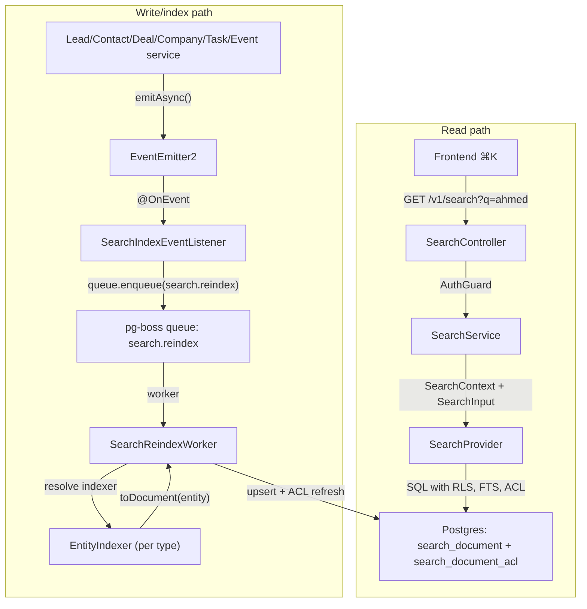

<Note>
**Version:** 0.6 (Phase 1 complete — backend + frontend ⌘K)  
**Last Updated:** May 2026  
**Status:** **Phase 1 (backend read/index + frontend ⌘K) landed** — Phase 1B **Steps 1–12**, Phase 1C **Steps 1–8**, Phase 1D **Steps 1–6**, Phase 1E **Steps 1–8** (frontend palette + Playwright smoke + §10 doc sync). **Remaining backend-only gaps:** `PostgresSearchProvider.reindexOrg()` (backfill orchestration helper) and §13.2 `search-backfill.e2e-spec.ts`. Cross-doc §16 rows for Steps 10–12 and Phase 1C/1D Step 6/8 are complete; Phase 1E Step 8 confirms no new backend cross-docs beyond this file §10.
</Note>

This document specifies the design of a permission-aware **global search** feature for PropWise CRM. Foundation work (Steps 2–9: module scaffold, worker/maintenance handlers, `SearchProvider` interface, indexer infrastructure, `normalizeSearchText()` §6.8, `buildSearchPermissionWhereClause()` §7.3, backfill script §6.4, unit tests) is implemented under `src/modules/search/`. **Phase 1B–1D** backend indexer/read paths and cross-doc sync are landed (see status banner). **Phase 1E** frontend ⌘K palette is landed in `propwise-crm-frontend` (§10).

## Design summary in 5 bullets

<Info>
Read this section first. It is enough to know **what to build** before diving into §4 (per-entity field mapping) or the full 1,400+ line spec.
</Info>

1. **What ships:** One tenant-scoped read endpoint — `GET /v1/search` — backed by a denormalized `search_document` table (one row per Lead, Contact, Deal, Company, Task, Event). Stakeholder-gated entities also get rows in `search_document_acl`. The frontend ⌘K palette consumes lightweight hits; full detail loads on click (§9–§10).

2. **Two pipelines, one table:** Search is **read** (sync SQL, P95 < 300ms) and **index** (async, ~2s P95 lag) decoupled. Domain services emit events → pg-boss queue `search.reindex` → `SearchReindexWorker` → per-entity `EntityIndexer.toDocument()` → upsert + ACL diff refresh. A slow indexer must not block CRM writes or search reads. See diagram below (canonical copy also in §2.2).

3. **What you implement (Phase 1B slice):** Migrations for `search_document` / `search_document_acl`, `SearchModule` + `PostgresSearchProvider`, the reindex worker, **`LeadIndexer` and `ContactIndexer`** in their owning CRM modules (registered via `SEARCH_INDEXERS`), event wiring in `LeadService` / `ContactService` / `PersonService` / `EntityStakeholderService`, shared **`normalizeSearchText()`** (§6.8), and E2E persona + Arabic normalization tests (§12, §13). File layout: §2.5.

4. **Permissions are not optional:** Contact, Deal, and Company use `visibility = 'stakeholder_only'` — indexers project `(user_id, team_id, access_level)` into `search_document_acl`; the read path filters with a fast `EXISTS` (§7). **Lead** is normally `stakeholder_only` but switches to `'org_wide'` while it is **unassigned** (zero active stakeholders → global pool), matching the always-available POOL list tab (§4.1). Task and Event are always `org_wide` (no ACL rows). If search returns a row the user cannot open in list view, the feature is broken.

5. **Where to read next:** **§4** — exact `title` / `subtitle` / `body` / ACL / reindex triggers per entity (read before writing any indexer). **§6** — queue config, worker contract, failure handling, cascades. **§12** — phase gates (1B = Lead + Contact only). Skip the rest until your slice needs it.



## Overview & Goals

### Definition

**Global search** is a single endpoint (`GET /v1/search`) and a single frontend surface (the ⌘K command palette) that lets a user type any keyword, name, public ID, email, or phone fragment and see matching CRM records they are authorized to view, ranked by relevance and recency. It is permission-aware and tenant-scoped. **Backend** indexing is eventually consistent (~2s p95; longer under backlog). **Frontend** shows the creator their own just-created items immediately via client-side pins (§10.3.1) so "create → ⌘K" never feels broken.

### Goals (Phase 1)

| #   | Goal                                                                | Acceptance                                                                                                                                                                                                                                                                                                                                   |
| --- | ------------------------------------------------------------------- | -------------------------------------------------------------------------------------------------------------------------------------------------------------------------------------------------------------------------------------------------------------------------------------------------------------------------------------------- |
| G1  | One endpoint covers Lead, Contact, Deal, Company, Task, Event       | A single request returns hits across all six entity types in one ranked list                                                                                                                                                                                                                                                                 |
| G2  | Results respect existing org RLS and per-row stakeholder ACLs       | An agent searching `ahmed` never sees a lead they are not a stakeholder on (and would not see in `/v1/leads/list`)                                                                                                                                                                                                                           |
| G3  | Read-your-writes within ~2 seconds (indexer) + immediate creator UX | Backend: newly created/updated entity appears in `GET /v1/search` within indexer P95 lag (~2s under normal load; longer during queue backlog per §13.4). **Frontend:** creator sees their own just-created items in ⌘K immediately via client-side "Just created" group (§10.3.1) — no synchronous index or source-table fallback in Phase 1 |
| G4  | Provider-swappable architecture                                     | Swapping the Postgres provider for OpenSearch/Typesense in the future requires zero changes to controllers, services, or domain indexers                                                                                                                                                                                                     |
| G5  | Phone and email substring matching for PII                          | Typing `+9715…` or `ahmed@` returns the matching person                                                                                                                                                                                                                                                                                      |
| G6  | Picker-style response shape                                         | Lightweight hits (id, title, subtitle, entity type, permissions, score); the frontend fetches full detail on click                                                                                                                                                                                                                           |
| G7  | Arabic + mixed-script search (UAE market)                           | Typing `أحمد`, `احمد`, or `ahmed` finds the same lead when the record uses any of those forms; Arabic-Indic phone digits match Western digits                                                                                                                                                                                                |

### Non-goals (Phase 1)

| Non-goal                                                                                                                  | Why                                                                                                                          |
| ------------------------------------------------------------------------------------------------------------------------- | ---------------------------------------------------------------------------------------------------------------------------- |
| Searching the audit log (`audit_log` table)                                                                               | Audit data is sensitive and lives in its own admin-only UI. See `Docs/AUDIT_LOG_SYSTEM.md`.                                  |
| Cross-org / global search for system admins                                                                               | System admin is scoped to the **currently selected org** (i.e. `executeInOrg(orgId)`) — same as every other tenant endpoint. |
| User, Team, Off-plan project/unit, Conversation, Message, KnowledgeSource, Notification, Subscription, Commission Payment | Reserved for Phase 2 / Phase 3.                                                                                              |
| Search-as-you-type analytics ("what are people searching for")                                                            | Out of scope. Only operational metrics (latency, hit count) are collected.                                                   |
| Saved searches / pinned results / alerts                                                                                  | Phase 2.                                                                                                                     |
| Synchronous search index on create (blocking CRM write)                                                                   | Async indexer only — see §10.3.1 for creator UX without backend coupling.                                                    |

## Architecture

### High-level Components

The search system is split into two distinct, loosely coupled pipelines to ensure **read performance** is never degraded by **indexing load**:

<Tabs>
  <Tab title="Read Pipeline">
    - **SearchController** → **SearchService** → **SearchProvider** → denormalized `search_document` table
    - Synchronous, sub-300ms P95, no dependencies on source tables or queues
    - Permission filtering via `buildSearchPermissionWhereClause()` against `search_document_acl`
  </Tab>
  <Tab title="Index Pipeline">
    - Domain services emit events → **SearchIndexEventListener** → pg-boss queue → **SearchReindexWorker**
    - Async, ~2s P95 lag under normal load
    - Entity-specific indexers (`LeadIndexer`, `ContactIndexer`, etc.) handle field mapping
  </Tab>
</Tabs>

### Module Layout

<CodeGroup>
```bash Core Search Module
src/modules/search/
├── search.module.ts                    # SearchModule registration
├── services/
│   ├── search.service.ts               # Main SearchService
│   └── search-provider.ts              # SearchProvider interface
├── providers/
│   └── postgres-search.provider.ts     # PostgresSearchProvider
├── workers/
│   └── search-reindex.worker.ts        # SearchReindexWorker
├── listeners/
│   └── search-index-event.listener.ts  # Event listener
├── controllers/
│   └── search.controller.ts            # REST endpoints
├── entities/
│   ├── search-document.entity.ts       # Main search table
│   └── search-document-acl.entity.ts   # Permission table
├── dto/
│   ├── search-input.dto.ts
│   ├── search-result.dto.ts
│   └── search-hit.dto.ts
├── types/
│   ├── search-context.ts
│   ├── entity-indexer.interface.ts
│   └── search-document-visibility.enum.ts
└── utils/
    ├── normalize-search-text.util.ts   # Text normalization
    └── build-search-permission-where-clause.util.ts
```

```bash Domain Indexers
src/modules/lead/
├── indexers/
│   └── lead.indexer.ts                 # LeadIndexer

src/modules/contact/
├── indexers/
│   └── contact.indexer.ts              # ContactIndexer

src/modules/deal/
├── indexers/
│   └── deal.indexer.ts                 # DealIndexer

# etc. for Company, Task, Event
```
</CodeGroup>

### Provider Architecture

The system uses a provider pattern to enable future migration to specialized search engines:

<AccordionGroup>
  <Accordion title="SearchProvider Interface">
    ```typescript
    interface SearchProvider {
      search(context: SearchContext, input: SearchInput): Promise<SearchResult>;
      upsertDocument(document: SearchDocumentDto): Promise<void>;
      deleteDocument(entityType: string, entityId: string): Promise<void>;
      reindexOrg(orgId: string, entityType?: string): Promise<void>;
    }
    ```
  </Accordion>
  <Accordion title="Current Implementation">
    - **PostgresSearchProvider**: Uses denormalized tables with full-text search
    - **Future**: OpenSearchProvider, TypesenseProvider, etc.
  </Accordion>
</AccordionGroup>

## Data Model

### Search Document Table

The `search_document` table serves as the denormalized index for all searchable entities:

```sql
CREATE TABLE search_document (
  id UUID PRIMARY KEY DEFAULT gen_random_uuid(),
  org_id UUID NOT NULL REFERENCES organization(id) ON DELETE CASCADE,
  entity_type VARCHAR(50) NOT NULL, -- 'lead', 'contact', 'deal', etc.
  entity_id UUID NOT NULL,
  visibility search_document_visibility NOT NULL, -- 'org_wide' or 'stakeholder_only'
  
  -- Searchable content
  title TEXT NOT NULL,           -- Name, subject, or primary identifier
  subtitle TEXT,                 -- Secondary info (company, deal value, etc.)
  body TEXT,                     -- Description, notes, concatenated details
  searchable_text TSVECTOR,      -- Generated full-text search vector
  
  -- Ranking factors
  priority INTEGER DEFAULT 1000, -- Lower = higher priority (lead=100, contact=200, etc.)
  last_activity_at TIMESTAMPTZ,  -- For recency scoring
  created_at TIMESTAMPTZ NOT NULL DEFAULT NOW(),
  updated_at TIMESTAMPTZ NOT NULL DEFAULT NOW(),
  
  UNIQUE(org_id, entity_type, entity_id)
);

-- Indexes for fast search
CREATE INDEX idx_search_document_fts ON search_document USING GIN(searchable_text);
CREATE INDEX idx_search_document_org_visibility ON search_document(org_id, visibility);
CREATE INDEX idx_search_document_priority_activity ON search_document(priority, last_activity_at DESC);
```

### Permission Table

For entities with `visibility = 'stakeholder_only'`, permissions are denormalized into a separate ACL table:

```sql
CREATE TABLE search_document_acl (
  id UUID PRIMARY KEY DEFAULT gen_random_uuid(),
  search_document_id UUID NOT NULL REFERENCES search_document(id) ON DELETE CASCADE,
  user_id UUID REFERENCES "user"(id) ON DELETE CASCADE,
  team_id UUID REFERENCES team(id) ON DELETE CASCADE,
  access_level stakeholder_access_level NOT NULL,
  
  -- Exactly one of user_id or team_id must be set
  CHECK ((user_id IS NOT NULL) != (team_id IS NOT NULL))
);

CREATE INDEX idx_search_document_acl_user ON search_document_acl(user_id);
CREATE INDEX idx_search_document_acl_team ON search_document_acl(team_id);
```

<Warning>
The ACL table design mirrors the existing `EntityStakeholder` permissions. Any changes to stakeholder access levels must be reflected here.
</Warning>

## Per-Entity Field Mapping

This section defines exactly what content gets indexed for each entity type and what triggers reindexing.

### Lead

<Tabs>
  <Tab title="Field Mapping">
    ```typescript
    title: `${lead.firstName} ${lead.lastName}`.trim() || lead.publicId
    subtitle: lead.company?.name || lead.email || lead.phone
    body: [
      lead.notes,
      lead.leadSource,
      lead.leadSourceDetails,
      lead.tags?.map(t => t.name).join(' '),
      lead.customFields // JSON values as searchable text
    ].filter(Boolean).join(' ')
    ```
  </Tab>
  <Tab title="Visibility Logic">
    ```typescript
    // Special case: unassigned leads are org-wide (matching POOL tab)
    visibility: lead.stakeholders?.length > 0 ? 'stakeholder_only' : 'org_wide'
    ```
  </Tab>
  <Tab title="Reindex Triggers">
    - Lead CRUD operations
    - Stakeholder add/remove/update
    - Lead assignment/unassignment
    - Tag changes
    - Custom field updates
  </Tab>
</Tabs>

### Contact

<Tabs>
  <Tab title="Field Mapping">
    ```typescript
    title: contact.person.displayName
    subtitle: contact.company?.name || contact.person.email
    body: [
      contact.person.email,
      contact.person.phone,
      contact.jobTitle,
      contact.notes,
      contact.tags?.map(t => t.name).join(' ')
    ].filter(Boolean).join(' ')
    ```
  </Tab>
  <Tab title="Visibility">
    ```typescript
    visibility: 'stakeholder_only' // Always requires stakeholder access
    ```
  </Tab>
  <Tab title="Reindex Triggers">
    - Contact CRUD operations
    - Person updates (name, email, phone changes)
    - Stakeholder changes
    - Tag changes
    - Company association changes
  </Tab>
</Tabs>

### Deal

<Tabs>
  <Tab title="Field Mapping">
    ```typescript
    title: deal.name
    subtitle: `${formatCurrency(deal.value)} • ${deal.stage.name}`
    body: [
      deal.description,
      deal.contact?.person.displayName,
      deal.company?.name,
      deal.tags?.map(t => t.name).join(' ')
    ].filter(Boolean).join(' ')
    ```
  </Tab>
  <Tab title="Visibility">
    ```typescript
    visibility: 'stakeholder_only'
    ```
  </Tab>
  <Tab title="Reindex Triggers">
    - Deal CRUD operations
    - Stage transitions
    - Value updates
    - Stakeholder changes
    - Associated contact/company changes
  </Tab>
</Tabs>

### Company

<Tabs>
  <Tab title="Field Mapping">
    ```typescript
    title: company.name
    subtitle: company.industry || company.website
    body: [
      company.description,
      company.website,
      company.industry,
      company.tags?.map(t => t.name).join(' ')
    ].filter(Boolean).join(' ')
    ```
  </Tab>
  <Tab title="Visibility">
    ```typescript
    visibility: 'stakeholder_only'
    ```
  </Tab>
</Tabs>

### Task & Event

<Note>
Tasks and Events are always `org_wide` visibility (no ACL restrictions).
</Note>

<Tabs>
  <Tab title="Task Mapping">
    ```typescript
    title: task.title
    subtitle: `Due ${formatDate(task.dueDate)} • ${task.status}`
    body: [
      task.description,
      task.relatedEntity?.displayName, // Lead/Contact/Deal name
      task.assignee?.displayName
    ].filter(Boolean).join(' ')
    ```
  </Tab>
  <Tab title="Event Mapping">
    ```typescript
    title: event.title
    subtitle: `${formatDateTime(event.startsAt)} • ${event.type}`
    body: [
      event.description,
      event.location,
      event.attendees?.map(a => a.displayName).join(' ')
    ].filter(Boolean).join(' ')
    ```
  </Tab>
</Tabs>

## Indexing Pipeline

### Queue Configuration

Search indexing uses the existing pg-boss infrastructure:

<CodeGroup>
```typescript Queue Setup
// In SearchModule
@Module({
  providers: [
    {
      provide: 'SEARCH_REINDEX_QUEUE',
      useFactory: (queueService: QueueService) => 
        queueService.getQueue('search.reindex'),
      inject: [QueueService],
    },
  ],
})
export class SearchModule {}
```

```typescript Worker Configuration
@QueueWorker('search.reindex')
export class SearchReindexWorker {
  @QueueHandler('search.reindex')
  async handleReindex(job: Job<SearchReindexJobData>): Promise<void> {
    const { orgId, entityType, entityId } = job.data;
    // Implementation details in §6.3
  }
}
```
</CodeGroup>

### Event Flow

<Steps>
  <Step title="Domain Event Emission">
    ```typescript
    // In LeadService.createLead()
    await this.eventEmitter.emitAsync('lead.created', {
      orgId: lead.orgId,
      entityId: lead.id,
      lead, // Full entity for immediate indexing
    });
    ```
  </Step>
  
  <Step title="Search Event Listener">
    ```typescript
    @OnEvent('lead.created')
    async handleLeadCreated(event: LeadCreatedEvent) {
      await this.searchReindexQueue.enqueue('search.reindex', {
        orgId: event.orgId,
        entityType: 'lead',
        entityId: event.entityId,
        priority: 1, // High priority for creates
      });
    }
    ```
  </Step>
  
  <Step title="Worker Processing">
    The worker resolves the appropriate indexer and processes the entity:
    ```typescript
    const indexer = this.indexerRegistry.get(entityType);
    const entity = await this.entityService.findById(entityId);
    const document = await indexer.toDocument(entity);
    await this.searchProvider.upsertDocument(document);
    ```
  </Step>
</Steps>

### Text Normalization

The `normalizeSearchText()` utility handles Arabic/mixed-script normalization:

<CodeGroup>
```typescript Text Normalization
export function normalizeSearchText(text: string): string {
  if (!text) return '';
  
  return text
    .toLowerCase()
    // Arabic normalization
    .replace(/[أآإ]/g, 'ا')  // Normalize alif variants
    .replace(/[يى]/g, 'ي')   // Normalize yaa variants  
    .replace(/ة/g, 'ه')      // Taa marboota → haa
    .replace(/ؤ/g, 'و')      // Waw with hamza → waw
    .replace(/ئ/g, 'ي')      // Yaa with hamza → yaa
    // Arabic-Indic digits → Western
    .replace(/[٠-٩]/g, (d) => String.fromCharCode(d.charCodeAt(0) - 0x660 + 0x30))
    // Remove diacritics
    .replace(/[\u064B-\u065F\u0670\u06D6-\u06ED]/g, '')
    .trim();
}
```

```typescript Usage Example
const searchableText = [
  normalizeSearchText(title),
  normalizeSearchText(subtitle),
  normalizeSearchText(body)
].join(' ');
```
</CodeGroup>

<Tip>
The normalization function is shared across all indexers to ensure consistent search behavior.
</Tip>

### Failure Handling

<Warning>
Indexing failures must not break the user's primary workflow (creating leads, updating contacts, etc.).
</Warning>

| Failure Type | Behavior | Recovery |
|--------------|----------|----------|
| Queue enqueue fails | Log error, continue with business operation | Manual reindex or backfill script |
| Worker crashes | Job returns to queue for retry (pg-boss default) | Automatic retry with exponential backoff |
| Entity not found | Skip indexing, log warning | Entity may have been deleted |
| Permission calculation fails | Index with org_wide visibility, alert | Manual ACL refresh |

## Permission Gate

### Permission Query Logic

The search read path applies permission filtering via SQL clauses built by `buildSearchPermissionWhereClause()`:

<CodeGroup>
```typescript Permission Filter
export function buildSearchPermissionWhereClause(
  context: SearchContext,
  alias: string = 'sd'
): string {
  const { user, userTeamIds } = context;
  
  // Org-wide documents are always visible
  const orgWideClause = `${alias}.visibility = 'org_wide'`;
  
  // Stakeholder-only documents require ACL check
  const stakeholderClause = `(
    ${alias}.visibility = 'stakeholder_only' 
    AND EXISTS (
      SELECT 1 FROM search_document_acl acl 
      WHERE acl.search_document_id = ${alias}.id 
      AND (
        acl.user_id = $userId 
        OR acl.team_id = ANY($userTeamIds)
      )
    )
  )`;
  
  return `(${orgWideClause} OR ${stakeholderClause})`;
}
```

```sql Generated Query Example
SELECT sd.*, ts_rank(sd.searchable_text, query) as score
FROM search_document sd, plainto_tsquery('english', $query) query
WHERE sd.org_id = $orgId 
  AND sd.searchable_text @@ query
  AND (
    sd.visibility = 'org_wide' 
    OR (
      sd.visibility = 'stakeholder_only' 
      AND EXISTS (
        SELECT 1 FROM search_document_acl acl 
        WHERE acl.search_document_id = sd.id 
        AND (acl.user_id = $userId OR acl.team_id = ANY($userTeamIds))
      )
    )
  )
ORDER BY score DESC, sd.priority ASC, sd.last_activity_at DESC
LIMIT $limit;
```
</CodeGroup>

### ACL Synchronization

<Info>
The search ACL must stay in sync with the source stakeholder tables. Any stakeholder changes trigger both entity reindexing and ACL refresh.
</Info>

<Steps>
  <Step title="Stakeholder Event">
    ```typescript
    @OnEvent('entity.stakeholder.added')
    async handleStakeholderAdded(event: EntityStakeholderAddedEvent) {
      // Reindex the parent entity (updates content + ACL)
      await this.searchReindexQueue.enqueue('search.reindex', {
        orgId: event.orgId,
        entityType: event.entityType,
        entityId: event.entityId,
      });
    }
    ```
  </Step>
  
  <Step title="ACL Refresh in Worker">
    ```typescript
    async refreshACL(document: SearchDocument, stakeholders: EntityStakeholder[]) {
      // Delete existing ACL entries
      await this.searchDocumentAclRepo.delete({ 
        searchDocumentId: document.id 
      });
      
      // Insert new ACL entries
      const aclEntries = stakeholders.map(s => ({
        searchDocumentId: document.id,
        userId: s.userId,
        teamId: s.teamId,
        accessLevel: s.accessLevel,
      }));
      
      await this.searchDocumentAclRepo.save(aclEntries);
    }
    ```
  </Step>
</Steps>

## Ranking & Query Construction

### Query Strategy

The PostgreSQL provider uses a multi-phase ranking approach:

<Tabs>
  <Tab title="Full-Text Search">
    ```sql
    -- Primary ranking via ts_rank
    SELECT *, ts_rank(searchable_text, query) as fts_score
    FROM search_document, plainto_tsquery('english', $normalizedQuery) query
    WHERE searchable_text @@ query
    ```
  </Tab>
  
  <Tab title="Prefix Matching">
    ```sql
    -- Fallback for partial matches (phone numbers, emails)
    SELECT *, 0.5 as fts_score  -- Lower than FTS hits
    FROM search_document 
    WHERE (title ILIKE $prefixQuery OR subtitle ILIKE $prefixQuery OR body ILIKE $prefixQuery)
    ```
  </Tab>
  
  <Tab title="Final Ranking">
    ```sql
    ORDER BY 
      fts_score DESC,           -- Relevance first
      priority ASC,             -- Entity type priority (lead < contact < deal...)
      last_activity_at DESC     -- Recency tiebreaker
    ```
  </Tab>
</Tabs>

### Entity Priority

Lower priority values appear first in search results:

| Entity Type | Priority | Rationale |
|-------------|----------|-----------|
| Lead | 100 | High-value prospects |
| Contact | 200 | Key relationships |
| Deal | 300 | Active opportunities |
| Company | 400 | Organizational context |
| Task | 500 | Action items |
| Event | 600 | Scheduled activities |

## API Contract

### Search Endpoint

<Tabs>
  <Tab title="Request">
    ```http
    GET /v1/search?q=ahmed&limit=20&entityTypes=lead,contact
    Authorization: Bearer <jwt>
    ```
    
    **Query Parameters:**
    - `q` (required): Search query string
    - `limit` (optional): Max results (default: 20, max: 100)
    - `entityTypes` (optional): Comma-separated filter (default: all types)
  </Tab>
  
  <Tab title="Response">
    ```json
    {
      "hits": [
        {
          "id": "123e4567-e89b-12d3-a456-426614174000",
          "entityType": "lead",
          "entityId": "123e4567-e89b-12d3-a456-426614174000",
          "title": "Ahmed Al Mansouri",
          "subtitle": "ahmed@example.com",
          "score": 0.8945,
          "permissions": {
            "canView": true,
            "canEdit": true
          },
          "lastActivityAt": "2024-01-15T10:30:00Z"
        }
      ],
      "total": 1,
      "took": 45
    }
    ```
  </Tab>
</Tabs>

### Health Check

```http
GET /v1/search/health
```

Returns indexing lag and queue depth metrics for operational monitoring.

## Frontend Contract

### Command Palette Integration

The frontend ⌘K palette consumes the search API and handles immediate creator UX:

<Tabs>
  <Tab title="Search Request">
    ```typescript
    const searchResults = await api.get('/v1/search', {
      params: { 
        q: query,
        limit: 50,
        entityTypes: selectedFilters.join(',')
      }
    });
    ```
  </Tab>
  
  <Tab title="Result Display">
    ```typescript
    interface SearchHit {
      id: string;
      entityType: 'lead' | 'contact' | 'deal' | 'company' | 'task' | 'event';
      title: string;
      subtitle?: string;
      score: number;
      permissions: {
        canView: boolean;
        canEdit: boolean;
      };
      lastActivityAt: string;
    }
    ```
  </Tab>
  
  <Tab title="Creator UX (Just Created)">
    ```typescript
    // Client-side pin for immediate UX
    const justCreated = useRecentlyCreated(); // Last 5 minutes
    
    const displayResults = [
      ...justCreated.filter(item => 
        item.title.toLowerCase().includes(query.toLowerCase())
      ),
      ...searchResults.hits
    ];
    ```
  </Tab>
</Tabs>

<Note>
The "Just Created" client-side pinning ensures creators see their own items immediately, even before the async indexer processes them. This prevents the jarring "I just created this, why can't I find it?" experience.
</Note>

### Navigation Behavior

<Steps>
  <Step title="Result Selection">
    User clicks on a search result or presses Enter
  </Step>
  
  <Step title="Route Navigation">
    Frontend navigates to the appropriate entity detail page:
    ```typescript
    const routes = {
      lead: `/leads/${hit.entityId}`,
      contact: `/contacts/${hit.entityId}`,
      deal: `/deals/${hit.entityId}`,
      // etc.
    };
    
    router.push(routes[hit.entityType]);
    ```
  </Step>
  
  <Step title="Full Detail Load">
    The detail page fetches complete entity data via the standard REST API (`GET /v1/leads/:id`, etc.)
  </Step>
</Steps>

## SearchProvider Abstraction

The `SearchProvider` interface enables future migration to specialized search engines:

<CodeGroup>
```typescript SearchProvider Interface
interface SearchProvider {
  /**
   * Execute a search query with permission filtering
   */
  search(context: SearchContext, input: SearchInput): Promise<SearchResult>;
  
  /**
   * Index or update a document
   */
  upsertDocument(document: SearchDocumentDto): Promise<void>;
  
  /**
   * Remove a document from the index
   */
  deleteDocument(entityType: string, entityId: string): Promise<void>;
  
  /**
   * Reindex all documents for an org (backfill utility)
   */
  reindexOrg(orgId: string, entityType?: string): Promise<void>;
}
```

```typescript SearchContext
interface SearchContext {
  orgId: string;
  user: {
    id: string;
    role: UserRole;
  };
  userTeamIds: string[];
}
```

```typescript SearchInput
interface SearchInput {
  query: string;
  limit?: number;
  entityTypes?: EntityType[];
  offset?: number;
}
```
</CodeGroup>

### Future Provider Examples

<Tabs>
  <Tab title="OpenSearch Provider">
    ```typescript
    @Injectable()
    export class OpenSearchProvider implements SearchProvider {
      async search(context: SearchContext, input: SearchInput): Promise<SearchResult> {
        // Use OpenSearch query DSL with permission filters
        const body = {
          query: {
            bool: {
              must: [
                { multi_match: { query: input.query, fields: ['title^2', 'subtitle', 'body'] }},
                { term: { org_id: context.orgId }}
              ],
              filter: this.buildPermissionFilter(context)
            }
          }
        };
        
        return this.client.search({ index: 'search_documents', body });
      }
    }
    ```
  </Tab>
  
  <Tab title="Typesense Provider">
    ```typescript
    @Injectable() 
    export class TypesenseProvider implements SearchProvider {
      async search(context: SearchContext, input: SearchInput): Promise<SearchResult> {
        const searchParams = {
          q: input.query,
          query_by: 'title,subtitle,body',
          filter_by: `org_id:${context.orgId} && ${this.buildPermissionFilter(context)}`,
          sort_by: 'score:desc,priority:asc'
        };
        
        return this.client.collections('search_documents').documents().search(searchParams);
      }
    }
    ```
  </Tab>
</Tabs>

## Phased Rollout

### Phase 1B: Lead + Contact (Steps 1-12) ✅

<Check>**Status: Complete**</Check>

<Steps>
  <Step title="Database Migrations">
    - `search_document` and `search_document_acl` tables
    - Indexes for full-text search and permission filtering
  </Step>
  
  <Step title="Core Infrastructure">
    - `SearchModule` registration
    - `PostgresSearchProvider` implementation
    - `SearchReindexWorker` and event listeners
  </Step>
  
  <Step title="Entity Indexers">
    - `LeadIndexer` with unassigned → org_wide visibility logic
    - `ContactIndexer` with person data integration
  </Step>
  
  <Step title="API & Integration">
    - `GET /v1/search` endpoint
    - Event wiring in `LeadService`, `ContactService`, `PersonService`
  </Step>
</Steps>

### Phase 1C: Deal + Company (Steps 1-8) ✅

<Check>**Status: Complete**</Check>

- `DealIndexer` with value/stage formatting
- `CompanyIndexer` with industry/website indexing  
- Stakeholder event integration
- Deal stage transition reindexing

### Phase 1D: Task + Event (Steps 1-6) ✅

<Check>**Status: Complete**</Check>

- `TaskIndexer` and `EventIndexer` (both org_wide visibility)
- Due date and event time formatting
- Related entity linking (task → lead/contact/deal)

### Phase 1E: Frontend ⌘K Palette (Steps 1-8) ✅

<Check>**Status: Complete**</Check>

- Command palette UI component
- "Just Created" client-side pinning
- Keyboard navigation and result selection
- Entity-specific result icons and formatting

### Phase 2: Advanced Features (Future)

<Info>Future phases will add saved searches, search analytics, and additional entity types (User, Team, Project, etc.).</Info>

## Testing Strategy

### Unit Tests

<CodeGroup>
```typescript Indexer Tests
// src/modules/lead/indexers/lead.indexer.spec.ts
describe('LeadIndexer', () => {
  it('should generate correct document for assigned lead', () => {
    const lead = createMockLead({ stakeholders: [mockStakeholder] });
    const doc = leadIndexer.toDocument(lead);
    
    expect(doc.visibility).toBe('stakeholder_only');
    expect(doc.title).toBe('John Doe');
    expect(doc.searchableText).toContain('john doe acme corp');
  });
  
  it('should set org_wide visibility for unassigned lead', () => {
    const lead = createMockLead({ stakeholders: [] });
    const doc = leadIndexer.toDocument(lead);
    
    expect(doc.visibility).toBe('org_wide');
  });
});
```

```typescript Permission Tests  
// src/modules/search/utils/build-search-permission-where-clause.spec.ts
describe('buildSearchPermissionWhereClause', () => {
  it('should allow org_wide documents for any user', () => {
    const clause = buildSearchPermissionWhereClause(mockContext);
    expect(clause).toContain("sd.visibility = 'org_wide'");
  });
  
  it('should require ACL for stakeholder_only documents', () => {
    const clause = buildSearchPermissionWhereClause(mockContext);
    expect(clause).toContain('EXISTS (SELECT 1 FROM search_document_acl');
  });
});
```
</CodeGroup>

### Integration Tests

<Steps>
  <Step title="E2E Search Flow">
    ```typescript
    // test/e2e/search.e2e-spec.ts
    describe('Search E2E', () => {
      it('should return results respecting permissions', async () => {
        // Create entities with different permission levels
        const publicLead = await createLead({ stakeholders: [] });  // org_wide
        const privateLead = await createLead({ stakeholders: [agent1] }); // stakeholder_only
        
        // Search as agent2 (not stakeholder on privateLead)
        const response = await request(app)
          .get('/v1/search')
          .query({ q: 'test' })
          .set('Authorization', `Bearer ${agent2Token}`);
        
        expect(response.body.hits).toHaveLength(1);
        expect(response.body.hits[0].entityId).toBe(publicLead.id);
      });
    });
    ```
  </Step>
  
  <Step title="Arabic/Mixed Script Tests">
    ```typescript
    it('should handle Arabic text normalization', async () => {
      const lead = await createLead({ 
        firstName: 'أحمد',
        phone: '+٩٧١٥٠١٢٣٤٥٦٧'  // Arabic-Indic digits
      });
      
      await waitForIndexing();
      
      // Search with normalized forms
      const responses = await Promise.all([
        searchRequest('احمد'),      // No diacritics
        searchRequest('ahmed'),     // Transliterated  
        searchRequest('+97150'),    // Western digits
      ]);
      
      responses.forEach(r => {
        expect(r.body.hits).toHaveLength(1);
        expect(r.body.hits[0].entityId).toBe(lead.id);
      });
    });
    ```
  </Step>
</Steps>

### Performance Tests

<Warning>
Phase 1C includes bulk throughput gates to ensure indexing keeps up with high-volume CRM usage.
</Warning>

<Tabs>
  <Tab title="Throughput Gate">
    ```typescript
    // Requirement: Handle 1000 creates/updates per minute
    describe('Search Indexing Throughput', () => {
      it('should process 1000 entities within 2 minutes', async () => {
        const startTime = Date.now();
        
        // Create 1000 leads rapidly
        const leads = await Promise.all(
          Array(1000).fill(0).map(() => createLead())
        );
        
        // Wait for all to be indexed
        await waitUntilIndexed(leads);
        
        const duration = Date.now() - startTime;
        expect(duration).toBeLessThan(120_000); // 2 minutes
      });
    });
    ```
  </Tab>
  
  <Tab title="Search Latency">
    ```typescript
    describe('Search Performance', () => {
      it('should return results within 300ms P95', async () => {
        const latencies = [];
        
        for (let i = 0; i < 100; i++) {
          const start = performance.now();
          await searchRequest('test query');
          latencies.push(performance.now() - start);
        }
        
        const p95 = percentile(latencies, 0.95);
        expect(p95).toBeLessThan(300);
      });
    });
    ```
  </Tab>
</Tabs>

### Backfill Testing

```typescript
// test/e2e/search-backfill.e2e-spec.ts (§13.2 gap - not yet implemented)
describe('Search Backfill', () => {
  it('should reindex entire org without data loss', async () => {
    // Create mixed entity types
    const entities = await createTestEntities(org.id);
    
    // Clear search index
    await clearSearchIndex(org.id);
    
    // Run backfill
    await searchProvider.reindexOrg(org.id);
    
    // Verify all entities are indexed
    for (const entity of entities) {
      const results = await searchRequest(entity.uniqueQuery);
      expect(results.body.hits).toHaveLength(1);
    }
  });
});
```

## Operations & Monitoring

### Health Metrics

<Tabs>
  <Tab title="Indexing Lag">
    ```typescript
    // GET /v1/search/health
    {
      "indexingLag": {
        "p50": "1.2s",
        "p95": "3.4s", 
        "p99": "8.1s"
      },
      "queueDepth": 42,
      "lastProcessedAt": "2024-01-15T10:30:00Z"
    }
    ```
  </Tab>
  
  <Tab title="Search Performance">
    ```typescript
    // Application metrics (Prometheus/DataDog)
    search_requests_total{status="success"} 1247
    search_requests_total{status="error"} 3
    search_request_duration_seconds{p95} 0.234
    search_results_returned{p50} 8
    ```
  </Tab>
</Tabs>

### Alerting Thresholds

<Warning>
Set up alerts for these critical thresholds:
</Warning>

| Metric | Warning | Critical | Action |
|--------|---------|----------|---------|
| Search P95 latency | > 500ms | > 1s | Scale database, check query plans |
| Indexing P95 lag | > 10s | > 30s | Scale workers, investigate slow indexers |
| Queue depth | > 1000 | > 5000 | Scale workers, check for stuck jobs |
| Search error rate | > 1% | > 5% | Check database connectivity, permission queries |

### Operational Runbooks

<AccordionGroup>
  <Accordion title="Search Results Missing">
    1. Check if entity exists in source table
    2. Verify `search_document` has corresponding row
    3. Check indexing queue for failures: `SELECT * FROM pgboss.job WHERE name = 'search.reindex' AND state = 'failed'`
    4. Manual reindex: `POST /v1/admin/search/reindex?orgId=X&entityType=lead&entityId=Y`
  </Accordion>
  
  <Accordion title="Permission Violations">
    1. Check user's team memberships: `SELECT * FROM user_team WHERE user_id = X`
    2. Verify stakeholder assignments: `SELECT * FROM entity_stakeholder WHERE entity_type = 'lead' AND entity_id = Y`  
    3. Compare with search ACL: `SELECT * FROM search_document_acl WHERE search_document_id = Z`
    4. Force ACL refresh: trigger entity reindex
  </Accordion>
  
  <Accordion title="High Indexing Lag">
    1. Check worker count: scale `SearchReindexWorker` instances
    2. Identify slow indexers: check worker logs for long-running jobs
    3. Database contention: monitor `search_document` table locks
    4. Queue prioritization: critical entities (leads, deals) get priority 1
  </Accordion>
</AccordionGroup>

## Open Risks

<Warning>
These risks require ongoing monitoring and may need mitigation in future phases:
</Warning>

### R1: Search Index Drift

**Risk:** `search_document` becomes inconsistent with source tables due to missed events or failed indexing jobs.

**Mitigation:** 
- Comprehensive event coverage (all CRUD + related entity changes)
- Backfill script for periodic reconciliation
- Health checks comparing source vs. indexed entity counts

### R2: Permission Calculation Performance

**Risk:** Complex ACL queries slow down search as stakeholder data grows.

**Mitigation:**
- Denormalized `search_document_acl` table with optimized indexes
- Consider permission caching for high-frequency users
- Monitor ACL query performance in production

### R3: Arabic/Mixed Script Edge Cases

**Risk:** Text normalization doesn't cover all Arabic script variations or transliteration patterns used in the UAE market.

**Mitigation:**
- Comprehensive test suite with real Arabic business names and addresses
- User feedback collection on search misses
- Iterative improvements to `normalizeSearchText()` function

### R4: Indexing Queue Overload

**Risk:** High-volume CRM operations (bulk imports, data migrations) overwhelm the indexing pipeline.

**Mitigation:**
- Queue prioritization (creates > updates > deletes)
- Worker auto-scaling based on queue depth
- Circuit breaker for non-critical reindexing (e.g., tag changes)

### R5: Provider Migration Complexity

**Risk:** Moving from PostgreSQL to a specialized search engine (OpenSearch, Typesense) proves more complex than the abstraction layer anticipates.

**Mitigation:**
- Comprehensive `SearchProvider` interface with real provider implementations
- Feature flags to enable gradual migration (new orgs first)
- Detailed migration runbook and rollback plan

## Cross-Doc Updates Required

<Info>
Phase 1B–1E implementation requires updates to several existing backend modules and the frontend repository.
</Info>

### Backend Module Changes

<Steps>
  <Step title="Lead Module (src/modules/lead/)">
    - Add `LeadIndexer` class implementing `EntityIndexer<Lead>`
    - Wire reindex events in `LeadService` (create/update/delete/assign)
    - Register indexer in module providers: `{ provide: LEAD_INDEXER, useClass: LeadIndexer }`
  </Step>
  
  <Step title="Contact Module (src/modules/contact/)">
    - Add `ContactIndexer` with person data integration  
    - Event wiring in `ContactService` for CRUD operations
    - Handle person name/email/phone changes triggering contact reindex
  </Step>
  
  <Step title="Person Module (src/modules/person/)">
    - Add reindex events when person data changes (impacts contact search)
    - `@OnEvent('person.updated')` → trigger contact reindex for associated contacts
  </Step>
  
  <Step title="Entity Stakeholder Module">
    - Wire stakeholder add/remove/update events to trigger parent entity reindex
    - Ensure ACL sync happens on stakeholder changes
  </Step>
</Steps>

### Database Migrations

```sql
-- Migration: 2024_01_15_000000_create_search_tables.sql
CREATE TYPE search_document_visibility AS ENUM ('org_wide', 'stakeholder_only');

CREATE TABLE search_document (
  -- Schema as defined in §3
);

CREATE TABLE search_document_acl (
  -- Schema as defined in §3  
);

-- Indexes as defined in §3
```

### Frontend Changes (propwise-crm-frontend)

<Note>
Phase 1E frontend work is complete. This section documents the delivered components.
</Note>

<Steps>
  <Step title="Command Palette Component">
    - `src/components/CommandPalette/` with search integration
    - Keyboard navigation (⌘K to open, arrow keys, Enter to select)
    - Entity type filtering and result grouping
  </Step>
  
  <Step title="Search API Client">
    - `src/services/searchApi.ts` with typed request/response interfaces
    - Debounced search queries to avoid overwhelming the backend
    - Error handling and loading states
  </Step>
  
  <Step title="Just Created Pinning">
    - Client-side storage of recently created entities (5-minute window)
    - Filter and display in search results before backend hits
    - Seamless handoff to indexed results after propagation
  </Step>
  
  <Step title="Navigation Integration">
    - Route mapping from search hits to entity detail pages
    - Deep link handling and URL state management
  </Step>
</Steps>

## References

<CardGroup cols={2}>
  <Card title="PostgreSQL Full-Text Search" href="https://www.postgresql.org/docs/current/textsearch.html">
    Official documentation for FTS features used in PostgresSearchProvider
  </Card>
  
  <Card title="pg-boss Queue System" href="https://github.com/timgit/pg-boss">
    Job queue implementation for async search indexing
  </Card>
  
  <Card title="Arabic Text Processing" href="https://unicode.org/reports/tr9/">
    Unicode bidirectional algorithm and Arabic script normalization
  </Card>
  
  <Card title="NestJS Events" href="https://docs.nestjs.com/techniques/events">
    Event-driven architecture for search indexing triggers
  </Card>
</CardGroup>

---

<Tip>
This specification serves as the single source of truth for search implementation. For questions about specific indexer requirements or permission handling, refer to §4 (field mapping) and §7 (permission gate). For frontend integration details, see §10.
</Tip>