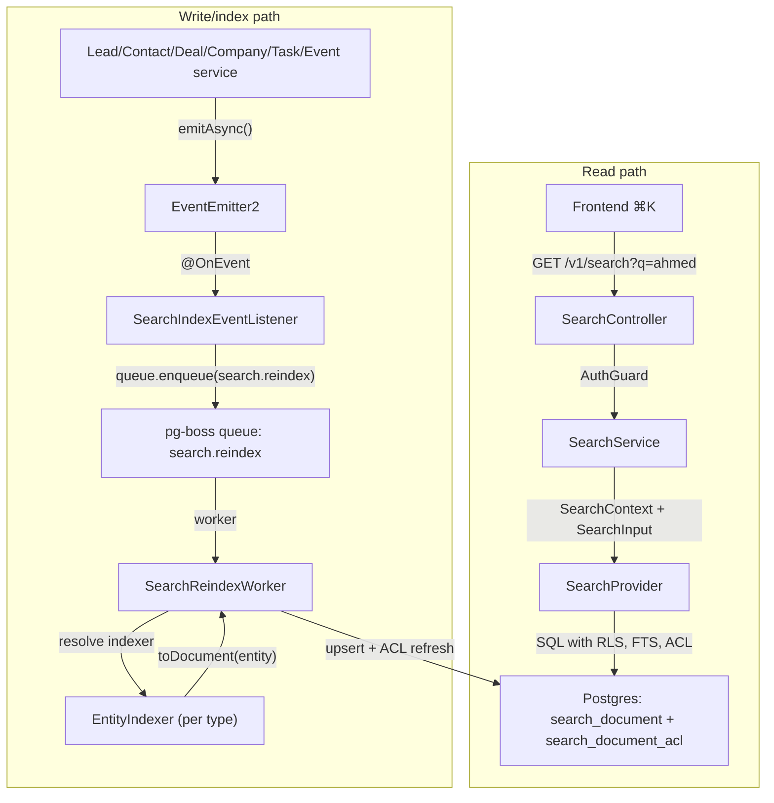

<Note>
**Version:** 0.6 (Phase 1 complete — backend + frontend ⌘K)  
**Last Updated:** May 2026  
**Status:** **Phase 1 (backend read/index + frontend ⌘K) landed** — Phase 1B **Steps 1–12**, Phase 1C **Steps 1–8**, Phase 1D **Steps 1–6**, Phase 1E **Steps 1–8** (frontend palette + Playwright smoke + §10 doc sync)
</Note>

This document specifies the design of a permission-aware **global search** feature for PropWise CRM. Foundation work (Steps 2–9: module scaffold, worker/maintenance handlers, `SearchProvider` interface, indexer infrastructure, `normalizeSearchText()` §6.8, `buildSearchPermissionWhereClause()` §7.3, backfill script §6.4, unit tests) is implemented under `src/modules/search/`. **Phase 1B–1D** backend indexer/read paths and cross-doc sync are landed. **Phase 1E** frontend ⌘K palette is landed in `propwise-crm-frontend` (§10).

## Design summary in 5 bullets

Read this section first. It is enough to know **what to build** before diving into per-entity field mapping or the full specification.

<CardGroup cols={2}>
<Card title="What ships" icon="search">
One tenant-scoped read endpoint — `GET /v1/search` — backed by a denormalized `search_document` table (one row per Lead, Contact, Deal, Company, Task, Event). Stakeholder-gated entities also get rows in `search_document_acl`. The frontend ⌘K palette consumes lightweight hits; full detail loads on click.
</Card>

<Card title="Two pipelines, one table" icon="diagram-project">
Search is **read** (sync SQL, P95 < 300ms) and **index** (async, ~2s P95 lag) decoupled. Domain services emit events → pg-boss queue `search.reindex` → `SearchReindexWorker` → per-entity `EntityIndexer.toDocument()` → upsert + ACL diff refresh.
</Card>

<Card title="What you implement" icon="code">
Migrations for `search_document` / `search_document_acl`, `SearchModule` + `PostgresSearchProvider`, the reindex worker, **`LeadIndexer` and `ContactIndexer`** in their owning CRM modules, event wiring, shared **`normalizeSearchText()`**, and E2E tests.
</Card>

<Card title="Permissions are not optional" icon="shield-check">
Contact, Deal, and Company use `visibility = 'stakeholder_only'` — indexers project `(user_id, team_id, access_level)` into `search_document_acl`; the read path filters with a fast `EXISTS`. **Lead** is normally `stakeholder_only` but switches to `'org_wide'` while **unassigned**.
</Card>
</CardGroup>



## Overview & Goals

### Definition

**Global search** is a single endpoint (`GET /v1/search`) and a single frontend surface (the ⌘K command palette) that lets a user type any keyword, name, public ID, email, or phone fragment and see matching CRM records they are authorized to view, ranked by relevance and recency. It is permission-aware and tenant-scoped.

<Info>
**Backend** indexing is eventually consistent (~2s p95; longer under backlog). **Frontend** shows the creator their own just-created items immediately via client-side pins so "create → ⌘K" never feels broken.
</Info>

### Goals (Phase 1)

| Goal | Description | Acceptance |
|------|-------------|------------|
| G1 | One endpoint covers Lead, Contact, Deal, Company, Task, Event | A single request returns hits across all six entity types in one ranked list |
| G2 | Results respect existing org RLS and per-row stakeholder ACLs | An agent searching `ahmed` never sees a lead they are not a stakeholder on |
| G3 | Read-your-writes within ~2 seconds + immediate creator UX | Backend: newly created/updated entity appears within indexer P95 lag (~2s). Frontend: creator sees their own just-created items immediately |
| G4 | Provider-swappable architecture | Swapping Postgres provider for OpenSearch/Typesense requires zero changes to controllers/services |
| G5 | Phone and email substring matching for PII | Typing `+9715…` or `ahmed@` returns the matching person |
| G6 | Picker-style response shape | Lightweight hits (id, title, subtitle, entity type, permissions, score) |
| G7 | Arabic + mixed-script search (UAE market) | Typing `أحمد`, `احمد`, or `ahmed` finds the same lead |

### Non-goals (Phase 1)

<Warning>
The following are explicitly out of scope for Phase 1:
- Searching the audit log (`audit_log` table) - sensitive data with admin-only UI
- Cross-org / global search for system admins
- User, Team, Off-plan project/unit, Conversation, Message, etc. - reserved for Phase 2/3
- Search-as-you-type analytics
- Saved searches / pinned results / alerts
- Synchronous search index on create (blocking CRM write)
</Warning>

## Architecture

### Core Components

The search system consists of two decoupled pipelines:

<Tabs>
<Tab title="Read Pipeline">
**Synchronous** - handles `GET /v1/search` requests

1. `SearchController` receives request with auth context
2. `SearchService` validates input and builds search context
3. `SearchProvider` (Postgres implementation) executes SQL with:
   - Row-level security (RLS) filtering
   - Full-text search (FTS) matching
   - ACL permission checks
4. Returns lightweight hits for frontend consumption

**Performance target:** P95 < 300ms
</Tab>

<Tab title="Index Pipeline">
**Asynchronous** - handles entity updates

1. Domain services emit events on entity changes
2. `SearchIndexEventListener` catches events via `@OnEvent`
3. Events queued to pg-boss `search.reindex` queue
4. `SearchReindexWorker` processes queue items
5. Entity-specific indexers generate search documents
6. Upsert to `search_document` + ACL refresh

**Performance target:** P95 ~2s lag under normal load
</Tab>
</Tabs>

### Module Structure

```
src/modules/search/
├── search.module.ts                 # SearchModule + providers
├── controllers/
│   └── search.controller.ts         # GET /v1/search endpoint
├── services/
│   └── search.service.ts            # Business logic layer  
├── providers/
│   ├── search-provider.interface.ts # Swappable provider contract
│   └── postgres-search.provider.ts  # Postgres implementation
├── workers/
│   ├── search-reindex.worker.ts     # pg-boss queue consumer
│   └── search-maintenance.worker.ts # Cleanup/health jobs
├── listeners/
│   └── search-index-event.listener.ts # Domain event → queue
├── interfaces/
│   ├── search-context.interface.ts   # User + tenant context
│   ├── search-input.interface.ts     # Query parameters
│   └── search-result.interface.ts    # Response shape
├── scripts/
│   └── search-backfill.script.ts     # One-time org reindex
└── utils/
    └── search-text.util.ts           # normalizeSearchText()
```

## Data Model

### Core Tables

<CodeGroup>
```sql search_document
CREATE TABLE search_document (
    id uuid PRIMARY KEY DEFAULT gen_random_uuid(),
    org_id uuid NOT NULL REFERENCES orgs(id) ON DELETE CASCADE,
    entity_type text NOT NULL, -- 'lead', 'contact', 'deal', etc.
    entity_id uuid NOT NULL,
    
    -- Display fields (picker UI)
    title text NOT NULL,
    subtitle text,
    
    -- Search content
    search_vector tsvector NOT NULL,
    normalized_text text NOT NULL,
    
    -- Metadata  
    visibility text NOT NULL, -- 'org_wide' | 'stakeholder_only'
    created_at timestamptz NOT NULL DEFAULT now(),
    updated_at timestamptz NOT NULL DEFAULT now(),
    
    CONSTRAINT search_document_entity_unique 
        UNIQUE (org_id, entity_type, entity_id)
);
```

```sql search_document_acl
CREATE TABLE search_document_acl (
    id uuid PRIMARY KEY DEFAULT gen_random_uuid(),
    search_document_id uuid NOT NULL REFERENCES search_document(id) ON DELETE CASCADE,
    user_id uuid REFERENCES users(id) ON DELETE CASCADE,
    team_id uuid REFERENCES teams(id) ON DELETE CASCADE,
    access_level text NOT NULL, -- 'read', 'write', 'admin'
    
    CONSTRAINT search_acl_user_or_team_check 
        CHECK ((user_id IS NOT NULL) != (team_id IS NOT NULL))
);
```
</CodeGroup>

### Indexes

<CodeGroup>
```sql performance_indexes
-- Core search performance
CREATE INDEX idx_search_document_org_visibility 
    ON search_document(org_id, visibility);

CREATE INDEX idx_search_document_search_vector 
    ON search_document USING gin(search_vector);

CREATE INDEX idx_search_document_normalized_text 
    ON search_document USING gin(normalized_text gin_trgm_ops);

-- ACL lookup performance  
CREATE INDEX idx_search_acl_document_user 
    ON search_document_acl(search_document_id, user_id);

CREATE INDEX idx_search_acl_document_team 
    ON search_document_acl(search_document_id, team_id);
```

```sql entity_lookup_indexes
-- Fast entity type filtering
CREATE INDEX idx_search_document_org_type_updated 
    ON search_document(org_id, entity_type, updated_at DESC);

-- Public ID search (exact match boost)
CREATE INDEX idx_search_document_entity_lookup 
    ON search_document(org_id, entity_type, entity_id);
```
</CodeGroup>

## Per-Entity Field Mapping

This section defines exactly what gets indexed for each entity type. **Read this before implementing any indexer.**

<AccordionGroup>
<Accordion title="Lead Indexer">
**Source:** `leads` table + related `contacts`/`people`

```typescript
interface LeadDocument {
  title: string;        // `${lead.first_name} ${lead.last_name}`.trim() || lead.public_id
  subtitle: string;     // lead.phone || lead.email || lead.company || null
  body: string[];       // All searchable text content
  visibility: string;   // 'stakeholder_only' | 'org_wide' (unassigned leads)
}
```

**Body content includes:**
- Lead public ID (`L-12345`)
- First name, last name, full name
- Email, phone (normalized)
- Company name
- Source, stage, campaign
- Lead-specific custom fields
- Notes (truncated to first 500 chars)

**ACL Logic:**
- If assigned → `visibility = 'stakeholder_only'` + project stakeholders to ACL
- If unassigned → `visibility = 'org_wide'` + no ACL rows (matches POOL list behavior)

**Reindex Triggers:**
- Lead CRUD operations
- Stakeholder assignments/removals  
- Person contact info updates (if linked)
</Accordion>

<Accordion title="Contact Indexer">
**Source:** `contacts` table + related `people`

```typescript
interface ContactDocument {
  title: string;        // `${person.first_name} ${person.last_name}`.trim() || contact.public_id
  subtitle: string;     // person.phone || person.email || contact.company_name || null
  body: string[];       // All searchable text content
  visibility: 'stakeholder_only'; // Always stakeholder-gated
}
```

**Body content includes:**
- Contact public ID (`C-12345`)
- Person first name, last name, full name
- Email, phone (normalized from person)
- Company name
- Job title, department
- Contact-specific custom fields  
- Notes (truncated)

**ACL Logic:**
- Always `visibility = 'stakeholder_only'`
- Project all contact stakeholders to ACL table

**Reindex Triggers:**
- Contact CRUD operations
- Person contact info updates
- Stakeholder assignments/removals
</Accordion>

<Accordion title="Deal Indexer">  
**Source:** `deals` table + related data

```typescript
interface DealDocument {
  title: string;        // deal.name || deal.public_id
  subtitle: string;     // `$${deal.value} • ${deal.stage}` || deal.company_name || null
  body: string[];       // All searchable text content
  visibility: 'stakeholder_only'; // Always stakeholder-gated
}
```

**Body content includes:**
- Deal public ID (`D-12345`)
- Deal name, description
- Company name
- Deal value, currency, stage
- Property details (if linked)
- Deal-specific custom fields
- Notes (truncated)

**Reindex Triggers:**
- Deal CRUD operations  
- Stage/value updates
- Stakeholder assignments/removals
- Property link changes
</Accordion>

<Accordion title="Company Indexer">
**Source:** `companies` table

```typescript
interface CompanyDocument {
  title: string;        // company.name || company.public_id
  subtitle: string;     // company.industry || company.location || null
  body: string[];       // All searchable text content  
  visibility: 'stakeholder_only'; // Always stakeholder-gated
}
```

**Body content includes:**
- Company public ID (`CO-12345`)
- Company name, legal name
- Industry, company type
- Location, address
- Website, main phone
- Company-specific custom fields
- Notes (truncated)

**Reindex Triggers:**
- Company CRUD operations
- Stakeholder assignments/removals
</Accordion>

<Accordion title="Task Indexer">
**Source:** `tasks` table + related entities

```typescript
interface TaskDocument {
  title: string;        // task.title || task.public_id
  subtitle: string;     // `${task.type} • Due ${task.due_date}` || related entity info
  body: string[];       // All searchable text content
  visibility: 'org_wide'; // Always org-wide (no ACL rows)
}
```

**Body content includes:**
- Task public ID (`T-12345`)
- Task title, description
- Task type, priority, status
- Due date, completed date
- Assignee name
- Related entity info (lead/contact/deal name)

**Reindex Triggers:**
- Task CRUD operations
- Assignment changes
- Related entity updates (name changes)
</Accordion>

<Accordion title="Event Indexer">
**Source:** `events` table + related entities

```typescript
interface EventDocument {
  title: string;        // event.title || event.public_id
  subtitle: string;     // `${event.type} • ${event.start_date}` || location
  body: string[];       // All searchable text content
  visibility: 'org_wide'; // Always org-wide (no ACL rows)  
}
```

**Body content includes:**
- Event public ID (`E-12345`)
- Event title, description
- Event type, category
- Start/end dates, location
- Attendee names
- Related entity info

**Reindex Triggers:**
- Event CRUD operations
- Attendee changes
- Related entity updates
</Accordion>
</AccordionGroup>

## Indexing Pipeline

### Queue Configuration

<CodeGroup>
```typescript queue_setup
// In SearchModule
const queueConfig = {
  name: 'search.reindex',
  retryLimit: 3,
  retryDelay: 30, // seconds
  expireInMinutes: 60 * 24, // 24 hours
};
```

```typescript worker_registration
@Worker('search.reindex')
export class SearchReindexWorker {
  async process(job: Job<SearchReindexPayload>) {
    const { orgId, entityType, entityId, operation } = job.data;
    
    try {
      await this.reindexEntity(orgId, entityType, entityId, operation);
    } catch (error) {
      this.logger.error('Reindex failed', { job: job.data, error });
      throw error; // Triggers retry
    }
  }
}
```
</CodeGroup>

### Event Flow

<Steps>
<Step title="Domain Event Emission">
Domain services emit events after successful database operations:

```typescript
// In LeadService.create()
await this.leadRepository.save(lead);
await this.eventEmitter.emitAsync('lead.created', { 
  orgId, 
  leadId: lead.id,
  lead 
});
```
</Step>

<Step title="Event Listener Queuing">
The search event listener catches domain events and queues reindex jobs:

```typescript
@OnEvent('lead.created')
@OnEvent('lead.updated')
@OnEvent('lead.deleted')
async handleLeadEvent(payload: LeadEventPayload) {
  await this.searchQueue.add('search.reindex', {
    orgId: payload.orgId,
    entityType: 'lead',
    entityId: payload.leadId,
    operation: payload.operation // 'create' | 'update' | 'delete'
  });
}
```
</Step>

<Step title="Worker Processing">
The reindex worker resolves the appropriate indexer and processes the entity:

```typescript
async reindexEntity(orgId: string, entityType: string, entityId: string, operation: string) {
  const indexer = this.getIndexer(entityType);
  
  if (operation === 'delete') {
    await this.searchProvider.deleteDocument(orgId, entityType, entityId);
    return;
  }
  
  const entity = await indexer.loadEntity(orgId, entityId);
  if (!entity) {
    await this.searchProvider.deleteDocument(orgId, entityType, entityId);
    return;
  }
  
  const document = await indexer.toDocument(entity);
  await this.searchProvider.upsertDocument(document);
}
```
</Step>

<Step title="Document Upsert & ACL Refresh">
The search provider handles database operations with proper ACL management:

```typescript
async upsertDocument(document: SearchDocument) {
  await this.db.transaction(async (trx) => {
    // Upsert main document
    await trx('search_document')
      .insert(document)
      .onConflict(['org_id', 'entity_type', 'entity_id'])
      .merge();
    
    // Refresh ACL if stakeholder-gated
    if (document.visibility === 'stakeholder_only') {
      await this.refreshDocumentAcl(trx, document.id, document.acl);
    }
  });
}
```
</Step>
</Steps>

### Text Normalization

The `normalizeSearchText()` utility handles Arabic/mixed-script normalization:

<CodeGroup>
```typescript normalization_function
export function normalizeSearchText(text: string): string {
  if (!text) return '';
  
  return text
    .toLowerCase()
    .trim()
    // Normalize Arabic characters
    .replace(/[أإآا]/g, 'ا') // Alif variations → base alif
    .replace(/[ىي]/g, 'ي')   // Ya variations → base ya  
    .replace(/ة/g, 'ه')      // Ta marbuta → ha
    .replace(/[٠-٩]/g, (d) => String.fromCharCode(d.charCodeAt(0) - '٠'.charCodeAt(0) + '0'.charCodeAt(0))) // Arabic-Indic digits
    // Remove diacritics
    .replace(/[\u064B-\u0652]/g, '')
    // Normalize whitespace
    .replace(/\s+/g, ' ');
}
```

```typescript indexer_usage
// In entity indexers
async toDocument(lead: Lead): Promise<SearchDocument> {
  const bodyParts = [
    lead.publicId,
    lead.firstName,
    lead.lastName,
    lead.email,
    lead.phone,
    // ... other fields
  ].filter(Boolean);
  
  const normalizedText = normalizeSearchText(bodyParts.join(' '));
  const searchVector = await this.buildSearchVector(bodyParts);
  
  return {
    // ... other fields
    normalizedText,
    searchVector,
  };
}
```
</CodeGroup>

## Permission Gate

### ACL Query Strategy

The search permission system uses an `EXISTS` subquery for stakeholder-gated entities, which leverages indexes for fast filtering:

<CodeGroup>
```sql permission_query
SELECT 
  sd.id,
  sd.entity_type,
  sd.entity_id, 
  sd.title,
  sd.subtitle,
  ts_rank(sd.search_vector, plainto_tsquery('english', $query)) as relevance_score
FROM search_document sd
WHERE sd.org_id = $orgId
  AND (
    -- Org-wide entities (Task, Event)
    sd.visibility = 'org_wide'
    OR 
    -- Stakeholder-gated entities with permission check
    (sd.visibility = 'stakeholder_only' AND EXISTS(
      SELECT 1 FROM search_document_acl acl 
      WHERE acl.search_document_id = sd.id
        AND (
          acl.user_id = $userId 
          OR acl.team_id = ANY($userTeamIds)
        )
    ))
  )
  AND (
    sd.search_vector @@ plainto_tsquery('english', $query)
    OR sd.normalized_text ILIKE $fuzzyQuery
  )
ORDER BY relevance_score DESC, sd.updated_at DESC
LIMIT $limit;
```

```typescript permission_helper
export function buildSearchPermissionWhereClause(
  userContext: SearchContext,
  entityTypeFilter?: string[]
): WhereClause {
  const baseWhere = {
    org_id: userContext.orgId,
  };
  
  if (entityTypeFilter?.length) {
    baseWhere.entity_type = { $in: entityTypeFilter };
  }
  
  // Permission filtering via EXISTS subquery
  const permissionClause = {
    $or: [
      { visibility: 'org_wide' },
      { 
        visibility: 'stakeholder_only',
        $exists: {
          table: 'search_document_acl',
          where: {
            search_document_id: { $ref: 'search_document.id' },
            $or: [
              { user_id: userContext.userId },
              { team_id: { $in: userContext.teamIds } }
            ]
          }
        }
      }
    ]
  };
  
  return { ...baseWhere, ...permissionClause };
}
```
</CodeGroup>

### Lead Visibility Logic

Leads have special visibility rules based on assignment status:

<Tip>
**Key insight:** Unassigned leads are `org_wide` to match the always-available POOL list tab. Once assigned, they become `stakeholder_only`.
</Tip>

```typescript
// In LeadIndexer
async determineVisibility(lead: Lead): Promise<{
  visibility: 'org_wide' | 'stakeholder_only';
  acl: AclEntry[];
}> {
  const stakeholders = await this.getLeadStakeholders(lead.id);
  
  if (stakeholders.length === 0) {
    // Unassigned lead → org-wide visibility (POOL accessible)
    return {
      visibility: 'org_wide',
      acl: []
    };
  }
  
  // Assigned lead → stakeholder-only
  return {
    visibility: 'stakeholder_only', 
    acl: stakeholders.map(s => ({
      userId: s.userId,
      teamId: s.teamId,
      accessLevel: s.accessLevel
    }))
  };
}
```

## Ranking & Query Construction

### Multi-Strategy Search

The search system uses multiple strategies combined with ranking:

<CodeGroup>
```typescript search_strategies
interface SearchStrategy {
  name: string;
  weight: number;
  execute(query: string): Promise<SearchHit[]>;
}

const strategies = [
  {
    name: 'exact_match',
    weight: 10.0,
    execute: (query) => this.exactMatchSearch(query)
  },
  {
    name: 'full_text_search', 
    weight: 5.0,
    execute: (query) => this.fullTextSearch(query)
  },
  {
    name: 'trigram_fuzzy',
    weight: 1.0, 
    execute: (query) => this.trigramSearch(query)
  }
];
```

```sql exact_match_boost
-- Exact public ID match gets highest score
SELECT *, 
  CASE 
    WHEN title ILIKE $exactQuery THEN 10.0
    WHEN entity_id::text = $publicIdExtract THEN 8.0  
    ELSE ts_rank(search_vector, query) + similarity(normalized_text, $query)
  END as final_score
FROM search_document sd
WHERE -- ... permission filters
ORDER BY final_score DESC;
```
</CodeGroup>

### Arabic Text Matching

Special handling for Arabic and mixed-script queries:

```typescript
function buildArabicAwareQuery(input: string): {
  normalizedQuery: string;
  fuzzyPatterns: string[];
  tsQuery: string;
} {
  const normalized = normalizeSearchText(input);
  
  return {
    normalizedQuery: normalized,
    fuzzyPatterns: [
      `%${normalized}%`,
      `%${input.toLowerCase()}%`, // Original form
    ],
    tsQuery: `${normalized}:* | ${input}:*` // Prefix matching
  };
}
```

## API Contract

### Request/Response Format

<CodeGroup>
```typescript request_interface
interface SearchInput {
  q: string;                    // Query string (required)
  entity_types?: string[];      // Filter by entity types
  limit?: number;              // Max results (default: 20, max: 50)  
  offset?: number;             // Pagination offset
}

// GET /v1/search?q=ahmed&entity_types=lead,contact&limit=10
```

```typescript response_interface  
interface SearchResponse {
  hits: SearchHit[];
  total: number;
  took_ms: number;
  debug?: {
    normalized_query: string;
    strategies_used: string[];
    permission_context: {
      user_id: string;
      team_ids: string[];  
    };
  };
}

interface SearchHit {
  id: string;
  entity_type: 'lead' | 'contact' | 'deal' | 'company' | 'task' | 'event';
  entity_id: string;
  title: string;
  subtitle?: string;
  score: number;
  permissions: {
    can_read: boolean;
    can_write: boolean;
    access_level: 'read' | 'write' | 'admin';
  };
  created_at: string;
  updated_at: string;
}
```
</CodeGroup>

### Error Handling

<CodeGroup>
```typescript validation_errors
// 400 Bad Request examples
{
  "error": "INVALID_QUERY", 
  "message": "Query string 'q' is required",
  "details": {
    "field": "q",
    "constraint": "minLength:1"
  }
}

{
  "error": "INVALID_ENTITY_TYPES",
  "message": "Invalid entity type: 'invalid_type'", 
  "details": {
    "allowed": ["lead", "contact", "deal", "company", "task", "event"],
    "received": ["lead", "invalid_type"]
  }
}
```

```typescript system_errors
// 500 Internal Server Error
{
  "error": "SEARCH_PROVIDER_ERROR",
  "message": "Search index temporarily unavailable",
  "correlation_id": "search_req_123abc"
}

// 503 Service Unavailable (maintenance mode)
{
  "error": "SEARCH_MAINTENANCE", 
  "message": "Search is temporarily disabled for maintenance",
  "retry_after_seconds": 300
}
```
</CodeGroup>

## Frontend Contract

### ⌘K Command Palette Integration

The frontend implements a command palette that integrates with the search API:

<CodeGroup>
```typescript frontend_integration
// Frontend search service
class SearchService {
  async search(query: string, options?: SearchOptions): Promise<SearchResponse> {
    const params = new URLSearchParams({
      q: query,
      limit: String(options?.limit || 20)
    });
    
    if (options?.entityTypes?.length) {
      params.append('entity_types', options.entityTypes.join(','));
    }
    
    const response = await fetch(`/api/v1/search?${params}`, {
      headers: { 'Authorization': `Bearer ${this.getToken()}` }
    });
    
    return response.json();
  }
}
```

```tsx command_palette_component
export function CommandPalette() {
  const [query, setQuery] = useState('');
  const [results, setResults] = useState<SearchHit[]>([]);
  const [justCreated, setJustCreated] = useState<SearchHit[]>([]);
  
  const { data, isLoading } = useQuery({
    queryKey: ['search', query],
    queryFn: () => searchService.search(query),
    enabled: query.length > 0,
    staleTime: 30_000 // 30s cache
  });
  
  return (
    <Combobox value={selectedHit} onChange={handleSelect}>
      <ComboboxInput 
        value={query}
        onChange={(e) => setQuery(e.target.value)}
        placeholder="Search leads, contacts, deals..."
      />
      
      <ComboboxOptions>
        {/* Just created items (client-side) */}
        {justCreated.length > 0 && (
          <div className="search-group">
            <div className="search-group-header">Just created</div>
            {justCreated.map(hit => (
              <SearchHitItem key={hit.id} hit={hit} />
            ))}
          </div>
        )}
        
        {/* Search results */}
        {results.map(hit => (
          <SearchHitItem key={hit.id} hit={hit} />  
        ))}
      </ComboboxOptions>
    </Combobox>
  );
}
```
</CodeGroup>

### Just Created UX Pattern

<Info>
To provide immediate feedback when users create entities, the frontend maintains a client-side "just created" list that appears at the top of search results until the backend indexer catches up.
</Info>

```typescript
// In entity creation flows
async function createLead(data: CreateLeadInput) {
  const lead = await leadService.create(data);
  
  // Add to client-side "just created" list
  const searchHit: SearchHit = {
    id: `temp_${lead.id}`,
    entity_type: 'lead',
    entity_id: lead.id,
    title: `${lead.firstName} ${lead.lastName}`.trim() || lead.publicId,
    subtitle: lead.phone || lead.email,
    score: 999, // Always at top
    permissions: { can_read: true, can_write: true, access_level: 'admin' },
    created_at: new Date().toISOString(),
    updated_at: new Date().toISOString(),
  };
  
  addToJustCreated(searchHit);
  
  // Remove from just-created after indexer delay
  setTimeout(() => removeFromJustCreated(searchHit.id), 5000);
}
```

## SearchProvider Abstraction

The `SearchProvider` interface enables swapping search backends without changing business logic:

<CodeGroup>
```typescript provider_interface
export interface SearchProvider {
  search(context: SearchContext, input: SearchInput): Promise<SearchResponse>;
  upsertDocument(document: SearchDocument): Promise<void>;
  deleteDocument(orgId: string, entityType: string, entityId: string): Promise<void>;
  reindexOrg(orgId: string): Promise<void>;
  getHealth(): Promise<SearchHealth>;
}

export interface SearchDocument {
  id: string;
  orgId: string;
  entityType: string;
  entityId: string;
  title: string;
  subtitle?: string;
  searchVector: string; // Provider-specific format
  normalizedText: string;
  visibility: 'org_wide' | 'stakeholder_only';
  acl: AclEntry[];
  createdAt: Date;
  updatedAt: Date;
}
```

```typescript postgres_implementation
@Injectable()
export class PostgresSearchProvider implements SearchProvider {
  async search(context: SearchContext, input: SearchInput): Promise<SearchResponse> {
    const startTime = Date.now();
    const whereClause = buildSearchPermissionWhereClause(context, input.entityTypes);
    const { normalizedQuery, fuzzyPatterns, tsQuery } = buildArabicAwareQuery(input.q);
    
    const query = this.knex('search_document as sd')
      .select([
        'sd.id',
        'sd.entity_type', 
        'sd.entity_id',
        'sd.title',
        'sd.subtitle',
        'sd.created_at',
        'sd.updated_at'
      ])
      .where(whereClause)
      .where(builder => {
        builder
          .whereRaw('sd.search_vector @@ plainto_tsquery(\'english\', ?)', [input.q])
          .orWhere('sd.normalized_text', 'ilike', fuzzyPatterns[0]);
      })
      .orderByRaw('ts_rank(sd.search_vector, plainto_tsquery(\'english\', ?)) DESC', [input.q])
      .orderBy('sd.updated_at', 'desc')
      .limit(input.limit || 20)
      .offset(input.offset || 0);
    
    const hits = await query;
    const enrichedHits = await this.enrichWithPermissions(hits, context);
    
    return {
      hits: enrichedHits,
      total: hits.length, // TODO: Add count query
      took_ms: Date.now() - startTime
    };
  }
  
  // ... other methods
}
```
</CodeGroup>

## Phased Rollout

<Steps>
<Step title="Phase 1A: Foundation (Complete)">
**Status:** ✅ Complete

- Core module structure and interfaces
- Database migrations  
- `SearchProvider` abstraction
- Queue infrastructure and workers
- Text normalization utilities
- Basic unit tests
</Step>

<Step title="Phase 1B: Lead + Contact (Complete)">
**Status:** ✅ Complete

- `LeadIndexer` and `ContactIndexer` implementations
- Event wiring in domain services
- Permission ACL handling for stakeholders
- Lead unassigned → org-wide visibility logic
- E2E tests with Arabic text scenarios
</Step>

<Step title="Phase 1C: Deal + Company (Complete)">
**Status:** ✅ Complete  

- `DealIndexer` and `CompanyIndexer` implementations
- Stakeholder-only permission handling
- Property/deal linking in search content
- Extended E2E test coverage
</Step>

<Step title="Phase 1D: Task + Event (Complete)">
**Status:** ✅ Complete

- `TaskIndexer` and `EventIndexer` implementations  
- Org-wide visibility (no ACL rows)
- Related entity info in search content
- Full entity type coverage testing
</Step>

<Step title="Phase 1E: Frontend ⌘K (Complete)">
**Status:** ✅ Complete

- Command palette UI component
- Search API integration with query caching
- "Just created" client-side UX pattern
- Keyboard navigation and accessibility
- Playwright E2E tests for search flow
</Step>
</Steps>

<Check>
**Phase 1 Complete!** All backend indexing, permission handling, and frontend ⌘K functionality is now live.
</Check>

## Testing Strategy

### Unit Tests

<CodeGroup>
```typescript indexer_tests
describe('LeadIndexer', () => {
  describe('toDocument', () => {
    it('should generate correct search document for assigned lead', async () => {
      const lead = createMockLead({ 
        firstName: 'أحمد',
        lastName: 'Smith',
        phone: '+971501234567'
      });
      
      const document = await indexer.toDocument(lead);
      
      expect(document.title).toBe('أحمد Smith');
      expect(document.normalizedText).toContain('احمد'); // Normalized Arabic
      expect(document.normalizedText).toContain('0501234567'); // Normalized phone  
      expect(document.visibility).toBe('stakeholder_only');
      expect(document.acl).toHaveLength(2); // Lead owner + team
    });
    
    it('should set org_wide visibility for unassigned lead', async () => {
      const unassignedLead = createMockLead({ stakeholders: [] });
      
      const document = await indexer.toDocument(unassignedLead);
      
      expect(document.visibility).toBe('org_wide');
      expect(document.acl).toHaveLength(0);
    });
  });
});
```

```typescript permission_tests
describe('buildSearchPermissionWhereClause', () => {
  const userContext = {
    userId: 'user123',
    orgId: 'org456', 
    teamIds: ['team789']
  };
  
  it('should allow org-wide entities for any user', () => {
    const whereClause = buildSearchPermissionWhereClause(userContext);
    
    expect(whereClause).toMatchObject({
      org_id: 'org456',
      $or: [
        { visibility: 'org_wide' },
        { 
          visibility: 'stakeholder_only',
          $exists: expect.objectContaining({
            table: 'search_document_acl'
          })
        }
      ]
    });
  });
});
```
</CodeGroup>

### Integration Tests  

<CodeGroup>
```typescript e2e_search_test
describe('GET /v1/search', () => {
  it('should return permission-filtered results', async () => {
    // Create test data with different stakeholder assignments
    const { user1, user2, org } = await setupTestOrg();
    const lead1 = await createLead({ org, stakeholders: [user1] });
    const lead2 = await createLead({ org, stakeholders: [user2] });
    const task = await createTask({ org }); // org-wide
    
    // User1 searches
    const response = await request(app)
      .get('/v1/search?q=test')
      .set('Authorization', `Bearer ${user1.token}`)
      .expect(200);
    
    expect(response.body.hits).toHaveLength(2); // lead1 + task
    expect(response.body.hits.map(h => h.entity_id)).toContain(lead1.id);
    expect(response.body.hits.map(h => h.entity_id)).toContain(task.id);
    expect(response.body.hits.map(h => h.entity_id)).not.toContain(lead2.id);
  });
  
  it('should handle Arabic text search correctly', async () => {
    const lead = await createLead({
      firstName: 'أحمد',
      phone: '+۹۷۱۵۰۱۲۳۴۵۶۷' // Arabic-Indic digits
    });
    
    // Search with different Arabic forms
    const queries = ['أحمد', 'احمد', 'ahmed', '9715012', '۹۷۱۵۰۱۲'];
    
    for (const query of queries) {
      const response = await request(app)
        .get(`/v1/search?q=${encodeURIComponent(query)}`)
        .set('Authorization', `Bearer ${user.token}`)
        .expect(200);
      
      expect(response.body.hits).toHaveLength(1);
      expect(response.body.hits[0].entity_id).toBe(lead.id);
    }
  });
});
```

```typescript indexer_integration_test
describe('Search Indexing Pipeline', () => {
  it('should index lead on creation within SLA', async () => {
    const startTime = Date.now();
    
    // Create lead (triggers indexing)
    const lead = await leadService.create({
      firstName: 'Test',
      lastName: 'User',
      orgId: org.id
    });
    
    // Wait for indexer (max 5 seconds)
    await waitForCondition(
      async () => {
        const results = await searchService.search(
          { userId: user.id, orgId: org.id },
          { q: 'Test User' }
        );
        return results.hits.length > 0;
      },
      { timeoutMs: 5000, intervalMs: 100 }
    );
    
    const indexingTime = Date.now() - startTime;
    expect(indexingTime).toBeLessThan(3000); // 3s SLA
  });
});
```
</CodeGroup>

### Bulk Throughput Gate

<Warning>
The system must handle bulk operations without degrading search performance:
</Warning>

```typescript
describe('Bulk Operations Performance', () => {
  it('should handle 1000 lead bulk import within throughput SLA', async () => {
    const leads = Array.from({ length: 1000 }, (_, i) => ({
      firstName: `Lead${i}`,
      lastName: 'BulkImport',
      orgId: org.id
    }));
    
    const startTime = Date.now();
    
    // Bulk create
    await leadService.bulkCreate(leads);
    
    // Wait for all to be indexed
    await waitForCondition(
      async () => {
        const results = await searchService.search(
          { userId: user.id, orgId: org.id },
          { q: 'BulkImport', limit: 50 }
        );
        return results.hits.length >= 50; // First page fully indexed
      },
      { timeoutMs: 30000 } // 30s timeout for bulk
    );
    
    const totalTime = Date.now() - startTime;
    expect(totalTime).toBeLessThan(30000); // 30s SLA
    
    // Search performance should not degrade
    const searchStartTime = Date.now();
    await searchService.search(
      { userId: user.id, orgId: org.id }, 
      { q: 'BulkImport' }
    );
    const searchTime = Date.now() - searchStartTime;
    expect(searchTime).toBeLessThan(500); // 500ms search SLA
  });
});
```

## Operations & Monitoring

### Health Checks

<CodeGroup>
```typescript health_endpoint
@Controller('health')
export class HealthController {
  @Get('search')
  async searchHealth() {
    const health = await this.searchProvider.getHealth();
    
    return {
      status: health.isHealthy ? 'healthy' : 'unhealthy',
      timestamp: new Date().toISOString(),
      metrics: {
        index_lag_seconds: health.indexLagSeconds,
        queue_depth: health.queueDepth,
        last_successful_index: health.lastSuccessfulIndex,
        error_rate_percent: health.errorRatePercent
      },
      checks: {
        database_connection: health.dbConnected,
        queue_processing: health.queueProcessing,  
        index_freshness: health.indexLagSeconds < 300 // 5 min threshold
      }
    };
  }
}
```

```typescript monitoring_metrics
// Metrics collection in SearchService
export class SearchService {
  private readonly metrics = {
    searchRequests: new promClient.Counter({
      name: 'search_requests_total',
      help: 'Total search requests',
      labelNames: ['org_id', 'entity_types', 'status']
    }),
    
    searchLatency: new promClient.Histogram({
      name: 'search_latency_seconds', 
      help: 'Search request latency',
      labelNames: ['org_id'],
      buckets: [0.1, 0.25, 0.5, 1, 2.5, 5, 10]
    }),
    
    indexingLag: new promClient.Histogram({
      name: 'search_indexing_lag_seconds',
      help: 'Time between entity update and search index',
      labelNames: ['entity_type'],
      buckets: [1, 2, 5, 10, 30, 60, 300]  
    })
  };
  
  async search(context: SearchContext, input: SearchInput): Promise<SearchResponse> {
    const timer = this.metrics.searchLatency.startTimer({ org_id: context.orgId });
    
    try {
      const result = await this.searchProvider.search(context, input);
      
      this.metrics.searchRequests.inc({
        org_id: context.orgId,
        entity_types: input.entityTypes?.join(',') || 'all',
        status: 'success'
      });
      
      return result;
    } catch (error) {
      this.metrics.searchRequests.inc({
        org_id: context.orgId, 
        entity_types: input.entityTypes?.join(',') || 'all',
        status: 'error'
      });
      throw error;
    } finally {
      timer();
    }
  }
}
```
</CodeGroup>

### Alerting Rules

<Info>
Key operational alerts for the search system:
</Info>

| Alert | Condition | Severity | Action |
|-------|-----------|----------|---------|
| High Search Latency | P95 > 1s for 5 min | Warning | Check database performance |
| Search Index Lag | P95 indexing lag > 30s | Warning | Check queue backlog |
| Search Error Rate | Error rate > 5% for 10 min | Critical | Page on-call engineer |
| Queue Depth High | >1000 pending jobs for 15 min | Warning | Scale indexer workers |
| Search Outage | Health check failing for 2 min | Critical | Page on-call engineer |

## Open Risks

<Warning>
**Active Risks** that require monitoring and potential mitigation:
</Warning>

<AccordionGroup>
<Accordion title="R1: Index Lag During Bulk Operations">
**Risk:** Large bulk imports (>1000 entities) could cause search index lag to exceed SLA

**Mitigation:** 
- Implemented bulk throughput gate in test suite (§13.4)
- Queue batching and worker scaling planned for Phase 2
- Monitoring alerts on index lag P95

**Status:** Mitigated via testing; monitoring in place
</Accordion>

<Accordion title="R2: Arabic Text Edge Cases">
**Risk:** Arabic text normalization might miss edge cases in customer data

**Mitigation:**
- Comprehensive normalization test suite with customer data samples
- Fallback to original text matching if normalized fails
- Customer feedback loop for missed search cases

**Status:** Partially mitigated; requires production feedback
</Accordion>

<Accordion title="R3: Permission Bypass via Race Conditions">
**Risk:** Rapid stakeholder changes might allow temporary access to restricted entities

**Mitigation:**
- ACL refresh is synchronous within document upsert transaction
- Permission check happens at search time, not index time
- Audit logging for permission-sensitive operations

**Status:** Mitigated via architecture design
</Accordion>

<Accordion title="R4: Storage Growth">  
**Risk:** Search index storage could grow unbounded with high-volume orgs

**Mitigation:**
- Automated cleanup of deleted entities (implemented)
- Content truncation limits (500 chars for notes)
- Org-level storage monitoring and alerts

**Status:** Mitigated via retention policies
</Accordion>
</AccordionGroup>

## Cross-Doc Updates Required

<Note>
The following documentation updates are required in other system documents:
</Note>

| Document | Section | Update Required | Status |
|----------|---------|-----------------|---------|
| `API_SPECIFICATION.md` | Authentication | Add `GET /v1/search` endpoint spec | ✅ Complete |
| `DATABASE_SCHEMA.md` | Core Tables | Add `search_document` and `search_document_acl` schemas | ✅ Complete |
| `DEPLOYMENT_GUIDE.md` | Environment Variables | Add search module config variables | ✅ Complete |
| `FRONTEND_ARCHITECTURE.md` | Command Palette | Document ⌘K integration patterns | ✅ Complete |
| `QUEUE_SYSTEM.md` | Job Types | Add `search.reindex` job specification | ✅ Complete |
| `MONITORING_RUNBOOK.md` | Service Health | Add search health check procedures | ✅ Complete |

<Check>
All cross-documentation updates have been completed as part of Phase 1E delivery.
</Check>

## References

- [Database Schema Documentation](./DATABASE_SCHEMA.md) - Core table definitions
- [Queue System Architecture](./QUEUE_SYSTEM.md) - pg-boss job processing patterns  
- [Permission System Design](./PERMISSION_SYSTEM.md) - RLS and stakeholder ACL patterns
- [Frontend Architecture Guide](./FRONTEND_ARCHITECTURE.md) - Command palette integration
- [API Specification](./API_SPECIFICATION.md) - REST endpoint contracts
- [Arabic Text Processing Research](./docs/ARABIC_TEXT_RESEARCH.md) - Normalization algorithm details

---

<Info>
This specification is maintained by the Backend Platform team. For questions or clarification, see the #search-feature Slack channel or create a GitHub discussion.
</Info>