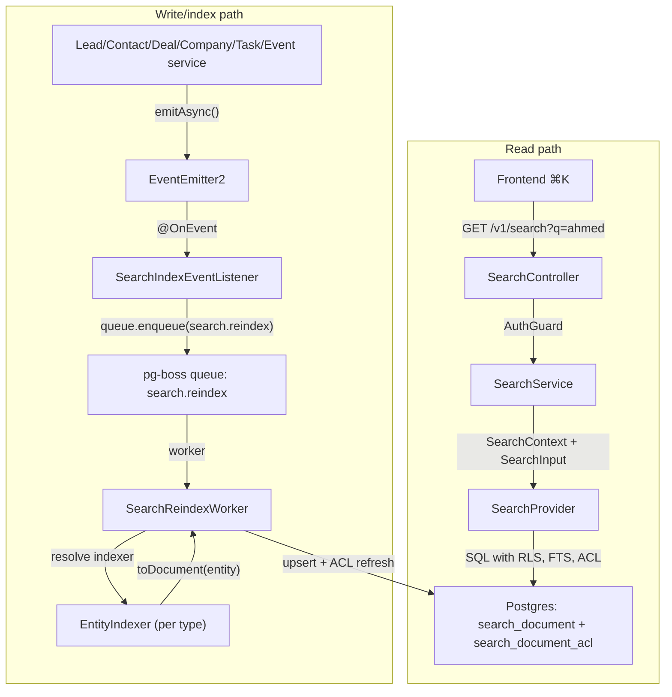

<Note>
**Version:** 0.6 (Phase 1 complete — backend + frontend ⌘K)  
**Last Updated:** May 2026  
**Status:** **Phase 1 (backend read/index + frontend ⌘K) landed** — Phase 1B **Steps 1–12**, Phase 1C **Steps 1–8**, Phase 1D **Steps 1–6**, Phase 1E **Steps 1–8** (frontend palette + Playwright smoke + §10 doc sync). **Remaining backend-only gaps:** `PostgresSearchProvider.reindexOrg()` (backfill orchestration helper) and §13.2 `search-backfill.e2e-spec.ts`. Cross-doc §16 rows for Steps 10–12 and Phase 1C/1D Step 6/8 are complete; Phase 1E Step 8 confirms no new backend cross-docs beyond this file §10.  
**Scope (Phase 1):** Lead, Contact, Deal, Company, Task, Event  
**Owner:** Backend Platform
</Note>

This document specifies the design of a permission-aware **global search** feature for PropWise CRM. Foundation work (Steps 2–9: module scaffold, worker/maintenance handlers, `SearchProvider` interface, indexer infrastructure, `normalizeSearchText()` §6.8, `buildSearchPermissionWhereClause()` §7.3, backfill script §6.4, unit tests) is implemented under `src/modules/search/`. **Phase 1B–1D** backend indexer/read paths and cross-doc sync are landed (see status banner). **Phase 1E** frontend ⌘K palette is landed in `propwise-crm-frontend` (§10).

## Design summary in 5 bullets

Read this section first. It is enough to know **what to build** before diving into §4 (per-entity field mapping) or the full 1,400+ line spec.

1. **What ships:** One tenant-scoped read endpoint — `GET /v1/search` — backed by a denormalized `search_document` table (one row per Lead, Contact, Deal, Company, Task, Event). Stakeholder-gated entities also get rows in `search_document_acl`. The frontend ⌘K palette consumes lightweight hits; full detail loads on click (§9–§10).

2. **Two pipelines, one table:** Search is **read** (sync SQL, P95 < 300ms) and **index** (async, ~2s P95 lag) decoupled. Domain services emit events → pg-boss queue `search.reindex` → `SearchReindexWorker` → per-entity `EntityIndexer.toDocument()` → upsert + ACL diff refresh. A slow indexer must not block CRM writes or search reads. See diagram below (canonical copy also in §2.2).

3. **What you implement (Phase 1B slice):** Migrations for `search_document` / `search_document_acl`, `SearchModule` + `PostgresSearchProvider`, the reindex worker, **`LeadIndexer` and `ContactIndexer`** in their owning CRM modules (registered via `SEARCH_INDEXERS`), event wiring in `LeadService` / `ContactService` / `PersonService` / `EntityStakeholderService`, shared **`normalizeSearchText()`** (§6.8), and E2E persona + Arabic normalization tests (§12, §13). File layout: §2.5.

4. **Permissions are not optional:** Contact, Deal, and Company use `visibility = 'stakeholder_only'` — indexers project `(user_id, team_id, access_level)` into `search_document_acl`; the read path filters with a fast `EXISTS` (§7). **Lead** is normally `stakeholder_only` but switches to `'org_wide'` while it is **unassigned** (zero active stakeholders → global pool), matching the always-available POOL list tab (§4.1). Task and Event are always `org_wide` (no ACL rows). If search returns a row the user cannot open in list view, the feature is broken.

5. **Where to read next:** **§4** — exact `title` / `subtitle` / `body` / ACL / reindex triggers per entity (read before writing any indexer). **§6** — queue config, worker contract, failure handling, cascades. **§12** — phase gates (1B = Lead + Contact only). Skip the rest until your slice needs it.



## Overview & Goals

### Definition

**Global search** is a single endpoint (`GET /v1/search`) and a single frontend surface (the ⌘K command palette) that lets a user type any keyword, name, public ID, email, or phone fragment and see matching CRM records they are authorized to view, ranked by relevance and recency. It is permission-aware and tenant-scoped. **Backend** indexing is eventually consistent (~2s p95; longer under backlog). **Frontend** shows the creator their own just-created items immediately via client-side pins (§10.3.1) so "create → ⌘K" never feels broken.

### Goals (Phase 1)

| #   | Goal                                                                | Acceptance                                                                                                                                                                                                                                                                                                                                   |
| --- | ------------------------------------------------------------------- | -------------------------------------------------------------------------------------------------------------------------------------------------------------------------------------------------------------------------------------------------------------------------------------------------------------------------------------------- |
| G1  | One endpoint covers Lead, Contact, Deal, Company, Task, Event       | A single request returns hits across all six entity types in one ranked list                                                                                                                                                                                                                                                                 |
| G2  | Results respect existing org RLS and per-row stakeholder ACLs       | An agent searching `ahmed` never sees a lead they are not a stakeholder on (and would not see in `/v1/leads/list`)                                                                                                                                                                                                                           |
| G3  | Read-your-writes within ~2 seconds (indexer) + immediate creator UX | Backend: newly created/updated entity appears in `GET /v1/search` within indexer P95 lag (~2s under normal load; longer during queue backlog per §13.4). **Frontend:** creator sees their own just-created items in ⌘K immediately via client-side "Just created" group (§10.3.1) — no synchronous index or source-table fallback in Phase 1 |
| G4  | Provider-swappable architecture                                     | Swapping the Postgres provider for OpenSearch/Typesense in the future requires zero changes to controllers, services, or domain indexers                                                                                                                                                                                                     |
| G5  | Phone and email substring matching for PII                          | Typing `+9715…` or `ahmed@` returns the matching person                                                                                                                                                                                                                                                                                      |
| G6  | Picker-style response shape                                         | Lightweight hits (id, title, subtitle, entity type, permissions, score); the frontend fetches full detail on click                                                                                                                                                                                                                           |
| G7  | Arabic + mixed-script search (UAE market)                           | Typing `أحمد`, `احمد`, or `ahmed` finds the same lead when the record uses any of those forms; Arabic-Indic phone digits match Western digits                                                                                                                                                                                                |

### Non-goals (Phase 1)

<AccordionGroup>
<Accordion title="Phase 1 non-goals">
| Non-goal                                                                                                                  | Why                                                                                                                          |
| ------------------------------------------------------------------------------------------------------------------------- | ---------------------------------------------------------------------------------------------------------------------------- |
| Searching the audit log (`audit_log` table)                                                                               | Audit data is sensitive and lives in its own admin-only UI. See `Docs/AUDIT_LOG_SYSTEM.md`.                                  |
| Cross-org / global search for system admins                                                                               | System admin is scoped to the **currently selected org** (i.e. `executeInOrg(orgId)`) — same as every other tenant endpoint. |
| User, Team, Off-plan project/unit, Conversation, Message, KnowledgeSource, Notification, Subscription, Commission Payment | Reserved for Phase 2 / Phase 3.                                                                                              |
| Search-as-you-type analytics ("what are people searching for")                                                            | Out of scope. Only operational metrics (latency, hit count) are collected.                                                   |
| Saved searches / pinned results / alerts                                                                                  | Phase 2.                                                                                                                     |
| Synchronous search index on create (blocking CRM write)                                                                   | Async indexer only — see §10.3.1 for creator UX without backend coupling.                                                    |
| Server-side "query source tables on every search" fallback for the creator                                                | Frontend handles with client-side "Just created" pins (§10.3.1). No mixed-mode search provider.                            |
</Accordion>
</AccordionGroup>

## Architecture

### Core principle: read/write separation

Search is built around **two separate pipelines** that share one storage layer:

<CardGroup cols={2}>
<Card title="Read pipeline" icon="magnifying-glass">
Synchronous SQL queries against `search_document` table with sub-300ms P95 latency
</Card>
<Card title="Write/index pipeline" icon="arrow-down">
Asynchronous pg-boss queue workers with ~2s P95 lag but high throughput
</Card>
</CardGroup>

This separation ensures:

- ✅ **Fast reads:** Search never waits for complex JOIN queries against live CRM tables
- ✅ **Non-blocking writes:** A slow indexer cannot degrade CRM create/update performance
- ✅ **Queue buffering:** High write volume gets smoothed out by pg-boss batching

### Component overview

```typescript
// Core interfaces
interface SearchProvider {
  search(context: SearchContext, input: SearchInput): Promise<SearchResult>
  reindex(entities: SearchEntityToIndex[]): Promise<void>
}

interface EntityIndexer<T> {
  toDocument(entity: T, context: IndexingContext): Promise<SearchDocumentInput | null>
  getReindexTriggers(): SearchReindexTrigger[]
}
```

### Module structure

```
src/modules/search/
├── search.module.ts                    # Main module with provider registration
├── controllers/
│   └── search.controller.ts            # GET /v1/search endpoint
├── services/
│   ├── search.service.ts               # Business logic layer
│   └── search-reindex-worker.service.ts # pg-boss queue worker
├── providers/
│   └── postgres-search.provider.ts     # Postgres-specific implementation
├── interfaces/
│   ├── search-provider.interface.ts    # Abstract provider contract
│   └── entity-indexer.interface.ts     # Per-entity indexer contract
├── dto/
│   ├── search-input.dto.ts             # Request validation
│   └── search-result.dto.ts            # Response shape
└── utils/
    ├── normalize-search-text.util.ts   # Arabic/mixed-script handling
    └── search-permissions.util.ts      # ACL query builder
```

## Data Model

### Core tables

<Tabs>
<Tab title="search_document">
```sql
CREATE TABLE search_document (
  id uuid PRIMARY KEY DEFAULT gen_random_uuid(),
  org_id uuid NOT NULL REFERENCES organizations(id) ON DELETE CASCADE,
  entity_type search_entity_type NOT NULL,
  entity_id uuid NOT NULL,
  title text NOT NULL,
  subtitle text,
  body text,
  visibility search_visibility_type NOT NULL DEFAULT 'org_wide',
  searchable_text tsvector GENERATED ALWAYS AS (
    to_tsvector('english', 
      COALESCE(title, '') || ' ' || 
      COALESCE(subtitle, '') || ' ' || 
      COALESCE(body, '')
    )
  ) STORED,
  normalized_text text GENERATED ALWAYS AS (
    normalize_search_text(
      COALESCE(title, '') || ' ' || 
      COALESCE(subtitle, '') || ' ' || 
      COALESCE(body, '')
    )
  ) STORED,
  created_at timestamptz NOT NULL DEFAULT now(),
  updated_at timestamptz NOT NULL DEFAULT now()
);

-- Indexes
CREATE INDEX CONCURRENTLY idx_search_document_org_entity 
  ON search_document(org_id, entity_type, entity_id);
CREATE INDEX CONCURRENTLY idx_search_document_searchable_text 
  ON search_document USING GIN(searchable_text);
CREATE INDEX CONCURRENTLY idx_search_document_normalized_text 
  ON search_document USING GIN(normalized_text gin_trgm_ops);
```
</Tab>

<Tab title="search_document_acl">
```sql
CREATE TABLE search_document_acl (
  id uuid PRIMARY KEY DEFAULT gen_random_uuid(),
  search_document_id uuid NOT NULL REFERENCES search_document(id) ON DELETE CASCADE,
  user_id uuid REFERENCES users(id) ON DELETE CASCADE,
  team_id uuid REFERENCES teams(id) ON DELETE CASCADE,
  access_level access_level NOT NULL,
  created_at timestamptz NOT NULL DEFAULT now(),
  
  CONSTRAINT chk_user_or_team CHECK (
    (user_id IS NOT NULL AND team_id IS NULL) OR 
    (user_id IS NULL AND team_id IS NOT NULL)
  )
);

-- Indexes
CREATE INDEX CONCURRENTLY idx_search_document_acl_document 
  ON search_document_acl(search_document_id);
CREATE INDEX CONCURRENTLY idx_search_document_acl_user 
  ON search_document_acl(user_id) WHERE user_id IS NOT NULL;
CREATE INDEX CONCURRENTLY idx_search_document_acl_team 
  ON search_document_acl(team_id) WHERE team_id IS NOT NULL;
```
</Tab>
</Tabs>

### Enums

```sql
CREATE TYPE search_entity_type AS ENUM (
  'lead', 'contact', 'deal', 'company', 'task', 'event'
);

CREATE TYPE search_visibility_type AS ENUM (
  'org_wide',         -- Task, Event (always visible to org members)
  'stakeholder_only'  -- Lead, Contact, Deal, Company (ACL required)
);
```

## Per-Entity Field Mapping

<Warning>
Read this section carefully before implementing any entity indexer. The exact field mappings define what users can search for.
</Warning>

### Lead indexer

<Steps>
<Step title="Title mapping">
```typescript
title: `${lead.firstName || ''} ${lead.lastName || ''}`.trim() || lead.email || lead.phone || lead.publicId
```
</Step>
<Step title="Subtitle mapping">
```typescript
subtitle: lead.publicId  // Always show the lead ID for disambiguation
```
</Step>
<Step title="Body content">
```typescript
body: [
  lead.email,
  lead.phone,
  lead.secondaryPhone,
  lead.company,
  lead.jobTitle,
  lead.address,
  lead.notes
].filter(Boolean).join(' ')
```
</Step>
<Step title="Visibility logic">
```typescript
// Special case: unassigned leads are globally visible (matches POOL tab)
visibility: lead.stakeholderCount > 0 ? 'stakeholder_only' : 'org_wide'
```
</Step>
</Steps>

**Reindex triggers:**
- `lead.created`
- `lead.updated` (any field change)
- `stakeholder.created` (lead assignment)
- `stakeholder.removed` (lead unassignment)
- `stakeholder.access_level_changed`

### Contact indexer

<Tabs>
<Tab title="Field mapping">
```typescript
{
  title: `${contact.firstName || ''} ${contact.lastName || ''}`.trim() || 
         contact.email || contact.phone || contact.publicId,
  subtitle: contact.publicId,
  body: [
    contact.email,
    contact.phone,
    contact.secondaryPhone,
    contact.jobTitle,
    contact.company?.name,
    contact.address,
    contact.notes
  ].filter(Boolean).join(' '),
  visibility: 'stakeholder_only'  // Always requires ACL
}
```
</Tab>
<Tab title="ACL projection">
Contact stakeholders map directly to search ACL:
```typescript
// For each stakeholder
{
  user_id: stakeholder.userId || null,
  team_id: stakeholder.teamId || null,
  access_level: stakeholder.accessLevel
}
```
</Tab>
</Tabs>

### Deal, Company, Task, Event indexers

<AccordionGroup>
<Accordion title="Deal indexer">
```typescript
{
  title: deal.title || deal.publicId,
  subtitle: `${deal.stage} • ${formatCurrency(deal.value)}`,
  body: [
    deal.publicId,
    deal.description,
    deal.leadContact?.name,
    deal.company?.name
  ].filter(Boolean).join(' '),
  visibility: 'stakeholder_only'
}
```

**Reindex triggers:** `deal.created`, `deal.updated`, stakeholder events
</Accordion>

<Accordion title="Company indexer">
```typescript
{
  title: company.name || company.publicId,
  subtitle: company.industry,
  body: [
    company.publicId,
    company.description,
    company.website,
    company.address,
    company.notes
  ].filter(Boolean).join(' '),
  visibility: 'stakeholder_only'
}
```

**Reindex triggers:** `company.created`, `company.updated`, stakeholder events
</Accordion>

<Accordion title="Task indexer">
```typescript
{
  title: task.title || task.type,
  subtitle: `Due ${formatDate(task.dueDate)} • ${task.assignee?.name}`,
  body: [
    task.description,
    task.entityName,  // "Lead: John Smith" or "Deal: Office Purchase"
    task.notes
  ].filter(Boolean).join(' '),
  visibility: 'org_wide'  // No ACL rows needed
}
```

**Reindex triggers:** `task.created`, `task.updated`, `task.completed`
</Accordion>

<Accordion title="Event indexer">
```typescript
{
  title: event.title || event.type,
  subtitle: `${formatDate(event.startDate)} • ${event.attendees?.length} attendees`,
  body: [
    event.description,
    event.location,
    event.attendeeNames,  // Comma-separated
    event.notes
  ].filter(Boolean).join(' '),
  visibility: 'org_wide'  // No ACL rows needed
}
```

**Reindex triggers:** `event.created`, `event.updated`, `event.attendee_added`, `event.attendee_removed`
</Accordion>
</AccordionGroup>

## Indexing Pipeline

### Queue configuration

```typescript
// In search.module.ts
const searchQueueConfig = {
  name: 'search.reindex',
  options: {
    retryLimit: 3,
    retryDelay: 30000,  // 30 seconds
    retryBackoff: true,
    expireInHours: 24
  }
}
```

### Worker implementation

<Steps>
<Step title="Event listener">
```typescript
@Injectable()
export class SearchIndexEventListener {
  @OnEvent('lead.created')
  @OnEvent('lead.updated')
  async handleLeadEvent(payload: { lead: Lead, organizationId: string }) {
    await this.queueService.enqueue('search.reindex', {
      organizationId: payload.organizationId,
      entityType: 'lead',
      entityId: payload.lead.id,
      operation: 'upsert'
    })
  }
  
  @OnEvent('lead.deleted')
  async handleLeadDeleted(payload: { leadId: string, organizationId: string }) {
    await this.queueService.enqueue('search.reindex', {
      organizationId: payload.organizationId,
      entityType: 'lead',
      entityId: payload.leadId,
      operation: 'delete'
    })
  }
}
```
</Step>

<Step title="Queue worker">
```typescript
@Injectable()
export class SearchReindexWorker {
  @Process('search.reindex')
  async processReindexJob(job: Job<SearchReindexPayload>): Promise<void> {
    const { entityType, entityId, operation } = job.data
    
    if (operation === 'delete') {
      await this.searchProvider.deleteDocument(entityType, entityId)
      return
    }
    
    // Resolve the appropriate indexer
    const indexer = this.getIndexer(entityType)
    const entity = await this.loadEntity(entityType, entityId)
    
    if (!entity) {
      // Entity was deleted between event and processing
      await this.searchProvider.deleteDocument(entityType, entityId)
      return
    }
    
    const document = await indexer.toDocument(entity, this.indexingContext)
    if (document) {
      await this.searchProvider.upsertDocument(document)
    }
  }
}
```
</Step>

<Step title="Failure handling">
Failed jobs are retried with exponential backoff (30s → 60s → 120s). After 3 failures, the job is marked as failed and requires manual intervention.

<Warning>
Monitor the failed job queue in production. Persistent failures usually indicate:
- Database connectivity issues
- Indexer bugs with specific entity shapes  
- Search table schema mismatches
</Warning>
</Step>
</Tabs>

### Text normalization

The `normalizeSearchText()` function handles Arabic/mixed-script search requirements:

```typescript
export function normalizeSearchText(text: string): string {
  if (!text) return ''
  
  return text
    .toLowerCase()
    .replace(/[\u064B-\u065F]/g, '')  // Remove Arabic diacritics
    .replace(/[\u0660-\u0669]/g, (match) => {  // Arabic-Indic to Western digits
      return String.fromCharCode(match.charCodeAt(0) - 0x0660 + 0x0030)
    })
    .replace(/\s+/g, ' ')  // Normalize whitespace
    .trim()
}
```

<Info>
This enables typing `أحمد`, `احمد`, or `ahmed` to find the same record, and ensures phone numbers with Arabic-Indic digits match Western digit queries.
</Info>

## Permission Gate

### ACL query construction

For `stakeholder_only` entities, the search provider builds permission-aware WHERE clauses:

```sql
-- Permission check for stakeholder_only entities
WHERE EXISTS (
  SELECT 1 FROM search_document_acl acl
  WHERE acl.search_document_id = search_document.id
  AND (
    (acl.user_id = $userId) OR
    (acl.team_id = ANY($userTeamIds))
  )
)
-- Plus org RLS: search_document.org_id = $orgId
```

### Special case: unassigned leads

Unassigned leads (zero stakeholders) are indexed with `visibility = 'org_wide'` to match the always-available POOL tab behavior. When a lead gets its first stakeholder, it switches to `stakeholder_only` mode.

<Steps>
<Step title="Lead becomes assigned">
```typescript
// In stakeholder.created event handler
if (entityType === 'lead' && isFirstStakeholder) {
  // Reindex to switch from org_wide to stakeholder_only
  await this.queueReindex({ entityType: 'lead', entityId, operation: 'upsert' })
}
```
</Step>

<Step title="Lead becomes unassigned">
```typescript
// In stakeholder.removed event handler  
if (entityType === 'lead' && isLastStakeholder) {
  // Reindex to switch from stakeholder_only to org_wide
  await this.queueReindex({ entityType: 'lead', entityId, operation: 'upsert' })
}
```
</Step>
</Steps>

## Ranking & Query Construction

### Search query logic

<Tabs>
<Tab title="Full-text search">
```sql
-- Primary ranking: PostgreSQL full-text search
WHERE searchable_text @@ websearch_to_tsquery('english', $query)
ORDER BY ts_rank(searchable_text, websearch_to_tsquery('english', $query)) DESC
```
</Tab>

<Tab title="Trigram fallback">
```sql
-- Fallback: trigram similarity for partial matches and Arabic text
WHERE similarity(normalized_text, $normalizedQuery) > 0.3
ORDER BY similarity(normalized_text, $normalizedQuery) DESC
```
</Tab>

<Tab title="Combined ranking">
```sql
-- Combined scoring (when both match)
ORDER BY (
  COALESCE(ts_rank(searchable_text, websearch_to_tsquery('english', $query)), 0) * 0.7 +
  COALESCE(similarity(normalized_text, $normalizedQuery), 0) * 0.3
) DESC, updated_at DESC
```
</Tab>
</Tabs>

### Result limits

- **Default limit:** 20 results
- **Maximum limit:** 100 results  
- **Timeout:** 5 seconds (circuit breaker at provider level)

## API Contract

### Request format

```typescript
GET /v1/search?q=ahmed&limit=20&entity_types=lead,contact

interface SearchInput {
  q: string;                    // Required: search query
  limit?: number;               // Optional: 1-100, default 20
  entity_types?: string[];      // Optional: filter by entity types
}
```

### Response format

```typescript
interface SearchResult {
  hits: SearchHit[];
  total: number;
  took_ms: number;
}

interface SearchHit {
  id: string;
  entity_type: 'lead' | 'contact' | 'deal' | 'company' | 'task' | 'event';
  entity_id: string;
  title: string;
  subtitle?: string;
  permissions: {
    can_view: boolean;
    can_edit: boolean;
  };
  score: number;
  updated_at: string;
}
```

### Example response

```json
{
  "hits": [
    {
      "id": "doc_123",
      "entity_type": "lead", 
      "entity_id": "lead_abc",
      "title": "Ahmed Al-Mansouri",
      "subtitle": "LEAD-2024-001",
      "permissions": {
        "can_view": true,
        "can_edit": true
      },
      "score": 0.95,
      "updated_at": "2024-01-15T10:30:00Z"
    }
  ],
  "total": 1,
  "took_ms": 45
}
```

## Frontend Contract

### Command palette integration

The ⌘K command palette consumes the search API with these behaviors:

<Steps>
<Step title="Query debouncing">
Frontend debounces user input (300ms) before calling `GET /v1/search`
</Step>

<Step title="Result grouping">
Results are grouped by entity type:
- 📞 Leads (up to 3 shown)
- 👤 Contacts (up to 3 shown)  
- 💰 Deals (up to 3 shown)
- 🏢 Companies (up to 3 shown)
- ✅ Tasks (up to 2 shown)
- 📅 Events (up to 2 shown)
</Step>

<Step title="Creator UX enhancement">
Users see their own just-created entities immediately via a "Just created" group, populated from frontend state. This provides immediate feedback without waiting for backend indexing.

```typescript
// Pseudo-code for frontend state
const justCreatedEntities = useRecentlyCreated(); // Last 5 minutes
const searchResults = useSearch(query);

const combinedResults = [
  ...justCreatedEntities.filter(matches(query)),
  ...searchResults.hits
];
```
</Step>
</Steps>

### Navigation behavior

- **Click:** Navigate to entity detail page (`/leads/123`, `/contacts/456`, etc.)
- **⌘+Click:** Open in new tab
- **Arrow keys:** Navigate between results
- **Enter:** Navigate to selected result
- **Escape:** Close palette

## SearchProvider Abstraction

### Provider interface

```typescript
interface SearchProvider {
  search(context: SearchContext, input: SearchInput): Promise<SearchResult>;
  upsertDocument(document: SearchDocumentInput): Promise<void>;
  deleteDocument(entityType: string, entityId: string): Promise<void>;
  bulkReindex(entities: SearchEntityToIndex[]): Promise<void>;
  healthCheck(): Promise<SearchProviderHealth>;
}

interface SearchContext {
  organizationId: string;
  userId: string;
  userTeamIds: string[];
  accessLevel: AccessLevel;
}
```

### PostgresSearchProvider implementation

The initial implementation uses PostgreSQL with:
- **Full-text search:** `tsvector` + `websearch_to_tsquery()` for English content
- **Trigram matching:** `pg_trgm` for partial matches and Arabic text
- **Row-level security:** Automatic `org_id` filtering  
- **ACL filtering:** `EXISTS` subquery against `search_document_acl`

Future providers (OpenSearch, Typesense) can be swapped in without changing business logic.

## Phased Rollout

<Tabs>
<Tab title="Phase 1B: Lead + Contact only">
**Scope:** Lead and Contact indexing + search
**Timeline:** 2 weeks
**Acceptance:** E2E tests pass for persona-based search scenarios

**Steps:**
1. `search_document` + `search_document_acl` migrations
2. `SearchModule` + `PostgresSearchProvider` 
3. `LeadIndexer` + `ContactIndexer`
4. Event wiring in `LeadService`, `ContactService`, `PersonService`
5. E2E tests with Arabic text scenarios

</Tab>

<Tab title="Phase 1C: + Deal + Company">
**Scope:** Add Deal and Company to search
**Timeline:** 1 week  
**Acceptance:** All four entity types searchable

**Steps:**
1. `DealIndexer` + `CompanyIndexer`
2. Event wiring in `DealService`, `CompanyService`
3. Update E2E tests

</Tab>

<Tab title="Phase 1D: + Task + Event">
**Scope:** Complete the six-entity scope
**Timeline:** 1 week
**Acceptance:** Full entity coverage

**Steps:**
1. `TaskIndexer` + `EventIndexer` 
2. Event wiring in `TaskService`, `EventService`
3. Update E2E tests

</Tab>

<Tab title="Phase 1E: Frontend ⌘K">
**Scope:** Command palette implementation
**Timeline:** 1 week
**Acceptance:** End-to-end search flow working

**Steps:**
1. Command palette UI component
2. Search API integration
3. "Just created" client-side enhancement
4. Playwright E2E tests

</Tab>
</Tabs>

## Testing Strategy

### Unit tests

<Steps>
<Step title="Text normalization">
```typescript
describe('normalizeSearchText', () => {
  it('should remove Arabic diacritics', () => {
    expect(normalizeSearchText('أَحْمَد')).toBe('أحمد')
  })
  
  it('should convert Arabic-Indic digits', () => {
    expect(normalizeSearchText('+٩٧١٥٠١٢٣٤٥٦٧')).toBe('+97150123456')
  })
})
```
</Step>

<Step title="Permission queries">
```typescript
describe('buildSearchPermissionWhereClause', () => {
  it('should build correct ACL exists clause', () => {
    const clause = buildSearchPermissionWhereClause({
      userId: 'user_123',
      userTeamIds: ['team_456']
    })
    expect(clause).toContain('EXISTS (SELECT 1 FROM search_document_acl')
  })
})
```
</Step>

<Step title="Entity indexers">
```typescript
describe('LeadIndexer', () => {
  it('should index unassigned lead as org_wide', async () => {
    const lead = createMockLead({ stakeholderCount: 0 })
    const doc = await indexer.toDocument(lead, context)
    expect(doc.visibility).toBe('org_wide')
  })
  
  it('should index assigned lead as stakeholder_only', async () => {
    const lead = createMockLead({ stakeholderCount: 1 })
    const doc = await indexer.toDocument(lead, context)
    expect(doc.visibility).toBe('stakeholder_only')
  })
})
```
</Step>
</Steps>

### Integration tests

<Steps>
<Step title="Queue worker">
```typescript
describe('SearchReindexWorker', () => {
  it('should process lead upsert job', async () => {
    const job = createMockJob({
      entityType: 'lead',
      entityId: 'lead_123',
      operation: 'upsert'
    })
    
    await worker.processReindexJob(job)
    
    const doc = await searchProvider.findDocument('lead', 'lead_123')
    expect(doc).toBeDefined()
  })
})
```
</Step>

<Step title="Permission filtering">
```typescript
describe('SearchService integration', () => {
  it('should not return stakeholder-only entities to unauthorized users', async () => {
    // Create lead with specific stakeholder
    const lead = await createLead({ stakeholders: ['agent_1'] })
    
    // Search as different agent
    const result = await searchService.search(agent2Context, { q: lead.name })
    
    expect(result.hits).not.toContainEntity(lead.id)
  })
})
```
</Step>
</Steps>

### E2E tests

<Tabs>
<Tab title="Persona-based scenarios">
```typescript
describe('Search E2E', () => {
  it('should find entities across all types', async () => {
    const testData = await seedTestData({
      leads: [{ name: 'Ahmed Al-Mansouri', email: 'ahmed@example.com' }],
      contacts: [{ name: 'Ahmed Hassan', phone: '+971501234567' }],
      deals: [{ title: 'Ahmed Office Purchase' }]
    })
    
    const response = await request(app)
      .get('/v1/search?q=ahmed')
      .set('Authorization', `Bearer ${agentToken}`)
      .expect(200)
    
    expect(response.body.hits).toHaveLength(3)
    expect(response.body.hits.map(h => h.entity_type)).toEqual(
      expect.arrayContaining(['lead', 'contact', 'deal'])
    )
  })
})
```
</Tab>

<Tab title="Arabic text scenarios">
```typescript
it('should find Arabic names with various spellings', async () => {
  const lead = await createLead({ 
    name: 'أحمد المنصوري',
    phone: '+٩٧١٥٠١٢٣٤٥٦٧'
  })
  
  // Test different query variations
  const queries = ['أحمد', 'احمد', 'ahmed', '+97150123456']
  
  for (const query of queries) {
    const response = await request(app)
      .get(`/v1/search?q=${encodeURIComponent(query)}`)
      .expect(200)
    
    expect(response.body.hits).toContainEntity(lead.id)
  }
})
```
</Tab>
</Tabs>

### Bulk throughput & cascade lag (Phase 1C gate)

<Warning>
Phase 1C must demonstrate handling 1000+ entity updates within reasonable indexing lag (<30s P95).
</Warning>

```typescript
describe('Bulk operations', () => {
  it('should handle 1000 lead updates within 30s indexing lag', async () => {
    const leads = await createMockLeads(1000)
    const startTime = Date.now()
    
    // Trigger bulk updates
    await Promise.all(leads.map(lead => 
      leadService.update(lead.id, { notes: 'Bulk updated' })
    ))
    
    // Wait for queue to drain
    await waitForSearchIndexing()
    
    const endTime = Date.now()
    const indexingLag = endTime - startTime
    
    expect(indexingLag).toBeLessThan(30000) // 30 seconds
    
    // Verify all leads are updated in search
    for (const lead of leads.slice(0, 10)) { // Sample check
      const result = await searchService.search(context, { q: lead.name })
      expect(result.hits[0].updated_at).toBe(lead.updatedAt)
    }
  }, 60000) // 60s timeout
})
```

## Operations & Monitoring

### Key metrics

<CardGroup cols={2}>
<Card title="Read path SLIs" icon="chart-line">
- Search endpoint P95 latency < 300ms
- Search endpoint error rate < 0.1%
- Search result relevance (manual spot checks)
</Card>

<Card title="Write path SLIs" icon="clock">
- Queue processing P95 latency < 2s
- Index job success rate > 99.9%
- Queue backlog depth < 1000 jobs
</Card>
</CardGroup>

### Alerting thresholds

```yaml
# Example monitoring configuration
alerts:
  - name: "Search endpoint slow"
    condition: "search_request_duration_p95 > 500ms for 5m"
    severity: "warning"
    
  - name: "Search queue backlog"
    condition: "search_reindex_queue_depth > 5000 for 10m"
    severity: "critical"
    
  - name: "Search indexer failing"
    condition: "search_reindex_error_rate > 5% for 5m"
    severity: "warning"
```

### Operational runbooks

<AccordionGroup>
<Accordion title="Queue backlog recovery">
1. Check for stuck/failing jobs in pg-boss admin UI
2. Identify problematic entity types or organizations  
3. Scale up worker concurrency temporarily
4. Consider bulk reindex script for large backlogs
</Accordion>

<Accordion title="Search result quality issues">
1. Check `normalizeSearchText()` function for edge cases
2. Verify indexer field mappings match latest entity schemas
3. Run manual search queries against `search_document` table
4. Compare results with source entity tables for data consistency
</Accordion>
</AccordionGroup>

## Open Risks

<Warning>
These risks require monitoring and potential mitigation during implementation.
</Warning>

| Risk | Impact | Mitigation |
|------|--------|------------|
| **Queue lag under high write volume** | Users don't see recent updates in search | Monitor queue depth; implement batch processing; consider read-through cache |
| **Search relevance tuning needed** | Poor ranking of results | A/B test different scoring weights; collect user feedback on result quality |
| **Arabic text edge cases** | Some Arabic queries don't match expected records | Expand E2E test coverage; monitor production search analytics |
| **ACL complexity for large orgs** | Slow permission checks for users with many team memberships | Optimize ACL query; consider denormalizing team inheritance |

## Cross-Doc Updates Required

The following documentation files need updates to reference the search module:

<Steps>
<Step title="API documentation">
- `backend/docs/API_REFERENCE.md` — Add `GET /v1/search` endpoint
- `backend/docs/AUTHENTICATION.md` — Confirm search respects standard auth
</Step>

<Step title="Development guides">
- `DEVELOPMENT_SETUP.md` — Add search module to local development checklist
- `backend/docs/TESTING_GUIDE.md` — Reference search E2E test patterns
</Step>

<Step title="Deployment docs">
- `backend/docs/DEPLOYMENT_GUIDE.md` — Add search table migrations to deployment checklist
- `backend/docs/MONITORING_GUIDE.md` — Add search metrics to monitoring setup
</Step>
</Steps>

<Info>
Phase 1E Step 8 confirms no additional backend cross-docs are needed beyond the updates listed above.
</Info>

## References

- **Queue system:** `backend/docs/QUEUE_SYSTEM.md` — pg-boss configuration and patterns
- **Permission model:** `backend/docs/PERMISSIONS_SYSTEM.md` — stakeholder ACL details
- **Arabic support:** `backend/docs/INTERNATIONALIZATION.md` — text normalization requirements
- **Event system:** `backend/docs/EVENT_SYSTEM.md` — EventEmitter2 patterns used by indexers