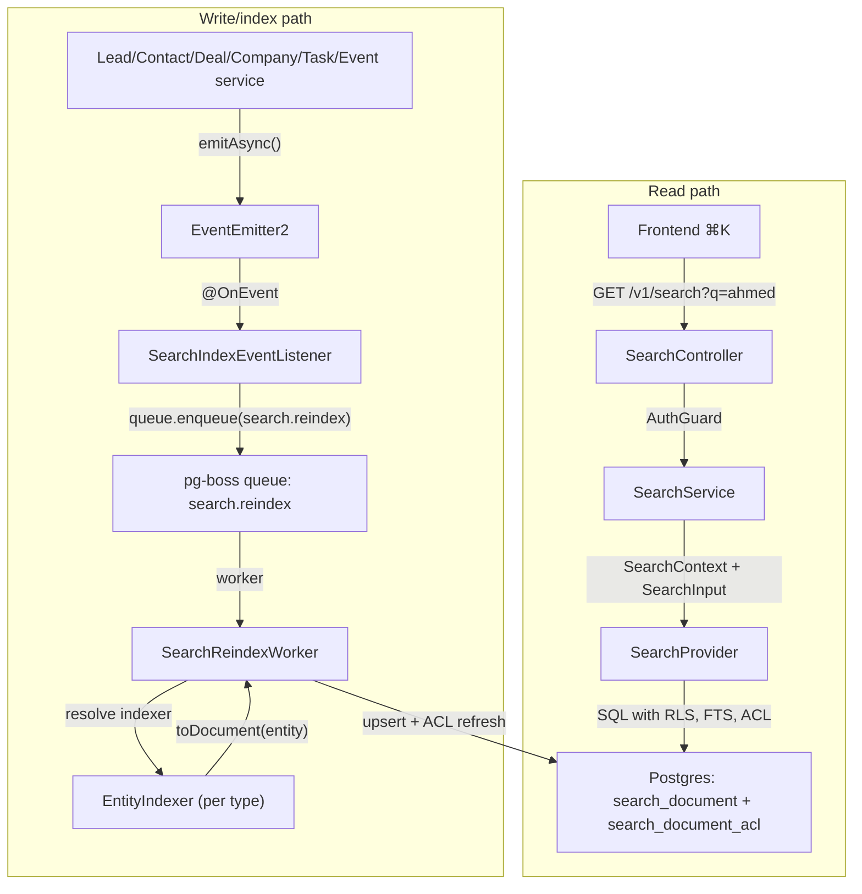

<Info>
**Version:** 0.6 (Phase 1 complete — backend + frontend ⌘K)  
**Last Updated:** May 2026  
**Status:** **Phase 1 (backend read/index + frontend ⌘K) landed** — Phase 1B **Steps 1–12**, Phase 1C **Steps 1–8**, Phase 1D **Steps 1–6**, Phase 1E **Steps 1–8** (frontend palette + Playwright smoke + §10 doc sync). **Remaining backend-only gaps:** `PostgresSearchProvider.reindexOrg()` (backfill orchestration helper) and §13.2 `search-backfill.e2e-spec.ts`. Cross-doc §16 rows for Steps 10–12 and Phase 1C/1D Step 6/8 are complete; Phase 1E Step 8 confirms no new backend cross-docs beyond this file §10.  
**Scope (Phase 1):** Lead, Contact, Deal, Company, Task, Event  
**Owner:** Backend Platform
</Info>

This document specifies the design of a permission-aware **global search** feature for PropWise CRM. Foundation work (Steps 2–9: module scaffold, worker/maintenance handlers, `SearchProvider` interface, indexer infrastructure, `normalizeSearchText()` §6.8, `buildSearchPermissionWhereClause()` §7.3, backfill script §6.4, unit tests) is implemented under `src/modules/search/`. **Phase 1B–1D** backend indexer/read paths and cross-doc sync are landed (see status banner). **Phase 1E** frontend ⌘K palette is landed in `propwise-crm-frontend` (§10).

## Design Summary

<Note>
Read this section first. It provides enough context to understand **what to build** before diving into detailed specifications.
</Note>

### Key Points

1. **What ships:** One tenant-scoped read endpoint — `GET /v1/search` — backed by a denormalized `search_document` table (one row per Lead, Contact, Deal, Company, Task, Event). Stakeholder-gated entities also get rows in `search_document_acl`. The frontend ⌘K palette consumes lightweight hits; full detail loads on click (§9–§10).

2. **Two pipelines, one table:** Search is **read** (sync SQL, P95 < 300ms) and **index** (async, ~2s P95 lag) decoupled. Domain services emit events → pg-boss queue `search.reindex` → `SearchReindexWorker` → per-entity `EntityIndexer.toDocument()` → upsert + ACL diff refresh. A slow indexer must not block CRM writes or search reads.

3. **What you implement (Phase 1B slice):** Migrations for `search_document` / `search_document_acl`, `SearchModule` + `PostgresSearchProvider`, the reindex worker, **`LeadIndexer` and `ContactIndexer`** in their owning CRM modules (registered via `SEARCH_INDEXERS`), event wiring in `LeadService` / `ContactService` / `PersonService` / `EntityStakeholderService`, shared **`normalizeSearchText()`** (§6.8), and E2E persona + Arabic normalization tests (§12, §13).

4. **Permissions are not optional:** Contact, Deal, and Company use `visibility = 'stakeholder_only'` — indexers project `(user_id, team_id, access_level)` into `search_document_acl`; the read path filters with a fast `EXISTS` (§7). **Lead** is normally `stakeholder_only` but switches to `'org_wide'` while it is **unassigned** (zero active stakeholders → global pool), matching the always-available POOL list tab (§4.1). Task and Event are always `org_wide` (no ACL rows). If search returns a row the user cannot open in list view, the feature is broken.

5. **Where to read next:** **§4** — exact `title` / `subtitle` / `body` / ACL / reindex triggers per entity (read before writing any indexer). **§6** — queue config, worker contract, failure handling, cascades. **§12** — phase gates (1B = Lead + Contact only). Skip the rest until your slice needs it.

### Architecture Overview



## Overview & Goals

### Definition

**Global search** is a single endpoint (`GET /v1/search`) and a single frontend surface (the ⌘K command palette) that lets a user type any keyword, name, public ID, email, or phone fragment and see matching CRM records they are authorized to view, ranked by relevance and recency. It is permission-aware and tenant-scoped. **Backend** indexing is eventually consistent (~2s p95; longer under backlog). **Frontend** shows the creator their own just-created items immediately via client-side pins (§10.3.1) so "create → ⌘K" never feels broken.

### Goals (Phase 1)

<AccordionGroup>
<Accordion title="G1: One endpoint covers Lead, Contact, Deal, Company, Task, Event">
A single request returns hits across all six entity types in one ranked list
</Accordion>

<Accordion title="G2: Results respect existing org RLS and per-row stakeholder ACLs">
An agent searching `ahmed` never sees a lead they are not a stakeholder on (and would not see in `/v1/leads/list`)
</Accordion>

<Accordion title="G3: Read-your-writes within ~2 seconds (indexer) + immediate creator UX">
**Backend:** newly created/updated entity appears in `GET /v1/search` within indexer P95 lag (~2s under normal load; longer during queue backlog per §13.4). **Frontend:** creator sees their own just-created items in ⌘K immediately via client-side "Just created" group (§10.3.1) — no synchronous index or source-table fallback in Phase 1
</Accordion>

<Accordion title="G4: Provider-swappable architecture">
Swapping the Postgres provider for OpenSearch/Typesense in the future requires zero changes to controllers, services, or domain indexers
</Accordion>

<Accordion title="G5: Phone and email substring matching for PII">
Typing `+9715…` or `ahmed@` returns the matching person
</Accordion>

<Accordion title="G6: Picker-style response shape">
Lightweight hits (id, title, subtitle, entity type, permissions, score); the frontend fetches full detail on click
</Accordion>

<Accordion title="G7: Arabic + mixed-script search (UAE market)">
Typing `أحمد`, `احمد`, or `ahmed` finds the same lead when the record uses any of those forms; Arabic-Indic phone digits match Western digits
</Accordion>
</AccordionGroup>

### Non-goals (Phase 1)

<Warning>
These features are explicitly out of scope for Phase 1:
</Warning>

- **Searching the audit log** (`audit_log` table) - Audit data is sensitive and lives in its own admin-only UI
- **Cross-org / global search** for system admins - System admin is scoped to the **currently selected org**
- **Additional entity types** - User, Team, Off-plan project/unit, Conversation, Message, KnowledgeSource, etc. reserved for Phase 2/3
- **Search analytics** - Only operational metrics (latency, hit count) are collected
- **Saved searches / pinned results / alerts** - Phase 2 feature
- **Synchronous search index** on create - Async indexer only

## Architecture

### Core Components

<CardGroup cols={2}>
<Card title="SearchModule" icon="cube">
NestJS module containing the search infrastructure, providers, and workers
</Card>

<Card title="SearchProvider" icon="database">
Abstract interface allowing swappable search backends (Postgres, OpenSearch, etc.)
</Card>

<Card title="EntityIndexer" icon="gear">
Per-entity classes that transform domain objects into search documents
</Card>

<Card title="SearchReindexWorker" icon="clock">
Background worker processing indexing queue jobs asynchronously
</Card>
</CardGroup>

### File Structure

```
src/modules/search/
├── search.module.ts              # Main module registration
├── providers/
│   ├── search-provider.interface.ts
│   └── postgres-search.provider.ts
├── workers/
│   └── search-reindex.worker.ts
├── listeners/
│   └── search-index-event.listener.ts
├── indexers/
│   ├── base-entity.indexer.ts
│   └── search-indexer.registry.ts
├── dto/
│   ├── search-input.dto.ts
│   └── search-result.dto.ts
├── utils/
│   └── normalize-search-text.ts
└── scripts/
    └── backfill-search-index.ts
```

## Data Model

### Core Tables

<Tabs>
<Tab title="search_document">
```sql
CREATE TABLE search_document (
  id UUID PRIMARY KEY DEFAULT gen_random_uuid(),
  org_id UUID NOT NULL REFERENCES organizations(id) ON DELETE CASCADE,
  entity_type VARCHAR(50) NOT NULL, -- 'lead', 'contact', 'deal', etc.
  entity_id UUID NOT NULL,
  title VARCHAR(500) NOT NULL,      -- Lead: "#{public_id} - #{first_name} #{last_name}"
  subtitle VARCHAR(500),            -- Lead: "#{phone} • #{email}"
  body TEXT,                        -- Searchable content
  visibility VARCHAR(20) NOT NULL,  -- 'org_wide' or 'stakeholder_only'
  created_at TIMESTAMPTZ NOT NULL DEFAULT NOW(),
  updated_at TIMESTAMPTZ NOT NULL DEFAULT NOW(),
  indexed_at TIMESTAMPTZ NOT NULL DEFAULT NOW(),
  
  CONSTRAINT unique_entity_per_org UNIQUE (org_id, entity_type, entity_id)
);

-- RLS policy
ALTER TABLE search_document ENABLE ROW LEVEL SECURITY;
CREATE POLICY search_document_org_isolation ON search_document
  FOR ALL TO app_role
  USING (org_id = current_setting('app.current_org_id')::UUID);

-- FTS index
CREATE INDEX idx_search_document_fts 
  ON search_document 
  USING gin(to_tsvector('english', title || ' ' || subtitle || ' ' || coalesce(body, '')));

-- Performance indexes
CREATE INDEX idx_search_document_entity_lookup 
  ON search_document (org_id, entity_type, entity_id);
CREATE INDEX idx_search_document_visibility 
  ON search_document (org_id, visibility);
```
</Tab>

<Tab title="search_document_acl">
```sql
CREATE TABLE search_document_acl (
  id UUID PRIMARY KEY DEFAULT gen_random_uuid(),
  search_document_id UUID NOT NULL REFERENCES search_document(id) ON DELETE CASCADE,
  user_id UUID REFERENCES users(id) ON DELETE CASCADE,
  team_id UUID REFERENCES teams(id) ON DELETE CASCADE,
  access_level VARCHAR(20) NOT NULL DEFAULT 'read', -- 'read', 'write', 'admin'
  created_at TIMESTAMPTZ NOT NULL DEFAULT NOW(),
  
  CONSTRAINT user_or_team_not_both CHECK (
    (user_id IS NOT NULL AND team_id IS NULL) OR 
    (user_id IS NULL AND team_id IS NOT NULL)
  )
);

-- Performance indexes for permission filtering
CREATE INDEX idx_search_acl_user_lookup 
  ON search_document_acl (user_id, search_document_id);
CREATE INDEX idx_search_acl_team_lookup 
  ON search_document_acl (team_id, search_document_id);
CREATE INDEX idx_search_acl_document_reverse 
  ON search_document_acl (search_document_id);
```
</Tab>
</Tabs>

## Per-Entity Field Mapping

<Note>
This section defines exactly what fields from each entity type are indexed and how they map to the search document structure.
</Note>

### Lead Indexing

<Steps>
<Step title="Title Format">
`"#{public_id} - #{first_name} #{last_name}"`

Example: `"LD-2024-001 - Ahmed Al Mansouri"`
</Step>

<Step title="Subtitle Format">
`"#{phone} • #{email}"`

Example: `"+971-50-123-4567 • ahmed@example.com"`
</Step>

<Step title="Body Content">
Concatenated searchable fields:
- `description`
- `notes`
- Normalized phone numbers (both +971-50-123-4567 and 971501234567 formats)
- Email domain extraction for partial matching
</Step>

<Step title="Visibility Logic">
- `'org_wide'` if lead has zero active stakeholders (unassigned → global pool)
- `'stakeholder_only'` if lead has active stakeholders
</Step>
</Steps>

### Contact Indexing

<CardGroup cols={2}>
<Card title="Title" icon="user">
`"#{first_name} #{last_name}"`
</Card>

<Card title="Subtitle" icon="phone">
`"#{phone} • #{email}"`
</Card>

<Card title="Body" icon="align-left">
- Company name (if linked)
- Job title
- Notes
- Normalized contact info
</Card>

<Card title="Visibility" icon="lock">
Always `'stakeholder_only'`
</Card>
</CardGroup>

### Deal, Company, Task, Event

<AccordionGroup>
<Accordion title="Deal Indexing">
- **Title:** `"#{public_id} - #{name}"`
- **Subtitle:** `"#{stage} • #{amount} AED • #{company_name}"`
- **Body:** Description, notes, property details
- **Visibility:** `'stakeholder_only'`
</Accordion>

<Accordion title="Company Indexing">
- **Title:** `"#{name}"`
- **Subtitle:** `"#{industry} • #{location}"`
- **Body:** Description, notes, website
- **Visibility:** `'stakeholder_only'`
</Accordion>

<Accordion title="Task Indexing">
- **Title:** `"#{title}"`
- **Subtitle:** `"#{status} • Due: #{due_date}"`
- **Body:** Description, notes
- **Visibility:** `'org_wide'` (no ACL rows)
</Accordion>

<Accordion title="Event Indexing">
- **Title:** `"#{title}"`
- **Subtitle:** `"#{start_date} • #{location}"`
- **Body:** Description, attendee notes
- **Visibility:** `'org_wide'` (no ACL rows)
</Accordion>
</AccordionGroup>

## Indexing Pipeline

### Queue Configuration

<CodeGroup>
```typescript title="Queue Job Definition"
interface SearchReindexJob {
  orgId: string;
  entityType: 'lead' | 'contact' | 'deal' | 'company' | 'task' | 'event';
  entityId: string;
  operation: 'upsert' | 'delete';
  priority?: number; // Higher = more urgent
}
```

```typescript title="Worker Configuration"
@Processor('search.reindex', {
  concurrency: 5,
  retryLimit: 3,
  retryDelay: 30000, // 30s exponential backoff
})
export class SearchReindexWorker {
  @Process()
  async handleReindex(job: Job<SearchReindexJob>) {
    // Implementation
  }
}
```
</CodeGroup>

### Text Normalization

The `normalizeSearchText()` utility handles Arabic/English mixed scripts and phone number variations:

```typescript
export function normalizeSearchText(text: string): string {
  if (!text) return '';
  
  return text
    // Arabic-Indic digits → Western digits
    .replace(/[٠-٩]/g, (digit) => String(digit.charCodeAt(0) - '٠'.charCodeAt(0)))
    // Remove diacritics (tashkeel)
    .replace(/[\u064B-\u065F\u0670\u06D6-\u06ED]/g, '')
    // Normalize Arabic letters
    .replace(/[إأآ]/g, 'ا')  // Alif variations → Alif
    .replace(/[ؤئ]/g, 'ء')   // Hamza variations
    .replace(/ة/g, 'ه')      // Taa marbuta → Haa
    .replace(/ى/g, 'ي')      // Alif maksura → Yaa
    // Phone number cleanup
    .replace(/[\s\-\(\)\+]/g, '')
    // General cleanup
    .toLowerCase()
    .trim();
}
```

### Reindex Triggers

<Warning>
Each entity service must emit reindex events on create, update, and delete operations.
</Warning>

<Tabs>
<Tab title="Lead Service Events">
```typescript
// In LeadService
async createLead(data: CreateLeadDto): Promise<Lead> {
  const lead = await this.leadRepository.save(data);
  
  // Emit for search indexing
  this.eventEmitter.emitAsync('lead.created', {
    orgId: lead.orgId,
    leadId: lead.id,
    lead
  });
  
  return lead;
}

async updateLead(id: string, data: UpdateLeadDto): Promise<Lead> {
  const lead = await this.leadRepository.save({ id, ...data });
  
  this.eventEmitter.emitAsync('lead.updated', {
    orgId: lead.orgId,
    leadId: lead.id,
    lead
  });
  
  return lead;
}
```
</Tab>

<Tab title="Event Listener">
```typescript
@Injectable()
export class SearchIndexEventListener {
  constructor(private searchService: SearchService) {}

  @OnEvent('lead.created')
  async handleLeadCreated(event: LeadCreatedEvent) {
    await this.searchService.enqueueReindex({
      orgId: event.orgId,
      entityType: 'lead',
      entityId: event.leadId,
      operation: 'upsert'
    });
  }

  @OnEvent('lead.updated')
  async handleLeadUpdated(event: LeadUpdatedEvent) {
    await this.searchService.enqueueReindex({
      orgId: event.orgId,
      entityType: 'lead', 
      entityId: event.leadId,
      operation: 'upsert'
    });
  }
}
```
</Tab>
</Tabs>

## Permission System

### Permission Filtering Logic

The search system uses a fast `EXISTS` clause to filter results based on ACL permissions:

<CodeGroup>
```sql title="Permission WHERE Clause"
-- For stakeholder-gated entities (Contact, Deal, Company)
WHERE sd.visibility = 'org_wide'
   OR (sd.visibility = 'stakeholder_only' 
       AND EXISTS (
         SELECT 1 FROM search_document_acl acl 
         WHERE acl.search_document_id = sd.id
           AND (acl.user_id = $currentUserId 
                OR acl.team_id = ANY($userTeamIds))
       ))

-- Lead special case: unassigned leads are org_wide
WHERE (sd.entity_type != 'lead' AND sd.visibility = 'org_wide')
   OR (sd.entity_type = 'lead' AND sd.visibility = 'org_wide')  -- unassigned
   OR (sd.visibility = 'stakeholder_only' 
       AND EXISTS (...))  -- assigned leads with stakeholder check
```

```typescript title="ACL Projection Helper"
export function buildSearchPermissionWhereClause(
  userId: string,
  teamIds: string[]
): string {
  return `
    (visibility = 'org_wide' OR 
     (visibility = 'stakeholder_only' AND EXISTS (
       SELECT 1 FROM search_document_acl acl 
       WHERE acl.search_document_id = search_document.id
         AND (acl.user_id = '${userId}' OR acl.team_id = ANY(ARRAY[${teamIds.map(id => `'${id}'`).join(',')}]))
     )))
  `;
}
```
</CodeGroup>

### ACL Synchronization

<Steps>
<Step title="Entity Stakeholder Changes">
When stakeholders are added/removed from entities, the indexer refreshes ACL rows
</Step>

<Step title="Team Membership Changes">
When users join/leave teams, existing ACL rows remain valid (team-based permissions)
</Step>

<Step title="Lead Assignment Logic">
Special handling for leads switching between assigned/unassigned states
</Step>
</Steps>

## Query Construction & Ranking

### Full-Text Search Query

<CodeGroup>
```sql title="FTS Query with Ranking"
SELECT 
  sd.id,
  sd.entity_type,
  sd.entity_id,
  sd.title,
  sd.subtitle,
  sd.visibility,
  -- Ranking calculation
  ts_rank_cd(
    to_tsvector('english', sd.title || ' ' || sd.subtitle || ' ' || coalesce(sd.body, '')),
    plainto_tsquery('english', $searchQuery)
  ) * 
  -- Boost recent items
  (1.0 + EXTRACT(EPOCH FROM (NOW() - sd.updated_at)) / 86400.0 * -0.01) as rank_score
FROM search_document sd
WHERE sd.org_id = $orgId
  AND to_tsvector('english', sd.title || ' ' || sd.subtitle || ' ' || coalesce(sd.body, ''))
      @@ plainto_tsquery('english', $searchQuery)
  AND {PERMISSION_WHERE_CLAUSE}
ORDER BY rank_score DESC, sd.updated_at DESC
LIMIT $limit OFFSET $offset;
```

```typescript title="Search Input Validation"
export class SearchInputDto {
  @IsString()
  @IsNotEmpty()
  @Length(1, 100)
  query: string;

  @IsOptional()
  @IsArray()
  @IsIn(['lead', 'contact', 'deal', 'company', 'task', 'event'], { each: true })
  entityTypes?: string[];

  @IsOptional()
  @IsInt()
  @Min(1)
  @Max(50)
  limit?: number = 20;

  @IsOptional()
  @IsInt()
  @Min(0)
  offset?: number = 0;
}
```
</CodeGroup>

## API Contract

### Search Endpoint

<CodeGroup>
```http title="GET /v1/search"
GET /v1/search?q=ahmed&entityTypes=lead,contact&limit=10

Authorization: Bearer {jwt_token}
```

```json title="Response Format"
{
  "results": [
    {
      "id": "uuid",
      "entityType": "lead", 
      "entityId": "uuid",
      "title": "LD-2024-001 - Ahmed Al Mansouri",
      "subtitle": "+971-50-123-4567 • ahmed@example.com",
      "visibility": "stakeholder_only",
      "score": 0.85,
      "createdAt": "2024-01-15T10:30:00Z",
      "updatedAt": "2024-01-15T14:20:00Z"
    }
  ],
  "pagination": {
    "total": 42,
    "limit": 10,
    "offset": 0,
    "hasMore": true
  },
  "meta": {
    "queryTime": 23,
    "entityTypeCounts": {
      "lead": 15,
      "contact": 12,
      "deal": 8,
      "company": 5,
      "task": 2,
      "event": 0
    }
  }
}
```
</CodeGroup>

### Error Handling

<Tabs>
<Tab title="Validation Errors">
```json
{
  "error": "VALIDATION_FAILED",
  "message": "Query string cannot be empty",
  "details": {
    "field": "query",
    "code": "IS_NOT_EMPTY"
  }
}
```
</Tab>

<Tab title="Rate Limiting">
```json
{
  "error": "RATE_LIMIT_EXCEEDED", 
  "message": "Search rate limit exceeded. Try again in 60 seconds.",
  "retryAfter": 60
}
```
</Tab>

<Tab title="Search Provider Errors">
```json
{
  "error": "SEARCH_UNAVAILABLE",
  "message": "Search is temporarily unavailable. Please try again.",
  "details": {
    "provider": "postgres",
    "uptime": false
  }
}
```
</Tab>
</Tabs>

## Frontend Integration

### Command Palette (⌘K)

The frontend implements a command palette that provides immediate search access:

<Steps>
<Step title="Keyboard Shortcut">
Users press Cmd+K (macOS) or Ctrl+K (Windows/Linux) to open the search palette
</Step>

<Step title="Search as You Type">
Debounced search requests (300ms) as the user types, with loading states
</Step>

<Step title="Creator UX Optimization">
Just-created items appear immediately in a "Just Created" group while indexing is pending
</Step>

<Step title="Result Selection">
Clicking a result navigates to the entity detail page and closes the palette
</Step>
</Steps>

### Client-Side Caching Strategy

<Warning>
Search results are **never cached** client-side due to permission sensitivity. Each search request hits the backend to ensure fresh ACL enforcement.
</Warning>

However, the "Just Created" optimization works as follows:

```typescript
// Simplified frontend logic
class SearchPalette {
  private justCreatedItems: Map<string, SearchResult> = new Map();

  async handleCreateEntity(entity: Entity) {
    // Add to just-created cache with 5 minute expiry
    const searchResult = this.entityToSearchResult(entity);
    this.justCreatedItems.set(entity.id, searchResult);
    
    setTimeout(() => {
      this.justCreatedItems.delete(entity.id);
    }, 5 * 60 * 1000);
  }

  async search(query: string): Promise<SearchResults> {
    const [backendResults, justCreatedMatches] = await Promise.all([
      this.api.search(query),
      this.filterJustCreated(query)
    ]);

    // Merge with just-created items at the top
    return {
      ...backendResults,
      results: [...justCreatedMatches, ...backendResults.results]
    };
  }
}
```

## SearchProvider Abstraction

### Interface Definition

<CodeGroup>
```typescript title="SearchProvider Interface"
export interface SearchProvider {
  /**
   * Execute a search query with permission context
   */
  search(context: SearchContext, input: SearchInput): Promise<SearchResults>;

  /**
   * Index or update a single document
   */
  upsertDocument(document: SearchDocument): Promise<void>;

  /**
   * Remove a document from the index  
   */
  deleteDocument(orgId: string, entityType: string, entityId: string): Promise<void>;

  /**
   * Bulk reindex an entire organization (for backfill)
   */
  reindexOrganization(orgId: string): Promise<void>;

  /**
   * Health check for monitoring
   */
  healthCheck(): Promise<ProviderHealthStatus>;
}

export interface SearchContext {
  userId: string;
  orgId: string;
  teamIds: string[];
  permissions: UserPermissions;
}
```

```typescript title="Postgres Implementation"
@Injectable()
export class PostgresSearchProvider implements SearchProvider {
  constructor(
    private readonly dataSource: DataSource,
    @InjectRepository(SearchDocument)
    private readonly searchDocRepo: Repository<SearchDocument>,
    @InjectRepository(SearchDocumentAcl) 
    private readonly aclRepo: Repository<SearchDocumentAcl>
  ) {}

  async search(context: SearchContext, input: SearchInput): Promise<SearchResults> {
    const query = this.dataSource.createQueryBuilder()
      .select([
        'sd.id',
        'sd.entity_type', 
        'sd.entity_id',
        'sd.title',
        'sd.subtitle',
        'sd.visibility',
        'sd.created_at',
        'sd.updated_at'
      ])
      .addSelect(`
        ts_rank_cd(
          to_tsvector('english', sd.title || ' ' || sd.subtitle || ' ' || coalesce(sd.body, '')),
          plainto_tsquery('english', :searchQuery)
        ) * 
        (1.0 + EXTRACT(EPOCH FROM (NOW() - sd.updated_at)) / 86400.0 * -0.01)
      `, 'score')
      .from(SearchDocument, 'sd')
      .where('sd.org_id = :orgId', { orgId: context.orgId })
      .andWhere(`
        to_tsvector('english', sd.title || ' ' || sd.subtitle || ' ' || coalesce(sd.body, ''))
        @@ plainto_tsquery('english', :searchQuery)
      `, { searchQuery: normalizeSearchText(input.query) })
      .andWhere(buildSearchPermissionWhereClause(context.userId, context.teamIds));

    if (input.entityTypes?.length) {
      query.andWhere('sd.entity_type IN (:...entityTypes)', { 
        entityTypes: input.entityTypes 
      });
    }

    query
      .orderBy('score', 'DESC')
      .addOrderBy('sd.updated_at', 'DESC')
      .limit(input.limit || 20)
      .offset(input.offset || 0);

    const results = await query.getRawMany();
    const total = await this.getSearchCount(context, input);

    return {
      results: results.map(this.mapToSearchResult),
      pagination: {
        total,
        limit: input.limit || 20,
        offset: input.offset || 0,
        hasMore: (input.offset || 0) + results.length < total
      }
    };
  }
}
```
</CodeGroup>

## Phased Rollout

### Phase 1B: Lead + Contact (Current)

<Check>**Status: Complete**</Check>

<Steps>
<Step title="Infrastructure Setup">
- `SearchModule` and base interfaces
- Database migrations for `search_document` and `search_document_acl`
- Queue worker and event listeners
- Text normalization utilities
</Step>

<Step title="Lead Indexing">
- `LeadIndexer` implementation
- Lead service event emission
- ACL logic for assigned vs unassigned leads
</Step>

<Step title="Contact Indexing">
- `ContactIndexer` implementation  
- Contact service event emission
- Stakeholder-only ACL projection
</Step>

<Step title="Frontend Integration">
- Command palette (⌘K) implementation
- Search API integration
- Just-created items optimization
</Step>
</Steps>

### Phase 1C: Deal + Company

<Warning>**Status: In Progress**</Warning>

- `DealIndexer` and `CompanyIndexer` implementations
- Deal/Company service event wiring
- Complex stakeholder ACL scenarios
- Property and financial data indexing

### Phase 1D: Task + Event  

<Info>**Status: Planned**</Info>

- `TaskIndexer` and `EventIndexer` implementations
- Org-wide visibility (no ACL rows)
- Calendar integration considerations
- Task assignment vs event attendance

### Phase 1E: Production Readiness

<Tip>**Status: Planned**</Tip>

- Performance optimization and caching
- Monitoring and alerting setup
- Bulk reindex tooling
- Production deployment and rollback procedures

## Testing Strategy

### Unit Tests

<CodeGroup>
```typescript title="Text Normalization Tests"
describe('normalizeSearchText', () => {
  it('should normalize Arabic-Indic digits to Western digits', () => {
    expect(normalizeSearchText('٠١٢٣٤٥٦٧٨٩')).toBe('0123456789');
  });

  it('should remove Arabic diacritics', () => {
    expect(normalizeSearchText('أَحْمَد')).toBe('احمد');
  });

  it('should normalize Arabic letter variations', () => {
    expect(normalizeSearchText('إأآ')).toBe('ااا');
    expect(normalizeSearchText('ؤئ')).toBe('ءء');
  });

  it('should handle mixed Arabic-English text', () => {
    expect(normalizeSearchText('Ahmed أحمد +971-50-123-4567')).toBe('ahmed احمد 971501234567');
  });
});
```

```typescript title="Permission Tests"
describe('SearchProvider Permissions', () => {
  it('should only return org-wide entities for basic user', async () => {
    const context = createSearchContext(basicUser);
    const results = await searchProvider.search(context, { query: 'test' });
    
    // Should only see org-wide tasks/events, no stakeholder-gated entities
    expect(results.results.every(r => r.visibility === 'org_wide')).toBe(true);
  });

  it('should return stakeholder entities for authorized user', async () => {
    const context = createSearchContext(agentUser);
    const results = await searchProvider.search(context, { query: 'ahmed' });
    
    // Should see leads they are stakeholders on
    const leadResults = results.results.filter(r => r.entityType === 'lead');
    expect(leadResults.length).toBeGreaterThan(0);
  });
});
```
</CodeGroup>

### Integration Tests

<Steps>
<Step title="E2E Search Scenarios">
Test complete search workflows including indexing lag, permission enforcement, and frontend integration
</Step>

<Step title="Performance Gates">  
P95 search latency under 300ms, indexer P95 under 2 seconds under normal load
</Step>

<Step title="Bulk Throughput Testing">
Validate system handles 10,000+ entity reindex without performance degradation
</Step>

<Step title="Arabic/Mixed Script Testing">
Comprehensive test suite for UAE market language requirements
</Step>
</Steps>

### Bulk Throughput & Cascade Lag Testing

<Warning>
**Critical Performance Gate**: System must handle bulk operations without search degradation.
</Warning>

Test scenarios:
- 10,000 lead batch import with real-time search availability
- Org-wide stakeholder permission changes cascading to ACL refresh
- Queue backlog recovery after system downtime
- Peak load during business hours (9-11 AM UAE time)

## Operations & Monitoring

### Key Metrics

<AccordionGroup>
<Accordion title="Search Performance">
- P50/P95/P99 search latency  
- Query success rate
- Cache hit ratios (if implemented)
- Concurrent search sessions
</Accordion>

<Accordion title="Indexing Pipeline">
- Queue depth and processing rate
- Indexer worker utilization
- Failed reindex job rate
- End-to-end indexing lag (create → searchable)
</Accordion>

<Accordion title="Business Metrics">
- Daily active search users
- Search adoption rate per entity type
- Zero-result search rate
- Click-through rate from search to entity detail
</Accordion>
</AccordionGroup>

### Alerting Thresholds

<CodeGroup>
```yaml title="Critical Alerts"
search_latency_p95:
  threshold: 500ms
  severity: critical
  description: "Search response time degraded"

search_success_rate:
  threshold: 95%
  severity: critical  
  description: "High search error rate"

indexer_queue_depth:
  threshold: 1000
  severity: warning
  description: "Search indexing falling behind"
```

```yaml title="Warning Alerts"  
zero_result_rate:
  threshold: 30%
  severity: warning
  description: "High rate of searches returning no results"

indexer_lag_p95:
  threshold: 10s
  severity: warning
  description: "Indexing lag increased significantly"
```
</CodeGroup>

### Operational Runbooks

<Steps>
<Step title="Search Outage Response">
1. Check SearchProvider health endpoint
2. Verify database connectivity and RLS policies
3. Restart indexer workers if queue is backing up  
4. Escalate to backend platform team if unresolved in 15 minutes
</Step>

<Step title="Performance Degradation">
1. Check query patterns for expensive operations
2. Verify FTS index health and statistics
3. Review concurrent user load vs capacity
4. Consider temporary rate limiting if needed
</Step>

<Step title="Bulk Reindex">
1. Use `scripts/backfill-search-index.ts` with organization scope
2. Monitor queue processing rate during operation
3. Verify search results after completion
4. Document any data quality issues found
</Step>
</Steps>

## Open Risks

<Warning>
These risks require monitoring and potential mitigation during Phase 1 deployment.
</Warning>

### Technical Risks

| Risk | Impact | Mitigation |
|------|---------|------------|
| **FTS index performance degradation** with org growth | High search latency at scale | Monitoring + index optimization, potential provider swap to OpenSearch |
| **ACL synchronization lag** during bulk stakeholder changes | Temporary permission inconsistencies | Fast ACL refresh + monitoring alerts |
| **Queue backlog** during peak usage or system downtime | Stale search results | Queue monitoring + worker scaling |

### Product Risks  

| Risk | Impact | Mitigation |
|------|---------|------------|
| **Permission leaks** showing unauthorized entities | Security/compliance violation | Comprehensive permission testing + audit logging |
| **Arabic text search gaps** affecting UAE users | Poor user experience in primary market | Extensive Arabic normalization testing |
| **Creator UX expectations** around immediate search visibility | User confusion about indexing lag | Clear "Just Created" UI + education |

### Operational Risks

| Risk | Impact | Mitigation |
|------|---------|------------|
| **Search provider failure** affecting core CRM functionality | Business disruption | Health monitoring + graceful degradation |
| **Database migration complexity** for large orgs | Extended deployment window | Staged rollout + rollback procedures |
| **Support team knowledge gap** on search troubleshooting | Slow incident resolution | Operational runbook training |

## Cross-Doc Updates Required

<Info>
The following documentation must be updated to reflect search module integration:
</Info>

### API Documentation

<Steps>
<Step title="API Reference Updates">
- Add `GET /v1/search` endpoint specification
- Update rate limiting documentation  
- Add search-specific error codes to global error reference
</Step>

<Step title="Frontend Documentation">
- Command palette usage guide
- Search UX patterns and guidelines
- Integration examples for entity pickers
</Step>
</Steps>

### System Documentation

<Tabs>
<Tab title="Database Schema">
```markdown
Add to SCHEMA.md:
- search_document table specification
- search_document_acl table specification  
- FTS index configuration
- RLS policy documentation
```
</Tab>

<Tab title="Event System">
```markdown
Add to EVENT_SYSTEM.md:
- search.reindex event specification
- Entity lifecycle event requirements
- SearchIndexEventListener registration
```
</Tab>

<Tab title="Queue System">
```markdown
Add to QUEUE_SYSTEM.md:
- search.reindex queue configuration
- Worker retry and error handling
- Monitoring and alerting setup
```
</Tab>
</Tabs>

### Deployment Documentation

<Warning>
Critical deployment coordination required for search module rollout.
</Warning>

- Migration sequencing (database → backend → frontend)
- Feature flag configuration for gradual rollout
- Rollback procedures if search issues are discovered
- Performance baseline establishment pre/post deployment

## References

### Related Documentation

<CardGroup cols={2}>
<Card title="Permission System" href="/backend/permissions/rbac-specification">
RBAC and stakeholder permission model
</Card>

<Card title="Event System" href="/backend/events/event-system-specification">  
Domain event patterns and EventEmitter2 usage
</Card>

<Card title="Queue System" href="/backend/queue/queue-system-specification">
pg-boss configuration and worker patterns  
</Card>

<Card title="Database Schema" href="/backend/database/schema-specification">
RLS policies and FTS index configuration
</Card>
</CardGroup>

### External References

- [PostgreSQL Full-Text Search Documentation](https://www.postgresql.org/docs/current/textsearch.html)
- [Arabic Text Processing Best Practices](https://unicode.org/reports/tr9/)
- [NestJS EventEmitter Documentation](https://docs.nestjs.com/techniques/events)
- [pg-boss Queue Library](https://github.com/timgit/pg-boss)

---

<Note>
This specification is maintained as a living document. Updates should be coordinated through the Backend Platform team and communicated to all stakeholders before implementation.
</Note>