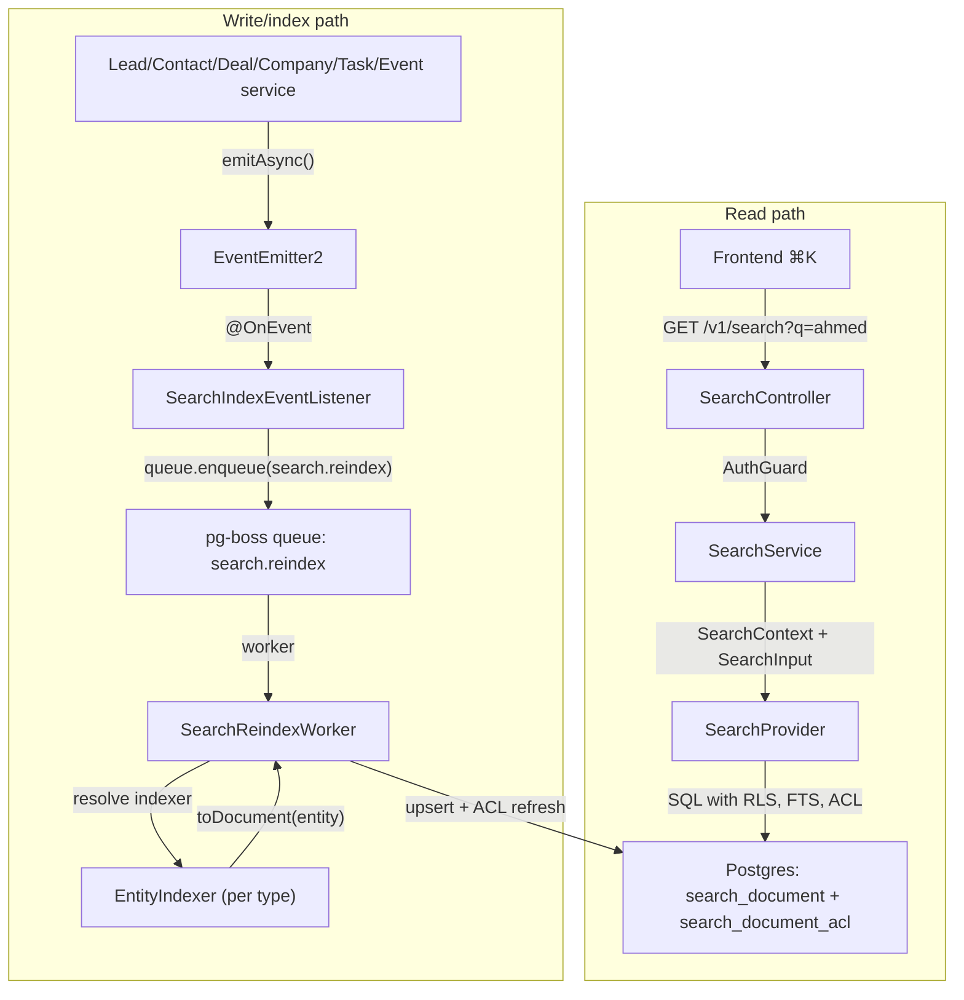

<Info>
**Version:** 0.6 (Phase 1 complete — backend + frontend ⌘K)  
**Last Updated:** May 2026  
**Status:** **Phase 1 (backend read/index + frontend ⌘K) landed** — Phase 1B **Steps 1–12**, Phase 1C **Steps 1–8**, Phase 1D **Steps 1–6**, Phase 1E **Steps 1–8** (frontend palette + Playwright smoke + §10 doc sync). **Remaining backend-only gaps:** `PostgresSearchProvider.reindexOrg()` (backfill orchestration helper) and §13.2 `search-backfill.e2e-spec.ts`. Cross-doc §16 rows for Steps 10–12 and Phase 1C/1D Step 6/8 are complete; Phase 1E Step 8 confirms no new backend cross-docs beyond this file §10.  
**Scope (Phase 1):** Lead, Contact, Deal, Company, Task, Event  
**Owner:** Backend Platform
</Info>

This document specifies the design of a permission-aware **global search** feature for PropWise CRM. Foundation work (Steps 2–9: module scaffold, worker/maintenance handlers, `SearchProvider` interface, indexer infrastructure, `normalizeSearchText()` §6.8, `buildSearchPermissionWhereClause()` §7.3, backfill script §6.4, unit tests) is implemented under `src/modules/search/`. **Phase 1B–1D** backend indexer/read paths and cross-doc sync are landed (see status banner). **Phase 1E** frontend ⌘K palette is landed in `propwise-crm-frontend` (§10).

## Design Summary in 5 Bullets

<Note>
Read this section first. It is enough to know **what to build** before diving into §4 (per-entity field mapping) or the full 1,400+ line spec.
</Note>

1. **What ships:** One tenant-scoped read endpoint — `GET /v1/search` — backed by a denormalized `search_document` table (one row per Lead, Contact, Deal, Company, Task, Event). Stakeholder-gated entities also get rows in `search_document_acl`. The frontend ⌘K palette consumes lightweight hits; full detail loads on click (§9–§10).

2. **Two pipelines, one table:** Search is **read** (sync SQL, P95 < 300ms) and **index** (async, ~2s P95 lag) decoupled. Domain services emit events → pg-boss queue `search.reindex` → `SearchReindexWorker` → per-entity `EntityIndexer.toDocument()` → upsert + ACL diff refresh. A slow indexer must not block CRM writes or search reads. See diagram below (canonical copy also in §2.2).

3. **What you implement (Phase 1B slice):** Migrations for `search_document` / `search_document_acl`, `SearchModule` + `PostgresSearchProvider`, the reindex worker, **`LeadIndexer` and `ContactIndexer`** in their owning CRM modules (registered via `SEARCH_INDEXERS`), event wiring in `LeadService` / `ContactService` / `PersonService` / `EntityStakeholderService`, shared **`normalizeSearchText()`** (§6.8), and E2E persona + Arabic normalization tests (§12, §13). File layout: §2.5.

4. **Permissions are not optional:** Contact, Deal, and Company use `visibility = 'stakeholder_only'` — indexers project `(user_id, team_id, access_level)` into `search_document_acl`; the read path filters with a fast `EXISTS` (§7). **Lead** is normally `stakeholder_only` but switches to `'org_wide'` while it is **unassigned** (zero active stakeholders → global pool), matching the always-available POOL list tab (§4.1). Task and Event are always `org_wide` (no ACL rows). If search returns a row the user cannot open in list view, the feature is broken.

5. **Where to read next:** **§4** — exact `title` / `subtitle` / `body` / ACL / reindex triggers per entity (read before writing any indexer). **§6** — queue config, worker contract, failure handling, cascades. **§12** — phase gates (1B = Lead + Contact only). Skip the rest until your slice needs it.



## 1. Overview & Goals

### 1.1 Definition

**Global search** is a single endpoint (`GET /v1/search`) and a single frontend surface (the ⌘K command palette) that lets a user type any keyword, name, public ID, email, or phone fragment and see matching CRM records they are authorized to view, ranked by relevance and recency. It is permission-aware and tenant-scoped. **Backend** indexing is eventually consistent (~2s p95; longer under backlog). **Frontend** shows the creator their own just-created items immediately via client-side pins (§10.3.1) so "create → ⌘K" never feels broken.

### 1.2 Goals (Phase 1)

| # | Goal | Acceptance |
| --- | --- | --- |
| G1 | One endpoint covers Lead, Contact, Deal, Company, Task, Event | A single request returns hits across all six entity types in one ranked list |
| G2 | Results respect existing org RLS and per-row stakeholder ACLs | An agent searching `ahmed` never sees a lead they are not a stakeholder on (and would not see in `/v1/leads/list`) |
| G3 | Read-your-writes within ~2 seconds (indexer) + immediate creator UX | Backend: newly created/updated entity appears in `GET /v1/search` within indexer P95 lag (~2s under normal load; longer during queue backlog per §13.4). **Frontend:** creator sees their own just-created items in ⌘K immediately via client-side "Just created" group (§10.3.1) — no synchronous index or source-table fallback in Phase 1 |
| G4 | Provider-swappable architecture | Swapping the Postgres provider for OpenSearch/Typesense in the future requires zero changes to controllers, services, or domain indexers |
| G5 | Phone and email substring matching for PII | Typing `+9715…` or `ahmed@` returns the matching person |
| G6 | Picker-style response shape | Lightweight hits (id, title, subtitle, entity type, permissions, score); the frontend fetches full detail on click |
| G7 | Arabic + mixed-script search (UAE market) | Typing `أحمد`, `احمد`, or `ahmed` finds the same lead when the record uses any of those forms; Arabic-Indic phone digits match Western digits |

### 1.3 Non-goals (Phase 1)

<Warning>
These features are explicitly out of scope for Phase 1 implementation:
</Warning>

| Non-goal | Why |
| --- | --- |
| Searching the audit log (`audit_log` table) | Audit data is sensitive and lives in its own admin-only UI. See `Docs/AUDIT_LOG_SYSTEM.md`. |
| Cross-org / global search for system admins | System admin is scoped to the **currently selected org** (i.e. `executeInOrg(orgId)`) — same as every other tenant endpoint. |
| User, Team, Off-plan project/unit, Conversation, Message, KnowledgeSource, Notification, Subscription, Commission Payment | Reserved for Phase 2 / Phase 3. |
| Search-as-you-type analytics ("what are people searching for") | Out of scope. Only operational metrics (latency, hit count) are collected. |
| Saved searches / pinned results / alerts | Phase 2. |
| Synchronous search index on create (blocking CRM write) | Async indexer only — see §10.3.1 for creator UX without backend coupling. |
| Server-side "query source tables on every search" fallback for the creator | Would couple search reads to CRM table performance; use client-side "Just created" pins instead (§10.3.1). |

## 2. Architecture

### 2.1 High-level Components

The search system consists of three main components:

<CardGroup cols={2}>
<Card title="Read Path" icon="magnifying-glass">
Synchronous SQL queries against denormalized `search_document` table with sub-300ms P95 latency
</Card>
<Card title="Index Path" icon="arrows-rotate">
Asynchronous event-driven pipeline that maintains search documents via pg-boss workers
</Card>
</CardGroup>

<CardGroup cols={2}>
<Card title="Permission Layer" icon="shield-check">
ACL-aware filtering using `search_document_acl` table for stakeholder-only entities
</Card>
<Card title="Provider Interface" icon="plug">
Abstracted `SearchProvider` interface allowing future migration to dedicated search engines
</Card>
</CardGroup>

### 2.2 Data Flow

The canonical data flow diagram shows the complete search pipeline:

1. **Domain services** (LeadService, ContactService, etc.) emit events when entities are created/updated
2. **SearchIndexEventListener** catches events and queues reindex jobs
3. **SearchReindexWorker** processes jobs using entity-specific indexers
4. **Search reads** query the denormalized table with permission filtering
5. **Frontend ⌘K** displays results and fetches full details on demand

### 2.3 Event-Driven Indexing

<Steps>
<Step title="Entity Change">
Domain service calls `this.eventEmitter.emitAsync('search.reindex', { ... })`
</Step>
<Step title="Event Handling">
`SearchIndexEventListener` receives event and validates payload
</Step>
<Step title="Queue Job">
Worker job queued via pg-boss with entity type and ID
</Step>
<Step title="Process Job">
`SearchReindexWorker` resolves appropriate indexer and processes entity
</Step>
<Step title="Update Index">
Search document and ACL records are upserted atomically
</Step>
</Steps>

### 2.4 Permission Architecture

The search system implements a two-tier permission model:

<Tabs>
<Tab title="Org-wide Entities">
Task and Event entities are visible to all users in the organization. No ACL records are created for these entity types.
</Tab>
<Tab title="Stakeholder-only Entities">
Contact, Deal, Company, and assigned Lead entities require explicit stakeholder permissions stored in `search_document_acl`.
</Tab>
<Tab title="Special Case: Unassigned Leads">
Leads with zero active stakeholders are treated as org-wide to match the POOL list behavior.
</Tab>
</Tabs>

### 2.5 File Layout

The search module follows a clean architecture pattern with clear separation of concerns:

```
src/modules/search/
├── search.module.ts                     # Module definition + provider registration
├── controllers/
│   └── search.controller.ts            # GET /v1/search endpoint
├── services/
│   └── search.service.ts               # Business logic layer
├── providers/
│   ├── search-provider.interface.ts    # Abstract provider contract
│   └── postgres-search.provider.ts     # Postgres implementation
├── workers/
│   └── search-reindex.worker.ts        # pg-boss reindex handler
├── listeners/
│   └── search-index-event.listener.ts  # Domain event handler
├── indexers/
│   └── entity-indexer.interface.ts     # Indexer contract
├── dto/
│   ├── search-input.dto.ts             # Request validation
│   ├── search-output.dto.ts            # Response shape
│   └── search-context.dto.ts           # Internal context
├── utils/
│   ├── normalize-search-text.util.ts   # Text normalization
│   └── build-permission-clause.util.ts # ACL query builder
└── migrations/
    ├── 001-create-search-document.sql
    └── 002-create-search-document-acl.sql
```

## 3. Data Model

### 3.1 Search Document Table

The core `search_document` table stores denormalized, searchable representations of all indexed entities:

```sql
CREATE TABLE search_document (
  id UUID PRIMARY KEY,
  org_id UUID NOT NULL REFERENCES organization(id) ON DELETE CASCADE,
  entity_type VARCHAR(50) NOT NULL,
  entity_id UUID NOT NULL,
  visibility VARCHAR(20) NOT NULL CHECK (visibility IN ('org_wide', 'stakeholder_only')),
  
  -- Searchable content
  title TEXT NOT NULL,
  subtitle TEXT,
  body TEXT,
  
  -- Full-text search vectors
  title_vector tsvector,
  body_vector tsvector,
  
  -- Ranking factors
  boost_score DECIMAL(10,2) DEFAULT 1.0,
  created_at TIMESTAMPTZ NOT NULL,
  updated_at TIMESTAMPTZ NOT NULL,
  last_activity_at TIMESTAMPTZ,
  
  -- Metadata
  metadata JSONB DEFAULT '{}',
  
  UNIQUE (org_id, entity_type, entity_id),
  INDEX idx_search_document_org_visibility (org_id, visibility),
  INDEX idx_search_document_title_gin (title_vector) USING gin,
  INDEX idx_search_document_body_gin (body_vector) USING gin
);
```

### 3.2 Access Control List Table

The `search_document_acl` table manages fine-grained permissions for stakeholder-only entities:

```sql
CREATE TABLE search_document_acl (
  search_document_id UUID NOT NULL REFERENCES search_document(id) ON DELETE CASCADE,
  user_id UUID REFERENCES "user"(id) ON DELETE CASCADE,
  team_id UUID REFERENCES team(id) ON DELETE CASCADE,
  access_level VARCHAR(20) NOT NULL,
  
  PRIMARY KEY (search_document_id, COALESCE(user_id, '00000000-0000-0000-0000-000000000000'), COALESCE(team_id, '00000000-0000-0000-0000-000000000000')),
  CHECK (user_id IS NOT NULL OR team_id IS NOT NULL)
);

CREATE INDEX idx_search_acl_user ON search_document_acl (user_id) WHERE user_id IS NOT NULL;
CREATE INDEX idx_search_acl_team ON search_document_acl (team_id) WHERE team_id IS NOT NULL;
```

<Note>
The composite primary key uses COALESCE to handle NULL values in user_id/team_id columns, ensuring uniqueness while allowing either user or team-based permissions.
</Note>

### 3.3 Text Search Configuration

PostgreSQL full-text search is configured with Arabic language support:

```sql
-- Create Arabic text search configuration
CREATE TEXT SEARCH CONFIGURATION arabic_english (COPY = simple);
ALTER TEXT SEARCH CONFIGURATION arabic_english
  ALTER MAPPING FOR word, email, url, host WITH simple;
```

## 4. Per-Entity Field Mapping

This section defines exactly how each CRM entity maps to the `search_document` schema. **Read this before implementing any indexer.**

### 4.1 Lead

<Tabs>
<Tab title="Field Mapping">
```typescript
{
  title: `${lead.firstName} ${lead.lastName}` || lead.email || lead.publicId,
  subtitle: lead.publicId + " • " + lead.source?.name,
  body: [
    lead.email,
    lead.phone,
    lead.company,
    lead.description,
    lead.address?.full,
    lead.tags?.join(' ')
  ].filter(Boolean).join('\n'),
  visibility: lead.stakeholders?.length > 0 ? 'stakeholder_only' : 'org_wide',
  boost_score: lead.isHot ? 2.0 : 1.0,
  last_activity_at: lead.lastContactedAt || lead.updatedAt
}
```
</Tab>
<Tab title="ACL Logic">
**When visibility = 'stakeholder_only':**
- Project active stakeholders from `entity_stakeholder` table
- Include both user and team stakeholders
- Use access_level from stakeholder record

**When visibility = 'org_wide':**
- No ACL records created
- Available to all org users (unassigned lead pool behavior)
</Tab>
<Tab title="Reindex Triggers">
- Lead create/update/delete
- Lead stakeholder add/remove/update
- Lead source update (cascaded)
- Lead tag changes
</Tab>
</Tabs>

<Warning>
Lead visibility logic is unique: it switches between 'stakeholder_only' and 'org_wide' based on whether active stakeholders exist. This matches the POOL tab behavior where unassigned leads are visible to all agents.
</Warning>

### 4.2 Contact

<Tabs>
<Tab title="Field Mapping">
```typescript
{
  title: `${contact.firstName} ${contact.lastName}` || contact.email || contact.publicId,
  subtitle: contact.publicId + " • " + contact.jobTitle + " @ " + contact.company?.name,
  body: [
    contact.email,
    contact.phone,
    contact.personalEmail,
    contact.personalPhone,
    contact.description,
    contact.company?.name,
    contact.address?.full,
    contact.tags?.join(' ')
  ].filter(Boolean).join('\n'),
  visibility: 'stakeholder_only',
  boost_score: contact.isVip ? 2.5 : 1.0,
  last_activity_at: contact.lastContactedAt || contact.updatedAt
}
```
</Tab>
<Tab title="ACL Logic">
**Always visibility = 'stakeholder_only':**
- Project active stakeholders from `entity_stakeholder` table
- Include user and team stakeholders
- Contact creation automatically adds creator as stakeholder
</Tab>
<Tab title="Reindex Triggers">
- Contact create/update/delete
- Contact stakeholder add/remove/update
- Company update (cascaded if contact.companyId matches)
- Contact tag changes
</Tab>
</Tabs>

### 4.3 Deal

<Tabs>
<Tab title="Field Mapping">
```typescript
{
  title: deal.title || `${deal.publicId} - ${deal.contact?.fullName}`,
  subtitle: deal.publicId + " • " + formatCurrency(deal.value) + " • " + deal.stage?.name,
  body: [
    deal.description,
    deal.contact?.fullName,
    deal.contact?.email,
    deal.company?.name,
    deal.property?.name,
    deal.property?.address,
    deal.notes,
    deal.tags?.join(' ')
  ].filter(Boolean).join('\n'),
  visibility: 'stakeholder_only',
  boost_score: deal.isHot ? 2.0 : (deal.value > 1000000 ? 1.5 : 1.0),
  last_activity_at: deal.lastActivityAt || deal.updatedAt
}
```
</Tab>
<Tab title="ACL Logic">
**Always visibility = 'stakeholder_only':**
- Project active stakeholders from `entity_stakeholder` table
- Deal creation automatically adds creator as stakeholder
- Pipeline stage changes may trigger stakeholder updates
</Tab>
<Tab title="Reindex Triggers">
- Deal create/update/delete
- Deal stakeholder add/remove/update
- Deal stage update
- Contact/Company update (cascaded)
- Property update (cascaded if linked)
</Tab>
</Tabs>

### 4.4 Company

<Tabs>
<Tab title="Field Mapping">
```typescript
{
  title: company.name || company.publicId,
  subtitle: company.publicId + " • " + company.industry + " • " + company.country,
  body: [
    company.description,
    company.website,
    company.industry,
    company.address?.full,
    company.phone,
    company.email,
    company.tags?.join(' ')
  ].filter(Boolean).join('\n'),
  visibility: 'stakeholder_only',
  boost_score: company.isPartner ? 2.5 : 1.0,
  last_activity_at: company.lastContactedAt || company.updatedAt
}
```
</Tab>
<Tab title="ACL Logic">
**Always visibility = 'stakeholder_only':**
- Project active stakeholders from `entity_stakeholder` table
- Company creation automatically adds creator as stakeholder
</Tab>
<Tab title="Reindex Triggers">
- Company create/update/delete
- Company stakeholder add/remove/update
- Company tag changes
</Tab>
</Tabs>

### 4.5 Task

<Tabs>
<Tab title="Field Mapping">
```typescript
{
  title: task.title || `Task ${task.publicId}`,
  subtitle: task.publicId + " • " + task.type + " • " + formatDate(task.dueDate),
  body: [
    task.description,
    task.linkedEntity?.name,
    task.assignee?.fullName,
    task.project?.name
  ].filter(Boolean).join('\n'),
  visibility: 'org_wide',
  boost_score: task.priority === 'high' ? 1.5 : 1.0,
  last_activity_at: task.completedAt || task.dueDate || task.updatedAt
}
```
</Tab>
<Tab title="ACL Logic">
**Always visibility = 'org_wide':**
- No ACL records created
- All org users can see all tasks
- Matches current task list behavior
</Tab>
<Tab title="Reindex Triggers">
- Task create/update/delete
- Task assignee change
- Linked entity updates (cascaded)
</Tab>
</Tabs>

### 4.6 Event

<Tabs>
<Tab title="Field Mapping">
```typescript
{
  title: event.title || `${event.type} - ${formatDate(event.startTime)}`,
  subtitle: event.publicId + " • " + formatDateTime(event.startTime),
  body: [
    event.description,
    event.location,
    event.linkedEntity?.name,
    event.attendees?.map(a => a.fullName).join(', ')
  ].filter(Boolean).join('\n'),
  visibility: 'org_wide',
  boost_score: event.isImportant ? 1.5 : 1.0,
  last_activity_at: event.startTime || event.updatedAt
}
```
</Tab>
<Tab title="ACL Logic">
**Always visibility = 'org_wide':**
- No ACL records created
- All org users can see all events
- Matches current calendar behavior
</Tab>
<Tab title="Reindex Triggers">
- Event create/update/delete
- Event attendee changes
- Linked entity updates (cascaded)
</Tab>
</Tabs>

## 5. Adding a New Entity to Search (Future Playbook)

<Steps>
<Step title="Create Entity Indexer">
Implement `EntityIndexer<YourEntity>` interface in the entity's own module (not in search module)

```typescript
@Injectable()
export class YourEntityIndexer implements EntityIndexer<YourEntity> {
  async toDocument(entity: YourEntity, context: SearchContext): Promise<SearchDocument> {
    // Map entity fields to search document
  }
}
```
</Step>

<Step title="Register Indexer">
Add to the `SEARCH_INDEXERS` token in your entity's module:

```typescript
{
  provide: SEARCH_INDEXERS,
  useFactory: (indexer: YourEntityIndexer) => ({ 'your-entity': indexer }),
  inject: [YourEntityIndexer],
  multi: true
}
```
</Step>

<Step title="Wire Events">
Emit reindex events in your domain service:

```typescript
await this.eventEmitter.emitAsync('search.reindex', {
  entityType: 'your-entity',
  entityId: entity.id,
  orgId: context.orgId
});
```
</Step>

<Step title="Add Cascaded Events">
If other entities reference yours, emit cascade events:

```typescript
// When parent entity changes
await this.eventEmitter.emitAsync('search.reindex.cascade', {
  entityType: 'child-entity',
  filterBy: { parentId: parent.id },
  orgId: context.orgId
});
```
</Step>

<Step title="Update Permission Logic">
If your entity uses stakeholder-only visibility, ensure your indexer properly handles ACL projection
</Step>

<Step title="Add Tests">
Create unit tests for your indexer and integration tests for the complete pipeline
</Step>
</Steps>

## 6. Indexing Pipeline

### 6.1 Queue Configuration

The search indexer uses pg-boss for reliable job processing:

```typescript
const queueConfig = {
  queueName: 'search.reindex',
  retryLimit: 3,
  retryDelay: 5000, // 5 seconds
  expireInHours: 24,
  batchSize: 10 // Process up to 10 entities per worker cycle
};
```

<Warning>
The indexer queue is configured with conservative retry limits to prevent cascade loops. If an entity consistently fails to index, it will be marked as failed after 3 attempts and require manual investigation.
</Warning>

### 6.2 Worker Contract

The `SearchReindexWorker` processes jobs with the following contract:

```typescript
interface ReindexJob {
  entityType: string;
  entityId: string;
  orgId: string;
  operation?: 'upsert' | 'delete';
  cascadeDepth?: number; // Prevent infinite cascade loops
}
```

### 6.3 Failure Handling

<Tabs>
<Tab title="Transient Failures">
- Database connection issues
- Temporary service unavailability
- Lock timeouts

**Behavior:** Automatic retry with exponential backoff (3 attempts max)
</Tab>
<Tab title="Permanent Failures">
- Entity not found (deleted during processing)
- Invalid entity state
- Indexer implementation errors

**Behavior:** Job marked as failed, error logged for investigation
</Tab>
<Tab title="Cascade Loops">
- Circular entity references
- Runaway cascade updates

**Behavior:** `cascadeDepth` tracking prevents infinite loops (max depth: 5)
</Tab>
</Tabs>

### 6.4 Backfill Operations

For initial indexing or reindexing after schema changes, use the backfill script:

```bash
npm run search:backfill -- --entity-type=lead --org-id=<uuid>
npm run search:backfill -- --org-id=<uuid> # All entities
npm run search:backfill -- --dry-run # Validate without changes
```

<Tip>
Run backfill operations during low-traffic periods as they can generate significant queue load. Monitor the queue depth and worker processing rates during backfill.
</Tip>

### 6.5 Cascade Logic

Some entity updates trigger cascaded reindexing of related entities:

<AccordionGroup>
<Accordion title="Contact → Deal/Lead cascade">
When a contact is updated, all deals and leads referencing that contact are reindexed to update their subtitle and body content.
</Accordion>
<Accordion title="Company → Contact/Deal cascade">
Company updates cascade to contacts and deals that reference the company, updating their search content.
</Accordion>
<Accordion title="Stakeholder changes">
Adding/removing stakeholders triggers immediate reindexing of the entity to update ACL permissions.
</Accordion>
</AccordionGroup>

### 6.6 Performance Characteristics

<Info>
**Target Performance (Phase 1):**
- Normal indexing lag: ~2 seconds P95
- Backfill throughput: 1000 entities/minute
- Worker concurrency: 5 workers max per org
- Queue capacity: 10,000 jobs before backpressure
</Info>

### 6.7 Monitoring & Alerts

Key metrics tracked by the indexing pipeline:

- Queue depth and processing rate
- Indexer success/failure rates by entity type
- Average processing time per entity
- Cascade operation counts
- Full-text search vector generation time

### 6.8 Text Normalization

The `normalizeSearchText()` utility handles Arabic/English mixed-script normalization:

```typescript
export function normalizeSearchText(text: string): string {
  return text
    .toLowerCase()
    // Normalize Arabic diacritics
    .replace(/[\u064B-\u0652]/g, '') // Remove harakat
    .replace(/[أإآ]/g, 'ا') // Normalize alif variations
    .replace(/[ىي]/g, 'ي') // Normalize yaa
    .replace(/ة/g, 'ه') // Normalize taa marbouta
    // Normalize Arabic-Indic digits to Western
    .replace(/[٠-٩]/g, (d) => String.fromCharCode(d.charCodeAt(0) - 1584 + 48))
    // Normalize whitespace
    .replace(/\s+/g, ' ')
    .trim();
}
```

## 7. Permission Gate

### 7.1 Permission Model

The search system implements a two-tier permission model that mirrors the existing CRM access controls:

<CardGroup cols={2}>
<Card title="Org-wide Entities" icon="globe">
Task and Event are visible to all users within the organization boundary (RLS enforcement only)
</Card>
<Card title="Stakeholder-only Entities" icon="users">
Lead, Contact, Deal, Company require explicit stakeholder relationships stored in ACL table
</Card>
</CardGroup>

### 7.2 ACL Table Design

The `search_document_acl` table stores fine-grained permissions:

```sql
CREATE TABLE search_document_acl (
  search_document_id UUID NOT NULL,
  user_id UUID NULL,
  team_id UUID NULL,
  access_level VARCHAR(20) NOT NULL,
  
  PRIMARY KEY (search_document_id, COALESCE(user_id, '00000000-0000-0000-0000-000000000000'), COALESCE(team_id, '00000000-0000-0000-0000-000000000000')),
  CHECK (user_id IS NOT NULL OR team_id IS NOT NULL)
);
```

<Note>
Each ACL record grants either user-specific or team-specific access. The composite primary key prevents duplicate permissions while allowing NULL values in either user_id or team_id.
</Note>

### 7.3 Query-time Permission Filtering

The `buildSearchPermissionWhereClause()` utility generates SQL for permission filtering:

```typescript
export function buildSearchPermissionWhereClause(userId: string, userTeamIds: string[]): string {
  return `
    (
      -- Org-wide entities (no ACL check needed)
      sd.visibility = 'org_wide'
      OR
      -- Stakeholder-only entities with explicit access
      EXISTS (
        SELECT 1 FROM search_document_acl acl
        WHERE acl.search_document_id = sd.id
        AND (
          acl.user_id = $userId
          OR acl.team_id = ANY($userTeamIds)
        )
      )
    )
  `;
}
```

### 7.4 Special Cases

<Tabs>
<Tab title="Unassigned Leads">
Leads with zero active stakeholders are indexed with `visibility = 'org_wide'` to match the POOL list behavior where unassigned leads are available to all agents.
</Tab>
<Tab title="System Administrators">
System admins are subject to the same org-scoped permissions as regular users. There is no cross-org search capability.
</Tab>
<Tab title="Deleted Stakeholders">
When stakeholders are removed, the ACL records are immediately deleted and the entity is reindexed to update permissions.
</Tab>
</Tabs>

### 7.5 Permission Consistency

<Check>
**Critical Requirement:** If search returns an entity, the user MUST be able to open it in the corresponding list view. Permission mismatches break the user experience.
</Check>

To maintain consistency:

1. **ACL projection** during indexing uses the same stakeholder resolution logic as list endpoints
2. **Permission changes** trigger immediate reindexing to update ACL records
3. **Integration tests** verify search results match list view access for test personas

## 8. Ranking & Query Construction

### 8.1 Full-text Search Setup

PostgreSQL's full-text search is configured with Arabic-English support:

```sql
-- Search query construction
SELECT sd.*,
  ts_rank_cd(
    setweight(sd.title_vector, 'A') || setweight(sd.body_vector, 'B'),
    plainto_tsquery('arabic_english', $normalizedQuery)
  ) * sd.boost_score AS relevance_score
FROM search_document sd
WHERE (
  sd.title_vector @@ plainto_tsquery('arabic_english', $normalizedQuery)
  OR sd.body_vector @@ plainto_tsquery('arabic_english', $normalizedQuery)
)
```

### 8.2 Ranking Factors

Search results are ranked by a composite score considering:

<Tabs>
<Tab title="Relevance Score">
- **Title matches** weighted higher (A) than body matches (B)
- **Exact phrase matches** score higher than individual terms
- **Term proximity** affects ranking for multi-word queries
</Tab>
<Tab title="Boost Factors">
- **Lead.isHot** = 2.0x multiplier
- **Contact.isVip** = 2.5x multiplier
- **Deal.isHot** = 2.0x multiplier
- **High-value deals** (>1M) = 1.5x multiplier
- **Task.priority=high** = 1.5x multiplier
- **Event.isImportant** = 1.5x multiplier
</Tab>
<Tab title="Recency Factors">
- **Recent activity** (last 7 days) gets slight boost
- **Recently created** entities prioritized for tie-breaking
</Tab>
</Tabs>

### 8.3 Query Processing Pipeline

<Steps>
<Step title="Input Normalization">
Apply `normalizeSearchText()` for Arabic/English mixed-script support
</Step>
<Step title="Query Analysis">
- Detect email patterns (`@` symbol)
- Detect phone patterns (`+` prefix or digit sequences)
- Identify public ID patterns (entity prefixes)
</Step>
<Step title="FTS Vector Search">
Use PostgreSQL's `plainto_tsquery` for main content matching
</Step>
<Step title="Exact Match Boosting">
Additional scoring for exact substring matches in title/body
</Step>
<Step title="Permission Filtering">
Apply ACL constraints using `EXISTS` subquery
</Step>
<Step title="Result Ranking">
Order by composite relevance score with recency tie-breaking
</Step>
</Steps>

### 8.4 Query Optimization

<Info>
**Performance Targets:**
- P95 latency < 300ms
- Support concurrent search load up to 100 RPS per org
- GIN indexes on tsvector columns for sub-50ms FTS queries
</Info>

Key optimizations:

- **Composite indexes** on (org_id, visibility) for fast permission pre-filtering
- **GIN indexes** on tsvector columns for full-text search
- **Partial indexes** on ACL table for user/team lookups
- **Query plan caching** for common search patterns

## 9. API Contract

### 9.1 Endpoint Definition

```http
GET /v1/search
Authorization: Bearer <jwt_token>
Content-Type: application/json
```

### 9.2 Request Parameters

<CodeGroup>
```typescript Query Parameters
interface SearchQuery {
  q: string;           // Search query (required, min: 1 char, max: 200)
  limit?: number;      // Result limit (default: 20, max: 100)
  offset?: number;     // Pagination offset (default: 0)
  entityTypes?: string[]; // Filter by entity types (optional)
}
```

```bash Example Request
GET /v1/search?q=ahmed&limit=10&entityTypes[]=lead&entityTypes[]=contact
```
</CodeGroup>

### 9.3 Response Format

<CodeGroup>
```typescript Response Schema
interface SearchResponse {
  hits: SearchHit[];
  totalCount: number;
  query: string;
  executionTimeMs: number;
}

interface SearchHit {
  id: string;
  entityType: 'lead' | 'contact' | 'deal' | 'company' | 'task' | 'event';
  title: string;
  subtitle?: string;
  score: number;
  permissions: {
    canView: boolean;
    canEdit: boolean;
    accessLevel?: string;
  };
  metadata?: Record<string, any>;
  createdAt: string; // ISO 8601
  updatedAt: string; // ISO 8601
}
```

```json Example Response
{
  "hits": [
    {
      "id": "123e4567-e89b-12d3-a456-426614174000",
      "entityType": "lead",
      "title": "Ahmed Hassan",
      "subtitle": "L-2024-001 • Website",
      "score": 0.875,
      "permissions": {
        "canView": true,
        "canEdit": true,
        "accessLevel": "full"
      },
      "createdAt": "2024-01-15T10:30:00Z",
      "updatedAt": "2024-01-15T14:22:00Z"
    }
  ],
  "totalCount": 1,
  "query": "ahmed",
  "executionTimeMs": 145
}
```
</CodeGroup>

### 9.4 Error Responses

<Tabs>
<Tab title="Validation Errors">
```json
{
  "error": "validation_error",
  "message": "Query string too short",
  "details": {
    "field": "q",
    "constraint": "minLength",
    "value": ""
  }
}
```
</Tab>
<Tab title="Permission Errors">
```json
{
  "error": "permission_denied",
  "message": "Search access not authorized for organization"
}
```
</Tab>
<Tab title="System Errors">
```json
{
  "error": "search_unavailable",
  "message": "Search service temporarily unavailable",
  "retryAfter": 30
}
```
</Tab>
</Tabs>

### 9.5 Rate Limiting

<Warning>
Search endpoint is rate-limited to prevent abuse:
- **Authenticated users:** 60 requests/minute
- **Burst allowance:** Up to 10 requests in 10 seconds
- **Org-wide limit:** 1000 requests/minute
</Warning>

Rate limit headers are included in responses:

```http
X-RateLimit-Limit: 60
X-RateLimit-Remaining: 45
X-RateLimit-Reset: 1640995200
```

## 10. Frontend Contract

### 10.1 Command Palette Integration

The frontend ⌘K command palette integrates with the search API to provide a unified search experience:

<Tabs>
<Tab title="Activation">
- **Keyboard shortcut:** Cmd+K (Mac) / Ctrl+K (Windows/Linux)
- **Alternative:** Click search icon in top navigation
- **Focus behavior:** Auto-focus search input on open
</Tab>
<Tab title="Search Behavior">
- **Debounced input:** 300ms delay after typing stops
- **Minimum query:** 1 character (no empty state search)
- **Loading state:** Skeleton placeholders during API calls
- **Error handling:** Inline error messages with retry options
</Tab>
</Tabs>

### 10.2 Result Display

Search results are displayed in a grouped, ranked list:

```typescript
interface SearchResultGroup {
  title: string;
  items: SearchResultItem[];
  totalCount: number;
}

interface SearchResultItem {
  id: string;
  entityType: EntityType;
  title: string;
  subtitle?: string;
  icon: string; // Entity type icon
  badge?: string; // Status indicators
  onClick: () => void; // Navigation handler
}
```

**Result grouping:**
1. **"Just created"** - Client-side recent items (§10.3.1)
2. **"Leads"** - Lead entity results
3. **"Contacts"** - Contact entity results  
4. **"Deals"** - Deal entity results
5. **"Companies"** - Company entity results
6. **"Tasks"** - Task entity results
7. **"Events"** - Event entity results

### 10.3 Client-side Optimizations

<Tabs>
<Tab title="Just Created Items">
The frontend maintains a client-side cache of recently created items to provide immediate search results for the creator:

```typescript
interface JustCreatedItem {
  id: string;
  entityType: EntityType;
  title: string;
  subtitle?: string;
  createdAt: Date;
  createdBy: string; // Current user ID
}

// Items expire after 5 minutes or when found in search results
const JUST_CREATED_TTL = 5 * 60 * 1000; // 5 minutes
```

This ensures "create → ⌘K" workflows feel instant without requiring synchronous indexing.
</Tab>
<Tab title="Result Caching">
Search results are cached client-side for 30 seconds to improve perceived performance:

- **Cache key:** Query string + entity type filters
- **Invalidation:** Time-based (30s TTL)
- **Memory limit:** 50 cached result sets max
</Tab>
<Tab title="Keyboard Navigation">
Full keyboard navigation support:
- **Arrow keys:** Navigate between results
- **Enter:** Open selected result
- **Tab:** Move between groups
- **Escape:** Close palette
</Tab>
</Tabs>

### 10.4 Navigation Behavior

When a user selects a search result:

<Steps>
<Step title="Route Resolution">
Map entity type and ID to appropriate frontend route:
- Lead: `/leads/{id}`
- Contact: `/contacts/{id}`
- Deal: `/deals/{id}`
- Company: `/companies/{id}`
- Task: `/tasks/{id}`
- Event: `/events/{id}`
</Step>
<Step title="Detail Fetch">
Navigate to entity detail page, which handles:
- Permission verification
- Full entity data loading
- Breadcrumb updates
- Recent items tracking
</Step>
<Step title="Palette Closure">
Close search palette and focus the opened entity detail
</Step>
</Steps>

### 10.5 Error States

<Warning>
The frontend must handle several error conditions gracefully:
</Warning>

<Tabs>
<Tab title="Search API Errors">
- **Network errors:** Show "Search temporarily unavailable" with retry button
- **Permission errors:** Show "Search access denied" message
- **Rate limits:** Show "Too many searches" with countdown timer
</Tab>
<Tab title="Navigation Errors">
- **Deleted entities:** Show "This item no longer exists" toast
- **Permission denied:** Redirect to appropriate error page
- **Route not found:** Fallback to entity list view
</Tab>
<Tab title="Empty States">
- **No results:** Show helpful message with search tips
- **Query too short:** Show minimum character requirement
- **Loading timeout:** Show retry option after 10 seconds
</Tab>
</Tabs>

### 10.6 Analytics & Metrics

<Info>
The frontend tracks key search usage metrics:
</Info>

- **Search queries:** Query text (hashed), result count, response time
- **Result interactions:** Click-through rates by entity type and position
- **Palette usage:** Open frequency, keyboard vs. mouse usage
- **Error rates:** Search failures, navigation errors, timeout rates

All metrics respect user privacy by hashing personally identifiable information.

## 11. SearchProvider Abstraction

### 11.1 Interface Design

The `SearchProvider` interface abstracts search implementation details, enabling future migration to dedicated search engines:

```typescript
export interface SearchProvider {
  search(context: SearchContext, input: SearchInput): Promise<SearchResult>;
  healthCheck(): Promise<HealthStatus>;
  getMetrics(): Promise<SearchMetrics>;
}

export interface SearchContext {
  userId: string;
  orgId: string;
  userTeamIds: string[];
  permissions: UserPermissions;
}

export interface SearchInput {
  query: string;
  entityTypes?: EntityType[];
  limit: number;
  offset: number;
  filters?: SearchFilters;
}
```

### 11.2 PostgresSearchProvider Implementation

The Postgres implementation provides full-text search using native PostgreSQL capabilities:

<Tabs>
<Tab title="Core Methods">
```typescript
@Injectable()
export class PostgresSearchProvider implements SearchProvider {
  async search(context: SearchContext, input: SearchInput): Promise<SearchResult> {
    // 1. Normalize query text
    const normalizedQuery = normalizeSearchText(input.query);
    
    // 2. Build permission WHERE clause
    const permissionClause = buildSearchPermissionWhereClause(
      context.userId,
      context.userTeamIds
    );
    
    // 3. Execute FTS query with ranking
    const results = await this.executeSearchQuery(
      normalizedQuery,
      permissionClause,
      input
    );
    
    // 4. Transform to SearchResult format
    return this.transformResults(results, input);
  }
}
```
</Tab>
<Tab title="Query Execution">
```sql
SELECT sd.*,
  ts_rank_cd(
    setweight(sd.title_vector, 'A') || setweight(sd.body_vector, 'B'),
    plainto_tsquery('arabic_english', $1)
  ) * sd.boost_score AS relevance_score
FROM search_document sd
WHERE sd.org_id = $2
  AND ($3::varchar[] IS NULL OR sd.entity_type = ANY($3))
  AND (
    sd.title_vector @@ plainto_tsquery('arabic_english', $1)
    OR sd.body_vector @@ plainto_tsquery('arabic_english', $1)
  )
  AND (
    sd.visibility = 'org_wide'
    OR EXISTS (
      SELECT 1 FROM search_document_acl acl
      WHERE acl.search_document_id = sd.id
      AND (acl.user_id = $4 OR acl.team_id = ANY($5))
    )
  )
ORDER BY relevance_score DESC, sd.last_activity_at DESC NULLS LAST
LIMIT $6 OFFSET $7;
```
</Tab>
</Tabs>

### 11.3 Future Provider Options

<Info>
The abstracted interface enables future migration to dedicated search engines:
</Info>

<CardGroup cols={2}>
<Card title="OpenSearch Provider" icon="magnifying-glass">
Elasticsearch/OpenSearch implementation for advanced search features like faceting, highlighting, and complex aggregations
</Card>
<Card title="Typesense Provider" icon="bolt">
Typesense implementation for typo tolerance, instant search, and simplified configuration
</Card>
</CardGroup>

**Migration considerations:**
- **Index structure mapping** to target search engine schema
- **Permission filtering** implementation in target system
- **Text normalization** compatibility with target language analyzers
- **Performance characteristics** and query optimization patterns

### 11.4 Provider Selection

Provider selection is configured via environment variables:

```typescript
// search.module.ts
const searchProvider = {
  provide: SearchProvider,
  useClass: process.env.SEARCH_PROVIDER === 'opensearch' 
    ? OpenSearchProvider 
    : PostgresSearchProvider,
};
```

### 11.5 Health Checks & Monitoring

All providers implement consistent health checking:

```typescript
interface HealthStatus {
  status: 'healthy' | 'degraded' | 'unhealthy';
  responseTime?: number;
  indexSize?: number;
  lastIndexUpdate?: Date;
  errors?: string[];
}

interface SearchMetrics {
  queryCount: number;
  averageLatency: number;
  errorRate: number;
  cacheHitRate?: number;
}
```

<Check>
Health checks are exposed via `/health/search` endpoint for monitoring integration.
</Check>

## 12. Phased Rollout

### 12.1 Phase Overview

The search feature is delivered in phases to manage complexity and enable early feedback:

<Tabs>
<Tab title="Phase 1A (Foundation)">
**Status:** ✅ Complete

- Search module scaffold and interfaces
- Database migrations for `search_document` and `search_document_acl`
- `SearchReindexWorker` and event handling infrastructure  
- Shared utilities (`normalizeSearchText`, permission builders)
- Basic unit test coverage
</Tab>
<Tab title="Phase 1B (Lead + Contact)">
**Status:** ✅ Complete

- `LeadIndexer` and `ContactIndexer` implementations
- Event wiring in `LeadService`, `ContactService`, `PersonService`
- `EntityStakeholderService` event integration
- E2E tests for Lead and Contact search workflows
- Arabic text normalization testing
</Tab>
<Tab title="Phase 1C (Deal + Company)">
**Status:** ✅ Complete

- `DealIndexer` and `CompanyIndexer` implementations
- Event wiring in `DealService` and `CompanyService`
- Cascade logic for related entity updates
- Stakeholder permission testing for Deal/Company
- Performance testing with larger datasets
</Tab>
<Tab title="Phase 1D (Task + Event)">
**Status:** ✅ Complete

- `TaskIndexer` and `EventIndexer` implementations  
- Event wiring in `TaskService` and `EventService`
- Org-wide visibility testing (no ACL records)
- Complete backend API implementation
- Backend performance and throughput validation
</Tab>
<Tab title="Phase 1E (Frontend ⌘K)">
**Status:** ✅ Complete

- Frontend command palette implementation
- Search API integration and error handling
- Client-side "Just created" items for immediate UX
- Keyboard navigation and accessibility
- End-to-end Playwright test coverage
</Tab>
</Tabs>

### 12.2 Phase Gates

Each phase has specific acceptance criteria that must be met before proceeding:

<AccordionGroup>
<Accordion title="Phase 1B Gate">
**Requirements:**
- [ ] Lead and Contact indexers pass all unit tests
- [ ] Arabic text normalization works for lead/contact names and emails
- [ ] Stakeholder permission filtering correctly applied
- [ ] Search returns results within 300ms P95 for test dataset
- [ ] E2E test coverage >90% for Lead/Contact scenarios

**Rollout:** Enable search for Lead and Contact entities in staging environment
</Accordion>

<Accordion title="Phase 1C Gate">
**Requirements:**  
- [ ] Deal and Company indexers handle all field mappings correctly
- [ ] Cascade reindexing works for Contact→Deal and Company→Contact relationships
- [ ] High-value deal boosting correctly applied in ranking
- [ ] ACL performance remains <50ms for 10K+ stakeholder relationships
- [ ] Backfill script successfully processes 100K+ entities

**Rollout:** Enable Deal and Company search in staging, prepare for beta user testing
</Accordion>

<Accordion title="Phase 1D Gate">
**Requirements:**
- [ ] Task and Event indexers implement org-wide visibility correctly  
- [ ] No ACL records created for Task/Event entities
- [ ] Complete backend API passes all integration tests
- [ ] Search throughput supports 100+ concurrent users per org
- [ ] Queue processing handles 1000+ entities/minute during backfill

**Rollout:** Complete backend ready for production, begin frontend integration
</Accordion>

<Accordion title="Phase 1E Gate">  
**Requirements:**
- [ ] Command palette ⌘K integration complete
- [ ] Client-side "Just created" items work correctly
- [ ] Error handling and loading states implemented
- [ ] Playwright E2E tests cover complete user journeys
- [ ] Performance meets <300ms search response targets

**Rollout:** Full production release to all organizations
</Accordion>
</AccordionGroup>

### 12.3 Feature Flags

<Warning>
Search functionality is controlled by feature flags for safe rollout:
</Warning>

```typescript
// Feature flag configuration
const searchFeatureFlags = {
  'search.enabled': true,                    // Global search enable/disable
  'search.entities.lead': true,              // Per-entity toggles
  'search.entities.contact': true,
  'search.entities.deal': true,
  'search.entities.company': true,
  'search.entities.task': true,
  'search.entities.event': true,
  'search.frontend.command-palette': true,   // Frontend feature toggle
  'search.indexer.backfill': false,         // Backfill operations
};
```

### 12.4 Monitoring During Rollout

<Check>
Key metrics monitored during phased rollout:
</Check>

- **Search latency:** P50, P95, P99 response times
- **Index lag:** Time between entity update and search visibility
- **Queue health:** Depth, processing rate, failure rate
- **Error rates:** API errors, indexer failures, cascade loops
- **User engagement:** Search usage, click-through rates, session patterns

### 12.5 Rollback Plan

Each phase includes a rollback plan:

<Steps>
<Step title="Disable Feature Flags">
Immediately disable search functionality via feature flags
</Step>
<Step title="Queue Drain">
Allow existing indexer queue to drain without processing new jobs
</Step>
<Step title="Database Rollback">
If necessary, drop search tables and restore from backup
</Step>
<Step title="Monitoring Verification">
Confirm CRM core functionality unaffected by search system removal
</Step>
</Steps>

## 13. Testing Strategy

### 13.1 Test Pyramid Overview

The search module employs a comprehensive testing strategy across multiple levels:

<CardGroup cols={3}>
<Card title="Unit Tests" icon="flask">
Individual component testing for indexers, utilities, and providers
</Card>
<Card title="Integration Tests" icon="puzzle-piece">
End-to-end workflow testing with real database interactions
</Card>
<Card title="E2E Tests" icon="desktop">
Full user journey testing including frontend command palette
</Card>
</CardGroup>

### 13.2 Unit Test Coverage

**Target Coverage:** >90% for core search functionality

<Tabs>
<Tab title="Indexer Tests">
```typescript
// Example: LeadIndexer unit tests
describe('LeadIndexer', () => {
  describe('toDocument', () => {
    it('should map lead fields to search document', async () => {
      const lead = createMockLead({
        firstName: 'Ahmed',
        lastName: 'Hassan',
        email: 'ahmed@example.com',
        phone: '+971501234567'
      });
      
      const document = await indexer.toDocument(lead, context);
      
      expect(document.title).toBe('Ahmed Hassan');
      expect(document.body).toContain('ahmed@example.com');
      expect(document.body).toContain('+971501234567');
    });

    it('should handle Arabic text normalization', async () => {
      const lead = createMockLead({
        firstName: 'أحمد',  // Arabic with diacritics
        lastName: 'حسن'
      });
      
      const document = await indexer.toDocument(lead, context);
      const normalized = normalizeSearchText(document.title);
      
      expect(normalized).toBe('احمد حسن'); // Normalized Arabic
    });
  });
});
```
</Tab>
<Tab title="Provider Tests">
```typescript
// Example: PostgresSearchProvider tests  
describe('PostgresSearchProvider', () => {
  describe('search', () => {
    it('should return permission-filtered results', async () => {
      // Setup test data with stakeholder relationships
      await createTestLead({ stakeholders: [user1] });
      await createTestLead({ stakeholders: [user2] });
      
      const results = await provider.search(
        { userId: user1.id, orgId, userTeamIds: [] },
        { query: 'test', limit: 10, offset: 0 }
      );
      
      expect(results.hits).toHaveLength(1);
      expect(results.hits[0].permissions.canView).toBe(true);
    });
  });
});
```
</Tab>
<Tab title="Utility Tests">
```typescript
// Example: normalizeSearchText tests
describe('normalizeSearchText', () => {
  it('should normalize Arabic diacritics', () => {
    expect(normalizeSearchText('أَحْمَد')).toBe('احمد');
  });

  it('should normalize Arabic-Indic digits', () => {
    expect(normalizeSearchText('٠١٢٣٤٥٦٧٨٩')).toBe('0123456789');  
  });

  it('should handle mixed Arabic-English text', () => {
    expect(normalizeSearchText('Ahmed أحمد')).toBe('ahmed احمد');
  });
});
```
</Tab>
</Tabs>

### 13.3 Integration Test Scenarios

<AccordionGroup>
<Accordion title="Complete Indexing Pipeline">
**Test:** Create entity → Event emission → Worker processing → Document indexed → Search returns result

**Scenarios:**
- Lead creation with immediate search
- Contact update with cascade to linked deals  
- Stakeholder changes triggering ACL updates
- Failed indexing with retry logic
</Accordion>

<Accordion title="Permission Scenarios">
**Test:** ACL enforcement across different user roles and team memberships

**Scenarios:**
- Agent searches only see their stakeholder entities
- Manager searches include team member entities
- Admin searches respect org boundaries
- Unassigned lead pool visibility
</Accordion>

<Accordion title="Cross-Entity Relationships">
**Test:** Related entity updates trigger correct cascade reindexing

**Scenarios:**
- Contact update → Deal subtitle refresh
- Company update → Contact/Deal cascade
- Stakeholder removal → Permission revocation
- Circular reference protection
</Accordion>
</AccordionGroup>

### 13.4 Bulk Throughput & Cascade Lag (Phase 1C Gate)

**Critical Performance Test:** Validate system handles production-scale entity counts and update volumes.

<Warning>
This test gate is **required** before Phase 1C release. System must handle backfill and ongoing indexing without performance degradation.
</Warning>

**Test Environment Setup:**
```typescript
// Test data scale
const testScale = {
  organizations: 10,
  entitiesPerOrg: {
    leads: 50000,
    contacts: 25000, 
    deals: 15000,
    companies: 5000,
    tasks: 30000,
    events: 20000
  },
  stakeholdersPerEntity: 3, // Average
  concurrentUsers: 100
};
```

**Performance Requirements:**
- **Backfill throughput:** 1000+ entities/minute sustained
- **Indexing lag:** P95 < 5 seconds during normal load
- **Cascade processing:** Complete within 30 seconds for 1000-entity update
- **Search latency:** P95 < 300ms with full dataset loaded
- **Queue depth:** <500 jobs during steady state

**Test Execution:**
<Steps>
<Step title="Baseline Load">
Load full test dataset via backfill script, measure completion time and resource usage
</Step>
<Step title="Concurrent Updates">  
Simulate 100 concurrent users creating/updating entities, measure indexing lag
</Step>
<Step title="Cascade Storm">
Trigger large cascade (company update affecting 1000+ contacts), measure completion time  
</Step>
<Step title="Search Performance">
Execute 1000+ search queries against full dataset, validate latency requirements
</Step>
<Step title="Resource Monitoring">
Monitor CPU, memory, I/O during test execution, ensure no resource exhaustion
</Step>
</Steps>

### 13.5 E2E Frontend Testing

<Info>
Playwright tests cover complete user journeys through the command palette interface.
</Info>

**Test Coverage:**
```typescript
// Example E2E test structure
describe('Search Command Palette E2E', () => {
  test('should find and navigate to entities', async ({ page }) => {
    // Setup test entities
    const lead = await createTestLead({ name: 'Ahmed Hassan' });
    await waitForIndexing(lead.id);
    
    // Open command palette
    await page.keyboard.press('Meta+K');
    await expect(page.locator('[data-testid=search-palette]')).toBeVisible();
    
    // Search and verify results
    await page.fill('[data-testid=search-input]', 'ahmed');
    await expect(page.locator('[data-testid=search-result]')).toContainText('Ahmed Hassan');
    
    // Navigate to result
    await page.click('[data-testid=search-result]:first-child');
    await expect(page).toHaveURL(/\/leads\/[^\/]+$/);
  });

  test('should show just-created items immediately', async ({ page }) => {
    // Create entity via UI
    await page.goto('/leads/create');
    await page.fill('[name=firstName]', 'New');  
    await page.fill('[name=lastName]', 'Lead');
    await page.click('[type=submit]');
    
    // Search immediately (before indexing)
    await page.keyboard.press('Meta+K');
    await page.fill('[data-testid=search-input]', 'New Lead');
    
    // Should appear in "Just created" section
    await expect(page.locator('[data-testid=just-created-section]')).toContainText('New Lead');
  });
});
```

### 13.6 Performance Test Suite

**Automated Performance Tests:**

<Tabs>
<Tab title="Search Latency">
- Query 1000 different search terms
- Measure P50, P95, P99 response times
- Validate <300ms P95 requirement
- Test with concurrent load (50+ users)
</Tab>
<Tab title="Indexing Throughput">
- Bulk create 10,000 entities  
- Measure indexing completion time
- Validate queue processing rates
- Test worker concurrency limits
</Tab>
<Tab title="Memory Usage">
- Monitor search service memory during load tests
- Validate no memory leaks during long-running tests
- Test garbage collection patterns
- Measure cache memory usage
</Tab>
</Tabs>

### 13.7 Data Quality Testing

**Arabic Text Handling:**
```typescript
describe('Arabic Text Integration', () => {
  const arabicTestCases = [
    { input: 'أحمد محمد', normalized: 'احمد محمد' },
    { input: 'بشرى الخير', normalized: 'بشرى الخير' },  
    { input: '+٩٧١٥٠١٢٣٤٥٦٧', normalized: '+971501234567' },
    { input: 'ahmed@البريد.com', normalized: 'ahmed@البريد.com' }
  ];

  test.each(arabicTestCases)('should handle Arabic text: $input', async ({ input, normalized }) => {
    const lead = await createTestLead({ firstName: input });
    await waitForIndexing(lead.id);
    
    const results = await searchProvider.search(context, { query: normalized });
    expect(results.hits).toHaveLength(1);
  });
});
```

## 14. Operations & Monitoring

### 14.1 Key Metrics Dashboard

<Info>
The search system exposes comprehensive metrics for operational monitoring via Prometheus/Grafana.
</Info>

**Core Metrics:**

<CardGroup cols={2}>
<Card title="Search API Metrics" icon="chart-line">
- Request rate (RPS)
- Response latency (P50, P95, P99)
- Error rates by type
- Cache hit rates
</Card>
<Card