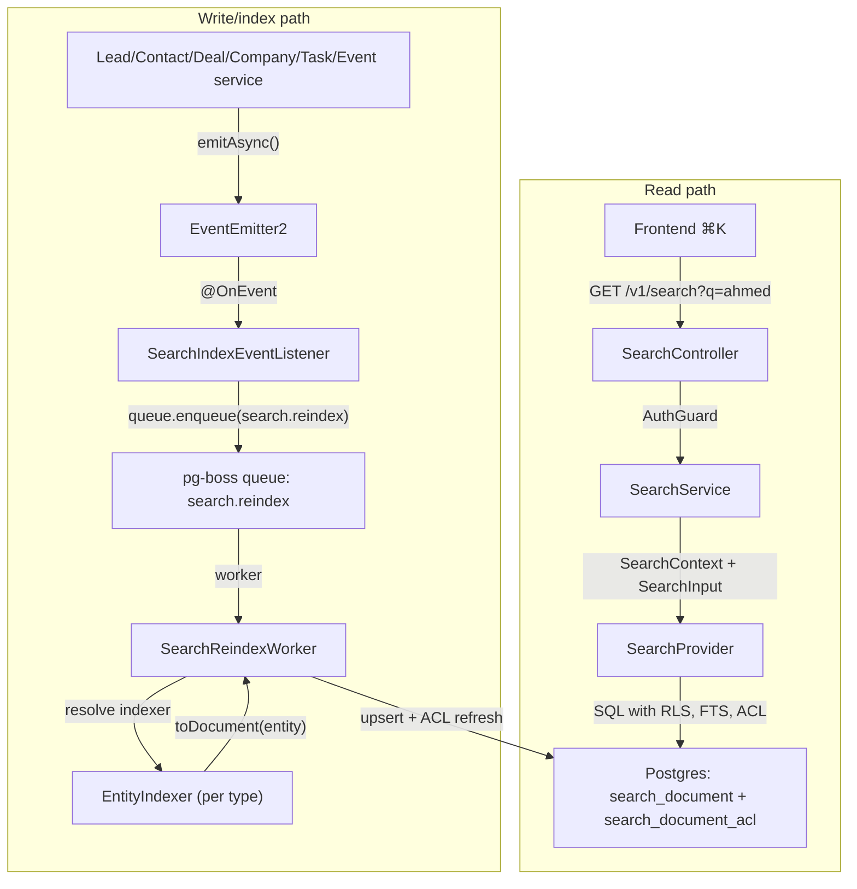

<Note>
**Version:** 0.6 (Phase 1 complete — backend + frontend ⌘K)  
**Last Updated:** May 2026  
**Status:** Phase 1 (backend read/index + frontend ⌘K) landed  
**Scope (Phase 1):** Lead, Contact, Deal, Company, Task, Event  
**Owner:** Backend Platform
</Note>

This document specifies the design of a permission-aware **global search** feature for PropWise CRM. Foundation work (Steps 2–9: module scaffold, worker/maintenance handlers, `SearchProvider` interface, indexer infrastructure, `normalizeSearchText()`, `buildSearchPermissionWhereClause()`, backfill script, unit tests) is implemented under `src/modules/search/`.

## Design summary in 5 bullets

<Info>
Read this section first. It is enough to know **what to build** before diving into per-entity field mapping or the full specification.
</Info>

<Steps>
<Step title="What ships">
One tenant-scoped read endpoint — `GET /v1/search` — backed by a denormalized `search_document` table (one row per Lead, Contact, Deal, Company, Task, Event). Stakeholder-gated entities also get rows in `search_document_acl`. The frontend ⌘K palette consumes lightweight hits; full detail loads on click.
</Step>

<Step title="Two pipelines, one table">
Search is **read** (sync SQL, P95 < 300ms) and **index** (async, ~2s P95 lag) decoupled. Domain services emit events → pg-boss queue `search.reindex` → `SearchReindexWorker` → per-entity `EntityIndexer.toDocument()` → upsert + ACL diff refresh. A slow indexer must not block CRM writes or search reads.
</Step>

<Step title="What you implement">
Migrations for `search_document` / `search_document_acl`, `SearchModule` + `PostgresSearchProvider`, the reindex worker, **`LeadIndexer` and `ContactIndexer`** in their owning CRM modules (registered via `SEARCH_INDEXERS`), event wiring in `LeadService` / `ContactService` / `PersonService` / `EntityStakeholderService`, shared **`normalizeSearchText()`**, and E2E persona + Arabic normalization tests.
</Step>

<Step title="Permissions are not optional">
Contact, Deal, and Company use `visibility = 'stakeholder_only'` — indexers project `(user_id, team_id, access_level)` into `search_document_acl`; the read path filters with a fast `EXISTS`. **Lead** is normally `stakeholder_only` but switches to `'org_wide'` while it is **unassigned** (zero active stakeholders → global pool), matching the always-available POOL list tab. Task and Event are always `org_wide` (no ACL rows).
</Step>

<Step title="Where to read next">
**Per-Entity Field Mapping** — exact `title` / `subtitle` / `body` / ACL / reindex triggers per entity (read before writing any indexer). **Indexing Pipeline** — queue config, worker contract, failure handling, cascades. Skip the rest until your slice needs it.
</Step>
</Steps>



## Overview & Goals

### Definition

**Global search** is a single endpoint (`GET /v1/search`) and a single frontend surface (the ⌘K command palette) that lets a user type any keyword, name, public ID, email, or phone fragment and see matching CRM records they are authorized to view, ranked by relevance and recency. It is permission-aware and tenant-scoped. **Backend** indexing is eventually consistent (~2s p95; longer under backlog). **Frontend** shows the creator their own just-created items immediately via client-side pins so "create → ⌘K" never feels broken.

### Goals (Phase 1)

<CardGroup cols={2}>
<Card title="G1: Unified Endpoint" icon="search">
One endpoint covers Lead, Contact, Deal, Company, Task, Event. A single request returns hits across all six entity types in one ranked list.
</Card>

<Card title="G2: Permission Aware" icon="shield-check">
Results respect existing org RLS and per-row stakeholder ACLs. An agent searching `ahmed` never sees a lead they are not a stakeholder on.
</Card>

<Card title="G3: Read-your-writes" icon="clock">
Backend: newly created/updated entity appears in search within ~2s. Frontend: creator sees their own items immediately via client-side "Just created" group.
</Card>

<Card title="G4: Provider Swappable" icon="arrows-rotate">
Swapping the Postgres provider for OpenSearch/Typesense requires zero changes to controllers, services, or domain indexers.
</Card>

<Card title="G5: PII Substring Match" icon="phone">
Typing `+9715…` or `ahmed@` returns the matching person with phone and email substring matching.
</Card>

<Card title="G6: Picker Response" icon="cursor-pointer">
Lightweight hits (id, title, subtitle, entity type, permissions, score); the frontend fetches full detail on click.
</Card>

<Card title="G7: Arabic Support" icon="language">
Typing `أحمد`, `احمد`, or `ahmed` finds the same lead when the record uses any of those forms; Arabic-Indic phone digits match Western digits.
</Card>
</CardGroup>

### Non-goals (Phase 1)

<Warning>
The following are explicitly out of scope for Phase 1:
</Warning>

- Searching the audit log (`audit_log` table) - sensitive data in admin-only UI
- Cross-org / global search for system admins - admin scoped to currently selected org
- User, Team, Off-plan project/unit, Conversation, Message, KnowledgeSource, Notification, Subscription, Commission Payment - reserved for Phase 2/3
- Search-as-you-type analytics - only operational metrics collected
- Saved searches / pinned results / alerts - Phase 2
- Synchronous search index on create - async indexer only

## Architecture

The search system uses a **dual-pipeline architecture** that separates read and write concerns:

<Tabs>
<Tab title="Read Pipeline">
- **Synchronous SQL queries** against denormalized `search_document` table
- **P95 < 300ms** target latency
- **Permission filtering** via `search_document_acl` EXISTS clauses
- **Full-text search** using PostgreSQL's built-in capabilities
</Tab>

<Tab title="Write Pipeline">
- **Asynchronous event-driven** indexing via pg-boss queue
- **~2s P95 lag** under normal load
- **Eventually consistent** - slow indexer doesn't block CRM writes
- **Per-entity indexers** registered via dependency injection
</Tab>
</Tabs>

### Key Components

<AccordionGroup>
<Accordion title="SearchModule">
Central module that provides:
- `SearchController` for HTTP endpoints
- `SearchService` for business logic
- `PostgresSearchProvider` for data access
- `SearchReindexWorker` for async processing
- `SearchIndexEventListener` for event handling
</Accordion>

<Accordion title="EntityIndexer Interface">
Each searchable entity implements:
```typescript
interface EntityIndexer<T = any> {
  toDocument(entity: T, context: IndexingContext): Promise<SearchDocumentInput>
  getEntityType(): EntityType
  shouldIndex(entity: T): boolean
}
```
</Accordion>

<Accordion title="SearchProvider Abstraction">
Swappable data access layer:
```typescript
interface SearchProvider {
  search(context: SearchContext, input: SearchInput): Promise<SearchResult>
  index(documents: SearchDocumentInput[]): Promise<void>
  deleteByEntityId(entityType: EntityType, entityId: string): Promise<void>
}
```
</Accordion>
</AccordionGroup>

## Data Model

### search_document table

The core search index table stores denormalized document representations:

```sql
CREATE TABLE search_document (
  id UUID PRIMARY KEY DEFAULT gen_random_uuid(),
  org_id UUID NOT NULL REFERENCES organizations(id) ON DELETE CASCADE,
  entity_type TEXT NOT NULL, -- 'lead', 'contact', 'deal', 'company', 'task', 'event'
  entity_id UUID NOT NULL,
  visibility TEXT NOT NULL DEFAULT 'org_wide', -- 'org_wide' | 'stakeholder_only'
  
  -- Search fields
  title TEXT NOT NULL,
  subtitle TEXT,
  body TEXT,
  normalized_text TEXT NOT NULL, -- All searchable text, normalized
  
  -- Metadata
  created_at TIMESTAMPTZ NOT NULL DEFAULT NOW(),
  updated_at TIMESTAMPTZ NOT NULL DEFAULT NOW(),
  indexed_at TIMESTAMPTZ NOT NULL DEFAULT NOW(),
  
  UNIQUE(org_id, entity_type, entity_id)
);

CREATE INDEX idx_search_document_org_fts ON search_document 
USING gin(org_id, to_tsvector('english', normalized_text));

CREATE INDEX idx_search_document_org_type ON search_document (org_id, entity_type);
```

### search_document_acl table

Permission control for stakeholder-gated entities:

```sql
CREATE TABLE search_document_acl (
  id UUID PRIMARY KEY DEFAULT gen_random_uuid(),
  document_id UUID NOT NULL REFERENCES search_document(id) ON DELETE CASCADE,
  user_id UUID REFERENCES users(id) ON DELETE CASCADE,
  team_id UUID REFERENCES teams(id) ON DELETE CASCADE,
  access_level TEXT NOT NULL, -- 'view', 'edit', 'admin'
  
  created_at TIMESTAMPTZ NOT NULL DEFAULT NOW(),
  
  CHECK (user_id IS NOT NULL OR team_id IS NOT NULL)
);

CREATE INDEX idx_search_document_acl_user ON search_document_acl (user_id);
CREATE INDEX idx_search_document_acl_team ON search_document_acl (team_id);
CREATE INDEX idx_search_document_acl_document ON search_document_acl (document_id);
```

## Per-Entity Field Mapping

<Warning>
Read this section before implementing any entity indexer. The exact field mappings and permission rules are critical for correct behavior.
</Warning>

### Lead

<Tabs>
<Tab title="Fields">
- **Title:** `${firstName} ${lastName}` (fallback to email if both names missing)
- **Subtitle:** `${email} • ${phone}` (show available fields only)
- **Body:** `${publicId} ${email} ${phone} ${description} ${source} ${status}`
- **Visibility:** `stakeholder_only` when assigned, `org_wide` when unassigned (zero active stakeholders)
</Tab>

<Tab title="ACL Logic">
```typescript
// Unassigned leads (zero active stakeholders)
if (stakeholders.length === 0) {
  return { visibility: 'org_wide', aclEntries: [] }
}

// Assigned leads
return {
  visibility: 'stakeholder_only',
  aclEntries: stakeholders.map(s => ({
    userId: s.userId,
    teamId: s.teamId,
    accessLevel: s.accessLevel
  }))
}
```
</Tab>

<Tab title="Reindex Triggers">
- Lead create/update/delete
- Lead stakeholder add/remove/update
- Person (contact) update when `person.leadId` matches
</Tab>
</Tabs>

### Contact

<Tabs>
<Tab title="Fields">
- **Title:** `${firstName} ${lastName}` (fallback to email)
- **Subtitle:** `${email} • ${phone} • ${jobTitle at companyName}`
- **Body:** `${publicId} ${email} ${phone} ${jobTitle} ${description}`
- **Visibility:** Always `stakeholder_only`
</Tab>

<Tab title="ACL Logic">
Always uses contact stakeholders - no special unassigned logic like Lead.
</Tab>

<Tab title="Reindex Triggers">
- Contact create/update/delete
- Contact stakeholder add/remove/update
- Company update when contact belongs to that company
</Tab>
</Tabs>

### Deal

<Tabs>
<Tab title="Fields">
- **Title:** Deal name
- **Subtitle:** `${stage} • ${formatCurrency(value)} • ${primaryContactName}`
- **Body:** `${publicId} ${name} ${description} ${stage} ${primaryContact.email}`
- **Visibility:** Always `stakeholder_only`
</Tab>

<Tab title="Reindex Triggers">
- Deal create/update/delete
- Deal stakeholder add/remove/update
- Primary contact update
</Tab>
</Tabs>

### Company

<Tabs>
<Tab title="Fields">
- **Title:** Company name
- **Subtitle:** `${industry} • ${location} • ${employeeCount} employees`
- **Body:** `${publicId} ${name} ${description} ${industry} ${website}`
- **Visibility:** Always `stakeholder_only`
</Tab>

<Tab title="Reindex Triggers">
- Company create/update/delete
- Company stakeholder add/remove/update
</Tab>
</Tabs>

### Task

<Tabs>
<Tab title="Fields">
- **Title:** Task title
- **Subtitle:** `Due ${dueDate} • ${assignedToName} • ${relatedEntityName}`
- **Body:** `${title} ${description} ${assignedTo.email}`
- **Visibility:** Always `org_wide` (no ACL rows)
</Tab>

<Tab title="Reindex Triggers">
- Task create/update/delete
- Assigned user update
- Related entity update (lead/contact/deal/company)
</Tab>
</Tabs>

### Event

<Tabs>
<Tab title="Fields">
- **Title:** Event title
- **Subtitle:** `${startTime} • ${duration} • ${attendeeCount} attendees`
- **Body:** `${title} ${description} ${location} ${attendee.emails}`
- **Visibility:** Always `org_wide` (no ACL rows)
</Tab>

<Tab title="Reindex Triggers">
- Event create/update/delete
- Attendee add/remove
- Related entity update
</Tab>
</Tabs>

## Indexing Pipeline

### Queue Configuration

<CodeGroup>
```typescript PostgreSQL Queue Setup
// Queue configuration
const SEARCH_REINDEX_QUEUE = 'search.reindex'

interface SearchReindexJob {
  entityType: EntityType
  entityId: string
  operation: 'upsert' | 'delete'
  orgId: string
  priority?: number
}

// Queue options
{
  name: SEARCH_REINDEX_QUEUE,
  concurrency: 5, // Process 5 jobs simultaneously
  retryLimit: 3,
  retryDelay: 30_000, // 30 second exponential backoff
  expireInHours: 24
}
```

```typescript Event Emission
// In domain services (LeadService, ContactService, etc.)
async createLead(data: CreateLeadInput): Promise<Lead> {
  const lead = await this.repository.create(data)
  
  // Emit async event for search indexing
  this.eventEmitter.emitAsync('search.entity.changed', {
    entityType: 'lead',
    entityId: lead.id,
    operation: 'upsert',
    orgId: lead.orgId
  })
  
  return lead
}
```
</CodeGroup>

### Worker Implementation

The `SearchReindexWorker` processes queued indexing jobs:

<Steps>
<Step title="Job Processing">
1. Resolve appropriate `EntityIndexer` for the entity type
2. Fetch fresh entity data from source tables
3. Call `indexer.toDocument()` to generate search document
4. Upsert document and refresh ACL entries
</Step>

<Step title="Error Handling">
- **Transient errors:** Retry with exponential backoff (max 3 attempts)
- **Entity not found:** Log warning and skip (entity may have been deleted)
- **Indexer errors:** Dead letter queue for manual investigation
</Step>

<Step title="Performance Optimizations">
- Batch processing for bulk operations
- Connection pooling for database access
- Metrics collection for monitoring
</Step>
</Steps>

### Text Normalization

The `normalizeSearchText()` function handles Arabic and mixed-script content:

<CodeGroup>
```typescript normalizeSearchText Function
export function normalizeSearchText(text: string): string {
  if (!text?.trim()) return ''
  
  return text
    .trim()
    .toLowerCase()
    // Normalize Arabic text
    .replace(/[أآإ]/g, 'ا') // Normalize alef forms
    .replace(/[ىئ]/g, 'ي') // Normalize ya forms
    .replace(/ة/g, 'ه') // Taa marbuta to haa
    .replace(/[ًٌٍَُِْ]/g, '') // Remove diacritics
    // Normalize phone numbers
    .replace(/[٠-٩]/g, (d) => String(d.charCodeAt(0) - '٠'.charCodeAt(0)))
    // Normalize whitespace
    .replace(/\s+/g, ' ')
}
```

```typescript Usage Example
const searchableText = normalizeSearchText([
  lead.firstName,
  lead.lastName, 
  lead.email,
  lead.phone,
  lead.publicId
].filter(Boolean).join(' '))

// Result handles mixed scripts consistently
// "أحمد Ahmed +971٥٥١٢٣٤٥٦٧" → "احمد ahmed +97155123456"
```
</CodeGroup>

## Permission Gate

### Permission Model

<Info>
The permission system ensures search results exactly match what users can see in corresponding list views.
</Info>

<Tabs>
<Tab title="org_wide Entities">
**Task and Event** are always visible to all org members:
- No rows in `search_document_acl`
- Filtered only by org-level RLS
- Matches existing list view behavior
</Tab>

<Tab title="stakeholder_only Entities">
**Contact, Deal, Company** require stakeholder access:
- ACL rows for each stakeholder (user or team)
- Read path uses `EXISTS` subquery for fast filtering
- Supports view/edit/admin access levels
</Tab>

<Tab title="Conditional Visibility">
**Lead** switches between modes:
- `stakeholder_only` when assigned to specific agents
- `org_wide` when unassigned (available in POOL tab)
- Matches lead assignment UI exactly
</Tab>
</Tabs>

### Permission Query Construction

```sql
-- Example query for stakeholder_only entities
SELECT d.* 
FROM search_document d
WHERE d.org_id = $1
  AND d.visibility = 'org_wide'
  
UNION ALL

SELECT d.*
FROM search_document d  
WHERE d.org_id = $1
  AND d.visibility = 'stakeholder_only'
  AND EXISTS (
    SELECT 1 FROM search_document_acl acl
    WHERE acl.document_id = d.id
      AND (acl.user_id = $2 OR acl.team_id = ANY($3))
  )
```

## API Contract

### GET /v1/search

<CodeGroup>
```typescript Request Parameters
interface SearchQuery {
  q: string          // Search query (required, 1-100 chars)
  limit?: number     // Max results (default 20, max 100)
  offset?: number    // Pagination offset (default 0)
  types?: EntityType[] // Filter by entity types
  sort?: 'relevance' | 'recent' // Sort order (default relevance)
}
```

```typescript Response Format
interface SearchResponse {
  hits: SearchHit[]
  total: number
  query: string
  took: number // Query execution time in ms
}

interface SearchHit {
  id: string
  entityType: EntityType
  entityId: string
  title: string
  subtitle?: string
  score: number
  permissions: {
    canView: boolean
    canEdit: boolean
    canDelete: boolean
  }
  createdAt: string
  updatedAt: string
}
```
</CodeGroup>

### Example Requests

<CodeGroup>
```bash Basic Search
curl -H "Authorization: Bearer $TOKEN" \
  "https://api.propwise.com/v1/search?q=ahmed"
```

```bash Filtered Search
curl -H "Authorization: Bearer $TOKEN" \
  "https://api.propwise.com/v1/search?q=dubai&types=lead,contact&limit=10"
```

```json Example Response
{
  "hits": [
    {
      "id": "doc_123",
      "entityType": "lead", 
      "entityId": "lead_456",
      "title": "Ahmed Al-Rashid",
      "subtitle": "ahmed@example.com • +971551234567",
      "score": 0.95,
      "permissions": {
        "canView": true,
        "canEdit": true, 
        "canDelete": false
      },
      "createdAt": "2024-01-15T10:30:00Z",
      "updatedAt": "2024-01-15T14:22:00Z"
    }
  ],
  "total": 1,
  "query": "ahmed",
  "took": 45
}
```
</CodeGroup>

## Frontend Contract

The frontend ⌘K command palette integrates with the search API:

### Command Palette Integration

<Tabs>
<Tab title="⌘K Trigger">
- Global keyboard shortcut (Cmd+K / Ctrl+K)
- Search icon in navigation header
- Slash commands in input fields
</Tab>

<Tab title="Real-time Search">
- Debounced API calls (300ms delay)
- Loading states during search
- Error handling for failed requests
</Tab>

<Tab title="Result Display">
- Entity type icons and colors
- Highlighted search terms
- Keyboard navigation support
</Tab>
</Tabs>

### Creator UX Pattern

<Note>
To ensure "create → ⌘K" feels instant, the frontend pins newly created items:
</Note>

<Steps>
<Step title="On Create">
When user creates a new entity, store it client-side:
```typescript
// After successful create API call
searchStore.addJustCreated({
  entityType: 'lead',
  entityId: newLead.id,
  title: `${newLead.firstName} ${newLead.lastName}`,
  subtitle: newLead.email,
  createdAt: new Date().toISOString()
})
```
</Step>

<Step title="In Search Results">
Show "Just created" group at top of results for 60 seconds:
```typescript
const searchResults = {
  justCreated: searchStore.getJustCreated(), // Client-side only
  indexed: await api.search(query) // From search API
}
```
</Step>

<Step title="Cleanup">
Remove from client cache after 60s or when item appears in API results
</Step>
</Steps>

## Testing Strategy

### Unit Tests

<AccordionGroup>
<Accordion title="Entity Indexers">
- `toDocument()` output format validation
- Permission logic correctness
- Text normalization handling
- Error cases (missing data, null values)
</Accordion>

<Accordion title="Search Service">
- Query parsing and validation
- Permission filtering logic
- Result ranking and pagination
- Error handling for malformed queries
</Accordion>

<Accordion title="Text Normalization">
- Arabic script handling (`أحمد` → `احمد`)
- Phone number normalization (Arabic-Indic digits)
- Mixed-script input processing
- Whitespace and punctuation handling
</Accordion>
</AccordionGroup>

### Integration Tests

<CodeGroup>
```typescript Permission Test Example
describe('Search Permissions', () => {
  it('respects stakeholder-only lead visibility', async () => {
    // Create lead with specific stakeholder
    const lead = await createLead({ assignedTo: agent1.id })
    await waitForIndexing()
    
    // Agent1 should see it
    const results1 = await search(agent1, lead.firstName)
    expect(results1.hits).toHaveLength(1)
    
    // Agent2 should not see it  
    const results2 = await search(agent2, lead.firstName)
    expect(results2.hits).toHaveLength(0)
  })
})
```

```typescript Arabic Search Test
describe('Arabic Text Search', () => {
  it('finds lead with Arabic name variants', async () => {
    const lead = await createLead({ firstName: 'أحمد' })
    await waitForIndexing()
    
    // All variants should find the same lead
    const queries = ['أحمد', 'احمد', 'ahmed']
    
    for (const query of queries) {
      const results = await search(agent, query)
      expect(results.hits).toContainEqual(
        expect.objectContaining({ entityId: lead.id })
      )
    }
  })
})
```
</CodeGroup>

### E2E Tests

<Warning>
E2E tests must use realistic persona data to catch permission edge cases.
</Warning>

Key test scenarios:
- Multi-entity search across Lead, Contact, Deal, Company, Task, Event
- Permission boundaries (stakeholder vs non-stakeholder)
- Arabic/English mixed content searching
- Performance under load (bulk throughput gates)

## Operations & Monitoring

### Metrics Collection

<Tabs>
<Tab title="Read Path">
- Query latency (P95 < 300ms target)
- Hit count distribution by entity type
- Empty result rate
- Permission filter effectiveness
</Tab>

<Tab title="Write Path">  
- Indexing job queue depth
- Worker processing latency (P95 ~2s target)
- Failed job rate and retry patterns
- Backfill operation progress
</Tab>

<Tab title="Data Quality">
- Document count by entity type vs source tables
- ACL entry count and staleness
- Index lag (time between entity update and search availability)
</Tab>
</Tabs>

### Alerting Thresholds

<CardGroup cols={2}>
<Card title="Critical Alerts" icon="triangle-exclamation">
- Search API P95 > 1000ms
- Queue depth > 10,000 jobs
- Failed job rate > 5%
- Index lag > 5 minutes
</Card>

<Card title="Warning Alerts" icon="exclamation">
- Search API P95 > 500ms  
- Queue depth > 1,000 jobs
- Failed job rate > 1%
- Index lag > 2 minutes
</Card>
</Tabs>

### Operational Procedures

<Steps>
<Step title="Queue Backlog Recovery">
1. Scale worker concurrency temporarily
2. Monitor memory usage during catch-up
3. Consider bulk reindex if lag exceeds SLA
</Step>

<Step title="Index Corruption Recovery">
1. Stop indexing workers
2. Run full org reindex via backfill script
3. Verify data consistency before resuming
</Step>

<Step title="Provider Migration">
1. Deploy new provider alongside existing
2. Run shadow traffic comparison
3. Cutover with feature flag control
</Step>
</Steps>

## Open Risks

<Warning>
These risks require ongoing attention and mitigation:
</Warning>

| Risk | Impact | Mitigation Status |
|------|--------|------------------|
| **ACL drift** - stakeholder changes not reflected in search | High - permission bypass | Covered by comprehensive event wiring and E2E tests |
| **Index lag under load** - 2s SLA violated during traffic spikes | Medium - UX degradation | Queue monitoring, worker auto-scaling, client-side "just created" pins |
| **Arabic text edge cases** - normalization misses search matches | Medium - market-specific impact | Extensive test coverage, UAE team validation |
| **Cross-entity cascade complexity** - contact update triggers lead reindex | Medium - operational burden | Documented trigger map, cascade lag monitoring |
| **Memory usage in bulk operations** - backfill jobs exceed worker limits | Medium - operational risk | Batch size limits, memory profiling gates |

<Tip>
All Phase 1 risks have identified mitigations. Phase 2 introduction of additional entities may surface new edge cases.
</Tip>

## Cross-Doc Updates Required

<Note>
The following documentation files need updates to reference the search system:
</Note>

- **Lead Management API** - Add search reindex triggers to lifecycle documentation
- **Contact Management API** - Document search indexing for person updates  
- **Deal Pipeline Documentation** - Include search visibility in stakeholder workflows
- **Permission System Overview** - Reference search ACL model as example
- **Event Processing Guide** - Add search indexing to async event examples
- **Database Schema Documentation** - Include search_document tables in ERD

## References

<CardGroup cols={2}>
<Card title="Frontend Implementation" href="#" icon="code">
See `propwise-crm-frontend` repository for ⌘K command palette integration
</Card>

<Card title="Permission System" href="#" icon="shield">
Reference existing stakeholder ACL patterns in CRM modules
</Card>

<Card title="Arabic Localization" href="#" icon="globe">
UAE market requirements and text processing standards
</Card>

<Card title="Queue Infrastructure" href="#" icon="list">
pg-boss configuration and monitoring in platform modules
</Card>
</CardGroup>