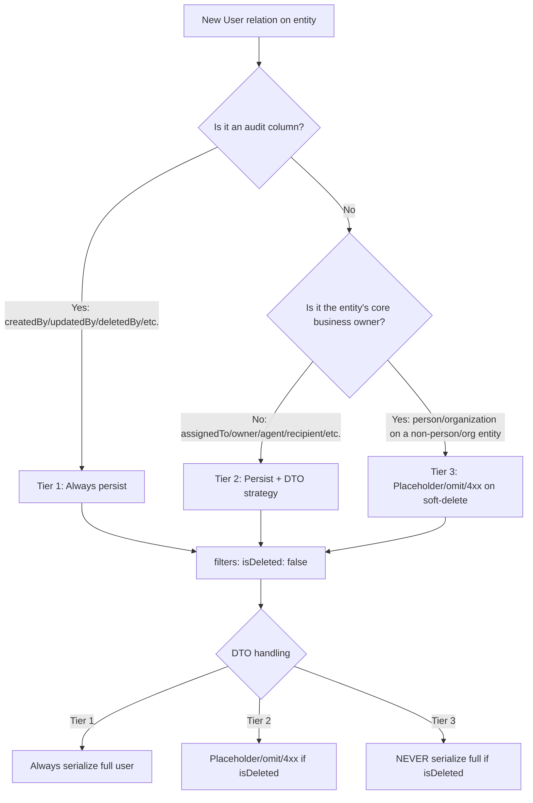

<Warning>
  **Status:** Project-wide standard — MANDATORY for all entities, services, and DTOs
  
  This document is the authoritative reference for the soft-delete / archive filter pattern. See `QUERY_OPTIMIZATION_PATTERNS.md` §5.5 for the MikroORM internals (kept in sync with this doc).
</Warning>

## TL;DR — What Every Backend Dev Needs to Know

This project uses **MikroORM v6** with `loadStrategy: JOINED`, `autoJoinRefsForFilters: true`, and `filtersOnRelations: true`. Combined with our `isDeleted` and `active` entity filters, this produces a **silent data-loss bug** if entities are not declared correctly:

<Note>
  **A row whose own `is_deleted = false` will silently disappear from every query if any of its non-nullable owner relations points at a soft-deleted target.**
</Note>

The fix is **structural** and lives on the entity declaration. Every new entity MUST follow it.

### Quick Reference Table

| What | Rule |
|------|------|
| Non-nullable `@ManyToOne` / `@OneToOne(owner)` to an entity that declares `@Filter({ name: 'isDeleted', ... })` | Add `{ filters: { isDeleted: false } }` to the relation options |
| `@Filter({ name: 'active', ... })` on a soft-deletable + archivable entity | `cond` MUST be `{ isArchived: false }` only — NEVER `{ isDeleted: false, isArchived: false }` |
| Non-nullable `@ManyToOne` / `@OneToOne(owner)` to an **ARCHIVABLE** target (one that declares `@Filter({ name: 'active' })`) | Decide per §2.2.1: record / history / financial / document / tracker child → override **BOTH** `{ isDeleted: false, active: false }` (persists across owner archive); active-view junction → `{ isDeleted: false }` only (drops on owner archive by design — callers opt into archived rows explicitly) |
| Bulk re-point inside a merge service (`em.nativeUpdate(...)` that re-points children of an entity that is about to be soft-deleted) | Pass `{ filters: false }` so the re-point hits archived AND soft-deleted children |
| `{ filters: false }` anywhere else | Allowed only in the explicit-business-intent categories in §2.3 (merge / restore / conflict-detection / audit-timeline / notification fan-out / admin / seed). Every call site MUST have a code comment naming the category. |
| User reference on a new entity | Classify per §3.1.1 — `createdBy`/`updatedBy`/`archivedBy`/etc. are Tier 1 (audit ref); `assignedTo`/`owner`/`recipient`/`user` are Tier 2 or 3 |
| DTO with a Tier-3 owner relation (`person`, `organization`) | If `populated.isDeleted === true` → DTO MUST use placeholder / omit / 4xx (Strategies A / B / C in §3.3.1). NEVER serialize the full Tier-3 payload when soft-deleted |
| New entity with non-nullable owners | Update the audit table in `QUERY_OPTIMIZATION_PATTERNS.md` §5.5 + extend `DataIntegrityAuditService` for Tier 2/3 (the daily cron picks it up — do NOT add an HTTP endpoint) + add the two mandatory tests from §4.1 |

<Warning>
  If you skip any of these, the regression will not show up in unit tests — it surfaces as "this row exists in the DB but the API returns nothing" weeks later.
</Warning>

## 1. Cause — Why Rows Silently Disappear

MikroORM v6 (`@mikro-orm/core@6.6.7`) has three defaults that interact badly with soft-deletable graphs:

```typescript
// mikro-orm.config.ts (defaults — NOT to be disabled globally)
loadStrategy: LoadStrategy.JOINED; // populated relations are joined into the main SELECT
autoJoinRefsForFilters: true; // auto-add :ref JOIN for any relation whose target has filters
filtersOnRelations: true; // apply target-entity filters via JOIN ON
```

For every M:1 / 1:1-owner relation on the queried entity, MikroORM checks whether the target entity declares any default-enabled filters (e.g. `@Filter({ name: 'isDeleted', default: true, cond: { isDeleted: false } })`). If so, it adds an auto `:ref` JOIN to that relation **even if you did not populate it**, so the filter can be applied as a JOIN `ON` condition.

For a **non-nullable** M:1 the resulting JOIN type is `INNER JOIN` (see `AbstractSqlDriver.getFieldsForJoinedLoad`):

```typescript
const mandatoryToOneProperty =
  [ReferenceKind.MANY_TO_ONE, ReferenceKind.ONE_TO_ONE].includes(prop.kind) && !prop.nullable;
const joinType = (hint.filter && !prop.nullable) || mandatoryToOneProperty ? INNER_JOIN : LEFT_JOIN;
```

### The Failure Mode

`em.find(Lead, { id: leadId })` becomes (roughly):

```sql
SELECT lead.*
  FROM lead
  INNER JOIN person p ON p.id = lead.person_id AND p.is_deleted = false
  INNER JOIN organization o ON o.id = lead.organization_id AND o.is_deleted = false
 WHERE lead.id = $1
   AND lead.is_deleted = false;
```

If **any** of those non-nullable joined targets fails the filter (e.g. `Person.isDeleted = true` because the lead's person was merged into another person), the **lead row is silently dropped** — even though `lead.is_deleted = false`.

<Info>
  For nullable relations the JOIN is `LEFT JOIN` and the relation hydrates to `null` instead of dropping the row (see MikroORM 6.6 release notes — the v6.5 "Strict relation filters" regression was reverted in 6.6).
</Info>

### Real Production Examples This Caused

| Scenario | Symptom |
|----------|---------|
| Two persons merged → secondary `Person.isDeleted = true` → an archived Lead still pointing at the secondary Person | The archived Lead was invisible everywhere even though it existed in the DB |
| `DealStage` cleanup → custom stage soft-deleted while a Deal still pointed at it | The Deal vanished from list endpoints |
| Agent leaves the org → `User.isDeleted = true` → every Deal / Contact / Company / Listing they `createdBy` would have vanished if we shipped the relation override blindly without the Tier-1 carve-out | N/A (caught before production) |

### 1.2 Special Case — The `excludeAiServiceUser` Filter is OPT-IN

The same `autoJoinRefsForFilters` mechanic bit a **non-soft-delete** filter. The `User` entity declares a second filter that hides **all non-human service accounts** — both the per-org **AI agent service account** (`isAiServiceUser = true`, the row ORGANIZATION-scope AI agents act as) and the per-org **System automation actor** (`isSystemServiceUser = true`, the row distribution / escalation / lead-capture stamp as `createdBy`/`assignedBy`/`performedBy`):

```typescript
@Filter({
  name: 'excludeAiServiceUser',
  default: false,
  cond: { isAiServiceUser: false, isSystemServiceUser: false },
})
```

This filter was originally `default: true` to hide the service accounts from every user listing. But each is a **real `user` row** that stamps non-nullable audit columns (`created_by`, `changed_by`, `performed_by`, …) on anything it touches. With `default: true`, MikroORM auto-joined `... INNER JOIN "user" u ON ... AND u.is_ai_service_user = false` (and now `... AND u.is_system_service_user = false`) for those non-nullable `@ManyToOne(User)` relations and **silently dropped** every row a service account created (e.g. an AI-created `Contact`, or a system-distributed lead's stakeholder, returning 404 immediately after creation).

#### Resolution — Invert the Default to Opt-In

<Check>
  The filter is **OFF by default** (`default: false`), so audit-relation auto-joins no longer drop service-stamped rows. This is the inverse of the `isDeleted` strategy: for `isDeleted` we keep the global filter ON and override per-relation; for `excludeAiServiceUser` we keep it OFF globally and re-enable per-query where the service accounts must be hidden.
</Check>

**User-facing enumerations must re-exclude the service accounts explicitly:**

| Query Shape | How to Exclude the Service Accounts |
|-------------|-------------------------------------|
| Direct `User` root query (listings, pickers) | `{ filters: { excludeAiServiceUser: true } }` in the query options (now hides both accounts) |
| `UserOrgRole` enumeration (member/recipient/agent pools) | `user: { isAiServiceUser: false }` in the `where` (the System actor has **no** `UserOrgRole`, so it is already absent) |
| Raw SQL over `user_org_roles` with no `team_membership` join (e.g. `getOrgAgentIds`) | `JOIN "user" u ON u.id = uor.user_id AND u.is_ai_service_user = false` (System actor absent — no `UserOrgRole`) |
| `QueryBuilder` user lists (filters are NOT auto-applied) | `qb.andWhere({ isAiServiceUser: false, isSystemServiceUser: false })` |
| Auth lookups by email (signup / login / verify / reset) | `{ email, isAiServiceUser: false, isSystemServiceUser: false }` |

**Inherently service-free (no change needed):** queries scoped to a specific `user: <id>`; queries filtered by `User.organizations` (neither account is added to that M2M); any `TeamMembership`-based query (neither has team membership); and **any `UserOrgRole`-based query** (the System actor has no `UserOrgRole` at all, so only direct global `User` queries need to exclude it).

<Info>
  **DTO exposure:** the service accounts can surface as actors (`createdBy` / `changedBy` / `assignedBy` / `performedBy`). Their synthetic `ai-user+<orgId>@propwise.com` / `system-user+<orgId>@propwise.com` emails are **not** masked in user DTOs — they are non-routable internal addresses and the display names ("AI USER" / "System Automation") already identify them.
</Info>

## 2. The Structural Fix — Entity-Level Filter Overrides

### 2.1 Basic Pattern — Override `isDeleted` on Non-Nullable M:1/1:1-Owner Relations

Every non-nullable `@ManyToOne` or `@OneToOne(owner: true)` to a soft-deletable target MUST disable the target's `isDeleted` filter via `{ filters: { isDeleted: false } }`:

```typescript
@Entity()
@Filter({ name: 'isDeleted', default: true, cond: { isDeleted: false } })
export class Lead {
  // ✅ CORRECT — override the target's isDeleted filter
  @ManyToOne(() => Person, { nullable: false, filters: { isDeleted: false } })
  person!: Rel<Person>;

  @ManyToOne(() => Organization, { nullable: false, filters: { isDeleted: false } })
  organization!: Rel<Organization>;

  // ✅ CORRECT — nullable relations do NOT need the override (LEFT JOIN keeps the row)
  @ManyToOne(() => DealStage, { nullable: true })
  stage?: Rel<DealStage>;

  // ❌ WRONG — missing the override
  @ManyToOne(() => User, { nullable: false })
  assignedTo!: Rel<User>;
  // → This lead will vanish if assignedTo user is soft-deleted
}
```

<Warning>
  **Why nullable relations don't need it:** MikroORM uses `LEFT JOIN` for nullable M:1, so the row survives even if the target fails the filter (the relation hydrates to `null`).
</Warning>

### 2.2 Archive Pattern — The `active` Filter MUST Be `{ isArchived: false }` Only

Entities that support both soft-delete AND archive (e.g. `Deal`, `Contact`, `Company`, `Listing`) declare two filters:

```typescript
@Entity()
@Filter({ name: 'isDeleted', default: true, cond: { isDeleted: false } })
@Filter({ name: 'active', default: true, cond: { isArchived: false } }) // ✅ ONLY isArchived
export class Deal {
  @Property()
  isDeleted: boolean = false;

  @Property()
  isArchived: boolean = false;
}
```

<Check>
  The `active` filter MUST **only** check `isArchived: false`. It MUST **NOT** include `isDeleted: false` in the same filter, because that would make it impossible to override one without the other.
</Check>

**Why this matters:** children of an archivable entity fall into two categories:

1. **Record / history / financial / document / tracker children** — these persist across the parent's archive (e.g. `DealStageHistory`, `PaymentTransaction`, `DocumentVersion`)
2. **Active-view junction children** — these drop out of the active view when the parent archives (e.g. `DealTeamMember`, `ContactListMembership`)

The first category needs `{ filters: { isDeleted: false, active: false } }` to survive archive; the second needs only `{ filters: { isDeleted: false } }` to drop on archive. If `active` bundled both conditions, we couldn't express this distinction.

#### 2.2.1 Classifying Archivable Children — The Two-Filter Override Decision Tree

<Steps>

<Step title="Classify the child entity's business purpose">
  - **Record / history / financial / document / tracker child** → persists across owner archive
  - **Active-view junction / assignment / membership** → drops from active view on owner archive
</Step>

<Step title="Apply the correct filter override">
  ```typescript
  // Category 1: Persists across owner archive
  @ManyToOne(() => Deal, { nullable: false, filters: { isDeleted: false, active: false } })
  deal!: Rel<Deal>;
  
  // Category 2: Drops from active view on owner archive
  @ManyToOne(() => Deal, { nullable: false, filters: { isDeleted: false } })
  deal!: Rel<Deal>;
  ```
</Step>

<Step title="Document the decision in a code comment">
  ```typescript
  // Category 1 example (DealStageHistory)
  @ManyToOne(() => Deal, {
    nullable: false,
    filters: { isDeleted: false, active: false }, // persists across deal archive
  })
  deal!: Rel<Deal>;
  
  // Category 2 example (DealTeamMember)
  @ManyToOne(() => Deal, {
    nullable: false,
    filters: { isDeleted: false }, // drops from active view on deal archive (by design)
  })
  deal!: Rel<Deal>;
  ```
</Step>

</Steps>

**Real examples:**

| Entity | Owner Relation | Override | Reason |
|--------|---------------|----------|--------|
| `DealStageHistory` | `deal: Deal` | `{ isDeleted: false, active: false }` | Stage transitions are immutable history — must persist across deal archive |
| `PaymentTransaction` | `deal: Deal` | `{ isDeleted: false, active: false }` | Financial records — regulatory requirement to preserve |
| `DocumentVersion` | `document: Document` | `{ isDeleted: false, active: false }` | Audit trail for compliance |
| `ActivityLog` | `deal: Deal` | `{ isDeleted: false, active: false }` | Historical record of all actions |
| `DealTeamMember` | `deal: Deal` | `{ isDeleted: false }` | Active team roster — archived deals don't need active team view |
| `ContactListMembership` | `contact: Contact` | `{ isDeleted: false }` | List membership is for active contacts only |

### 2.3 When `{ filters: false }` is Allowed — The Explicit-Business-Intent Categories

<Warning>
  `{ filters: false }` globally disables ALL filters (both `isDeleted` and `active`). It is a last resort for scenarios where the business logic **explicitly** requires operating on soft-deleted / archived data.
</Warning>

**Allowed categories** (every call site MUST have a code comment naming the category):

<AccordionGroup>

<Accordion title="Merge Operations">
  Re-pointing children from entity A to entity B before soft-deleting A:
  
  ```typescript
  // CATEGORY: Merge — re-point archived + soft-deleted children
  await em.nativeUpdate(
    Lead,
    { person: secondaryPerson },
    { person: primaryPerson },
    { filters: false }
  );
  ```
</Accordion>

<Accordion title="Restore Operations">
  Checking whether a soft-deleted entity can be restored:
  
  ```typescript
  // CATEGORY: Restore — verify archived/soft-deleted dependencies
  const deal = await em.findOne(Deal, dealId, { filters: false });
  if (deal?.isDeleted) {
    // Check if person/organization are restorable
  }
  ```
</Accordion>

<Accordion title="Conflict Detection">
  Duplicate detection that must include soft-deleted records:
  
  ```typescript
  // CATEGORY: Conflict detection — check soft-deleted duplicates
  const existing = await em.findOne(
    Person,
    { email, organization },
    { filters: false }
  );
  ```
</Accordion>

<Accordion title="Audit Timeline">
  Admin timeline views that show the full history:
  
  ```typescript
  // CATEGORY: Audit timeline — show all historical state changes
  const history = await em.find(
    DealStageHistory,
    { deal: dealId },
    { filters: false, orderBy: { createdAt: 'ASC' } }
  );
  ```
</Accordion>

<Accordion title="Notification Fan-Out">
  Webhook / email fan-out that must notify about archived/deleted entities:
  
  ```typescript
  // CATEGORY: Notification fan-out — include archived/soft-deleted subscribers
  const subscribers = await em.find(
    Subscription,
    { deal: dealId },
    { filters: false }
  );
  ```
</Accordion>

<Accordion title="Admin Tools">
  Admin-only endpoints that operate on all data:
  
  ```typescript
  // CATEGORY: Admin — data integrity scan
  @RequireRole('SUPER_ADMIN')
  async dataIntegrityScan() {
    return em.find(Lead, {}, { filters: false });
  }
  ```
</Accordion>

<Accordion title="Seed Scripts">
  Database seeding / migration scripts:
  
  ```typescript
  // CATEGORY: Seed — populate test data including soft-deleted
  async seed() {
    const allOrgs = await em.find(Organization, {}, { filters: false });
  }
  ```
</Accordion>

</AccordionGroup>

**NEVER allowed:**

- Regular CRUD operations (list / get / create / update)
- Search / filter endpoints
- Relationship traversal in DTOs
- Anywhere a code comment cannot justify it via one of the categories above

## 3. User Relations — The Three-Tier Classification

User references are **special** because:
1. `User` is soft-deletable (user leaves org → `User.isDeleted = true`)
2. Many entities have **multiple** `User` references (creator, modifier, assignee, owner, etc.)
3. Some are **audit trails** (must persist), others are **business owners** (may need placeholder on soft-delete)

### 3.1 The Three Tiers

<Tabs>
  <Tab title="Tier 1: Audit References">
    **Columns:** `createdBy`, `updatedBy`, `deletedBy`, `archivedBy`, `mergedBy`, `restoredBy`, `performedBy`
    
    **Rule:** ALWAYS `{ filters: { isDeleted: false } }` — these persist even when the user is soft-deleted
    
    ```typescript
    @ManyToOne(() => User, { nullable: false, filters: { isDeleted: false } })
    createdBy!: Rel<User>;
    
    @ManyToOne(() => User, { nullable: true, filters: { isDeleted: false } })
    updatedBy?: Rel<User>;
    ```
    
    **DTO handling:** Always serialize the full user (name, email, avatar). If soft-deleted, the DTO shows the user as they were at action time.
  </Tab>
  
  <Tab title="Tier 2: Assignment / Ownership">
    **Columns:** `assignedTo`, `owner`, `agent`, `recipient`, `user` (context-dependent)
    
    **Rule:** USUALLY `{ filters: { isDeleted: false } }` — persists on soft-delete, but the DTO MUST handle it explicitly
    
    ```typescript
    @ManyToOne(() => User, { nullable: false, filters: { isDeleted: false } })
    assignedTo!: Rel<User>;
    ```
    
    **DTO handling:** If `populated.isDeleted === true`:
    - **Strategy A** (preferred): Placeholder — `{ id, name: 'Deleted User', email: null, isDeleted: true }`
    - **Strategy B**: Omit — `assignedTo: null` in the DTO even though DB is non-null
    - **Strategy C**: 4xx — return 409 Conflict with guidance to re-assign
    
    Choose per entity — document in the DTO transformer.
  </Tab>
  
  <Tab title="Tier 3: Core Business Entity Owners">
    **Columns:** `person: Person`, `organization: Organization` (the **target** of these relations are soft-deletable entities with their own business lifecycle — NOT the `User` entity)
    
    **Rule:** ALWAYS `{ filters: { isDeleted: false } }` on the relation
    
    **DTO handling:** If `populated.isDeleted === true` → NEVER serialize the full payload:
    - **Strategy A**: Placeholder — `{ id, name: 'Deleted Person', type: 'person', isDeleted: true }`
    - **Strategy B**: Omit — return 404 / 410 at the endpoint level
    - **Strategy C**: 4xx — return 409 Conflict for operations that require the owner
    
    <Warning>
      Serializing a soft-deleted Person/Organization as if it were active (with email, phone, address, etc.) is a **data leak** — the merge that soft-deleted it may have consolidated PII into the surviving entity, and the soft-deleted payload is stale.
    </Warning>
  </Tab>
</Tabs>

### 3.1.1 Tier Classification Flowchart



### 3.2 Real Examples with Rationale

| Entity | Relation | Tier | Override | DTO Strategy | Reason |
|--------|----------|------|----------|--------------|--------|
| `Deal` | `createdBy: User` | 1 | `{ isDeleted: false }` | Always serialize | Audit trail — who created this deal |
| `Deal` | `assignedTo: User` | 2 | `{ isDeleted: false }` | Placeholder | Agent left org, deal still exists, show "Deleted User" |
| `Lead` | `person: Person` | 3 | `{ isDeleted: false }` | Placeholder | Person merged into another, show "Deleted Person" stub |
| `Activity` | `performedBy: User` | 1 | `{ isDeleted: false }` | Always serialize | Historical record — who performed this action |
| `Task` | `assignedTo: User` | 2 | `{ isDeleted: false }` | 4xx on completion | Can't complete a task with deleted assignee — force re-assign |
| `Document` | `uploadedBy: User` | 1 | `{ isDeleted: false }` | Always serialize | Compliance — who uploaded this file |

### 3.3 DTO Implementation Guide

#### 3.3.1 The Three Strategies

<CodeGroup>

```typescript Strategy A: Placeholder
// In the DTO transformer (e.g. DealResponseDto.fromEntity)
if (deal.assignedTo) {
  if (deal.assignedTo.isDeleted) {
    dto.assignedTo = {
      id: deal.assignedTo.id,
      name: 'Deleted User',
      email: null, // NEVER expose email of soft-deleted user
      avatar: null,
      isDeleted: true,
    };
  } else {
    dto.assignedTo = UserBasicDto.fromEntity(deal.assignedTo);
  }
}
```

```typescript Strategy B: Omit
// In the DTO transformer
if (deal.assignedTo && !deal.assignedTo.isDeleted) {
  dto.assignedTo = UserBasicDto.fromEntity(deal.assignedTo);
} else {
  dto.assignedTo = null; // Omit soft-deleted user
}
```

```typescript Strategy C: 4xx on Operation
// In the service method (e.g. completeTask)
await em.populate(task, ['assignedTo']);

if (task.assignedTo.isDeleted) {
  throw new ConflictException(
    'Cannot complete task: assigned user is no longer active. Please re-assign the task.'
  );
}
```

</CodeGroup>

#### 3.3.2 Tier-3 Owner Placeholder Pattern

For Tier-3 relations (`person`, `organization`), the placeholder MUST be minimal:

```typescript
// ✅ CORRECT — minimal placeholder for soft-deleted Person
if (lead.person.isDeleted) {
  dto.person = {
    id: lead.person.id,
    name: lead.person.name, // Name at time of soft-delete (may be stale)
    type: 'person',
    isDeleted: true,
  };
}

// ❌ WRONG — exposes PII of soft-deleted Person
if (lead.person.isDeleted) {
  dto.person = {
    id: lead.person.id,
    name: lead.person.name,
    email: lead.person.email, // ❌ Data leak — this may be stale post-merge
    phone: lead.person.phone, // ❌ Data leak
    address: lead.person.address, // ❌ Data leak
    isDeleted: true,
  };
}
```

<Warning>
  The soft-deleted Person/Organization payload is **stale** after a merge. The merge may have updated the primary entity's email/phone/address and deleted the secondary. Serializing the secondary's old email is a data-integrity + privacy issue.
</Warning>

## 4. Testing Requirements

Every new entity with non-nullable soft-deletable owners MUST have these two tests:

### 4.1 The Two Mandatory Tests

<Steps>

<Step title="Test 1: Row survives owner soft-delete">
  ```typescript
  it('should return child entity even when owner is soft-deleted', async () => {
    // Arrange
    const person = await factory.create(Person);
    const lead = await factory.create(Lead, { person });
    
    // Act
    await personService.delete(person.id); // soft-delete
    const result = await leadService.findById(lead.id);
    
    // Assert
    expect(result).toBeDefined();
    expect(result.person.id).toBe(person.id);
    expect(result.person.isDeleted).toBe(true); // populated as soft-deleted
  });
  ```
</Step>

<Step title="Test 2: DTO handles soft-deleted owner correctly">
  ```typescript
  it('should return placeholder for soft-deleted owner in DTO', async () => {
    // Arrange
    const person = await factory.create(Person);
    const lead = await factory.create(Lead, { person });
    await personService.delete(person.id);
    
    // Act
    const dto = await leadController.findOne(lead.id);
    
    // Assert
    expect(dto.person).toBeDefined();
    expect(dto.person.name).toBe('Deleted Person'); // or actual name if Strategy A
    expect(dto.person.email).toBeUndefined(); // NEVER expose
    expect(dto.person.isDeleted).toBe(true);
  });
  ```
</Step>

</Steps>

### 4.2 Archive Tests (if the Owner is Archivable)

If the owner entity declares `@Filter({ name: 'active' })`, add a third test:

```typescript
it('should return child entity across owner archive (Category 1) OR drop it (Category 2)', async () => {
  // Arrange
  const deal = await factory.create(Deal);
  const history = await factory.create(DealStageHistory, { deal }); // Category 1
  const teamMember = await factory.create(DealTeamMember, { deal }); // Category 2
  
  // Act
  await dealService.archive(deal.id);
  
  // Assert — Category 1 persists
  const historyResult = await em.findOne(DealStageHistory, history.id);
  expect(historyResult).toBeDefined();
  
  // Assert — Category 2 drops from active view
  const teamMemberResult = await em.findOne(DealTeamMember, teamMember.id);
  expect(teamMemberResult).toBeNull(); // filtered out by default
  
  // Assert — Category 2 accessible with filters: { active: false }
  const teamMemberArchived = await em.findOne(
    DealTeamMember,
    teamMember.id,
    { filters: { active: false } }
  );
  expect(teamMemberArchived).toBeDefined();
});
```

## 5. Data Integrity Monitoring

### 5.1 The Audit Service

`DataIntegrityAuditService` runs daily (4 AM UTC) and scans for:

1. **Tier-2/3 orphaned children** — non-nullable owner is soft-deleted but the child was not re-pointed (merge bug)
2. **Archive policy violations** — Category-2 children still in active view when owner is archived (filter override bug)

<Info>
  The service does NOT auto-fix issues. It logs them to a dedicated Slack channel (`#data-integrity-alerts`) for manual review.
</Info>

### 5.2 Adding a New Entity to the Audit

<Steps>

<Step title="Update the audit table in QUERY_OPTIMIZATION_PATTERNS.md §5.5">
  Add your entity to the comprehensive table of all soft-deletable relations.
</Step>

<Step title="Extend DataIntegrityAuditService">
  ```typescript
  // In DataIntegrityAuditService.scanOrphanedChildren()
  
  // Tier-2 example (assignedTo: User)
  const orphanedTasks = await em.find(
    Task,
    { assignedTo: { isDeleted: true } },
    { filters: false }
  );
  
  // Tier-3 example (person: Person)
  const orphanedLeads = await em.find(
    Lead,
    { person: { isDeleted: true } },
    { filters: false }
  );
  
  // Archive policy violation (Category 2)
  const violatingTeamMembers = await em.find(
    DealTeamMember,
    { deal: { isArchived: true } }
    // No filters: false — should be empty if override is correct
  );
  ```
</Step>

<Step title="Do NOT add an HTTP endpoint">
  The audit runs via cron only. Admin dashboards query the Slack alert history.
</Step>

</Steps>

## 6. Migration Checklist for Existing Entities

If you discover an entity missing the overrides:

<Steps>

<Step title="Add the filter overrides to the entity">
  Follow §2.1 (basic) or §2.2.1 (archivable owners).
</Step>

<Step title="Generate a migration">
  The override is metadata-only — no DB schema change. Generate an empty migration as a checkpoint:
  
  ```bash
  npm run mikro-orm migration:create -- --blank
  ```
  
  Name it: `Migration20260515000000_add_soft_delete_overrides_to_lead.ts`
</Step>

<Step title="Add the two mandatory tests">
  Follow §4.1 and §4.2 (if archivable).
</Step>

<Step title="Audit existing data">
  Run the integrity scan manually:
  
  ```bash
  npm run cli data-integrity:scan -- --entity=Lead
  ```
  
  Fix any orphaned children (re-point or hard-delete per business rules).
</Step>

<Step title="Update DTOs">
  Add Tier-2/3 placeholder logic per §3.3.
</Step>

</Steps>

## 7. FAQ

<AccordionGroup>

<Accordion title="Why not disable autoJoinRefsForFilters globally?">
  It's a performance optimization — without it, MikroORM would do N+1 queries for filtered relations. The fix (overrides) is localized and explicit, which is better than a global footgun.
</Accordion>

<Accordion title="Can I use @ManyToOne(() => User, { eager: true }) instead of the override?">
  No. `eager` forces population, but MikroORM still adds the auto `:ref` JOIN for the filter **before** the eager load, so the row drops before it can be populated.
</Accordion>

<Accordion title="What if I need a relation to drop on owner soft-delete (opposite of the standard)?">
  Use a nullable relation (`nullable: true`) and do NOT override the filter. The `LEFT JOIN` will hydrate it to `null`. This is rare — most children should persist.
</Accordion>

<Accordion title="Why is excludeAiServiceUser opt-in but isDeleted opt-out?">
  Soft-delete is **universal** (every entity should hide deleted rows by default). Service-account filtering is **context-specific** (audit trails MUST show service-stamped rows; user pickers MUST NOT). The default reflects the common case.
</Accordion>

<Accordion title="Can I use filters: false in a repository method?">
  Only if the repository is internal to a service and the service method is in one of the §2.3 categories. Never expose a `findWithDeleted()` public method — force callers to opt-in per-query with an explicit `{ filters: false }` argument.
</Accordion>

</AccordionGroup>

## 8. Related Documentation

<CardGroup cols={2}>
  <Card title="Query Optimization Patterns" icon="magnifying-glass" href="/backend/query-optimization-patterns">
    §5.5 — MikroORM filter internals and the comprehensive audit table
  </Card>
  <Card title="Entity Conventions" icon="database" href="/backend/entity-conventions">
    Standard patterns for `isDeleted`, `isArchived`, and audit columns
  </Card>
  <Card title="Testing Standards" icon="vial" href="/backend/testing-standards">
    Factory setup and soft-delete test patterns
  </Card>
  <Card title="DTO Transformation Guide" icon="arrow-right-arrow-left" href="/backend/dto-transformation">
    Best practices for handling soft-deleted relations in API responses
  </Card>
</CardGroup>

---

<Note>
  **Last Updated:** May 2026  
  **Owner:** Backend Team  
  **Review Cycle:** Quarterly (or when MikroORM is upgraded)
</Note>