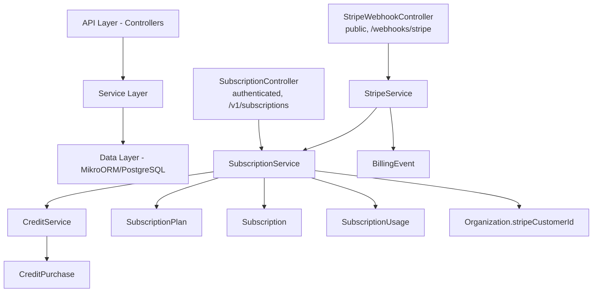

# Complete Specification

<Note>
**Status:** Active — fully implemented  
**Module Path:** `src/modules/subscription/`  
**Payment Gateway:** Stripe
</Note>

## Overview

The Subscription Module implements a **freemium SaaS billing system** for PropWise CRM. Every organization has a subscription tied to one of four plan tiers. The module handles:

- **Plan-based feature gating** — binary feature flags per tier
- **Resource limits** — caps on leads, contacts, deals, companies, and storage
- **Credit-based metering** — monthly AI and messaging allowances with purchasable top-ups
- **Dual seat types** — manager seats and agent seats with per-tier pricing; every user consumes a seat
- **Stripe integration** — checkout, subscription management, mid-cycle plan changes, webhooks, billing portal
- **Proration** — mid-cycle upgrades, downgrades, and seat changes are prorated to the day
- **Suspension flow** — 2-day grace period on payment failure, then org goes read-only

### Design Principles

<AccordionGroup>
<Accordion title="Core Business Model">
- **Freemium model**: Free plan with limited features; paid tiers unlock progressively
- **Per-org billing**: Billing is per organization; developer portal is free
- **Dual seat types**: Manager seats (Owner, Admin) and agent seats (Basic, custom roles); every user consumes a seat
- **Seat type derived from role**: No explicit seat assignment — seat type is automatically determined by the user's RBAC role
</Accordion>

<Accordion title="Technical Architecture">
- **Feature flags over tier checks**: Gating uses `@RequiresFeature('flag')` on plan JSONB — changing what a tier includes requires only a seeder update, not code changes
- **Service-layer limit enforcement**: Resource limits and credit consumption are checked in service methods, not guards, because they need entity counts
- **Stripe as source of truth for payments**: Webhook-driven lifecycle: the app reacts to Stripe events rather than polling
</Accordion>

<Accordion title="Billing Operations">
- **Prorated plan changes**: All mid-cycle changes (upgrade, downgrade, add/remove seats) use `proration_behavior: 'create_prorations'` — charges are fair to the day
- **Checkout vs. change-plan separation**: `POST /checkout` is for first-time subscription (Free → Paid); `POST /change-plan` is for switching between paid tiers
- **Idempotent webhooks**: Every Stripe event is logged in `BillingEvent` with a unique `stripeEventId` to prevent duplicate processing
- **Graceful degradation**: If `STRIPE_SECRET_KEY` is not set, billing features are unavailable but the app still starts
</Accordion>
</AccordionGroup>

## Architecture

### High-Level Diagram



### Data Flow

<Tabs>
<Tab title="First-time Checkout">
```
Frontend "Upgrade" button
  → POST /v1/subscriptions/checkout
    → Rejects if org already has a Stripe subscription (use change-plan instead)
    → SubscriptionService.createCheckoutSession()
      → StripeService.createCheckoutSession()
        → Returns Stripe Checkout URL
          → User pays on Stripe's hosted page
            → Stripe fires checkout.session.completed webhook
              → StripeWebhookController receives + verifies signature
                → SubscriptionService.activateSubscription()
                  → Subscription entity updated to ACTIVE
```
</Tab>

<Tab title="Plan Change">
```
Frontend "Change Plan" button
  → POST /v1/subscriptions/change-plan
    → SubscriptionService.changePlan()
      → Validates seat overflow (blocks if current users exceed new plan capacity)
      → StripeService.swapSubscriptionPrice() — prorated
      → Reconciles seat line items (old tier price → new tier price)
      → Updates local Subscription entity
      → Returns updated subscription immediately
```
</Tab>

<Tab title="Payment Failure">
```
Stripe charges renewal invoice
  ├─ invoice.paid → handleInvoicePaid() → status stays ACTIVE, period updated
  └─ invoice.payment_failed → handleInvoicePaymentFailed() → status → PAST_DUE
       └─ Stripe retries for 2 days
            ├─ Payment succeeds → invoice.paid → back to ACTIVE
            └─ All retries fail → customer.subscription.updated (status: unpaid)
                 → handleSubscriptionUpdated() → status → SUSPENDED
                      → Org is read-only (SubscriptionActiveGuard blocks writes)
```
</Tab>
</Tabs>

## Plan Tiers & Pricing

<CardGroup cols={2}>
<Card title="Free Tier" icon="gift">
- **Monthly:** $0
- **Annual:** $0
- **Manager seats:** 1
- **Agent seats:** 0
</Card>

<Card title="Starter Tier" icon="rocket">
- **Monthly:** $49
- **Annual:** $470.40 (~20% off)
- **Manager seats:** 2
- **Agent seats:** 3
</Card>

<Card title="Professional Tier" icon="briefcase">
- **Monthly:** $149
- **Annual:** $1,430.40
- **Manager seats:** 5
- **Agent seats:** 15
</Card>

<Card title="Business Tier" icon="building">
- **Monthly:** $399
- **Annual:** $3,830.40
- **Manager seats:** 10
- **Agent seats:** 40
</Card>
</CardGroup>

### Resource Limits

| Resource | Free | Starter | Professional | Business |
|---|---|---|---|---|
| Leads | 50 | 1,000 | 10,000 | Unlimited |
| Contacts | 50 | 1,000 | 10,000 | Unlimited |
| Deals | 20 | 500 | 5,000 | Unlimited |
| Companies | 10 | 200 | 2,000 | Unlimited |
| Storage | 500 MB | 5 GB | 25 GB | 100 GB |

### Monthly Credits

| Credit type | Free | Starter | Professional | Business |
|---|---|---|---|---|
| AI credits | 20 | 200 | 1,000 | 5,000 |
| Messaging credits | 0 | 100 | 500 | 2,000 |

## Feature Gating Model

Features are gated using three distinct mechanisms:

### Type 1: Binary Feature Flags

<Info>
Boolean flags stored in `SubscriptionPlan.features` (JSONB). Checked via `@RequiresFeature('flagName')` guard decorator or `SubscriptionService.checkFeature()`.
</Info>

| Feature flag | Free | Starter | Pro | Business |
|---|---|---|---|---|
| `customPipelineStages` | ❌ | ✅ | ✅ | ✅ |
| `distributionEngine` | ❌ | ❌ | ✅ | ✅ |
| `escalationEngine` | ❌ | ❌ | ✅ | ✅ |
| `advancedAnalytics` | ❌ | ❌ | ✅ | ✅ |
| `apiAccess` | ❌ | ❌ | ✅ | ✅ |
| `commissionTracking` | ❌ | ❌ | ✅ | ✅ |
| `teamsAndHierarchy` | ❌ | ❌ | ✅ | ✅ |
| `customRoles` | ❌ | ❌ | ❌ | ✅ |
| `whiteLabel` | ❌ | ❌ | ❌ | ✅ |
| `maxMessagingChannels` | 0 | 1 | 3 | Unlimited (-1) |
| `maxEmailIntegrations` | 0 | 1 | 3 | Unlimited (-1) |
| `auditLogRetentionDays` | 0 | 0 | 30 | Unlimited (-1) |

### Type 2: Credit-Based (Monthly Allowance)

Features that are available on the tier but have a monthly budget that resets each billing cycle. Tracked in `SubscriptionUsage`. When exhausted, the org can purchase one-time top-up packs (`CreditPurchase`).

<Note>
Consumption order: **monthly plan allowance first → purchased packs FIFO (oldest first)**
</Note>

### Type 3: Add-on Packs

| Add-on | Behavior | Stripe model |
|---|---|---|
| Storage pack (+10 GB) | Recurring, stacks | Subscription line item (per-unit) |
| AI credit pack (+500) | One-time, consumed then gone | Payment intent |
| Messaging credit pack (+500) | One-time, consumed then gone | Payment intent |

## Seat Management

### Seat Types

<Warning>
Every user in an organization consumes exactly one seat. The seat type is **derived from the user's RBAC role** — there is no separate seat assignment.
</Warning>

| Seat type | Roles that consume it | Price varies by tier |
|---|---|---|
| **Manager** | Owner, Admin | ✅ |
| **Agent** | Basic, custom org roles | ✅ |

The mapping is defined in `subscription.service.ts`:

```typescript
const ROLE_SEAT_MAP: Record<string, SeatType> = {
  Owner: SeatType.MANAGER,
  Admin: SeatType.MANAGER,
};
// Any other role → SeatType.AGENT
```

### Seat Counting

Seats are **derived from RBAC roles**, not tracked via a separate assignment table. The count is computed on-demand from active `UserOrgRole` records:

```typescript
managerSeatsUsed = count of active users with Owner or Admin org role
agentSeatsUsed   = count of active users with any other org role
```

<Tip>
A seat is **not occupied** by a pending invitation — it only counts when the user has accepted and has an active `UserOrgRole`.
</Tip>

### Enforcement Points

Seat availability is checked at two integration points:

1. **`invitation.service.ts`** — before creating an invitation, the role determines the seat type and availability is checked
2. **`role-assignment-validation.service.ts`** — when changing a user's role (e.g. promoting Basic → Admin), checks that the target seat type has room; the old seat type is freed simultaneously

### Proration on Seat Changes

Adding or removing seats mid-cycle uses `proration_behavior: 'create_prorations'`:

- **Adding a seat on April 15** (30-day month): prorated charge for 15 remaining days, billed on the next invoice
- **Removing a seat on April 15**: prorated credit for 15 remaining days, applied to the next invoice
- **Adding on April 4, removing on April 6**: net charge for 2 days only (charge for 26 days minus credit for 24 days)

### Stripe Billing

Extra seats are billed as subscription line items with `per_unit` pricing. A subscription for a Professional org with 7 managers and 20 agents would have:

| Line Item | Qty | Price |
|---|---|---|
| PropWise Professional | 1 | $149/mo |
| Extra Manager Seat (Pro) | 2 | $40/mo |
| Extra Agent Seat (Pro) | 5 | $50/mo |

## Credit System

### Consumption Flow

```typescript
SubscriptionService.consumeCredits(orgId, 'ai', 1)
  → CreditService.consumeCredits(subscription, AI, 1)
      1. Check monthly allowance: usage.aiCreditsUsed < plan.aiCreditsIncluded
      2. If insufficient, consume from purchased packs (FIFO)
      3. Update usage tracking
```

<Steps>
<Step title="Check Monthly Allowance">
Verify if the organization has remaining credits from their monthly plan allocation
</Step>

<Step title="Consume from Packs">
If monthly allowance is exhausted, consume from purchased credit packs in FIFO order
</Step>

<Step title="Update Usage">
Track consumption in `SubscriptionUsage` for reporting and billing
</Step>
</Steps>

## Entity Specifications

### SubscriptionPlan

```typescript
@Entity()
export class SubscriptionPlan {
  @PrimaryKey()
  id: string = randomUUID();

  @Property()
  name: string; // 'Free', 'Starter', 'Professional', 'Business'

  @Property()
  monthlyPrice: number; // USD cents

  @Property()
  annualPrice: number; // USD cents

  @Property({ type: 'jsonb' })
  features: Record<string, any>; // Feature flags and limits

  @Property()
  managerSeatsIncluded: number;

  @Property()
  agentSeatsIncluded: number;

  @Property()
  extraManagerSeatPrice: number; // USD cents

  @Property()
  extraAgentSeatPrice: number; // USD cents

  @Property()
  aiCreditsIncluded: number;

  @Property()
  messagingCreditsIncluded: number;

  @Property()
  storageLimit: number; // Bytes

  @Property()
  leadsLimit: number; // -1 for unlimited

  @Property()
  contactsLimit: number;

  @Property()
  dealsLimit: number;

  @Property()
  companiesLimit: number;
}
```

### Subscription

```typescript
@Entity()
export class Subscription {
  @PrimaryKey()
  id: string = randomUUID();

  @ManyToOne(() => Organization)
  organization: Organization;

  @ManyToOne(() => SubscriptionPlan)
  plan: SubscriptionPlan;

  @Enum(() => SubscriptionStatus)
  status: SubscriptionStatus;

  @Property({ nullable: true })
  stripeSubscriptionId?: string;

  @Property({ nullable: true })
  currentPeriodStart?: Date;

  @Property({ nullable: true })
  currentPeriodEnd?: Date;

  @Property({ type: 'jsonb', nullable: true })
  metadata?: Record<string, any>;
}
```

## Stripe Integration

### Webhook Handling

<CodeGroup>
```typescript Webhook Controller
@Controller('webhooks/stripe')
export class StripeWebhookController {
  @Post()
  async handleWebhook(@Body() body: any, @Headers('stripe-signature') sig: string) {
    const event = this.stripeService.verifyWebhook(body, sig);
    
    switch (event.type) {
      case 'checkout.session.completed':
        await this.subscriptionService.activateSubscription(event.data.object);
        break;
      case 'invoice.payment_failed':
        await this.subscriptionService.handlePaymentFailure(event.data.object);
        break;
      case 'customer.subscription.updated':
        await this.subscriptionService.handleSubscriptionUpdate(event.data.object);
        break;
    }
  }
}
```

```typescript Idempotency Check
async handleWebhook(event: Stripe.Event) {
  // Check if event already processed
  const existing = await this.billingEventRepo.findOne({
    stripeEventId: event.id
  });
  
  if (existing) {
    return; // Already processed
  }
  
  // Process event and save to prevent duplicates
  await this.processBillingEvent(event);
  
  await this.billingEventRepo.create({
    stripeEventId: event.id,
    type: event.type,
    processedAt: new Date(),
  }).persistAndFlush();
}
```
</CodeGroup>

## Subscription Lifecycle

<Tabs>
<Tab title="Initial Setup">
1. Organization created → automatically gets Free plan subscription
2. `SubscriptionUsage` entity created with zero counters
3. Monthly credit allowances are available immediately
</Tab>

<Tab title="First Upgrade">
1. User clicks "Upgrade" → `POST /v1/subscriptions/checkout`
2. Stripe Checkout session created with selected plan
3. User completes payment on Stripe
4. Webhook `checkout.session.completed` → subscription activated
</Tab>

<Tab title="Plan Changes">
1. User selects new plan → `POST /v1/subscriptions/change-plan`
2. Seat overflow validation (current users ≤ new plan limits)
3. Stripe subscription updated with proration
4. Local subscription entity updated immediately
</Tab>

<Tab title="Payment Failures">
1. Invoice payment fails → `PAST_DUE` status
2. 2-day grace period with retry attempts
3. Final failure → `SUSPENDED` status
4. Organization becomes read-only
</Tab>
</Tabs>

## Plan Changes (Upgrade / Downgrade)

### Validation Rules

<Warning>
Downgrades are blocked if the current organization usage exceeds the target plan's limits:
</Warning>

- **Seat overflow**: Current active users exceed target plan's seat limits
- **Resource overflow**: Current data (leads, contacts, deals, companies) exceeds target limits
- **Feature dependencies**: Org uses features not available in target plan

### Proration Logic

```typescript
// All plan changes use create_prorations
const subscription = await stripe.subscriptions.update(stripeSubId, {
  items: [{
    id: currentLineItem.id,
    price: newPlanPriceId,
  }],
  proration_behavior: 'create_prorations',
});
```

## API Endpoints

<AccordionGroup>
<Accordion title="GET /v1/subscriptions/current">
Returns the current organization's subscription details including usage and limits.

**Response:**
```json
{
  "subscription": {
    "id": "sub_123",
    "plan": {
      "name": "Professional",
      "features": {...}
    },
    "status": "ACTIVE",
    "currentPeriodEnd": "2024-01-31T23:59:59Z"
  },
  "usage": {
    "managerSeatsUsed": 3,
    "agentSeatsUsed": 12,
    "aiCreditsUsed": 450,
    "messagingCreditsUsed": 120
  }
}
```
</Accordion>

<Accordion title="POST /v1/subscriptions/checkout">
Creates a Stripe Checkout session for first-time subscription (Free → Paid).

**Request:**
```json
{
  "planId": "plan_starter",
  "billingCycle": "monthly"
}
```

**Response:**
```json
{
  "checkoutUrl": "https://checkout.stripe.com/pay/cs_123..."
}
```
</Accordion>

<Accordion title="POST /v1/subscriptions/change-plan">
Changes the current paid subscription to a different paid tier.

**Request:**
```json
{
  "planId": "plan_professional"
}
```

**Response:**
```json
{
  "subscription": {...},
  "prorationAmount": 4500
}
```
</Accordion>

<Accordion title="POST /v1/subscriptions/purchase-credits">
Purchase one-time credit packs (AI or messaging).

**Request:**
```json
{
  "type": "ai",
  "amount": 500
}
```

**Response:**
```json
{
  "paymentUrl": "https://checkout.stripe.com/pay/pi_123..."
}
```
</Accordion>
</AccordionGroup>

## Guards & Decorators

### @RequiresFeature Decorator

```typescript
@RequiresFeature('customPipelineStages')
@Post('custom-stages')
async createCustomStage() {
  // Only available on Starter+ plans
}
```

### SubscriptionActiveGuard

```typescript
@UseGuards(SubscriptionActiveGuard)
@Post('leads')
async createLead() {
  // Blocked if subscription is SUSPENDED
}
```

## Enforcement Points

<Check>
Feature gating and limit enforcement occur at multiple layers:
</Check>

1. **API Guards**: `@RequiresFeature()` decorator blocks endpoint access
2. **Service Layer**: Resource limits checked before entity creation
3. **Credit Consumption**: AI and messaging features check credit balance
4. **Seat Management**: Role assignments validate seat availability

## Module Structure

```
src/modules/subscription/
├── controllers/
│   ├── subscription.controller.ts
│   └── stripe-webhook.controller.ts
├── services/
│   ├── subscription.service.ts
│   ├── credit.service.ts
│   └── stripe.service.ts
├── entities/
│   ├── subscription-plan.entity.ts
│   ├── subscription.entity.ts
│   ├── subscription-usage.entity.ts
│   ├── credit-purchase.entity.ts
│   └── billing-event.entity.ts
├── guards/
│   ├── subscription-active.guard.ts
│   └── requires-feature.guard.ts
├── decorators/
│   └── requires-feature.decorator.ts
├── seeders/
│   └── plan.seeder.ts
└── subscription.module.ts
```

## Environment Configuration

```bash
# Stripe Configuration
STRIPE_SECRET_KEY=sk_live_...
STRIPE_WEBHOOK_SECRET=whsec_...
STRIPE_PUBLISHABLE_KEY=pk_live_...

# Plan Price IDs (from Stripe Dashboard)
STRIPE_STARTER_MONTHLY_PRICE_ID=price_...
STRIPE_STARTER_ANNUAL_PRICE_ID=price_...
STRIPE_PRO_MONTHLY_PRICE_ID=price_...
STRIPE_PRO_ANNUAL_PRICE_ID=price_...
STRIPE_BUSINESS_MONTHLY_PRICE_ID=price_...
STRIPE_BUSINESS_ANNUAL_PRICE_ID=price_...

# Additional Seat Price IDs
STRIPE_MANAGER_SEAT_STARTER_PRICE_ID=price_...
STRIPE_AGENT_SEAT_STARTER_PRICE_ID=price_...
# ... (similar for Pro and Business)
```

## Integration with Other Modules

<CardGroup cols={2}>
<Card title="Organization Module" icon="building">
- Every org gets a Free subscription on creation
- `stripeCustomerId` stored on Organization entity
- Subscription status affects org capabilities
</Card>

<Card title="RBAC Module" icon="shield">
- User roles determine seat type (Manager vs Agent)
- Seat limits enforced during role assignments
- Feature flags control access to role-based features
</Card>

<Card title="Invitation Module" icon="envelope">
- Seat availability checked before sending invitations
- Role in invitation determines required seat type
- Failed seat validation blocks invitation creation
</Card>

<Card title="AI Module" icon="brain">
- AI credit consumption tracked per operation
- Credit exhaustion blocks AI features
- Monthly allowances reset each billing cycle
</Card>
</CardGroup>