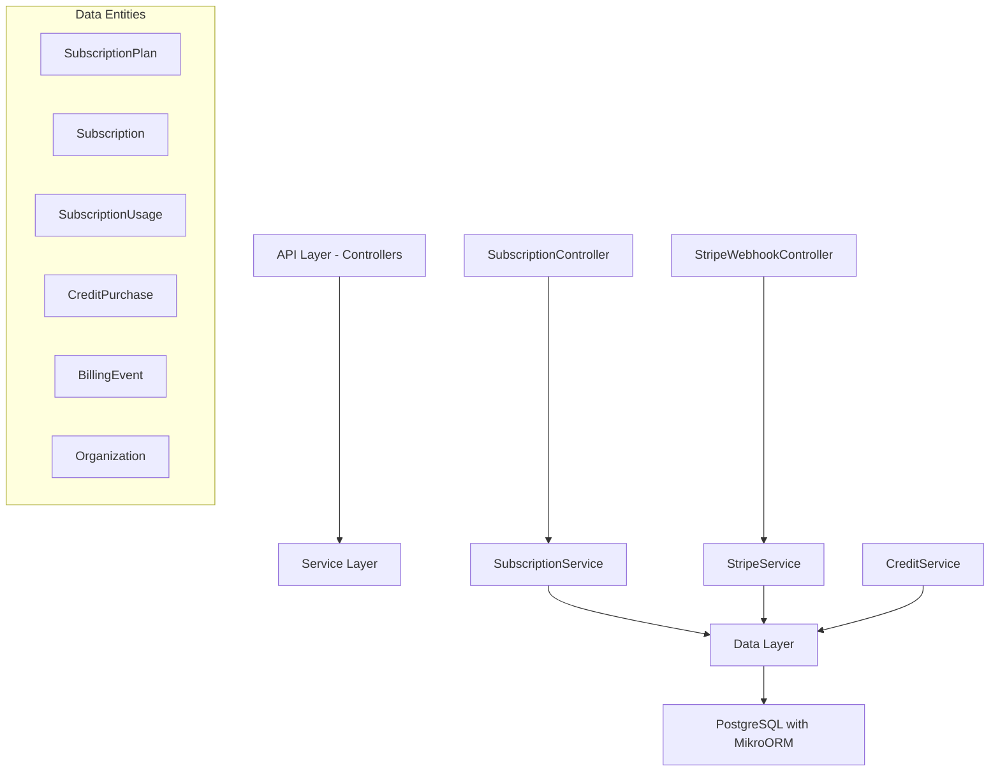

# Subscription & Billing Module Specification

<Note>
**Status:** Active — fully implemented  
**Module Path:** `src/modules/subscription/`  
**Payment Gateway:** Stripe
</Note>

## Overview

The Subscription Module implements a **freemium SaaS billing system** for PropWise CRM. Every organization has a subscription tied to one of four plan tiers. The module handles:

- **Plan-based feature gating** — binary feature flags per tier
- **Resource limits** — caps on leads, contacts, deals, companies, and storage
- **Credit-based metering** — monthly AI and messaging allowances with purchasable top-ups
- **Dual seat types** — manager seats and agent seats with per-tier pricing; every user consumes a seat
- **Stripe integration** — checkout, subscription management, mid-cycle plan changes, webhooks, billing portal
- **Proration** — mid-cycle upgrades, downgrades, and seat changes are prorated to the day
- **Suspension flow** — 2-day grace period on payment failure, then org goes read-only

### Design Principles

<AccordionGroup>
<Accordion title="Core Design Decisions">
| Principle | Decision |
|---|---|
| Freemium model | Free plan with limited features; paid tiers unlock progressively |
| Per-org billing | Billing is per organization; developer portal is free |
| Dual seat types | Manager seats (Owner, Admin) and agent seats (Basic, custom roles); every user consumes a seat |
| Seat type derived from role | No explicit seat assignment — seat type is automatically determined by the user's RBAC role |
| Feature flags over tier checks | Gating uses `@RequiresFeature('flag')` on plan JSONB — changing what a tier includes requires only a seeder update, not code changes |
| Service-layer limit enforcement | Resource limits and credit consumption are checked in service methods, not guards, because they need entity counts |
| Stripe as source of truth for payments | Webhook-driven lifecycle: the app reacts to Stripe events rather than polling |
| Prorated plan changes | All mid-cycle changes (upgrade, downgrade, add/remove seats) use `proration_behavior: 'create_prorations'` — charges are fair to the day |
| Checkout vs. change-plan separation | `POST /checkout` is for first-time subscription (Free → Paid); `POST /change-plan` is for switching between paid tiers |
| Idempotent webhooks | Every Stripe event is logged in `BillingEvent` with a unique `stripeEventId` to prevent duplicate processing |
| Graceful degradation | If `STRIPE_SECRET_KEY` is not set, billing features are unavailable but the app still starts |
</Accordion>
</AccordionGroup>

## Architecture

### High-Level Diagram



### Data Flow Examples

<Tabs>
<Tab title="First-time Checkout (Free → Paid)">
<Steps>
<Step title="User Initiates Upgrade">
Frontend "Upgrade" button triggers `POST /v1/subscriptions/checkout`
</Step>
<Step title="Validation">
Rejects if org already has a Stripe subscription (use change-plan instead)
</Step>
<Step title="Create Checkout Session">
`SubscriptionService.createCheckoutSession()` → `StripeService.createCheckoutSession()` returns Stripe Checkout URL
</Step>
<Step title="Payment Processing">
User pays on Stripe's hosted page, Stripe fires `checkout.session.completed` webhook
</Step>
<Step title="Activation">
`StripeWebhookController` receives + verifies signature → `SubscriptionService.activateSubscription()` updates Subscription entity to ACTIVE
</Step>
</Steps>
</Tab>

<Tab title="Mid-cycle Plan Change (Paid → Different Paid)">
<Steps>
<Step title="Change Request">
Frontend "Change Plan" button triggers `POST /v1/subscriptions/change-plan`
</Step>
<Step title="Validation">
`SubscriptionService.changePlan()` validates seat overflow (blocks if current users exceed new plan capacity)
</Step>
<Step title="Stripe Update">
`StripeService.swapSubscriptionPrice()` handles prorated changes and reconciles seat line items
</Step>
<Step title="Local Update">
Updates local Subscription entity and returns updated subscription immediately
</Step>
</Steps>
</Tab>

<Tab title="Renewal / Payment Failure">
<Steps>
<Step title="Renewal Attempt">
Stripe charges renewal invoice
</Step>
<Step title="Success Path">
`invoice.paid` → `handleInvoicePaid()` → status stays ACTIVE, period updated
</Step>
<Step title="Failure Path">
`invoice.payment_failed` → `handleInvoicePaymentFailed()` → status → PAST_DUE
</Step>
<Step title="Grace Period">
Stripe retries for 2 days - Payment succeeds → back to ACTIVE, or all retries fail → SUSPENDED
</Step>
<Step title="Suspension">
`customer.subscription.updated` (status: unpaid) → org becomes read-only via `SubscriptionActiveGuard`
</Step>
</Steps>
</Tab>
</Tabs>

## Plan Tiers & Pricing

<CardGroup cols={2}>
<Card title="Free Tier" icon="gift">
- **Monthly:** $0
- **Manager seats:** 1 included
- **Agent seats:** 0 included
- **Basic features only**
</Card>

<Card title="Starter Tier" icon="rocket">
- **Monthly:** $49 ($470.40 annually)
- **Manager seats:** 2 included (+$25 extra)
- **Agent seats:** 3 included (+$12 extra)
- **Core business features**
</Card>

<Card title="Professional Tier" icon="briefcase">
- **Monthly:** $149 ($1,430.40 annually)
- **Manager seats:** 5 included (+$20 extra)
- **Agent seats:** 15 included (+$10 extra)
- **Advanced features + API access**
</Card>

<Card title="Business Tier" icon="building">
- **Monthly:** $399 ($3,830.40 annually)
- **Manager seats:** 10 included (+$18 extra)
- **Agent seats:** 40 included (+$8 extra)
- **Enterprise features + white-label**
</Card>
</CardGroup>

### Resource Limits

| Resource | Free | Starter | Professional | Business |
|---|---|---|---|---|
| Leads | 50 | 1,000 | 10,000 | Unlimited |
| Contacts | 50 | 1,000 | 10,000 | Unlimited |
| Deals | 20 | 500 | 5,000 | Unlimited |
| Companies | 10 | 200 | 2,000 | Unlimited |
| Storage | 500 MB | 5 GB | 25 GB | 100 GB |

### Monthly Credits

| Credit type | Free | Starter | Professional | Business |
|---|---|---|---|---|
| AI credits | 20 | 200 | 1,000 | 5,000 |
| Messaging credits | 0 | 100 | 500 | 2,000 |

## Feature Gating Model

Features are gated using three distinct mechanisms:

### Type 1: Binary Feature Flags

<Info>
Boolean flags stored in `SubscriptionPlan.features` (JSONB). Checked via `@RequiresFeature('flagName')` guard decorator or `SubscriptionService.checkFeature()`.
</Info>

<AccordionGroup>
<Accordion title="Feature Flag Availability Matrix">
| Feature flag | Free | Starter | Pro | Business |
|---|---|---|---|---|
| `customPipelineStages` | ❌ | ✅ | ✅ | ✅ |
| `distributionEngine` | ❌ | ❌ | ✅ | ✅ |
| `escalationEngine` | ❌ | ❌ | ✅ | ✅ |
| `advancedAnalytics` | ❌ | ❌ | ✅ | ✅ |
| `apiAccess` | ❌ | ❌ | ✅ | ✅ |
| `commissionTracking` | ❌ | ❌ | ✅ | ✅ |
| `teamsAndHierarchy` | ❌ | ❌ | ✅ | ✅ |
| `customRoles` | ❌ | ❌ | ❌ | ✅ |
| `whiteLabel` | ❌ | ❌ | ❌ | ✅ |
| `maxMessagingChannels` | 0 | 1 | 3 | Unlimited (-1) |
| `maxEmailIntegrations` | 0 | 1 | 3 | Unlimited (-1) |
| `auditLogRetentionDays` | 0 | 0 | 30 | Unlimited (-1) |
</Accordion>
</AccordionGroup>

### Type 2: Credit-Based (Monthly Allowance)

Features that are available on the tier but have a monthly budget that resets each billing cycle. Tracked in `SubscriptionUsage`. When exhausted, the org can purchase one-time top-up packs (`CreditPurchase`).

<Tip>
**Consumption order:** Monthly plan allowance first → purchased packs FIFO (oldest first)
</Tip>

### Type 3: Add-on Packs

| Add-on | Behavior | Stripe model |
|---|---|---|
| Storage pack (+10 GB) | Recurring, stacks | Subscription line item (per-unit) |
| AI credit pack (+500) | One-time, consumed then gone | Payment intent |
| Messaging credit pack (+500) | One-time, consumed then gone | Payment intent |

## Seat Management

### Seat Types

<Warning>
Every user in an organization consumes exactly one seat. The seat type is **derived from the user's RBAC role** — there is no separate seat assignment.
</Warning>

| Seat type | Roles that consume it | Price varies by tier |
|---|---|---|
| **Manager** | Owner, Admin | Yes |
| **Agent** | Basic, custom org roles | Yes |

The mapping is defined in `subscription.service.ts`:

```typescript
const ROLE_SEAT_MAP: Record<string, SeatType> = {
  Owner: SeatType.MANAGER,
  Admin: SeatType.MANAGER,
};
// Any other role → SeatType.AGENT
```

### Seat Counting

Seats are **derived from RBAC roles**, not tracked via a separate assignment table. The count is computed on-demand from active `UserOrgRole` records:

```typescript
managerSeatsUsed = count of active users with Owner or Admin org role
agentSeatsUsed   = count of active users with any other org role
```

<Note>
A seat is **not occupied** by a pending invitation — it only counts when the user has accepted and has an active `UserOrgRole`.
</Note>

### Enforcement Points

Seat availability is checked at two integration points:

1. **`invitation.service.ts`** — before creating an invitation, the role determines the seat type and availability is checked
2. **`role-assignment-validation.service.ts`** — when changing a user's role (e.g. promoting Basic → Admin), checks that the target seat type has room; the old seat type is freed simultaneously

### Proration on Seat Changes

Adding or removing seats mid-cycle uses `proration_behavior: 'create_prorations'`:

- **Adding a seat on April 15** (30-day month): prorated charge for 15 remaining days, billed on the next invoice
- **Removing a seat on April 15**: prorated credit for 15 remaining days, applied to the next invoice
- **Adding on April 4, removing on April 6**: net charge for 2 days only (charge for 26 days minus credit for 24 days)

### Stripe Billing Example

Extra seats are billed as subscription line items with `per_unit` pricing. A subscription for a Professional org with 7 managers and 20 agents would have:

| Line Item | Qty | Price |
|---|---|---|
| PropWise Professional | 1 | $149/mo |
| Extra Manager Seat (Pro) | 2 | $40/mo |
| Extra Agent Seat (Pro) | 5 | $50/mo |

## Credit System

### Consumption Flow

```typescript
SubscriptionService.consumeCredits(orgId, 'ai', 1)
  → CreditService.consumeCredits(subscription, AI, 1)
      1. Check monthly allowance: usage.aiCreditsUsed < usage.aiCreditsAllowed
      2. If insufficient, check purchased packs (FIFO order)
      3. Update usage counters
      4. Return success/failure + remaining balance
```

<Check>
The credit system ensures fair usage by consuming monthly allowances first, then purchased credit packs in oldest-first order.
</Check>

## Entity Specifications

<CodeGroup>
```typescript SubscriptionPlan
@Entity()
export class SubscriptionPlan extends BaseEntity {
  @PrimaryKey()
  id!: number;

  @Property({ unique: true })
  name!: string; // 'Free', 'Starter', 'Professional', 'Business'

  @Property()
  monthlyPrice!: number; // in cents

  @Property()
  annualPrice!: number; // in cents

  @Property({ type: 'json' })
  features!: Record<string, boolean | number>; // feature flags

  @Property({ type: 'json' })
  limits!: Record<string, number>; // resource limits

  @Property()
  managerSeatsIncluded!: number;

  @Property()
  agentSeatsIncluded!: number;

  @Property()
  extraManagerSeatPrice!: number; // in cents

  @Property()
  extraAgentSeatPrice!: number; // in cents

  @Property()
  aiCreditsIncluded!: number;

  @Property()
  messagingCreditsIncluded!: number;
}
```

```typescript Subscription
@Entity()
export class Subscription extends BaseEntity {
  @PrimaryKey()
  id!: number;

  @ManyToOne(() => Organization)
  organization!: Organization;

  @ManyToOne(() => SubscriptionPlan)
  plan!: SubscriptionPlan;

  @Enum(() => SubscriptionStatus)
  status!: SubscriptionStatus; // TRIAL, ACTIVE, PAST_DUE, SUSPENDED, CANCELED

  @Enum(() => BillingInterval)
  billingInterval!: BillingInterval; // MONTHLY, ANNUAL

  @Property({ nullable: true })
  stripeSubscriptionId?: string;

  @Property({ nullable: true })
  stripeCustomerId?: string;

  @Property({ type: 'date', nullable: true })
  currentPeriodStart?: Date;

  @Property({ type: 'date', nullable: true })
  currentPeriodEnd?: Date;

  @Property({ type: 'date', nullable: true })
  trialEnd?: Date;

  @OneToOne(() => SubscriptionUsage)
  usage!: SubscriptionUsage;
}
```

```typescript SubscriptionUsage
@Entity()
export class SubscriptionUsage extends BaseEntity {
  @PrimaryKey()
  id!: number;

  @OneToOne(() => Subscription)
  subscription!: Subscription;

  @Property({ default: 0 })
  aiCreditsUsed!: number;

  @Property({ default: 0 })
  messagingCreditsUsed!: number;

  @Property({ default: 0 })
  aiCreditsAllowed!: number; // monthly allowance from plan

  @Property({ default: 0 })
  messagingCreditsAllowed!: number;

  @Property({ type: 'date', nullable: true })
  lastResetDate?: Date; // when monthly counters were last reset
}
```
</CodeGroup>

## Stripe Integration

### Webhook Events

<AccordionGroup>
<Accordion title="Supported Webhook Events">
| Event Type | Handler | Purpose |
|---|---|---|
| `checkout.session.completed` | `handleCheckoutCompleted` | Activate subscription after first payment |
| `customer.subscription.updated` | `handleSubscriptionUpdated` | Sync status changes (trial → active, suspend) |
| `customer.subscription.deleted` | `handleSubscriptionDeleted` | Mark as canceled |
| `invoice.paid` | `handleInvoicePaid` | Update billing period, reset credits |
| `invoice.payment_failed` | `handleInvoicePaymentFailed` | Mark as past due |
| `customer.subscription.trial_will_end` | `handleTrialWillEnd` | Send notification (if implemented) |
</Accordion>
</AccordionGroup>

### Idempotency

<Info>
Every Stripe event is logged in `BillingEvent` with a unique `stripeEventId` to prevent duplicate processing.
</Info>

```typescript
@Entity()
export class BillingEvent extends BaseEntity {
  @Property({ unique: true })
  stripeEventId!: string;

  @Property()
  eventType!: string;

  @Property({ type: 'json' })
  eventData!: any;

  @Property()
  processed!: boolean;
}
```

## Subscription Lifecycle

<Tabs>
<Tab title="New Organization">
<Steps>
<Step title="Organization Creation">
Every new org gets a Free plan subscription automatically
</Step>
<Step title="Initial State">
- Status: `TRIAL` or `ACTIVE`
- Plan: Free tier
- No Stripe integration
- Basic feature access only
</Step>
</Steps>
</Tab>

<Tab title="Upgrade to Paid">
<Steps>
<Step title="Checkout Session">
User selects paid plan → Stripe Checkout session created
</Step>
<Step title="Payment">
User completes payment on Stripe hosted page
</Step>
<Step title="Webhook Processing">
`checkout.session.completed` webhook activates subscription
</Step>
<Step title="Feature Unlock">
Organization gains access to paid tier features immediately
</Step>
</Steps>
</Tab>

<Tab title="Payment Failure & Recovery">
<Steps>
<Step title="Payment Failure">
Stripe invoice payment fails → status becomes `PAST_DUE`
</Step>
<Step title="Grace Period">
2-day grace period with automatic retries
</Step>
<Step title="Recovery or Suspension">
Either payment succeeds (back to `ACTIVE`) or subscription becomes `SUSPENDED`
</Step>
<Step title="Read-Only Mode">
Suspended orgs can view data but cannot create/edit
</Step>
</Steps>
</Tab>
</Tabs>

## Plan Changes (Upgrade / Downgrade)

### Validation Rules

<Warning>
**Seat Overflow Protection:** Cannot downgrade if current user count exceeds new plan's seat limits.
</Warning>

### Proration Logic

All mid-cycle changes use Stripe's proration system:

- **Upgrade:** Immediate charge for remaining days at higher rate
- **Downgrade:** Credit applied to next invoice for remaining days
- **Seat changes:** Prorated based on days remaining in billing cycle

## API Endpoints

<AccordionGroup>
<Accordion title="Subscription Management">
```http
GET    /v1/subscriptions/current
POST   /v1/subscriptions/checkout
POST   /v1/subscriptions/change-plan
GET    /v1/subscriptions/plans
POST   /v1/subscriptions/cancel
GET    /v1/subscriptions/billing-portal
```
</Accordion>

<Accordion title="Credit Management">
```http
GET    /v1/subscriptions/credits/balance
POST   /v1/subscriptions/credits/purchase
GET    /v1/subscriptions/credits/history
```
</Accordion>

<Accordion title="Usage & Limits">
```http
GET    /v1/subscriptions/usage
GET    /v1/subscriptions/limits
```
</Accordion>

<Accordion title="Webhooks (Public)">
```http
POST   /webhooks/stripe
```
</Accordion>
</AccordionGroup>

## Guards & Decorators

### Feature Gating

```typescript
@RequiresFeature('customPipelineStages')
@Post('custom-stages')
async createCustomStage() {
  // Only available on Starter+ plans
}
```

### Subscription Status

```typescript
@UseGuards(SubscriptionActiveGuard)
@Post('leads')
async createLead() {
  // Blocked if subscription is SUSPENDED
}
```

### Credit Consumption

```typescript
async createAIInsight() {
  const canConsume = await this.subscriptionService.consumeCredits(
    orgId, 
    CreditType.AI, 
    1
  );
  
  if (!canConsume) {
    throw new ForbiddenException('Insufficient AI credits');
  }
}
```

## Enforcement Points

<CardGroup cols={2}>
<Card title="Resource Limits" icon="chart-bar">
Checked in service methods before creating:
- Leads, Contacts, Deals, Companies
- File uploads (storage limits)
</Card>

<Card title="Feature Access" icon="lock">
Enforced via:
- Controller guards (`@RequiresFeature`)
- Service-level checks
- Frontend feature flags
</Card>

<Card title="Seat Management" icon="users">
Validated during:
- User invitations
- Role assignments
- Plan downgrades
</Card>

<Card title="Credit Consumption" icon="coins">
Consumed for:
- AI-powered features
- Messaging/SMS sending
- Advanced analytics queries
</Card>
</CardGroup>

## Module Structure

```
src/modules/subscription/
├── controllers/
│   ├── subscription.controller.ts
│   └── stripe-webhook.controller.ts
├── services/
│   ├── subscription.service.ts
│   ├── credit.service.ts
│   └── stripe.service.ts
├── entities/
│   ├── subscription-plan.entity.ts
│   ├── subscription.entity.ts
│   ├── subscription-usage.entity.ts
│   ├── credit-purchase.entity.ts
│   └── billing-event.entity.ts
├── guards/
│   ├── requires-feature.guard.ts
│   └── subscription-active.guard.ts
├── decorators/
│   └── requires-feature.decorator.ts
├── enums/
│   ├── subscription-status.enum.ts
│   ├── billing-interval.enum.ts
│   └── credit-type.enum.ts
└── seeders/
    └── subscription-plan.seeder.ts
```

## Environment Configuration

<CodeGroup>
```env Required Stripe Variables
STRIPE_SECRET_KEY=sk_live_...
STRIPE_PUBLISHABLE_KEY=pk_live_...
STRIPE_WEBHOOK_SECRET=whsec_...
```

```env Optional Configuration
STRIPE_SUCCESS_URL=https://app.propwise.ai/billing/success
STRIPE_CANCEL_URL=https://app.propwise.ai/billing/cancel
```
</CodeGroup>

<Note>
If `STRIPE_SECRET_KEY` is not set, billing features are unavailable but the app will still start with reduced functionality.
</Note>

## Integration with Other Modules

<AccordionGroup>
<Accordion title="User & Organization Management">
- **Seat counting** from active `UserOrgRole` records
- **Invitation validation** checks seat availability
- **Organization creation** automatically creates Free subscription
</Accordion>

<Accordion title="CRM Modules (Leads, Contacts, etc.)">
- **Resource limit checks** before entity creation
- **Feature gating** for advanced CRM capabilities
- **Credit consumption** for AI-powered features
</Accordion>

<Accordion title="Messaging & Communications">
- **Credit consumption** for SMS/email sending
- **Channel limits** based on plan tier
- **Integration limits** for email providers
</Accordion>

<Accordion title="Analytics & Reporting">
- **Feature gating** for advanced analytics
- **Credit consumption** for AI-generated insights
- **Data retention** policies based on plan
</Accordion>
</AccordionGroup>

<Tip>
The subscription module is designed to be the central authority for all billing, feature access, and usage tracking across the entire PropWise CRM platform.
</Tip>