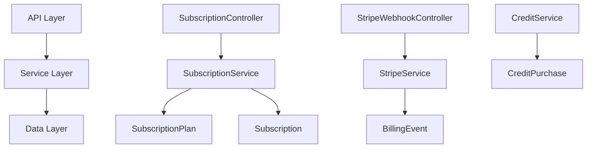

## Overview

The Subscription Module implements a **freemium SaaS billing system** for PropWise CRM. Every organization has a subscription tied to one of four plan tiers. The module handles:

- **Plan-based feature gating** — binary feature flags per tier
- **Resource limits** — caps on leads, contacts, deals, companies, and storage
- **Credit-based metering** — monthly AI and messaging allowances with purchasable top-ups
- **Dual seat types** — manager seats and agent seats with per-tier pricing; every user consumes a seat
- **Stripe integration** — checkout, subscription management, mid-cycle plan changes, webhooks, billing portal
- **Proration** — mid-cycle upgrades, downgrades, and seat changes are prorated to the day
- **Suspension flow** — 2-day grace period on payment failure, then org goes read-only

<Info>
**Module Path:** `src/modules/subscription/`  
**Payment Gateway:** Stripe  
**Status:** Active — fully implemented
</Info>

### Design Principles

<CardGroup cols={2}>
  <Card title="Freemium Model" icon="gift">
    Free plan with limited features; paid tiers unlock progressively
  </Card>
  <Card title="Per-Org Billing" icon="building">
    Billing is per organization; developer portal is free
  </Card>
  <Card title="Dual Seat Types" icon="users">
    Manager seats (Owner, Admin) and agent seats (Basic, custom roles)
  </Card>
  <Card title="Feature Flags Over Tier Checks" icon="flag">
    Gating uses `@RequiresFeature('flag')` on plan JSONB
  </Card>
</CardGroup>

## Architecture

### High-Level Overview



### Data Flow

<Tabs>
  <Tab title="First-time Checkout">
    **Free → Paid subscription flow:**

    <Steps>
      <Step title="Initiate Checkout">
        Frontend "Upgrade" button → `POST /v1/subscriptions/checkout`
      </Step>
      <Step title="Validation">
        Rejects if org already has a Stripe subscription (use change-plan instead)
      </Step>
      <Step title="Create Session">
        `SubscriptionService.createCheckoutSession()` → `StripeService.createCheckoutSession()`
      </Step>
      <Step title="Payment">
        User pays on Stripe's hosted page
      </Step>
      <Step title="Activation">
        Stripe fires `checkout.session.completed` webhook → Subscription activated
      </Step>
    </Steps>
  </Tab>

  <Tab title="Plan Changes">
    **Mid-cycle plan change flow:**

    <Steps>
      <Step title="Change Request">
        Frontend "Change Plan" button → `POST /v1/subscriptions/change-plan`
      </Step>
      <Step title="Validation">
        Validates seat overflow (blocks if current users exceed new plan capacity)
      </Step>
      <Step title="Price Swap">
        `StripeService.swapSubscriptionPrice()` with proration
      </Step>
      <Step title="Seat Reconciliation">
        Reconciles seat line items (old tier price → new tier price)
      </Step>
      <Step title="Update">
        Updates local Subscription entity and returns immediately
      </Step>
    </Steps>
  </Tab>

  <Tab title="Payment Failure">
    **Renewal / payment failure flow:**

    ```
    Stripe charges renewal invoice
      ├─ invoice.paid → status stays ACTIVE, period updated
      └─ invoice.payment_failed → status → PAST_DUE
           └─ Stripe retries for 2 days
                ├─ Payment succeeds → back to ACTIVE
                └─ All retries fail → status → SUSPENDED
                     → Org is read-only
    ```
  </Tab>
</Tabs>

## Plan Tiers & Pricing

### Pricing Structure

| Plan | Monthly | Annual | Manager Seats | Agent Seats |
|------|---------|--------|---------------|-------------|
| **Free** | $0 | $0 | 1 | 0 |
| **Starter** | $49 | $470.40 | 2 | 3 |
| **Professional** | $149 | $1,430.40 | 5 | 15 |
| **Business** | $399 | $3,830.40 | 10 | 40 |

<Note>
Annual plans include approximately 20% discount compared to monthly billing.
</Note>

### Additional Seat Pricing

| Plan | Extra Manager | Extra Agent |
|------|---------------|-------------|
| **Starter** | $25/mo | $12/mo |
| **Professional** | $20/mo | $10/mo |
| **Business** | $18/mo | $8/mo |

### Resource Limits

<AccordionGroup>
  <Accordion title="Storage & Data Limits">
    | Resource | Free | Starter | Professional | Business |
    |----------|------|---------|--------------|----------|
    | Leads | 50 | 1,000 | 10,000 | Unlimited |
    | Contacts | 50 | 1,000 | 10,000 | Unlimited |
    | Deals | 20 | 500 | 5,000 | Unlimited |
    | Companies | 10 | 200 | 2,000 | Unlimited |
    | Storage | 500 MB | 5 GB | 25 GB | 100 GB |
  </Accordion>

  <Accordion title="Monthly Credits">
    | Credit Type | Free | Starter | Professional | Business |
    |-------------|------|---------|--------------|----------|
    | AI credits | 20 | 200 | 1,000 | 5,000 |
    | Messaging credits | 0 | 100 | 500 | 2,000 |
  </Accordion>
</AccordionGroup>

## Feature Gating Model

Features are gated using three distinct mechanisms:

### Binary Feature Flags

<Info>
Boolean flags stored in `SubscriptionPlan.features` (JSONB). Checked via `@RequiresFeature('flagName')` guard decorator or `SubscriptionService.checkFeature()`.
</Info>

| Feature Flag | Free | Starter | Pro | Business |
|--------------|------|---------|-----|----------|
| `customPipelineStages` | ❌ | ✅ | ✅ | ✅ |
| `distributionEngine` | ❌ | ❌ | ✅ | ✅ |
| `escalationEngine` | ❌ | ❌ | ✅ | ✅ |
| `advancedAnalytics` | ❌ | ❌ | ✅ | ✅ |
| `apiAccess` | ❌ | ❌ | ✅ | ✅ |
| `commissionTracking` | ❌ | ❌ | ✅ | ✅ |
| `teamsAndHierarchy` | ❌ | ❌ | ✅ | ✅ |
| `customRoles` | ❌ | ❌ | ❌ | ✅ |
| `whiteLabel` | ❌ | ❌ | ❌ | ✅ |

### Numeric Limits

| Feature | Free | Starter | Pro | Business |
|---------|------|---------|-----|----------|
| `maxMessagingChannels` | 0 | 1 | 3 | Unlimited (-1) |
| `maxEmailIntegrations` | 0 | 1 | 3 | Unlimited (-1) |
| `auditLogRetentionDays` | 0 | 0 | 30 | Unlimited (-1) |

### Credit-Based Features

Features available on the tier but with monthly budget that resets each billing cycle. Tracked in `SubscriptionUsage`.

<Warning>
When credits are exhausted, the org can purchase one-time top-up packs via `CreditPurchase`.
</Warning>

**Consumption order:** Monthly plan allowance first → purchased packs FIFO (oldest first)

### Add-on Packs

| Add-on | Behavior | Stripe Model |
|--------|----------|--------------|
| Storage pack (+10 GB) | Recurring, stacks | Subscription line item (per-unit) |
| AI credit pack (+500) | One-time, consumed then gone | Payment intent |
| Messaging credit pack (+500) | One-time, consumed then gone | Payment intent |

## Seat Management

### Seat Types

Every user in an organization consumes exactly one seat. The seat type is **derived from the user's RBAC role**.

<Tabs>
  <Tab title="Manager Seats">
    **Roles that consume manager seats:**
    - Owner
    - Admin

    Price varies by tier (higher tiers have lower per-seat cost)
  </Tab>

  <Tab title="Agent Seats">
    **Roles that consume agent seats:**
    - Basic
    - Custom org roles

    Price varies by tier (higher tiers have lower per-seat cost)
  </Tab>
</Tabs>

### Seat Counting Logic

<CodeGroup>
```typescript Role Mapping
const ROLE_SEAT_MAP: Record<string, SeatType> = {
  Owner: SeatType.MANAGER,
  Admin: SeatType.MANAGER,
};
// Any other role → SeatType.AGENT
```

```sql Seat Count Query
-- Manager seats used
SELECT COUNT(*) FROM user_org_roles uor
JOIN users u ON uor.user_id = u.id
WHERE uor.organization_id = ? 
  AND uor.role IN ('Owner', 'Admin')
  AND uor.deleted_at IS NULL
  AND u.deleted_at IS NULL;

-- Agent seats used  
SELECT COUNT(*) FROM user_org_roles uor
JOIN users u ON uor.user_id = u.id
WHERE uor.organization_id = ?
  AND uor.role NOT IN ('Owner', 'Admin')
  AND uor.deleted_at IS NULL
  AND u.deleted_at IS NULL;
```
</CodeGroup>

<Note>
A seat is **not occupied** by a pending invitation — it only counts when the user has accepted and has an active `UserOrgRole`.
</Note>

### Enforcement Points

Seat availability is checked at two integration points:

<Steps>
  <Step title="Invitation Creation">
    `invitation.service.ts` — before creating an invitation, the role determines the seat type and availability is checked
  </Step>
  <Step title="Role Changes">
    `role-assignment-validation.service.ts` — when changing a user's role (e.g. promoting Basic → Admin), checks that the target seat type has room
  </Step>
</Steps>

### Proration on Seat Changes

<Info>
Adding or removing seats mid-cycle uses `proration_behavior: 'create_prorations'`.
</Info>

**Examples:**
- **Adding a seat on April 15** (30-day month): prorated charge for 15 remaining days
- **Removing a seat on April 15**: prorated credit for 15 remaining days
- **Adding on April 4, removing on April 6**: net charge for 2 days only

## Credit System

### Consumption Flow

<Steps>
  <Step title="Credit Check">
    `SubscriptionService.consumeCredits(orgId, 'ai', 1)`
  </Step>
  <Step title="Monthly Allowance">
    Check if `usage.aiCreditsUsed < usage.aiCreditsAllowed`
  </Step>
  <Step title="Purchased Packs">
    If monthly exhausted, consume from purchased packs (FIFO order)
  </Step>
  <Step title="Reject or Record">
    Either reject the operation or record the consumption
  </Step>
</Steps>

## Entity Specifications

### SubscriptionPlan

<CodeGroup>
```typescript Entity Definition
@Entity()
export class SubscriptionPlan {
  @PrimaryKey()
  id!: number;

  @Property()
  name!: string;

  @Property()
  stripePriceIdMonthly?: string;

  @Property()
  stripePriceIdYearly?: string;

  @Property()
  monthlyPriceUsd!: number;

  @Property()
  yearlyPriceUsd!: number;

  @Property()
  managerSeatsIncluded!: number;

  @Property()
  agentSeatsIncluded!: number;

  @Property()
  managerSeatPriceUsd!: number;

  @Property()
  agentSeatPriceUsd!: number;

  @Property({ type: 'jsonb' })
  features!: Record<string, any>;

  @Property({ type: 'jsonb' })
  limits!: Record<string, number>;

  @Property()
  aiCreditsMonthly!: number;

  @Property()
  messagingCreditsMonthly!: number;
}
```

```json Features Example
{
  "customPipelineStages": true,
  "distributionEngine": false,
  "maxMessagingChannels": 3,
  "auditLogRetentionDays": 30
}
```

```json Limits Example
{
  "leads": 10000,
  "contacts": 10000,
  "deals": 5000,
  "companies": 2000,
  "storageBytes": 26843545600
}
```
</CodeGroup>

### Subscription

<CodeGroup>
```typescript Entity Definition
@Entity()
export class Subscription {
  @PrimaryKey()
  id!: number;

  @ManyToOne(() => Organization)
  organization!: Organization;

  @ManyToOne(() => SubscriptionPlan)
  plan!: SubscriptionPlan;

  @Enum(() => SubscriptionStatus)
  status!: SubscriptionStatus;

  @Enum(() => BillingInterval)
  billingInterval!: BillingInterval;

  @Property()
  stripeSubscriptionId?: string;

  @Property()
  stripeCustomerId?: string;

  @Property()
  currentPeriodStart!: Date;

  @Property()
  currentPeriodEnd!: Date;

  @Property()
  cancelAtPeriodEnd!: boolean;

  @OneToOne(() => SubscriptionUsage)
  usage!: SubscriptionUsage;
}
```

```typescript Status Enum
export enum SubscriptionStatus {
  ACTIVE = 'active',
  PAST_DUE = 'past_due',
  CANCELED = 'canceled',
  SUSPENDED = 'suspended',
}

export enum BillingInterval {
  MONTHLY = 'monthly',
  YEARLY = 'yearly',
}
```
</CodeGroup>

### SubscriptionUsage

Tracks monthly credit consumption and resets each billing period.

```typescript
@Entity()
export class SubscriptionUsage {
  @PrimaryKey()
  id!: number;

  @OneToOne(() => Subscription)
  subscription!: Subscription;

  @Property()
  aiCreditsAllowed!: number;

  @Property()
  aiCreditsUsed!: number;

  @Property()
  messagingCreditsAllowed!: number;

  @Property()
  messagingCreditsUsed!: number;

  @Property()
  lastResetAt!: Date;
}
```

## Stripe Integration

### Checkout Session Creation

<CodeGroup>
```typescript Checkout Flow
async createCheckoutSession(
  organizationId: number,
  planId: number,
  billingInterval: BillingInterval,
): Promise<string> {
  const org = await this.getOrganizationWithSubscription(organizationId);
  
  if (org.subscription?.stripeSubscriptionId) {
    throw new BadRequestException(
      'Organization already has an active subscription. Use change-plan instead.'
    );
  }

  const plan = await this.planRepo.findOneOrFail(planId);
  const priceId = billingInterval === BillingInterval.MONTHLY 
    ? plan.stripePriceIdMonthly 
    : plan.stripePriceIdYearly;

  const session = await this.stripeService.createCheckoutSession({
    customer_email: org.primaryContact?.email,
    client_reference_id: organizationId.toString(),
    line_items: [{ price: priceId, quantity: 1 }],
    metadata: { organizationId: organizationId.toString(), planId: planId.toString() },
  });

  return session.url!;
}
```

```typescript Webhook Handler
@Post('stripe')
async handleStripeWebhook(
  @Req() req: RawBodyRequest<Request>,
  @Headers('stripe-signature') signature: string,
): Promise<void> {
  const event = this.stripeService.constructWebhookEvent(req.body, signature);
  
  // Idempotency check
  const existingEvent = await this.billingEventRepo.findOne({
    stripeEventId: event.id,
  });
  
  if (existingEvent) {
    return; // Already processed
  }

  await this.billingEventRepo.persistAndFlush(
    this.billingEventRepo.create({
      stripeEventId: event.id,
      eventType: event.type,
      data: event.data,
    })
  );

  switch (event.type) {
    case 'checkout.session.completed':
      await this.subscriptionService.activateSubscription(event.data.object);
      break;
    case 'invoice.paid':
      await this.subscriptionService.handleInvoicePaid(event.data.object);
      break;
    // ... other event handlers
  }
}
```
</CodeGroup>

## API Endpoints

<AccordionGroup>
  <Accordion title="Subscription Management">
    ```typescript
    // Get current subscription
    GET /v1/subscriptions
    
    // Create checkout session (Free → Paid)
    POST /v1/subscriptions/checkout
    Body: { planId: number, billingInterval: 'monthly' | 'yearly' }
    
    // Change plan (Paid → different Paid tier)
    POST /v1/subscriptions/change-plan
    Body: { planId: number, billingInterval?: 'monthly' | 'yearly' }
    
    // Cancel subscription
    DELETE /v1/subscriptions
    
    // Get billing portal URL
    GET /v1/subscriptions/billing-portal
    ```
  </Accordion>

  <Accordion title="Credits & Usage">
    ```typescript
    // Get credit balance
    GET /v1/subscriptions/credits
    
    // Purchase credit pack
    POST /v1/subscriptions/credits/purchase
    Body: { type: 'ai' | 'messaging', amount: number }
    
    // Get usage statistics
    GET /v1/subscriptions/usage
    ```
  </Accordion>

  <Accordion title="Plans & Features">
    ```typescript
    // List available plans
    GET /v1/subscriptions/plans
    
    // Check feature availability
    GET /v1/subscriptions/features/:featureName
    
    // Get resource limits
    GET /v1/subscriptions/limits
    ```
  </Accordion>
</AccordionGroup>

## Guards & Decorators

### Feature Gating

<CodeGroup>
```typescript RequiresFeature Decorator
@Controller('analytics')
export class AnalyticsController {
  @Get('advanced')
  @RequiresFeature('advancedAnalytics')
  async getAdvancedAnalytics(@Req() req: AuthRequest) {
    // Only accessible on Professional and Business plans
  }
}
```

```typescript Subscription Active Guard
@Injectable()
export class SubscriptionActiveGuard implements CanActivate {
  async canActivate(context: ExecutionContext): Promise<boolean> {
    const request = context.switchToHttp().getRequest<AuthRequest>();
    const subscription = await this.subscriptionService.getByOrganization(
      request.user.organizationId
    );

    // Block write operations if subscription is suspended
    if (subscription.status === SubscriptionStatus.SUSPENDED) {
      const method = request.method;
      return ['GET', 'HEAD', 'OPTIONS'].includes(method);
    }

    return true;
  }
}
```

```typescript Credit Consumption
async consumeAICredits(organizationId: number, amount: number): Promise<void> {
  const subscription = await this.getByOrganization(organizationId);
  
  if (!this.creditService.canConsume(subscription, CreditType.AI, amount)) {
    throw new BadRequestException('Insufficient AI credits');
  }

  await this.creditService.consumeCredits(subscription, CreditType.AI, amount);
}
```
</CodeGroup>

## Enforcement Points

### Service-Layer Validation

<Warning>
Resource limits and credit consumption are checked in service methods, not guards, because they need entity counts.
</Warning>

<CodeGroup>
```typescript Lead Creation Limit
// In leads.service.ts
async createLead(organizationId: number, data: CreateLeadDto): Promise<Lead> {
  await this.subscriptionService.checkResourceLimit(organizationId, 'leads');
  
  // Proceed with lead creation
  const lead = this.leadRepo.create(data);
  await this.leadRepo.persistAndFlush(lead);
  
  return lead;
}
```

```typescript Storage Limit Check
// In file-upload.service.ts
async uploadFile(organizationId: number, file: Express.Multer.File): Promise<File> {
  const currentUsage = await this.getStorageUsage(organizationId);
  const newTotal = currentUsage + file.size;
  
  await this.subscriptionService.checkStorageLimit(organizationId, newTotal);
  
  // Proceed with upload
  return this.processFileUpload(file);
}
```

```typescript AI Feature Usage
// In ai.service.ts
async generateContent(organizationId: number, prompt: string): Promise<string> {
  const creditsNeeded = this.calculateCreditsForPrompt(prompt);
  
  await this.subscriptionService.consumeCredits(
    organizationId, 
    CreditType.AI, 
    creditsNeeded
  );
  
  // Proceed with AI generation
  return this.openaiService.generate(prompt);
}
```
</CodeGroup>

## Plan Seeder

The plan seeder creates the four subscription tiers with their features, limits, and pricing.

<CodeGroup>
```typescript Seeder Structure
export class SubscriptionPlanSeeder implements Seeder {
  async run(em: EntityManager): Promise<void> {
    const plans = [
      {
        name: 'Free',
        monthlyPriceUsd: 0,
        yearlyPriceUsd: 0,
        managerSeatsIncluded: 1,
        agentSeatsIncluded: 0,
        features: {
          customPipelineStages: false,
          distributionEngine: false,
          // ... other features
        },
        limits: {
          leads: 50,
          contacts: 50,
          deals: 20,
          companies: 10,
          storageBytes: 500 * 1024 * 1024, // 500 MB
        },
        aiCreditsMonthly: 20,
        messagingCreditsMonthly: 0,
      },
      // ... other plans
    ];

    for (const planData of plans) {
      const plan = em.create(SubscriptionPlan, planData);
      em.persist(plan);
    }

    await em.flush();
  }
}
```

```bash Running Seeder
npm run seeder:run --seeder=SubscriptionPlanSeeder
```
</CodeGroup>

## Module Structure

```
src/modules/subscription/
├── controllers/
│   ├── subscription.controller.ts
│   └── stripe-webhook.controller.ts
├── services/
│   ├── subscription.service.ts
│   ├── credit.service.ts
│   └── stripe.service.ts
├── entities/
│   ├── subscription-plan.entity.ts
│   ├── subscription.entity.ts
│   ├── subscription-usage.entity.ts
│   ├── credit-purchase.entity.ts
│   └── billing-event.entity.ts
├── guards/
│   ├── requires-feature.guard.ts
│   └── subscription-active.guard.ts
├── decorators/
│   └── requires-feature.decorator.ts
├── seeders/
│   └── subscription-plan.seeder.ts
├── dtos/
│   ├── checkout.dto.ts
│   ├── change-plan.dto.ts
│   └── purchase-credits.dto.ts
└── subscription.module.ts
```

## Environment Configuration

<CodeGroup>
```env Required Variables
# Stripe Configuration
STRIPE_SECRET_KEY=sk_test_...
STRIPE_PUBLISHABLE_KEY=pk_test_...
STRIPE_WEBHOOK_SECRET=whsec_...

# Billing Configuration  
BILLING_ENABLED=true
BILLING_CURRENCY=usd
BILLING_GRACE_PERIOD_DAYS=2
```

```typescript Configuration Loading
@Injectable()
export class StripeService {
  private stripe: Stripe;

  constructor(private configService: ConfigService) {
    const secretKey = this.configService.get<string>('STRIPE_SECRET_KEY');
    
    if (!secretKey) {
      throw new Error('STRIPE_SECRET_KEY is required when billing is enabled');
    }

    this.stripe = new Stripe(secretKey, {
      apiVersion: '2023-10-16',
    });
  }
}
```
</CodeGroup>

<Warning>
If `STRIPE_SECRET_KEY` is not set, billing features are unavailable but the app still starts with limited functionality.
</Warning>

## Integration with Other Modules

### User Management Integration

<Tabs>
  <Tab title="Invitation Flow">
    When inviting users, the invitation service checks seat availability:

    ```typescript
    // invitation.service.ts
    async createInvitation(data: CreateInvitationDto): Promise<Invitation> {
      const seatType = this.getRoleSeatType(data.role);
      
      await this.subscriptionService.checkSeatAvailability(
        data.organizationId, 
        seatType
      );

      // Proceed with invitation creation
    }
    ```
  </Tab>

  <Tab title="Role Assignment">
    Role changes trigger seat type validation:

    ```typescript
    // role-assignment-validation.service.ts
    async validateRoleChange(
      userId: number,
      organizationId: number, 
      newRole: string
    ): Promise<void> {
      const currentRole = await this.getCurrentRole(userId, organizationId);
      const currentSeatType = this.getRoleSeatType(currentRole);
      const newSeatType = this.getRoleSeatType(newRole);

      if (currentSeatType !== newSeatType) {
        await this.subscriptionService.checkSeatAvailability(
          organizationId, 
          newSeatType
        );
      }
    }
    ```
  </Tab>
</Tabs>

### Feature Module Integration

<CodeGroup>
```typescript Pipeline Stages
@Controller('pipelines')
export class PipelineController {
  @Post('stages')
  @RequiresFeature('customPipelineStages')
  async createCustomStage(@Body() dto: CreateStageDto) {
    // Only available on Starter+ plans
  }
}
```

```typescript API Access
@Controller('api')
export class APIController {
  @Get('keys')
  @RequiresFeature('apiAccess')  
  async getAPIKeys(@Req() req: AuthRequest) {
    // Only available on Professional+ plans
  }
}
```

```typescript Team Hierarchy
@Controller('teams')
export class TeamsController {
  @Post()
  @RequiresFeature('teamsAndHierarchy')
  async createTeam(@Body() dto: CreateTeamDto) {
    // Only available on Professional+ plans  
  }
}
```
</CodeGroup>

<Check>
The subscription module provides a robust, scalable billing system that integrates seamlessly with all other PropWise CRM modules while maintaining clean separation of concerns and reliable payment processing.
</Check>