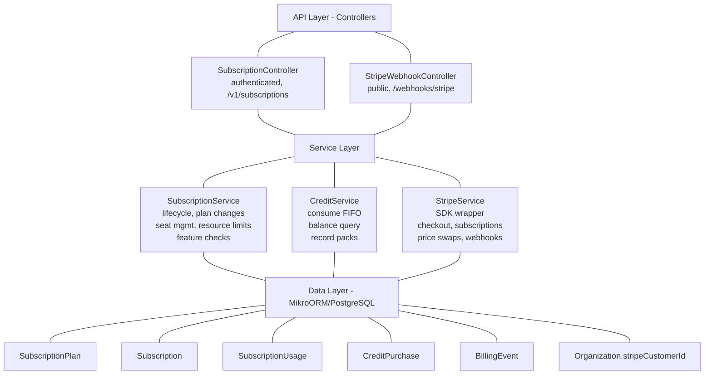
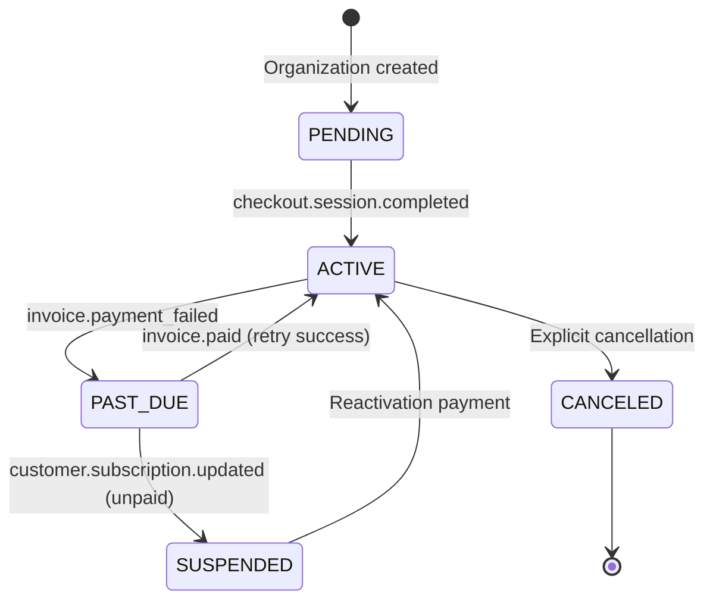

<Info>
This specification covers the freemium SaaS billing system for PropWise CRM, implementing plan-based feature gating, dual seat types, credit-based metering, and full Stripe integration.
</Info>

## Overview

The Subscription Module implements a **freemium SaaS billing system** for PropWise CRM. Every organization has a subscription tied to one of four plan tiers. The module handles:

- **Plan-based feature gating** — binary feature flags per tier
- **Resource limits** — caps on leads, contacts, deals, companies, and storage
- **Credit-based metering** — monthly AI and messaging allowances with purchasable top-ups
- **Dual seat types** — manager seats and agent seats with per-tier pricing; every user consumes a seat
- **Stripe integration** — checkout, subscription management, mid-cycle plan changes, webhooks, billing portal
- **Proration** — mid-cycle upgrades, downgrades, and seat changes are prorated to the day
- **Suspension flow** — 2-day grace period on payment failure, then org goes read-only

### Design Principles

<AccordionGroup>
<Accordion title="Core Decisions">

| Principle | Decision |
|---|---|
| Freemium model | Free plan with limited features; paid tiers unlock progressively |
| Per-org billing | Billing is per organization; developer portal is free |
| Dual seat types | Manager seats (Owner, Admin) and agent seats (Basic, custom roles); every user consumes a seat |
| Seat type derived from role | No explicit seat assignment — seat type is automatically determined by the user's RBAC role |
| Feature flags over tier checks | Gating uses `@RequiresFeature('flag')` on plan JSONB — changing what a tier includes requires only a seeder update, not code changes |
| Service-layer limit enforcement | Resource limits and credit consumption are checked in service methods, not guards, because they need entity counts |
| Stripe as source of truth for payments | Webhook-driven lifecycle: the app reacts to Stripe events rather than polling |
| Prorated plan changes | All mid-cycle changes (upgrade, downgrade, add/remove seats) use `proration_behavior: 'create_prorations'` — charges are fair to the day |
| Checkout vs. change-plan separation | `POST /checkout` is for first-time subscription (Free → Paid); `POST /change-plan` is for switching between paid tiers |
| Idempotent webhooks | Every Stripe event is logged in `BillingEvent` with a unique `stripeEventId` to prevent duplicate processing |
| Graceful degradation | If `STRIPE_SECRET_KEY` is not set, billing features are unavailable but the app still starts |

</Accordion>
</AccordionGroup>

## Architecture

### High-level diagram



### Data flow examples

<Tabs>
<Tab title="First-time Checkout">

```
Frontend "Upgrade" button
  → POST /v1/subscriptions/checkout
    → Rejects if org already has a Stripe subscription (use change-plan instead)
    → SubscriptionService.createCheckoutSession()
      → StripeService.createCheckoutSession()
        → Returns Stripe Checkout URL
          → User pays on Stripe's hosted page
            → Stripe fires checkout.session.completed webhook
              → StripeWebhookController receives + verifies signature
                → SubscriptionService.activateSubscription()
                  → Subscription entity updated to ACTIVE
```

</Tab>
<Tab title="Plan Change">

```
Frontend "Change Plan" button
  → POST /v1/subscriptions/change-plan
    → SubscriptionService.changePlan()
      → Validates seat overflow (blocks if current users exceed new plan capacity)
      → StripeService.swapSubscriptionPrice() — prorated
      → Reconciles seat line items (old tier price → new tier price)
      → Updates local Subscription entity
      → Returns updated subscription immediately
```

</Tab>
<Tab title="Payment Failure">

```
Stripe charges renewal invoice
  ├─ invoice.paid → handleInvoicePaid() → status stays ACTIVE, period updated
  └─ invoice.payment_failed → handleInvoicePaymentFailed() → status → PAST_DUE
       └─ Stripe retries for 2 days
            ├─ Payment succeeds → invoice.paid → back to ACTIVE
            └─ All retries fail → customer.subscription.updated (status: unpaid)
                 → handleSubscriptionUpdated() → status → SUSPENDED
                      → Org is read-only (SubscriptionActiveGuard blocks writes)
```

</Tab>
</Tabs>

## Plan Tiers & Pricing

Four tiers, priced in USD cents:

| | **Free** | **Starter** | **Professional** | **Business** |
|---|---|---|---|---|
| Monthly price | $0 | $49 | $149 | $399 |
| Annual price | $0 | $470.40 (~20% off) | $1,430.40 | $3,830.40 |
| Manager seats included | 1 | 2 | 5 | 10 |
| Agent seats included | 0 | 3 | 15 | 40 |
| Extra manager seat | — | $25/mo | $20/mo | $18/mo |
| Extra agent seat | — | $12/mo | $10/mo | $8/mo |

### Resource limits

| Resource | Free | Starter | Professional | Business |
|---|---|---|---|---|
| Leads | 50 | 1,000 | 10,000 | Unlimited |
| Contacts | 50 | 1,000 | 10,000 | Unlimited |
| Deals | 20 | 500 | 5,000 | Unlimited |
| Companies | 10 | 200 | 2,000 | Unlimited |
| Storage | 500 MB | 5 GB | 25 GB | 100 GB |

### Monthly credits

| Credit type | Free | Starter | Professional | Business |
|---|---|---|---|---|
| AI credits | 20 | 200 | 1,000 | 5,000 |
| Messaging credits | 0 | 100 | 500 | 2,000 |

## Feature Gating Model

Features are gated using three distinct mechanisms:

### Type 1: Binary feature flags

<Note>
Boolean flags stored in `SubscriptionPlan.features` (JSONB). Checked via `@RequiresFeature('flagName')` guard decorator or `SubscriptionService.checkFeature()`.
</Note>

| Feature flag | Free | Starter | Pro | Business |
|---|---|---|---|---|
| `customPipelineStages` | — | ✓ | ✓ | ✓ |
| `distributionEngine` | — | — | ✓ | ✓ |
| `escalationEngine` | — | — | ✓ | ✓ |
| `advancedAnalytics` | — | — | ✓ | ✓ |
| `apiAccess` | — | — | ✓ | ✓ |
| `commissionTracking` | — | — | ✓ | ✓ |
| `teamsAndHierarchy` | — | — | ✓ | ✓ |
| `customRoles` | — | — | — | ✓ |
| `whiteLabel` | — | — | — | ✓ |
| `maxMessagingChannels` | 0 | 1 | 3 | Unlimited (-1) |
| `maxEmailIntegrations` | 0 | 1 | 3 | Unlimited (-1) |
| `auditLogRetentionDays` | 0 | 0 | 30 | Unlimited (-1) |

### Type 2: Credit-based (monthly allowance)

Features that are available on the tier but have a monthly budget that resets each billing cycle. Tracked in `SubscriptionUsage`. When exhausted, the org can purchase one-time top-up packs (`CreditPurchase`).

**Consumption order:** monthly plan allowance first → purchased packs FIFO (oldest first)

### Type 3: Add-on packs

| Add-on | Behavior | Stripe model |
|---|---|---|
| Storage pack (+10 GB) | Recurring, stacks | Subscription line item (per-unit) |
| AI credit pack (+500) | One-time, consumed then gone | Payment intent |
| Messaging credit pack (+500) | One-time, consumed then gone | Payment intent |

## Seat Management

### Seat types

Every user in an organization consumes exactly one seat. The seat type is **derived from the user's RBAC role** — there is no separate seat assignment.

| Seat type | Roles that consume it | Price varies by tier |
|---|---|---|
| **Manager** | Owner, Admin | Yes |
| **Agent** | Basic, custom org roles | Yes |

The mapping is defined in `subscription.service.ts`:

```typescript
const ROLE_SEAT_MAP: Record<string, SeatType> = {
  Owner: SeatType.MANAGER,
  Admin: SeatType.MANAGER,
};
// Any other role → SeatType.AGENT
```

### Seat counting

<Warning>
Seats are **derived from RBAC roles**, not tracked via a separate assignment table. The count is computed on-demand from active `UserOrgRole` records.
</Warning>

```
managerSeatsUsed = count of active users with Owner or Admin org role
agentSeatsUsed   = count of active users with any other org role
```

A seat is **not occupied** by a pending invitation — it only counts when the user has accepted and has an active `UserOrgRole`:

| Step | Seat occupied? |
|---|---|
| Admin sends invitation with role "Admin" | No — seat availability is checked but not reserved |
| User accepts → `UserOrgRole` created | Yes — now counted |
| User removed (role soft-deleted) | No — freed |
| User's role changed (Basic → Admin) | Swaps: frees one agent seat, occupies one manager seat |

### Enforcement points

Seat availability is checked at two integration points:

1. **`invitation.service.ts`** — before creating an invitation, the role determines the seat type and availability is checked
2. **`role-assignment-validation.service.ts`** — when changing a user's role (e.g. promoting Basic → Admin), checks that the target seat type has room; the old seat type is freed simultaneously

### Proration on seat changes

Adding or removing seats mid-cycle uses `proration_behavior: 'create_prorations'`:

- **Adding a seat on April 15** (30-day month): prorated charge for 15 remaining days, billed on the next invoice
- **Removing a seat on April 15**: prorated credit for 15 remaining days, applied to the next invoice
- **Adding on April 4, removing on April 6**: net charge for 2 days only (charge for 26 days minus credit for 24 days)

### Stripe billing

Extra seats are billed as subscription line items with `per_unit` pricing. A subscription for a Professional org with 7 managers and 20 agents would have:

| Line Item | Qty | Price |
|---|---|---|
| PropWise Professional | 1 | $149/mo |
| Extra Manager Seat (Pro) | 2 | $40/mo |
| Extra Agent Seat (Pro) | 5 | $50/mo |

## Credit System

### Consumption flow

```typescript
SubscriptionService.consumeCredits(orgId, 'ai', 1)
  → CreditService.consumeCredits(subscription, AI, 1)
      1. Check monthly allowance: usage.aiCreditsUsed < usage.aiCreditsAllowance
      2. If insufficient, check purchased packs (oldest first)
      3. Deduct and update usage counters
      4. Return success/failure
```

<Steps>
<Step title="Check monthly allowance">
Verify if the organization has remaining credits in their monthly plan allowance.
</Step>
<Step title="Check purchased packs">
If monthly allowance is exhausted, consume from purchased credit packs using FIFO order.
</Step>
<Step title="Update usage counters">
Deduct consumed credits from the appropriate allowance or pack balance.
</Step>
<Step title="Return result">
Indicate whether the credit consumption was successful or failed due to insufficient balance.
</Step>
</Steps>

## Entity Specifications

### SubscriptionPlan

```typescript
@Entity()
export class SubscriptionPlan {
  @PrimaryKey()
  id!: number;

  @Property({ unique: true })
  name!: string; // 'Free', 'Starter', 'Professional', 'Business'

  @Property()
  monthlyPriceCents!: number;

  @Property()
  annualPriceCents!: number;

  @Property({ type: 'json' })
  features!: Record<string, any>; // Feature flags

  @Property()
  managerSeatsIncluded!: number;

  @Property()
  agentSeatsIncluded!: number;

  @Property()
  extraManagerSeatPriceCents!: number;

  @Property()
  extraAgentSeatPriceCents!: number;

  // Resource limits
  @Property()
  maxLeads!: number; // -1 = unlimited
  @Property()
  maxContacts!: number;
  @Property()
  maxDeals!: number;
  @Property()
  maxCompanies!: number;
  @Property()
  maxStorageBytes!: number;

  // Monthly credit allowances
  @Property()
  aiCreditsPerMonth!: number;
  @Property()
  messagingCreditsPerMonth!: number;

  // Stripe integration
  @Property({ nullable: true })
  stripeMonthlyPriceId?: string;
  @Property({ nullable: true })
  stripeAnnualPriceId?: string;
}
```

### Subscription

```typescript
@Entity()
export class Subscription {
  @PrimaryKey()
  id!: number;

  @ManyToOne()
  organization!: Organization;

  @ManyToOne()
  plan!: SubscriptionPlan;

  @Enum(() => SubscriptionStatus)
  status!: SubscriptionStatus;

  @Enum(() => BillingInterval)
  billingInterval!: BillingInterval; // MONTHLY | ANNUAL

  @Property({ type: DateType, nullable: true })
  currentPeriodStart?: Date;

  @Property({ type: DateType, nullable: true })
  currentPeriodEnd?: Date;

  @Property({ nullable: true })
  stripeSubscriptionId?: string;

  @Property({ nullable: true })
  stripeCustomerId?: string;

  @OneToOne({ mappedBy: 'subscription' })
  usage?: SubscriptionUsage;

  @CreationTimestamp()
  createdAt!: Date;

  @UpdatedTimestamp()
  updatedAt!: Date;
}
```

### SubscriptionUsage

```typescript
@Entity()
export class SubscriptionUsage {
  @PrimaryKey()
  id!: number;

  @OneToOne()
  subscription!: Subscription;

  // Monthly allowances (reset each billing cycle)
  @Property({ default: 0 })
  aiCreditsUsed!: number;
  @Property({ default: 0 })
  messagingCreditsUsed!: number;

  // Resource counters (updated in real-time)
  @Property({ default: 0 })
  storageUsedBytes!: number;

  @Property({ type: DateType, nullable: true })
  lastResetAt?: Date;

  @UpdatedTimestamp()
  updatedAt!: Date;
}
```

## Stripe Integration

### Webhook events

<CardGroup cols={2}>
<Card title="checkout.session.completed" icon="check-circle">
Activates subscription after successful payment
</Card>
<Card title="invoice.paid" icon="credit-card">
Updates billing period, keeps subscription active
</Card>
<Card title="invoice.payment_failed" icon="exclamation-triangle">
Marks subscription as past due
</Card>
<Card title="customer.subscription.updated" icon="sync">
Handles plan changes and status updates
</Card>
</CardGroup>

### Idempotency

All webhook events are logged in `BillingEvent` with a unique `stripeEventId` to prevent duplicate processing:

```typescript
@Entity()
export class BillingEvent {
  @PrimaryKey()
  id!: number;

  @Property({ unique: true })
  stripeEventId!: string;

  @Property()
  eventType!: string;

  @Property({ type: 'json' })
  eventData!: any;

  @Property({ default: false })
  processed!: boolean;

  @CreationTimestamp()
  createdAt!: Date;
}
```

## Subscription Lifecycle

<Tabs>
<Tab title="Status Flow">



</Tab>
<Tab title="Status Behaviors">

| Status | Behavior | API Access | Billing |
|---|---|---|---|
| `PENDING` | Free plan limits | Full access | No billing |
| `ACTIVE` | Plan features enabled | Full access | Active billing |
| `PAST_DUE` | Plan features enabled | Full access | Grace period (2 days) |
| `SUSPENDED` | Read-only mode | Limited access | Billing halted |
| `CANCELED` | Free plan limits | Full access | No billing |

</Tab>
</Tabs>

## Plan Changes

### Upgrade/downgrade flow

<Steps>
<Step title="Validate seat capacity">
Check if current users fit within new plan limits. Block downgrade if it would exceed seat capacity.
</Step>
<Step title="Swap Stripe price">
Update subscription to new plan price with prorated billing.
</Step>
<Step title="Reconcile seat line items">
Update extra seat charges based on new plan pricing.
</Step>
<Step title="Update local subscription">
Sync plan change to local database immediately.
</Step>
</Steps>

### Seat overflow protection

```typescript
// Example: Downgrading from Business (10+40 seats) to Starter (2+3 seats)
const currentManagers = 7;  // Would exceed Starter limit of 2
const currentAgents = 15;   // Would exceed Starter limit of 3

// This downgrade would be blocked:
throw new BadRequestException(
  'Cannot downgrade: current usage exceeds plan limits'
);
```

## API Endpoints

### Subscription management

```typescript
GET    /v1/subscriptions/current        // Get current subscription
POST   /v1/subscriptions/checkout       // Create checkout session (Free → Paid)
POST   /v1/subscriptions/change-plan    // Change between paid plans
POST   /v1/subscriptions/cancel         // Cancel subscription
GET    /v1/subscriptions/portal         // Stripe billing portal URL
GET    /v1/subscriptions/usage          // Current usage stats
```

### Credit management

```typescript
GET    /v1/subscriptions/credits        // Credit balances
POST   /v1/subscriptions/credits/purchase // Buy credit packs
GET    /v1/subscriptions/credits/history  // Credit usage history
```

### Webhooks

```typescript
POST   /webhooks/stripe                 // Stripe webhook endpoint
```

## Guards & Decorators

### @RequiresFeature

```typescript
@RequiresFeature('customPipelineStages')
@Post('stages')
async createStage() {
  // Only available on Starter+ plans
}
```

### SubscriptionActiveGuard

```typescript
@UseGuards(SubscriptionActiveGuard)
@Post('leads')
async createLead() {
  // Blocked if subscription is SUSPENDED
}
```

### Credit consumption

```typescript
// In service methods
await this.subscriptionService.consumeCredits(
  organizationId,
  CreditType.AI,
  5
);
```

## Enforcement Points

Resource limits and credit consumption are enforced in service methods:

<CodeGroup>

```typescript Lead Service
async createLead(data: CreateLeadDto): Promise<Lead> {
  // Check resource limit
  await this.subscriptionService.checkResourceLimit(
    organizationId,
    ResourceType.LEADS
  );
  
  // Create lead...
  return lead;
}
```

```typescript AI Service
async generateContent(prompt: string): Promise<string> {
  // Consume AI credits
  await this.subscriptionService.consumeCredits(
    organizationId,
    CreditType.AI,
    1
  );
  
  // Generate content...
  return content;
}
```

</CodeGroup>

## Module Structure

```
src/modules/subscription/
├── controllers/
│   ├── subscription.controller.ts
│   └── stripe-webhook.controller.ts
├── entities/
│   ├── subscription-plan.entity.ts
│   ├── subscription.entity.ts
│   ├── subscription-usage.entity.ts
│   ├── credit-purchase.entity.ts
│   └── billing-event.entity.ts
├── services/
│   ├── subscription.service.ts
│   ├── credit.service.ts
│   └── stripe.service.ts
├── guards/
│   ├── subscription-active.guard.ts
│   └── requires-feature.guard.ts
├── decorators/
│   └── requires-feature.decorator.ts
├── dto/
│   ├── create-checkout-session.dto.ts
│   ├── change-plan.dto.ts
│   └── purchase-credits.dto.ts
├── enums/
│   ├── subscription-status.enum.ts
│   ├── billing-interval.enum.ts
│   ├── credit-type.enum.ts
│   └── seat-type.enum.ts
├── seeders/
│   └── subscription-plan.seeder.ts
└── subscription.module.ts
```

## Environment Configuration

```env
# Stripe configuration
STRIPE_SECRET_KEY=sk_test_...
STRIPE_WEBHOOK_SECRET=whsec_...
STRIPE_PUBLISHABLE_KEY=pk_test_...

# Application URLs
FRONTEND_URL=http://localhost:3000
BACKEND_URL=http://localhost:8000
```

<Note>
If `STRIPE_SECRET_KEY` is not set, billing features are disabled but the application still starts in free-only mode.
</Note>

## Integration with Other Modules

### Organization Module
- `Organization.stripeCustomerId` links to Stripe customer
- Subscription is created automatically when organization is created

### User/Role Module
- Seat counting based on active `UserOrgRole` records
- Role changes trigger seat type adjustments

### Invitation Module
- Seat availability checked before sending invitations
- Role in invitation determines seat type requirement

### File Upload Module
- Storage usage tracked in `SubscriptionUsage.storageUsedBytes`
- Upload limits enforced based on plan storage allowance

### Communication Module
- Messaging credits consumed for SMS/email sends
- Channel limits enforced based on plan features

### AI Module
- AI credits consumed for content generation
- Feature availability gated by plan tier

<Tip>
The subscription module acts as a central gating mechanism, with other modules checking permissions and consuming resources through the subscription service.
</Tip>