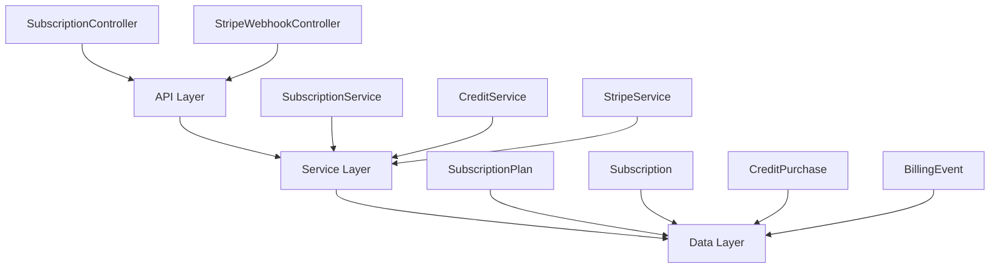
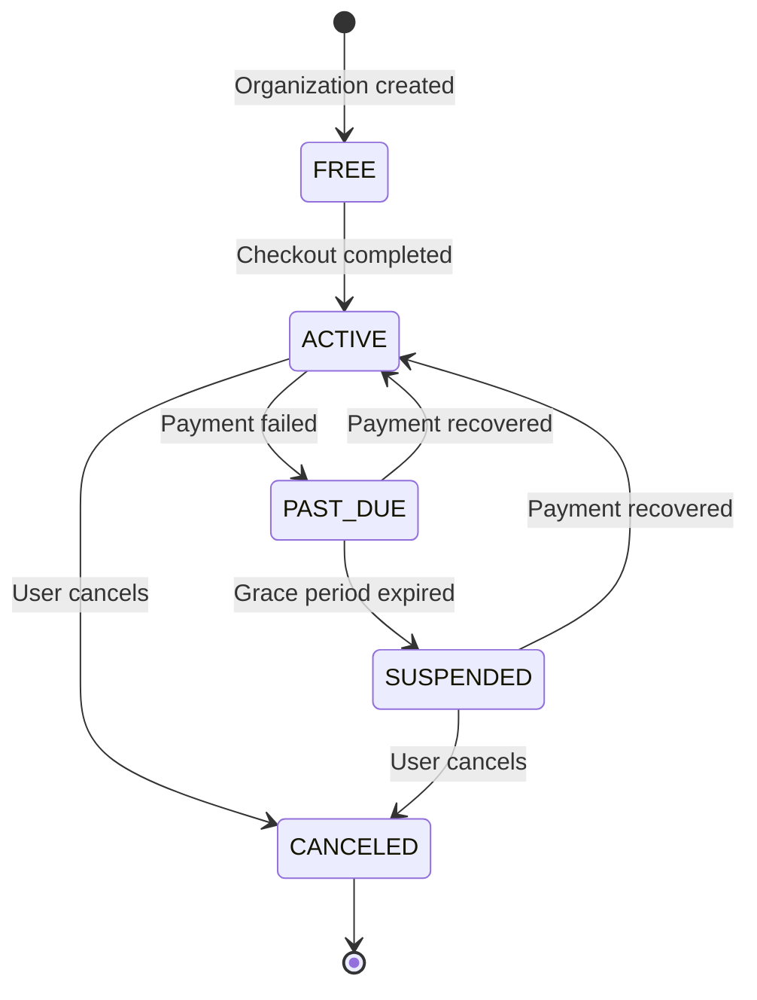

## Overview

The Subscription Module implements a **freemium SaaS billing system** for PropWise CRM. Every organization has a subscription tied to one of four plan tiers. The module handles:

- **Plan-based feature gating** — binary feature flags per tier
- **Resource limits** — caps on leads, contacts, deals, companies, and storage
- **Credit-based metering** — monthly AI and messaging allowances with purchasable top-ups
- **Dual seat types** — manager seats and agent seats with per-tier pricing; every user consumes a seat
- **Stripe integration** — checkout, subscription management, mid-cycle plan changes, webhooks, billing portal
- **Proration** — mid-cycle upgrades, downgrades, and seat changes are prorated to the day
- **Suspension flow** — 2-day grace period on payment failure, then org goes read-only

<Note>
**Module Path:** `src/modules/subscription/`  
**Payment Gateway:** Stripe  
**Status:** Active — fully implemented
</Note>

### Design Principles

<AccordionGroup>
<Accordion title="Core Architecture Decisions">

| Principle | Decision |
|---|---|
| Freemium model | Free plan with limited features; paid tiers unlock progressively |
| Per-org billing | Billing is per organization; developer portal is free |
| Dual seat types | Manager seats (Owner, Admin) and agent seats (Basic, custom roles); every user consumes a seat |
| Seat type derived from role | No explicit seat assignment — seat type is automatically determined by the user's RBAC role |
| Feature flags over tier checks | Gating uses `@RequiresFeature('flag')` on plan JSONB — changing what a tier includes requires only a seeder update, not code changes |

</Accordion>
<Accordion title="Technical Implementation">

| Principle | Decision |
|---|---|
| Service-layer limit enforcement | Resource limits and credit consumption are checked in service methods, not guards, because they need entity counts |
| Stripe as source of truth for payments | Webhook-driven lifecycle: the app reacts to Stripe events rather than polling |
| Prorated plan changes | All mid-cycle changes (upgrade, downgrade, add/remove seats) use `proration_behavior: 'create_prorations'` — charges are fair to the day |
| Checkout vs. change-plan separation | `POST /checkout` is for first-time subscription (Free → Paid); `POST /change-plan` is for switching between paid tiers |

</Accordion>
<Accordion title="Data Integrity & Reliability">

| Principle | Decision |
|---|---|
| Idempotent webhooks | Every Stripe event is logged in `BillingEvent` with a unique `stripeEventId` to prevent duplicate processing |
| Graceful degradation | If `STRIPE_SECRET_KEY` is not set, billing features are unavailable but the app still starts |

</Accordion>
</AccordionGroup>

## Architecture

### High-level system diagram



<Tabs>
<Tab title="Controllers">
- **SubscriptionController** — Authenticated endpoints at `/v1/subscriptions`
- **StripeWebhookController** — Public webhook endpoint at `/webhooks/stripe`
</Tab>
<Tab title="Services">
- **SubscriptionService** — Lifecycle, plan changes, seat management, resource limits, feature checks
- **CreditService** — FIFO consumption, balance queries, credit pack recording
- **StripeService** — SDK wrapper, checkout, subscriptions, price swaps, webhooks
</Tab>
<Tab title="Data Layer">
- **SubscriptionPlan** — Plan definitions and feature flags
- **Subscription** — Per-org subscription state
- **SubscriptionUsage** — Credit consumption tracking
- **CreditPurchase** — One-time credit top-ups
- **BillingEvent** — Webhook event log for idempotency
</Tab>
</Tabs>

### Data flow patterns

<Steps>
<Step title="First-time checkout flow (Free → Paid)">
Frontend "Upgrade" button → `POST /v1/subscriptions/checkout` → Rejects if org already has a Stripe subscription → Creates Stripe Checkout session → User pays on Stripe's hosted page → Stripe fires `checkout.session.completed` webhook → Subscription entity updated to ACTIVE
</Step>

<Step title="Mid-cycle plan change (Paid → different Paid tier)">
Frontend "Change Plan" button → `POST /v1/subscriptions/change-plan` → Validates seat overflow → Stripe subscription price swap with proration → Reconciles seat line items → Updates local Subscription entity → Returns updated subscription immediately
</Step>

<Step title="Renewal and payment failure flow">
Stripe charges renewal invoice → Success: `invoice.paid` → Status stays ACTIVE → Failure: `invoice.payment_failed` → Status becomes PAST_DUE → Stripe retries for 2 days → All retries fail → Status becomes SUSPENDED → Org is read-only
</Step>
</Steps>

## Plan tiers & pricing

Four tiers, priced in USD cents:

<CardGroup cols={2}>
<Card title="Free" icon="gift">
- **Monthly:** $0
- **Annual:** $0
- **Manager seats:** 1 included
- **Agent seats:** 0 included
</Card>
<Card title="Starter" icon="rocket">
- **Monthly:** $49
- **Annual:** $470.40 (~20% off)
- **Manager seats:** 2 included
- **Agent seats:** 3 included
- **Extra manager:** $25/mo
- **Extra agent:** $12/mo
</Card>
<Card title="Professional" icon="briefcase">
- **Monthly:** $149
- **Annual:** $1,430.40
- **Manager seats:** 5 included
- **Agent seats:** 15 included
- **Extra manager:** $20/mo
- **Extra agent:** $10/mo
</Card>
<Card title="Business" icon="building">
- **Monthly:** $399
- **Annual:** $3,830.40
- **Manager seats:** 10 included
- **Agent seats:** 40 included
- **Extra manager:** $18/mo
- **Extra agent:** $8/mo
</Card>
</CardGroup>

### Resource limits by tier

| Resource | Free | Starter | Professional | Business |
|---|---|---|---|---|
| Leads | 50 | 1,000 | 10,000 | Unlimited |
| Contacts | 50 | 1,000 | 10,000 | Unlimited |
| Deals | 20 | 500 | 5,000 | Unlimited |
| Companies | 10 | 200 | 2,000 | Unlimited |
| Storage | 500 MB | 5 GB | 25 GB | 100 GB |

### Monthly credit allowances

| Credit type | Free | Starter | Professional | Business |
|---|---|---|---|---|
| AI credits | 20 | 200 | 1,000 | 5,000 |
| Messaging credits | 0 | 100 | 500 | 2,000 |

## Feature gating model

Features are gated using three distinct mechanisms:

<Tabs>
<Tab title="Binary Feature Flags">
Boolean flags stored in `SubscriptionPlan.features` (JSONB). Checked via `@RequiresFeature('flagName')` guard decorator or `SubscriptionService.checkFeature()`.

| Feature flag | Free | Starter | Pro | Business |
|---|---|---|---|---|
| `customPipelineStages` | ❌ | ✅ | ✅ | ✅ |
| `distributionEngine` | ❌ | ❌ | ✅ | ✅ |
| `escalationEngine` | ❌ | ❌ | ✅ | ✅ |
| `advancedAnalytics` | ❌ | ❌ | ✅ | ✅ |
| `apiAccess` | ❌ | ❌ | ✅ | ✅ |
| `commissionTracking` | ❌ | ❌ | ✅ | ✅ |
| `teamsAndHierarchy` | ❌ | ❌ | ✅ | ✅ |
| `customRoles` | ❌ | ❌ | ❌ | ✅ |
| `whiteLabel` | ❌ | ❌ | ❌ | ✅ |
</Tab>

<Tab title="Numeric Limits">
Stored as numeric values with -1 indicating unlimited access.

| Feature limit | Free | Starter | Pro | Business |
|---|---|---|---|---|
| `maxMessagingChannels` | 0 | 1 | 3 | Unlimited (-1) |
| `maxEmailIntegrations` | 0 | 1 | 3 | Unlimited (-1) |
| `auditLogRetentionDays` | 0 | 0 | 30 | Unlimited (-1) |
</Tab>

<Tab title="Credit-Based Metering">
Features that are available on the tier but have a monthly budget that resets each billing cycle. Tracked in `SubscriptionUsage`. When exhausted, the org can purchase one-time top-up packs.

**Consumption order:** Monthly plan allowance first → purchased packs FIFO (oldest first)
</Tab>
</Tabs>

### Add-on packs

| Add-on | Behavior | Stripe model |
|---|---|---|
| Storage pack (+10 GB) | Recurring, stacks | Subscription line item (per-unit) |
| AI credit pack (+500) | One-time, consumed then gone | Payment intent |
| Messaging credit pack (+500) | One-time, consumed then gone | Payment intent |

## Seat management

<Warning>
Every user in an organization consumes exactly one seat. The seat type is **derived from the user's RBAC role** — there is no separate seat assignment.
</Warning>

### Seat type mapping

| Seat type | Roles that consume it | Price varies by tier |
|---|---|---|
| **Manager** | Owner, Admin | Yes |
| **Agent** | Basic, custom org roles | Yes |

<CodeGroup>
```typescript Role mapping
const ROLE_SEAT_MAP: Record<string, SeatType> = {
  Owner: SeatType.MANAGER,
  Admin: SeatType.MANAGER,
};
// Any other role → SeatType.AGENT
```
</CodeGroup>

### Seat counting logic

Seats are **derived from RBAC roles**, not tracked via a separate assignment table. The count is computed on-demand from active `UserOrgRole` records:

```
managerSeatsUsed = count of active users with Owner or Admin org role
agentSeatsUsed   = count of active users with any other org role
```

<Info>
A seat is **not occupied** by a pending invitation — it only counts when the user has accepted and has an active `UserOrgRole`.
</Info>

| Step | Seat occupied? |
|---|---|
| Admin sends invitation with role "Admin" | No — seat availability is checked but not reserved |
| User accepts → `UserOrgRole` created | Yes — now counted |
| User removed (role soft-deleted) | No — freed |
| User's role changed (Basic → Admin) | Swaps: frees one agent seat, occupies one manager seat |

### Enforcement points

<Steps>
<Step title="Invitation service">
Before creating an invitation, the role determines the seat type and availability is checked in `invitation.service.ts`
</Step>

<Step title="Role assignment validation">
When changing a user's role (e.g. promoting Basic → Admin), checks that the target seat type has room in `role-assignment-validation.service.ts`
</Step>
</Steps>

### Proration on seat changes

Adding or removing seats mid-cycle uses `proration_behavior: 'create_prorations'`:

<Tabs>
<Tab title="Adding seats">
**Adding a seat on April 15** (30-day month): prorated charge for 15 remaining days, billed on the next invoice
</Tab>

<Tab title="Removing seats">
**Removing a seat on April 15**: prorated credit for 15 remaining days, applied to the next invoice
</Tab>

<Tab title="Net changes">
**Adding on April 4, removing on April 6**: net charge for 2 days only (charge for 26 days minus credit for 24 days)
</Tab>
</Tabs>

### Stripe billing structure

Extra seats are billed as subscription line items with `per_unit` pricing. A subscription for a Professional org with 7 managers and 20 agents would have:

| Line Item | Qty | Price |
|---|---|---|
| PropWise Professional | 1 | $149/mo |
| Extra Manager Seat (Pro) | 2 | $40/mo |
| Extra Agent Seat (Pro) | 5 | $50/mo |

## Credit system

### Consumption flow

<CodeGroup>
```typescript Credit consumption
SubscriptionService.consumeCredits(orgId, 'ai', 1)
  → CreditService.consumeCredits(subscription, AI, 1)
      1. Check monthly allowance: usage.aiCreditsUsed < usage.aiCreditsAllowed
      2. If insufficient, check purchased packs (FIFO order)
      3. Update usage counters
      4. Return success/failure
```
</CodeGroup>

<Steps>
<Step title="Check monthly allowance">
Verify if the organization has remaining credits in their monthly plan allowance
</Step>

<Step title="Check purchased packs">
If monthly allowance is exhausted, consume from purchased credit packs in FIFO order (oldest first)
</Step>

<Step title="Update counters">
Increment usage counters and decrement available pack balances
</Step>

<Step title="Return result">
Return success if credits were available, or failure if insufficient balance
</Step>
</Steps>

<Note>
Monthly allowances reset at the start of each billing cycle, but purchased packs persist until consumed.
</Note>

### Credit purchase flow

<Tabs>
<Tab title="AI Credits">
- **Pack size:** +500 credits
- **Price:** One-time purchase
- **Stripe model:** Payment intent
- **Expiration:** No expiration, consumed until depleted
</Tab>

<Tab title="Messaging Credits">
- **Pack size:** +500 credits  
- **Price:** One-time purchase
- **Stripe model:** Payment intent
- **Expiration:** No expiration, consumed until depleted
</Tab>
</Tabs>

## Entity specifications

### Core entities

<AccordionGroup>
<Accordion title="SubscriptionPlan">
Defines the four plan tiers with their features, limits, and pricing.

```typescript
interface SubscriptionPlan {
  id: string;
  name: string; // 'Free', 'Starter', 'Professional', 'Business'
  monthlyPrice: number; // USD cents
  annualPrice: number; // USD cents
  features: object; // JSONB feature flags
  limits: object; // JSONB resource limits
  stripePriceIdMonthly: string;
  stripePriceIdAnnual: string;
  managerSeatsIncluded: number;
  agentSeatsIncluded: number;
  extraManagerSeatPrice: number;
  extraAgentSeatPrice: number;
}
```
</Accordion>

<Accordion title="Subscription">
Per-organization subscription state and usage tracking.

```typescript
interface Subscription {
  id: string;
  organizationId: string;
  planId: string;
  status: SubscriptionStatus; // ACTIVE, PAST_DUE, SUSPENDED, CANCELED
  stripeSubscriptionId?: string;
  currentPeriodStart: Date;
  currentPeriodEnd: Date;
  isAnnual: boolean;
  managerSeatsIncluded: number;
  agentSeatsIncluded: number;
}
```
</Accordion>

<Accordion title="SubscriptionUsage">
Tracks monthly credit consumption and resource usage.

```typescript
interface SubscriptionUsage {
  subscriptionId: string;
  billingPeriodStart: Date;
  billingPeriodEnd: Date;
  aiCreditsUsed: number;
  aiCreditsAllowed: number;
  messagingCreditsUsed: number;
  messagingCreditsAllowed: number;
  storageUsedBytes: number;
}
```
</Accordion>

<Accordion title="CreditPurchase">
Tracks one-time credit pack purchases.

```typescript
interface CreditPurchase {
  id: string;
  organizationId: string;
  creditType: CreditType; // AI, MESSAGING
  creditsTotal: number;
  creditsRemaining: number;
  stripePaymentIntentId: string;
  purchasedAt: Date;
}
```
</Accordion>

<Accordion title="BillingEvent">
Webhook event log for idempotency.

```typescript
interface BillingEvent {
  id: string;
  stripeEventId: string; // Unique constraint
  eventType: string;
  processed: boolean;
  processingError?: string;
  createdAt: Date;
}
```
</Accordion>
</AccordionGroup>

## Stripe integration

### Webhook events handled

<Tabs>
<Tab title="Subscription Lifecycle">
- `checkout.session.completed` — Activates new subscription
- `customer.subscription.updated` — Handles status changes (suspended, canceled)
- `customer.subscription.deleted` — Marks subscription as canceled
</Tab>

<Tab title="Payment Events">
- `invoice.paid` — Confirms successful payment, updates period dates
- `invoice.payment_failed` — Marks subscription as past due
- `payment_intent.succeeded` — Processes credit pack purchases
</Tab>

<Tab title="Customer Management">
- `customer.updated` — Syncs customer metadata changes
- `customer.deleted` — Handles customer deletion
</Tab>
</Tabs>

### Webhook signature verification

<CodeGroup>
```typescript Webhook verification
@Post('stripe')
async handleStripeWebhook(
  @Req() req: Request,
  @Headers('stripe-signature') signature: string,
) {
  const event = this.stripeService.constructEvent(
    req.body,
    signature,
    process.env.STRIPE_WEBHOOK_SECRET,
  );
  
  // Process event based on type
  await this.handleWebhookEvent(event);
}
```
</CodeGroup>

<Warning>
All webhooks must be verified using the Stripe webhook secret to prevent spoofing attacks.
</Warning>

## Subscription lifecycle

### Status transitions



<Tabs>
<Tab title="FREE">
- **Initial state** for all new organizations
- **Features:** Limited to free tier capabilities
- **Duration:** Indefinite until user upgrades
- **Next states:** ACTIVE (via checkout)
</Tab>

<Tab title="ACTIVE">
- **Paying subscription** with full tier access
- **Features:** Full access to subscribed tier
- **Duration:** Until next billing cycle or status change
- **Next states:** PAST_DUE (payment failed), CANCELED (user cancels)
</Tab>

<Tab title="PAST_DUE">
- **Grace period** after payment failure
- **Features:** Full access maintained for 2 days
- **Duration:** 2-day Stripe retry period
- **Next states:** ACTIVE (payment recovered), SUSPENDED (grace expired)
</Tab>

<Tab title="SUSPENDED">
- **Read-only mode** after grace period
- **Features:** View-only access, no modifications
- **Duration:** Until payment recovered or cancellation
- **Next states:** ACTIVE (payment recovered), CANCELED (user cancels)
</Tab>

<Tab title="CANCELED">
- **Terminal state** after user cancellation
- **Features:** Reverted to free tier
- **Duration:** Permanent
- **Next states:** ACTIVE (new checkout session)
</Tab>
</Tabs>

## Plan changes (upgrade/downgrade)

### Mid-cycle plan changes

<Warning>
Plan changes are only allowed between paid tiers. Use the checkout flow to go from Free to any paid tier.
</Warning>

<Steps>
<Step title="Validate seat capacity">
Check if current active users exceed new plan's seat limits. Block the change if overflow would occur.
</Step>

<Step title="Calculate proration">
Stripe automatically calculates prorated charges/credits for the remaining billing period.
</Step>

<Step title="Update Stripe subscription">
Swap the subscription's price ID to the new tier, maintaining the same billing cycle.
</Step>

<Step title="Reconcile seat line items">
Update extra seat line items from old tier pricing to new tier pricing with proration.
</Step>

<Step title="Update local entities">
Update the Subscription entity with new plan details and reset usage counters.
</Step>
</Steps>

### Seat overflow validation

<CodeGroup>
```typescript Seat overflow check
async validateSeatCapacity(
  organizationId: string, 
  newPlanId: string
): Promise<void> {
  const currentUsage = await this.getCurrentSeatUsage(organizationId);
  const newPlan = await this.getSubscriptionPlan(newPlanId);
  
  if (currentUsage.managerSeats > newPlan.managerSeatsIncluded ||
      currentUsage.agentSeats > newPlan.agentSeatsIncluded) {
    throw new BadRequestException('Plan downgrade would exceed seat limits');
  }
}
```
</CodeGroup>

## API endpoints

### Subscription management

<AccordionGroup>
<Accordion title="GET /v1/subscriptions/current">
**Description:** Get current organization's subscription details

**Response:**
```json
{
  "subscription": {
    "id": "sub_123",
    "planName": "Professional",
    "status": "ACTIVE",
    "currentPeriodEnd": "2024-01-31T23:59:59.999Z",
    "isAnnual": false
  },
  "usage": {
    "aiCreditsUsed": 150,
    "aiCreditsAllowed": 1000,
    "managerSeatsUsed": 3,
    "agentSeatsUsed": 12
  }
}
```
</Accordion>

<Accordion title="POST /v1/subscriptions/checkout">
**Description:** Create Stripe checkout session for first-time subscription

**Request:**
```json
{
  "planId": "professional",
  "isAnnual": true,
  "successUrl": "https://app.propwise.com/billing/success",
  "cancelUrl": "https://app.propwise.com/billing/cancel"
}
```

**Response:**
```json
{
  "checkoutUrl": "https://checkout.stripe.com/pay/cs_test_..."
}
```
</Accordion>

<Accordion title="POST /v1/subscriptions/change-plan">
**Description:** Change between paid plan tiers with proration

**Request:**
```json
{
  "planId": "business",
  "isAnnual": false
}
```

**Response:**
```json
{
  "subscription": {
    "id": "sub_123",
    "planName": "Business",
    "status": "ACTIVE",
    "prorationAmount": 15043
  }
}
```
</Accordion>

<Accordion title="POST /v1/subscriptions/cancel">
**Description:** Cancel active subscription at period end

**Response:**
```json
{
  "message": "Subscription will be canceled at period end",
  "cancelAt": "2024-01-31T23:59:59.999Z"
}
```
</Accordion>
</AccordionGroup>

### Credit management

<AccordionGroup>
<Accordion title="POST /v1/subscriptions/credits/purchase">
**Description:** Purchase additional credit packs

**Request:**
```json
{
  "creditType": "AI",
  "quantity": 2
}
```

**Response:**
```json
{
  "paymentIntentClientSecret": "pi_3L..._secret_...",
  "totalAmount": 5000,
  "creditsToAdd": 1000
}
```
</Accordion>

<Accordion title="GET /v1/subscriptions/credits/balance">
**Description:** Get current credit balance and usage

**Response:**
```json
{
  "aiCredits": {
    "monthlyAllowed": 1000,
    "monthlyUsed": 150,
    "purchasedRemaining": 500,
    "totalAvailable": 1350
  },
  "messagingCredits": {
    "monthlyAllowed": 500,
    "monthlyUsed": 50,
    "purchasedRemaining": 0,
    "totalAvailable": 450
  }
}
```
</Accordion>
</AccordionGroup>

## Guards & decorators

### Feature gating guards

<CodeGroup>
```typescript @RequiresFeature decorator
@Post('advanced-report')
@RequiresFeature('advancedAnalytics')
async generateAdvancedReport() {
  // Only accessible on Professional+ plans
}
```

```typescript @RequiresActiveSubscription decorator  
@Post('create-deal')
@RequiresActiveSubscription()
async createDeal() {
  // Blocked if subscription is SUSPENDED
}
```

```typescript Manual feature check
async someMethod() {
  const hasFeature = await this.subscriptionService.checkFeature(
    organizationId, 
    'customRoles'
  );
  
  if (!hasFeature) {
    throw new ForbiddenException('Feature not available on current plan');
  }
}
```
</CodeGroup>

### Subscription status guards

<Tabs>
<Tab title="SubscriptionActiveGuard">
Blocks write operations when subscription is SUSPENDED or CANCELED.

```typescript
@UseGuards(SubscriptionActiveGuard)
@Post('create-lead')
async createLead() {
  // Allowed only if subscription is ACTIVE or PAST_DUE
}
```
</Tab>

<Tab title="FeatureGuard">
Validates feature availability based on plan tier.

```typescript
@UseGuards(FeatureGuard)
@RequiresFeature('apiAccess')
@Get('api-keys')
async getApiKeys() {
  // Available on Professional+ plans only
}
```
</Tab>
</Tabs>

## Enforcement points

### Resource limit enforcement

<Info>
Resource limits are enforced at the service layer during entity creation, not in guards, because they require database queries to count existing entities.
</Info>

<CodeGroup>
```typescript Lead creation limit
async createLead(organizationId: string, data: CreateLeadDto) {
  await this.subscriptionService.checkResourceLimit(
    organizationId,
    'leads'
  );
  
  // Proceeds only if under limit
  return this.leadRepository.create(data);
}
```

```typescript Storage limit check
async uploadFile(organizationId: string, file: Express.Multer.File) {
  await this.subscriptionService.checkStorageLimit(
    organizationId,
    file.size
  );
  
  // Proceeds only if storage available
  return this.fileService.store(file);
}
```
</CodeGroup>

### Credit consumption enforcement

<Steps>
<Step title="Pre-consumption check">
Verify sufficient credits are available before performing the action
</Step>

<Step title="Perform action">
Execute the business logic (AI analysis, send message, etc.)
</Step>

<Step title="Consume credits">
Deduct credits only after successful action completion
</Step>

<Step title="Handle insufficient credits">
Return appropriate error if credits are exhausted
</Step>
</Steps>

<CodeGroup>
```typescript AI credit enforcement
async generateAIInsight(organizationId: string, data: any) {
  // Check credits before processing
  const canConsume = await this.subscriptionService.canConsumeCredits(
    organizationId,
    'ai',
    1
  );
  
  if (!canConsume) {
    throw new PaymentRequiredException('Insufficient AI credits');
  }
  
  // Generate insight
  const insight = await this.aiService.generateInsight(data);
  
  // Consume credit after successful generation
  await this.subscriptionService.consumeCredits(organizationId, 'ai', 1);
  
  return insight;
}
```
</CodeGroup>

## Plan seeder

### Plan configuration

The plan seeder creates the four subscription tiers with their feature flags, limits, and Stripe price IDs.

<CodeGroup>
```typescript Plan seeder structure
const PLANS = [
  {
    name: 'Free',
    monthlyPrice: 0,
    annualPrice: 0,
    features: {
      customPipelineStages: false,
      distributionEngine: false,
      advancedAnalytics: false,
      // ... other features
    },
    limits: {
      leads: 50,
      contacts: 50,
      deals: 20,
      companies: 10,
      storageBytes: 500 * 1024 * 1024, // 500 MB
      maxMessagingChannels: 0,
      maxEmailIntegrations: 0,
    },
    managerSeatsIncluded: 1,
    agentSeatsIncluded: 0,
  },
  // ... Professional, Business plans
];
```
</CodeGroup>

### Seeder execution

<Steps>
<Step title="Development environment">
Run `npm run seed:dev` to populate plans in local database
</Step>

<Step title="Production environment">  
Plans are seeded automatically on application startup if they don't exist
</Step>

<Step title="Stripe price sync">
Seeder creates corresponding Stripe products and price objects
</Step>

<Step title="Feature flag updates">
Modify plan features in seeder and re-run to update existing plans
</Step>
</Steps>

<Warning>
Changing plan features requires updating the seeder configuration and re-running it. The changes take effect immediately for all organizations on that plan.
</Warning>

## Module structure

```
src/modules/subscription/
├── controllers/
│   ├── subscription.controller.ts
│   └── stripe-webhook.controller.ts
├── services/
│   ├── subscription.service.ts
│   ├── credit.service.ts
│   └── stripe.service.ts
├── entities/
│   ├── subscription-plan.entity.ts
│   ├── subscription.entity.ts
│   ├── subscription-usage.entity.ts
│   ├── credit-purchase.entity.ts
│   └── billing-event.entity.ts
├── guards/
│   ├── subscription-active.guard.ts
│   ├── feature.guard.ts
│   └── requires-feature.decorator.ts
├── dtos/
│   ├── create-checkout-session.dto.ts
│   ├── change-plan.dto.ts
│   └── purchase-credits.dto.ts
├── seeders/
│   └── subscription-plan.seeder.ts
└── subscription.module.ts
```

## Environment configuration

<AccordionGroup>
<Accordion title="Required Stripe configuration">

```bash
# Stripe API keys
STRIPE_SECRET_KEY=sk_test_... # or sk_live_... for production
STRIPE_WEBHOOK_SECRET=whsec_... # Webhook signing secret

# Stripe price IDs for each plan tier
STRIPE_PRICE_FREE_MONTHLY=price_free_monthly
STRIPE_PRICE_STARTER_MONTHLY=price_starter_monthly
STRIPE_PRICE_STARTER_ANNUAL=price_starter_annual
STRIPE_PRICE_PROFESSIONAL_MONTHLY=price_professional_monthly
STRIPE_PRICE_PROFESSIONAL_ANNUAL=price_professional_annual
STRIPE_PRICE_BUSINESS_MONTHLY=price_business_monthly
STRIPE_PRICE_BUSINESS_ANNUAL=price_business_annual

# Extra seat pricing
STRIPE_PRICE_EXTRA_MANAGER_STARTER=price_extra_manager_starter
STRIPE_PRICE_EXTRA_AGENT_STARTER=price_extra_agent_starter
# ... similar for Professional and Business tiers
```

</Accordion>
<Accordion title="Optional configuration">

```bash
# Billing portal configuration
STRIPE_BILLING_PORTAL_CONFIG_ID=bpc_... # Pre-configured portal settings

# Credit pack pricing
STRIPE_PRICE_AI_CREDIT_PACK=price_ai_credits_500
STRIPE_PRICE_MESSAGING_CREDIT_PACK=price_messaging_credits_500
STRIPE_PRICE_STORAGE_PACK=price_storage_10gb

# Grace period settings
PAYMENT_FAILURE_GRACE_DAYS=2 # Days before suspension
```

</Accordion>
</AccordionGroup>

<Tip>
If `STRIPE_SECRET_KEY` is not configured, the application will start but billing features will be unavailable. This allows development without Stripe setup.
</Tip>

## Integration with other modules

### User management integration

<Tabs>
<Tab title="Invitation service">
- Checks seat availability before sending invitations
- Determines seat type from invited role
- Blocks invitations if seat limits would be exceeded
</Tab>

<Tab title="Role assignment">
- Validates seat capacity before role changes
- Updates seat usage when users are promoted/demoted
- Handles seat type swaps (agent ↔ manager)
</Tab>
</Tabs>

### CRM module integration

<CodeGroup>
```typescript Lead creation with limits
// In lead.service.ts
async createLead(organizationId: string, data: CreateLeadDto) {
  await this.subscriptionService.checkResourceLimit(
    organizationId,
    'leads'
  );
  
  return this.leadRepository.create({
    ...data,
    organizationId,
  });
}
```

```typescript AI feature with credits
// In ai.service.ts  
async generateLeadInsights(leadId: string) {
  const lead = await this.getLeadWithOrg(leadId);
  
  await this.subscriptionService.consumeCredits(
    lead.organizationId,
    'ai',
    1
  );
  
  return this.aiProvider.generateInsights(lead);
}
```
</CodeGroup>

### File storage integration

<Steps>
<Step title="Pre-upload validation">
Check available storage quota before accepting file uploads
</Step>

<Step title="Storage consumption">
Track storage usage in `SubscriptionUsage.storageUsedBytes`
</Step>

<Step title="Cleanup on deletion">
Reduce storage usage when files are deleted
</Step>

<Step title="Storage pack expansion">
Add purchased storage packs to available quota
</Step>
</Steps>

<Check>
The subscription module is fully integrated across the application, providing seamless feature gating, resource limiting, and usage tracking for all CRM functionality.
</Check>