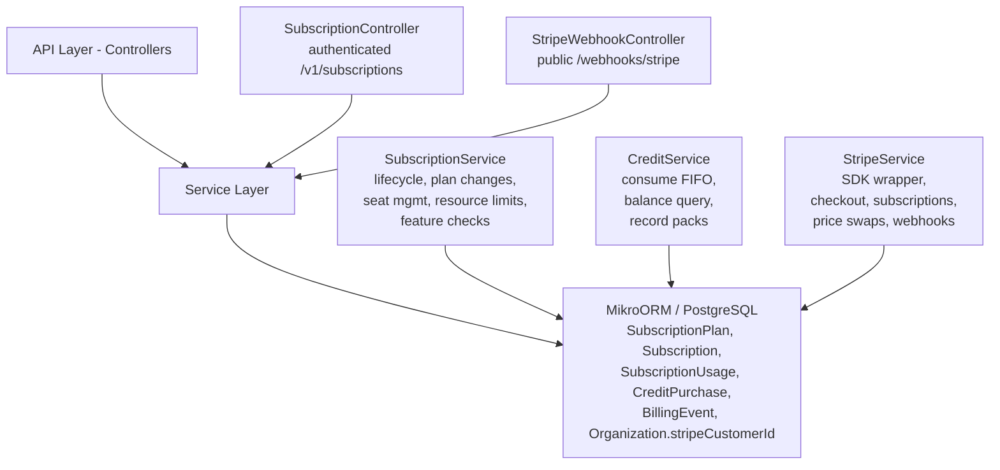
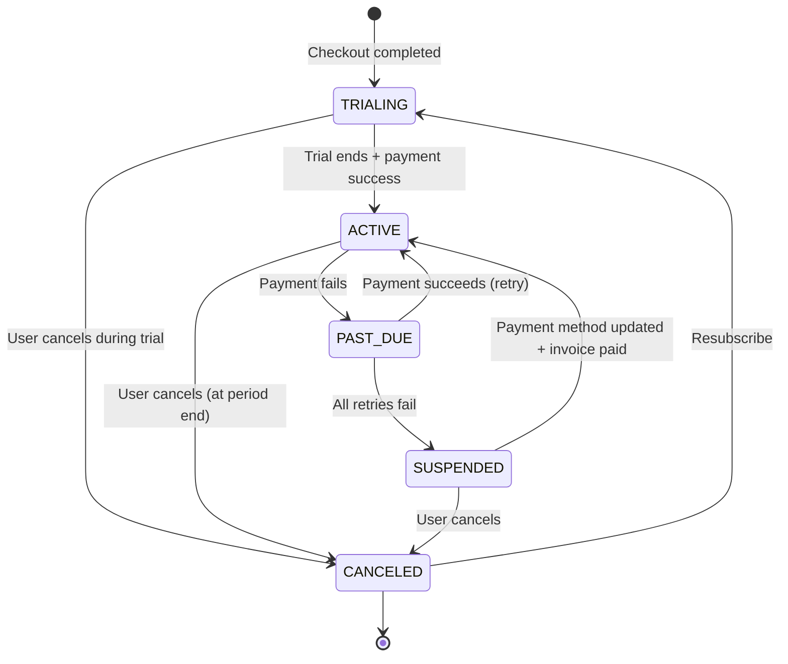

## Overview

The Subscription Module implements a **freemium SaaS billing system** for PropWise CRM. Every organization has a subscription tied to one of **three plan tiers** (Free / Pro / Business — Starter was removed). The module handles:

- **Plan-based feature gating** — binary feature flags per tier
- **Resource limits** — **source-aware** caps on leads, contacts, deals, companies (imports never count), and storage
- **Unified AI-credit wallet** — one credit balance for Propilot, AI auto-reply, and unit valuation, with a per-action cost map, per-user ceilings, and personal credits
- **Single per-agent seat model** — one seat SKU per tier; Pro 5–10 seats (11th → upgrade to Business), Business 10+ with volume pricing
- **Stripe integration** — checkout, subscription management, mid-cycle plan changes, webhooks, billing portal, AED pricing, +25 GB storage packs, credit top-up packs
- **Evergreen 90-day trial** — Pro & Business signups get a card-upfront trial
- **Free organization ownership cap** — one user may own at most 2 active Free-plan organizations
- **Proration** — mid-cycle **tier** changes and seat changes are prorated to the day; **billing cycle** switches (Monthly ↔ Annual) are deferred to period end via Stripe Subscription Schedules
- **Suspension flow** — 2-day grace period on payment failure, then org goes read-only

<Note>
**§18 (Subscription Packaging Rollout)** is the authoritative description of the current Free/Pro/Business AED model, the single-seat collapse, the unified credit wallet, source-aware caps, the evergreen trial, and connection caps. Where earlier sections conflict with §18, **§18 wins**.
</Note>

### Design principles

<AccordionGroup>
  <Accordion title="Freemium model">
    Free plan with limited features; paid tiers unlock progressively
  </Accordion>
  
  <Accordion title="Per-org billing">
    Billing is per organization; developer portal is free
  </Accordion>
  
  <Accordion title="Dual seat types">
    Manager seats (Owner, Admin) and agent seats (Basic, custom roles); every user consumes a seat
  </Accordion>
  
  <Accordion title="Seat type derived from role">
    No explicit seat assignment — seat type is automatically determined by the user's RBAC role
  </Accordion>
  
  <Accordion title="Feature flags over tier checks">
    Gating uses `@RequiresFeature('flag')` on plan JSONB — changing what a tier includes requires only a seeder update, not code changes
  </Accordion>
  
  <Accordion title="Service-layer limit enforcement">
    Resource limits and credit consumption are checked in service methods, not guards, because they need entity counts
  </Accordion>
  
  <Accordion title="Free-org creation protection">
    `POST /v1/organizations` locks the owner row, counts owned Free-plan orgs (missing subscription rows count as Free), and rejects the third active free workspace
  </Accordion>
  
  <Accordion title="Stripe as source of truth for payments">
    Webhook-driven lifecycle: the app reacts to Stripe events rather than polling
  </Accordion>
  
  <Accordion title="Billing cycle vs tier changes">
    **Tier changes** (Free → Pro, Pro → Business) are immediate and prorated. **Billing cycle switches** (Monthly ↔ Annual on same tier) are deferred to period end via Stripe Subscription Schedules with no proration. **Combined changes** (tier + cycle) are immediate and prorated with all line items re-priced atomically
  </Accordion>
  
  <Accordion title="Checkout vs. change-plan separation">
    `POST /checkout` is for first-time subscription (Free → Paid); `POST /change-plan` is for switching between paid tiers
  </Accordion>
  
  <Accordion title="Idempotent webhooks">
    Every Stripe event is logged in `BillingEvent` with a unique `stripeEventId` to prevent duplicate processing
  </Accordion>
  
  <Accordion title="Graceful degradation">
    If `app.stripe.secretKey` (`STRIPE_SECRET_KEY`) is not set, billing features are unavailable but the app still starts
  </Accordion>
</AccordionGroup>

---

## Architecture

### High-level diagram



### Data flows

<Tabs>
  <Tab title="First-time checkout (Free → Paid)">
    <Steps>
      <Step title="Initiate checkout">
        Frontend "Upgrade" button → `POST /v1/subscriptions/checkout`
        
        - Rejects if org already has a Stripe subscription (use change-plan instead)
        - `SubscriptionService.createCheckoutSession()`
        - `StripeService.createCheckoutSession()` returns Stripe Checkout URL
      </Step>
      
      <Step title="User payment">
        User pays on Stripe's hosted page
        
        Stripe redirects to success URL with `session_id={CHECKOUT_SESSION_ID}`
      </Step>
      
      <Step title="Confirm session">
        Frontend → `POST /v1/subscriptions/checkout/confirm { sessionId }`
        
        - `SubscriptionService.fulfillCheckoutSession()` (idempotent with webhook)
        - Subscription entity updated to ACTIVE (plan tier from session metadata)
      </Step>
      
      <Step title="Webhook confirmation">
        Stripe fires `checkout.session.completed` webhook (async)
        
        - `StripeWebhookController` → `activateSubscription()` (same activation path)
      </Step>
    </Steps>
  </Tab>
  
  <Tab title="Mid-cycle plan change (Paid → Paid)">
    <Steps>
      <Step title="Initiate change">
        Frontend "Change Plan" button → `POST /v1/subscriptions/change-plan`
      </Step>
      
      <Step title="Validate and swap">
        `SubscriptionService.changePlan()`
        
        - Validates seat overflow (blocks if current users exceed new plan capacity)
        - `StripeService.swapSubscriptionPrice()` — prorated
        - Reconciles seat line items (old tier price → new tier price)
      </Step>
      
      <Step title="Update subscription">
        Updates local Subscription entity
        
        Returns updated subscription immediately
      </Step>
    </Steps>
  </Tab>
  
  <Tab title="Renewal / payment failure">
    <Steps>
      <Step title="Stripe charges renewal">
        Stripe attempts to charge renewal invoice
      </Step>
      
      <Step title="Success path">
        `invoice.paid` webhook
        
        - `handleInvoicePaid()` → status stays ACTIVE, period updated
      </Step>
      
      <Step title="Failure path">
        `invoice.payment_failed` webhook
        
        - `handleInvoicePaymentFailed()` → status → PAST_DUE
      </Step>
      
      <Step title="Retry period">
        Stripe retries for 2 days
        
        **If payment succeeds:** `invoice.paid` → back to ACTIVE
        
        **If all retries fail:** `customer.subscription.updated` (status: unpaid) → `handleSubscriptionUpdated()` → status → SUSPENDED → Org is read-only
      </Step>
    </Steps>
  </Tab>
</Tabs>

---

## Plan Tiers & Pricing

<Note>
The Starter plan was removed. Current active tiers are **Free**, **Professional**, and **Business**.
</Note>

### Tier comparison

| Feature | **Free** | **Professional** | **Business** |
|---------|----------|------------------|--------------|
| Monthly price | $0 | $149 | $399 |
| Annual price | $0 | $1,430.40 | $3,830.40 |
| Manager seats included | 1 | 5 | 10 |
| Agent seats included | 0 | 0 | 0 |
| Extra manager seat | N/A | $29/month | $39/month |
| Extra agent seat | N/A | N/A | $19/month |
| AI credits/month | 50 | 500 | 2,000 |
| Lead cap | 100 | 5,000 | 50,000 |
| Contact cap | 200 | 10,000 | 100,000 |
| Deal cap | 50 | 2,000 | 20,000 |
| Company cap | 100 | 3,000 | 30,000 |
| Storage | 1 GB | 50 GB | 500 GB |

<Info>
All prices are in USD cents in the database. Annual pricing includes approximately 20% discount.
</Info>

### Seat pricing structure

<CardGroup cols={2}>
  <Card title="Professional tier" icon="crown">
    - 5 manager seats included
    - 5–10 manager seats: $29/month each
    - 11th manager seat triggers Business upgrade prompt
    - No agent seats available
  </Card>
  
  <Card title="Business tier" icon="building">
    - 10 manager seats included
    - 10+ manager seats: $39/month each
    - Agent seats: $19/month each
    - Volume pricing at 10+ seats
  </Card>
</CardGroup>

### Resource limits

<Tabs>
  <Tab title="Source-aware caps">
    **Import exception:** Records created via import **never count** toward caps. This prevents import penalties and allows bulk data migration.
    
    **Manual/API records:** Records created via UI or API do count toward limits.
    
    **Enforcement:** Service-layer checks before creation.
  </Tab>
  
  <Tab title="Storage limits">
    - Free: 1 GB
    - Professional: 50 GB
    - Business: 500 GB
    - **Add-on packs:** +25 GB for AED 99/month
    
    Storage tracks file attachments and document uploads across all modules.
  </Tab>
  
  <Tab title="Connection caps">
    - **Email providers:** Free = 1, Pro = 3, Business = 10
    - **WhatsApp numbers:** Free = 0, Pro = 2, Business = 5
    - **Property portals:** Free = 0, Pro = 3, Business = unlimited
    
    Enforced at connection creation time.
  </Tab>
</Tabs>

---

## Feature Gating Model

### Binary feature flags

Features are stored as JSONB in `SubscriptionPlan.features`:

```json
{
  "basicCRM": true,
  "advancedReporting": false,
  "customFields": false,
  "apiAccess": false,
  "whiteLabel": false,
  "ssoIntegration": false,
  "webhooks": false,
  "advancedAutomations": false,
  "customRoles": false,
  "aiPropilot": true,
  "aiAutoReply": false,
  "unitValuation": false,
  "bulkImport": true,
  "emailIntegration": true,
  "whatsappIntegration": false,
  "propertyPortalSync": false
}
```

### Feature matrix by tier

<AccordionGroup>
  <Accordion title="Free tier features">
    - ✅ Basic CRM
    - ✅ AI Propilot (50 credits/month)
    - ✅ Bulk import
    - ✅ Email integration (1 provider)
    - ❌ Advanced reporting
    - ❌ Custom fields
    - ❌ API access
    - ❌ WhatsApp integration
  </Accordion>
  
  <Accordion title="Professional tier features">
    - ✅ All Free features
    - ✅ Advanced reporting
    - ✅ Custom fields
    - ✅ API access
    - ✅ WhatsApp integration (2 numbers)
    - ✅ Property portal sync (3 portals)
    - ✅ Webhooks
    - ✅ Advanced automations
    - ✅ AI auto-reply (500 credits/month)
    - ❌ White label
    - ❌ SSO integration
    - ❌ Custom roles
  </Accordion>
  
  <Accordion title="Business tier features">
    - ✅ All Professional features
    - ✅ White label
    - ✅ SSO integration
    - ✅ Custom roles
    - ✅ Unit valuation (2,000 credits/month)
    - ✅ Unlimited property portals
    - ✅ WhatsApp (5 numbers)
    - ✅ Priority support
  </Accordion>
</AccordionGroup>

### Guard implementation

Use the `@RequiresFeature()` decorator on controller endpoints:

<CodeGroup>
```typescript Controller
@Post('custom-fields')
@RequiresFeature('customFields')
async createCustomField(@Body() dto: CreateCustomFieldDto) {
  // Only accessible if org's plan has customFields: true
  return this.customFieldService.create(dto);
}
```

```typescript Guard
@Injectable()
export class FeatureGuard implements CanActivate {
  async canActivate(context: ExecutionContext): Promise<boolean> {
    const requiredFeature = this.reflector.get<string>(
      'feature',
      context.getHandler(),
    );
    
    if (!requiredFeature) return true;
    
    const request = context.switchToHttp().getRequest();
    const subscription = await this.getOrgSubscription(request.user.orgId);
    
    return subscription.plan.features[requiredFeature] === true;
  }
}
```
</CodeGroup>

<Warning>
Feature checks happen **before** service-layer logic. If a feature is disabled, the request is rejected with `403 Forbidden` before any business logic executes.
</Warning>

---

## Seat Management

### Seat types

<Tabs>
  <Tab title="Manager seats">
    **Roles:** Owner, Admin
    
    **Permissions:**
    - Full CRM access
    - User management
    - Billing management
    - Organization settings
    - All features
    
    **Pricing:**
    - Pro: $29/month (beyond 5 included)
    - Business: $39/month (beyond 10 included)
  </Tab>
  
  <Tab title="Agent seats">
    **Roles:** Basic, custom roles (Business only)
    
    **Permissions:**
    - CRM access
    - Limited settings
    - No billing access
    - No user management
    
    **Pricing:**
    - Only available on Business tier
    - $19/month per agent
    
    <Info>Agent seats are a Business-tier exclusive feature.</Info>
  </Tab>
</Tabs>

### Automatic seat type assignment

Seats are **not explicitly assigned**. The system derives seat type from RBAC role:

<Steps>
  <Step title="User invitation">
    Admin invites user with a role (Owner, Admin, Basic, or custom)
  </Step>
  
  <Step title="Seat type determination">
    System checks role:
    - Owner/Admin → Manager seat
    - Basic/custom → Agent seat
  </Step>
  
  <Step title="Capacity check">
    Service validates against plan limits:
    ```typescript
    const managerCount = await this.countManagerSeats(orgId);
    const agentCount = await this.countAgentSeats(orgId);
    
    if (isManager && managerCount >= plan.managerSeatsIncluded + extraSeats) {
      throw new ForbiddenException('Manager seat limit reached');
    }
    ```
  </Step>
  
  <Step title="Stripe sync">
    If adding a billable seat, update Stripe subscription item quantity
  </Step>
</Steps>

### Seat overflow prevention

<Warning>
**Plan changes are blocked if new tier cannot accommodate current users.**
</Warning>

Example: Pro plan with 8 manager seats cannot downgrade to Free (1 manager seat limit) until users are removed.

```typescript
async validateSeatCapacity(orgId: string, newPlanId: string) {
  const currentCounts = await this.getSeatCounts(orgId);
  const newPlan = await this.planRepo.findOne(newPlanId);
  
  if (currentCounts.managers > newPlan.managerSeatsIncluded) {
    throw new ForbiddenException(
      `New plan allows ${newPlan.managerSeatsIncluded} manager seats, ` +
      `but you have ${currentCounts.managers}. Remove users first.`
    );
  }
  
  if (currentCounts.agents > 0 && newPlan.slug !== 'business') {
    throw new ForbiddenException(
      'Agent seats are only available on Business tier'
    );
  }
}
```

---

## Credit System

### Unified credit wallet

<Info>
**One credit balance per organization** for all AI features: Propilot, AI auto-reply, and unit valuation.
</Info>

### Credit sources

<Tabs>
  <Tab title="Monthly allocation">
    Included credits per tier (reset monthly):
    
    - Free: 50 credits
    - Professional: 500 credits
    - Business: 2,000 credits
    
    **Reset behavior:** Credits reset on the subscription billing date (not calendar month).
  </Tab>
  
  <Tab title="Top-up packs">
    Available credit packs:
    
    | Pack size | Price (AED) | Cost per credit |
    |-----------|-------------|-----------------|
    | 500 credits | 199 | 0.398 |
    | 1,000 credits | 349 | 0.349 |
    | 2,500 credits | 799 | 0.320 |
    
    **Expiry:** Purchased credits expire 12 months from purchase date.
  </Tab>
  
  <Tab title="Personal credits">
    Users can purchase credits for **personal use only** (not org-wide):
    
    - Same pack sizes and pricing
    - Non-transferable
    - Deducted after org credits
    - Expire 12 months from purchase
  </Tab>
</Tabs>

### Credit consumption

<AccordionGroup>
  <Accordion title="Per-action costs">
    | Action | Credit cost |
    |--------|-------------|
    | Propilot query | 1 credit |
    | AI auto-reply (email) | 2 credits |
    | AI auto-reply (WhatsApp) | 2 credits |
    | Unit valuation | 5 credits |
    | Property description AI | 3 credits |
  </Accordion>
  
  <Accordion title="Per-user ceilings">
    **Daily limits per user:**
    - Free tier: 10 AI actions/day
    - Pro tier: 50 AI actions/day
    - Business tier: 200 AI actions/day
    
    Prevents single user from exhausting org credits.
  </Accordion>
  
  <Accordion title="FIFO consumption order">
    Credits are consumed in this order:
    1. Monthly allocation (oldest first)
    2. Purchased org credits (oldest first)
    3. Personal credits (oldest first)
    
    ```typescript
    async consumeCredits(orgId: string, userId: string, amount: number) {
      // 1. Try monthly allocation
      const subscription = await this.getSubscription(orgId);
      if (subscription.creditsRemaining >= amount) {
        subscription.creditsRemaining -= amount;
        await this.em.flush();
        return;
      }
      
      // 2. Try purchased credits (FIFO)
      const purchases = await this.creditPurchaseRepo.find(
        { org: orgId, creditsRemaining: { $gt: 0 }, expiresAt: { $gt: new Date() } },
        { orderBy: { purchasedAt: 'ASC' } }
      );
      
      let remaining = amount;
      for (const purchase of purchases) {
        const deduct = Math.min(purchase.creditsRemaining, remaining);
        purchase.creditsRemaining -= deduct;
        remaining -= deduct;
        if (remaining === 0) break;
      }
      
      if (remaining > 0) {
        throw new ForbiddenException('Insufficient credits');
      }
      
      await this.em.flush();
    }
    ```
  </Accordion>
</AccordionGroup>

---

## Entity Specifications

### SubscriptionPlan entity

<CodeGroup>
```typescript Entity
@Entity()
export class SubscriptionPlan {
  @PrimaryKey()
  id: string;

  @Property()
  name: string; // "Free", "Professional", "Business"

  @Property()
  slug: string; // "free", "professional", "business"

  @Property()
  description: string;

  @Property()
  monthlyPriceCents: number; // USD cents

  @Property()
  annualPriceCents: number; // USD cents, ~20% off

  @Property()
  managerSeatsIncluded: number; // 1, 5, 10

  @Property()
  agentSeatsIncluded: number; // Always 0

  @Property()
  extraManagerSeatPriceCents: number; // 2900, 3900

  @Property()
  extraAgentSeatPriceCents: number; // 1900 (Business only)

  @Property()
  aiCreditsMonthly: number; // 50, 500, 2000

  @Property()
  leadCap: number; // 100, 5000, 50000

  @Property()
  contactCap: number; // 200, 10000, 100000

  @Property()
  dealCap: number; // 50, 2000, 20000

  @Property()
  companyCap: number; // 100, 3000, 30000

  @Property()
  storageGB: number; // 1, 50, 500

  @Property({ type: 'jsonb' })
  features: Record<string, boolean>;

  @Property()
  stripePriceIdMonthly?: string; // Stripe Price ID for monthly billing

  @Property()
  stripePriceIdAnnual?: string; // Stripe Price ID for annual billing

  @Property()
  isActive: boolean = true;

  @Property()
  createdAt: Date = new Date();

  @Property({ onUpdate: () => new Date() })
  updatedAt: Date = new Date();
}
```

```sql Migration
CREATE TABLE subscription_plan (
  id UUID PRIMARY KEY DEFAULT gen_random_uuid(),
  name VARCHAR(100) NOT NULL,
  slug VARCHAR(50) NOT NULL UNIQUE,
  description TEXT,
  monthly_price_cents INTEGER NOT NULL,
  annual_price_cents INTEGER NOT NULL,
  manager_seats_included INTEGER NOT NULL,
  agent_seats_included INTEGER NOT NULL DEFAULT 0,
  extra_manager_seat_price_cents INTEGER,
  extra_agent_seat_price_cents INTEGER,
  ai_credits_monthly INTEGER NOT NULL,
  lead_cap INTEGER NOT NULL,
  contact_cap INTEGER NOT NULL,
  deal_cap INTEGER NOT NULL,
  company_cap INTEGER NOT NULL,
  storage_gb INTEGER NOT NULL,
  features JSONB NOT NULL DEFAULT '{}',
  stripe_price_id_monthly VARCHAR(255),
  stripe_price_id_annual VARCHAR(255),
  is_active BOOLEAN NOT NULL DEFAULT TRUE,
  created_at TIMESTAMP NOT NULL DEFAULT NOW(),
  updated_at TIMESTAMP NOT NULL DEFAULT NOW()
);

CREATE INDEX idx_subscription_plan_slug ON subscription_plan(slug);
CREATE INDEX idx_subscription_plan_active ON subscription_plan(is_active);
```
</CodeGroup>

### Subscription entity

<CodeGroup>
```typescript Entity
@Entity()
export class Subscription {
  @PrimaryKey()
  id: string;

  @ManyToOne(() => Organization)
  organization: Organization;

  @ManyToOne(() => SubscriptionPlan)
  plan: SubscriptionPlan;

  @Enum(() => SubscriptionStatus)
  status: SubscriptionStatus; // ACTIVE, PAST_DUE, SUSPENDED, CANCELED, TRIALING

  @Enum(() => BillingCycle)
  billingCycle: BillingCycle; // MONTHLY, ANNUAL

  @Property()
  currentPeriodStart: Date;

  @Property()
  currentPeriodEnd: Date;

  @Property()
  trialEndsAt?: Date; // 90-day evergreen trial

  @Property()
  creditsRemaining: number; // Monthly allocation balance

  @Property()
  creditsResetAt: Date; // Next credit reset date

  @Property()
  extraManagerSeats: number = 0;

  @Property()
  extraAgentSeats: number = 0;

  @Property()
  stripeSubscriptionId?: string;

  @Property()
  stripeCustomerId?: string;

  @Property()
  cancelAtPeriodEnd: boolean = false;

  @Property()
  canceledAt?: Date;

  @Property()
  createdAt: Date = new Date();

  @Property({ onUpdate: () => new Date() })
  updatedAt: Date = new Date();
}
```

```sql Migration
CREATE TYPE subscription_status AS ENUM (
  'ACTIVE',
  'PAST_DUE',
  'SUSPENDED',
  'CANCELED',
  'TRIALING'
);

CREATE TYPE billing_cycle AS ENUM ('MONTHLY', 'ANNUAL');

CREATE TABLE subscription (
  id UUID PRIMARY KEY DEFAULT gen_random_uuid(),
  organization_id UUID NOT NULL REFERENCES organization(id) ON DELETE CASCADE,
  plan_id UUID NOT NULL REFERENCES subscription_plan(id),
  status subscription_status NOT NULL DEFAULT 'ACTIVE',
  billing_cycle billing_cycle NOT NULL DEFAULT 'MONTHLY',
  current_period_start TIMESTAMP NOT NULL,
  current_period_end TIMESTAMP NOT NULL,
  trial_ends_at TIMESTAMP,
  credits_remaining INTEGER NOT NULL DEFAULT 0,
  credits_reset_at TIMESTAMP NOT NULL,
  extra_manager_seats INTEGER NOT NULL DEFAULT 0,
  extra_agent_seats INTEGER NOT NULL DEFAULT 0,
  stripe_subscription_id VARCHAR(255),
  stripe_customer_id VARCHAR(255),
  cancel_at_period_end BOOLEAN NOT NULL DEFAULT FALSE,
  canceled_at TIMESTAMP,
  created_at TIMESTAMP NOT NULL DEFAULT NOW(),
  updated_at TIMESTAMP NOT NULL DEFAULT NOW()
);

CREATE UNIQUE INDEX idx_subscription_org ON subscription(organization_id);
CREATE INDEX idx_subscription_stripe ON subscription(stripe_subscription_id);
CREATE INDEX idx_subscription_status ON subscription(status);
```
</CodeGroup>

### CreditPurchase entity

<CodeGroup>
```typescript Entity
@Entity()
export class CreditPurchase {
  @PrimaryKey()
  id: string;

  @ManyToOne(() => Organization, { nullable: true })
  organization?: Organization; // Null if personal purchase

  @ManyToOne(() => User)
  purchasedBy: User;

  @Property()
  creditsAmount: number; // Total credits in pack

  @Property()
  creditsRemaining: number; // Unconsumed balance

  @Property()
  priceAED: number; // Price in AED cents

  @Property()
  stripePaymentIntentId: string;

  @Property()
  purchasedAt: Date = new Date();

  @Property()
  expiresAt: Date; // 12 months from purchase

  @Property()
  isPersonal: boolean = false; // True if user's personal credit

  @Property()
  createdAt: Date = new Date();
}
```

```sql Migration
CREATE TABLE credit_purchase (
  id UUID PRIMARY KEY DEFAULT gen_random_uuid(),
  organization_id UUID REFERENCES organization(id) ON DELETE SET NULL,
  purchased_by_id UUID NOT NULL REFERENCES "user"(id),
  credits_amount INTEGER NOT NULL,
  credits_remaining INTEGER NOT NULL,
  price_aed INTEGER NOT NULL,
  stripe_payment_intent_id VARCHAR(255) NOT NULL,
  purchased_at TIMESTAMP NOT NULL DEFAULT NOW(),
  expires_at TIMESTAMP NOT NULL,
  is_personal BOOLEAN NOT NULL DEFAULT FALSE,
  created_at TIMESTAMP NOT NULL DEFAULT NOW()
);

CREATE INDEX idx_credit_purchase_org ON credit_purchase(organization_id);
CREATE INDEX idx_credit_purchase_user ON credit_purchase(purchased_by_id);
CREATE INDEX idx_credit_purchase_expires ON credit_purchase(expires_at);
```
</CodeGroup>

### BillingEvent entity

<CodeGroup>
```typescript Entity
@Entity()
export class BillingEvent {
  @PrimaryKey()
  id: string;

  @ManyToOne(() => Organization)
  organization: Organization;

  @Property()
  stripeEventId: string; // Unique Stripe event ID for idempotency

  @Enum(() => BillingEventType)
  eventType: BillingEventType;

  @Property({ type: 'jsonb' })
  eventData: any; // Full Stripe event payload

  @Property()
  processedAt: Date = new Date();

  @Property()
  createdAt: Date = new Date();
}
```

```sql Migration
CREATE TYPE billing_event_type AS ENUM (
  'CHECKOUT_COMPLETED',
  'INVOICE_PAID',
  'INVOICE_PAYMENT_FAILED',
  'SUBSCRIPTION_UPDATED',
  'SUBSCRIPTION_DELETED',
  'PAYMENT_METHOD_ATTACHED',
  'CUSTOMER_CREATED'
);

CREATE TABLE billing_event (
  id UUID PRIMARY KEY DEFAULT gen_random_uuid(),
  organization_id UUID NOT NULL REFERENCES organization(id) ON DELETE CASCADE,
  stripe_event_id VARCHAR(255) NOT NULL UNIQUE,
  event_type billing_event_type NOT NULL,
  event_data JSONB NOT NULL,
  processed_at TIMESTAMP NOT NULL DEFAULT NOW(),
  created_at TIMESTAMP NOT NULL DEFAULT NOW()
);

CREATE INDEX idx_billing_event_org ON billing_event(organization_id);
CREATE INDEX idx_billing_event_stripe ON billing_event(stripe_event_id);
CREATE INDEX idx_billing_event_type ON billing_event(event_type);
```
</CodeGroup>

---

## Stripe Integration

### Configuration

<CodeGroup>
```typescript Config
export default registerAs('stripe', () => ({
  secretKey: process.env.STRIPE_SECRET_KEY, // sk_test_... or sk_live_...
  webhookSecret: process.env.STRIPE_WEBHOOK_SECRET, // whsec_...
  publishableKey: process.env.STRIPE_PUBLISHABLE_KEY, // pk_test_... or pk_live_...
  currency: 'aed',
  successUrl: process.env.FRONTEND_URL + '/billing/success',
  cancelUrl: process.env.FRONTEND_URL + '/billing/cancel',
}));
```

```bash .env
STRIPE_SECRET_KEY=sk_test_51...
STRIPE_WEBHOOK_SECRET=whsec_...
STRIPE_PUBLISHABLE_KEY=pk_test_...
FRONTEND_URL=https://app.propwise.ae
```
</CodeGroup>

<Warning>
If `STRIPE_SECRET_KEY` is not set, the module starts but all billing endpoints return `503 Service Unavailable`.
</Warning>

### Stripe product mapping

Each plan tier has two Stripe Price objects (monthly and annual):

| Plan | Stripe Product | Monthly Price ID | Annual Price ID |
|------|----------------|------------------|-----------------|
| Professional | `prod_Professional` | `price_ProMonthly` | `price_ProAnnual` |
| Business | `prod_Business` | `price_BizMonthly` | `price_BizAnnual` |

**Seat prices** (extra manager/agent seats) are also Stripe Prices attached to the same Product.

### Checkout session creation

<CodeGroup>
```typescript Service
async createCheckoutSession(
  orgId: string,
  planSlug: string,
  billingCycle: BillingCycle,
  managerSeats: number,
  agentSeats: number = 0
): Promise<string> {
  const org = await this.orgRepo.findOne(orgId);
  const plan = await this.planRepo.findOne({ slug: planSlug });

  if (org.stripeCustomerId) {
    throw new BadRequestException(
      'Organization already has a Stripe subscription. Use change-plan instead.'
    );
  }

  const priceId = billingCycle === BillingCycle.MONTHLY
    ? plan.stripePriceIdMonthly
    : plan.stripePriceIdAnnual;

  const lineItems: Stripe.Checkout.SessionCreateParams.LineItem[] = [
    {
      price: priceId,
      quantity: 1, // Base plan
    },
  ];

  // Extra manager seats
  if (managerSeats > plan.managerSeatsIncluded) {
    const extraSeats = managerSeats - plan.managerSeatsIncluded;
    lineItems.push({
      price: plan.stripeExtraManagerSeatPriceId,
      quantity: extraSeats,
    });
  }

  // Agent seats (Business only)
  if (agentSeats > 0 && plan.slug === 'business') {
    lineItems.push({
      price: plan.stripeExtraAgentSeatPriceId,
      quantity: agentSeats,
    });
  }

  const session = await this.stripe.checkout.sessions.create({
    mode: 'subscription',
    customer_email: org.ownerEmail,
    line_items: lineItems,
    success_url: this.config.successUrl + '?session_id={CHECKOUT_SESSION_ID}',
    cancel_url: this.config.cancelUrl,
    subscription_data: {
      trial_period_days: 90, // Evergreen trial
      metadata: {
        orgId,
        planId: plan.id,
        billingCycle,
      },
    },
  });

  return session.url;
}
```

```typescript Controller
@Post('checkout')
@UseGuards(JwtAuthGuard, RoleGuard)
@Roles('Owner', 'Admin')
async createCheckout(@Body() dto: CreateCheckoutDto, @Req() req) {
  const checkoutUrl = await this.subscriptionService.createCheckoutSession(
    req.user.orgId,
    dto.planSlug,
    dto.billingCycle,
    dto.managerSeats,
    dto.agentSeats
  );

  return { checkoutUrl };
}
```
</CodeGroup>

### Webhook handling

<Steps>
  <Step title="Configure webhook endpoint">
    In Stripe Dashboard, add webhook endpoint:
    ```
    https://api.propwise.ae/webhooks/stripe
    ```
    
    Select events:
    - `checkout.session.completed`
    - `invoice.paid`
    - `invoice.payment_failed`
    - `customer.subscription.updated`
    - `customer.subscription.deleted`
  </Step>
  
  <Step title="Verify webhook signature">
    ```typescript
    @Post('stripe')
    async handleStripeWebhook(@Req() req, @Headers('stripe-signature') sig: string) {
      const event = this.stripe.webhooks.constructEvent(
        req.rawBody,
        sig,
        this.config.webhookSecret
      );

      // Process event...
    }
    ```
  </Step>
  
  <Step title="Idempotent processing">
    Check if event already processed:
    ```typescript
    const existing = await this.billingEventRepo.findOne({
      stripeEventId: event.id
    });

    if (existing) {
      this.logger.log(`Event ${event.id} already processed`);
      return { received: true };
    }
    ```
  </Step>
  
  <Step title="Route to handler">
    ```typescript
    switch (event.type) {
      case 'checkout.session.completed':
        await this.handleCheckoutCompleted(event);
        break;
      case 'invoice.paid':
        await this.handleInvoicePaid(event);
        break;
      case 'invoice.payment_failed':
        await this.handlePaymentFailed(event);
        break;
      // ...
    }
    ```
  </Step>
  
  <Step title="Log event">
    ```typescript
    const billingEvent = this.billingEventRepo.create({
      organization: orgId,
      stripeEventId: event.id,
      eventType: BillingEventType.CHECKOUT_COMPLETED,
      eventData: event,
    });

    await this.em.persistAndFlush(billingEvent);
    ```
  </Step>
</Steps>

---

## Subscription Lifecycle

### Lifecycle states

<Tabs>
  <Tab title="TRIALING">
    **Duration:** 90 days from checkout
    
    **Behavior:**
    - Full plan features unlocked
    - No charge until trial ends
    - Card on file required
    - Can cancel anytime
    
    **Transition:**
    - Trial ends → Stripe charges first invoice → ACTIVE
    - User cancels → CANCELED
  </Tab>
  
  <Tab title="ACTIVE">
    **Duration:** Indefinite (while payments succeed)
    
    **Behavior:**
    - All plan features available
    - Automatic renewal on billing cycle
    - Can upgrade/downgrade
    - Can cancel (takes effect at period end)
    
    **Transition:**
    - Payment fails → PAST_DUE
    - User cancels → CANCELED (at period end)
  </Tab>
  
  <Tab title="PAST_DUE">
    **Duration:** 2 days (Stripe retry window)
    
    **Behavior:**
    - Features still accessible (grace period)
    - Stripe retries payment
    - User notified via email
    
    **Transition:**
    - Payment succeeds → ACTIVE
    - All retries fail → SUSPENDED
  </Tab>
  
  <Tab title="SUSPENDED">
    **Duration:** Until payment or cancellation
    
    **Behavior:**
    - **Read-only mode:** Users can view data but cannot create/edit
    - All write endpoints blocked by `SubscriptionActiveGuard`
    - AI features disabled
    - Webhooks paused
    
    **Transition:**
    - User updates payment method + invoice paid → ACTIVE
    - User cancels → CANCELED
  </Tab>
  
  <Tab title="CANCELED">
    **Duration:** Permanent (until resubscribe)
    
    **Behavior:**
    - Downgraded to Free plan
    - Data retained (read-only)
    - Can resubscribe at any time
    
    **Transition:**
    - User resubscribes → New checkout → TRIALING/ACTIVE
  </Tab>
</Tabs>

### State transition diagram



---

## Plan Changes (Upgrade / Downgrade)

### Change types

<CardGroup cols={2}>
  <Card title="Tier change" icon="arrow-up">
    **Free → Pro, Pro → Business, etc.**
    
    - Immediate effect
    - Prorated to the day
    - Preserves billing cycle
    - Reconciles all line items
  </Card>
  
  <Card title="Billing cycle switch" icon="calendar">
    **Monthly ↔ Annual**
    
    - Deferred to period end
    - Uses Stripe Subscription Schedules
    - No proration
    - Next invoice reflects new cycle
  </Card>
  
  <Card title="Combined change" icon="arrows-rotate">
    **Tier + cycle together**
    
    - Immediate effect
    - Prorated
    - All line items re-priced atomically
  </Card>
  
  <Card title="Seat adjustment" icon="users">
    **Add/remove seats**
    
    - Immediate effect
    - Prorated
    - Validates capacity before change
  </Card>
</CardGroup>

### Tier change implementation

<CodeGroup>
```typescript Service
async changePlan(
  orgId: string,
  newPlanSlug: string,
  newBillingCycle?: BillingCycle
): Promise<Subscription> {
  const subscription = await this.getOrgSubscription(orgId);
  const newPlan = await this.planRepo.findOne({ slug: newPlanSlug });

  // Validate seat capacity
  await this.validateSeatCapacity(orgId, newPlan.id);

  const newPriceId = newBillingCycle === BillingCycle.ANNUAL
    ? newPlan.stripePriceIdAnnual
    : newPlan.stripePriceIdMonthly;

  // Update Stripe subscription
  await this.stripe.subscriptions.update(subscription.stripeSubscriptionId, {
    items: [
      {
        id: subscription.stripeItemId,
        price: newPriceId,
      },
    ],
    proration_behavior: 'always_invoice', // Immediate proration
  });

  // Update local subscription
  subscription.plan = newPlan;
  subscription.billingCycle = newBillingCycle || subscription.billingCycle;
  subscription.creditsRemaining = newPlan.aiCreditsMonthly; // Reset credits
  subscription.creditsResetAt = new Date(subscription.currentPeriodEnd);

  await this.em.flush();

  return subscription;
}
```

```typescript Controller
@Post('change-plan')
@UseGuards(JwtAuthGuard, RoleGuard)
@Roles('Owner')
async changePlan(@Body() dto: ChangePlanDto, @Req() req) {
  const subscription = await this.subscriptionService.changePlan(
    req.user.orgId,
    dto.planSlug,
    dto.billingCycle
  );

  return { subscription };
}
```
</CodeGroup>

### Billing cycle switch (deferred)

<Info>
Billing cycle changes (Monthly ↔ Annual) on the **same tier** are deferred to the next billing period using Stripe Subscription Schedules.
</Info>

<CodeGroup>
```typescript Service
async scheduleBillingCycleChange(
  orgId: string,
  newBillingCycle: BillingCycle
): Promise<void> {
  const subscription = await this.getOrgSubscription(orgId);
  const plan = subscription.plan;

  const newPriceId = newBillingCycle === BillingCycle.ANNUAL
    ? plan.stripePriceIdAnnual
    : plan.stripePriceIdMonthly;

  // Create subscription schedule
  await this.stripe.subscriptionSchedules.create({
    from_subscription: subscription.stripeSubscriptionId,
    phases: [
      {
        items: [{ price: newPriceId, quantity: 1 }],
        start_date: subscription.currentPeriodEnd,
      },
    ],
  });

  this.logger.log(
    `Scheduled billing cycle change to ${newBillingCycle} at period end for org ${orgId}`
  );
}
```
</CodeGroup>

### Proration examples

<AccordionGroup>
  <Accordion title="Upgrade Pro → Business (mid-cycle)">
    **Scenario:** 15 days into a 30-day Pro Monthly cycle ($149)
    
    **Calculation:**
    - Unused Pro time: 15 days × ($149 / 30) = $74.50 credit
    - Business charge: 30 days × ($399 / 30) = $399
    - **Prorated invoice:** $399 - $74.50 = **$324.50**
    
    **Stripe behavior:** Immediate invoice generated and charged.
  </Accordion>
  
  <Accordion title="Add 3 manager seats (mid-cycle)">
    **Scenario:** 10 days into a 30-day Business Monthly cycle
    
    **Calculation:**
    - Remaining period: 20 days
    - Per-seat cost: $39/month
    - **Prorated charge:** 3 × $39 × (20/30) = **$78**
    
    **Stripe behavior:** Immediate invoice for prorated amount.
  </Accordion>
  
  <Accordion title="Switch Monthly → Annual (deferred)">
    **Scenario:** Pro Monthly ($149) wants to switch to Annual ($1,430.40)
    
    **Calculation:**
    - No immediate charge
    - Subscription continues at $149/month until period end
    - At period end, Stripe charges $1,430.40 for annual period
    
    **Stripe behavior:** Subscription Schedule created, no invoice until period end.
  </Accordion>
</AccordionGroup>

---

## API Endpoints

### Subscription management

<CodeGroup>
```http GET /v1/subscriptions
GET /v1/subscriptions
Authorization: Bearer <jwt>

# Response
{
  "subscription": {
    "id": "uuid",
    "plan": {
      "name": "Professional",
      "slug": "professional",
      "features": { ... }
    },
    "status": "ACTIVE",
    "billingCycle": "MONTHLY",
    "currentPeriodEnd": "2024-03-15T00:00:00Z",
    "creditsRemaining": 423,
    "extraManagerSeats": 2,
    "extraAgentSeats": 0
  }
}
```

```http POST /v1/subscriptions/checkout
POST /v1/subscriptions/checkout
Authorization: Bearer <jwt>
Content-Type: application/json

{
  "planSlug": "professional",
  "billingCycle": "MONTHLY",
  "managerSeats": 7,
  "agentSeats": 0
}

# Response
{
  "checkoutUrl": "https://checkout.stripe.com/c/pay/cs_test_..."
}
```

```http POST /v1/subscriptions/checkout/confirm
POST /v1/subscriptions/checkout/confirm
Authorization: Bearer <jwt>
Content-Type: application/json

{
  "sessionId": "cs_test_..."
}

# Response
{
  "subscription": {
    "id": "uuid",
    "status": "TRIALING",
    "trialEndsAt": "2024-06-15T00:00:00Z",
    ...
  }
}
```

```http POST /v1/subscriptions/change-plan
POST /v1/subscriptions/change-plan
Authorization: Bearer <jwt>
Content-Type: application/json

{
  "planSlug": "business",
  "billingCycle": "ANNUAL"
}

# Response
{
  "subscription": {
    "id": "uuid",
    "plan": { "name": "Business", ... },
    "status": "ACTIVE",
    ...
  }
}
```
</CodeGroup>

### Credit management

<CodeGroup>
```http GET /v1/subscriptions/credits
GET /v1/subscriptions/credits
Authorization: Bearer <jwt>

# Response
{
  "creditsRemaining": 423,
  "creditsResetAt": "2024-04-01T00:00:00Z",
  "purchasedPacks": [
    {
      "id": "uuid",
      "creditsAmount": 1000,
      "creditsRemaining": 850,
      "expiresAt": "2025-03-15T00:00:00Z"
    }
  ],
  "monthlyAllocation": 500
}
```

```http POST /v1/subscriptions/credits/purchase
POST /v1/subscriptions/credits/purchase
Authorization: Bearer <jwt>
Content-Type: application/json

{
  "packSize": 1000,
  "isPersonal": false
}

# Response
{
  "checkoutUrl": "https://checkout.stripe.com/c/pay/cs_test_..."
}
```

```http POST /v1/subscriptions/credits/consume
POST /v1/subscriptions/credits/consume
Authorization: Bearer <jwt>
Content-Type: application/json

{
  "amount": 5,
  "action": "unitValuation"
}

# Response
{
  "success": true,
  "creditsRemaining": 418
}
```
</CodeGroup>

### Seat management

<CodeGroup>
```http GET /v1/subscriptions/seats
GET /v1/subscriptions/seats
Authorization: Bearer <jwt>

# Response
{
  "managerSeats": {
    "included": 5,
    "extra": 2,
    "total": 7,
    "used": 6
  },
  "agentSeats": {
    "included": 0,
    "extra": 0,
    "total": 0,
    "used": 0
  }
}
```

```http POST /v1/subscriptions/seats
POST /v1/subscriptions/seats
Authorization: Bearer <jwt>
Content-Type: application/json

{
  "managerSeats": 8,
  "agentSeats": 0
}

# Response
{
  "subscription": {
    "extraManagerSeats": 3,
    "extraAgentSeats": 0,
    ...
  }
}
```
</CodeGroup>

### Billing portal

<CodeGroup>
```http GET /v1/subscriptions/portal
GET /v1/subscriptions/portal
Authorization: Bearer <jwt>

# Response
{
  "portalUrl": "https://billing.stripe.com/p/session/..."
}
```
</CodeGroup>

<Info>
The billing portal allows users to update payment methods, view invoices, and manage subscriptions directly on Stripe's hosted UI.
</Info>

---

## Guards & Decorators

### RequiresFeature decorator

<CodeGroup>
```typescript Decorator
export const RequiresFeature = (feature: string) =>
  SetMetadata('feature', feature);
```

```typescript Usage
@Post('custom-fields')
@RequiresFeature('customFields')
@UseGuards(JwtAuthGuard, FeatureGuard)
async createCustomField(@Body() dto: CreateCustomFieldDto) {
  return this.customFieldService.create(dto);
}
```
</CodeGroup>

### FeatureGuard

<CodeGroup>
```typescript Guard
@Injectable()
export class FeatureGuard implements CanActivate {
  constructor(
    private reflector: Reflector,
    private subscriptionService: SubscriptionService,
  ) {}

  async canActivate(context: ExecutionContext): Promise<boolean> {
    const requiredFeature = this.reflector.get<string>(
      'feature',
      context.getHandler(),
    );

    if (!requiredFeature) {
      return true; // No feature requirement
    }

    const request = context.switchToHttp().getRequest();
    const orgId = request.user?.orgId;

    if (!orgId) {
      throw new UnauthorizedException('Organization context required');
    }

    const subscription = await this.subscriptionService.getOrgSubscription(orgId);

    if (!subscription.plan.features[requiredFeature]) {
      throw new ForbiddenException(
        `Feature "${requiredFeature}" is not available on your plan. ` +
        `Upgrade to access this feature.`
      );
    }

    return true;
  }
}
```
</CodeGroup>

### SubscriptionActiveGuard

<Check>
Blocks write operations when subscription is SUSPENDED or CANCELED.
</Check>

<CodeGroup>
```typescript Guard
@Injectable()
export class SubscriptionActiveGuard implements CanActivate {
  constructor(private subscriptionService: SubscriptionService) {}

  async canActivate(context: ExecutionContext): Promise<boolean> {
    const request = context.switchToHttp().getRequest();
    const orgId = request.user?.orgId;

    if (!orgId) {
      return true; // Skip for non-org contexts
    }

    const subscription = await this.subscriptionService.getOrgSubscription(orgId);

    if (subscription.status === SubscriptionStatus.SUSPENDED) {
      throw new ForbiddenException(
        'Your subscription is suspended due to payment failure. ' +
        'Please update your payment method to restore access.'
      );
    }

    if (subscription.status === SubscriptionStatus.CANCELED) {
      throw new ForbiddenException(
        'Your subscription has been canceled. ' +
        'Resubscribe to continue using this feature.'
      );
    }

    return true;
  }
}
```

```typescript Usage
@Post('leads')
@UseGuards(JwtAuthGuard, SubscriptionActiveGuard)
async createLead(@Body() dto: CreateLeadDto) {
  // Only accessible if subscription is ACTIVE, TRIALING, or PAST_DUE
  return this.leadService.create(dto);
}
```
</CodeGroup>

---

## Enforcement Points

### Resource limit checks

<Warning>
Resource limits are enforced in **service methods**, not guards, because they require entity counts.
</Warning>

<CodeGroup>
```typescript Lead Service
async create(orgId: string, dto: CreateLeadDto) {
  // Check if import (exempt from cap)
  if (dto.source !== 'import') {
    const subscription = await this.subscriptionService.getOrgSubscription(orgId);
    const currentCount = await this.leadRepo.count({ organization: orgId });

    if (currentCount >= subscription.plan.leadCap) {
      throw new ForbiddenException(
        `Lead limit reached (${subscription.plan.leadCap}). ` +
        `Upgrade your plan to add more leads.`
      );
    }
  }

  // Create lead...
}
```

```typescript Contact Service
async create(orgId: string, dto: CreateContactDto) {
  if (dto.source !== 'import') {
    const subscription = await this.subscriptionService.getOrgSubscription(orgId);
    const currentCount = await this.contactRepo.count({ organization: orgId });

    if (currentCount >= subscription.plan.contactCap) {
      throw new ForbiddenException(
        `Contact limit reached (${subscription.plan.contactCap}). ` +
        `Upgrade your plan to add more contacts.`
      );
    }
  }

  // Create contact...
}
```
</CodeGroup>

### Credit consumption

<CodeGroup>
```typescript Propilot Service
async query(orgId: string, userId: string, question: string) {
  // Check daily user ceiling
  const todayUsage = await this.usageRepo.count({
    user: userId,
    action: 'propilot',
    createdAt: { $gte: startOfDay(new Date()) },
  });

  const subscription = await this.subscriptionService.getOrgSubscription(orgId);
  const dailyLimit = this.getDailyLimit(subscription.plan.slug);

  if (todayUsage >= dailyLimit) {
    throw new ForbiddenException(
      `Daily Propilot limit reached (${dailyLimit} queries/day).`
    );
  }

  // Consume credits
  await this.creditService.consumeCredits(orgId, userId, 1);

  // Execute AI query...
}

private getDailyLimit(planSlug: string): number {
  switch (planSlug) {
    case 'free': return 10;
    case 'professional': return 50;
    case 'business': return 200;
    default: return 10;
  }
}
```

```typescript AI Auto-Reply Service
async generateReply(orgId: string, userId: string, messageId: string) {
  // Check if feature enabled
  const subscription = await this.subscriptionService.getOrgSubscription(orgId);
  if (!subscription.plan.features.aiAutoReply) {
    throw new ForbiddenException('AI auto-reply is not available on your plan.');
  }

  // Consume credits (2 per reply)
  await this.creditService.consumeCredits(orgId, userId, 2);

  // Generate reply...
}
```
</CodeGroup>

### Connection caps

<CodeGroup>
```typescript Email Provider Service
async create(orgId: string, dto: CreateEmailProviderDto) {
  const subscription = await this.subscriptionService.getOrgSubscription(orgId);
  const currentCount = await this.providerRepo.count({ organization: orgId });

  const emailProviderCap = {
    free: 1,
    professional: 3,
    business: 10,
  }[subscription.plan.slug];

  if (currentCount >= emailProviderCap) {
    throw new ForbiddenException(
      `Email provider limit reached (${emailProviderCap}). ` +
      `Upgrade to connect more providers.`
    );
  }

  // Create provider...
}
```

```typescript WhatsApp Service
async connect(orgId: string, dto: ConnectWhatsAppDto) {
  const subscription = await this.subscriptionService.getOrgSubscription(orgId);

  if (!subscription.plan.features.whatsappIntegration) {
    throw new ForbiddenException(
      'WhatsApp integration is not available on your plan.'
    );
  }

  const currentCount = await this.whatsappRepo.count({ organization: orgId });
  const whatsappCap = {
    free: 0,
    professional: 2,
    business: 5,
  }[subscription.plan.slug];

  if (currentCount >= whatsappCap) {
    throw new ForbiddenException(
      `WhatsApp number limit reached (${whatsappCap}).`
    );
  }

  // Connect WhatsApp...
}
```
</CodeGroup>

---

## Plan Seeder

<Info>
Plans are seeded at application startup from `src/modules/subscription/seeders/plan.seeder.ts`.
</Info>

<CodeGroup>
```typescript Seeder
import { Injectable, OnModuleInit } from '@nestjs/common';
import { EntityManager } from '@mikro-orm/core';
import { SubscriptionPlan } from '../entities/subscription-plan.entity';

@Injectable()
export class PlanSeeder implements OnModuleInit {
  constructor(private em: EntityManager) {}

  async onModuleInit() {
    await this.seedPlans();
  }

  private async seedPlans() {
    const plans = [
      {
        name: 'Free',
        slug: 'free',
        description: 'For individuals and small teams getting started',
        monthlyPriceCents: 0,
        annualPriceCents: 0,
        managerSeatsIncluded: 1,
        agentSeatsIncluded: 0,
        extraManagerSeatPriceCents: 0,
        extraAgentSeatPriceCents: 0,
        aiCreditsMonthly: 50,
        leadCap: 100,
        contactCap: 200,
        dealCap: 50,
        companyCap: 100,
        storageGB: 1,
        features: {
          basicCRM: true,
          advancedReporting: false,
          customFields: false,
          apiAccess: false,
          whiteLabel: false,
          ssoIntegration: false,
          webhooks: false,
          advancedAutomations: false,
          customRoles: false,
          aiPropilot: true,
          aiAutoReply: false,
          unitValuation: false,
          bulkImport: true,
          emailIntegration: true,
          whatsappIntegration: false,
          propertyPortalSync: false,
        },
      },
      {
        name: 'Professional',
        slug: 'professional',
        description: 'For growing teams with advanced needs',
        monthlyPriceCents: 14900,
        annualPriceCents: 143040, // ~20% off
        managerSeatsIncluded: 5,
        agentSeatsIncluded: 0,
        extraManagerSeatPriceCents: 2900,
        extraAgentSeatPriceCents: 0,
        aiCreditsMonthly: 500,
        leadCap: 5000,
        contactCap: 10000,
        dealCap: 2000,
        companyCap: 3000,
        storageGB: 50,
        features: {
          basicCRM: true,
          advancedReporting: true,
          customFields: true,
          apiAccess: true,
          whiteLabel: false,
          ssoIntegration: false,
          webhooks: true,
          advancedAutomations: true,
          customRoles: false,
          aiPropilot: true,
          aiAutoReply: true,
          unitValuation: false,
          bulkImport: true,
          emailIntegration: true,
          whatsappIntegration: true,
          propertyPortalSync: true,
        },
      },
      {
        name: 'Business',
        slug: 'business',
        description: 'For large organizations with enterprise needs',
        monthlyPriceCents: 39900,
        annualPriceCents: 383040, // ~20% off
        managerSeatsIncluded: 10,
        agentSeatsIncluded: 0,
        extraManagerSeatPriceCents: 3900,
        extraAgentSeatPriceCents: 1900,
        aiCreditsMonthly: 2000,
        leadCap: 50000,
        contactCap: 100000,
        dealCap: 20000,
        companyCap: 30000,
        storageGB: 500,
        features: {
          basicCRM: true,
          advancedReporting: true,
          customFields: true,
          apiAccess: true,
          whiteLabel: true,
          ssoIntegration: true,
          webhooks: true,
          advancedAutomations: true,
          customRoles: true,
          aiPropilot: true,
          aiAutoReply: true,
          unitValuation: true,
          bulkImport: true,
          emailIntegration: true,
          whatsappIntegration: true,
          propertyPortalSync: true,
        },
      },
    ];

    for (const planData of plans) {
      const existing = await this.em.findOne(SubscriptionPlan, { slug: planData.slug });
      if (!existing) {
        const plan = this.em.create(SubscriptionPlan, planData);
        await this.em.persistAndFlush(plan);
        console.log(`✅ Seeded plan: ${planData.name}`);
      }
    }
  }
}
```
</CodeGroup>

<Tip>
To update plan features or limits, modify the seeder and restart the app. Changes will be applied to existing plans.
</Tip>

---

## Module Structure

```
src/modules/subscription/
├── entities/
│   ├── subscription-plan.entity.ts
│   ├── subscription.entity.ts
│   ├── credit-purchase.entity.ts
│   ├── billing-event.entity.ts