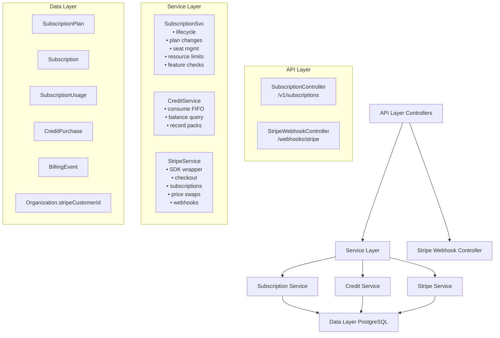
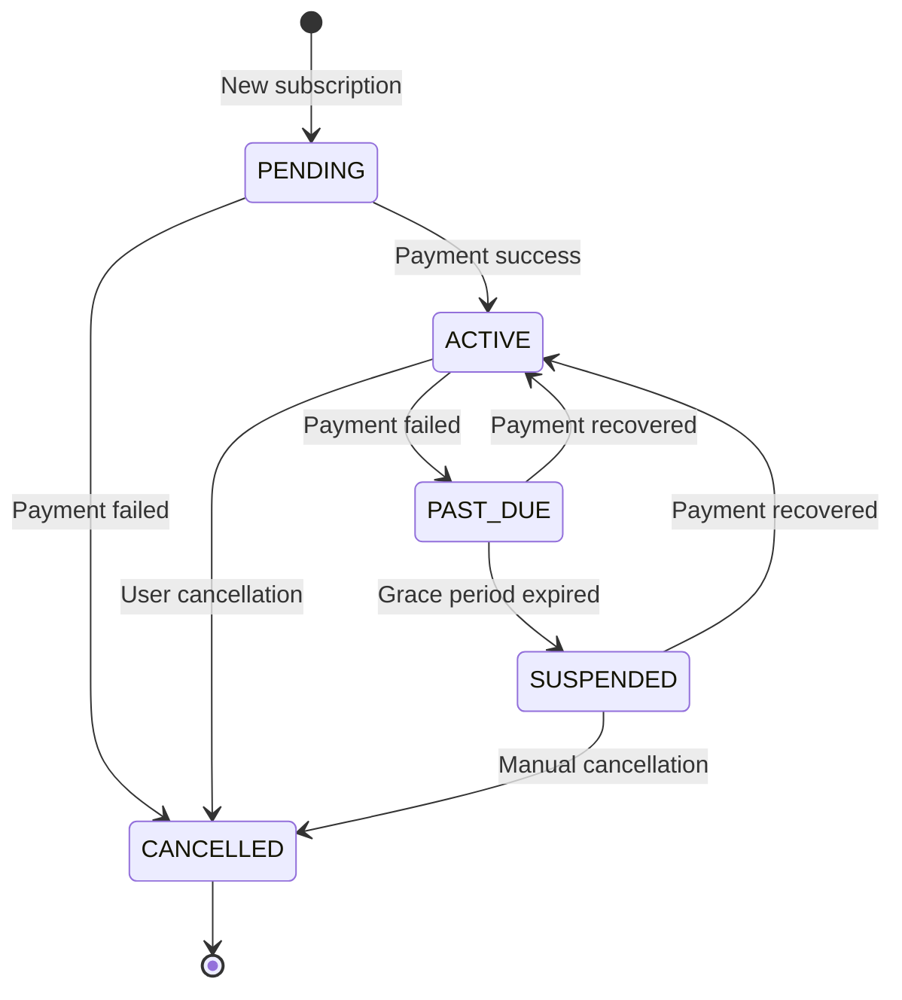

<Note>
**Status:** Active — fully implemented  
**Module Path:** `src/modules/subscription/`  
**Payment Gateway:** Stripe
</Note>

## Overview

The Subscription Module implements a **freemium SaaS billing system** for PropWise CRM. Every organization has a subscription tied to one of **three plan tiers** (Free / Pro / Business — Starter was removed; see §18). The module handles:

- **Plan-based feature gating** — binary feature flags per tier
- **Resource limits** — **source-aware** caps on leads, contacts, deals, companies (imports never count — §18.4), and storage
- **Unified AI-credit wallet** — one credit balance for Propilot, AI auto-reply, and unit valuation, with a per-action cost map, per-user ceilings, and personal credits (§18.5)
- **Single per-agent seat model** — one seat SKU per tier; Pro 5–10 seats (11th → upgrade to Business), Business 10+ with volume pricing (§18.3)
- **Stripe integration** — checkout, subscription management, mid-cycle plan changes, webhooks, billing portal, AED pricing, +25 GB storage packs, credit top-up packs
- **Evergreen 90-day trial** — Pro & Business signups get a card-upfront trial (§18.2)
- **Free organization ownership cap** — one user may own at most 2 active Free-plan organizations
- **Proration** — mid-cycle **tier** changes and seat changes are prorated to the day; **billing cycle** switches (Monthly ↔ Annual) are deferred to period end via Stripe Subscription Schedules
- **Suspension flow** — 2-day grace period on payment failure, then org goes read-only

<Warning>
**§18 (Subscription Packaging Rollout)** is the authoritative description of the current Free/Pro/Business AED model, the single-seat collapse, the unified credit wallet, source-aware caps, the evergreen trial, and connection caps. Where earlier sections (written for the legacy 4-tier / dual-seat / dual-credit model) conflict with §18, **§18 wins**.
</Warning>

### Design principles

<AccordionGroup>
<Accordion title="Core Design Principles">

| Principle | Decision |
|-----------|----------|
| Freemium model | Free plan with limited features; paid tiers unlock progressively |
| Per-org billing | Billing is per organization; developer portal is free |
| Dual seat types | Manager seats (Owner, Admin) and agent seats (Basic, custom roles); every user consumes a seat |
| Seat type derived from role | No explicit seat assignment — seat type is automatically determined by the user's RBAC role |
| Feature flags over tier checks | Gating uses `@RequiresFeature('flag')` on plan JSONB — changing what a tier includes requires only a seeder update, not code changes |
| Service-layer limit enforcement | Resource limits and credit consumption are checked in service methods, not guards, because they need entity counts |
| Free-org creation protection | `POST /v1/organizations` locks the owner row, counts owned Free-plan orgs (missing subscription rows count as Free), and rejects the third active free workspace |

</Accordion>

<Accordion title="Payment & Billing Principles">

| Principle | Decision |
|-----------|----------|
| Stripe as source of truth for payments | Webhook-driven lifecycle: the app reacts to Stripe events rather than polling |
| Billing cycle vs tier changes | **Tier changes** (Free → Pro, Pro → Business) are immediate and prorated. **Billing cycle switches** (Monthly ↔ Annual on same tier) are deferred to period end via Stripe Subscription Schedules with no proration. **Combined changes** (tier + cycle) are immediate and prorated with all line items re-priced atomically |
| Checkout vs. change-plan separation | `POST /checkout` is for first-time subscription (Free → Paid); `POST /change-plan` is for switching between paid tiers |
| Idempotent webhooks | Every Stripe event is logged in `BillingEvent` with a unique `stripeEventId` to prevent duplicate processing |
| Graceful degradation | If `app.stripe.secretKey` (`STRIPE_SECRET_KEY`) is not set, billing features are unavailable but the app still starts |

</Accordion>
</AccordionGroup>

## Architecture

### High-level diagram



### Data flow examples

<Tabs>
<Tab title="First-time Checkout (Free → Paid)">

<Steps>
<Step title="User initiates upgrade">
Frontend "Upgrade" button triggers `POST /v1/subscriptions/checkout`
</Step>

<Step title="Create checkout session">
- Rejects if org already has a Stripe subscription (use change-plan instead)
- `SubscriptionService.createCheckoutSession()`
- `StripeService.createCheckoutSession()`
- Returns Stripe Checkout URL
</Step>

<Step title="Payment processing">
- User pays on Stripe's hosted page
- Stripe redirects to success URL with `session_id={CHECKOUT_SESSION_ID}`
</Step>

<Step title="Confirm checkout">
- Frontend calls `POST /v1/subscriptions/checkout/confirm { sessionId }`
- `SubscriptionService.fulfillCheckoutSession()` (idempotent with webhook)
- Subscription entity updated to ACTIVE (plan tier from session metadata)
</Step>

<Step title="Webhook confirmation">
- Stripe fires `checkout.session.completed` webhook (async)
- `StripeWebhookController` → `activateSubscription()` (same activation path)
</Step>
</Steps>

</Tab>

<Tab title="Mid-cycle Plan Change">

<Steps>
<Step title="Initiate plan change">
Frontend "Change Plan" button triggers `POST /v1/subscriptions/change-plan`
</Step>

<Step title="Validate and process">
- `SubscriptionService.changePlan()`
- Validates seat overflow (blocks if current users exceed new plan capacity)
- `StripeService.swapSubscriptionPrice()` — prorated
</Step>

<Step title="Update subscription">
- Reconciles seat line items (old tier price → new tier price)
- Updates local Subscription entity
- Returns updated subscription immediately
</Step>
</Steps>

</Tab>

<Tab title="Payment Failure Flow">

<Steps>
<Step title="Stripe charges renewal">
Stripe attempts to charge renewal invoice
</Step>

<Step title="Payment success">
If successful: `invoice.paid` → `handleInvoicePaid()` → status stays ACTIVE, period updated
</Step>

<Step title="Payment failure">
If failed: `invoice.payment_failed` → `handleInvoicePaymentFailed()` → status → PAST_DUE
</Step>

<Step title="Grace period">
- Stripe retries for 2 days
- Payment succeeds → `invoice.paid` → back to ACTIVE
- All retries fail → `customer.subscription.updated` (status: unpaid)
</Step>

<Step title="Suspension">
- `handleSubscriptionUpdated()` → status → SUSPENDED
- Org becomes read-only (`SubscriptionActiveGuard` blocks writes)
</Step>
</Steps>

</Tab>
</Tabs>

## Plan Tiers & Pricing

<CardGroup cols={3}>
<Card title="Free" icon="gift">
- **Monthly price:** $0
- **Annual price:** $0
- **Manager seats:** 1
- **Agent seats:** 0
- **Core features only**
</Card>

<Card title="Professional" icon="star">
- **Monthly price:** $149
- **Annual price:** $1,430.40 (~20% off)
- **Manager seats:** 5
- **Agent seats:** 5-10 (11th triggers upgrade)
- **Advanced features unlocked**
</Card>

<Card title="Business" icon="building">
- **Monthly price:** $399
- **Annual price:** $3,830.40
- **Manager seats:** 10
- **Agent seats:** 10+ with volume pricing
- **Full feature set**
</Card>
</CardGroup>

<Note>
**Starter tier removed:** The legacy Starter tier has been deprecated. Current active tiers are Free, Professional, and Business only.
</Note>

### Pricing structure

All prices are in **USD cents** for Stripe integration:

```json
{
  "free": {
    "monthly": 0,
    "annual": 0
  },
  "professional": {
    "monthly": 14900,
    "annual": 143040
  },
  "business": {
    "monthly": 39900,
    "annual": 383040
  }
}
```

## Feature Gating Model

The module uses **feature flags** stored in the plan's JSONB `features` column rather than hard-coded tier checks.

### Feature flag implementation

<CodeGroup>
```typescript Decorator Usage
@RequiresFeature('advanced_reporting')
@Post('generate-report')
async generateAdvancedReport() {
  // Only available if org's plan includes 'advanced_reporting'
}
```

```typescript Guard Implementation
@Injectable()
export class FeatureGuard implements CanActivate {
  canActivate(context: ExecutionContext): boolean {
    const requiredFeature = this.reflector.get<string>('feature', context.getHandler());
    const organization = context.getRequest().organization;
    
    return organization.subscription?.plan?.features?.[requiredFeature] === true;
  }
}
```
</CodeGroup>

### Available feature flags

<AccordionGroup>
<Accordion title="Core Features">
- `basic_crm` - Basic CRM functionality (all tiers)
- `lead_management` - Lead capture and management
- `contact_management` - Contact database
- `deal_tracking` - Sales pipeline management
</Accordion>

<Accordion title="Professional Features">
- `advanced_reporting` - Advanced analytics and reporting
- `email_sequences` - Automated email campaigns
- `api_access` - REST API access
- `custom_fields` - Custom field creation
- `bulk_operations` - Bulk import/export
</Accordion>

<Accordion title="Business Features">
- `white_labeling` - Custom branding
- `advanced_integrations` - Third-party integrations
- `priority_support` - Priority customer support
- `advanced_permissions` - Granular role permissions
- `audit_logs` - Comprehensive audit logging
</Accordion>
</AccordionGroup>

## Seat Management

### Seat types and allocation

The system uses a **single per-agent seat model** with automatic role-based assignment:

<Tabs>
<Tab title="Seat Calculation">

```typescript
// Automatic seat type assignment based on role
const getSeatType = (role: string): 'manager' | 'agent' => {
  const managerRoles = ['owner', 'admin'];
  return managerRoles.includes(role.toLowerCase()) ? 'manager' : 'agent';
};

// Seat consumption calculation
const calculateSeatUsage = (users: User[]): SeatUsage => {
  return users.reduce((usage, user) => {
    const seatType = getSeatType(user.role);
    usage[seatType]++;
    return usage;
  }, { manager: 0, agent: 0 });
};
```

</Tab>

<Tab title="Seat Limits by Plan">

| Plan | Manager Seats | Agent Seats | Notes |
|------|---------------|-------------|--------|
| Free | 1 | 0 | Owner only |
| Professional | 5 | 5-10 | 11th user triggers upgrade to Business |
| Business | 10 | 10+ | Volume pricing for additional seats |

</Tab>

<Tab title="Seat Overflow Handling">

```typescript
// Seat overflow validation
const validateSeatCapacity = (orgId: string, newPlan: PlanTier): Promise<boolean> => {
  const currentUsage = await getSeatUsage(orgId);
  const planLimits = getPlanLimits(newPlan);
  
  const totalCurrent = currentUsage.manager + currentUsage.agent;
  const totalAllowed = planLimits.managerSeats + planLimits.agentSeats;
  
  if (totalCurrent > totalAllowed) {
    throw new Error('Current user count exceeds new plan capacity');
  }
  
  return true;
};
```

</Tab>
</Tabs>

<Warning>
**Seat overflow prevention:** Plan downgrades are blocked if the current user count exceeds the new plan's seat limit. Users must be removed before downgrading.
</Warning>

## Credit System

### Unified credit wallet

The system implements a **unified AI-credit wallet** with FIFO consumption and per-user ceilings:

<Tabs>
<Tab title="Credit Structure">

```typescript
interface CreditBalance {
  organizationCredits: number;  // Org-wide shared credits
  personalCredits: number;      // User-specific credits
  totalAvailable: number;       // Combined balance
}

interface CreditCost {
  propilot: 1;           // Propilot AI assistant
  autoReply: 2;          // AI auto-reply generation  
  unitValuation: 5;      // Property valuation
}
```

</Tab>

<Tab title="Credit Consumption">

<Steps>
<Step title="Check user ceiling">
Validate user hasn't exceeded per-action daily/monthly limits
</Step>

<Step title="FIFO consumption">
1. Consume personal credits first
2. Then consume organization credits
3. Fail if insufficient balance
</Step>

<Step title="Record transaction">
Log credit consumption with action type, user, and timestamp
</Step>
</Steps>

</Tab>

<Tab title="Credit Purchasing">

```typescript
// Credit pack options
const creditPacks = {
  small: { credits: 100, priceUsd: 10 },
  medium: { credits: 500, priceUsd: 45 },
  large: { credits: 1000, priceUsd: 80 }
};

// Purchase flow
await stripeService.createCreditPurchaseSession({
  packSize: 'medium',
  organizationId: org.id,
  userId: user.id
});
```

</Tab>
</Tabs>

### Credit limits and ceilings

<Info>
Per-user credit ceilings prevent abuse and ensure fair usage across team members.
</Info>

| Action | Cost | Daily Ceiling | Monthly Ceiling |
|--------|------|---------------|-----------------|
| Propilot | 1 credit | 50 uses | 1,000 uses |
| AI Auto-reply | 2 credits | 25 uses | 500 uses |
| Unit Valuation | 5 credits | 10 uses | 200 uses |

## Entity Specifications

### Core subscription entities

<CodeGroup>
```typescript SubscriptionPlan Entity
@Entity()
export class SubscriptionPlan {
  @PrimaryKey()
  id: string;

  @Property()
  name: string; // 'free', 'professional', 'business'

  @Property()
  displayName: string;

  @Property({ type: 'jsonb' })
  features: Record<string, boolean>;

  @Property({ type: 'jsonb' })
  limits: {
    managerSeats: number;
    agentSeats: number;
    storage: number; // GB
    leads: number;
    contacts: number;
    deals: number;
    companies: number;
  };

  @Property({ type: 'jsonb' })
  pricing: {
    monthly: number; // USD cents
    annual: number;  // USD cents
  };
}
```

```typescript Subscription Entity
@Entity()
export class Subscription {
  @PrimaryKey()
  id: string;

  @ManyToOne(() => Organization)
  organization: Organization;

  @ManyToOne(() => SubscriptionPlan)
  plan: SubscriptionPlan;

  @Enum(() => SubscriptionStatus)
  status: SubscriptionStatus;

  @Property({ nullable: true })
  stripeSubscriptionId?: string;

  @Property({ nullable: true })
  stripeCustomerId?: string;

  @Property({ nullable: true })
  currentPeriodStart?: Date;

  @Property({ nullable: true })
  currentPeriodEnd?: Date;

  @Property()
  billingCycle: 'monthly' | 'annual';

  @Property({ type: 'jsonb', nullable: true })
  metadata?: Record<string, any>;

  @Property()
  createdAt: Date = new Date();

  @Property({ onUpdate: () => new Date() })
  updatedAt: Date = new Date();
}
```

```typescript CreditPurchase Entity
@Entity()
export class CreditPurchase {
  @PrimaryKey()
  id: string;

  @ManyToOne(() => Organization)
  organization: Organization;

  @ManyToOne(() => User)
  purchasedBy: User;

  @Property()
  credits: number;

  @Property()
  priceUsd: number; // USD cents

  @Property({ nullable: true })
  stripePaymentIntentId?: string;

  @Property({ default: false })
  isPersonal: boolean;

  @Enum(() => PurchaseStatus)
  status: PurchaseStatus;

  @Property()
  purchasedAt: Date = new Date();
}
```
</CodeGroup>

### Supporting entities

<AccordionGroup>
<Accordion title="BillingEvent Entity">

```typescript
@Entity()
export class BillingEvent {
  @PrimaryKey()
  id: string;

  @Property({ unique: true })
  stripeEventId: string;

  @Enum(() => BillingEventType)
  eventType: BillingEventType;

  @ManyToOne(() => Organization, { nullable: true })
  organization?: Organization;

  @Property({ type: 'jsonb' })
  eventData: Record<string, any>;

  @Property()
  processedAt: Date = new Date();
}
```

</Accordion>

<Accordion title="SubscriptionUsage Entity">

```typescript
@Entity()
export class SubscriptionUsage {
  @PrimaryKey()
  id: string;

  @ManyToOne(() => Subscription)
  subscription: Subscription;

  @Property()
  periodStart: Date;

  @Property()
  periodEnd: Date;

  @Property({ type: 'jsonb' })
  usage: {
    seats: { manager: number; agent: number };
    storage: number; // GB used
    apiCalls: number;
    credits: { consumed: number; purchased: number };
  };

  @Property()
  recordedAt: Date = new Date();
}
```

</Accordion>
</AccordionGroup>

## Stripe Integration

### Webhook handling

The system processes Stripe webhooks for subscription lifecycle management:

<CodeGroup>
```typescript Webhook Controller
@Controller('webhooks/stripe')
export class StripeWebhookController {
  @Post()
  async handleWebhook(
    @Body() rawBody: Buffer,
    @Headers('stripe-signature') signature: string,
  ) {
    const event = await this.stripeService.constructWebhookEvent(rawBody, signature);
    
    // Idempotency check
    const existingEvent = await this.billingEventRepo.findOne({
      stripeEventId: event.id
    });
    
    if (existingEvent) {
      return { received: true };
    }

    // Process event
    switch (event.type) {
      case 'checkout.session.completed':
        await this.handleCheckoutCompleted(event);
        break;
      case 'customer.subscription.updated':
        await this.handleSubscriptionUpdated(event);
        break;
      case 'invoice.payment_failed':
        await this.handlePaymentFailed(event);
        break;
      case 'invoice.paid':
        await this.handleInvoicePaid(event);
        break;
    }

    // Log event
    await this.billingEventRepo.create({
      stripeEventId: event.id,
      eventType: event.type,
      eventData: event.data,
      organization: await this.getOrgFromEvent(event)
    });

    return { received: true };
  }
}
```

```typescript Stripe Service Integration
@Injectable()
export class StripeService {
  constructor(@Inject('STRIPE_CLIENT') private stripe: Stripe) {}

  async createCheckoutSession(params: CheckoutParams): Promise<Stripe.Checkout.Session> {
    return this.stripe.checkout.sessions.create({
      mode: 'subscription',
      payment_method_types: ['card'],
      line_items: [{
        price: params.priceId,
        quantity: params.seatCount || 1,
      }],
      customer: params.stripeCustomerId,
      success_url: `${params.successUrl}?session_id={CHECKOUT_SESSION_ID}`,
      cancel_url: params.cancelUrl,
      metadata: {
        organizationId: params.organizationId,
        planName: params.planName,
      },
      subscription_data: {
        trial_period_days: params.trialDays,
      },
    });
  }

  async swapSubscriptionPrice(
    subscriptionId: string,
    newPriceId: string,
    quantity?: number
  ): Promise<Stripe.Subscription> {
    const subscription = await this.stripe.subscriptions.retrieve(subscriptionId);
    
    return this.stripe.subscriptions.update(subscriptionId, {
      items: [{
        id: subscription.items.data[0].id,
        price: newPriceId,
        quantity: quantity || 1,
      }],
      proration_behavior: 'always_invoice',
    });
  }
}
```
</CodeGroup>

### Price configuration

<Tabs>
<Tab title="Stripe Price IDs">

```typescript
// Environment-based price configuration
const stripePrices = {
  professional: {
    monthly: process.env.STRIPE_PRICE_PRO_MONTHLY,
    annual: process.env.STRIPE_PRICE_PRO_ANNUAL,
  },
  business: {
    monthly: process.env.STRIPE_PRICE_BIZ_MONTHLY, 
    annual: process.env.STRIPE_PRICE_BIZ_ANNUAL,
  },
  storage: {
    pack25gb: process.env.STRIPE_PRICE_STORAGE_25GB,
  },
  credits: {
    pack100: process.env.STRIPE_PRICE_CREDITS_100,
    pack500: process.env.STRIPE_PRICE_CREDITS_500,
    pack1000: process.env.STRIPE_PRICE_CREDITS_1000,
  },
};
```

</Tab>

<Tab title="AED Pricing">

```typescript
// AED pricing for Middle East markets
const aedPrices = {
  professional: {
    monthly: 54900, // 549 AED
    annual: 525000, // 5,250 AED (~20% off)
  },
  business: {
    monthly: 146600, // 1,466 AED
    annual: 1401000, // 14,010 AED
  }
};
```

</Tab>
</Tabs>

<Check>
**Currency support:** The system supports both USD and AED pricing through separate Stripe price configurations.
</Check>

## Subscription Lifecycle

### Status transitions



### Lifecycle management

<Steps>
<Step title="Subscription Creation">
- User selects plan and initiates checkout
- Stripe Checkout session created with trial period (Pro/Business)
- Payment processed and subscription activated
- Local subscription entity created/updated
</Step>

<Step title="Active Subscription">
- Full access to plan features
- Resource limits enforced
- Credit consumption allowed
- Regular billing cycles processed
</Step>

<Step title="Payment Issues">
- Invoice payment failure triggers PAST_DUE status
- 2-day grace period with Stripe retry attempts
- Organization remains functional during grace period
- After grace period expires, status moves to SUSPENDED
</Step>

<Step title="Suspension">
- Organization becomes read-only
- Users can view data but cannot create/edit
- Credit consumption blocked
- Payment recovery restores full access
</Step>
</Steps>

## Plan Changes (Upgrade / Downgrade)

### Immediate vs deferred changes

<Tabs>
<Tab title="Immediate Changes (Tier)">

**Tier changes** are processed immediately with proration:

```typescript
async changePlan(
  organizationId: string,
  newPlan: PlanTier,
  billingCycle?: BillingCycle
): Promise<Subscription> {
  // Validate seat capacity
  await this.validateSeatCapacity(organizationId, newPlan);
  
  // Update Stripe subscription with proration
  const stripeSubscription = await this.stripeService.swapSubscriptionPrice(
    subscription.stripeSubscriptionId,
    this.getPriceId(newPlan, billingCycle),
    seatCount
  );
  
  // Update local entity immediately
  subscription.plan = await this.planRepo.findOne({ name: newPlan });
  subscription.billingCycle = billingCycle || subscription.billingCycle;
  await this.subscriptionRepo.persistAndFlush(subscription);
  
  return subscription;
}
```

</Tab>

<Tab title="Deferred Changes (Billing Cycle)">

**Billing cycle switches** are deferred to period end:

```typescript
async changeBillingCycle(
  subscriptionId: string,
  newCycle: BillingCycle
): Promise<void> {
  // Create subscription schedule for period end
  await this.stripe.subscriptionSchedules.create({
    from_subscription: stripeSubscriptionId,
    phases: [
      {
        // Current period continues unchanged
        items: subscription.items.data.map(item => ({
          price: item.price.id,
          quantity: item.quantity,
        })),
        end_date: subscription.current_period_end,
      },
      {
        // New billing cycle starts next period
        items: subscription.items.data.map(item => ({
          price: this.getPriceForCycle(item.price.id, newCycle),
          quantity: item.quantity,
        })),
        iterations: newCycle === 'annual' ? 1 : 12,
      }
    ]
  });
}
```

</Tab>

<Tab title="Combined Changes">

**Tier + billing cycle changes** are processed immediately:

```typescript
async changeTeamAndCycle(
  organizationId: string,
  newPlan: PlanTier,
  newCycle: BillingCycle
): Promise<Subscription> {
  // Process as immediate tier change with new billing cycle
  return this.changePlan(organizationId, newPlan, newCycle);
  
  // All line items re-priced atomically with proration
}
```

</Tab>
</Tabs>

<Warning>
**Proration behavior:** Tier changes are always prorated. Billing cycle changes alone are deferred to avoid proration complexity.
</Warning>

## API Endpoints

### Subscription management endpoints

<CodeGroup>
```typescript GET /v1/subscriptions/current
@Get('current')
@UseGuards(OrganizationGuard)
async getCurrentSubscription(@Org() org: Organization) {
  return this.subscriptionService.getOrganizationSubscription(org.id);
}

// Response:
{
  "id": "sub_123",
  "plan": {
    "name": "professional",
    "displayName": "Professional",
    "features": { "advanced_reporting": true },
    "limits": { "managerSeats": 5, "agentSeats": 10 }
  },
  "status": "active",
  "currentPeriodEnd": "2024-01-31T23:59:59Z",
  "billingCycle": "monthly"
}
```

```typescript POST /v1/subscriptions/checkout
@Post('checkout')
@UseGuards(OrganizationGuard)
async createCheckout(
  @Body() dto: CreateCheckoutDto,
  @Org() org: Organization
) {
  return this.subscriptionService.createCheckoutSession({
    organizationId: org.id,
    planName: dto.plan,
    billingCycle: dto.billingCycle,
    successUrl: dto.successUrl,
    cancelUrl: dto.cancelUrl
  });
}

// Request:
{
  "plan": "professional",
  "billingCycle": "monthly",
  "successUrl": "https://app.propwise.com/billing/success",
  "cancelUrl": "https://app.propwise.com/billing/cancel"
}

// Response:
{
  "checkoutUrl": "https://checkout.stripe.com/pay/cs_...",
  "sessionId": "cs_test_..."
}
```

```typescript POST /v1/subscriptions/change-plan
@Post('change-plan')
@UseGuards(OrganizationGuard, SubscriptionActiveGuard)
async changePlan(
  @Body() dto: ChangePlanDto,
  @Org() org: Organization
) {
  return this.subscriptionService.changePlan(
    org.id,
    dto.plan,
    dto.billingCycle
  );
}

// Request:
{
  "plan": "business",
  "billingCycle": "annual"
}
```
</CodeGroup>

### Credit management endpoints

<CodeGroup>
```typescript GET /v1/subscriptions/credits
@Get('credits')
@UseGuards(OrganizationGuard)
async getCreditBalance(
  @Org() org: Organization,
  @User() user: User
) {
  return this.creditService.getBalance(org.id, user.id);
}

// Response:
{
  "organizationCredits": 150,
  "personalCredits": 25,
  "totalAvailable": 175,
  "usageThisMonth": {
    "propilot": 45,
    "autoReply": 12,
    "unitValuation": 3
  }
}
```

```typescript POST /v1/subscriptions/credits/purchase
@Post('credits/purchase')
@UseGuards(OrganizationGuard)
async purchaseCredits(
  @Body() dto: PurchaseCreditsDto,
  @Org() org: Organization,
  @User() user: User
) {
  return this.creditService.createPurchaseSession({
    organizationId: org.id,
    userId: user.id,
    packSize: dto.packSize,
    isPersonal: dto.isPersonal
  });
}

// Request:
{
  "packSize": "medium", // 100, 500, 1000 credits
  "isPersonal": false
}
```
</CodeGroup>

### Usage and analytics endpoints

<AccordionGroup>
<Accordion title="Usage Statistics">

```typescript
@Get('usage')
@UseGuards(OrganizationGuard)
async getUsageStats(@Org() org: Organization) {
  return this.subscriptionService.getUsageStatistics(org.id);
}

// Response:
{
  "currentPeriod": {
    "seats": { "manager": 3, "agent": 7 },
    "storage": 12.5, // GB
    "credits": { "consumed": 89, "remaining": 61 }
  },
  "limits": {
    "seats": { "manager": 5, "agent": 10 },
    "storage": 100,
    "credits": null // unlimited
  }
}
```

</Accordion>

<Accordion title="Billing History">

```typescript
@Get('billing/history')
@UseGuards(OrganizationGuard)
async getBillingHistory(@Org() org: Organization) {
  return this.subscriptionService.getBillingHistory(org.id);
}

// Response:
{
  "invoices": [
    {
      "id": "in_123",
      "amount": 14900,
      "currency": "usd",
      "status": "paid",
      "periodStart": "2024-01-01T00:00:00Z",
      "periodEnd": "2024-01-31T23:59:59Z",
      "paidAt": "2024-01-01T12:00:00Z"
    }
  ]
}
```

</Accordion>
</AccordionGroup>

## Guards & Decorators

### Feature-based access control

<CodeGroup>
```typescript RequiresFeature Decorator
export const RequiresFeature = (feature: string) => SetMetadata('feature', feature);

// Usage:
@RequiresFeature('advanced_reporting')
@Get('reports/advanced')
async getAdvancedReports() {
  // Only available to plans with advanced_reporting feature
}
```

```typescript FeatureGuard Implementation
@Injectable()
export class FeatureGuard implements CanActivate {
  constructor(private reflector: Reflector) {}

  canActivate(context: ExecutionContext): boolean {
    const requiredFeature = this.reflector.get<string>('feature', context.getHandler());
    if (!requiredFeature) return true;

    const request = context.switchToHttp().getRequest();
    const organization = request.organization;
    
    if (!organization?.subscription?.plan?.features) {
      return false;
    }

    return organization.subscription.plan.features[requiredFeature] === true;
  }
}
```

```typescript SubscriptionActiveGuard
@Injectable()
export class SubscriptionActiveGuard implements CanActivate {
  canActivate(context: ExecutionContext): boolean {
    const request = context.switchToHttp().getRequest();
    const organization = request.organization;
    
    // Free plan is always considered active
    if (!organization.subscription) return true;
    
    const validStatuses = ['active', 'trialing', 'past_due'];
    return validStatuses.includes(organization.subscription.status);
  }
}
```
</CodeGroup>

### Subscription status guards

<Tabs>
<Tab title="Active Subscription Required">

```typescript
@UseGuards(SubscriptionActiveGuard)
@Post('create')
async createResource() {
  // Blocked if subscription is suspended/cancelled
}
```

</Tab>

<Tab title="Paid Plan Required">

```typescript
@UseGuards(PaidPlanGuard)
@Post('premium-feature')
async usePremiumFeature() {
  // Blocked for free plan users
}
```

</Tab>

<Tab title="Combined Guards">

```typescript
@UseGuards(OrganizationGuard, SubscriptionActiveGuard, FeatureGuard)
@RequiresFeature('api_access')
@Get('api/data')
async getApiData() {
  // Requires: org membership + active sub + api_access feature
}
```

</Tab>
</Tabs>

## Enforcement Points

### Service-layer limit enforcement

Resource limits and credit consumption are enforced at the service layer where entity counts are available:

<CodeGroup>
```typescript Lead Creation Enforcement
@Injectable()
export class LeadService {
  async createLead(orgId: string, leadData: CreateLeadDto): Promise<Lead> {
    // Check resource limits
    const subscription = await this.getOrgSubscription(orgId);
    const currentCount = await this.leadRepo.count({ organization: orgId });
    
    if (currentCount >= subscription.plan.limits.leads) {
      throw new ForbiddenException('Lead limit exceeded for current plan');
    }
    
    // Proceed with creation
    return this.leadRepo.create(leadData);
  }
}
```

```typescript Credit Consumption Enforcement
@Injectable()
export class PropilotService {
  async generateResponse(userId: string, query: string): Promise<string> {
    // Check user ceiling
    const dailyUsage = await this.getCreditUsage(userId, 'propilot', 'day');
    if (dailyUsage >= 50) {
      throw new ForbiddenException('Daily Propilot usage limit exceeded');
    }
    
    // Consume credits (FIFO: personal first, then org)
    await this.creditService.consumeCredits(userId, 'propilot', 1);
    
    // Generate AI response
    return this.generateAIResponse(query);
  }
}
```

```typescript Storage Limit Enforcement
@Injectable() 
export class FileService {
  async uploadFile(orgId: string, file: Express.Multer.File): Promise<FileEntity> {
    const subscription = await this.getOrgSubscription(orgId);
    const currentUsage = await this.getStorageUsage(orgId);
    const fileSizeGB = file.size / (1024 * 1024 * 1024);
    
    if (currentUsage + fileSizeGB > subscription.plan.limits.storage) {
      throw new ForbiddenException('Storage limit exceeded. Upgrade plan or purchase additional storage.');
    }
    
    return this.uploadToStorage(file);
  }
}
```
</CodeGroup>

### Real-time limit checking

<Steps>
<Step title="Pre-action validation">
Service methods check current usage against plan limits before allowing operations
</Step>

<Step title="Atomic limit enforcement">
Database constraints and service-layer checks prevent exceeding limits even under concurrent access
</Step>

<Step title="Grace period handling">
Recent upgrades may temporarily allow usage above old limits during proration periods
</Step>

<Step title="Error responses">
Limit violations return clear error messages with upgrade suggestions
</Step>
</Steps>

## Plan Seeder

### Database initialization

<CodeGroup>
```typescript Plan Seeder Implementation
@Injectable()
export class PlanSeeder {
  async seed(): Promise<void> {
    const plans = [
      {
        name: 'free',
        displayName: 'Free',
        features: {
          basic_crm: true,
          lead_management: true,
          contact_management: true,
          deal_tracking: true,
        },
        limits: {
          managerSeats: 1,
          agentSeats: 0,
          storage: 1, // GB
          leads: 100,
          contacts: 500,
          deals: 50,
          companies: 25,
        },
        pricing: {
          monthly: 0,
          annual: 0,
        },
      },
      {
        name: 'professional',
        displayName: 'Professional',
        features: {
          basic_crm: true,
          lead_management: true,
          contact_management: true,
          deal_tracking: true,
          advanced_reporting: true,
          email_sequences: true,
          api_access: true,
          custom_fields: true,
          bulk_operations: true,
        },
        limits: {
          managerSeats: 5,
          agentSeats: 10,
          storage: 25, // GB
          leads: 5000,
          contacts: 25000,
          deals: 2000,
          companies: 1000,
        },
        pricing: {
          monthly: 14900, // $149
          annual: 143040, // $1,430.40 (~20% off)
        },
      },
      {
        name: 'business',
        displayName: 'Business',
        features: {
          basic_crm: true,
          lead_management: true,
          contact_management: true,
          deal_tracking: true,
          advanced_reporting: true,
          email_sequences: true,
          api_access: true,
          custom_fields: true,
          bulk_operations: true,
          white_labeling: true,
          advanced_integrations: true,
          priority_support: true,
          advanced_permissions: true,
          audit_logs: true,
        },
        limits: {
          managerSeats: 10,
          agentSeats: -1, // unlimited
          storage: 100, // GB
          leads: -1, // unlimited
          contacts: -1, // unlimited
          deals: -1, // unlimited
          companies: -1, // unlimited
        },
        pricing: {
          monthly: 39900, // $399
          annual: 383040, // $3,830.40
        },
      },
    ];

    for (const planData of plans) {
      await this.planRepo.upsert(planData);
    }
  }
}
```

```typescript Seeder Execution
// In application bootstrap
@Injectable()
export class AppBootstrapService {
  async onApplicationBootstrap() {
    if (process.env.NODE_ENV === 'development' || process.env.SEED_DATA === 'true') {
      await this.planSeeder.seed();
    }
  }
}
```
</CodeGroup>

<Note>
**Plan updates:** Changes to plan features or limits require updating the seeder and running migrations. The JSONB structure allows flexible feature additions without schema changes.
</Note>

## Module Structure

```
src/modules/subscription/
├── controllers/
│   ├── subscription.controller.ts      # Subscription CRUD & checkout
│   └── stripe-webhook.controller.ts    # Webhook event processing
├── services/
│   ├── subscription.service.ts         # Core subscription logic
│   ├── credit.service.ts              # Credit wallet management  
│   └── stripe.service.ts              # Stripe SDK wrapper
├── entities/
│   ├── subscription-plan.entity.ts     # Plan definitions
│   ├── subscription.entity.ts          # Org subscriptions
│   ├── credit-purchase.entity.ts       # Credit transactions
│   └── billing-event.entity.ts         # Webhook event log
├── guards/
│   ├── feature.guard.ts               # Feature flag enforcement
│   ├── subscription-active.guard.ts   # Active subscription check
│   └── paid-plan.guard.ts             # Paid tier requirement
├── decorators/
│   ├── requires-feature.decorator.ts  # Feature requirement marker
│   └── subscription.decorator.ts      # Subscription injection
├── dto/
│   ├── create-checkout.dto.ts         # Checkout request
│   ├── change-plan.dto.ts            # Plan change request
│   └── purchase-credits.dto.ts       # Credit purchase request
├── seeders/
│   └── plan.seeder.ts                # Plan initialization
└── subscription.module.ts            # Module definition
```

## Environment Configuration

### Required environment variables

<CodeGroup>
```bash Stripe Configuration
# Stripe API keys
STRIPE_SECRET_KEY=sk_test_... # or sk_live_...
STRIPE_PUBLISHABLE_KEY=pk_test_... # or pk_live_...
STRIPE_WEBHOOK_SECRET=whsec_...

# Stripe Price IDs (from Stripe Dashboard)
STRIPE_PRICE_PRO_MONTHLY=price_...
STRIPE_PRICE_PRO_ANNUAL=price_...
STRIPE_PRICE_BIZ_MONTHLY=price_...
STRIPE_PRICE_BIZ_ANNUAL=price_...

# Add-on prices
STRIPE_PRICE_STORAGE_25GB=price_...
STRIPE_PRICE_CREDITS_100=price_...
STRIPE_PRICE_CREDITS_500=price_...
STRIPE_PRICE_CREDITS_1000=price_...
```

```bash Application URLs
# Frontend URLs for redirects
FRONTEND_URL=https://app.propwise.com
BILLING_SUCCESS_URL=${FRONTEND_URL}/billing/success
BILLING_CANCEL_URL=${FRONTEND_URL}/billing/cancel

# Webhook endpoint
STRIPE_WEBHOOK_URL=https://api.propwise.com/webhooks/stripe
```

```bash Feature Flags
# Enable/disable billing features
BILLING_ENABLED=true
TRIAL_DAYS_PRO=90
TRIAL_DAYS_BUSINESS=90

# Free org limits
MAX_FREE_ORGS_PER_USER=2
```
</CodeGroup>

### Configuration validation

<Tabs>
<Tab title="Startup Validation">

```typescript
@Injectable()
export class ConfigValidationService {
  validateBillingConfig(): void {
    const requiredVars = [
      'STRIPE_SECRET_KEY',
      'STRIPE_PUBLISHABLE_KEY', 
      'STRIPE_WEBHOOK_SECRET',
      'STRIPE_PRICE_PRO_MONTHLY',
      'STRIPE_PRICE_PRO_ANNUAL',
      'STRIPE_PRICE_BIZ_MONTHLY',
      'STRIPE_PRICE_BIZ_ANNUAL',
    ];

    const missing = requiredVars.filter(key => !process.env[key]);
    
    if (missing.length > 0) {
      throw new Error(`Missing required environment variables: ${missing.join(', ')}`);
    }
  }
}
```

</Tab>

<Tab title="Graceful Degradation">

```typescript
@Injectable()
export class StripeService {
  private readonly isConfigured: boolean;

  constructor() {
    this.isConfigured = !!process.env.STRIPE_SECRET_KEY;
    
    if (!this.isConfigured) {
      console.warn('Stripe not configured - billing features disabled');
    }
  }

  async createCheckoutSession(params: CheckoutParams): Promise<any> {
    if (!this.isConfigured) {
      throw new ServiceUnavailableException('Billing features not available');
    }
    
    return this.stripe.checkout.sessions.create(params);
  }
}
```

</Tab>
</Tabs>

## Integration with Other Modules

### Cross-module dependencies

<CardGroup cols={2}>
<Card title="Organization Module" icon="building">
- **Subscription entity** links to Organization
- **Billing customer** creation on org creation
- **Free org limits** enforced during org creation
- **Subscription status** affects org access
</Card>

<Card title="User Management" icon="users">
- **Seat calculation** based on user roles
- **User creation** blocked if seat limits exceeded
- **Credit ceilings** applied per user
- **Personal credits** tracked per user
</Card>

<Card title="CRM Modules" icon="phone">
- **Resource limits** enforced on lead/contact/deal creation
- **Import operations** don't count toward limits
- **Feature gating** controls access to advanced CRM features
- **API access** controlled by plan features
</Card>

<Card title="AI Services" icon="brain">
- **Credit consumption** for Propilot, auto-reply, valuation
- **Usage tracking** for billing and limits
- **Per-action costs** defined in subscription config
- **User ceilings** prevent abuse
</Card>
</CardGroup>

### Integration patterns

<Tabs>
<Tab title="Event-Driven Updates">

```typescript
// Organization created → Create billing customer
@OnEvent('organization.created')
async handleOrganizationCreated(event: OrganizationCreatedEvent) {
  await this.stripeService.createCustomer({
    email: event.owner.email,
    name: event.organization.name,
    metadata: { organizationId: event.organization.id }
  });
}

// User added → Check seat limits
@OnEvent('user.added')
async handleUserAdded(event: UserAddedEvent) {
  const seatUsage = await this.getSeatUsage(event.organizationId);
  const subscription = await this.getSubscription(event.organizationId);
  
  if (this.exceedsLimits(seatUsage, subscription.plan.limits)) {
    throw new ForbiddenException('Seat limit exceeded');
  }
}
```

</Tab>

<Tab title="Service Injection">

```typescript
@Injectable()
export class LeadService {
  constructor(
    private subscriptionService: SubscriptionService,
    private leadRepo: Repository<Lead>
  ) {}

  async createLead(orgId: string, data: CreateLeadDto): Promise<Lead> {
    // Check subscription limits
    await this.subscriptionService.checkResourceLimit(
      orgId, 
      'leads', 
      await this.leadRepo.count({ organization: orgId })
    );
    
    return this.leadRepo.create(data);
  }
}
```

</Tab>

<Tab title="Feature Flag Integration">

```typescript
@Injectable()
export class ReportService {
  @RequiresFeature('advanced_reporting')
  async generateAdvancedReport(orgId: string): Promise<Report> {
    // Feature automatically gated by decorator
    return this.buildAdvancedReport(orgId);
  }

  async generateBasicReport(orgId: string): Promise<Report> {
    // Available to all plans
    return this.buildBasicReport(orgId);
  }
}
```

</Tab>
</Tabs>

<Check>
**Integration complete:** The subscription module is fully integrated across all PropWise CRM features with consistent enforcement and graceful degradation.
</Check>