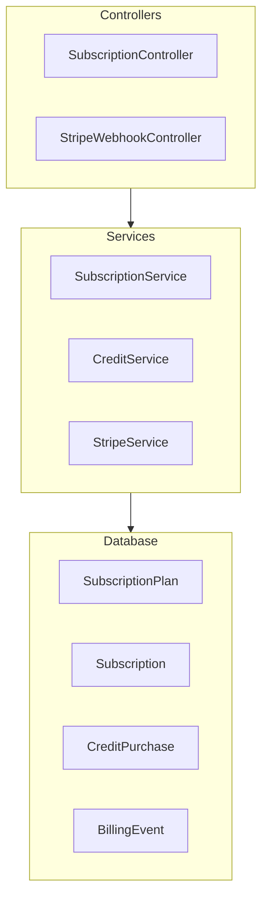
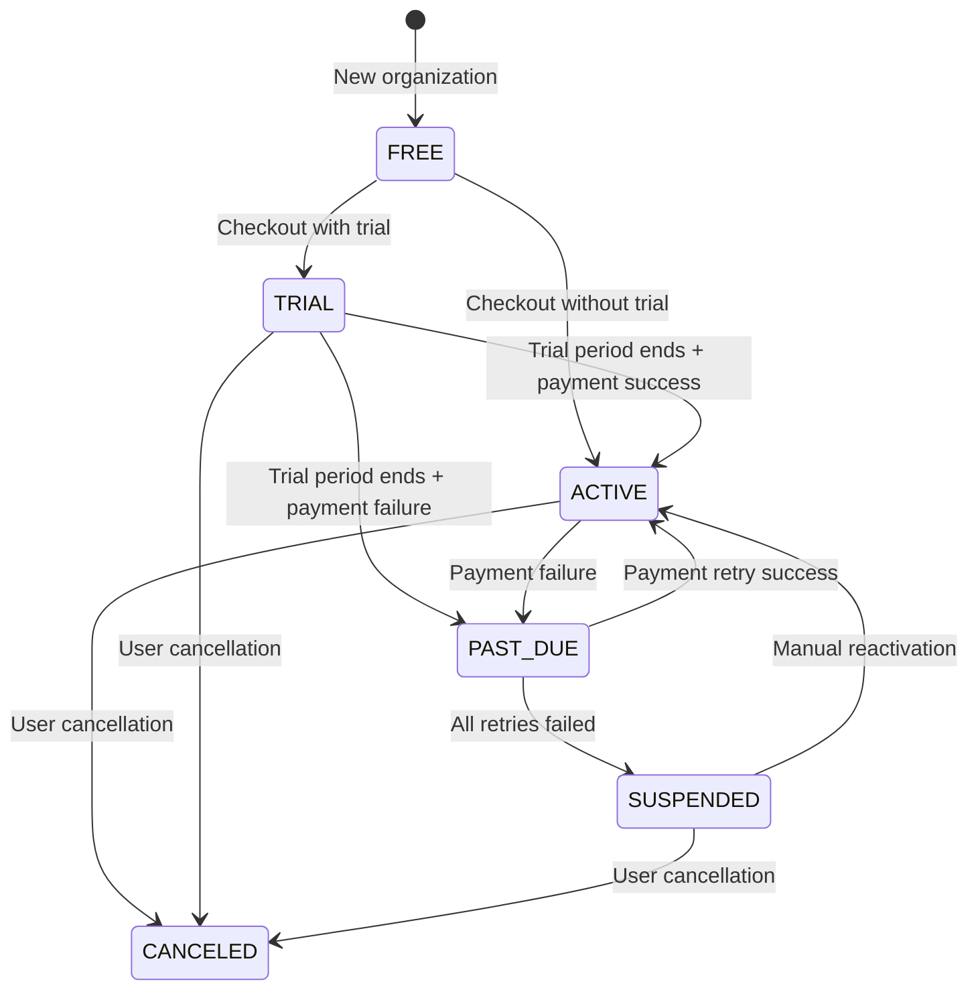

<Note>
**Status:** Active — fully implemented  
**Module Path:** `src/modules/subscription/`  
**Payment Gateway:** Stripe
</Note>

## Overview

The Subscription Module implements a **freemium SaaS billing system** for PropWise CRM. Every organization has a subscription tied to one of **three plan tiers** (Free / Pro / Business — Starter was removed; see §18). The module handles:

- **Plan-based feature gating** — binary feature flags per tier
- **Resource limits** — **source-aware** caps on leads, contacts, deals, companies (imports never count — §18.4), and storage
- **Unified AI-credit wallet** — one credit balance for Propilot, AI auto-reply, and unit valuation, with a per-action cost map, per-user ceilings, and personal credits (§18.5)
- **Single per-agent seat model** — one seat SKU per tier; Pro 5–10 seats (11th → upgrade to Business), Business 10+ with volume pricing (§18.3)
- **Stripe integration** — checkout, subscription management, mid-cycle plan changes, webhooks, billing portal, AED pricing, +25 GB storage packs, credit top-up packs
- **Evergreen 90-day trial** — Pro & Business signups get a card-upfront trial (§18.2)
- **Free organization ownership cap** — one user may own at most 2 active Free-plan organizations
- **Proration** — mid-cycle **tier** changes and seat changes are prorated to the day; **billing cycle** switches (Monthly ↔ Annual) are deferred to period end via Stripe Subscription Schedules
- **Suspension flow** — 2-day grace period on payment failure, then org goes read-only

<Warning>
**§18 (Subscription Packaging Rollout)** is the authoritative description of the current Free/Pro/Business AED model, the single-seat collapse, the unified credit wallet, source-aware caps, the evergreen trial, and connection caps. Where earlier sections conflict with §18, **§18 wins**.
</Warning>

### Design principles

<CardGroup cols={2}>
<Card title="Freemium model" icon="gift">
Free plan with limited features; paid tiers unlock progressively
</Card>

<Card title="Per-org billing" icon="building">
Billing is per organization; developer portal is free
</Card>

<Card title="Feature flags over tier checks" icon="flag">
Gating uses `@RequiresFeature('flag')` on plan JSONB — changing what a tier includes requires only a seeder update
</Card>

<Card title="Stripe as source of truth" icon="credit-card">
Webhook-driven lifecycle: the app reacts to Stripe events rather than polling
</Card>
</CardGroup>

<AccordionGroup>
<Accordion title="Additional design principles">

| Principle | Decision |
| --------- | -------- |
| Dual seat types | Manager seats (Owner, Admin) and agent seats (Basic, custom roles); every user consumes a seat |
| Seat type derived from role | No explicit seat assignment — seat type is automatically determined by the user's RBAC role |
| Service-layer limit enforcement | Resource limits and credit consumption are checked in service methods, not guards, because they need entity counts |
| Free-org creation protection | `POST /v1/organizations` locks the owner row, counts owned Free-plan orgs (missing subscription rows count as Free), and rejects the third active free workspace |
| Billing cycle vs tier changes | **Tier changes** (Free → Pro, Pro → Business) are immediate and prorated. **Billing cycle switches** (Monthly ↔ Annual on same tier) are deferred to period end |
| Checkout vs. change-plan separation | `POST /checkout` is for first-time subscription (Free → Paid); `POST /change-plan` is for switching between paid tiers |
| Idempotent webhooks | Every Stripe event is logged in `BillingEvent` with a unique `stripeEventId` to prevent duplicate processing |
| Graceful degradation | If `STRIPE_SECRET_KEY` is not set, billing features are unavailable but the app still starts |

</Accordion>
</AccordionGroup>

## Architecture

### High-level diagram



### Data flow

<Tabs>
<Tab title="First-time checkout">

<Steps>
<Step title="User clicks upgrade">
Frontend sends `POST /v1/subscriptions/checkout`
</Step>

<Step title="Validation">
Rejects if org already has a Stripe subscription (use change-plan instead)
</Step>

<Step title="Checkout session creation">
`SubscriptionService.createCheckoutSession()` → `StripeService.createCheckoutSession()` returns Stripe Checkout URL
</Step>

<Step title="Payment">
User pays on Stripe's hosted page
</Step>

<Step title="Confirmation">
Stripe redirects to success URL → Frontend calls `POST /v1/subscriptions/checkout/confirm`
</Step>

<Step title="Activation">
`SubscriptionService.fulfillCheckoutSession()` updates Subscription entity to ACTIVE
</Step>
</Steps>

</Tab>

<Tab title="Plan changes">

<Steps>
<Step title="User initiates change">
Frontend sends `POST /v1/subscriptions/change-plan`
</Step>

<Step title="Seat validation">
Validates seat overflow (blocks if current users exceed new plan capacity)
</Step>

<Step title="Stripe update">
`StripeService.swapSubscriptionPrice()` with proration
</Step>

<Step title="Seat reconciliation">
Reconciles seat line items (old tier price → new tier price)
</Step>

<Step title="Local update">
Updates local Subscription entity and returns immediately
</Step>
</Steps>

</Tab>

<Tab title="Payment failure">

<Steps>
<Step title="Initial failure">
`invoice.payment_failed` → `handleInvoicePaymentFailed()` → status becomes `PAST_DUE`
</Step>

<Step title="Retry period">
Stripe retries for 2 days
</Step>

<Step title="Recovery or suspension">
- Payment succeeds → `invoice.paid` → back to `ACTIVE`
- All retries fail → `customer.subscription.updated` → status becomes `SUSPENDED`
</Step>

<Step title="Read-only mode">
Org becomes read-only (`SubscriptionActiveGuard` blocks writes)
</Step>
</Steps>

</Tab>
</Tabs>

## Plan tiers & pricing

<Note>
All prices are in USD cents for Stripe integration.
</Note>

| Tier | **Free** | **Professional** | **Business** |
| ---- | -------- | ---------------- | ------------ |
| Monthly price | $0 | $149 | $399 |
| Annual price | $0 | $1,430.40 | $3,830.40 |
| Manager seats included | 1 | 5 | 10 |
| Agent seats included | 0 | 5 | 10 |
| Additional seats | Not allowed | $29/seat/month | Volume pricing |

<Info>
Starter tier has been removed from the current implementation. The system now operates on a simplified Free/Pro/Business model.
</Info>

## Feature gating model

Features are controlled through JSON flags stored in the `SubscriptionPlan` entity. Use the `@RequiresFeature()` decorator for enforcement.

### Feature flags

```json
{
  "leadImport": true,
  "contactImport": true,
  "dealImport": true,
  "companyImport": true,
  "bulkEmail": true,
  "emailTemplates": true,
  "customFields": true,
  "apiAccess": true,
  "webhooks": true,
  "analytics": true,
  "teamManagement": true,
  "roleManagement": true,
  "integrations": true,
  "whiteLabel": true,
  "sso": true,
  "audit": true,
  "dataExport": true,
  "advancedReporting": true
}
```

### Implementation example

```typescript
@Post('bulk-email')
@RequiresFeature('bulkEmail')
async sendBulkEmail(@Body() dto: BulkEmailDto) {
  // Feature gated endpoint
}
```

<Warning>
Feature flags override tier-based access. Changing what a tier includes requires only updating the plan seeder, not code changes.
</Warning>

## Seat management

### Seat types

<Tabs>
<Tab title="Manager seats">
- **Owner role**: Full organizational control
- **Admin role**: Administrative privileges
- Higher billing rate than agent seats
</Tab>

<Tab title="Agent seats">
- **Basic role**: Standard user access
- **Custom roles**: Configurable permissions
- Lower billing rate, designed for front-line users
</Tab>
</Tabs>

### Seat allocation rules

1. **Automatic assignment**: Seat type determined by user's RBAC role
2. **No explicit seat management**: Users consume seats based on their role
3. **Overflow protection**: Plan changes blocked if current users exceed new tier capacity
4. **Seat counting**: Active users only (not suspended/deactivated accounts)

### Billing reconciliation

<Steps>
<Step title="Role change detection">
User role changes trigger seat type recalculation
</Step>

<Step title="Stripe line item update">
Seat quantities updated in Stripe subscription
</Step>

<Step title="Proration calculation">
Mid-cycle changes are prorated to the day
</Step>

<Step title="Invoice generation">
Stripe generates prorated invoice for immediate payment
</Step>
</Steps>

## Credit system

### Unified credit wallet

<Info>
One credit balance per organization covers all AI features: Propilot, AI auto-reply, and unit valuation.
</Info>

#### Credit consumption map

```typescript
const CREDIT_COSTS = {
  propilot_query: 1,
  ai_auto_reply: 2,
  unit_valuation: 3,
  advanced_analytics: 5
};
```

#### Per-user credit ceilings

| Plan Tier | Daily Credit Limit per User |
| --------- | -------------------------- |
| Free | 10 credits |
| Professional | 50 credits |
| Business | 100 credits |

### Credit purchase packs

<CardGroup cols={2}>
<Card title="Small pack" icon="coins">
**500 credits** - $49
Perfect for occasional AI usage
</Card>

<Card title="Large pack" icon="sack-dollar">
**2,000 credits** - $149
Best value for heavy AI users
</Card>
</CardGroup>

### FIFO consumption

Credits are consumed in First-In-First-Out order:

1. **Purchased credits** (oldest first)
2. **Plan-included credits** 
3. **Personal credits** (gifts, bonuses)

## Entity specifications

### SubscriptionPlan

```typescript
@Entity()
export class SubscriptionPlan {
  @PrimaryKey()
  id: string;

  @Property()
  name: string; // 'Free', 'Professional', 'Business'

  @Property()
  tier: PlanTier; // FREE, PROFESSIONAL, BUSINESS

  @Property()
  monthlyPrice: number; // USD cents

  @Property()
  annualPrice: number; // USD cents

  @Property({ type: 'jsonb' })
  features: Record<string, boolean>;

  @Property({ type: 'jsonb' })
  limits: {
    managerSeats: number;
    agentSeats: number;
    storage: number; // GB
    leads: number;
    contacts: number;
    deals: number;
    companies: number;
    credits: number;
  };

  @Property()
  stripePriceIdMonthly?: string;

  @Property()
  stripePriceIdAnnual?: string;
}
```

### Subscription

```typescript
@Entity()
export class Subscription {
  @PrimaryKey()
  id: string;

  @ManyToOne()
  organization: Organization;

  @ManyToOne()
  plan: SubscriptionPlan;

  @Property()
  status: SubscriptionStatus; // ACTIVE, PAST_DUE, SUSPENDED, CANCELED

  @Property()
  billingCycle: BillingCycle; // MONTHLY, ANNUAL

  @Property()
  stripeSubscriptionId?: string;

  @Property()
  stripeCustomerId?: string;

  @Property()
  currentPeriodStart?: Date;

  @Property()
  currentPeriodEnd?: Date;

  @Property()
  trialEnd?: Date;

  @Property({ type: 'jsonb' })
  usage: {
    managerSeats: number;
    agentSeats: number;
    storage: number;
    leads: number;
    contacts: number;
    deals: number;
    companies: number;
    credits: number;
  };
}
```

<AccordionGroup>
<Accordion title="Additional entities">

### CreditPurchase

```typescript
@Entity()
export class CreditPurchase {
  @PrimaryKey()
  id: string;

  @ManyToOne()
  organization: Organization;

  @Property()
  credits: number;

  @Property()
  creditsRemaining: number;

  @Property()
  priceUsd: number; // USD cents

  @Property()
  purchaseDate: Date;

  @Property()
  expiryDate?: Date;

  @Property()
  stripePaymentIntentId?: string;
}
```

### BillingEvent

```typescript
@Entity()
export class BillingEvent {
  @PrimaryKey()
  id: string;

  @Property()
  stripeEventId: string; // Unique constraint

  @Property()
  eventType: string;

  @Property({ type: 'jsonb' })
  eventData: any;

  @Property()
  processedAt: Date;

  @Property()
  organizationId?: string;
}
```

</Accordion>
</AccordionGroup>

## Stripe integration

### Configuration

```typescript
// Environment variables
STRIPE_SECRET_KEY=sk_test_...
STRIPE_WEBHOOK_SECRET=whsec_...
STRIPE_PUBLISHABLE_KEY=pk_test_...
```

### Key integrations

<Tabs>
<Tab title="Checkout sessions">

```typescript
// Create checkout session
const session = await stripe.checkout.sessions.create({
  customer: organization.stripeCustomerId,
  payment_method_types: ['card'],
  mode: 'subscription',
  line_items: [{
    price: plan.stripePriceIdMonthly,
    quantity: 1,
  }],
  success_url: `${frontendUrl}/billing/success?session_id={CHECKOUT_SESSION_ID}`,
  cancel_url: `${frontendUrl}/billing`,
  metadata: {
    organizationId: organization.id,
    planId: plan.id,
  },
});
```

</Tab>

<Tab title="Subscription management">

```typescript
// Update subscription
await stripe.subscriptions.update(subscription.stripeSubscriptionId, {
  items: [{
    id: subscriptionItem.id,
    price: newPlan.stripePriceIdMonthly,
    quantity: newSeatCount,
  }],
  proration_behavior: 'create_prorations',
});
```

</Tab>

<Tab title="Webhook handling">

```typescript
@Post('webhooks/stripe')
@Header('Content-Type', 'application/json')
async handleStripeWebhook(
  @Req() req: Request,
  @Headers('stripe-signature') signature: string,
) {
  const event = stripe.webhooks.constructEvent(
    req.body,
    signature,
    process.env.STRIPE_WEBHOOK_SECRET,
  );

  // Idempotency check
  const existingEvent = await this.billingEventRepo.findOne({
    stripeEventId: event.id,
  });
  
  if (existingEvent) return { received: true };

  // Process event
  await this.processWebhookEvent(event);
}
```

</Tab>
</Tabs>

### Webhook events

| Event Type | Handler | Action |
| ---------- | ------- | ------ |
| `checkout.session.completed` | `handleCheckoutCompleted` | Activate subscription |
| `invoice.paid` | `handleInvoicePaid` | Update period dates |
| `invoice.payment_failed` | `handleInvoicePaymentFailed` | Set to PAST_DUE |
| `customer.subscription.updated` | `handleSubscriptionUpdated` | Sync status changes |
| `customer.subscription.deleted` | `handleSubscriptionCanceled` | Cancel subscription |

## Subscription lifecycle

### States and transitions



### State behaviors

<Tabs>
<Tab title="FREE">
- Default state for new organizations
- Limited features and resources
- No Stripe subscription
- Can upgrade to paid plans
</Tab>

<Tab title="TRIAL">
- 90-day trial period for Pro/Business
- Full plan features available
- Card required upfront
- Auto-converts to ACTIVE or PAST_DUE
</Tab>

<Tab title="ACTIVE">
- Full access to plan features
- Billing active and current
- Can change plans or cancel
</Tab>

<Tab title="PAST_DUE">
- Payment failed, in grace period
- Full access maintained for 2 days
- Stripe automatically retries payment
</Tab>

<Tab title="SUSPENDED">
- All payment retries exhausted
- Read-only access only
- Data preserved, writes blocked
</Tab>

<Tab title="CANCELED">
- User-initiated cancellation
- Access until period end
- No future billing
</Tab>
</Tabs>

## Plan changes (upgrade / downgrade)

### Validation rules

<Steps>
<Step title="Seat overflow check">
Ensure current user count doesn't exceed new plan limits
</Step>

<Step title="Feature access verification">
Validate user has necessary permissions for the change
</Step>

<Step title="Billing status check">
Subscription must be in good standing (ACTIVE or TRIAL)
</Step>

<Step title="Plan compatibility">
Verify the target plan exists and is available
</Step>
</Steps>

### Proration logic

<Info>
Mid-cycle tier changes are immediately prorated. Billing cycle changes are deferred to period end.
</Info>

#### Tier changes (immediate)

```typescript
// Pro Monthly → Business Monthly
await stripe.subscriptions.update(subscriptionId, {
  items: [{
    id: existingItemId,
    price: businessMonthlyPriceId,
    quantity: currentSeatCount,
  }],
  proration_behavior: 'create_prorations',
});
```

#### Billing cycle changes (deferred)

```typescript
// Pro Monthly → Pro Annual (at period end)
await stripe.subscriptionSchedules.create({
  customer: customerId,
  start_date: currentPeriodEnd,
  phases: [{
    items: [{
      price: proAnnualPriceId,
      quantity: currentSeatCount,
    }],
    iterations: 12,
  }],
});
```

### Combined changes

For tier + billing cycle changes (e.g., Pro Monthly → Business Annual):

<Steps>
<Step title="Atomic pricing">
All line items re-priced simultaneously
</Step>

<Step title="Immediate proration">
Change takes effect immediately with prorated charges
</Step>

<Step title="No schedule deferral">
Combined changes bypass the billing cycle deferral logic
</Step>
</Steps>

## API endpoints

### Subscription management

<CodeGroup>

```typescript POST /v1/subscriptions/checkout
// Create checkout session for Free → Paid upgrade
{
  "planId": "uuid",
  "billingCycle": "MONTHLY" | "ANNUAL",
  "successUrl": "string",
  "cancelUrl": "string"
}

// Response
{
  "checkoutUrl": "https://checkout.stripe.com/...",
  "sessionId": "cs_..."
}
```

```typescript POST /v1/subscriptions/checkout/confirm
// Confirm successful checkout
{
  "sessionId": "cs_..."
}

// Response
{
  "subscription": {
    "id": "uuid",
    "status": "ACTIVE",
    "plan": { /* plan details */ }
  }
}
```

```typescript POST /v1/subscriptions/change-plan
// Change between paid plans
{
  "planId": "uuid",
  "billingCycle": "MONTHLY" | "ANNUAL"
}

// Response
{
  "subscription": { /* updated subscription */ },
  "prorationAmount": 1250 // USD cents
}
```

```typescript GET /v1/subscriptions/current
// Get current subscription details

// Response
{
  "subscription": {
    "id": "uuid",
    "status": "ACTIVE",
    "plan": { /* plan details */ },
    "usage": { /* current usage */ },
    "billing": {
      "currentPeriodStart": "2024-01-01T00:00:00Z",
      "currentPeriodEnd": "2024-02-01T00:00:00Z",
      "nextInvoiceDate": "2024-02-01T00:00:00Z"
    }
  }
}
```

</CodeGroup>

### Credit management

<CodeGroup>

```typescript GET /v1/credits/balance
// Get current credit balance

// Response
{
  "totalCredits": 1500,
  "breakdown": {
    "purchased": 1000,
    "planIncluded": 500,
    "personal": 0
  },
  "dailyUsed": 25,
  "dailyLimit": 100
}
```

```typescript POST /v1/credits/purchase
// Purchase credit pack
{
  "packSize": "small" | "large"
}

// Response
{
  "checkoutUrl": "https://checkout.stripe.com/...",
  "sessionId": "cs_..."
}
```

```typescript POST /v1/credits/consume
// Consume credits for action (internal API)
{
  "action": "propilot_query",
  "userId": "uuid",
  "amount": 1
}

// Response
{
  "success": true,
  "remainingCredits": 1499,
  "dailyUsed": 26
}
```

</CodeGroup>

## Guards & decorators

### Feature gating

```typescript
@Injectable()
export class RequiresFeatureGuard implements CanActivate {
  canActivate(context: ExecutionContext): boolean {
    const requiredFeature = this.reflector.get<string>(
      'feature',
      context.getHandler(),
    );
    
    const request = context.switchToHttp().getRequest();
    const subscription = request.user.organization.subscription;
    
    return subscription?.plan?.features?.[requiredFeature] === true;
  }
}

// Usage
@RequiresFeature('bulkEmail')
@Post('bulk-email')
async sendBulkEmail() { /* ... */ }
```

### Subscription status

```typescript
@Injectable()
export class SubscriptionActiveGuard implements CanActivate {
  canActivate(context: ExecutionContext): boolean {
    const request = context.switchToHttp().getRequest();
    const subscription = request.user.organization.subscription;
    
    // Allow reads for suspended subscriptions
    const method = request.method;
    if (method === 'GET' && subscription?.status === 'SUSPENDED') {
      return true;
    }
    
    // Block writes for non-active subscriptions
    return ['ACTIVE', 'TRIAL'].includes(subscription?.status);
  }
}
```

### Resource limits

```typescript
// Service-layer enforcement (not guards due to entity counting needs)
export class LeadService {
  async createLead(dto: CreateLeadDto): Promise<Lead> {
    const org = this.contextService.getCurrentOrganization();
    const subscription = await this.subscriptionService.getSubscription(org.id);
    
    // Check lead limit
    const currentLeads = await this.leadRepo.count({ 
      organization: org.id,
      source: { $ne: 'IMPORT' } // Imports don't count
    });
    
    if (currentLeads >= subscription.plan.limits.leads) {
      throw new PaymentRequiredException('Lead limit exceeded');
    }
    
    return this.leadRepo.save(new Lead(dto));
  }
}
```

## Enforcement points

### Resource limit enforcement

<Warning>
Limits are enforced in service methods, not guards, because they require entity counting.
</Warning>

<Tabs>
<Tab title="Lead creation">

```typescript
// In LeadService.createLead()
const currentCount = await this.leadRepo.count({
  organization: orgId,
  source: { $ne: 'IMPORT' } // Source-aware counting
});

if (currentCount >= subscription.plan.limits.leads) {
  throw new PaymentRequiredException('Lead limit exceeded');
}
```

</Tab>

<Tab title="File uploads">

```typescript
// In FileService.uploadFile()
const currentStorage = await this.calculateStorageUsage(orgId);
const fileSize = file.size;

if (currentStorage + fileSize > subscription.plan.limits.storage) {
  throw new PaymentRequiredException('Storage limit exceeded');
}
```

</Tab>

<Tab title="Credit consumption">

```typescript
// In CreditService.consume()
const dailyUsed = await this.getDailyUsage(userId);
const userLimit = subscription.plan.limits.credits;

if (dailyUsed + amount > userLimit) {
  throw new PaymentRequiredException('Daily credit limit exceeded');
}
```

</Tab>
</Tabs>

### Feature gate enforcement

```typescript
// Automatic enforcement via decorators
@Post('advanced-analytics')
@RequiresFeature('advancedReporting')
@UseGuards(RequiresFeatureGuard)
async generateAdvancedReport() {
  // Only accessible if plan includes 'advancedReporting' feature
}
```

## Plan seeder

### Database initialization

<Steps>
<Step title="Plan creation">
Seeds the three plan tiers with current pricing and features
</Step>

<Step title="Stripe price sync">
Creates or updates Stripe price objects for each plan/cycle combination
</Step>

<Step title="Feature flag setup">
Configures the JSON feature flags for each tier
</Step>

<Step title="Limit configuration">
Sets resource limits for seats, storage, records, and credits
</Step>
</Steps>

### Seeder implementation

```typescript
export class SubscriptionPlanSeeder implements Seeder {
  async run(em: EntityManager): Promise<void> {
    const plans = [
      {
        name: 'Free',
        tier: PlanTier.FREE,
        monthlyPrice: 0,
        annualPrice: 0,
        features: {
          leadImport: false,
          bulkEmail: false,
          apiAccess: false,
          // ... other features
        },
        limits: {
          managerSeats: 1,
          agentSeats: 0,
          storage: 1, // GB
          leads: 100,
          contacts: 100,
          deals: 50,
          companies: 50,
          credits: 10,
        },
      },
      // ... Pro and Business plans
    ];

    for (const planData of plans) {
      let plan = await em.findOne(SubscriptionPlan, { tier: planData.tier });
      
      if (!plan) {
        plan = em.create(SubscriptionPlan, planData);
      } else {
        em.assign(plan, planData);
      }
      
      // Create Stripe prices if needed
      if (planData.monthlyPrice > 0) {
        plan.stripePriceIdMonthly = await this.createStripePrice(
          planData.monthlyPrice,
          'month',
          planData.name
        );
        
        plan.stripePriceIdAnnual = await this.createStripePrice(
          planData.annualPrice,
          'year',
          planData.name
        );
      }
      
      await em.persistAndFlush(plan);
    }
  }
}
```

## Module structure

```
src/modules/subscription/
├── controllers/
│   ├── subscription.controller.ts
│   └── stripe-webhook.controller.ts
├── services/
│   ├── subscription.service.ts
│   ├── credit.service.ts
│   └── stripe.service.ts
├── entities/
│   ├── subscription-plan.entity.ts
│   ├── subscription.entity.ts
│   ├── credit-purchase.entity.ts
│   └── billing-event.entity.ts
├── guards/
│   ├── requires-feature.guard.ts
│   ├── subscription-active.guard.ts
│   └── credit-limit.guard.ts
├── decorators/
│   └── requires-feature.decorator.ts
├── dtos/
│   ├── checkout.dto.ts
│   ├── change-plan.dto.ts
│   └── credit-purchase.dto.ts
├── enums/
│   ├── plan-tier.enum.ts
│   ├── billing-cycle.enum.ts
│   └── subscription-status.enum.ts
├── seeders/
│   └── subscription-plan.seeder.ts
├── exceptions/
│   └── payment-required.exception.ts
└── subscription.module.ts
```

## Environment configuration

### Required variables

```bash
# Stripe integration
STRIPE_SECRET_KEY=sk_test_...
STRIPE_WEBHOOK_SECRET=whsec_...
STRIPE_PUBLISHABLE_KEY=pk_test_...

# Application URLs
FRONTEND_URL=https://app.propwise.com
BACKEND_URL=https://api.propwise.com

# Feature flags
BILLING_ENABLED=true
TRIAL_PERIOD_DAYS=90
GRACE_PERIOD_DAYS=2
```

### Optional variables

```bash
# Development overrides
STRIPE_SECRET_KEY_OVERRIDE=sk_live_... # Production key override
DISABLE_WEBHOOK_SIGNATURE_VERIFICATION=false # Dev only
FREE_ORG_LIMIT=2 # Max free orgs per user
```

<Warning>
If `STRIPE_SECRET_KEY` is not set, billing features are disabled but the application still starts. This allows development without Stripe configuration.
</Warning>

## Integration with other modules

### Organization module

<CardGroup cols={2}>
<Card title="Free org limit" icon="building-lock">
`POST /v1/organizations` enforces maximum 2 free organizations per owner
</Card>

<Card title="Subscription coupling" icon="link">
Every organization has exactly one subscription (implicit Free if no record exists)
</Card>
</CardGroup>

### User module

<CardGroup cols={2}>
<Card title="Seat consumption" icon="user">
Active users automatically consume seats based on their RBAC roles
</Card>

<Card title="Credit ceilings" icon="coins">
Per-user daily credit limits enforced based on plan tier
</Card>
</CardGroup>

### RBAC module

<CardGroup cols={2}>
<Card title="Role-based seating" icon="user-gear">
Manager vs agent seat types derived from user roles automatically
</Card>

<Card title="Permission integration" icon="shield">
Feature gates work alongside RBAC for comprehensive access control
</Card>
</CardGroup>

### File storage module

<CardGroup cols={2}>
<Card title="Storage limits" icon="hard-drive">
File uploads checked against plan storage quotas
</Card>

<Card title="Storage packs" icon="box">
+25 GB storage add-ons available through Stripe
</Card>
</CardGroup>

<Check>
The subscription module is fully implemented and actively used in production with Stripe integration, comprehensive feature gating, and automated billing lifecycle management.
</Check>