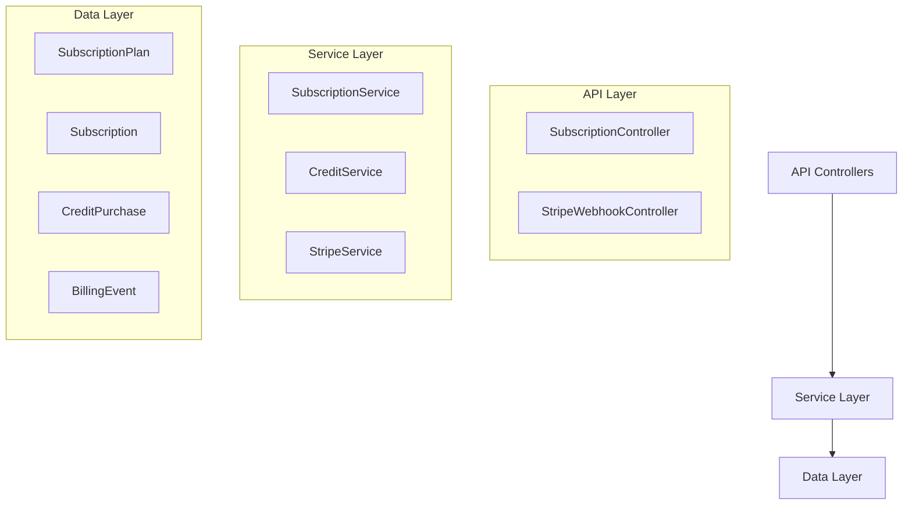
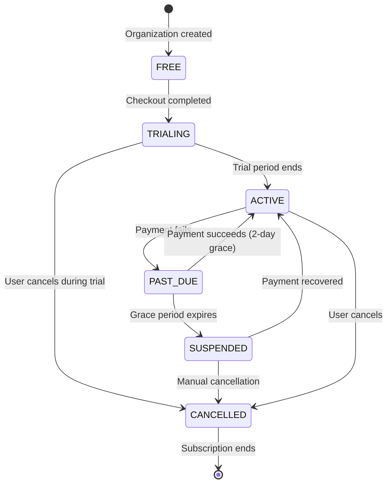

<Note>
This is the authoritative specification for PropWise CRM's subscription and billing module. All implementation details follow this canonical document.
</Note>

## Overview

The Subscription Module implements a **freemium SaaS billing system** for PropWise CRM. Every organization has a subscription tied to one of **three plan tiers** (Free / Pro / Business). The module handles:

- **Plan-based feature gating** — binary feature flags per tier
- **Resource limits** — source-aware caps on leads, contacts, deals, companies, and storage
- **Unified AI-credit wallet** — one credit balance for Propilot, AI auto-reply, and unit valuation
- **Single per-agent seat model** — one seat SKU per tier with volume pricing
- **Stripe integration** — checkout, subscription management, webhooks, billing portal
- **Evergreen 90-day trial** — Pro & Business signups get a card-upfront trial
- **Free organization ownership cap** — one user may own at most 2 active Free-plan organizations

<Info>
**Module Path:** `src/modules/subscription/`  
**Payment Gateway:** Stripe  
**Status:** Active — fully implemented
</Info>

### Design Principles

<CardGroup cols={2}>
  <Card title="Freemium Model" icon="gift">
    Free plan with limited features; paid tiers unlock progressively
  </Card>
  <Card title="Per-Organization Billing" icon="building">
    Billing is per organization; developer portal is free
  </Card>
  <Card title="Feature Flags Over Tier Checks" icon="flag">
    Gating uses `@RequiresFeature('flag')` on plan JSONB for easy updates
  </Card>
  <Card title="Stripe as Source of Truth" icon="credit-card">
    Webhook-driven lifecycle: app reacts to Stripe events rather than polling
  </Card>
</CardGroup>

## Architecture

### High-Level System Diagram



### Data Flow Patterns

<Tabs>
  <Tab title="First-time Checkout">
    ```
    Frontend "Upgrade" button
      → POST /v1/subscriptions/checkout
        → SubscriptionService.createCheckoutSession()
          → StripeService.createCheckoutSession()
            → Returns Stripe Checkout URL
              → User pays on Stripe's hosted page
                → Stripe redirects to success URL
                  → Frontend POST /v1/subscriptions/checkout/confirm
                    → Subscription entity updated to ACTIVE
    ```
  </Tab>
  <Tab title="Plan Change">
    ```
    Frontend "Change Plan" button
      → POST /v1/subscriptions/change-plan
        → SubscriptionService.changePlan()
          → Validates seat overflow
          → StripeService.swapSubscriptionPrice() — prorated
          → Updates local Subscription entity
          → Returns updated subscription
    ```
  </Tab>
  <Tab title="Payment Failure">
    ```
    Stripe charges renewal invoice
      ├─ invoice.paid → status stays ACTIVE
      └─ invoice.payment_failed → status → PAST_DUE
           └─ 2-day grace period
                ├─ Payment succeeds → back to ACTIVE
                └─ All retries fail → status → SUSPENDED
                     → Org becomes read-only
    ```
  </Tab>
</Tabs>

## Plan Tiers & Pricing

<Note>
Pricing is shown in USD. The system uses **Free/Pro/Business** tiers (Starter was removed in the latest rollout).
</Note>

### Current Plan Structure

| Feature | **Free** | **Professional** | **Business** |
|---------|----------|------------------|--------------|
| Monthly price | $0 | $149 | $399 |
| Annual price | $0 | $1,430.40 | $3,830.40 |
| Seats included | 1 | 5-10 | 10+ |
| Lead limit | 50 | 10,000 | Unlimited |
| Contact limit | 50 | 10,000 | Unlimited |
| Deal limit | 20 | 5,000 | Unlimited |
| Company limit | 10 | 2,000 | Unlimited |
| Storage | 500 MB | 25 GB | 100 GB |

### Resource Limits Implementation

<Warning>
Resource limits are **source-aware** — imports never count against caps, only manual creation and API additions.
</Warning>

The system enforces limits at the service layer using entity counts:

```typescript
// Example limit check in service method
async createLead(data: CreateLeadDto, organizationId: string) {
  await this.subscriptionService.enforceResourceLimit(
    organizationId, 
    'leads',
    'Creating lead would exceed plan limit'
  );
  // ... proceed with creation
}
```

## Feature Gating Model

### Feature Flag System

Feature gating uses a decorator-based approach with plan-specific feature flags:

<CodeGroup>
```typescript Controller Usage
@RequiresFeature('advanced_reporting')
@Get('advanced-reports')
async getAdvancedReports() {
  // Only accessible if org's plan includes 'advanced_reporting' feature
}
```

```typescript Plan Configuration
{
  "tier": "PROFESSIONAL",
  "features": {
    "advanced_reporting": true,
    "ai_assistant": true,
    "custom_fields": true,
    "api_access": false
  }
}
```

```typescript Guard Implementation
@Injectable()
export class FeatureGuard implements CanActivate {
  canActivate(context: ExecutionContext): boolean {
    const feature = this.reflector.get('feature', context.getHandler());
    const org = context.switchToHttp().getRequest().organization;
    return this.subscriptionService.hasFeature(org.id, feature);
  }
}
```
</CodeGroup>

### Available Features by Tier

<AccordionGroup>
  <Accordion title="Free Tier Features">
    - Basic CRM functionality
    - Contact management
    - Simple reporting
    - Email integration (limited)
  </Accordion>
  
  <Accordion title="Professional Tier Features">
    - All Free features
    - Advanced reporting and analytics
    - AI assistant (Propilot)
    - Custom fields and forms
    - Email automation
    - Third-party integrations
  </Accordion>
  
  <Accordion title="Business Tier Features">
    - All Professional features
    - Full API access
    - Advanced workflow automation
    - Priority support
    - Custom integrations
    - White-label options
  </Accordion>
</AccordionGroup>

## Seat Management

### Single Seat Model

<Info>
The system uses a **single per-agent seat model** where every user consumes one seat regardless of their role.
</Info>

### Seat Allocation Rules

- **Pro Plan**: 5-10 seats included
  - 11th user triggers automatic upgrade to Business
- **Business Plan**: 10+ seats with volume pricing
- **Seat overrides**: Admins can temporarily exceed limits during transition periods

### Seat Validation

<Steps>
  <Step title="User Invitation">
    System checks if adding the user would exceed seat limits
  </Step>
  <Step title="Plan Change Validation">
    Prevents downgrade if current users exceed new plan capacity
  </Step>
  <Step title="Automatic Upgrades">
    Pro plans automatically upgrade to Business when exceeding 10 seats
  </Step>
</Steps>

## Credit System

### Unified AI Credit Wallet

<Note>
The system uses a **unified credit wallet** where one balance serves all AI features: Propilot, AI auto-reply, and unit valuation.
</Note>

### Credit Consumption Model

| Feature | Cost per Action | User Ceiling |
|---------|----------------|--------------|
| Propilot query | 1 credit | 50/day |
| AI auto-reply | 2 credits | 25/day |
| Unit valuation | 3 credits | 10/day |

### Credit Purchase System

<CodeGroup>
```typescript Credit Pack Purchase
POST /v1/subscriptions/credits/purchase
{
  "packId": "pack_100_credits",
  "organizationId": "org_123"
}
```

```typescript Credit Consumption
async consumeCredits(
  organizationId: string,
  feature: 'propilot' | 'auto_reply' | 'valuation',
  amount: number
) {
  // FIFO consumption with per-user daily limits
  return this.creditService.consume(organizationId, feature, amount);
}
```
</CodeGroup>

## Entity Specifications

### Core Entities

<Tabs>
  <Tab title="Subscription">
    ```typescript
    @Entity()
    export class Subscription {
      @PrimaryKey()
      id: string;

      @ManyToOne(() => Organization)
      organization: Organization;

      @ManyToOne(() => SubscriptionPlan)
      plan: SubscriptionPlan;

      @Property()
      status: SubscriptionStatus; // ACTIVE, PAST_DUE, SUSPENDED, etc.

      @Property()
      stripeSubscriptionId?: string;

      @Property()
      currentPeriodStart: Date;

      @Property()
      currentPeriodEnd: Date;

      @Property({ type: JsonType })
      metadata: Record<string, any>;
    }
    ```
  </Tab>

  <Tab title="SubscriptionPlan">
    ```typescript
    @Entity()
    export class SubscriptionPlan {
      @PrimaryKey()
      id: string;

      @Property()
      tier: PlanTier; // FREE, PROFESSIONAL, BUSINESS

      @Property()
      name: string;

      @Property({ type: JsonType })
      features: Record<string, boolean>;

      @Property({ type: JsonType })
      limits: ResourceLimits;

      @Property()
      monthlyPrice: number; // cents

      @Property()
      annualPrice: number; // cents
    }
    ```
  </Tab>

  <Tab title="CreditPurchase">
    ```typescript
    @Entity()
    export class CreditPurchase {
      @PrimaryKey()
      id: string;

      @ManyToOne(() => Organization)
      organization: Organization;

      @Property()
      amount: number;

      @Property()
      remaining: number;

      @Property()
      purchaseDate: Date;

      @Property()
      expiryDate: Date;

      @Property()
      stripeInvoiceId?: string;
    }
    ```
  </Tab>
</Tabs>

## Stripe Integration

### Webhook Event Handling

<Warning>
All Stripe webhooks are idempotent using `BillingEvent` entity with unique `stripeEventId` to prevent duplicate processing.
</Warning>

### Supported Webhooks

<AccordionGroup>
  <Accordion title="checkout.session.completed">
    Handles first-time subscription activation from checkout flow
    
    ```typescript
    async handleCheckoutSessionCompleted(event: Stripe.Event) {
      const session = event.data.object as Stripe.Checkout.Session;
      await this.subscriptionService.fulfillCheckoutSession(session.id);
    }
    ```
  </Accordion>

  <Accordion title="invoice.paid">
    Updates subscription period and maintains ACTIVE status
    
    ```typescript
    async handleInvoicePaid(event: Stripe.Event) {
      const invoice = event.data.object as Stripe.Invoice;
      await this.subscriptionService.handleSuccessfulPayment(invoice);
    }
    ```
  </Accordion>

  <Accordion title="invoice.payment_failed">
    Initiates grace period and eventual suspension flow
    
    ```typescript
    async handleInvoicePaymentFailed(event: Stripe.Event) {
      const invoice = event.data.object as Stripe.Invoice;
      await this.subscriptionService.handlePaymentFailure(invoice);
    }
    ```
  </Accordion>

  <Accordion title="customer.subscription.updated">
    Handles subscription status changes and cancellations
    
    ```typescript
    async handleSubscriptionUpdated(event: Stripe.Event) {
      const subscription = event.data.object as Stripe.Subscription;
      await this.subscriptionService.syncSubscriptionStatus(subscription);
    }
    ```
  </Accordion>
</AccordionGroup>

### Checkout Session Configuration

```typescript
const checkoutSession = await stripe.checkout.sessions.create({
  mode: 'subscription',
  customer: organization.stripeCustomerId,
  line_items: [{
    price: stripePriceId,
    quantity: 1
  }],
  subscription_data: {
    metadata: {
      organizationId: organization.id,
      planTier: targetTier,
      billingCycle: cycle
    },
    trial_period_days: 90 // Evergreen trial for Pro/Business
  },
  success_url: `${config.frontend.baseUrl}/billing/success?session_id={CHECKOUT_SESSION_ID}`,
  cancel_url: `${config.frontend.baseUrl}/billing/cancel`
});
```

## Subscription Lifecycle

### Lifecycle States



### State Behaviors

<CardGroup cols={2}>
  <Card title="ACTIVE" icon="check-circle">
    Full access to all plan features and resources. Normal operation state.
  </Card>
  <Card title="TRIALING" icon="clock">
    90-day trial period with full plan access. Card on file required.
  </Card>
  <Card title="PAST_DUE" icon="exclamation-triangle">
    2-day grace period. Full access maintained while Stripe retries payment.
  </Card>
  <Card title="SUSPENDED" icon="ban">
    Read-only mode. Organization data preserved but write operations blocked.
  </Card>
</CardGroup>

## Plan Changes & Upgrades

### Immediate vs Deferred Changes

<Tip>
**Tier changes** (Free → Pro, Pro → Business) are immediate and prorated. **Billing cycle switches** (Monthly ↔ Annual) are deferred to period end.
</Tip>

### Plan Change Validation

<Steps>
  <Step title="Seat Overflow Check">
    Ensure current user count doesn't exceed new plan limits
  </Step>
  <Step title="Feature Compatibility">
    Validate that current usage is compatible with new plan features
  </Step>
  <Step title="Stripe Subscription Update">
    Update Stripe subscription with new pricing and proration
  </Step>
  <Step title="Local State Sync">
    Update local subscription entity to match Stripe state
  </Step>
</Steps>

### Proration Logic

```typescript
// Immediate tier change with proration
async changePlanTier(subscriptionId: string, newTier: PlanTier) {
  const subscription = await stripe.subscriptions.update(subscriptionId, {
    items: [{
      id: currentLineItemId,
      price: newTierPriceId,
    }],
    proration_behavior: 'create_prorations',
    billing_cycle_anchor_unchanged: true
  });
  
  // Update local state immediately
  await this.syncLocalSubscription(subscription);
}

// Deferred billing cycle change
async changeBillingCycle(subscriptionId: string, newCycle: BillingCycle) {
  await stripe.subscriptionSchedules.create({
    from_subscription: subscriptionId,
    phases: [{
      items: [{ price: currentPriceId }],
      end_date: currentPeriodEnd
    }, {
      items: [{ price: newCyclePriceId }],
      iterations: null // Continue indefinitely
    }]
  });
}
```

## API Endpoints

### Subscription Management

<CodeGroup>
```http GET Current Subscription
GET /v1/subscriptions/current
Authorization: Bearer {token}

Response:
{
  "subscription": {
    "id": "sub_123",
    "status": "ACTIVE",
    "plan": {
      "tier": "PROFESSIONAL",
      "name": "Professional Plan",
      "features": {...},
      "limits": {...}
    },
    "currentPeriodEnd": "2024-02-01T00:00:00Z",
    "seatsUsed": 8,
    "seatsIncluded": 10
  }
}
```

```http POST Create Checkout
POST /v1/subscriptions/checkout
Content-Type: application/json
Authorization: Bearer {token}

{
  "planTier": "PROFESSIONAL",
  "billingCycle": "MONTHLY"
}

Response:
{
  "checkoutUrl": "https://checkout.stripe.com/pay/cs_test_...",
  "sessionId": "cs_test_..."
}
```

```http POST Change Plan
POST /v1/subscriptions/change-plan
Content-Type: application/json
Authorization: Bearer {token}

{
  "targetTier": "BUSINESS",
  "billingCycle": "ANNUAL"
}

Response:
{
  "subscription": {...},
  "prorationAmount": 15000,
  "effectiveDate": "2024-01-15T10:30:00Z"
}
```
</CodeGroup>

### Credit Management

<CodeGroup>
```http GET Credit Balance
GET /v1/subscriptions/credits/balance
Authorization: Bearer {token}

Response:
{
  "totalCredits": 1500,
  "availableCredits": 750,
  "dailyUsage": {
    "propilot": 25,
    "autoReply": 10,
    "valuation": 5
  },
  "dailyLimits": {
    "propilot": 50,
    "autoReply": 25,
    "valuation": 10
  }
}
```

```http POST Purchase Credits
POST /v1/subscriptions/credits/purchase
Content-Type: application/json
Authorization: Bearer {token}

{
  "packId": "pack_100_credits"
}

Response:
{
  "checkoutUrl": "https://checkout.stripe.com/pay/cs_test_...",
  "packDetails": {
    "credits": 100,
    "price": 1000,
    "expiryDays": 365
  }
}
```
</CodeGroup>

## Guards & Decorators

### Feature Access Control

<CodeGroup>
```typescript @RequiresFeature Decorator
@Controller('reports')
export class ReportsController {
  @Get('advanced')
  @RequiresFeature('advanced_reporting')
  async getAdvancedReports() {
    // Only accessible if org plan includes advanced_reporting
  }
}
```

```typescript @RequiresSubscriptionStatus Decorator
@Controller('api')
export class ApiController {
  @Post('data')
  @RequiresSubscriptionStatus('ACTIVE')
  async createData() {
    // Only accessible if subscription is active
  }
}
```

```typescript Custom Resource Guard
@Injectable()
export class LeadLimitGuard implements CanActivate {
  constructor(private subscriptionService: SubscriptionService) {}

  async canActivate(context: ExecutionContext): Promise<boolean> {
    const request = context.switchToHttp().getRequest();
    const orgId = request.organization.id;
    
    return this.subscriptionService.canCreateResource(orgId, 'leads');
  }
}
```
</CodeGroup>

### Enforcement Points

<AccordionGroup>
  <Accordion title="Service Layer Enforcement">
    Resource limits and credit consumption checked in service methods
    
    ```typescript
    async createLead(data: CreateLeadDto, organizationId: string) {
      // Check resource limits
      await this.subscriptionService.enforceResourceLimit(
        organizationId, 
        'leads'
      );
      
      // Proceed with creation
      return this.leadRepository.create(data);
    }
    ```
  </Accordion>

  <Accordion title="Controller Guard Enforcement">
    Feature flags and subscription status checked at route level
    
    ```typescript
    @UseGuards(SubscriptionActiveGuard, FeatureGuard)
    @RequiresFeature('api_access')
    @Post('webhook')
    async createWebhook() {
      // Only for active subs with API access feature
    }
    ```
  </Accordion>

  <Accordion title="Frontend Enforcement">
    UI elements conditionally rendered based on plan features
    
    ```typescript
    const { hasFeature } = useSubscription();
    
    return (
      <div>
        {hasFeature('advanced_reporting') && (
          <AdvancedReportsButton />
        )}
      </div>
    );
    ```
  </Accordion>
</AccordionGroup>

## Environment Configuration

### Required Environment Variables

```bash
# Stripe Configuration
STRIPE_SECRET_KEY=sk_test_...
STRIPE_PUBLISHABLE_KEY=pk_test_...
STRIPE_WEBHOOK_SECRET=whsec_...

# Feature Flags
SUBSCRIPTION_MODULE_ENABLED=true
CREDIT_SYSTEM_ENABLED=true

# Pricing Configuration  
DEFAULT_CURRENCY=USD
BILLING_PORTAL_ENABLED=true

# Trial Configuration
DEFAULT_TRIAL_DAYS=90
GRACE_PERIOD_DAYS=2
```

### Graceful Degradation

<Warning>
If `STRIPE_SECRET_KEY` is not set, billing features become unavailable but the application still starts. All organizations default to FREE plan.
</Warning>

```typescript
@Injectable()
export class StripeService {
  constructor() {
    if (!process.env.STRIPE_SECRET_KEY) {
      console.warn('Stripe not configured - billing features disabled');
      this.enabled = false;
    }
  }

  async createCheckoutSession(...args) {
    if (!this.enabled) {
      throw new Error('Billing features are not available');
    }
    // ... stripe logic
  }
}
```

## Integration with Other Modules

### Organization Module

- **Ownership limits**: Free plan users limited to 2 owned organizations
- **Provisioning**: New organizations get FREE subscription by default
- **Deletion**: Subscription cancellation doesn't delete organization data

### User Module

- **Seat consumption**: Every user consumes one seat regardless of role
- **Invitation limits**: Seat availability checked during user invitations
- **Permission integration**: Some features gated by both RBAC and subscription

### Notification Module

- **Billing alerts**: Payment failures trigger notifications to admins
- **Limit warnings**: Near-limit usage triggers upgrade prompts
- **Feature announcements**: New plan features announced to eligible users

<Tip>
The subscription module integrates seamlessly with PropWise CRM's modular architecture while maintaining clear separation of concerns.
</Tip>