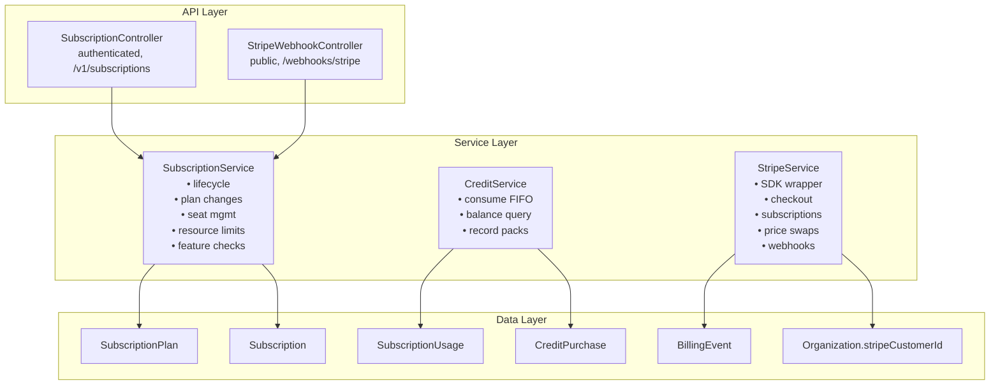
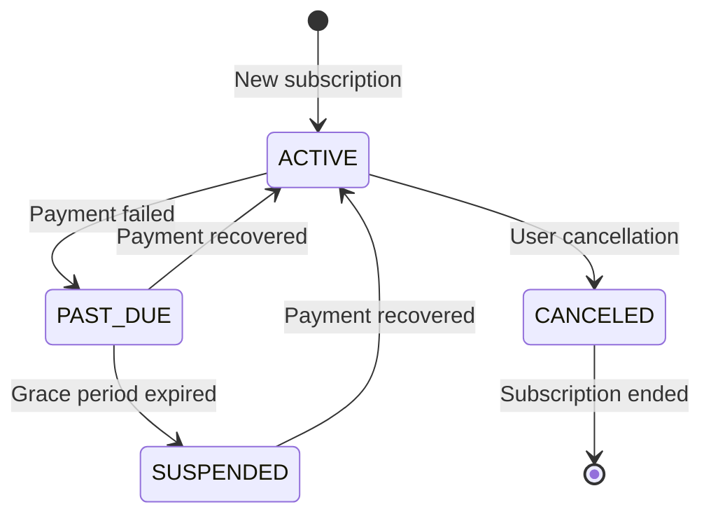

# Comprehensive Module Specification

<Info>
**Status:** Active — fully implemented  
**Module Path:** `src/modules/subscription/`  
**Payment Gateway:** Stripe
</Info>

## Overview

The Subscription Module implements a **freemium SaaS billing system** for PropWise CRM. Every organization has a subscription tied to one of four plan tiers. The module handles:

- **Plan-based feature gating** — binary feature flags per tier
- **Resource limits** — caps on leads, contacts, deals, companies, and storage
- **Credit-based metering** — monthly AI and messaging allowances with purchasable top-ups
- **Dual seat types** — manager seats and agent seats with per-tier pricing; every user consumes a seat
- **Stripe integration** — checkout, subscription management, mid-cycle plan changes, webhooks, billing portal
- **Free organization ownership cap** — one user may own at most 2 active Free-plan organizations
- **Proration** — mid-cycle upgrades, downgrades, and seat changes are prorated to the day
- **Suspension flow** — 2-day grace period on payment failure, then org goes read-only

### Design Principles

<AccordionGroup>
  <Accordion title="Core Design Decisions">
    | Principle | Decision |
    |-----------|----------|
    | Freemium model | Free plan with limited features; paid tiers unlock progressively |
    | Per-org billing | Billing is per organization; developer portal is free |
    | Dual seat types | Manager seats (Owner, Admin) and agent seats (Basic, custom roles); every user consumes a seat |
    | Seat type derived from role | No explicit seat assignment — seat type is automatically determined by the user's RBAC role |
    | Feature flags over tier checks | Gating uses `@RequiresFeature('flag')` on plan JSONB — changing what a tier includes requires only a seeder update, not code changes |
    | Service-layer limit enforcement | Resource limits and credit consumption are checked in service methods, not guards, because they need entity counts |
  </Accordion>

  <Accordion title="Advanced Implementation Principles">
    | Principle | Decision |
    |-----------|----------|
    | Free-org creation protection | `POST /v1/organizations` locks the owner row, counts owned Free-plan orgs (missing subscription rows count as Free), and rejects the third active free workspace |
    | Stripe as source of truth for payments | Webhook-driven lifecycle: the app reacts to Stripe events rather than polling |
    | Prorated plan changes | All mid-cycle changes (upgrade, downgrade, add/remove seats) use `proration_behavior: 'create_prorations'` — charges are fair to the day |
    | Checkout vs. change-plan separation | `POST /checkout` is for first-time subscription (Free → Paid); `POST /change-plan` is for switching between paid tiers |
    | Idempotent webhooks | Every Stripe event is logged in `BillingEvent` with a unique `stripeEventId` to prevent duplicate processing |
    | Graceful degradation | If `app.stripe.secretKey` (`STRIPE_SECRET_KEY`) is not set, billing features are unavailable but the app still starts |
  </Accordion>
</AccordionGroup>

## Architecture

### High-Level System Diagram



### Data Flow Patterns

<Tabs>
  <Tab title="First-time Checkout">
    <Steps>
      <Step title="User clicks 'Upgrade' button">
        Frontend initiates the checkout process
      </Step>
      <Step title="POST /v1/subscriptions/checkout">
        - Rejects if org already has a Stripe subscription (use change-plan instead)
        - SubscriptionService.createCheckoutSession()
        - StripeService.createCheckoutSession()
        - Returns Stripe Checkout URL
      </Step>
      <Step title="Payment on Stripe">
        User completes payment on Stripe's hosted page
      </Step>
      <Step title="Redirect and confirmation">
        - Stripe redirects to success URL with `session_id={CHECKOUT_SESSION_ID}`
        - Frontend POST /v1/subscriptions/checkout/confirm { sessionId }
        - SubscriptionService.fulfillCheckoutSession() (idempotent with webhook)
        - Subscription entity updated to ACTIVE
      </Step>
      <Step title="Webhook processing">
        (async) Stripe fires checkout.session.completed webhook
        - StripeWebhookController → activateSubscription() (same activation path)
      </Step>
    </Steps>
  </Tab>

  <Tab title="Plan Change">
    <Steps>
      <Step title="User clicks 'Change Plan' button">
        Frontend initiates plan change for existing paid subscription
      </Step>
      <Step title="POST /v1/subscriptions/change-plan">
        - SubscriptionService.changePlan()
        - Validates seat overflow (blocks if current users exceed new plan capacity)
        - StripeService.swapSubscriptionPrice() — prorated
        - Reconciles seat line items (old tier price → new tier price)
        - Updates local Subscription entity
        - Returns updated subscription immediately
      </Step>
    </Steps>
  </Tab>

  <Tab title="Payment Failure">
    <Steps>
      <Step title="Stripe charges renewal invoice">
        Automatic billing cycle renewal
      </Step>
      <Step title="Handle payment result">
        **Success:** invoice.paid → handleInvoicePaid() → status stays ACTIVE, period updated
        
        **Failure:** invoice.payment_failed → handleInvoicePaymentFailed() → status → PAST_DUE
      </Step>
      <Step title="Retry period">
        Stripe retries for 2 days
        - Payment succeeds → invoice.paid → back to ACTIVE
        - All retries fail → customer.subscription.updated (status: unpaid)
      </Step>
      <Step title="Suspension">
        handleSubscriptionUpdated() → status → SUSPENDED
        - Org is read-only (SubscriptionActiveGuard blocks writes)
      </Step>
    </Steps>
  </Tab>
</Tabs>

## Plan Tiers & Pricing

### Pricing Structure

<Note>
All prices are in USD cents for Stripe integration
</Note>

| Plan | Monthly Price | Annual Price | Manager Seats | Agent Seats |
|------|---------------|--------------|---------------|-------------|
| **Free** | $0 | $0 | 1 included | 0 included |
| **Starter** | $49 | $470.40 (~20% off) | 2 included | 3 included |
| **Professional** | $149 | $1,430.40 | 5 included | 15 included |
| **Business** | $399 | $3,830.40 | 10 included | 40 included |

### Additional Seat Pricing

| Plan | Extra Manager Seat | Extra Agent Seat |
|------|-------------------|------------------|
| **Free** | — | — |
| **Starter** | $25/mo | $12/mo |
| **Professional** | $20/mo | $10/mo |
| **Business** | $18/mo | $8/mo |

### Resource Limits

<CardGroup cols={2}>
  <Card title="Entity Limits" icon="database">
    | Resource | Free | Starter | Professional | Business |
    |----------|------|---------|--------------|----------|
    | Leads | 50 | 1,000 | 10,000 | Unlimited |
    | Contacts | 50 | 1,000 | 10,000 | Unlimited |
    | Deals | 20 | 500 | 5,000 | Unlimited |
    | Companies | 10 | 200 | 2,000 | Unlimited |
  </Card>
  
  <Card title="Storage Limits" icon="hard-drive">
    | Plan | Storage Limit |
    |------|---------------|
    | Free | 500 MB |
    | Starter | 5 GB |
    | Professional | 25 GB |
    | Business | 100 GB |
  </Card>
</CardGroup>

### Free Organization Ownership Limit

<Warning>
Each user may own **2 active Free-plan organizations** maximum. This cap applies only to organizations where the user is the owner; invited/member workspaces do not count.
</Warning>

<AccordionGroup>
  <Accordion title="Enforcement Details">
    - An organization counts as Free only when its `subscription` row's plan tier is `FREE`
    - Every organization must have exactly one subscription row
    - `ProvisioningService` creates a FREE subscription at org creation
    - `Migration20260526170000_BackfillMissingOrganizationSubscriptions` backfills legacy gaps
    - `SubscriptionService.ensureFreeSubscriptionsForOrganizationsInTransaction()` self-heals any remaining missing rows
    - Missing rows are **not** silently treated as Free for the ownership cap
  </Accordion>

  <Accordion title="Backend Enforcement">
    Backend enforcement lives in `OrganizationService.create()` and calls `SubscriptionService.getFreeOrganizationOwnershipLimitStatusInTransaction()` inside the same bypass transaction. The service pessimistically locks the owner `User` row before counting, so concurrent `POST /v1/organizations` requests cannot both pass the limit check.

    When the cap is reached, `POST /v1/organizations` returns **400** with:

    ```json
    {
      "errorCode": "FREE_ORGANIZATION_LIMIT_REACHED",
      "message": "Human-readable copy (includes the numeric limit)",
      "limit": 2,
      "currentCount": 2
    }
    ```

    <Tip>
    Clients should key off `errorCode` and `limit` rather than parsing `message`.
    </Tip>
  </Accordion>
</AccordionGroup>

## Feature Gating Model

### Feature Flag System

The subscription module uses a JSONB-based feature gating system where each plan tier has specific features enabled or disabled.

<CodeGroup>
```typescript Feature Check Guard
@RequiresFeature('advanced_reporting')
@Get('/reports/advanced')
async getAdvancedReports() {
  // This endpoint is only accessible if the organization's 
  // subscription plan includes 'advanced_reporting' feature
}
```

```typescript Service Layer Check
async createAutomation() {
  const hasFeature = await this.subscriptionService
    .checkFeature('workflow_automation');
  
  if (!hasFeature) {
    throw new ForbiddenException('Feature not available in current plan');
  }
}
```
</CodeGroup>

### Feature Matrix

<Tabs>
  <Tab title="Core Features">
    | Feature | Free | Starter | Professional | Business |
    |---------|------|---------|--------------|----------|
    | Basic CRM | ✅ | ✅ | ✅ | ✅ |
    | Contact Management | ✅ | ✅ | ✅ | ✅ |
    | Deal Pipeline | ✅ | ✅ | ✅ | ✅ |
    | Email Integration | ❌ | ✅ | ✅ | ✅ |
    | Calendar Sync | ❌ | ✅ | ✅ | ✅ |
  </Tab>

  <Tab title="Advanced Features">
    | Feature | Free | Starter | Professional | Business |
    |---------|------|---------|--------------|----------|
    | Advanced Reporting | ❌ | ❌ | ✅ | ✅ |
    | Workflow Automation | ❌ | ❌ | ✅ | ✅ |
    | API Access | ❌ | ❌ | ✅ | ✅ |
    | Custom Fields | ❌ | ❌ | ✅ | ✅ |
    | White Labeling | ❌ | ❌ | ❌ | ✅ |
  </Tab>

  <Tab title="AI & Integration">
    | Feature | Free | Starter | Professional | Business |
    |---------|------|---------|--------------|----------|
    | AI Insights | ❌ | ✅ | ✅ | ✅ |
    | SMS Messaging | ❌ | ✅ | ✅ | ✅ |
    | Webhooks | ❌ | ❌ | ✅ | ✅ |
    | SSO/SAML | ❌ | ❌ | ❌ | ✅ |
    | Priority Support | ❌ | ❌ | ✅ | ✅ |
  </Tab>
</Tabs>

## Seat Management

### Seat Type Classification

<Info>
Seat types are automatically determined by the user's RBAC role — no explicit seat assignment is required.
</Info>

<CardGroup cols={2}>
  <Card title="Manager Seats" icon="user-crown">
    - **Owner** role
    - **Admin** role
    - Higher pricing tier
    - Full administrative access
  </Card>
  
  <Card title="Agent Seats" icon="user">
    - **Basic** role
    - Custom roles (non-admin)
    - Lower pricing tier
    - Limited permissions
  </Card>
</CardGroup>

### Seat Calculation Logic

<Steps>
  <Step title="Role-based determination">
    When a user is added to an organization, their seat type is automatically determined by their assigned role.
  </Step>
  <Step title="Capacity validation">
    Before adding users, the system checks if the current plan has available seats of the required type.
  </Step>
  <Step title="Automatic billing adjustment">
    When seat usage exceeds included limits, additional seats are automatically billed at the per-seat rate.
  </Step>
  <Step title="Proration handling">
    Mid-cycle seat changes are prorated to the day using Stripe's proration system.
  </Step>
</Steps>

## Credit System

### Credit Types & Monthly Allowances

| Credit Type | Free | Starter | Professional | Business |
|-------------|------|---------|--------------|----------|
| AI Credits | 10 | 100 | 500 | 1,500 |
| SMS Credits | 0 | 50 | 200 | 1,000 |
| Email Credits | 100 | 1,000 | 5,000 | 25,000 |

### Credit Consumption Model

<Note>
Credits are consumed using a **FIFO (First In, First Out)** system. Monthly allowances are consumed before purchased credit packs.
</Note>

<Tabs>
  <Tab title="Consumption Order">
    <Steps>
      <Step title="Monthly allowance first">
        Credits from the current monthly allocation are used first
      </Step>
      <Step title="Oldest purchased credits">
        Once monthly credits are exhausted, the oldest purchased credit packs are consumed
      </Step>
      <Step title="Expiration handling">
        Purchased credits may have expiration dates and are automatically removed when expired
      </Step>
    </Steps>
  </Tab>

  <Tab title="Credit Purchase">
    ```typescript
    // Credit pack structure
    interface CreditPurchase {
      id: string;
      organizationId: string;
      creditType: 'AI' | 'SMS' | 'EMAIL';
      amount: number;
      cost: number; // in cents
      purchasedAt: Date;
      expiresAt?: Date;
      remainingCredits: number;
      stripePaymentIntentId?: string;
    }
    ```
  </Tab>

  <Tab title="Usage Tracking">
    ```typescript
    // Usage tracking entity
    interface SubscriptionUsage {
      id: string;
      subscriptionId: string;
      period: Date; // YYYY-MM-01 for monthly periods
      aiCreditsUsed: number;
      smsCreditsUsed: number;
      emailCreditsUsed: number;
      lastUpdated: Date;
    }
    ```
  </Tab>
</Tabs>

## Entity Specifications

### Core Entities

<AccordionGroup>
  <Accordion title="SubscriptionPlan">
    ```typescript
    @Entity()
    export class SubscriptionPlan {
      @PrimaryKey()
      id!: string;

      @Property()
      name!: string; // 'FREE', 'STARTER', 'PROFESSIONAL', 'BUSINESS'

      @Property()
      displayName!: string;

      @Property()
      monthlyPrice!: number; // in cents

      @Property()
      annualPrice!: number; // in cents

      @Property()
      managerSeatsIncluded!: number;

      @Property()
      agentSeatsIncluded!: number;

      @Property()
      managerSeatPrice!: number; // in cents

      @Property()
      agentSeatPrice!: number; // in cents

      @Property({ type: 'jsonb' })
      features!: Record<string, boolean>;

      @Property({ type: 'jsonb' })
      limits!: {
        leads: number | null; // null = unlimited
        contacts: number | null;
        deals: number | null;
        companies: number | null;
        storage: number; // in bytes
      };

      @Property({ type: 'jsonb' })
      monthlyCredits!: {
        ai: number;
        sms: number;
        email: number;
      };

      @Property()
      stripePriceIdMonthly?: string;

      @Property()
      stripePriceIdAnnual?: string;

      @Property()
      stripePriceIdManagerSeat?: string;

      @Property()
      stripePriceIdAgentSeat?: string;

      @Property()
      isActive!: boolean;

      @Property()
      sortOrder!: number;
    }
    ```
  </Accordion>

  <Accordion title="Subscription">
    ```typescript
    @Entity()
    export class Subscription {
      @PrimaryKey()
      id!: string;

      @ManyToOne(() => Organization)
      organization!: Organization;

      @ManyToOne(() => SubscriptionPlan)
      plan!: SubscriptionPlan;

      @Enum(() => SubscriptionStatus)
      status!: SubscriptionStatus;

      @Property()
      billingInterval!: 'MONTHLY' | 'ANNUAL';

      @Property()
      currentPeriodStart!: Date;

      @Property()
      currentPeriodEnd!: Date;

      @Property()
      stripeSubscriptionId?: string;

      @Property()
      stripeCustomerId?: string;

      @Property()
      cancelAtPeriodEnd!: boolean;

      @Property()
      canceledAt?: Date;

      @Property()
      trialEnd?: Date;

      @Property()
      managerSeats!: number;

      @Property()
      agentSeats!: number;

      @Property()
      createdAt!: Date;

      @Property()
      updatedAt!: Date;
    }

    export enum SubscriptionStatus {
      ACTIVE = 'ACTIVE',
      PAST_DUE = 'PAST_DUE',
      CANCELED = 'CANCELED',
      SUSPENDED = 'SUSPENDED'
    }
    ```
  </Accordion>

  <Accordion title="CreditPurchase">
    ```typescript
    @Entity()
    export class CreditPurchase {
      @PrimaryKey()
      id!: string;

      @ManyToOne(() => Organization)
      organization!: Organization;

      @Enum(() => CreditType)
      creditType!: CreditType;

      @Property()
      amount!: number;

      @Property()
      cost!: number; // in cents

      @Property()
      remainingCredits!: number;

      @Property()
      purchasedAt!: Date;

      @Property()
      expiresAt?: Date;

      @Property()
      stripePaymentIntentId?: string;

      @Property()
      description?: string;
    }

    export enum CreditType {
      AI = 'AI',
      SMS = 'SMS',
      EMAIL = 'EMAIL'
    }
    ```
  </Accordion>

  <Accordion title="BillingEvent">
    ```typescript
    @Entity()
    export class BillingEvent {
      @PrimaryKey()
      id!: string;

      @Property()
      stripeEventId!: string; // Unique constraint for idempotency

      @Property()
      eventType!: string; // e.g., 'invoice.paid', 'customer.subscription.updated'

      @Property({ type: 'jsonb' })
      eventData!: any; // Raw Stripe event data

      @Property()
      processed!: boolean;

      @Property()
      processedAt?: Date;

      @Property()
      errorMessage?: string;

      @Property()
      createdAt!: Date;

      @ManyToOne(() => Organization, { nullable: true })
      organization?: Organization;
    }
    ```
  </Accordion>
</AccordionGroup>

## Stripe Integration

### Webhook Configuration

<Warning>
All Stripe webhooks must be configured to point to `/webhooks/stripe` endpoint. The webhook signing secret must be set in the `STRIPE_WEBHOOK_SECRET` environment variable.
</Warning>

#### Required Webhook Events

<CodeGroup>
```json Subscription Events
[
  "customer.subscription.created",
  "customer.subscription.updated", 
  "customer.subscription.deleted",
  "invoice.paid",
  "invoice.payment_failed",
  "checkout.session.completed"
]
```

```json Payment Events  
[
  "payment_intent.succeeded",
  "payment_intent.payment_failed",
  "invoice.payment_action_required"
]
```
</CodeGroup>

### Stripe Service Methods

<Tabs>
  <Tab title="Checkout Sessions">
    ```typescript
    class StripeService {
      async createCheckoutSession(params: {
        customerId?: string;
        priceId: string;
        quantity?: number;
        successUrl: string;
        cancelUrl: string;
        metadata?: Record<string, string>;
      }): Promise<Stripe.Checkout.Session> {
        return this.stripe.checkout.sessions.create({
          customer: params.customerId,
          line_items: [{
            price: params.priceId,
            quantity: params.quantity || 1,
          }],
          mode: 'subscription',
          success_url: params.successUrl,
          cancel_url: params.cancelUrl,
          metadata: params.metadata,
          allow_promotion_codes: true,
        });
      }
    }
    ```
  </Tab>

  <Tab title="Subscription Management">
    ```typescript
    async swapSubscriptionPrice(
      subscriptionId: string,
      newPriceId: string,
      quantity: number = 1
    ): Promise<Stripe.Subscription> {
      const subscription = await this.stripe.subscriptions.retrieve(subscriptionId);
      
      return this.stripe.subscriptions.update(subscriptionId, {
        items: [{
          id: subscription.items.data[0].id,
          price: newPriceId,
          quantity,
        }],
        proration_behavior: 'create_prorations',
      });
    }
    ```
  </Tab>

  <Tab title="Customer Portal">
    ```typescript
    async createCustomerPortalSession(
      customerId: string,
      returnUrl: string
    ): Promise<Stripe.BillingPortal.Session> {
      return this.stripe.billingPortal.sessions.create({
        customer: customerId,
        return_url: returnUrl,
      });
    }
    ```
  </Tab>
</Tabs>

## Subscription Lifecycle

### State Transitions



<AccordionGroup>
  <Accordion title="ACTIVE State">
    - Subscription is current and paid
    - All features and resources are available according to plan
    - Organization can perform all operations
    - Automatic renewal will be attempted at period end
  </Accordion>

  <Accordion title="PAST_DUE State">
    - Payment failed but still within grace period (2 days)
    - Organization remains functional with warning notifications
    - Stripe continues retry attempts
    - Users can update payment methods
  </Accordion>

  <Accordion title="SUSPENDED State">
    - Grace period expired, all retry attempts failed
    - Organization becomes read-only
    - Users can view data but cannot create/edit
    - Subscription can be reactivated by successful payment
  </Accordion>

  <Accordion title="CANCELED State">
    - User initiated cancellation
    - Subscription will end at current period end
    - No automatic renewal
    - Organization remains functional until period expires
  </Accordion>
</AccordionGroup>

## Plan Changes (Upgrade / Downgrade)

### Validation Rules

<Steps>
  <Step title="Seat overflow check">
    Before any plan change, validate that current active users don't exceed the new plan's seat limits
  </Step>
  <Step title="Feature compatibility">
    Warn users about features that will be disabled in the target plan
  </Step>
  <Step title="Resource limits">
    Check if current resource usage exceeds new plan limits
  </Step>
  <Step title="Credit preservation">
    Purchased credits are preserved during plan changes
  </Step>
</Steps>

### Proration Logic

<Note>
All mid-cycle changes use Stripe's `proration_behavior: 'create_prorations'` to ensure fair billing.
</Note>

<Tabs>
  <Tab title="Upgrade Scenario">
    ```typescript
    // User upgrades from Starter ($49/mo) to Professional ($149/mo)
    // 15 days into a 30-day billing period

    // Proration calculation:
    // - Credit for unused Starter time: $49 * 15/30 = $24.50
    // - Charge for Professional time: $149 * 15/30 = $74.50  
    // - Net charge: $74.50 - $24.50 = $50.00
    ```
  </Tab>

  <Tab title="Downgrade Scenario">
    ```typescript
    // User downgrades from Professional ($149/mo) to Starter ($49/mo)
    // 10 days into a 30-day billing period

    // Proration calculation:
    // - Credit for unused Professional time: $149 * 20/30 = $99.33
    // - Charge for Starter time: $49 * 20/30 = $32.67
    // - Net credit: $99.33 - $32.67 = $66.66 (applied to next invoice)
    ```
  </Tab>
</Tabs>

## API Endpoints

### Subscription Management

<CodeGroup>
```typescript GET /v1/subscriptions/current
/**
 * Get current organization's subscription details
 * @returns Current subscription with plan details, usage, and billing info
 */
@Get('/current')
@RequiresAuth()
async getCurrentSubscription(@CurrentOrganization() org: Organization) {
  return this.subscriptionService.getCurrentSubscription(org.id);
}
```

```typescript POST /v1/subscriptions/checkout
/**
 * Create checkout session for new subscription
 * @body { planId: string, billingInterval: 'MONTHLY' | 'ANNUAL' }
 * @returns { checkoutUrl: string, sessionId: string }
 */
@Post('/checkout')
@RequiresAuth()
async createCheckoutSession(
  @CurrentOrganization() org: Organization,
  @Body() dto: CreateCheckoutSessionDto
) {
  return this.subscriptionService.createCheckoutSession(org.id, dto);
}
```

```typescript POST /v1/subscriptions/change-plan
/**
 * Change subscription plan (for existing paid subscriptions)
 * @body { planId: string, billingInterval?: 'MONTHLY' | 'ANNUAL' }
 * @returns Updated subscription details
 */
@Post('/change-plan')
@RequiresAuth()
async changePlan(
  @CurrentOrganization() org: Organization,
  @Body() dto: ChangePlanDto
) {
  return this.subscriptionService.changePlan(org.id, dto);
}
```
</CodeGroup>

### Credit Management

<CodeGroup>
```typescript GET /v1/subscriptions/credits
/**
 * Get credit balances and usage for current period
 * @returns Credit balances by type and usage statistics
 */
@Get('/credits')
@RequiresAuth()
async getCreditBalances(@CurrentOrganization() org: Organization) {
  return this.creditService.getCreditBalances(org.id);
}
```

```typescript POST /v1/subscriptions/credits/purchase
/**
 * Purchase additional credit packs
 * @body { creditType: CreditType, packId: string, quantity: number }
 * @returns Payment intent for credit purchase
 */
@Post('/credits/purchase')
@RequiresAuth()
async purchaseCredits(
  @CurrentOrganization() org: Organization,
  @Body() dto: PurchaseCreditsDto
) {
  return this.creditService.purchaseCredits(org.id, dto);
}
```
</CodeGroup>

### Billing Portal

<CodeGroup>
```typescript POST /v1/subscriptions/billing-portal
/**
 * Create Stripe customer portal session
 * @returns { portalUrl: string }
 */
@Post('/billing-portal')
@RequiresAuth()
async createBillingPortalSession(@CurrentOrganization() org: Organization) {
  return this.subscriptionService.createBillingPortalSession(org.id);
}
```
</CodeGroup>

## Guards & Decorators

### Feature Gating

<CodeGroup>
```typescript RequiresFeature Decorator
/**
 * Decorator to require specific subscription features
 * @param feature Feature flag key to check
 */
export const RequiresFeature = (feature: string) => {
  return SetMetadata(REQUIRES_FEATURE_KEY, feature);
};

// Usage example:
@RequiresFeature('advanced_reporting')
@Get('/reports/advanced')
async getAdvancedReports() {
  // Only accessible with plans that include advanced_reporting
}
```

```typescript Subscription Guard
@Injectable()
export class RequiresFeatureGuard implements CanActivate {
  constructor(
    private readonly subscriptionService: SubscriptionService,
    private readonly reflector: Reflector
  ) {}

  async canActivate(context: ExecutionContext): Promise<boolean> {
    const feature = this.reflector.get(REQUIRES_FEATURE_KEY, context.getHandler());
    if (!feature) return true;

    const request = context.switchToHttp().getRequest();
    const organization = request.organization;

    return this.subscriptionService.hasFeature(organization.id, feature);
  }
}
```
</CodeGroup>

### Subscription Status Guard

<CodeGroup>
```typescript Subscription Active Guard
@Injectable()
export class SubscriptionActiveGuard implements CanActivate {
  constructor(private readonly subscriptionService: SubscriptionService) {}

  async canActivate(context: ExecutionContext): Promise<boolean> {
    const request = context.switchToHttp().getRequest();
    const organization = request.organization;

    const subscription = await this.subscriptionService
      .getCurrentSubscription(organization.id);

    // Allow read operations for suspended organizations
    const method = request.method;
    if (subscription.status === 'SUSPENDED' && method === 'GET') {
      return true;
    }

    // Block write operations for non-active subscriptions
    return subscription.status === 'ACTIVE';
  }
}
```
</CodeGroup>

## Enforcement Points

### Service-Level Validations

<Tabs>
  <Tab title="Resource Limits">
    ```typescript
    // In LeadService.create()
    async create(organizationId: string, data: CreateLeadDto): Promise<Lead> {
      await this.subscriptionService.enforceResourceLimit(
        organizationId, 
        'leads'
      );
      
      return this.leadRepository.create(data);
    }
    ```
  </Tab>

  <Tab title="Credit Consumption">
    ```typescript
    // In AIService.generateInsight()
    async generateInsight(organizationId: string, prompt: string): Promise<string> {
      await this.creditService.consumeCredits(
        organizationId,
        CreditType.AI,
        1
      );
      
      return this.openAIService.generateCompletion(prompt);
    }
    ```
  </Tab>

  <Tab title="Storage Limits">
    ```typescript
    // In FileService.upload()
    async upload(organizationId: string, file: Express.Multer.File): Promise<FileEntity> {
      await this.subscriptionService.enforceStorageLimit(
        organizationId,
        file.size
      );
      
      return this.s3Service.upload(file);
    }
    ```
  </Tab>
</Tabs>

## Plan Seeder

### Database Initialization

<Info>
The plan seeder populates the database with the four subscription tiers and their configurations.
</Info>

<CodeGroup>
```typescript Plan Seeder
export class PlanSeeder implements Seeder {
  async run(em: EntityManager): Promise<void> {
    const plans = [
      {
        id: 'free',
        name: 'FREE',
        displayName: 'Free',
        monthlyPrice: 0,
        annualPrice: 0,
        managerSeatsIncluded: 1,
        agentSeatsIncluded: 0,
        managerSeatPrice: 0,
        agentSeatPrice: 0,
        features: {
          basic_crm: true,
          contact_management: true,
          deal_pipeline: true,
          email_integration: false,
          calendar_sync: false,
          advanced_reporting: false,
          workflow_automation: false,
          api_access: false,
          custom_fields: false,
          white_labeling: false,
          ai_insights: false,
          sms_messaging: false,
          webhooks: false,
          sso_saml: false,
          priority_support: false,
        },
        limits: {
          leads: 50,
          contacts: 50,
          deals: 20,
          companies: 10,
          storage: 500 * 1024 * 1024, // 500 MB
        },
        monthlyCredits: {
          ai: 10,
          sms: 0,
          email: 100,
        },
        isActive: true,
        sortOrder: 1,
      },
      // ... other plans
    ];

    for (const planData of plans) {
      const existingPlan = await em.findOne(SubscriptionPlan, { id: planData.id });
      if (!existingPlan) {
        const plan = em.create(SubscriptionPlan, planData);
        em.persist(plan);
      }
    }

    await em.flush();
  }
}
```
</CodeGroup>

## Module Structure

<Tabs>
  <Tab title="Directory Structure">
    ```
    src/modules/subscription/
    ├── controllers/
    │   ├── subscription.controller.ts
    │   └── stripe-webhook.controller.ts
    ├── services/
    │   ├── subscription.service.ts
    │   ├── credit.service.ts
    │   └── stripe.service.ts
    ├── entities/
    │   ├── subscription-plan.entity.ts
    │   ├── subscription.entity.ts
    │   ├── subscription-usage.entity.ts
    │   ├── credit-purchase.entity.ts
    │   └── billing-event.entity.ts
    ├── guards/
    │   ├── requires-feature.guard.ts
    │   └── subscription-active.guard.ts
    ├── decorators/
    │   └── requires-feature.decorator.ts
    ├── dto/
    │   ├── create-checkout-session.dto.ts
    │   ├── change-plan.dto.ts
    │   └── purchase-credits.dto.ts
    ├── utils/
    │   └── stripe-time.util.ts
    ├── seeders/
    │   └── plan.seeder.ts
    └── subscription.module.ts
    ```
  </Tab>

  <Tab title="Module Dependencies">
    ```typescript
    @Module({
      imports: [
        MikroOrmModule.forFeature([
          SubscriptionPlan,
          Subscription,
          SubscriptionUsage,
          CreditPurchase,
          BillingEvent,
        ]),
        ConfigModule,
        OrganizationModule,
        UserModule,
      ],
      controllers: [
        SubscriptionController,
        StripeWebhookController,
      ],
      providers: [
        SubscriptionService,
        CreditService,
        StripeService,
        RequiresFeatureGuard,
        SubscriptionActiveGuard,
      ],
      exports: [
        SubscriptionService,
        CreditService,
        RequiresFeatureGuard,
        SubscriptionActiveGuard,
      ],
    })
    export class SubscriptionModule {}
    ```
  </Tab>
</Tabs>

## Environment Configuration

### Required Environment Variables

<CodeGroup>
```bash Stripe Configuration
# Stripe API keys
STRIPE_SECRET_KEY=sk_test_... # Required for Stripe integration
STRIPE_PUBLISHABLE_KEY=pk_test_... # Required for frontend checkout
STRIPE_WEBHOOK_SECRET=whsec_... # Required for webhook verification

# Billing configuration
FREE_ORGANIZATION_LIMIT_PER_USER=2 # Max free orgs per user
SUBSCRIPTION_GRACE_PERIOD_DAYS=2 # Payment failure grace period
```

```bash Application URLs
# Frontend URLs for Stripe checkout
FRONTEND_URL=https://app.propwise.com
CHECKOUT_SUCCESS_URL=${FRONTEND_URL}/billing/success?session_id={CHECKOUT_SESSION_ID}
CHECKOUT_CANCEL_URL=${FRONTEND_URL}/billing/cancel
BILLING_PORTAL_RETURN_URL=${FRONTEND_URL}/billing
```
</CodeGroup>

<Warning>
If `STRIPE_SECRET_KEY` is not configured, the application will start but all billing features will be unavailable. This allows for development environments without Stripe setup.
</Warning>

## Integration with Other Modules

### Cross-Module Dependencies

<CardGroup cols={2}>
  <Card title="Organization Module" icon="building">
    - Every organization requires a subscription
    - Free organization creation limits
    - Stripe customer ID storage
    - Suspension affects org access
  </Card>
  
  <Card title="User Module" icon="users">
    - Seat consumption per user
    - Role-based seat type determination
    - Owner-based org limits
    - RBAC integration for features
  </Card>
  
  <Card title="Lead/Contact/Deal Modules" icon="address-book">
    - Resource limit enforcement
    - Entity count validation
    - Feature-gated functionality
    - Read-only mode during suspension
  </Card>
  
  <Card title="AI/Communication Modules" icon="robot">
    - Credit consumption tracking
    - Feature availability checks
    - Usage metering
    - Monthly allowance resets
  </Card>
</CardGroup>

<Check>
The Subscription Module is now fully documented with all implementation details, API specifications, and integration patterns required for the PropWise CRM billing system.
</Check>