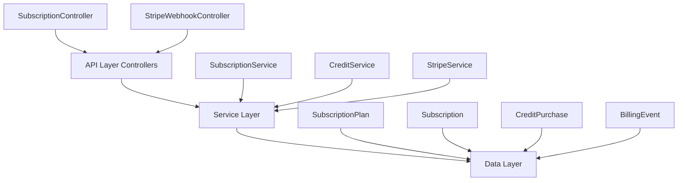
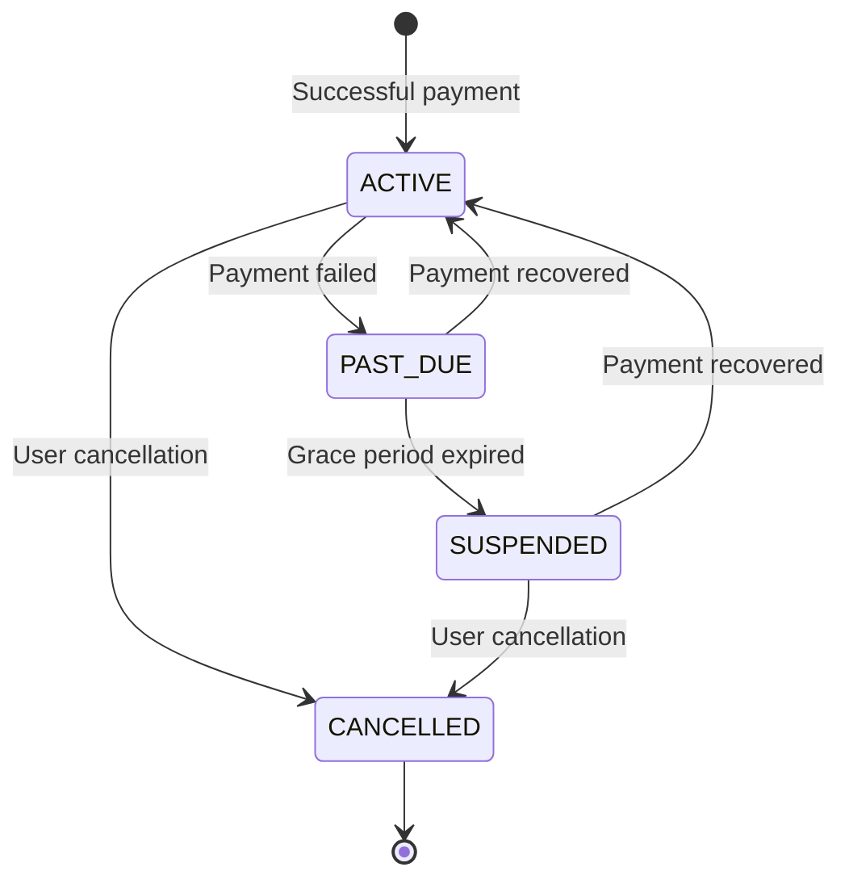

<Note>
This specification covers the fully implemented subscription module for PropWise CRM, handling freemium billing with Stripe integration.
</Note>

## Overview

The Subscription Module implements a **freemium SaaS billing system** for PropWise CRM. Every organization has a subscription tied to one of four plan tiers. The module handles:

- **Plan-based feature gating** — binary feature flags per tier
- **Resource limits** — caps on leads, contacts, deals, companies, and storage
- **Credit-based metering** — monthly AI and messaging allowances with purchasable top-ups
- **Dual seat types** — manager seats and agent seats with per-tier pricing; every user consumes a seat
- **Stripe integration** — checkout, subscription management, mid-cycle plan changes, webhooks, billing portal
- **Free organization ownership cap** — one user may own at most 2 active Free-plan organizations
- **Proration** — mid-cycle upgrades, downgrades, and seat changes are prorated to the day
- **Suspension flow** — 2-day grace period on payment failure, then org goes read-only

### Design Principles

<AccordionGroup>
<Accordion title="Core Design Decisions">
| Principle | Decision |
|-----------|----------|
| Freemium model | Free plan with limited features; paid tiers unlock progressively |
| Per-org billing | Billing is per organization; developer portal is free |
| Dual seat types | Manager seats (Owner, Admin) and agent seats (Basic, custom roles); every user consumes a seat |
| Seat type derived from role | No explicit seat assignment — seat type is automatically determined by the user's RBAC role |
| Feature flags over tier checks | Gating uses `@RequiresFeature('flag')` on plan JSONB — changing what a tier includes requires only a seeder update, not code changes |
| Service-layer limit enforcement | Resource limits and credit consumption are checked in service methods, not guards, because they need entity counts |
| Free-org creation protection | `POST /v1/organizations` locks the owner row, counts owned Free-plan orgs (missing subscription rows count as Free), and rejects the third active free workspace |
| Stripe as source of truth for payments | Webhook-driven lifecycle: the app reacts to Stripe events rather than polling |
| Prorated plan changes | All mid-cycle changes (upgrade, downgrade, add/remove seats) use `proration_behavior: 'create_prorations'` — charges are fair to the day |
| Checkout vs. change-plan separation | `POST /checkout` is for first-time subscription (Free → Paid); `POST /change-plan` is for switching between paid tiers |
| Idempotent webhooks | Every Stripe event is logged in `BillingEvent` with a unique `stripeEventId` to prevent duplicate processing |
| Graceful degradation | If `app.stripe.secretKey` (`STRIPE_SECRET_KEY`) is not set, billing features are unavailable but the app still starts |
</Accordion>
</AccordionGroup>

## Architecture

### High-Level Overview



<Info>
The architecture follows a clean separation of concerns with API controllers handling HTTP requests, service layer managing business logic, and data layer persisting state.
</Info>

### Data Flow Examples

<Tabs>
<Tab title="First-time Checkout">
<Steps>
<Step title="User initiates upgrade">
Frontend "Upgrade" button triggers `POST /v1/subscriptions/checkout`
</Step>
<Step title="Checkout session creation">
SubscriptionService creates Stripe checkout session and returns URL
</Step>
<Step title="Payment processing">
User completes payment on Stripe's hosted page
</Step>
<Step title="Confirmation">
Stripe redirects with session ID, frontend confirms via `POST /v1/subscriptions/checkout/confirm`
</Step>
<Step title="Activation">
Subscription entity updated to ACTIVE with new plan tier
</Step>
</Steps>
</Tab>

<Tab title="Plan Change">
<Steps>
<Step title="Plan change request">
Frontend sends `POST /v1/subscriptions/change-plan`
</Step>
<Step title="Validation">
System validates seat overflow (blocks if current users exceed new plan capacity)
</Step>
<Step title="Stripe update">
StripeService swaps subscription price with proration
</Step>
<Step title="Local update">
Updates local Subscription entity and returns updated subscription
</Step>
</Steps>
</Tab>

<Tab title="Payment Failure">
<Steps>
<Step title="Payment failure">
Stripe charges renewal invoice and payment fails
</Step>
<Step title="Grace period">
Status changes to PAST_DUE, Stripe retries for 2 days
</Step>
<Step title="Final failure">
If all retries fail, customer subscription status becomes unpaid
</Step>
<Step title="Suspension">
Status changes to SUSPENDED, organization becomes read-only
</Step>
</Steps>
</Tab>
</Tabs>

## Plan Tiers & Pricing

### Pricing Structure

<CardGroup cols={2}>
<Card title="Free Plan" icon="gift">
- $0/month
- 1 manager seat
- 0 agent seats
- Limited resources
</Card>

<Card title="Starter Plan" icon="rocket">
- $49/month ($470.40/year)
- 2 manager seats
- 3 agent seats
- Enhanced limits
</Card>

<Card title="Professional Plan" icon="briefcase">
- $149/month ($1,430.40/year)
- 5 manager seats
- 15 agent seats
- Advanced features
</Card>

<Card title="Business Plan" icon="building">
- $399/month ($3,830.40/year)
- 10 manager seats
- 40 agent seats
- Unlimited resources
</Card>
</CardGroup>

### Resource Limits

| Resource | Free | Starter | Professional | Business |
|----------|------|---------|--------------|----------|
| Leads | 50 | 1,000 | 10,000 | Unlimited |
| Contacts | 50 | 1,000 | 10,000 | Unlimited |
| Deals | 20 | 500 | 5,000 | Unlimited |
| Companies | 10 | 200 | 2,000 | Unlimited |
| Storage | 500 MB | 5 GB | 25 GB | 100 GB |

### Additional Seat Pricing

<Tabs>
<Tab title="Manager Seats">
| Plan | Extra Manager Seat Price |
|------|-------------------------|
| Starter | $25/month |
| Professional | $20/month |
| Business | $18/month |
</Tab>

<Tab title="Agent Seats">
| Plan | Extra Agent Seat Price |
|------|----------------------|
| Starter | $12/month |
| Professional | $10/month |
| Business | $8/month |
</Tab>
</Tabs>

### Free Organization Ownership Limit

<Warning>
Each user may own **2 active Free-plan organizations** maximum. This limit applies only to organizations where the user is the owner.
</Warning>

When the limit is reached, `POST /v1/organizations` returns **400** with:

```json
{
  "errorCode": "FREE_ORGANIZATION_LIMIT_REACHED",
  "message": "You can own at most 2 free organizations",
  "limit": 2,
  "currentCount": 2
}
```

<Tip>
To create another organization after reaching the cap, the owner must delete one of their free organizations or upgrade one to a paid plan.
</Tip>

## Feature Gating Model

### Implementation Pattern

The module uses feature flags stored in the plan's JSONB `features` column:

```typescript
@RequiresFeature('advanced_reporting')
async generateAdvancedReport() {
  // Feature implementation
}
```

### Feature Categories

<AccordionGroup>
<Accordion title="Core Features">
- Basic CRM functionality
- Contact management
- Lead tracking
- Basic reporting
</Accordion>

<Accordion title="Advanced Features">
- Advanced analytics
- Custom fields
- Automation workflows
- Advanced integrations
</Accordion>

<Accordion title="Premium Features">
- White-label options
- Advanced security
- Priority support
- Custom integrations
</Accordion>
</AccordionGroup>

## Seat Management

### Seat Types

<CardGroup cols={2}>
<Card title="Manager Seats" icon="user-tie">
Consumed by users with Owner or Admin roles
- Full administrative access
- Higher pricing tier
- Limited quantity per plan
</Card>

<Card title="Agent Seats" icon="user">
Consumed by users with Basic or custom roles
- Limited administrative access
- Lower pricing tier
- Higher quantity allowance
</Card>
</CardGroup>

<Note>
Seat type is automatically determined by the user's RBAC role. There's no explicit seat assignment process.
</Note>

### Seat Overflow Protection

When changing plans, the system validates that current users don't exceed the new plan's seat limits:

```typescript
// Example validation
if (currentManagerSeats > newPlan.managerSeatsIncluded + newPlan.extraManagerSeats) {
  throw new Error('Plan change would exceed manager seat limit');
}
```

## Credit System

### Credit Types & Allowances

| Credit Type | Free | Starter | Professional | Business |
|-------------|------|---------|--------------|----------|
| AI Credits | 100 | 1,000 | 5,000 | 20,000 |
| Messaging Credits | 50 | 500 | 2,500 | 10,000 |

### Credit Consumption

<Steps>
<Step title="FIFO Processing">
Credits are consumed in First-In-First-Out order (monthly allowance first, then purchased credits)
</Step>

<Step title="Balance Tracking">
Real-time balance calculation across all credit sources
</Step>

<Step title="Overage Handling">
When credits are exhausted, operations are blocked until more credits are purchased or the monthly allowance resets
</Step>
</Steps>

### Credit Purchases

Users can purchase additional credit packs through Stripe:

```json
{
  "creditType": "ai_credits",
  "quantity": 1000,
  "priceInCents": 2000,
  "stripePriceId": "price_xxx"
}
```

## Entity Specifications

### SubscriptionPlan Entity

```typescript
@Entity()
export class SubscriptionPlan {
  @PrimaryKey()
  id: number;

  @Unique()
  @Property()
  tier: PlanTier; // FREE, STARTER, PROFESSIONAL, BUSINESS

  @Property()
  name: string;

  @Property()
  monthlyPriceInCents: number;

  @Property()
  annualPriceInCents: number;

  @Property()
  features: Record<string, boolean>; // JSONB feature flags

  @Property()
  resourceLimits: ResourceLimits; // JSONB limits

  @Property()
  creditAllowances: CreditAllowances; // JSONB monthly credits
}
```

### Subscription Entity

```typescript
@Entity()
export class Subscription {
  @PrimaryKey()
  id: number;

  @ManyToOne(() => Organization)
  organization: Organization;

  @ManyToOne(() => SubscriptionPlan)
  plan: SubscriptionPlan;

  @Property()
  status: SubscriptionStatus; // ACTIVE, PAST_DUE, SUSPENDED, CANCELLED

  @Property()
  stripeSubscriptionId?: string;

  @Property()
  stripeCustomerId?: string;

  @Property()
  currentPeriodStart?: Date;

  @Property()
  currentPeriodEnd?: Date;

  @Property()
  extraManagerSeats: number = 0;

  @Property()
  extraAgentSeats: number = 0;
}
```

## Stripe Integration

### Configuration

<Tabs>
<Tab title="Environment Variables">
```bash
STRIPE_PUBLISHABLE_KEY=pk_test_xxx
STRIPE_SECRET_KEY=sk_test_xxx
STRIPE_WEBHOOK_SECRET=whsec_xxx
```
</Tab>

<Tab title="Webhook Events">
- `checkout.session.completed`
- `customer.subscription.created`
- `customer.subscription.updated`
- `customer.subscription.deleted`
- `invoice.paid`
- `invoice.payment_failed`
</Tab>
</Tabs>

### Webhook Processing

<Steps>
<Step title="Event Validation">
Verify webhook signature using Stripe's SDK
</Step>

<Step title="Idempotency Check">
Check `BillingEvent` table for duplicate `stripeEventId`
</Step>

<Step title="Event Processing">
Route to appropriate handler based on event type
</Step>

<Step title="State Update">
Update local subscription and billing state
</Step>

<Step title="Event Logging">
Record processed event in `BillingEvent` table
</Step>
</Steps>

## Subscription Lifecycle

### Status Transitions



### Grace Period Handling

<Warning>
Organizations in PAST_DUE status have a 2-day grace period before suspension. During this time, Stripe automatically retries failed payments.
</Warning>

## Plan Changes

### Upgrade/Downgrade Process

<Steps>
<Step title="Validation">
Check seat overflow and payment method availability
</Step>

<Step title="Proration Calculation">
Calculate prorated charges for the plan change
</Step>

<Step title="Stripe Update">
Update subscription in Stripe with new pricing
</Step>

<Step title="Seat Reconciliation">
Adjust seat line items for the new plan
</Step>

<Step title="Local Update">
Update local subscription entity with new plan details
</Step>
</Steps>

### Proration Rules

<Info>
All mid-cycle changes use `proration_behavior: 'create_prorations'` to ensure fair daily proration of charges.
</Info>

## API Endpoints

### Subscription Management

<CodeGroup>
```typescript GET /v1/subscriptions/current
// Get current organization's subscription details
{
  "subscription": {
    "id": 1,
    "status": "ACTIVE",
    "plan": {
      "tier": "PROFESSIONAL",
      "name": "Professional Plan"
    },
    "usage": {
      "managerSeats": 3,
      "agentSeats": 12
    }
  }
}
```

```typescript POST /v1/subscriptions/checkout
// Create checkout session for plan upgrade
{
  "planTier": "PROFESSIONAL",
  "billingCycle": "MONTHLY",
  "extraManagerSeats": 2,
  "extraAgentSeats": 5
}

// Response
{
  "checkoutUrl": "https://checkout.stripe.com/xxx",
  "sessionId": "cs_xxx"
}
```

```typescript POST /v1/subscriptions/change-plan
// Change existing paid subscription
{
  "newPlanTier": "BUSINESS",
  "extraManagerSeats": 1,
  "extraAgentSeats": 10
}
```

```typescript POST /v1/subscriptions/checkout/confirm
// Confirm completed checkout session
{
  "sessionId": "cs_xxx"
}
```
</CodeGroup>

### Credit Management

<CodeGroup>
```typescript GET /v1/credits/balance
// Get current credit balances
{
  "aiCredits": 2500,
  "messagingCredits": 1200,
  "breakdown": {
    "monthly": {
      "aiCredits": 1000,
      "messagingCredits": 500
    },
    "purchased": {
      "aiCredits": 1500,
      "messagingCredits": 700
    }
  }
}
```

```typescript POST /v1/credits/purchase
// Purchase additional credits
{
  "creditType": "ai_credits",
  "quantity": 1000
}

// Response
{
  "checkoutUrl": "https://checkout.stripe.com/xxx",
  "sessionId": "cs_xxx"
}
```
</CodeGroup>

## Guards & Decorators

### Feature Gating

```typescript
@RequiresFeature('advanced_analytics')
@Get('advanced-report')
async getAdvancedReport() {
  // Only available to plans with this feature
}
```

### Subscription Status Guards

```typescript
@UseGuards(SubscriptionActiveGuard)
@Post('leads')
async createLead() {
  // Blocked if subscription is suspended
}
```

### Resource Limit Enforcement

<Note>
Resource limits are enforced in service methods rather than guards because they need to query entity counts.
</Note>

```typescript
async createLead(data: CreateLeadDto) {
  await this.subscriptionService.validateResourceLimit('leads');
  // Proceed with creation
}
```

## Enforcement Points

### Service-Level Validation

<AccordionGroup>
<Accordion title="LeadService">
- Validates lead count against plan limits
- Checks storage usage for attachments
- Consumes AI credits for lead scoring
</Accordion>

<Accordion title="ContactService">
- Enforces contact count limits
- Validates bulk import operations
- Manages contact deduplication features
</Accordion>

<Accordion title="DealService">
- Checks deal count against limits
- Validates pipeline customization features
- Manages advanced deal analytics
</Accordion>

<Accordion title="CompanyService">
- Enforces company count limits
- Validates advanced company features
- Manages company hierarchy features
</Accordion>
</AccordionGroup>

## Module Structure

```
src/modules/subscription/
├── controllers/
│   ├── subscription.controller.ts
│   └── stripe-webhook.controller.ts
├── services/
│   ├── subscription.service.ts
│   ├── credit.service.ts
│   └── stripe.service.ts
├── entities/
│   ├── subscription-plan.entity.ts
│   ├── subscription.entity.ts
│   ├── credit-purchase.entity.ts
│   └── billing-event.entity.ts
├── guards/
│   ├── subscription-active.guard.ts
│   └── requires-feature.decorator.ts
├── dtos/
│   ├── create-checkout.dto.ts
│   ├── change-plan.dto.ts
│   └── purchase-credits.dto.ts
├── utils/
│   └── stripe-time.util.ts
├── seeders/
│   └── subscription-plan.seeder.ts
└── subscription.module.ts
```

## Environment Configuration

<Tabs>
<Tab title="Required Variables">
```bash
# Stripe Configuration
STRIPE_PUBLISHABLE_KEY=pk_test_xxx
STRIPE_SECRET_KEY=sk_test_xxx
STRIPE_WEBHOOK_SECRET=whsec_xxx

# App URLs
FRONTEND_URL=http://localhost:3000
BILLING_SUCCESS_URL=${FRONTEND_URL}/billing/success
BILLING_CANCEL_URL=${FRONTEND_URL}/billing/cancel
```
</Tab>

<Tab title="Optional Variables">
```bash
# Free org limits
MAX_FREE_ORGANIZATIONS_PER_USER=2

# Grace periods
PAYMENT_FAILURE_GRACE_PERIOD_DAYS=2
```
</Tab>
</Tabs>

<Warning>
If `STRIPE_SECRET_KEY` is not set, billing features will be unavailable but the application will still start in development mode.
</Warning>

## Integration with Other Modules

### RBAC Integration

The subscription module integrates with the RBAC system to determine seat types:

```typescript
// Manager seats: Owner, Admin roles
// Agent seats: Basic, custom roles
const seatType = isManagerRole(user.role) ? 'manager' : 'agent';
```

### Organization Module

<Steps>
<Step title="Organization Creation">
Every new organization gets a FREE subscription automatically
</Step>

<Step title="Ownership Validation">
Free organization ownership limits are enforced during creation
</Step>

<Step title="Status Propagation">
Suspended subscriptions make organizations read-only
</Step>
</Steps>

### Notification Module

The subscription module can trigger notifications for:
- Payment failures
- Plan limit warnings
- Credit balance alerts
- Billing updates

<Check>
The subscription module is fully implemented and actively handles billing operations for PropWise CRM.
</Check>