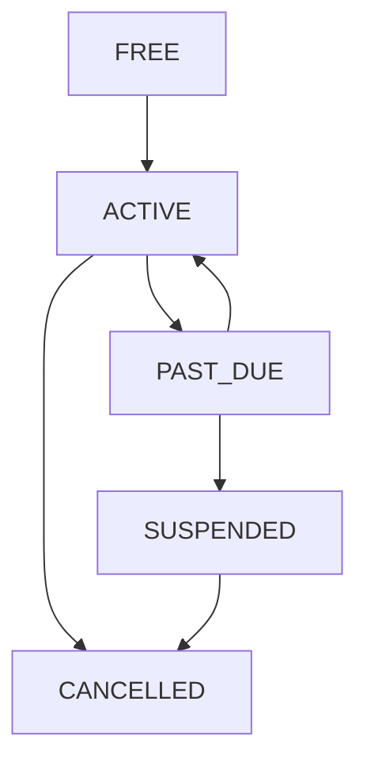

## Overview

The Subscription Module implements a **freemium SaaS billing system** for PropWise CRM. Every organization has a subscription tied to one of four plan tiers. The module handles:

- **Plan-based feature gating** — binary feature flags per tier
- **Resource limits** — caps on leads, contacts, deals, companies, and storage
- **Credit-based metering** — monthly AI and messaging allowances with purchasable top-ups
- **Dual seat types** — manager seats and agent seats with per-tier pricing; every user consumes a seat
- **Stripe integration** — checkout, subscription management, mid-cycle plan changes, webhooks, billing portal
- **Proration** — mid-cycle upgrades, downgrades, and seat changes are prorated to the day
- **Suspension flow** — 2-day grace period on payment failure, then org goes read-only

<Info>
**Module Path:** `src/modules/subscription/`  
**Payment Gateway:** Stripe  
**Status:** Active — fully implemented
</Info>

### Design Principles

| Principle | Decision |
|---|---|
| Freemium model | Free plan with limited features; paid tiers unlock progressively |
| Per-org billing | Billing is per organization; developer portal is free |
| Dual seat types | Manager seats (Owner, Admin) and agent seats (Basic, custom roles); every user consumes a seat |
| Seat type derived from role | No explicit seat assignment — seat type is automatically determined by the user's RBAC role |
| Feature flags over tier checks | Gating uses `@RequiresFeature('flag')` on plan JSONB — changing what a tier includes requires only a seeder update, not code changes |
| Service-layer limit enforcement | Resource limits and credit consumption are checked in service methods, not guards, because they need entity counts |
| Stripe as source of truth for payments | Webhook-driven lifecycle: the app reacts to Stripe events rather than polling |
| Prorated plan changes | All mid-cycle changes (upgrade, downgrade, add/remove seats) use `proration_behavior: 'create_prorations'` — charges are fair to the day |

## Architecture

### High-Level Diagram

```
┌─────────────────────────────────────────────────────────────────────┐
│                        API Layer (Controllers)                       │
│  SubscriptionController            │  StripeWebhookController        │
│  (authenticated, /v1/subscriptions)│  (public, /webhooks/stripe)     │
└──────────────┬─────────────────────┴────────────┬───────────────────┘
               │                                  │
┌──────────────▼──────────────────────────────────▼───────────────────┐
│  Service Layer                                                       │
│  ┌──────────────────┐  ┌──────────────────┐  ┌───────────────────┐  │
│  │ SubscriptionSvc  │  │  CreditService   │  │  StripeService    │  │
│  │ • lifecycle      │  │  • consume FIFO  │  │  • SDK wrapper    │  │
│  │ • plan changes   │  │  • balance query │  │  • checkout       │  │
│  │ • seat mgmt      │  │  • record packs  │  │  • subscriptions  │  │
│  │ • resource limits│  │                  │  │  • price swaps    │  │
│  │ • feature checks │  │                  │  │  • webhooks       │  │
│  └──────────────────┘  └──────────────────┘  └───────────────────┘  │
└──────────────┬──────────────────────────────────────────────────────┘
               │
┌──────────────▼──────────────────────────────────────────────────────┐
│  Data Layer (MikroORM / PostgreSQL)                                  │
│  SubscriptionPlan │ Subscription │ SubscriptionUsage                 │
│  CreditPurchase   │ BillingEvent │ Organization.stripeCustomerId     │
└─────────────────────────────────────────────────────────────────────┘
```

### Data Flow

<Tabs>
<Tab title="First-time Checkout">
**First-time checkout flow (Free → Paid):**

```
Frontend "Upgrade" button
  → POST /v1/subscriptions/checkout
    → Rejects if org already has a Stripe subscription (use change-plan instead)
    → SubscriptionService.createCheckoutSession()
      → StripeService.createCheckoutSession()
        → Returns Stripe Checkout URL
          → User pays on Stripe's hosted page
            → Stripe fires checkout.session.completed webhook
              → StripeWebhookController receives + verifies signature
                → SubscriptionService.activateSubscription()
                  → Subscription entity updated to ACTIVE
```
</Tab>
<Tab title="Plan Changes">
**Mid-cycle plan change flow (Paid → different Paid tier):**

```
Frontend "Change Plan" button
  → POST /v1/subscriptions/change-plan
    → SubscriptionService.changePlan()
      → Validates seat overflow (blocks if current users exceed new plan capacity)
      → StripeService.swapSubscriptionPrice() — prorated
      → Reconciles seat line items (old tier price → new tier price)
      → Updates local Subscription entity
      → Returns updated subscription immediately
```
</Tab>
<Tab title="Payment Failures">
**Renewal / payment failure flow:**

```
Stripe charges renewal invoice
  ├─ invoice.paid → handleInvoicePaid() → status stays ACTIVE, period updated
  └─ invoice.payment_failed → handleInvoicePaymentFailed() → status → PAST_DUE
       └─ Stripe retries for 2 days
            ├─ Payment succeeds → invoice.paid → back to ACTIVE
            └─ All retries fail → customer.subscription.updated (status: unpaid)
                 → handleSubscriptionUpdated() → status → SUSPENDED
                      → Org is read-only (SubscriptionActiveGuard blocks writes)
```
</Tab>
</Tabs>

## Plan Tiers & Pricing

Four tiers, priced in USD cents:

| | **Free** | **Starter** | **Professional** | **Business** |
|---|---|---|---|---|
| Monthly price | $0 | $49 | $149 | $399 |
| Annual price | $0 | $470.40 (~20% off) | $1,430.40 | $3,830.40 |
| Manager seats included | 1 | 2 | 5 | 10 |
| Agent seats included | 0 | 3 | 15 | 40 |
| Extra manager seat | — | $25/mo | $20/mo | $18/mo |
| Extra agent seat | — | $12/mo | $10/mo | $8/mo |

### Resource Limits

| Resource | Free | Starter | Professional | Business |
|---|---|---|---|---|
| Leads | 50 | 1,000 | 10,000 | Unlimited |
| Contacts | 50 | 1,000 | 10,000 | Unlimited |
| Deals | 20 | 500 | 5,000 | Unlimited |
| Companies | 10 | 200 | 2,000 | Unlimited |
| Storage | 500 MB | 5 GB | 25 GB | 100 GB |

### Monthly Credits

| Credit type | Free | Starter | Professional | Business |
|---|---|---|---|---|
| AI credits | 20 | 200 | 1,000 | 5,000 |
| Messaging credits | 0 | 100 | 500 | 2,000 |

## Feature Gating Model

Features are gated using three distinct mechanisms:

### Type 1: Binary Feature Flags

Boolean flags stored in `SubscriptionPlan.features` (JSONB). Checked via `@RequiresFeature('flagName')` guard decorator or `SubscriptionService.checkFeature()`.

| Feature flag | Free | Starter | Pro | Business |
|---|---|---|---|---|
| `customPipelineStages` | — | Yes | Yes | Yes |
| `distributionEngine` | — | — | Yes | Yes |
| `escalationEngine` | — | — | Yes | Yes |
| `advancedAnalytics` | — | — | Yes | Yes |
| `apiAccess` | — | — | Yes | Yes |
| `commissionTracking` | — | — | Yes | Yes |
| `teamsAndHierarchy` | — | — | Yes | Yes |
| `customRoles` | — | — | — | Yes |
| `whiteLabel` | — | — | — | Yes |
| `maxMessagingChannels` | 0 | 1 | 3 | Unlimited (-1) |
| `maxEmailIntegrations` | 0 | 1 | 3 | Unlimited (-1) |
| `auditLogRetentionDays` | 0 | 0 | 30 | Unlimited (-1) |

### Type 2: Credit-Based (Monthly Allowance)

Features that are available on the tier but have a monthly budget that resets each billing cycle. Tracked in `SubscriptionUsage`. When exhausted, the org can purchase one-time top-up packs (`CreditPurchase`).

<Note>
Consumption order: **monthly plan allowance first → purchased packs FIFO (oldest first)**
</Note>

### Type 3: Add-on Packs

| Add-on | Behavior | Stripe model |
|---|---|---|
| Storage pack (+10 GB) | Recurring, stacks | Subscription line item (per-unit) |
| AI credit pack (+500) | One-time, consumed then gone | Payment intent |
| Messaging credit pack (+500) | One-time, consumed then gone | Payment intent |

## Seat Management

### Seat Types

Every user in an organization consumes exactly one seat. The seat type is **derived from the user's RBAC role** — there is no separate seat assignment.

| Seat type | Roles that consume it | Price varies by tier |
|---|---|---|
| **Manager** | Owner, Admin | Yes |
| **Agent** | Basic, custom org roles | Yes |

The mapping is defined in `subscription.service.ts`:

```typescript
const ROLE_SEAT_MAP: Record<string, SeatType> = {
  Owner: SeatType.MANAGER,
  Admin: SeatType.MANAGER,
};
// Any other role → SeatType.AGENT
```

### Seat Counting

Seats are **derived from RBAC roles**, not tracked via a separate assignment table. The count is computed on-demand from active `UserOrgRole` records:

```
managerSeatsUsed = count of active users with Owner or Admin org role
agentSeatsUsed   = count of active users with any other org role
```

<Warning>
A seat is **not occupied** by a pending invitation — it only counts when the user has accepted and has an active `UserOrgRole`.
</Warning>

| Step | Seat occupied? |
|---|---|
| Admin sends invitation with role "Admin" | No — seat availability is checked but not reserved |
| User accepts → `UserOrgRole` created | Yes — now counted |
| User removed (role soft-deleted) | No — freed |
| User's role changed (Basic → Admin) | Swaps: frees one agent seat, occupies one manager seat |

### Enforcement Points

Seat availability is checked at two integration points:

1. **`invitation.service.ts`** — before creating an invitation, the role determines the seat type and availability is checked
2. **`role-assignment-validation.service.ts`** — when changing a user's role (e.g. promoting Basic → Admin), checks that the target seat type has room; the old seat type is freed simultaneously

### Proration on Seat Changes

Adding or removing seats mid-cycle uses `proration_behavior: 'create_prorations'`:

- **Adding a seat on April 15** (30-day month): prorated charge for 15 remaining days, billed on the next invoice
- **Removing a seat on April 15**: prorated credit for 15 remaining days, applied to the next invoice
- **Adding on April 4, removing on April 6**: net charge for 2 days only (charge for 26 days minus credit for 24 days)

### Stripe Billing

Extra seats are billed as subscription line items with `per_unit` pricing. A subscription for a Professional org with 7 managers and 20 agents would have:

| Line Item | Qty | Price |
|---|---|---|
| PropWise Professional | 1 | $149/mo |
| Extra Manager Seat (Pro) | 2 | $40/mo |
| Extra Agent Seat (Pro) | 5 | $50/mo |

## Credit System

### Consumption Flow

```typescript
SubscriptionService.consumeCredits(orgId, 'ai', 1)
  → CreditService.consumeCredits(subscription, AI, 1)
      1. Check monthly allowance: usage.aiCreditsUsed < plan.aiCreditsIncluded?
         → Consume from allowance → increment usage.aiCreditsUsed
      2. If allowance exhausted → consume from purchased packs (FIFO)
         → Decrement oldest CreditPurchase.creditsRemaining
      3. If all exhausted → throw InsufficientCreditsException
```

<AccordionGroup>
<Accordion title="Credit Purchase API">
Purchase credit top-ups with one-time payment:

```http
POST /v1/subscriptions/purchase-credits
{
  "type": "ai",
  "packs": 3
}
```

Creates Stripe PaymentIntent for immediate charge, then records the purchase in `CreditPurchase` table.
</Accordion>

<Accordion title="Credit Balance Query">
Get remaining credits across allowance and purchased packs:

```typescript
const balance = await creditService.getCreditBalance(subscription, CreditType.AI);
// Returns: { monthly: 150, purchased: 750, total: 900 }
```
</Accordion>
</AccordionGroup>

## Entity Specifications

### SubscriptionPlan

```typescript
@Entity()
export class SubscriptionPlan {
  @PrimaryKey()
  id: number;

  @Property({ unique: true })
  name: string; // 'Free', 'Starter', 'Professional', 'Business'

  @Property()
  monthlyPrice: number; // USD cents

  @Property()
  annualPrice: number; // USD cents

  @Property({ type: JsonType })
  features: Record<string, any>; // Feature flags + numeric limits

  @Property()
  managerSeatsIncluded: number;

  @Property()
  agentSeatsIncluded: number;

  @Property()
  extraManagerSeatPrice: number; // USD cents/month

  @Property()
  extraAgentSeatPrice: number; // USD cents/month

  @Property({ nullable: true })
  stripeMonthlyPriceId?: string;

  @Property({ nullable: true })
  stripeAnnualPriceId?: string;
}
```

### Subscription

```typescript
@Entity()
export class Subscription {
  @PrimaryKey()
  id: number;

  @OneToOne()
  organization: Organization;

  @ManyToOne()
  plan: SubscriptionPlan;

  @Enum()
  status: SubscriptionStatus; // ACTIVE, PAST_DUE, SUSPENDED, CANCELLED

  @Enum()
  billingCycle: BillingCycle; // MONTHLY, ANNUAL

  @Property({ nullable: true })
  stripeSubscriptionId?: string;

  @Property({ nullable: true })
  currentPeriodStart?: Date;

  @Property({ nullable: true })
  currentPeriodEnd?: Date;

  @OneToOne(() => SubscriptionUsage, { nullable: true })
  usage?: SubscriptionUsage;
}
```

### SubscriptionUsage

```typescript
@Entity()
export class SubscriptionUsage {
  @OneToOne()
  subscription: Subscription;

  @Property({ default: 0 })
  aiCreditsUsed: number;

  @Property({ default: 0 })
  messagingCreditsUsed: number;

  @Property({ default: 0 })
  storageUsedBytes: number;

  @Property({ nullable: true })
  lastResetDate?: Date; // Tracks when monthly credits were last reset
}
```

### CreditPurchase

```typescript
@Entity()
export class CreditPurchase {
  @PrimaryKey()
  id: number;

  @ManyToOne()
  organization: Organization;

  @Enum()
  creditType: CreditType; // AI, MESSAGING

  @Property()
  packsCount: number; // How many packs purchased

  @Property()
  creditsPerPack: number; // Credits per pack (usually 500)

  @Property()
  creditsRemaining: number; // Decremented as consumed

  @Property()
  totalCostCents: number; // Total paid amount

  @Property()
  stripePaymentIntentId: string;

  @Property()
  purchasedAt: Date = new Date();
}
```

## Stripe Integration

### Checkout Session Creation

<CodeGroup>
```typescript
// For first-time subscription (Free → Paid)
const session = await stripe.checkout.sessions.create({
  customer: organization.stripeCustomerId,
  mode: 'subscription',
  line_items: [
    {
      price: plan.stripeMonthlyPriceId,
      quantity: 1,
    },
    // Add extra seat line items if needed
  ],
  metadata: {
    organizationId: orgId.toString(),
    planId: planId.toString(),
  },
  success_url: `${frontendUrl}/billing/success`,
  cancel_url: `${frontendUrl}/billing/cancel`,
});
```

```typescript
// For plan changes (existing subscription)
await stripe.subscriptions.update(subscription.stripeSubscriptionId, {
  items: [
    {
      id: subscription.items[0].id,
      price: newPlan.stripeMonthlyPriceId,
    },
  ],
  proration_behavior: 'create_prorations',
  metadata: {
    planId: newPlanId.toString(),
  },
});
```
</CodeGroup>

### Webhook Processing

<Steps>
<Step title="Signature Verification">
Every webhook is verified using Stripe's signature to ensure authenticity.
</Step>
<Step title="Idempotency Check">
Each event is stored in `BillingEvent` table with unique `stripeEventId` to prevent duplicate processing.
</Step>
<Step title="Event Routing">
Events are routed to appropriate handlers based on event type.
</Step>
</Steps>

Key webhook events:

| Event | Handler | Purpose |
|---|---|---|
| `checkout.session.completed` | `handleCheckoutCompleted` | Activate new subscription |
| `invoice.paid` | `handleInvoicePaid` | Update billing period, reset credits |
| `invoice.payment_failed` | `handleInvoicePaymentFailed` | Mark as PAST_DUE |
| `customer.subscription.updated` | `handleSubscriptionUpdated` | Plan changes, suspensions |
| `customer.subscription.deleted` | `handleSubscriptionDeleted` | Mark as CANCELLED |

## Subscription Lifecycle

### States and Transitions



<Tabs>
<Tab title="ACTIVE">
- All plan features available
- Regular billing cycles
- Users can perform all operations
</Tab>
<Tab title="PAST_DUE">
- Grace period (2 days)
- Features remain available
- Stripe retrying payment
</Tab>
<Tab title="SUSPENDED">
- Read-only mode
- No new entities can be created
- Existing data remains accessible
</Tab>
<Tab title="CANCELLED">
- Account terminated
- Data retention per policy
- No access to paid features
</Tab>
</Tabs>

### Credit Reset Cycle

Monthly credits reset at the start of each billing period:

```typescript
async resetMonthlyCredits(subscription: Subscription): Promise<void> {
  await this.em.nativeUpdate(
    SubscriptionUsage,
    { subscription: subscription.id },
    {
      aiCreditsUsed: 0,
      messagingCreditsUsed: 0,
      lastResetDate: new Date(),
    }
  );
}
```

<Note>
Credit reset happens automatically when `invoice.paid` webhook is received, ensuring synchronization with Stripe billing cycles.
</Note>

## Plan Changes (Upgrade / Downgrade)

### Validation Rules

Before allowing plan changes, the system validates:

<Check>**Seat Overflow Protection**: Current users cannot exceed new plan's seat limits</Check>
<Check>**Feature Dependencies**: No active features that would be lost in downgrade</Check>
<Check>**Payment Method**: Valid payment method on file</Check>

### Proration Logic

All plan changes use `proration_behavior: 'create_prorations'`:

- **Upgrade**: Immediate access to new features, prorated charge
- **Downgrade**: Features restricted immediately, prorated credit
- **Billing cycle change**: Switches occur at next renewal

### API Endpoints

| Endpoint | Method | Purpose |
|---|---|---|
| `/v1/subscriptions/current` | GET | Get current subscription details |
| `/v1/subscriptions/checkout` | POST | Create checkout session (Free → Paid) |
| `/v1/subscriptions/change-plan` | POST | Change between paid plans |
| `/v1/subscriptions/cancel` | POST | Cancel subscription |
| `/v1/subscriptions/billing-portal` | POST | Get Stripe billing portal URL |
| `/v1/subscriptions/purchase-credits` | POST | Buy credit top-ups |

## Guards & Decorators

### Feature Guard

```typescript
@RequiresFeature('advancedAnalytics')
@Get('analytics/advanced')
async getAdvancedAnalytics() {
  // Only accessible if plan includes this feature
}
```

### Subscription Active Guard

```typescript
@UseGuards(SubscriptionActiveGuard)
@Post('leads')
async createLead() {
  // Blocked if subscription is SUSPENDED
}
```

### Credit Consumption

```typescript
@ConsumeCredits({ type: 'ai', amount: 1 })
@Post('ai/analyze')
async analyzeWithAI() {
  // Automatically deducts credits before execution
}
```

## Enforcement Points

### Service-Layer Validation

Resource limits are enforced in service methods where entity counts are available:

```typescript
async createLead(dto: CreateLeadDto): Promise<Lead> {
  await this.subscriptionService.checkResourceLimit(
    dto.organizationId,
    'leads'
  );
  
  return this.leadRepository.create(dto);
}
```

### Integration Points

| Module | Integration Point | Purpose |
|---|---|---|
| Auth | User invitation validation | Check seat availability |
| RBAC | Role assignment validation | Verify seat type limits |
| Leads/Contacts/Deals | Entity creation | Check resource limits |
| AI | Feature usage | Consume credits |
| Messaging | Channel creation | Check limits and credits |

## Plan Seeder

The plan seeder populates the four tiers with their features and pricing:

<CodeGroup>
```typescript
// Free Plan
{
  name: 'Free',
  monthlyPrice: 0,
  features: {
    customPipelineStages: false,
    distributionEngine: false,
    advancedAnalytics: false,
    maxMessagingChannels: 0,
    maxEmailIntegrations: 0,
  },
  managerSeatsIncluded: 1,
  agentSeatsIncluded: 0,
}
```

```typescript
// Business Plan  
{
  name: 'Business',
  monthlyPrice: 39900, // $399
  features: {
    customPipelineStages: true,
    distributionEngine: true,
    escalationEngine: true,
    advancedAnalytics: true,
    customRoles: true,
    whiteLabel: true,
    maxMessagingChannels: -1, // Unlimited
    maxEmailIntegrations: -1, // Unlimited
  },
  managerSeatsIncluded: 10,
  agentSeatsIncluded: 40,
}
```
</CodeGroup>

<Tip>
Run the seeder with: `npm run seed:subscription-plans`
</Tip>

## Module Structure

```
src/modules/subscription/
├── controllers/
│   ├── subscription.controller.ts
│   └── stripe-webhook.controller.ts
├── services/
│   ├── subscription.service.ts
│   ├── credit.service.ts
│   └── stripe.service.ts
├── entities/
│   ├── subscription-plan.entity.ts
│   ├── subscription.entity.ts
│   ├── subscription-usage.entity.ts
│   ├── credit-purchase.entity.ts
│   └── billing-event.entity.ts
├── guards/
│   ├── requires-feature.guard.ts
│   ├── subscription-active.guard.ts
│   └── consume-credits.decorator.ts
├── enums/
│   ├── subscription-status.enum.ts
│   ├── billing-cycle.enum.ts
│   └── credit-type.enum.ts
├── dto/
│   ├── change-plan.dto.ts
│   ├── purchase-credits.dto.ts
│   └── checkout.dto.ts
└── seeders/
    └── subscription-plan.seeder.ts
```

## Environment Configuration

<CodeGroup>
```bash Production
# Required for billing features
STRIPE_SECRET_KEY=sk_live_...
STRIPE_WEBHOOK_SECRET=whsec_...
STRIPE_PUBLISHABLE_KEY=pk_live_...

# Plan pricing configuration
STRIPE_STARTER_MONTHLY_PRICE_ID=price_...
STRIPE_STARTER_ANNUAL_PRICE_ID=price_...
STRIPE_PRO_MONTHLY_PRICE_ID=price_...
STRIPE_PRO_ANNUAL_PRICE_ID=price_...
STRIPE_BUSINESS_MONTHLY_PRICE_ID=price_...
STRIPE_BUSINESS_ANNUAL_PRICE_ID=price_...
```

```bash Development
# Test mode keys
STRIPE_SECRET_KEY=sk_test_...
STRIPE_WEBHOOK_SECRET=whsec_...
STRIPE_PUBLISHABLE_KEY=pk_test_...

# Test price IDs
STRIPE_STARTER_MONTHLY_PRICE_ID=price_test_...
# ... etc
```
</CodeGroup>

<Warning>
If `STRIPE_SECRET_KEY` is not configured, billing features will be disabled but the application will still start successfully.
</Warning>

## Integration with Other Modules

### User Management
- **Seat consumption**: Every user consumes a seat based on their role
- **Invitation limits**: Checked before sending invitations
- **Role changes**: Validated against seat availability

### RBAC System  
- **Custom roles**: Only available on Business tier
- **Role assignment**: Integrates with seat management

### Lead/Contact/Deal Management
- **Resource limits**: Enforced at creation time
- **Storage limits**: File uploads checked against plan limits

### AI Features
- **Credit consumption**: All AI operations consume credits
- **Feature gating**: Advanced AI features require paid plans

### Messaging System
- **Channel limits**: Based on plan tier
- **Credit consumption**: Outbound messages consume credits
- **Integration limits**: Email/SMS provider connections limited by tier