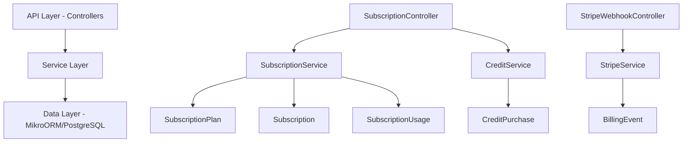
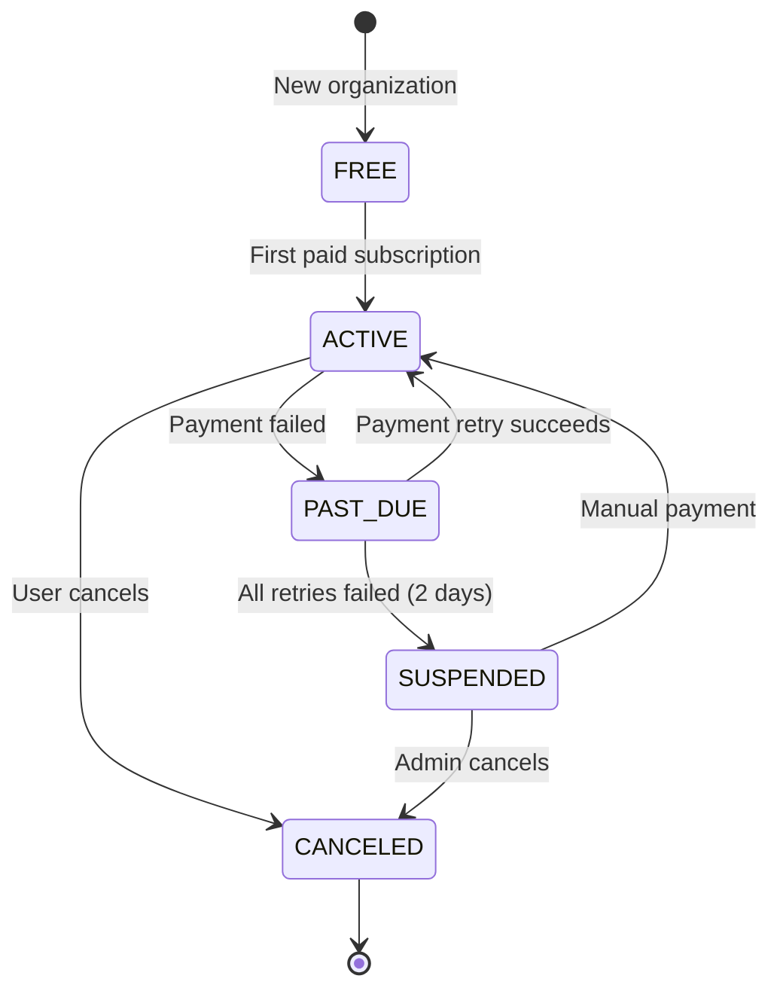

## Overview

The Subscription Module implements a **freemium SaaS billing system** for PropWise CRM. Every organization has a subscription tied to one of four plan tiers. The module handles:

- **Plan-based feature gating** — binary feature flags per tier
- **Resource limits** — caps on leads, contacts, deals, companies, and storage
- **Credit-based metering** — monthly AI and messaging allowances with purchasable top-ups
- **Dual seat types** — manager seats and agent seats with per-tier pricing; every user consumes a seat
- **Stripe integration** — checkout, subscription management, mid-cycle plan changes, webhooks, billing portal
- **Proration** — mid-cycle upgrades, downgrades, and seat changes are prorated to the day
- **Suspension flow** — 2-day grace period on payment failure, then org goes read-only

### Design Principles

<AccordionGroup>
<Accordion title="Freemium Model">
Free plan with limited features; paid tiers unlock progressively
</Accordion>

<Accordion title="Per-organization Billing">
Billing is per organization; developer portal is free
</Accordion>

<Accordion title="Dual Seat Types">
Manager seats (Owner, Admin) and agent seats (Basic, custom roles); every user consumes a seat
</Accordion>

<Accordion title="Seat Type Derived from Role">
No explicit seat assignment — seat type is automatically determined by the user's RBAC role
</Accordion>

<Accordion title="Feature Flags over Tier Checks">
Gating uses `@RequiresFeature('flag')` on plan JSONB — changing what a tier includes requires only a seeder update, not code changes
</Accordion>

<Accordion title="Service-layer Limit Enforcement">
Resource limits and credit consumption are checked in service methods, not guards, because they need entity counts
</Accordion>

<Accordion title="Stripe as Source of Truth">
Webhook-driven lifecycle: the app reacts to Stripe events rather than polling
</Accordion>

<Accordion title="Prorated Plan Changes">
All mid-cycle changes (upgrade, downgrade, add/remove seats) use `proration_behavior: 'create_prorations'` — charges are fair to the day
</Accordion>
</AccordionGroup>

## Architecture

### High-level System Diagram



### Data Flow Examples

<Tabs>
<Tab title="First-time Checkout">
<Steps>
<Step title="User clicks upgrade">
Frontend sends `POST /v1/subscriptions/checkout`
</Step>

<Step title="Validation">
System rejects if org already has a Stripe subscription (use change-plan instead)
</Step>

<Step title="Checkout session">
`SubscriptionService.createCheckoutSession()` → `StripeService.createCheckoutSession()` returns Stripe Checkout URL
</Step>

<Step title="Payment">
User pays on Stripe's hosted page
</Step>

<Step title="Webhook processing">
Stripe fires `checkout.session.completed` webhook → `StripeWebhookController` receives + verifies signature
</Step>

<Step title="Activation">
`SubscriptionService.activateSubscription()` updates Subscription entity to ACTIVE
</Step>
</Steps>
</Tab>

<Tab title="Mid-cycle Plan Change">
<Steps>
<Step title="Change request">
Frontend sends `POST /v1/subscriptions/change-plan`
</Step>

<Step title="Validation">
`SubscriptionService.changePlan()` validates seat overflow (blocks if current users exceed new plan capacity)
</Step>

<Step title="Stripe update">
`StripeService.swapSubscriptionPrice()` with proration
</Step>

<Step title="Seat reconciliation">
Reconciles seat line items (old tier price → new tier price)
</Step>

<Step title="Local update">
Updates local Subscription entity and returns updated subscription immediately
</Step>
</Steps>
</Tab>
</Tabs>

## Plan Tiers & Pricing

### Pricing Structure

| Plan | Monthly | Annual | Manager Seats | Agent Seats | Extra Manager | Extra Agent |
|------|---------|--------|---------------|-------------|---------------|-------------|
| **Free** | $0 | $0 | 1 | 0 | — | — |
| **Starter** | $49 | $470.40 | 2 | 3 | $25/mo | $12/mo |
| **Professional** | $149 | $1,430.40 | 5 | 15 | $20/mo | $10/mo |
| **Business** | $399 | $3,830.40 | 10 | 40 | $18/mo | $8/mo |

<Note>
Annual pricing includes approximately 20% discount compared to monthly billing
</Note>

### Resource Limits

| Resource | Free | Starter | Professional | Business |
|----------|------|---------|--------------|----------|
| Leads | 50 | 1,000 | 10,000 | Unlimited |
| Contacts | 50 | 1,000 | 10,000 | Unlimited |
| Deals | 20 | 500 | 5,000 | Unlimited |
| Companies | 10 | 200 | 2,000 | Unlimited |
| Storage | 500 MB | 5 GB | 25 GB | 100 GB |

### Monthly Credits

| Credit Type | Free | Starter | Professional | Business |
|-------------|------|---------|--------------|----------|
| AI credits | 20 | 200 | 1,000 | 5,000 |
| Messaging credits | 0 | 100 | 500 | 2,000 |

## Feature Gating Model

The system uses three distinct feature gating mechanisms:

### Type 1: Binary Feature Flags

<Info>
Boolean flags stored in `SubscriptionPlan.features` (JSONB). Checked via `@RequiresFeature('flagName')` guard decorator or `SubscriptionService.checkFeature()`.
</Info>

| Feature | Free | Starter | Pro | Business |
|---------|------|---------|-----|----------|
| `customPipelineStages` | ❌ | ✅ | ✅ | ✅ |
| `distributionEngine` | ❌ | ❌ | ✅ | ✅ |
| `escalationEngine` | ❌ | ❌ | ✅ | ✅ |
| `advancedAnalytics` | ❌ | ❌ | ✅ | ✅ |
| `apiAccess` | ❌ | ❌ | ✅ | ✅ |
| `commissionTracking` | ❌ | ❌ | ✅ | ✅ |
| `teamsAndHierarchy` | ❌ | ❌ | ✅ | ✅ |
| `customRoles` | ❌ | ❌ | ❌ | ✅ |
| `whiteLabel` | ❌ | ❌ | ❌ | ✅ |

### Type 2: Numeric Limits

| Feature | Free | Starter | Pro | Business |
|---------|------|---------|-----|----------|
| `maxMessagingChannels` | 0 | 1 | 3 | Unlimited (-1) |
| `maxEmailIntegrations` | 0 | 1 | 3 | Unlimited (-1) |
| `auditLogRetentionDays` | 0 | 0 | 30 | Unlimited (-1) |

### Type 3: Credit-based Features

Features available on the tier but with monthly budget that resets each billing cycle. Tracked in `SubscriptionUsage`. When exhausted, organizations can purchase one-time top-up packs.

<Note>
Consumption order: **monthly plan allowance first → purchased packs FIFO (oldest first)**
</Note>

## Seat Management

### Seat Types

Every user in an organization consumes exactly one seat. The seat type is **derived from the user's RBAC role**.

<CardGroup cols={2}>
<Card title="Manager Seats" icon="user-tie">
Consumed by Owner and Admin roles
Price varies by tier
</Card>
<Card title="Agent Seats" icon="user">
Consumed by Basic and custom org roles
Price varies by tier
</Card>
</CardGroup>

### Seat Mapping

```typescript
const ROLE_SEAT_MAP: Record<string, SeatType> = {
  Owner: SeatType.MANAGER,
  Admin: SeatType.MANAGER,
};
// Any other role → SeatType.AGENT
```

### Seat Counting Logic

<Warning>
Seats are derived from RBAC roles, not tracked via separate assignment table. Count is computed on-demand from active `UserOrgRole` records.
</Warning>

| Step | Seat Occupied? |
|------|----------------|
| Admin sends invitation with role "Admin" | ❌ Seat availability checked but not reserved |
| User accepts → `UserOrgRole` created | ✅ Now counted |
| User removed (role soft-deleted) | ❌ Freed |
| User's role changed (Basic → Admin) | 🔄 Swaps: frees agent seat, occupies manager seat |

### Proration on Seat Changes

<Steps>
<Step title="Adding seat mid-cycle">
Prorated charge for remaining days, billed on next invoice
Example: Adding on April 15 (30-day month) = charge for 15 remaining days
</Step>

<Step title="Removing seat mid-cycle">
Prorated credit for remaining days, applied to next invoice
</Step>

<Step title="Net changes">
Adding on April 4, removing on April 6 = net charge for 2 days only
</Step>
</Steps>

## Credit System

### Consumption Flow

```typescript
SubscriptionService.consumeCredits(orgId, 'ai', 1)
  → CreditService.consumeCredits(subscription, AI, 1)
      1. Check monthly allowance: usage.aiCreditsUsed < plan.aiCredits
      2. If allowance exhausted → consume from purchased packs (FIFO)
      3. If insufficient total → throw InsufficientCreditsError
      4. Update usage counters and pack balances
```

### Credit Types

<Tabs>
<Tab title="AI Credits">
Used for AI-powered features like lead scoring, content generation, and analytics insights.

**Pricing for top-up packs:**
- 500 AI credits: $29.99 (one-time purchase)
</Tab>

<Tab title="Messaging Credits">
Used for SMS, email campaigns, and automated messaging sequences.

**Pricing for top-up packs:**
- 500 messaging credits: $19.99 (one-time purchase)
</Tab>
</Tabs>

### Monthly Reset

<Info>
Monthly allowances reset at the start of each billing cycle. Purchased credit packs do not expire and carry over between cycles.
</Info>

## Entity Specifications

### Core Entities

<AccordionGroup>
<Accordion title="SubscriptionPlan">
```typescript
interface SubscriptionPlan {
  id: string;
  name: string; // 'Free', 'Starter', 'Professional', 'Business'
  
  // Pricing (USD cents)
  monthlyPrice: number;
  annualPrice: number;
  
  // Seat pricing
  managerSeatPrice: number;
  agentSeatPrice: number;
  
  // Included seats
  includedManagerSeats: number;
  includedAgentSeats: number;
  
  // Resource limits
  maxLeads: number; // -1 = unlimited
  maxContacts: number;
  maxDeals: number;
  maxCompanies: number;
  storageGB: number;
  
  // Monthly credits
  aiCredits: number;
  messagingCredits: number;
  
  // Feature flags (JSONB)
  features: {
    customPipelineStages?: boolean;
    distributionEngine?: boolean;
    // ... other flags
  };
}
```
</Accordion>

<Accordion title="Subscription">
```typescript
interface Subscription {
  id: string;
  organizationId: string;
  planId: string;
  status: SubscriptionStatus;
  
  // Stripe references
  stripeSubscriptionId?: string;
  stripeCustomerId?: string;
  
  // Billing cycle
  currentPeriodStart?: Date;
  currentPeriodEnd?: Date;
  
  // Seat allocation
  managerSeats: number;
  agentSeats: number;
  
  createdAt: Date;
  updatedAt: Date;
}
```
</Accordion>

<Accordion title="SubscriptionUsage">
```typescript
interface SubscriptionUsage {
  id: string;
  subscriptionId: string;
  
  // Period tracking
  billingPeriodStart: Date;
  billingPeriodEnd: Date;
  
  // Credit consumption
  aiCreditsUsed: number;
  messagingCreditsUsed: number;
  
  // Resource usage
  leadsCount: number;
  contactsCount: number;
  dealsCount: number;
  companiesCount: number;
  storageUsedMB: number;
  
  updatedAt: Date;
}
```
</Accordion>

<Accordion title="CreditPurchase">
```typescript
interface CreditPurchase {
  id: string;
  organizationId: string;
  creditType: CreditType; // 'AI' | 'MESSAGING'
  amount: number; // Credits purchased
  remaining: number; // Credits left
  priceUSD: number; // Price paid in USD cents
  stripePaymentIntentId: string;
  purchasedAt: Date;
}
```
</Accordion>
</AccordionGroup>

## Stripe Integration

### Configuration

```typescript
// Environment variables required
STRIPE_SECRET_KEY=sk_test_... // or sk_live_...
STRIPE_WEBHOOK_SECRET=whsec_...
STRIPE_PUBLISHABLE_KEY=pk_test_... // for frontend

// Graceful degradation
if (!process.env.STRIPE_SECRET_KEY) {
  console.warn('Stripe not configured - billing features unavailable');
}
```

### Key Integration Points

<CardGroup cols={2}>
<Card title="Checkout Session" icon="credit-card">
Creates Stripe Checkout for new subscriptions
</Card>
<Card title="Subscription Management" icon="refresh">
Handles plan changes and seat adjustments
</Card>
<Card title="Webhook Processing" icon="webhook">
Processes Stripe events for lifecycle management
</Card>
<Card title="Customer Portal" icon="user-gear">
Provides Stripe-hosted billing management
</Card>
</CardGroup>

### Webhook Events

| Event | Handler | Action |
|-------|---------|--------|
| `checkout.session.completed` | `handleCheckoutCompleted` | Activate new subscription |
| `invoice.paid` | `handleInvoicePaid` | Update billing period, maintain ACTIVE status |
| `invoice.payment_failed` | `handleInvoicePaymentFailed` | Set status to PAST_DUE |
| `customer.subscription.updated` | `handleSubscriptionUpdated` | Sync status changes, handle suspension |
| `customer.subscription.deleted` | `handleSubscriptionDeleted` | Cancel subscription |

<Warning>
All webhook events are logged in `BillingEvent` with unique `stripeEventId` to prevent duplicate processing.
</Warning>

## Subscription Lifecycle

### Status Flow



### Status Definitions

<AccordionGroup>
<Accordion title="FREE">
- Default status for new organizations
- Access to free tier features only
- No Stripe subscription
</Accordion>

<Accordion title="ACTIVE">
- Paid subscription in good standing
- Full access to plan features
- Billing cycle active
</Accordion>

<Accordion title="PAST_DUE">
- Payment failed, in grace period (2 days)
- Features remain available
- Stripe automatically retries payment
</Accordion>

<Accordion title="SUSPENDED">
- All payment retries failed
- Organization goes read-only
- Must resolve payment to restore access
</Accordion>

<Accordion title="CANCELED">
- Subscription terminated
- Reverts to free tier after billing period ends
</Accordion>
</AccordionGroup>

## Plan Changes (Upgrade/Downgrade)

### Validation Rules

<Steps>
<Step title="Seat overflow check">
New plan must accommodate current users
- If downgrading from Business (50 users) to Starter (5 total seats) → blocked
- Must remove users first or choose different plan
</Step>

<Step title="Feature compatibility">
Some features may become unavailable after downgrade
- Custom roles revert to basic roles
- Advanced analytics access removed
</Step>

<Step title="Resource limit validation">
Current usage must fit within new plan limits
- Leads, contacts, deals, companies counts checked
- Storage usage validated
</Step>
</Steps>

### Proration Logic

<Info>
All mid-cycle changes use Stripe's `proration_behavior: 'create_prorations'` for fair daily calculations.
</Info>

**Upgrade example:**
- Current: Starter ($49/mo) on day 15 of 30-day cycle
- Upgrade to: Professional ($149/mo)
- Proration: Credit $24.50 unused Starter + charge $74.50 prorated Professional
- Net charge: $50 for remaining 15 days

**Downgrade example:**
- Current: Professional ($149/mo) on day 10 of 30-day cycle  
- Downgrade to: Starter ($49/mo)
- Proration: Credit $99.33 unused Professional + charge $32.67 prorated Starter
- Net credit: $66.66 applied to next invoice

## API Endpoints

### Authentication Required

<CodeGroup>
```typescript GET /v1/subscriptions
// Get current organization subscription
Response: {
  subscription: Subscription;
  usage: SubscriptionUsage;
  plan: SubscriptionPlan;
}
```

```typescript POST /v1/subscriptions/checkout
// Create checkout session (Free → Paid)
Body: {
  planId: string;
  billingCycle: 'monthly' | 'annual';
  managerSeats?: number;
  agentSeats?: number;
}
Response: {
  checkoutUrl: string;
}
```

```typescript POST /v1/subscriptions/change-plan
// Change between paid plans
Body: {
  newPlanId: string;
  managerSeats: number;
  agentSeats: number;
}
Response: {
  subscription: Subscription;
  effectiveDate: Date;
}
```

```typescript POST /v1/subscriptions/purchase-credits
// Buy credit top-up pack
Body: {
  creditType: 'AI' | 'MESSAGING';
  amount: number;
}
Response: {
  paymentIntentClientSecret: string;
}
```

```typescript GET /v1/subscriptions/billing-portal
// Get Stripe customer portal URL
Response: {
  portalUrl: string;
}
```
</CodeGroup>

### Public Endpoints

<CodeGroup>
```typescript POST /webhooks/stripe
// Stripe webhook handler
Headers: {
  'stripe-signature': string;
}
Body: StripeEvent
```

```typescript GET /v1/subscription-plans
// List available plans (public)
Response: {
  plans: SubscriptionPlan[];
}
```
</CodeGroup>

## Guards & Decorators

### Feature Gating

```typescript
@RequiresFeature('customPipelineStages')
@Get('/advanced-pipelines')
async getAdvancedPipelines() {
  // Only accessible if org's plan includes this feature
}
```

### Subscription Status

```typescript
@UseGuards(SubscriptionActiveGuard)
@Post('/leads')
async createLead() {
  // Blocked if subscription is SUSPENDED
}
```

### Credit Validation

```typescript
@RequiresCredits('AI', 1)
@Post('/ai/analyze')
async runAIAnalysis() {
  // Checks if org has sufficient AI credits
  // Automatically consumes 1 credit if successful
}
```

## Enforcement Points

### Resource Limits

<Tabs>
<Tab title="Service Layer">
```typescript
async createLead(data: CreateLeadDto) {
  // Check resource limit before creation
  await this.subscriptionService.checkResourceLimit('leads');
  
  const lead = await this.leadRepository.create(data);
  
  // Update usage counter
  await this.subscriptionService.incrementUsage('leads', 1);
  
  return lead;
}
```
</Tab>

<Tab title="Guard Decorator">
```typescript
@CheckResourceLimit('deals')
@Post('/deals')
async createDeal(@Body() data: CreateDealDto) {
  // Resource check happens in guard
  return this.dealService.create(data);
}
```
</Tab>
</Tabs>

### Credit Consumption

```typescript
async sendSMSCampaign(recipients: string[]) {
  const creditCost = recipients.length;
  
  // Check and consume credits atomically
  await this.subscriptionService.consumeCredits(
    this.orgId, 
    'messaging', 
    creditCost
  );
  
  // Proceed with SMS sending
  return this.smsService.sendBulk(recipients);
}
```

## Plan Seeder

### Database Initialization

The plan seeder populates the four subscription plans with current pricing and features:

```typescript
async seedPlans() {
  const plans = [
    {
      id: 'plan-free',
      name: 'Free',
      monthlyPrice: 0,
      annualPrice: 0,
      features: {
        customPipelineStages: false,
        distributionEngine: false,
        // ... all features false
      }
    },
    {
      id: 'plan-starter', 
      name: 'Starter',
      monthlyPrice: 4900, // $49.00
      annualPrice: 47040, // $470.40
      features: {
        customPipelineStages: true,
        distributionEngine: false,
        // ... selective features
      }
    }
    // ... Professional, Business plans
  ];
  
  await this.subscriptionPlanRepository.save(plans);
}
```

<Note>
To modify what features are included in each tier, update the seeder and re-run. No code changes required thanks to feature flag architecture.
</Note>

## Module Structure

```
src/modules/subscription/
├── controllers/
│   ├── subscription.controller.ts
│   └── stripe-webhook.controller.ts
├── services/
│   ├── subscription.service.ts
│   ├── credit.service.ts
│   └── stripe.service.ts
├── entities/
│   ├── subscription-plan.entity.ts
│   ├── subscription.entity.ts
│   ├── subscription-usage.entity.ts
│   ├── credit-purchase.entity.ts
│   └── billing-event.entity.ts
├── guards/
│   ├── requires-feature.guard.ts
│   ├── subscription-active.guard.ts
│   └── check-resource-limit.guard.ts
├── decorators/
│   ├── requires-feature.decorator.ts
│   └── requires-credits.decorator.ts
├── dto/
│   ├── checkout-session.dto.ts
│   ├── change-plan.dto.ts
│   └── purchase-credits.dto.ts
├── enums/
│   ├── subscription-status.enum.ts
│   ├── credit-type.enum.ts
│   └── seat-type.enum.ts
└── subscription.module.ts
```

## Environment Configuration

### Required Variables

<CodeGroup>
```bash Production
STRIPE_SECRET_KEY=sk_live_...
STRIPE_WEBHOOK_SECRET=whsec_...
STRIPE_PUBLISHABLE_KEY=pk_live_...
```

```bash Development
STRIPE_SECRET_KEY=sk_test_...
STRIPE_WEBHOOK_SECRET=whsec_...
STRIPE_PUBLISHABLE_KEY=pk_test_...
```
</CodeGroup>

### Optional Configuration

```bash
# Subscription defaults
DEFAULT_TRIAL_DAYS=14
GRACE_PERIOD_DAYS=2
WEBHOOK_TOLERANCE_SECONDS=300

# Feature flags (global overrides)
FORCE_DISABLE_BILLING=false
ALLOW_UNLIMITED_FREE_TIER=false
```

## Integration with Other Modules

### Module Dependencies

<CardGroup cols={2}>
<Card title="Organization Module" icon="building">
- Links subscriptions to organizations
- Provides customer context for Stripe
- Handles org suspension workflow
</Card>

<Card title="User Management" icon="users">
- Seat counting via RBAC roles
- Invitation validation against seat limits
- Role change enforcement
</Card>

<Card title="Lead Management" icon="user-plus">
- Resource limit enforcement
- Usage tracking and reporting
</Card>

<Card title="Communication" icon="message">
- Credit consumption for messaging
- Channel limit enforcement
- Campaign cost calculation
</Card>
</CardGroup>

### Event Integration

```typescript
// Example: Seat change event
this.eventBus.emit('subscription.seat.changed', {
  organizationId,
  oldSeats: { managers: 2, agents: 5 },
  newSeats: { managers: 3, agents: 5 },
  effectiveDate: new Date()
});

// Handled by billing service for Stripe sync
// Handled by audit service for compliance logging
```

<Warning>
When integrating with the subscription module, always use the provided service methods rather than direct database access to ensure proper validation and event handling.
</Warning>

<Tip>
The subscription system is designed to be resilient. If Stripe is temporarily unavailable, the system continues to operate with cached subscription data, with a graceful degradation to read-only mode for billing-related features.
</Tip>