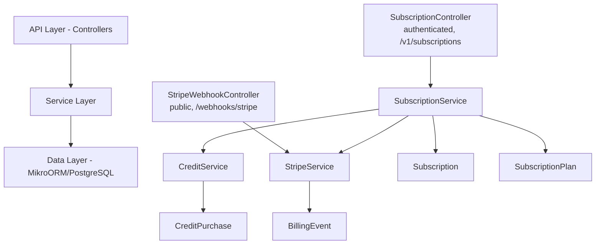
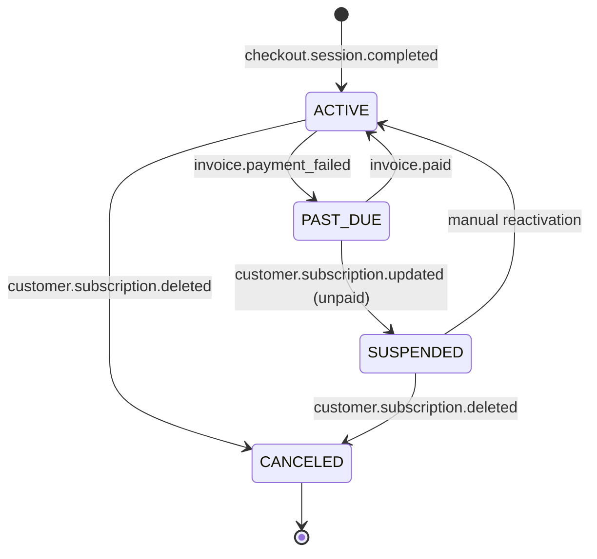

# Subscription Module Specification v13

<Info>
**Status:** Active — fully implemented  
**Module Path:** `src/modules/subscription/`  
**Payment Gateway:** Stripe
</Info>

## Overview

The Subscription Module implements a **freemium SaaS billing system** for PropWise CRM. Every organization has a subscription tied to one of four plan tiers. The module handles:

- **Plan-based feature gating** — binary feature flags per tier
- **Resource limits** — caps on leads, contacts, deals, companies, and storage
- **Credit-based metering** — monthly AI and messaging allowances with purchasable top-ups
- **Dual seat types** — manager seats and agent seats with per-tier pricing; every user consumes a seat
- **Stripe integration** — checkout, subscription management, mid-cycle plan changes, webhooks, billing portal
- **Proration** — mid-cycle upgrades, downgrades, and seat changes are prorated to the day
- **Suspension flow** — 2-day grace period on payment failure, then org goes read-only

### Design Principles

| Principle | Decision |
|---|---|
| Freemium model | Free plan with limited features; paid tiers unlock progressively |
| Per-org billing | Billing is per organization; developer portal is free |
| Dual seat types | Manager seats (Owner, Admin) and agent seats (Basic, custom roles); every user consumes a seat |
| Seat type derived from role | No explicit seat assignment — seat type is automatically determined by the user's RBAC role |
| Feature flags over tier checks | Gating uses `@RequiresFeature('flag')` on plan JSONB — changing what a tier includes requires only a seeder update, not code changes |
| Service-layer limit enforcement | Resource limits and credit consumption are checked in service methods, not guards, because they need entity counts |
| Stripe as source of truth for payments | Webhook-driven lifecycle: the app reacts to Stripe events rather than polling |
| Prorated plan changes | All mid-cycle changes (upgrade, downgrade, add/remove seats) use `proration_behavior: 'create_prorations'` — charges are fair to the day |
| Checkout vs. change-plan separation | `POST /checkout` is for first-time subscription (Free → Paid); `POST /change-plan` is for switching between paid tiers |
| Idempotent webhooks | Every Stripe event is logged in `BillingEvent` with a unique `stripeEventId` to prevent duplicate processing |
| Graceful degradation | If `app.stripe.secretKey` (`STRIPE_SECRET_KEY`) is not set, billing features are unavailable but the app still starts |

## Architecture

### High-Level Diagram



### Data Flow

<Tabs>
<Tab title="First-time Checkout">

**First-time checkout flow (Free → Paid):**

<Steps>
<Step title="User initiates upgrade">
Frontend "Upgrade" button triggers `POST /v1/subscriptions/checkout`
</Step>

<Step title="Validation and checkout creation">
- Rejects if org already has a Stripe subscription (use change-plan instead)
- `SubscriptionService.createCheckoutSession()`
- `StripeService.createCheckoutSession()` returns Stripe Checkout URL
</Step>

<Step title="Payment processing">
User pays on Stripe's hosted page
</Step>

<Step title="Webhook activation">
- Stripe fires `checkout.session.completed` webhook
- `StripeWebhookController` receives and verifies signature
- `SubscriptionService.activateSubscription()` updates Subscription entity to ACTIVE
</Step>
</Steps>

</Tab>
<Tab title="Plan Changes">

**Mid-cycle plan change flow (Paid → different Paid tier):**

<Steps>
<Step title="Plan change request">
Frontend "Change Plan" button triggers `POST /v1/subscriptions/change-plan`
</Step>

<Step title="Validation and processing">
- `SubscriptionService.changePlan()` validates seat overflow
- Blocks if current users exceed new plan capacity
- `StripeService.swapSubscriptionPrice()` with proration
</Step>

<Step title="Seat reconciliation">
Reconciles seat line items (old tier price → new tier price)
</Step>

<Step title="Update completion">
- Updates local Subscription entity
- Returns updated subscription immediately
</Step>
</Steps>

</Tab>
<Tab title="Payment Failures">

**Renewal / payment failure flow:**

<Steps>
<Step title="Stripe charges renewal">
Stripe attempts to charge renewal invoice
</Step>

<Step title="Payment outcome">
- **Success**: `invoice.paid` → `handleInvoicePaid()` → status stays ACTIVE, period updated
- **Failure**: `invoice.payment_failed` → `handleInvoicePaymentFailed()` → status → PAST_DUE
</Step>

<Step title="Retry period">
Stripe retries for 2 days:
- **Payment succeeds**: `invoice.paid` → back to ACTIVE
- **All retries fail**: `customer.subscription.updated` (status: unpaid)
</Step>

<Step title="Suspension">
`handleSubscriptionUpdated()` → status → SUSPENDED  
Org becomes read-only (`SubscriptionActiveGuard` blocks writes)
</Step>
</Steps>

</Tab>
</Tabs>

## Plan Tiers & Pricing

<Note>
Four tiers, priced in USD cents
</Note>

### Pricing Structure

| | **Free** | **Starter** | **Professional** | **Business** |
|---|---|---|---|---|
| Monthly price | $0 | $49 | $149 | $399 |
| Annual price | $0 | $470.40 (~20% off) | $1,430.40 | $3,830.40 |
| Manager seats included | 1 | 2 | 5 | 10 |
| Agent seats included | 0 | 3 | 15 | 40 |
| Extra manager seat | — | $25/mo | $20/mo | $18/mo |
| Extra agent seat | — | $12/mo | $10/mo | $8/mo |

### Resource Limits

| Resource | Free | Starter | Professional | Business |
|---|---|---|---|---|
| Leads | 50 | 1,000 | 10,000 | Unlimited |
| Contacts | 50 | 1,000 | 10,000 | Unlimited |
| Deals | 20 | 500 | 5,000 | Unlimited |
| Companies | 10 | 200 | 2,000 | Unlimited |
| Storage | 500 MB | 5 GB | 25 GB | 100 GB |

### Monthly Credits

| Credit type | Free | Starter | Professional | Business |
|---|---|---|---|---|
| AI credits | 20 | 200 | 1,000 | 5,000 |
| Messaging credits | 0 | 100 | 500 | 2,000 |

## Feature Gating Model

Features are gated using three distinct mechanisms:

### Type 1: Binary Feature Flags

Boolean flags stored in `SubscriptionPlan.features` (JSONB). Checked via `@RequiresFeature('flagName')` guard decorator or `SubscriptionService.checkFeature()`.

<AccordionGroup>
<Accordion title="Feature Flag Matrix">

| Feature flag | Free | Starter | Pro | Business |
|---|---|---|---|---|
| `customPipelineStages` | — | ✅ | ✅ | ✅ |
| `distributionEngine` | — | — | ✅ | ✅ |
| `escalationEngine` | — | — | ✅ | ✅ |
| `advancedAnalytics` | — | — | ✅ | ✅ |
| `apiAccess` | — | — | ✅ | ✅ |
| `commissionTracking` | — | — | ✅ | ✅ |
| `teamsAndHierarchy` | — | — | ✅ | ✅ |
| `customRoles` | — | — | — | ✅ |
| `whiteLabel` | — | — | — | ✅ |
| `maxMessagingChannels` | 0 | 1 | 3 | Unlimited (-1) |
| `maxEmailIntegrations` | 0 | 1 | 3 | Unlimited (-1) |
| `auditLogRetentionDays` | 0 | 0 | 30 | Unlimited (-1) |

</Accordion>
</AccordionGroup>

### Type 2: Credit-Based (Monthly Allowance)

Features that are available on the tier but have a monthly budget that resets each billing cycle. Tracked in `SubscriptionUsage`. When exhausted, the org can purchase one-time top-up packs (`CreditPurchase`).

<Tip>
**Consumption order**: Monthly plan allowance first → purchased packs FIFO (oldest first)
</Tip>

### Type 3: Add-on Packs

| Add-on | Behavior | Stripe model |
|---|---|---|
| Storage pack (+10 GB) | Recurring, stacks | Subscription line item (per-unit) |
| AI credit pack (+500) | One-time, consumed then gone | Payment intent |
| Messaging credit pack (+500) | One-time, consumed then gone | Payment intent |

## Seat Management

### Seat Types

Every user in an organization consumes exactly one seat. The seat type is **derived from the user's RBAC role** — there is no separate seat assignment.

| Seat type | Roles that consume it | Price varies by tier |
|---|---|---|
| **Manager** | Owner, Admin | Yes |
| **Agent** | Basic, custom org roles | Yes |

<CodeGroup>
```typescript Role Seat Mapping
const ROLE_SEAT_MAP: Record<string, SeatType> = {
  Owner: SeatType.MANAGER,
  Admin: SeatType.MANAGER,
};
// Any other role → SeatType.AGENT
```
</CodeGroup>

### Seat Counting

<Warning>
Seats are **derived from RBAC roles**, not tracked via a separate assignment table. The count is computed on-demand from active `UserOrgRole` records.
</Warning>

```
managerSeatsUsed = count of active users with Owner or Admin org role
agentSeatsUsed   = count of active users with any other org role
```

A seat is **not occupied** by a pending invitation — it only counts when the user has accepted and has an active `UserOrgRole`.

| Step | Seat occupied? |
|---|---|
| Admin sends invitation with role "Admin" | ❌ No — seat availability is checked but not reserved |
| User accepts → `UserOrgRole` created | ✅ Yes — now counted |
| User removed (role soft-deleted) | ❌ No — freed |
| User's role changed (Basic → Admin) | 🔄 Swaps: frees one agent seat, occupies one manager seat |

### Enforcement Points

Seat availability is checked at two integration points:

1. **`invitation.service.ts`** — before creating an invitation, the role determines the seat type and availability is checked
2. **`role-assignment-validation.service.ts`** — when changing a user's role (e.g. promoting Basic → Admin), checks that the target seat type has room; the old seat type is freed simultaneously

### Proration on Seat Changes

<Info>
Adding or removing seats mid-cycle uses `proration_behavior: 'create_prorations'`
</Info>

- **Adding a seat on April 15** (30-day month): prorated charge for 15 remaining days, billed on the next invoice
- **Removing a seat on April 15**: prorated credit for 15 remaining days, applied to the next invoice
- **Adding on April 4, removing on April 6**: net charge for 2 days only (charge for 26 days minus credit for 24 days)

### Stripe Billing

Extra seats are billed as subscription line items with `per_unit` pricing. A subscription for a Professional org with 7 managers and 20 agents would have:

| Line Item | Qty | Price |
|---|---|---|
| PropWise Professional | 1 | $149/mo |
| Extra Manager Seat (Pro) | 2 | $40/mo |
| Extra Agent Seat (Pro) | 5 | $50/mo |

## Credit System

### Consumption Flow

<CodeGroup>
```typescript Credit Consumption
SubscriptionService.consumeCredits(orgId, 'ai', 1)
  → CreditService.consumeCredits(subscription, AI, 1)
      1. Check monthly allowance: usage.aiCreditsUsed < plan.aiCreditsPerMonth
      2. If insufficient monthly: consume purchased packs FIFO
      3. Update SubscriptionUsage and CreditPurchase records
      4. Return { success: boolean, remainingCredits: number }
```
</CodeGroup>

### Credit Types

- **AI Credits**: Used for AI-powered features like lead scoring, content generation
- **Messaging Credits**: Used for SMS, WhatsApp, and other messaging integrations

### Purchase and Management

<Steps>
<Step title="Credit exhaustion">
When monthly allowance is exhausted, users can purchase additional credit packs
</Step>

<Step title="Pack purchasing">
One-time credit packs are purchased through Stripe Payment Intents
</Step>

<Step title="FIFO consumption">
Purchased packs are consumed in First-In-First-Out order after monthly allowance
</Step>

<Step title="Monthly reset">
Monthly allowances reset at the beginning of each billing cycle
</Step>
</Steps>

## Entity Specifications

### Core Entities

<AccordionGroup>
<Accordion title="SubscriptionPlan">

```typescript
@Entity()
export class SubscriptionPlan {
  @PrimaryKey()
  id: number;

  @Property({ unique: true })
  name: string; // 'Free', 'Starter', 'Professional', 'Business'

  @Property()
  tier: PlanTier; // FREE, STARTER, PROFESSIONAL, BUSINESS

  @Property()
  monthlyPrice: number; // USD cents

  @Property()
  yearlyPrice: number; // USD cents

  @Property({ type: 'jsonb' })
  features: Record<string, any>; // Feature flags

  @Property()
  managerSeatsIncluded: number;

  @Property()
  agentSeatsIncluded: number;

  @Property()
  managerSeatPrice: number; // USD cents

  @Property()
  agentSeatPrice: number; // USD cents

  // Resource limits
  @Property()
  maxLeads: number; // -1 for unlimited

  @Property()
  maxContacts: number;

  @Property()
  maxDeals: number;

  @Property()
  maxCompanies: number;

  @Property()
  maxStorage: number; // bytes

  // Monthly credits
  @Property()
  aiCreditsPerMonth: number;

  @Property()
  messagingCreditsPerMonth: number;
}
```

</Accordion>
<Accordion title="Subscription">

```typescript
@Entity()
export class Subscription {
  @PrimaryKey()
  id: number;

  @ManyToOne(() => Organization)
  organization: Organization;

  @ManyToOne(() => SubscriptionPlan)
  plan: SubscriptionPlan;

  @Property()
  status: SubscriptionStatus; // ACTIVE, PAST_DUE, SUSPENDED, CANCELED

  @Property()
  billingCycle: BillingCycle; // MONTHLY, YEARLY

  @Property()
  stripeSubscriptionId?: string;

  @Property()
  stripePriceId?: string;

  @Property()
  currentPeriodStart?: Date;

  @Property()
  currentPeriodEnd?: Date;

  @Property()
  trialEnd?: Date;

  @Property()
  canceledAt?: Date;

  @Property()
  managerSeatsUsed: number = 0;

  @Property()
  agentSeatsUsed: number = 0;

  @OneToOne(() => SubscriptionUsage, usage => usage.subscription)
  usage?: SubscriptionUsage;
}
```

</Accordion>
<Accordion title="SubscriptionUsage">

```typescript
@Entity()
export class SubscriptionUsage {
  @PrimaryKey()
  id: number;

  @OneToOne(() => Subscription)
  subscription: Subscription;

  @Property()
  aiCreditsUsed: number = 0;

  @Property()
  messagingCreditsUsed: number = 0;

  @Property()
  storageUsed: number = 0; // bytes

  @Property()
  periodStart: Date;

  @Property()
  periodEnd: Date;

  @Property()
  updatedAt: Date = new Date();
}
```

</Accordion>
<Accordion title="CreditPurchase">

```typescript
@Entity()
export class CreditPurchase {
  @PrimaryKey()
  id: number;

  @ManyToOne(() => Subscription)
  subscription: Subscription;

  @Property()
  type: CreditType; // AI, MESSAGING

  @Property()
  amount: number; // Credits purchased

  @Property()
  remaining: number; // Credits remaining

  @Property()
  price: number; // USD cents

  @Property()
  stripePaymentIntentId?: string;

  @Property()
  purchasedAt: Date = new Date();

  @Property()
  expiresAt?: Date; // Optional expiration
}
```

</Accordion>
<Accordion title="BillingEvent">

```typescript
@Entity()
export class BillingEvent {
  @PrimaryKey()
  id: number;

  @ManyToOne(() => Organization)
  organization?: Organization;

  @Property({ unique: true })
  stripeEventId: string;

  @Property()
  eventType: string; // Stripe event type

  @Property({ type: 'jsonb' })
  eventData: any; // Full Stripe event payload

  @Property()
  processed: boolean = false;

  @Property()
  processedAt?: Date;

  @Property()
  createdAt: Date = new Date();

  @Property({ nullable: true })
  errorMessage?: string;
}
```

</Accordion>
</AccordionGroup>

## Stripe Integration

### Webhook Events

<Warning>
All webhook events are idempotent and logged in `BillingEvent` to prevent duplicate processing.
</Warning>

| Event | Handler | Action |
|---|---|---|
| `checkout.session.completed` | `handleCheckoutCompleted` | Activate subscription, create usage record |
| `customer.subscription.updated` | `handleSubscriptionUpdated` | Update status, period, cancel reason |
| `customer.subscription.deleted` | `handleSubscriptionDeleted` | Set status to CANCELED |
| `invoice.paid` | `handleInvoicePaid` | Reset usage period, update billing cycle |
| `invoice.payment_failed` | `handleInvoicePaymentFailed` | Set status to PAST_DUE |
| `payment_intent.succeeded` | `handlePaymentIntentSucceeded` | Record credit purchase |

### Checkout Sessions

<CodeGroup>
```typescript Checkout Session Creation
async createCheckoutSession(orgId: number, planTier: PlanTier, billingCycle: BillingCycle) {
  const organization = await this.getOrganization(orgId);
  const plan = await this.getPlan(planTier);
  
  // Prevent duplicate subscriptions
  if (organization.subscription?.stripeSubscriptionId) {
    throw new BadRequestException('Organization already has an active subscription');
  }

  const session = await this.stripeService.createCheckoutSession({
    customer_email: organization.ownerEmail,
    client_reference_id: orgId.toString(),
    mode: 'subscription',
    line_items: [{
      price: billingCycle === BillingCycle.MONTHLY ? plan.monthlyPriceId : plan.yearlyPriceId,
      quantity: 1,
    }],
    success_url: `${this.configService.get('app.frontendUrl')}/billing/success?session_id={CHECKOUT_SESSION_ID}`,
    cancel_url: `${this.configService.get('app.frontendUrl')}/billing/cancel`,
    metadata: {
      orgId: orgId.toString(),
      planTier,
      billingCycle,
    },
  });

  return { checkoutUrl: session.url };
}
```
</CodeGroup>

### Plan Changes

<CodeGroup>
```typescript Plan Change Implementation
async changePlan(orgId: number, newPlanTier: PlanTier, newBillingCycle?: BillingCycle) {
  const subscription = await this.getActiveSubscription(orgId);
  const newPlan = await this.getPlan(newPlanTier);
  
  // Validate seat overflow
  const currentSeats = this.calculateCurrentSeats(subscription.organization);
  this.validateSeatCapacity(newPlan, currentSeats);
  
  // Swap Stripe subscription price
  await this.stripeService.swapSubscriptionPrice(
    subscription.stripeSubscriptionId,
    newPlan.stripePriceId,
    { proration_behavior: 'create_prorations' }
  );
  
  // Update local subscription
  subscription.plan = newPlan;
  subscription.billingCycle = newBillingCycle || subscription.billingCycle;
  
  await this.em.persistAndFlush(subscription);
  
  return subscription;
}
```
</CodeGroup>

## Subscription Lifecycle

### Status Flow



### Grace Period Behavior

<Steps>
<Step title="Payment failure">
When an invoice payment fails, status changes to `PAST_DUE`
</Step>

<Step title="Grace period">
Organization remains fully functional for 2 days while Stripe retries payment
</Step>

<Step title="Suspension">
If all retries fail, status changes to `SUSPENDED` and org becomes read-only
</Step>

<Step title="Recovery">
Once payment succeeds, status returns to `ACTIVE` and full access is restored
</Step>
</Steps>

## Plan Changes (Upgrade / Downgrade)

### Validation Rules

<Check>
**Seat overflow protection**: Cannot downgrade to a plan that has fewer seats than currently used
</Check>

<Check>
**Resource limit validation**: Warns if current usage exceeds new plan limits
</Check>

<Check>
**Feature loss warning**: Notifies users of features they'll lose in downgrade
</Check>

### Proration Logic

All plan changes use Stripe's `create_prorations` behavior:

- **Upgrade**: Immediate charge for the prorated difference
- **Downgrade**: Credit applied to next invoice
- **Billing cycle change**: Prorated to align with new cycle

## API Endpoints

<AccordionGroup>
<Accordion title="GET /v1/subscriptions">

**Description**: Get current organization subscription

**Auth**: Requires valid JWT token

**Response**:
```typescript
{
  subscription: Subscription;
  usage: SubscriptionUsage;
  billing: {
    nextInvoiceDate: string;
    nextInvoiceAmount: number;
    paymentMethod: StripePaymentMethod;
  };
}
```

</Accordion>
<Accordion title="POST /v1/subscriptions/checkout">

**Description**: Create checkout session for first-time subscription

**Auth**: Requires valid JWT token

**Body**:
```typescript
{
  planTier: PlanTier;
  billingCycle: BillingCycle;
}
```

**Response**:
```typescript
{
  checkoutUrl: string;
}
```

</Accordion>
<Accordion title="POST /v1/subscriptions/change-plan">

**Description**: Change subscription plan (paid to paid only)

**Auth**: Requires valid JWT token

**Body**:
```typescript
{
  planTier: PlanTier;
  billingCycle?: BillingCycle;
}
```

**Response**:
```typescript
{
  subscription: Subscription;
  prorationAmount: number;
}
```

</Accordion>
<Accordion title="POST /v1/subscriptions/cancel">

**Description**: Cancel subscription (effective at period end)

**Auth**: Requires valid JWT token

**Response**:
```typescript
{
  subscription: Subscription;
  effectiveDate: string;
}
```

</Accordion>
<Accordion title="POST /v1/subscriptions/credits/purchase">

**Description**: Purchase additional credit packs

**Auth**: Requires valid JWT token

**Body**:
```typescript
{
  type: CreditType;
  amount: number;
}
```

**Response**:
```typescript
{
  paymentIntent: StripePaymentIntent;
  purchase: CreditPurchase;
}
```

</Accordion>
</AccordionGroup>

## Guards & Decorators

### Feature Gating

<CodeGroup>
```typescript @RequiresFeature Decorator
@RequiresFeature('customPipelineStages')
@Get('pipeline-stages')
async getCustomPipelineStages() {
  // Only accessible on Starter+ plans
}
```

```typescript @RequiresSubscription Decorator  
@RequiresSubscription(SubscriptionStatus.ACTIVE)
@Post('leads')
async createLead() {
  // Only accessible with active subscription
}
```
</CodeGroup>

### Guard Implementation

<CodeGroup>
```typescript SubscriptionActiveGuard
@Injectable()
export class SubscriptionActiveGuard implements CanActivate {
  constructor(private subscriptionService: SubscriptionService) {}

  async canActivate(context: ExecutionContext): Promise<boolean> {
    const request = context.switchToHttp().getRequest();
    const orgId = request.user.currentOrgId;
    
    const subscription = await this.subscriptionService.getSubscription(orgId);
    
    // Allow read operations even if suspended
    const method = request.method;
    if (['GET', 'HEAD', 'OPTIONS'].includes(method)) {
      return true;
    }
    
    // Block write operations if not active
    return subscription.status === SubscriptionStatus.ACTIVE;
  }
}
```
</CodeGroup>

## Enforcement Points

### Resource Limits

<Warning>
Resource limits are enforced at the service layer, not guards, because they require entity counts
</Warning>

<CodeGroup>
```typescript Resource Limit Enforcement
// In LeadService.create()
async createLead(orgId: number, leadData: CreateLeadDto) {
  await this.subscriptionService.checkResourceLimit(orgId, 'leads');
  
  // Proceed with lead creation
  const lead = this.em.create(Lead, leadData);
  await this.em.persistAndFlush(lead);
  
  return lead;
}
```

```typescript Credit Consumption
// In AIService.generateContent()
async generateContent(orgId: number, prompt: string) {
  const success = await this.subscriptionService.consumeCredits(orgId, 'ai', 1);
  
  if (!success) {
    throw new PaymentRequiredException('Insufficient AI credits');
  }
  
  // Proceed with AI generation
  return this.openaiService.generate(prompt);
}
```
</CodeGroup>

### Feature Checks

<CodeGroup>
```typescript Manual Feature Checking
async someMethod(orgId: number) {
  const hasFeature = await this.subscriptionService.checkFeature(
    orgId, 
    'advancedAnalytics'
  );
  
  if (!hasFeature) {
    throw new ForbiddenException('Advanced analytics not available on your plan');
  }
  
  // Proceed with feature logic
}
```
</CodeGroup>

## Plan Seeder

<Info>
The plan seeder ensures consistent plan configuration across environments
</Info>

<CodeGroup>
```typescript Plan Seeder
export class PlanSeeder {
  async run() {
    const plans = [
      {
        name: 'Free',
        tier: PlanTier.FREE,
        monthlyPrice: 0,
        yearlyPrice: 0,
        features: {
          customPipelineStages: false,
          distributionEngine: false,
          escalationEngine: false,
          advancedAnalytics: false,
          apiAccess: false,
          commissionTracking: false,
          teamsAndHierarchy: false,
          customRoles: false,
          whiteLabel: false,
          maxMessagingChannels: 0,
          maxEmailIntegrations: 0,
          auditLogRetentionDays: 0,
        },
        managerSeatsIncluded: 1,
        agentSeatsIncluded: 0,
        managerSeatPrice: 0,
        agentSeatPrice: 0,
        maxLeads: 50,
        maxContacts: 50,
        maxDeals: 20,
        maxCompanies: 10,
        maxStorage: 500 * 1024 * 1024, // 500 MB
        aiCreditsPerMonth: 20,
        messagingCreditsPerMonth: 0,
      },
      // ... other plans
    ];
    
    for (const planData of plans) {
      await this.createOrUpdatePlan(planData);
    }
  }
}
```
</CodeGroup>

## Module Structure

```
src/modules/subscription/
├── controllers/
│   ├── subscription.controller.ts
│   └── stripe-webhook.controller.ts
├── services/
│   ├── subscription.service.ts
│   ├── credit.service.ts
│   └── stripe.service.ts
├── entities/
│   ├── subscription-plan.entity.ts
│   ├── subscription.entity.ts
│   ├── subscription-usage.entity.ts
│   ├── credit-purchase.entity.ts
│   └── billing-event.entity.ts
├── guards/
│   ├── subscription-active.guard.ts
│   └── requires-feature.guard.ts
├── decorators/
│   ├── requires-feature.decorator.ts
│   └── requires-subscription.decorator.ts
├── enums/
│   ├── plan-tier.enum.ts
│   ├── subscription-status.enum.ts
│   ├── billing-cycle.enum.ts
│   └── credit-type.enum.ts
├── dtos/
│   ├── checkout.dto.ts
│   ├── change-plan.dto.ts
│   └── purchase-credits.dto.ts
├── seeders/
│   └── plan.seeder.ts
└── subscription.module.ts
```

## Environment Configuration

<CodeGroup>
```bash Environment Variables
# Stripe Configuration
STRIPE_SECRET_KEY=sk_test_...
STRIPE_WEBHOOK_SECRET=whsec_...
STRIPE_PUBLISHABLE_KEY=pk_test_...

# Plan Price IDs (from Stripe Dashboard)
STRIPE_STARTER_MONTHLY_PRICE_ID=price_...
STRIPE_STARTER_YEARLY_PRICE_ID=price_...
STRIPE_PRO_MONTHLY_PRICE_ID=price_...
STRIPE_PRO_YEARLY_PRICE_ID=price_...
STRIPE_BUSINESS_MONTHLY_PRICE_ID=price_...
STRIPE_BUSINESS_YEARLY_PRICE_ID=price_...

# Seat Price IDs
STRIPE_MANAGER_SEAT_STARTER_PRICE_ID=price_...
STRIPE_AGENT_SEAT_STARTER_PRICE_ID=price_...
# ... other seat prices

# Credit Pack Price IDs
STRIPE_AI_CREDIT_PACK_PRICE_ID=price_...
STRIPE_MESSAGING_CREDIT_PACK_PRICE_ID=price_...

# Frontend URLs
FRONTEND_URL=http://localhost:3000
```
</CodeGroup>

## Integration with Other Modules

<CardGroup cols={2}>
<Card title="RBAC Module" icon="shield">
Seat type determination based on user roles
Role change validation for seat capacity
</Card>

<Card title="Organization Module" icon="building">
Every org has exactly one subscription
Stripe customer ID storage
</Card>

<Card title="Lead Management" icon="users">
Resource limit enforcement on lead creation
Lead import quota checking
</Card>

<Card title="AI Services" icon="brain">
Credit consumption for AI features
Balance checking before AI operations
</Card>

<Card title="Messaging Module" icon="message">
Credit consumption for SMS/WhatsApp
Channel limit enforcement
</Card>

<Card title="Storage Module" icon="database">
Storage quota enforcement
File upload size validation
</Card>
</CardGroup>

<Note>
This specification covers the complete implementation of the subscription module. For implementation details of specific features, refer to the individual service files and integration tests.
</Note>