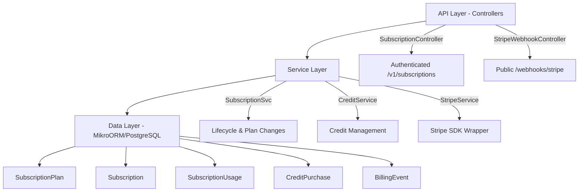

# Subscription Module Specification v15

<Info>
**Status:** Active — fully implemented  
**Module Path:** `src/modules/subscription/`  
**Payment Gateway:** Stripe
</Info>

## Overview

The Subscription Module implements a **freemium SaaS billing system** for PropWise CRM. Every organization has a subscription tied to one of four plan tiers. The module handles:

- **Plan-based feature gating** — binary feature flags per tier
- **Resource limits** — caps on leads, contacts, deals, companies, and storage
- **Credit-based metering** — monthly AI and messaging allowances with purchasable top-ups
- **Dual seat types** — manager seats and agent seats with per-tier pricing; every user consumes a seat
- **Stripe integration** — checkout, subscription management, mid-cycle plan changes, webhooks, billing portal
- **Proration** — mid-cycle upgrades, downgrades, and seat changes are prorated to the day
- **Suspension flow** — 2-day grace period on payment failure, then org goes read-only

### Design Principles

<AccordionGroup>
<Accordion title="Core Design Decisions">
| Principle | Decision |
|---|---|
| Freemium model | Free plan with limited features; paid tiers unlock progressively |
| Per-org billing | Billing is per organization; developer portal is free |
| Dual seat types | Manager seats (Owner, Admin) and agent seats (Basic, custom roles); every user consumes a seat |
| Seat type derived from role | No explicit seat assignment — seat type is automatically determined by the user's RBAC role |
| Feature flags over tier checks | Gating uses `@RequiresFeature('flag')` on plan JSONB — changing what a tier includes requires only a seeder update, not code changes |
| Service-layer limit enforcement | Resource limits and credit consumption are checked in service methods, not guards, because they need entity counts |
| Stripe as source of truth for payments | Webhook-driven lifecycle: the app reacts to Stripe events rather than polling |
| Prorated plan changes | All mid-cycle changes (upgrade, downgrade, add/remove seats) use `proration_behavior: 'create_prorations'` — charges are fair to the day |
| Checkout vs. change-plan separation | `POST /checkout` is for first-time subscription (Free → Paid); `POST /change-plan` is for switching between paid tiers |
| Idempotent webhooks | Every Stripe event is logged in `BillingEvent` with a unique `stripeEventId` to prevent duplicate processing |
| Graceful degradation | If `app.stripe.secretKey` (`STRIPE_SECRET_KEY`) is not set, billing features are unavailable but the app still starts |
</Accordion>
</AccordionGroup>

## Architecture

### High-level diagram



### Data flow

<Tabs>
<Tab title="First-time Checkout">
<Steps>
<Step title="Frontend triggers upgrade">
Frontend "Upgrade" button → `POST /v1/subscriptions/checkout`
</Step>

<Step title="Validation">
Rejects if org already has a Stripe subscription (use change-plan instead)
</Step>

<Step title="Create checkout session">
`SubscriptionService.createCheckoutSession()` → `StripeService.createCheckoutSession()` → Returns Stripe Checkout URL
</Step>

<Step title="Payment processing">
User pays on Stripe's hosted page → Stripe fires `checkout.session.completed` webhook
</Step>

<Step title="Activation">
`StripeWebhookController` receives + verifies signature → `SubscriptionService.activateSubscription()` → Subscription entity updated to ACTIVE
</Step>
</Steps>
</Tab>

<Tab title="Plan Change">
<Steps>
<Step title="Frontend triggers change">
Frontend "Change Plan" button → `POST /v1/subscriptions/change-plan`
</Step>

<Step title="Validation">
`SubscriptionService.changePlan()` validates seat overflow (blocks if current users exceed new plan capacity)
</Step>

<Step title="Stripe update">
`StripeService.swapSubscriptionPrice()` with proration enabled
</Step>

<Step title="Seat reconciliation">
Reconciles seat line items (old tier price → new tier price)
</Step>

<Step title="Local update">
Updates local Subscription entity and returns updated subscription immediately
</Step>
</Steps>
</Tab>

<Tab title="Payment Failure">
<Steps>
<Step title="Initial failure">
Stripe charges renewal invoice fails → `invoice.payment_failed` → `handleInvoicePaymentFailed()` → status → PAST_DUE
</Step>

<Step title="Retry period">
Stripe retries for 2 days:
- Payment succeeds → `invoice.paid` → back to ACTIVE
- All retries fail → `customer.subscription.updated` (status: unpaid)
</Step>

<Step title="Suspension">
`handleSubscriptionUpdated()` → status → SUSPENDED → Org is read-only (SubscriptionActiveGuard blocks writes)
</Step>
</Steps>
</Tab>
</Tabs>

## Plan Tiers & Pricing

<CardGroup cols={2}>
<Card title="Pricing Structure" icon="dollar-sign">
Four tiers priced in USD cents with annual discounts
</Card>
<Card title="Seat Management" icon="users">
Dual seat types with per-tier pricing
</Card>
</CardGroup>

### Plan comparison

| | **Free** | **Starter** | **Professional** | **Business** |
|---|---|---|---|---|
| Monthly price | $0 | $49 | $149 | $399 |
| Annual price | $0 | $470.40 (~20% off) | $1,430.40 | $3,830.40 |
| Manager seats included | 1 | 2 | 5 | 10 |
| Agent seats included | 0 | 3 | 15 | 40 |
| Extra manager seat | — | $25/mo | $20/mo | $18/mo |
| Extra agent seat | — | $12/mo | $10/mo | $8/mo |

### Resource limits

| Resource | Free | Starter | Professional | Business |
|---|---|---|---|---|
| Leads | 50 | 1,000 | 10,000 | Unlimited |
| Contacts | 50 | 1,000 | 10,000 | Unlimited |
| Deals | 20 | 500 | 5,000 | Unlimited |
| Companies | 10 | 200 | 2,000 | Unlimited |
| Storage | 500 MB | 5 GB | 25 GB | 100 GB |

### Monthly credits

| Credit type | Free | Starter | Professional | Business |
|---|---|---|---|---|
| AI credits | 20 | 200 | 1,000 | 5,000 |
| Messaging credits | 0 | 100 | 500 | 2,000 |

## Feature Gating Model

<Note>
Features are gated using three distinct mechanisms for different use cases.
</Note>

### Type 1: Binary feature flags

Boolean flags stored in `SubscriptionPlan.features` (JSONB). Checked via `@RequiresFeature('flagName')` guard decorator or `SubscriptionService.checkFeature()`.

<AccordionGroup>
<Accordion title="Feature Flag Reference">
| Feature flag | Free | Starter | Pro | Business |
|---|---|---|---|---|
| `customPipelineStages` | — | Yes | Yes | Yes |
| `distributionEngine` | — | — | Yes | Yes |
| `escalationEngine` | — | — | Yes | Yes |
| `advancedAnalytics` | — | — | Yes | Yes |
| `apiAccess` | — | — | Yes | Yes |
| `commissionTracking` | — | — | Yes | Yes |
| `teamsAndHierarchy` | — | — | Yes | Yes |
| `customRoles` | — | — | — | Yes |
| `whiteLabel` | — | — | — | Yes |
| `maxMessagingChannels` | 0 | 1 | 3 | Unlimited (-1) |
| `maxEmailIntegrations` | 0 | 1 | 3 | Unlimited (-1) |
| `auditLogRetentionDays` | 0 | 0 | 30 | Unlimited (-1) |
</Accordion>
</AccordionGroup>

### Type 2: Credit-based (monthly allowance)

Features that are available on the tier but have a monthly budget that resets each billing cycle. Tracked in `SubscriptionUsage`. When exhausted, the org can purchase one-time top-up packs (`CreditPurchase`).

<Tip>
Consumption order: **monthly plan allowance first → purchased packs FIFO (oldest first)**
</Tip>

### Type 3: Add-on packs

| Add-on | Behavior | Stripe model |
|---|---|---|
| Storage pack (+10 GB) | Recurring, stacks | Subscription line item (per-unit) |
| AI credit pack (+500) | One-time, consumed then gone | Payment intent |
| Messaging credit pack (+500) | One-time, consumed then gone | Payment intent |

## Seat Management

### Seat types

Every user in an organization consumes exactly one seat. The seat type is **derived from the user's RBAC role** — there is no separate seat assignment.

| Seat type | Roles that consume it | Price varies by tier |
|---|---|---|
| **Manager** | Owner, Admin | Yes |
| **Agent** | Basic, custom org roles | Yes |

<CodeGroup>
```typescript Role-to-Seat Mapping
const ROLE_SEAT_MAP: Record<string, SeatType> = {
  Owner: SeatType.MANAGER,
  Admin: SeatType.MANAGER,
};
// Any other role → SeatType.AGENT
```
</CodeGroup>

### Seat counting

<Warning>
Seats are **derived from RBAC roles**, not tracked via a separate assignment table. The count is computed on-demand from active `UserOrgRole` records.
</Warning>

```
managerSeatsUsed = count of active users with Owner or Admin org role
agentSeatsUsed   = count of active users with any other org role
```

A seat is **not occupied** by a pending invitation — it only counts when the user has accepted and has an active `UserOrgRole`:

| Step | Seat occupied? |
|---|---|
| Admin sends invitation with role "Admin" | No — seat availability is checked but not reserved |
| User accepts → `UserOrgRole` created | Yes — now counted |
| User removed (role soft-deleted) | No — freed |
| User's role changed (Basic → Admin) | Swaps: frees one agent seat, occupies one manager seat |

### Enforcement points

Seat availability is checked at two integration points:

1. **`invitation.service.ts`** — before creating an invitation, the role determines the seat type and availability is checked
2. **`role-assignment-validation.service.ts`** — when changing a user's role (e.g. promoting Basic → Admin), checks that the target seat type has room; the old seat type is freed simultaneously

### Proration on seat changes

<Info>
Adding or removing seats mid-cycle uses `proration_behavior: 'create_prorations'`
</Info>

- **Adding a seat on April 15** (30-day month): prorated charge for 15 remaining days, billed on the next invoice
- **Removing a seat on April 15**: prorated credit for 15 remaining days, applied to the next invoice
- **Adding on April 4, removing on April 6**: net charge for 2 days only (charge for 26 days minus credit for 24 days)

### Stripe billing

Extra seats are billed as subscription line items with `per_unit` pricing. A subscription for a Professional org with 7 managers and 20 agents would have:

| Line Item | Qty | Price |
|---|---|---|
| PropWise Professional | 1 | $149/mo |
| Extra Manager Seat (Pro) | 2 | $40/mo |
| Extra Agent Seat (Pro) | 5 | $50/mo |

## Credit System

### Consumption flow

<CodeGroup>
```typescript Credit Consumption
SubscriptionService.consumeCredits(orgId, 'ai', 1)
  → CreditService.consumeCredits(subscription, AI, 1)
      1. Check monthly allowance: usage.aiCreditsUsed < plan.aiCreditsPerMonth
      2. If sufficient monthly → deduct from monthly allowance
      3. If insufficient monthly → deduct from purchased packs (FIFO)
      4. If insufficient total → throw InsufficientCreditsException
```
</CodeGroup>

### Monthly credit reset

Credits reset on the subscription's billing cycle date:

<Steps>
<Step title="Billing cycle triggers">
Stripe webhook `invoice.paid` for renewal invoice
</Step>

<Step title="Reset monthly usage">
`SubscriptionService.handleInvoicePaid()` → `resetMonthlyUsage()`
</Step>

<Step title="Update tracking">
Sets `usage.aiCreditsUsed = 0`, `usage.messagingCreditsUsed = 0`, updates `usage.currentPeriodStart`
</Step>
</Steps>

### Credit purchase flow

<Tabs>
<Tab title="One-time Pack Purchase">
```typescript
POST /v1/subscriptions/credits/purchase
{
  "type": "ai",
  "quantity": 500
}

→ StripeService.createPaymentIntent()
→ Frontend collects payment with Stripe Elements
→ payment_intent.succeeded webhook
→ CreditService.recordCreditPurchase()
→ CreditPurchase entity created with remaining = quantity
```
</Tab>

<Tab title="Recurring Storage Pack">
```typescript
POST /v1/subscriptions/storage/add
{
  "packs": 2  // +20 GB total
}

→ StripeService.addSubscriptionItem()
→ Immediate proration for remainder of current period
→ Recurring charge on future invoices
→ Organization.storageLimitMB updated
```
</Tab>
</Tabs>

## Entity Specifications

### Core entities

<AccordionGroup>
<Accordion title="SubscriptionPlan">
```typescript
@Entity()
export class SubscriptionPlan {
  @PrimaryKey()
  id!: number;

  @Property()
  name!: string;

  @Property()
  stripePriceIdMonthly?: string;

  @Property()
  stripePriceIdAnnual?: string;

  @Property()
  monthlyPriceCents!: number;

  @Property()
  annualPriceCents!: number;

  @Property()
  managerSeatsIncluded!: number;

  @Property()
  agentSeatsIncluded!: number;

  @Property()
  extraManagerSeatPrice!: number;

  @Property()
  extraAgentSeatPrice!: number;

  @Property()
  features!: Record<string, any>; // JSONB

  @Property()
  leadsLimit!: number; // -1 = unlimited

  @Property()
  contactsLimit!: number;

  @Property()
  dealsLimit!: number;

  @Property()
  companiesLimit!: number;

  @Property()
  storageLimitMB!: number;

  @Property()
  aiCreditsPerMonth!: number;

  @Property()
  messagingCreditsPerMonth!: number;
}
```
</Accordion>

<Accordion title="Subscription">
```typescript
@Entity()
export class Subscription {
  @PrimaryKey()
  id!: number;

  @ManyToOne(() => Organization)
  organization!: Organization;

  @ManyToOne(() => SubscriptionPlan)
  plan!: SubscriptionPlan;

  @Enum(() => SubscriptionStatus)
  status!: SubscriptionStatus;

  @Enum(() => BillingInterval)
  billingInterval!: BillingInterval;

  @Property()
  stripeSubscriptionId?: string;

  @Property()
  currentPeriodStart?: Date;

  @Property()
  currentPeriodEnd?: Date;

  @Property()
  canceledAt?: Date;

  @Property()
  cancelAtPeriodEnd!: boolean;

  @OneToOne(() => SubscriptionUsage, usage => usage.subscription, {
    cascade: [Cascade.PERSIST, Cascade.REMOVE],
    orphanRemoval: true,
  })
  usage!: SubscriptionUsage;

  @OneToMany(() => CreditPurchase, purchase => purchase.subscription)
  creditPurchases = new Collection<CreditPurchase>(this);
}
```
</Accordion>

<Accordion title="SubscriptionUsage">
```typescript
@Entity()
export class SubscriptionUsage {
  @PrimaryKey()
  id!: number;

  @OneToOne(() => Subscription, subscription => subscription.usage)
  subscription!: Subscription;

  @Property()
  leadsCount!: number;

  @Property()
  contactsCount!: number;

  @Property()
  dealsCount!: number;

  @Property()
  companiesCount!: number;

  @Property()
  storageMB!: number;

  @Property()
  aiCreditsUsed!: number;

  @Property()
  messagingCreditsUsed!: number;

  @Property()
  currentPeriodStart!: Date;
}
```
</Accordion>

<Accordion title="CreditPurchase">
```typescript
@Entity()
export class CreditPurchase {
  @PrimaryKey()
  id!: number;

  @ManyToOne(() => Subscription)
  subscription!: Subscription;

  @Enum(() => CreditType)
  type!: CreditType;

  @Property()
  quantity!: number;

  @Property()
  remaining!: number;

  @Property()
  stripePaymentIntentId!: string;

  @Property()
  createdAt!: Date;

  @Property()
  expiresAt?: Date; // Optional expiration
}
```
</Accordion>
</AccordionGroup>

## Stripe Integration

### Configuration

<CodeGroup>
```typescript Environment Variables
STRIPE_SECRET_KEY=sk_live_... // or sk_test_...
STRIPE_WEBHOOK_SECRET=whsec_...
STRIPE_PUBLISHABLE_KEY=pk_live_... // Frontend only
```
</CodeGroup>

### Webhook handling

<Warning>
All Stripe webhooks must be idempotent and logged to prevent duplicate processing.
</Warning>

<AccordionGroup>
<Accordion title="Supported Webhook Events">
| Event | Handler | Purpose |
|---|---|---|
| `checkout.session.completed` | `handleCheckoutCompleted` | Activate new subscription |
| `customer.subscription.updated` | `handleSubscriptionUpdated` | Sync status changes |
| `customer.subscription.deleted` | `handleSubscriptionDeleted` | Cancel subscription |
| `invoice.paid` | `handleInvoicePaid` | Reset monthly usage, update period |
| `invoice.payment_failed` | `handleInvoicePaymentFailed` | Set PAST_DUE status |
| `payment_intent.succeeded` | `handlePaymentIntentSucceeded` | Record credit purchases |
</Accordion>

<Accordion title="Webhook Security">
```typescript
// Signature verification in StripeWebhookController
@Post()
async handleWebhook(
  @Body(new RawBodyMiddleware()) body: Buffer,
  @Headers('stripe-signature') signature: string,
) {
  const event = this.stripeService.constructWebhookEvent(body, signature);
  // Process event...
}
```
</Accordion>
</AccordionGroup>

## Subscription Lifecycle

<Tabs>
<Tab title="Free Plan">
<Steps>
<Step title="Organization creation">
New org automatically gets Free plan subscription with status ACTIVE
</Step>

<Step title="Feature access">
Limited to Free tier features and resource limits
</Step>

<Step title="Upgrade path">
Use `POST /checkout` to initiate first paid subscription
</Step>
</Steps>
</Tab>

<Tab title="Paid Plan">
<Steps>
<Step title="Checkout">
Stripe Checkout session → payment → webhook activation
</Step>

<Step title="Active subscription">
Full access to plan features and limits
</Step>

<Step title="Renewal">
Automatic billing cycle with usage reset
</Step>

<Step title="Plan changes">
Use `POST /change-plan` for tier switches
</Step>
</Steps>
</Tab>

<Tab title="Suspension">
<Steps>
<Step title="Payment failure">
Invoice payment fails → PAST_DUE status
</Step>

<Step title="Grace period">
2-day retry period by Stripe
</Step>

<Step title="Suspension">
All retries fail → SUSPENDED status → read-only mode
</Step>

<Step title="Recovery">
Payment success → back to ACTIVE status
</Step>
</Steps>
</Tab>
</Tabs>

## Plan Changes (Upgrade/Downgrade)

### Validation rules

<Check>
**Seat overflow protection:** Cannot downgrade if current users exceed new plan capacity
</Check>

<CodeGroup>
```typescript Validation Logic
// Example: Professional (5 managers, 15 agents) → Starter (2 managers, 3 agents)
const currentManagers = await this.countManagerSeats(orgId);
const currentAgents = await this.countAgentSeats(orgId);

if (currentManagers > newPlan.managerSeatsIncluded) {
  throw new ConflictException('Too many manager seats in use');
}

if (currentAgents > newPlan.agentSeatsIncluded) {
  throw new ConflictException('Too many agent seats in use');
}
```
</CodeGroup>

### Proration handling

All plan changes use Stripe's proration system:

1. **Mid-cycle upgrade:** Prorated charge for feature/seat difference
2. **Mid-cycle downgrade:** Prorated credit applied to next invoice
3. **Seat adjustments:** Individual line items prorated separately

## API Endpoints

<AccordionGroup>
<Accordion title="Subscription Management">
```typescript
GET    /v1/subscriptions                    // Get current subscription
POST   /v1/subscriptions/checkout           // Create checkout session (Free → Paid)
POST   /v1/subscriptions/change-plan        // Change plan tier
POST   /v1/subscriptions/cancel             // Cancel at period end
POST   /v1/subscriptions/reactivate         // Undo cancellation
GET    /v1/subscriptions/billing-portal     // Stripe customer portal URL
```
</Accordion>

<Accordion title="Credit Management">
```typescript
GET    /v1/subscriptions/credits            // Get credit balances
POST   /v1/subscriptions/credits/purchase   // Buy credit packs
GET    /v1/subscriptions/usage              // Get usage statistics
```
</Accordion>

<Accordion title="Storage Management">
```typescript
POST   /v1/subscriptions/storage/add        // Add storage packs
DELETE /v1/subscriptions/storage/remove     // Remove storage packs
```
</Accordion>

<Accordion title="Webhooks">
```typescript
POST   /webhooks/stripe                     // Stripe webhook endpoint
```
</Accordion>
</AccordionGroup>

## Guards & Decorators

### Feature gating

<CodeGroup>
```typescript @RequiresFeature Decorator
@RequiresFeature('customPipelineStages')
@RequiresSubscription() // Also ensures active subscription
@Post('custom-stage')
async createCustomStage(@Body() dto: CreateStageDto) {
  // Only available on Starter+ plans
}
```

```typescript Resource Limit Guard
@UseGuards(ResourceLimitGuard('leads'))
@Post('lead')
async createLead(@Body() dto: CreateLeadDto) {
  // Checked against plan's leadsLimit
}
```

```typescript Subscription Status Guard
@UseGuards(SubscriptionActiveGuard)
@Post('deal')
async createDeal(@Body() dto: CreateDealDto) {
  // Blocks if subscription is SUSPENDED or PAST_DUE
}
```
</CodeGroup>

### Service-level checks

<CodeGroup>
```typescript Feature Check
const hasFeature = await this.subscriptionService.checkFeature(
  orgId,
  'advancedAnalytics'
);

if (!hasFeature) {
  throw new ForbiddenException('Feature not available on your plan');
}
```

```typescript Credit Consumption
await this.subscriptionService.consumeCredits(orgId, 'ai', 5);
// Throws InsufficientCreditsException if not enough credits
```

```typescript Resource Limit Check
await this.subscriptionService.checkResourceLimit(orgId, 'contacts', 1);
// Throws ResourceLimitExceededException if would exceed limit
```
</CodeGroup>

## Enforcement Points

### Module integration

| Module | Integration Point | Check Type |
|---|---|---|
| **Leads** | `LeadService.create()` | Resource limit |
| **Contacts** | `ContactService.create()` | Resource limit |
| **Deals** | `DealService.create()` | Resource limit |
| **Companies** | `CompanyService.create()` | Resource limit |
| **AI** | `AIService.generateContent()` | Credit consumption |
| **Messaging** | `MessagingService.sendSMS()` | Credit consumption |
| **Pipelines** | `PipelineController.createStage()` | Feature flag |
| **Analytics** | `AnalyticsController.*()` | Feature flag |
| **API** | `ApiKeyController.*()` | Feature flag |
| **Invitations** | `InvitationService.create()` | Seat availability |
| **Roles** | `RoleAssignmentService.assign()` | Seat availability |
| **File Upload** | `FileService.upload()` | Storage limit |

## Plan Seeder

### Database seeding

The plan seeder creates the four tiers with proper Stripe price IDs and feature flags:

<CodeGroup>
```typescript Seeder Example
// seeders/SubscriptionPlanSeeder.ts
export class SubscriptionPlanSeeder implements Seeder {
  async run(em: EntityManager): Promise<void> {
    const plans = [
      {
        name: 'Free',
        monthlyPriceCents: 0,
        annualPriceCents: 0,
        features: {
          customPipelineStages: false,
          distributionEngine: false,
          advancedAnalytics: false,
          // ... all features false
        },
        leadsLimit: 50,
        contactsLimit: 50,
        // ... other limits
      },
      {
        name: 'Starter',
        stripePriceIdMonthly: 'price_starter_monthly',
        stripePriceIdAnnual: 'price_starter_annual',
        monthlyPriceCents: 4900, // $49.00
        annualPriceCents: 47040, // $470.40
        features: {
          customPipelineStages: true,
          distributionEngine: false,
          advancedAnalytics: false,
          // ... selective features
        },
        leadsLimit: 1000,
        contactsLimit: 1000,
        // ... increased limits
      },
      // ... Professional and Business plans
    ];

    for (const planData of plans) {
      const plan = em.create(SubscriptionPlan, planData);
      em.persist(plan);
    }
  }
}
```
</CodeGroup>

### Environment-specific configuration

<Tabs>
<Tab title="Development">
```bash
# Uses Stripe test mode
STRIPE_SECRET_KEY=sk_test_...
STRIPE_PUBLISHABLE_KEY=pk_test_...
```
</Tab>

<Tab title="Production">
```bash
# Uses Stripe live mode
STRIPE_SECRET_KEY=sk_live_...
STRIPE_PUBLISHABLE_KEY=pk_live_...
```
</Tab>
</Tabs>

## Module Structure

```
src/modules/subscription/
├── controllers/
│   ├── subscription.controller.ts
│   └── stripe-webhook.controller.ts
├── services/
│   ├── subscription.service.ts
│   ├── credit.service.ts
│   └── stripe.service.ts
├── entities/
│   ├── subscription-plan.entity.ts
│   ├── subscription.entity.ts
│   ├── subscription-usage.entity.ts
│   ├── credit-purchase.entity.ts
│   └── billing-event.entity.ts
├── guards/
│   ├── subscription-active.guard.ts
│   ├── requires-feature.guard.ts
│   └── resource-limit.guard.ts
├── decorators/
│   ├── requires-feature.decorator.ts
│   └── requires-subscription.decorator.ts
├── dto/
│   ├── checkout.dto.ts
│   ├── change-plan.dto.ts
│   └── purchase-credits.dto.ts
├── enums/
│   ├── subscription-status.enum.ts
│   ├── billing-interval.enum.ts
│   ├── credit-type.enum.ts
│   └── seat-type.enum.ts
├── exceptions/
│   ├── insufficient-credits.exception.ts
│   └── resource-limit-exceeded.exception.ts
└── subscription.module.ts
```

## Environment Configuration

### Required environment variables

<CodeGroup>
```bash Production Environment
# Stripe Configuration
STRIPE_SECRET_KEY=sk_live_...
STRIPE_PUBLISHABLE_KEY=pk_live_...
STRIPE_WEBHOOK_SECRET=whsec_...

# Database
DATABASE_URL=postgresql://...

# Application
NODE_ENV=production
```

```bash Development Environment
# Stripe Test Mode
STRIPE_SECRET_KEY=sk_test_...
STRIPE_PUBLISHABLE_KEY=pk_test_...
STRIPE_WEBHOOK_SECRET=whsec_...

# Local Database
DATABASE_URL=postgresql://localhost:5432/propwise_dev

# Development
NODE_ENV=development
```
</CodeGroup>

### Configuration validation

<CodeGroup>
```typescript Config Service
@Injectable()
export class SubscriptionConfig {
  @IsString()
  @IsOptional()
  stripeSecretKey?: string;

  @IsString()
  @IsOptional()
  stripePublishableKey?: string;

  @IsString()
  @IsOptional()
  stripeWebhookSecret?: string;

  get isStripeEnabled(): boolean {
    return !!this.stripeSecretKey;
  }
}
```
</CodeGroup>

## Integration with Other Modules

### Cross-module dependencies

<CardGroup cols={2}>
<Card title="User Management" icon="users">
- Seat counting from active `UserOrgRole` records
- Role-based seat type determination
- Invitation seat validation
</Card>

<Card title="File Management" icon="file">
- Storage limit enforcement
- Usage tracking for uploaded files
- Storage pack billing integration
</Card>

<Card title="AI Services" icon="robot">
- Credit consumption tracking
- Monthly allowance management
- Feature flag gating for AI endpoints
</Card>

<Card title="Messaging" icon="message">
- SMS/email credit consumption
- Channel limit enforcement
- Integration limit validation
</Card>
</CardGroup>

### Event-driven updates

<CodeGroup>
```typescript User Events
// When user role changes
await this.subscriptionService.updateSeatUsage(orgId);

// When user is removed
await this.subscriptionService.reconcileSeats(orgId);
```

```typescript File Events
// When file is uploaded
await this.subscriptionService.updateStorageUsage(orgId, fileSizeMB);

// When file is deleted
await this.subscriptionService.updateStorageUsage(orgId, -fileSizeMB);
```

```typescript AI Events
// Before AI operation
await this.subscriptionService.consumeCredits(orgId, 'ai', tokensUsed);

// After messaging operation
await this.subscriptionService.consumeCredits(orgId, 'messaging', 1);
```
</CodeGroup>

<Note>
The subscription module operates as the central billing authority, with other modules checking limits and consuming resources through its service interface.
</Note>