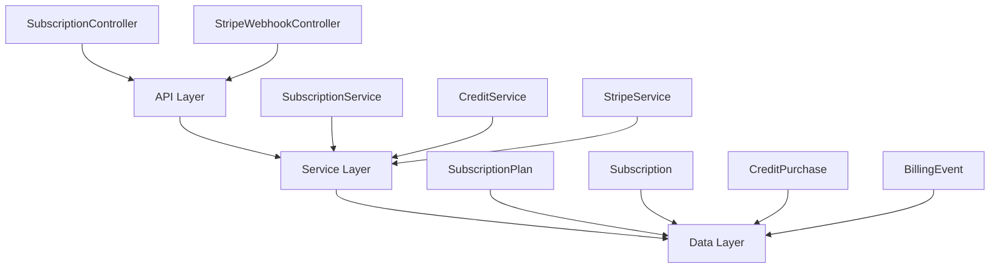
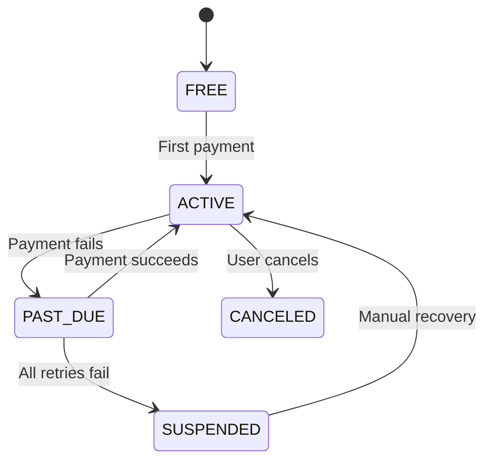

# Subscription Module Specification v16

<Info>
**Status:** Active — fully implemented  
**Module Path:** `src/modules/subscription/`  
**Payment Gateway:** Stripe
</Info>

## Overview

The Subscription Module implements a **freemium SaaS billing system** for PropWise CRM. Every organization has a subscription tied to one of four plan tiers. The module handles:

- **Plan-based feature gating** — binary feature flags per tier
- **Resource limits** — caps on leads, contacts, deals, companies, and storage
- **Credit-based metering** — monthly AI and messaging allowances with purchasable top-ups
- **Dual seat types** — manager seats and agent seats with per-tier pricing; every user consumes a seat
- **Stripe integration** — checkout, subscription management, mid-cycle plan changes, webhooks, billing portal
- **Proration** — mid-cycle upgrades, downgrades, and seat changes are prorated to the day
- **Suspension flow** — 2-day grace period on payment failure, then org goes read-only

### Design Principles

<CardGroup cols={2}>
  <Card title="Freemium Model" icon="gift">
    Free plan with limited features; paid tiers unlock progressively
  </Card>
  <Card title="Per-Org Billing" icon="building">
    Billing is per organization; developer portal is free
  </Card>
  <Card title="Dual Seat Types" icon="users">
    Manager seats (Owner, Admin) and agent seats (Basic, custom roles); every user consumes a seat
  </Card>
  <Card title="Feature Flags Over Tier Checks" icon="flag">
    Gating uses `@RequiresFeature('flag')` on plan JSONB — changing what a tier includes requires only a seeder update
  </Card>
</CardGroup>

<Note>
**Seat type is derived from role** — No explicit seat assignment; seat type is automatically determined by the user's RBAC role.
</Note>

## Architecture

### High-Level Diagram



### Data Flow

<Tabs>
  <Tab title="First-time Checkout">
    <Steps>
      <Step title="User Clicks Upgrade">
        Frontend "Upgrade" button triggers checkout flow
      </Step>
      <Step title="Create Checkout Session">
        `POST /v1/subscriptions/checkout` → Rejects if org already has a Stripe subscription
      </Step>
      <Step title="Process Payment">
        User pays on Stripe's hosted page
      </Step>
      <Step title="Activate Subscription">
        Stripe fires `checkout.session.completed` webhook → Subscription entity updated to ACTIVE
      </Step>
    </Steps>
  </Tab>
  
  <Tab title="Plan Change">
    <Steps>
      <Step title="Initiate Change">
        Frontend "Change Plan" button → `POST /v1/subscriptions/change-plan`
      </Step>
      <Step title="Validate Seats">
        Validates seat overflow (blocks if current users exceed new plan capacity)
      </Step>
      <Step title="Update Stripe">
        `StripeService.swapSubscriptionPrice()` with proration
      </Step>
      <Step title="Update Local Data">
        Updates local Subscription entity and returns immediately
      </Step>
    </Steps>
  </Tab>
</Tabs>

## Plan Tiers & Pricing

### Tier Comparison

| Tier | Monthly | Annual | Manager Seats | Agent Seats | Extra Manager | Extra Agent |
|------|---------|--------|---------------|-------------|---------------|-------------|
| **Free** | $0 | $0 | 1 | 0 | — | — |
| **Starter** | $49 | $470.40 | 2 | 3 | $25/mo | $12/mo |
| **Professional** | $149 | $1,430.40 | 5 | 15 | $20/mo | $10/mo |
| **Business** | $399 | $3,830.40 | 10 | 40 | $18/mo | $8/mo |

<Note>
Annual pricing includes approximately 20% discount compared to monthly billing.
</Note>

### Resource Limits

<AccordionGroup>
  <Accordion title="Data Limits">
    | Resource | Free | Starter | Professional | Business |
    |----------|------|---------|--------------|----------|
    | Leads | 50 | 1,000 | 10,000 | Unlimited |
    | Contacts | 50 | 1,000 | 10,000 | Unlimited |
    | Deals | 20 | 500 | 5,000 | Unlimited |
    | Companies | 10 | 200 | 2,000 | Unlimited |
  </Accordion>
  
  <Accordion title="Storage Limits">
    | Tier | Storage Limit |
    |------|---------------|
    | Free | 500 MB |
    | Starter | 5 GB |
    | Professional | 25 GB |
    | Business | 100 GB |
  </Accordion>
  
  <Accordion title="Monthly Credits">
    | Credit Type | Free | Starter | Professional | Business |
    |-------------|------|---------|--------------|----------|
    | AI credits | 20 | 200 | 1,000 | 5,000 |
    | Messaging credits | 0 | 100 | 500 | 2,000 |
  </Accordion>
</AccordionGroup>

## Feature Gating Model

The system uses three distinct gating mechanisms:

### Binary Feature Flags

<Warning>
Boolean flags stored in `SubscriptionPlan.features` (JSONB). Checked via `@RequiresFeature('flagName')` guard decorator.
</Warning>

| Feature Flag | Free | Starter | Pro | Business |
|--------------|------|---------|-----|----------|
| `customPipelineStages` | ❌ | ✅ | ✅ | ✅ |
| `distributionEngine` | ❌ | ❌ | ✅ | ✅ |
| `escalationEngine` | ❌ | ❌ | ✅ | ✅ |
| `advancedAnalytics` | ❌ | ❌ | ✅ | ✅ |
| `apiAccess` | ❌ | ❌ | ✅ | ✅ |
| `customRoles` | ❌ | ❌ | ❌ | ✅ |
| `whiteLabel` | ❌ | ❌ | ❌ | ✅ |

### Credit-Based Features

Features available on the tier but with monthly budgets that reset each billing cycle. Tracked in `SubscriptionUsage`.

<Tip>
**Consumption Order:** Monthly plan allowance first → purchased packs FIFO (oldest first)
</Tip>

### Add-on Packs

| Add-on | Behavior | Stripe Model |
|--------|----------|--------------|
| Storage pack (+10 GB) | Recurring, stacks | Subscription line item |
| AI credit pack (+500) | One-time, consumed | Payment intent |
| Messaging credit pack (+500) | One-time, consumed | Payment intent |

## Seat Management

### Seat Types

Every user consumes exactly one seat. The seat type is **derived from the user's RBAC role**.

<CodeGroup>
```typescript Seat Type Mapping
const ROLE_SEAT_MAP: Record<string, SeatType> = {
  Owner: SeatType.MANAGER,
  Admin: SeatType.MANAGER,
};
// Any other role → SeatType.AGENT
```

```typescript Seat Counting
managerSeatsUsed = count of active users with Owner or Admin org role
agentSeatsUsed   = count of active users with any other org role
```
</CodeGroup>

### Enforcement Points

<Steps>
  <Step title="Invitation Service">
    Before creating an invitation, the role determines the seat type and availability is checked
  </Step>
  <Step title="Role Assignment Validation">
    When changing a user's role, checks that the target seat type has room
  </Step>
</Steps>

<Warning>
A seat is **not occupied** by a pending invitation — it only counts when the user has accepted and has an active `UserOrgRole`.
</Warning>

### Proration on Seat Changes

Adding or removing seats mid-cycle uses `proration_behavior: 'create_prorations'`:

- **Adding a seat on April 15** (30-day month): prorated charge for 15 remaining days
- **Removing a seat on April 15**: prorated credit for 15 remaining days
- **Net changes**: Adding on April 4, removing on April 6 = net charge for 2 days only

## Credit System

### Consumption Flow

```typescript
SubscriptionService.consumeCredits(orgId, 'ai', 1)
  → CreditService.consumeCredits(subscription, AI, 1)
      1. Check monthly allowance: usage.aiCreditsUsed < plan.aiCredits
      2. If insufficient, consume from CreditPurchase (FIFO)
      3. Update usage counters
      4. Return success/failure
```

<Note>
Credits consume monthly plan allowance first, then purchased packs in FIFO order (oldest first).
</Note>

## Entity Specifications

### SubscriptionPlan

```typescript
interface SubscriptionPlan {
  id: string;
  name: string; // 'Free', 'Starter', 'Professional', 'Business'
  monthlyPrice: number; // USD cents
  annualPrice: number; // USD cents
  features: Record<string, any>; // JSONB feature flags
  managerSeats: number;
  agentSeats: number;
  // Resource limits
  maxLeads: number;
  maxContacts: number;
  maxDeals: number;
  maxCompanies: number;
  storageLimit: number; // bytes
  // Monthly credits
  aiCredits: number;
  messagingCredits: number;
}
```

### Subscription

```typescript
interface Subscription {
  id: string;
  organizationId: string;
  planId: string;
  status: SubscriptionStatus; // ACTIVE, PAST_DUE, SUSPENDED, CANCELED
  stripeSubscriptionId: string;
  stripeCustomerId: string;
  currentPeriodStart: Date;
  currentPeriodEnd: Date;
  billingCycle: 'MONTHLY' | 'ANNUAL';
  managerSeats: number;
  agentSeats: number;
}
```

## Stripe Integration

### Webhook Events

<AccordionGroup>
  <Accordion title="checkout.session.completed">
    Activates subscription when first-time payment succeeds
    ```typescript
    handleCheckoutCompleted(event) {
      → SubscriptionService.activateSubscription()
      → Update status to ACTIVE
      → Set billing periods
    }
    ```
  </Accordion>
  
  <Accordion title="invoice.paid">
    Handles successful renewal payments
    ```typescript
    handleInvoicePaid(event) {
      → Update currentPeriodEnd
      → Reset monthly usage counters
      → Status remains ACTIVE
    }
    ```
  </Accordion>
  
  <Accordion title="invoice.payment_failed">
    Handles failed payments and grace period
    ```typescript
    handleInvoicePaymentFailed(event) {
      → Status → PAST_DUE
      → Start 2-day grace period
      → Stripe continues retry attempts
    }
    ```
  </Accordion>
</AccordionGroup>

### Idempotent Processing

<Check>
Every Stripe event is logged in `BillingEvent` with a unique `stripeEventId` to prevent duplicate processing.
</Check>

## Subscription Lifecycle

### Status Flow



### Grace Period

<Warning>
**2-day grace period** on payment failure. During PAST_DUE status, the organization continues to function normally while Stripe retries payment.
</Warning>

## Plan Changes

### Upgrade/Downgrade Flow

<Steps>
  <Step title="Validation">
    Check seat overflow - current users must not exceed new plan capacity
  </Step>
  <Step title="Stripe Update">
    Swap subscription price with prorated billing
  </Step>
  <Step title="Seat Reconciliation">
    Adjust seat line items (old tier price → new tier price)
  </Step>
  <Step title="Local Update">
    Update Subscription entity and return immediately
  </Step>
</Steps>

<Tip>
Plan changes use `POST /change-plan` for existing paid subscriptions, while `POST /checkout` is only for Free → Paid transitions.
</Tip>

## API Endpoints

### Subscription Management

<CodeGroup>
```http Get Current Subscription
GET /v1/subscriptions/current
Authorization: Bearer {token}

Response:
{
  "subscription": {
    "id": "sub_123",
    "status": "ACTIVE",
    "plan": {...},
    "usage": {...}
  }
}
```

```http Create Checkout Session
POST /v1/subscriptions/checkout
Authorization: Bearer {token}
Content-Type: application/json

{
  "planId": "plan_professional",
  "billingCycle": "MONTHLY"
}

Response:
{
  "checkoutUrl": "https://checkout.stripe.com/..."
}
```

```http Change Plan
POST /v1/subscriptions/change-plan
Authorization: Bearer {token}
Content-Type: application/json

{
  "planId": "plan_business"
}

Response:
{
  "subscription": {...}
}
```
</CodeGroup>

## Guards & Decorators

### Feature Gating

<CodeGroup>
```typescript RequiresFeature Decorator
@RequiresFeature('advancedAnalytics')
@Get('/analytics/advanced')
async getAdvancedAnalytics() {
  // Only accessible to Pro/Business tiers
}
```

```typescript SubscriptionActive Guard
@UseGuards(SubscriptionActiveGuard)
@Post('/leads')
async createLead() {
  // Blocked if subscription is SUSPENDED
}
```

```typescript Resource Limit Check
async createLead(orgId: string, data: CreateLeadDto) {
  await this.subscriptionService.checkResourceLimit(
    orgId, 
    'leads'
  );
  // Throws if limit exceeded
}
```
</CodeGroup>

## Enforcement Points

### Service-Layer Checks

Resource limits and credit consumption are checked in service methods:

<Warning>
Limits are enforced in services, not guards, because they need entity counts from the database.
</Warning>

```typescript
// leads.service.ts
async create(orgId: string, data: CreateLeadDto) {
  await this.subscriptionService.checkResourceLimit(orgId, 'leads');
  // Proceed with creation
}

// ai.service.ts  
async generateContent(orgId: string) {
  await this.subscriptionService.consumeCredits(orgId, 'ai', 1);
  // Proceed with AI call
}
```

## Plan Seeder

### Initial Setup

The seeder creates all four plan tiers with their feature flags and limits:

```typescript
export class SubscriptionPlanSeeder {
  async run() {
    await this.createPlan({
      name: 'Free',
      monthlyPrice: 0,
      features: {
        customPipelineStages: false,
        distributionEngine: false,
        // ... other flags
      },
      managerSeats: 1,
      agentSeats: 0,
      maxLeads: 50,
      // ... other limits
    });
    
    // Create Starter, Professional, Business...
  }
}
```

<Note>
Changing what features a tier includes requires only updating the seeder and re-running it - no code changes needed.
</Note>

## Module Structure

```
src/modules/subscription/
├── controllers/
│   ├── subscription.controller.ts
│   └── stripe-webhook.controller.ts
├── services/
│   ├── subscription.service.ts
│   ├── credit.service.ts
│   └── stripe.service.ts
├── entities/
│   ├── subscription-plan.entity.ts
│   ├── subscription.entity.ts
│   ├── subscription-usage.entity.ts
│   ├── credit-purchase.entity.ts
│   └── billing-event.entity.ts
├── guards/
│   ├── requires-feature.guard.ts
│   └── subscription-active.guard.ts
├── decorators/
│   └── requires-feature.decorator.ts
├── seeders/
│   └── subscription-plan.seeder.ts
└── subscription.module.ts
```

## Environment Configuration

### Required Variables

```env
# Stripe Configuration
STRIPE_SECRET_KEY=sk_test_...
STRIPE_PUBLISHABLE_KEY=pk_test_...
STRIPE_WEBHOOK_SECRET=whsec_...

# Application URLs
APP_FRONTEND_URL=https://app.propwise.ai
APP_SUCCESS_URL=https://app.propwise.ai/billing/success
APP_CANCEL_URL=https://app.propwise.ai/billing/cancel
```

<Warning>
If `STRIPE_SECRET_KEY` is not set, billing features are unavailable but the app still starts with graceful degradation.
</Warning>

## Integration with Other Modules

### Cross-Module Dependencies

<CardGroup cols={2}>
  <Card title="Organization Module" icon="building">
    Every organization must have a subscription; creates Free tier subscription on org creation
  </Card>
  <Card title="User Management" icon="users">
    Seat consumption derived from RBAC roles; checks availability during invitation/role changes
  </Card>
  <Card title="Lead Management" icon="user-plus">
    Resource limits enforced before lead creation; checks current count against plan limits
  </Card>
  <Card title="AI Services" icon="brain">
    Credit consumption before AI API calls; tracks usage and enforces monthly allowances
  </Card>
</CardGroup>

### Event Integration

```typescript
// Organization creation
@EventHandler(OrganizationCreatedEvent)
async handleOrgCreated(event) {
  await this.subscriptionService.createFreeSubscription(event.organizationId);
}

// User role change  
@EventHandler(UserRoleChangedEvent)
async handleRoleChanged(event) {
  await this.subscriptionService.validateSeatAvailability(
    event.organizationId,
    event.newRole
  );
}
```

<Tip>
The subscription module listens for organization and user events to automatically manage seat allocation and ensure billing compliance.
</Tip>