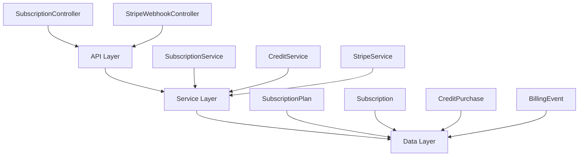

The Subscription Module implements a **freemium SaaS billing system** for PropWise CRM. Every organization has a subscription tied to one of four plan tiers. The module handles plan-based feature gating, resource limits, credit-based metering, dual seat types, Stripe integration, and subscription lifecycle management.

## Overview

<CardGroup cols={2}>
<Card title="Plan Tiers" icon="layer-group">
Free, Starter, Professional, and Business plans with progressive feature unlocks
</Card>
<Card title="Feature Gating" icon="lock">
Binary flags, credit limits, and resource caps based on subscription tier
</Card>
<Card title="Seat Management" icon="users">
Manager and agent seats with role-based assignment and prorated billing
</Card>
<Card title="Stripe Integration" icon="credit-card">
Complete payment lifecycle with webhooks, proration, and billing portal
</Card>
</CardGroup>

### Design Principles

<AccordionGroup>
<Accordion title="Freemium Model">
Free plan with limited features; paid tiers unlock progressively more capabilities
</Accordion>
<Accordion title="Per-Organization Billing">
Billing is per organization; developer portal remains free
</Accordion>
<Accordion title="Dual Seat Types">
Manager seats (Owner, Admin) and agent seats (Basic, custom roles); every user consumes exactly one seat
</Accordion>
<Accordion title="Feature Flags Over Tier Checks">
Gating uses `@RequiresFeature('flag')` on plan JSONB — changing tier features only requires seeder updates
</Accordion>
<Accordion title="Stripe as Source of Truth">
Webhook-driven lifecycle: the app reacts to Stripe events rather than polling
</Accordion>
</AccordionGroup>

## Architecture

The module follows a three-layer architecture with clear separation of concerns:



### Data Flow

<Steps>
<Step title="First-time Checkout (Free → Paid)">
Frontend upgrade button triggers `POST /v1/subscriptions/checkout`, creates Stripe Checkout session, user pays on hosted page, webhook activates subscription
</Step>
<Step title="Mid-cycle Plan Changes">
`POST /v1/subscriptions/change-plan` validates seat capacity, swaps Stripe prices with proration, updates local subscription entity
</Step>
<Step title="Payment Failures">
Invoice payment failure triggers 2-day grace period, then organization becomes read-only if all retries fail
</Step>
</Steps>

## Plan Tiers & Pricing

<Tabs>
<Tab title="Plan Overview">
| Plan | Monthly | Annual | Manager Seats | Agent Seats |
|------|---------|--------|---------------|-------------|
| **Free** | $0 | $0 | 1 included | 0 included |
| **Starter** | $49 | $470.40 | 2 included | 3 included |
| **Professional** | $149 | $1,430.40 | 5 included | 15 included |
| **Business** | $399 | $3,830.40 | 10 included | 40 included |
</Tab>
<Tab title="Extra Seat Pricing">
| Plan | Extra Manager | Extra Agent |
|------|---------------|-------------|
| **Starter** | $25/month | $12/month |
| **Professional** | $20/month | $10/month |
| **Business** | $18/month | $8/month |
</Tab>
</Tabs>

### Resource Limits

<Note>
Resource limits are enforced at the service layer during entity creation and modification operations.
</Note>

| Resource | Free | Starter | Professional | Business |
|----------|------|---------|--------------|----------|
| Leads | 50 | 1,000 | 10,000 | Unlimited |
| Contacts | 50 | 1,000 | 10,000 | Unlimited |
| Deals | 20 | 500 | 5,000 | Unlimited |
| Companies | 10 | 200 | 2,000 | Unlimited |
| Storage | 500 MB | 5 GB | 25 GB | 100 GB |

### Monthly Credits

| Credit Type | Free | Starter | Professional | Business |
|-------------|------|---------|--------------|----------|
| AI credits | 20 | 200 | 1,000 | 5,000 |
| Messaging credits | 0 | 100 | 500 | 2,000 |

## Feature Gating Model

The module implements three distinct gating mechanisms:

### Binary Feature Flags

Boolean flags stored in `SubscriptionPlan.features` (JSONB) and checked via decorators:

```typescript
@RequiresFeature('customPipelineStages')
@Post('custom-stages')
async createCustomStage() {
  // Only available on paid plans
}
```

<AccordionGroup>
<Accordion title="Starter Plan Features">
- Custom Pipeline Stages
- Basic integrations (1 messaging channel, 1 email)
</Accordion>
<Accordion title="Professional Plan Features">
- All Starter features plus:
- Distribution Engine
- Escalation Engine
- Advanced Analytics
- API Access
- Commission Tracking
- Teams & Hierarchy
- Enhanced integrations (3 channels each)
- 30-day audit log retention
</Accordion>
<Accordion title="Business Plan Features">
- All Professional features plus:
- Custom Roles
- White Label
- Unlimited integrations
- Unlimited audit log retention
</Accordion>
</AccordionGroup>

### Credit-Based Features

Features with monthly allowances that reset each billing cycle:

<CodeGroup>
```typescript Credit Consumption
await this.subscriptionService.consumeCredits(
  organizationId, 
  CreditType.AI, 
  1
);
```

```typescript Balance Check
const balance = await this.creditService.getCreditBalance(
  subscription,
  CreditType.MESSAGING
);
```
</CodeGroup>

<Warning>
When credits are exhausted, organizations can purchase one-time top-up packs. Consumption order is monthly allowance first, then purchased packs FIFO.
</Warning>

### Add-on Packs

| Add-on | Type | Stripe Model | Behavior |
|--------|------|--------------|----------|
| Storage pack (+10 GB) | Recurring | Subscription line item | Stacks |
| AI credit pack (+500) | One-time | Payment intent | Consumed then gone |
| Messaging pack (+500) | One-time | Payment intent | Consumed then gone |

## Seat Management

### Seat Type Assignment

Every user consumes exactly one seat based on their RBAC role:

<Tabs>
<Tab title="Manager Seats">
- **Owner** role
- **Admin** role
- Higher pricing tier
- Full administrative access
</Tab>
<Tab title="Agent Seats">
- **Basic** role
- **Custom organization roles**
- Lower pricing tier
- Standard user access
</Tab>
</Tabs>

### Enforcement Points

<Steps>
<Step title="Invitation Creation">
Before sending an invitation, the system checks seat availability for the assigned role type
</Step>
<Step title="Role Changes">
When promoting/demoting users, validates target seat capacity while simultaneously freeing the old seat
</Step>
<Step title="Mid-cycle Billing">
Adding or removing seats triggers prorated charges/credits on the next invoice
</Step>
</Steps>

<Info>
Seats are only occupied when a user has an active `UserOrgRole` record. Pending invitations do not consume seats.
</Info>

## Credit System

### Consumption Flow

```typescript
// 1. Check monthly allowance
if (usage.aiCreditsUsed < plan.monthlyAiCredits) {
  // Consume from monthly allowance
  await this.updateUsage(subscription, 'ai', amount);
} else {
  // 2. Consume from purchased packs (FIFO)
  await this.consumeFromPurchasedPacks(subscription, 'ai', amount);
}
```

### Credit Types

<CardGroup cols={2}>
<Card title="AI Credits" icon="brain">
Used for AI-powered features like lead scoring, content generation, and analysis
</Card>
<Card title="Messaging Credits" icon="message">
Consumed by SMS, email campaigns, and automated messaging features
</Card>
</CardGroup>

### Monthly Reset

Credits reset on each billing cycle anniversary:

```typescript
// Reset usage on subscription renewal
await this.resetMonthlyUsage(subscription);
```

## Entity Specifications

### SubscriptionPlan

```typescript
interface SubscriptionPlan {
  id: string;
  name: string;
  monthlyPriceUsd: number;
  yearlyPriceUsd: number;
  
  // Seat limits
  maxManagerSeats: number;
  maxAgentSeats: number;
  extraManagerSeatPriceUsd: number;
  extraAgentSeatPriceUsd: number;
  
  // Resource limits
  maxLeads: number;
  maxContacts: number;
  maxDeals: number;
  maxCompanies: number;
  maxStorageBytes: number;
  
  // Monthly credits
  monthlyAiCredits: number;
  monthlyMessagingCredits: number;
  
  // Feature flags (JSONB)
  features: Record<string, boolean>;
  
  // Stripe integration
  stripeMonthlyPriceId: string;
  stripeYearlyPriceId: string;
  stripeExtraManagerSeatPriceId: string;
  stripeExtraAgentSeatPriceId: string;
}
```

### Subscription

```typescript
interface Subscription {
  id: string;
  organizationId: string;
  planId: string;
  status: SubscriptionStatus;
  
  billingInterval: BillingInterval;
  currentPeriodStart: Date;
  currentPeriodEnd: Date;
  
  // Stripe references
  stripeSubscriptionId?: string;
  stripeCustomerId?: string;
  
  // Seat tracking
  extraManagerSeats: number;
  extraAgentSeats: number;
  
  createdAt: Date;
  updatedAt: Date;
}

enum SubscriptionStatus {
  ACTIVE = 'active',
  PAST_DUE = 'past_due',
  SUSPENDED = 'suspended',
  CANCELED = 'canceled'
}
```

## Stripe Integration

### Webhook Handling

<Steps>
<Step title="Webhook Verification">
Verify Stripe signature using webhook signing secret
</Step>
<Step title="Event Deduplication">
Check `BillingEvent` table for duplicate `stripeEventId`
</Step>
<Step title="Event Processing">
Route to appropriate handler based on event type
</Step>
<Step title="Idempotent Updates">
Update local state to match Stripe's source of truth
</Step>
</Steps>

### Key Event Handlers

<AccordionGroup>
<Accordion title="checkout.session.completed">
Activates new subscription when customer completes payment
</Accordion>
<Accordion title="invoice.paid">
Confirms successful renewal and updates billing period
</Accordion>
<Accordion title="invoice.payment_failed">
Triggers grace period and retry logic
</Accordion>
<Accordion title="customer.subscription.updated">
Handles status changes including suspension
</Accordion>
</AccordionGroup>

### Proration Strategy

All mid-cycle changes use `proration_behavior: 'create_prorations'`:

```typescript
await stripe.subscriptions.update(subscriptionId, {
  items: [{ id: itemId, price: newPriceId }],
  proration_behavior: 'create_prorations'
});
```

<Tip>
Proration ensures fair billing for upgrades, downgrades, and seat changes down to the day.
</Tip>

## API Endpoints

### Subscription Management

<CodeGroup>
```bash Get Current Subscription
GET /v1/subscriptions/current
Authorization: Bearer <token>
```

```bash Create Checkout Session
POST /v1/subscriptions/checkout
Content-Type: application/json

{
  "planId": "starter",
  "billingInterval": "monthly",
  "successUrl": "https://app.example.com/success",
  "cancelUrl": "https://app.example.com/cancel"
}
```

```bash Change Plan
POST /v1/subscriptions/change-plan
Content-Type: application/json

{
  "planId": "professional",
  "billingInterval": "yearly"
}
```
</CodeGroup>

### Credit Management

<CodeGroup>
```bash Get Credit Balance
GET /v1/subscriptions/credits
Authorization: Bearer <token>
```

```bash Purchase Credit Pack
POST /v1/subscriptions/credits/purchase
Content-Type: application/json

{
  "creditType": "ai",
  "quantity": 1
}
```
</CodeGroup>

### Billing Portal

```bash
POST /v1/subscriptions/billing-portal
Content-Type: application/json

{
  "returnUrl": "https://app.example.com/settings/billing"
}
```

## Guards & Decorators

### Feature Gating

<CodeGroup>
```typescript Requires Feature Decorator
@RequiresFeature('advancedAnalytics')
@Get('analytics/advanced')
async getAdvancedAnalytics() {
  // Only accessible with Advanced Analytics feature
}
```

```typescript Subscription Active Guard
@UseGuards(SubscriptionActiveGuard)
@Post('leads')
async createLead() {
  // Blocked if subscription is suspended
}
```

```typescript Credit Check
await this.subscriptionService.checkCreditBalance(
  organizationId,
  CreditType.AI,
  requiredAmount
);
```
</CodeGroup>

## Environment Configuration

<Warning>
The module gracefully degrades when Stripe configuration is missing, but billing features will be unavailable.
</Warning>

```env
# Required for production
STRIPE_SECRET_KEY=sk_live_...
STRIPE_WEBHOOK_SECRET=whsec_...

# Development
STRIPE_SECRET_KEY=sk_test_...
STRIPE_WEBHOOK_SECRET=whsec_...

# Optional: defaults to false
BILLING_ENABLED=true
```

## Module Structure

```
src/modules/subscription/
├── controllers/
│   ├── subscription.controller.ts
│   └── stripe-webhook.controller.ts
├── services/
│   ├── subscription.service.ts
│   ├── credit.service.ts
│   └── stripe.service.ts
├── entities/
│   ├── subscription-plan.entity.ts
│   ├── subscription.entity.ts
│   ├── subscription-usage.entity.ts
│   ├── credit-purchase.entity.ts
│   └── billing-event.entity.ts
├── guards/
│   ├── requires-feature.guard.ts
│   └── subscription-active.guard.ts
├── decorators/
│   └── requires-feature.decorator.ts
├── seeders/
│   └── subscription-plan.seeder.ts
└── subscription.module.ts
```

## Integration with Other Modules

<CardGroup cols={2}>
<Card title="Organization Module" icon="building">
Every org has exactly one subscription; billing customer ID stored on organization
</Card>
<Card title="User Management" icon="users">
Seat consumption calculated from active UserOrgRole records
</Card>
<Card title="RBAC Module" icon="shield-check">
Role types determine seat categories; custom roles require Business plan
</Card>
<Card title="Audit Module" icon="clock">
Log retention period controlled by subscription plan features
</Card>
</CardGroup>

<Check>
The Subscription Module is fully implemented and production-ready with comprehensive Stripe integration, automated billing lifecycle management, and granular feature gating capabilities.
</Check>