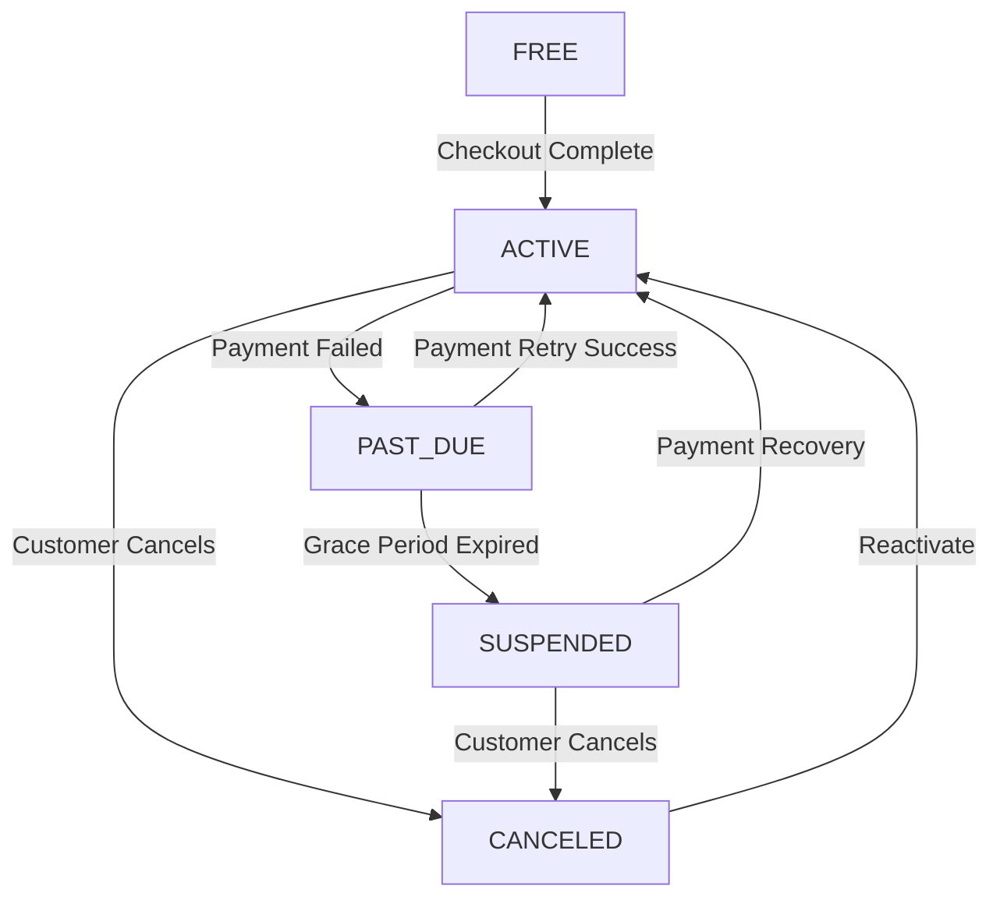

The Subscription Module implements a **freemium SaaS billing system** for PropWise CRM. Every organization has a subscription tied to one of four plan tiers. The module handles plan-based feature gating, resource limits, credit-based metering, dual seat types, and complete Stripe integration.

## Overview

<Info>
**Status:** Active — fully implemented  
**Module Path:** `src/modules/subscription/`  
**Payment Gateway:** Stripe
</Info>

The subscription system manages:

- **Plan-based feature gating** — binary feature flags per tier
- **Resource limits** — caps on leads, contacts, deals, companies, and storage
- **Credit-based metering** — monthly AI and messaging allowances with purchasable top-ups
- **Dual seat types** — manager seats and agent seats with per-tier pricing; every user consumes a seat
- **Stripe integration** — checkout, subscription management, mid-cycle plan changes, webhooks, billing portal
- **Proration** — mid-cycle upgrades, downgrades, and seat changes are prorated to the day
- **Suspension flow** — 2-day grace period on payment failure, then org goes read-only

### Design Principles

| Principle | Decision |
|---|---|
| Freemium model | Free plan with limited features; paid tiers unlock progressively |
| Per-org billing | Billing is per organization; developer portal is free |
| Dual seat types | Manager seats (Owner, Admin) and agent seats (Basic, custom roles); every user consumes a seat |
| Seat type derived from role | No explicit seat assignment — seat type is automatically determined by the user's RBAC role |
| Feature flags over tier checks | Gating uses `@RequiresFeature('flag')` on plan JSONB — changing what a tier includes requires only a seeder update, not code changes |
| Service-layer limit enforcement | Resource limits and credit consumption are checked in service methods, not guards, because they need entity counts |
| Stripe as source of truth for payments | Webhook-driven lifecycle: the app reacts to Stripe events rather than polling |
| Prorated plan changes | All mid-cycle changes (upgrade, downgrade, add/remove seats) use `proration_behavior: 'create_prorations'` — charges are fair to the day |

## Architecture

### High-Level Diagram

```
┌─────────────────────────────────────────────────────────────────────┐
│                        API Layer (Controllers)                       │
│  SubscriptionController            │  StripeWebhookController        │
│  (authenticated, /v1/subscriptions)│  (public, /webhooks/stripe)     │
└──────────────┬─────────────────────┴────────────┬───────────────────┘
               │                                  │
┌──────────────▼──────────────────────────────────▼───────────────────┐
│  Service Layer                                                       │
│  ┌──────────────────┐  ┌──────────────────┐  ┌───────────────────┐  │
│  │ SubscriptionSvc  │  │  CreditService   │  │  StripeService    │  │
│  │ • lifecycle      │  │  • consume FIFO  │  │  • SDK wrapper    │  │
│  │ • plan changes   │  │  • balance query │  │  • checkout       │  │
│  │ • seat mgmt      │  │  • record packs  │  │  • subscriptions  │  │
│  │ • resource limits│  │                  │  │  • price swaps    │  │
│  │ • feature checks │  │                  │  │  • webhooks       │  │
│  └──────────────────┘  └──────────────────┘  └───────────────────┘  │
└──────────────┬──────────────────────────────────────────────────────┘
               │
┌──────────────▼──────────────────────────────────────────────────────┐
│  Data Layer (MikroORM / PostgreSQL)                                  │
│  SubscriptionPlan │ Subscription │ SubscriptionUsage                 │
│  CreditPurchase   │ BillingEvent │ Organization.stripeCustomerId     │
└─────────────────────────────────────────────────────────────────────┘
```

### Data Flow Examples

<Tabs>
<Tab title="First-time Checkout (Free → Paid)">
```
Frontend "Upgrade" button
  → POST /v1/subscriptions/checkout
    → Rejects if org already has a Stripe subscription (use change-plan instead)
    → SubscriptionService.createCheckoutSession()
      → StripeService.createCheckoutSession()
        → Returns Stripe Checkout URL
          → User pays on Stripe's hosted page
            → Stripe fires checkout.session.completed webhook
              → StripeWebhookController receives + verifies signature
                → SubscriptionService.activateSubscription()
                  → Subscription entity updated to ACTIVE
```
</Tab>

<Tab title="Plan Change (Paid → Different Paid)">
```
Frontend "Change Plan" button
  → POST /v1/subscriptions/change-plan
    → SubscriptionService.changePlan()
      → Validates seat overflow (blocks if current users exceed new plan capacity)
      → StripeService.swapSubscriptionPrice() — prorated
      → Reconciles seat line items (old tier price → new tier price)
      → Updates local Subscription entity
      → Returns updated subscription immediately
```
</Tab>

<Tab title="Payment Failure & Suspension">
```
Stripe charges renewal invoice
  ├─ invoice.paid → handleInvoicePaid() → status stays ACTIVE, period updated
  └─ invoice.payment_failed → handleInvoicePaymentFailed() → status → PAST_DUE
       └─ Stripe retries for 2 days
            ├─ Payment succeeds → invoice.paid → back to ACTIVE
            └─ All retries fail → customer.subscription.updated (status: unpaid)
                 → handleSubscriptionUpdated() → status → SUSPENDED
                      → Org is read-only (SubscriptionActiveGuard blocks writes)
```
</Tab>
</Tabs>

## Plan Tiers & Pricing

<CardGroup cols={2}>
<Card title="Free Tier" icon="gift">
$0/month - 1 manager seat, 0 agent seats  
50 leads, 20 deals, 500MB storage
</Card>
<Card title="Starter Tier" icon="rocket">
$49/month - 2 manager seats, 3 agent seats  
1,000 leads, 500 deals, 5GB storage
</Card>
<Card title="Professional Tier" icon="briefcase">
$149/month - 5 manager seats, 15 agent seats  
10,000 leads, 5,000 deals, 25GB storage
</Card>
<Card title="Business Tier" icon="building">
$399/month - 10 manager seats, 40 agent seats  
Unlimited resources, 100GB storage
</Card>
</CardGroup>

### Pricing Details

| | **Free** | **Starter** | **Professional** | **Business** |
|---|---|---|---|---|
| Monthly price | $0 | $49 | $149 | $399 |
| Annual price | $0 | $470.40 (~20% off) | $1,430.40 | $3,830.40 |
| Manager seats included | 1 | 2 | 5 | 10 |
| Agent seats included | 0 | 3 | 15 | 40 |
| Extra manager seat | — | $25/mo | $20/mo | $18/mo |
| Extra agent seat | — | $12/mo | $10/mo | $8/mo |

### Resource Limits

| Resource | Free | Starter | Professional | Business |
|---|---|---|---|---|
| Leads | 50 | 1,000 | 10,000 | Unlimited |
| Contacts | 50 | 1,000 | 10,000 | Unlimited |
| Deals | 20 | 500 | 5,000 | Unlimited |
| Companies | 10 | 200 | 2,000 | Unlimited |
| Storage | 500 MB | 5 GB | 25 GB | 100 GB |

### Monthly Credits

| Credit type | Free | Starter | Professional | Business |
|---|---|---|---|---|
| AI credits | 20 | 200 | 1,000 | 5,000 |
| Messaging credits | 0 | 100 | 500 | 2,000 |

## Feature Gating Model

Features are gated using three distinct mechanisms:

### Binary Feature Flags

<Note>
Boolean flags stored in `SubscriptionPlan.features` (JSONB). Checked via `@RequiresFeature('flagName')` guard decorator or `SubscriptionService.checkFeature()`.
</Note>

| Feature flag | Free | Starter | Pro | Business |
|---|---|---|---|---|
| `customPipelineStages` | — | ✓ | ✓ | ✓ |
| `distributionEngine` | — | — | ✓ | ✓ |
| `escalationEngine` | — | — | ✓ | ✓ |
| `advancedAnalytics` | — | — | ✓ | ✓ |
| `apiAccess` | — | — | ✓ | ✓ |
| `commissionTracking` | — | — | ✓ | ✓ |
| `teamsAndHierarchy` | — | — | ✓ | ✓ |
| `customRoles` | — | — | — | ✓ |
| `whiteLabel` | — | — | — | ✓ |

### Numeric Limits

| Feature limit | Free | Starter | Pro | Business |
|---|---|---|---|---|
| `maxMessagingChannels` | 0 | 1 | 3 | Unlimited (-1) |
| `maxEmailIntegrations` | 0 | 1 | 3 | Unlimited (-1) |
| `auditLogRetentionDays` | 0 | 0 | 30 | Unlimited (-1) |

### Credit-Based Features

Features that are available on the tier but have a monthly budget that resets each billing cycle. Tracked in `SubscriptionUsage`. When exhausted, the org can purchase one-time top-up packs (`CreditPurchase`).

<Tip>
Consumption order: **monthly plan allowance first → purchased packs FIFO (oldest first)**.
</Tip>

### Add-on Packs

| Add-on | Behavior | Stripe model |
|---|---|---|
| Storage pack (+10 GB) | Recurring, stacks | Subscription line item (per-unit) |
| AI credit pack (+500) | One-time, consumed then gone | Payment intent |
| Messaging credit pack (+500) | One-time, consumed then gone | Payment intent |

## Seat Management

### Seat Types

<Warning>
Every user in an organization consumes exactly one seat. The seat type is **derived from the user's RBAC role** — there is no separate seat assignment.
</Warning>

| Seat type | Roles that consume it | Price varies by tier |
|---|---|---|
| **Manager** | Owner, Admin | Yes |
| **Agent** | Basic, custom org roles | Yes |

The mapping is defined in `subscription.service.ts`:

```typescript
const ROLE_SEAT_MAP: Record<string, SeatType> = {
  Owner: SeatType.MANAGER,
  Admin: SeatType.MANAGER,
};
// Any other role → SeatType.AGENT
```

### Seat Counting

Seats are **derived from RBAC roles**, not tracked via a separate assignment table. The count is computed on-demand from active `UserOrgRole` records:

```
managerSeatsUsed = count of active users with Owner or Admin org role
agentSeatsUsed   = count of active users with any other org role
```

<Info>
A seat is **not occupied** by a pending invitation — it only counts when the user has accepted and has an active `UserOrgRole`.
</Info>

### Enforcement Points

Seat availability is checked at two integration points:

<Steps>
<Step title="Invitation Service">
Before creating an invitation, the role determines the seat type and availability is checked
</Step>
<Step title="Role Assignment Validation">
When changing a user's role (e.g. promoting Basic → Admin), checks that the target seat type has room; the old seat type is freed simultaneously
</Step>
</Steps>

### Proration on Seat Changes

Adding or removing seats mid-cycle uses `proration_behavior: 'create_prorations'`:

- **Adding a seat on April 15** (30-day month): prorated charge for 15 remaining days, billed on the next invoice
- **Removing a seat on April 15**: prorated credit for 15 remaining days, applied to the next invoice
- **Adding on April 4, removing on April 6**: net charge for 2 days only (charge for 26 days minus credit for 24 days)

### Stripe Billing

Extra seats are billed as subscription line items with `per_unit` pricing. A subscription for a Professional org with 7 managers and 20 agents would have:

| Line Item | Qty | Price |
|---|---|---|
| PropWise Professional | 1 | $149/mo |
| Extra Manager Seat (Pro) | 2 | $40/mo |
| Extra Agent Seat (Pro) | 5 | $50/mo |

## Credit System

### Consumption Flow

```typescript
SubscriptionService.consumeCredits(orgId, 'ai', 1)
  → CreditService.consumeCredits(subscription, AI, 1)
      1. Check monthly allowance: usage.aiCreditsUsed < plan.aiCredits
      2. If insufficient monthly, consume from purchased packs (FIFO)
      3. Update SubscriptionUsage
      4. Mark consumed CreditPurchase entries
```

### Credit Types

<Tabs>
<Tab title="AI Credits">
Used for:
- Lead scoring algorithms
- Predictive analytics
- Automated deal insights
- Smart contact matching
</Tab>

<Tab title="Messaging Credits">
Used for:
- Email campaigns
- SMS notifications
- WhatsApp messages
- Automated follow-ups
</Tab>
</Tabs>

### Purchase Packs

Organizations can buy additional credit packs when monthly allowances are exhausted:

| Pack Type | Credits | Price | Expiration |
|---|---|---|---|
| AI Credit Pack | 500 | $25 | 12 months |
| Messaging Credit Pack | 500 | $15 | 12 months |

## Entity Specifications

### SubscriptionPlan Entity

```typescript
@Entity()
export class SubscriptionPlan {
  @PrimaryKey()
  id!: number;

  @Property({ unique: true })
  name!: string; // 'free', 'starter', 'professional', 'business'

  @Property()
  displayName!: string;

  @Property()
  monthlyPriceUsd!: number; // in cents

  @Property()
  annualPriceUsd!: number; // in cents

  @Property()
  managerSeatsIncluded!: number;

  @Property()
  agentSeatsIncluded!: number;

  @Property()
  extraManagerSeatPriceUsd!: number; // per month, in cents

  @Property()
  extraAgentSeatPriceUsd!: number; // per month, in cents

  @Property({ type: 'jsonb' })
  features!: Record<string, boolean | number>; // feature flags

  @Property({ type: 'jsonb' })
  limits!: Record<string, number>; // resource limits

  @Property()
  aiCredits!: number; // monthly allowance

  @Property()
  messagingCredits!: number; // monthly allowance
}
```

### Subscription Entity

```typescript
@Entity()
export class Subscription {
  @PrimaryKey()
  id!: number;

  @ManyToOne(() => Organization)
  organization!: Organization;

  @ManyToOne(() => SubscriptionPlan)
  plan!: SubscriptionPlan;

  @Property()
  status!: SubscriptionStatus; // TRIAL, ACTIVE, PAST_DUE, SUSPENDED, CANCELED

  @Property({ nullable: true })
  stripeSubscriptionId?: string;

  @Property({ nullable: true })
  currentPeriodStart?: Date;

  @Property({ nullable: true })
  currentPeriodEnd?: Date;

  @Property({ nullable: true })
  trialEnd?: Date;

  @OneToMany(() => SubscriptionUsage, usage => usage.subscription)
  usage = new Collection<SubscriptionUsage>(this);
}
```

### Credit Purchase Entity

```typescript
@Entity()
export class CreditPurchase {
  @PrimaryKey()
  id!: number;

  @ManyToOne(() => Subscription)
  subscription!: Subscription;

  @Enum(() => CreditType)
  creditType!: CreditType; // AI, MESSAGING

  @Property()
  creditsTotal!: number;

  @Property()
  creditsRemaining!: number;

  @Property()
  purchaseDate!: Date;

  @Property()
  expiryDate!: Date;

  @Property()
  priceUsd!: number; // in cents

  @Property({ nullable: true })
  stripePaymentIntentId?: string;
}
```

## Stripe Integration

### Webhook Events

The system listens for these Stripe webhook events:

<AccordionGroup>
<Accordion title="checkout.session.completed">
Fired when a customer completes payment for their first subscription. Activates the subscription and moves from FREE to the paid tier.
</Accordion>

<Accordion title="customer.subscription.created">
Fired when a new subscription is created. Usually follows checkout.session.completed.
</Accordion>

<Accordion title="customer.subscription.updated">
Fired when subscription details change (plan, status, billing cycle). Handles suspensions and reactivations.
</Accordion>

<Accordion title="customer.subscription.deleted">
Fired when a subscription is permanently canceled. Moves organization back to FREE tier.
</Accordion>

<Accordion title="invoice.paid">
Fired when an invoice payment succeeds. Updates billing period and maintains ACTIVE status.
</Accordion>

<Accordion title="invoice.payment_failed">
Fired when payment fails. Moves subscription to PAST_DUE status and starts grace period.
</Accordion>
</AccordionGroup>

### Checkout Session Creation

```typescript
async createCheckoutSession(
  organizationId: number,
  planName: string,
  billingCycle: 'monthly' | 'annual'
): Promise<{ url: string }> {
  const organization = await this.getOrganization(organizationId);
  const plan = await this.getPlan(planName);
  
  // Calculate seat requirements
  const seatCounts = await this.calculateCurrentSeats(organizationId);
  const lineItems = this.buildCheckoutLineItems(plan, seatCounts, billingCycle);
  
  const session = await this.stripe.checkout.sessions.create({
    customer: organization.stripeCustomerId,
    mode: 'subscription',
    line_items: lineItems,
    success_url: `${process.env.FRONTEND_URL}/billing/success`,
    cancel_url: `${process.env.FRONTEND_URL}/billing/canceled`,
    metadata: {
      organizationId: organizationId.toString(),
      planName,
      billingCycle
    }
  });
  
  return { url: session.url };
}
```

## Subscription Lifecycle

### States and Transitions



### Status Descriptions

| Status | Description | Access Level |
|---|---|---|
| **FREE** | Default state, using free plan | Limited features |
| **ACTIVE** | Paid subscription in good standing | Full plan features |
| **PAST_DUE** | Payment failed, in grace period | Full access (2 days) |
| **SUSPENDED** | Grace period expired | Read-only access |
| **CANCELED** | Subscription terminated | Reverts to FREE |

## Plan Changes (Upgrade / Downgrade)

### Change Plan Flow

<Steps>
<Step title="Validation">
Check if new plan can accommodate current users (seat overflow protection)
</Step>
<Step title="Stripe Update">
Swap subscription price items with proration enabled
</Step>
<Step title="Seat Reconciliation">
Add/remove seat line items based on new plan pricing
</Step>
<Step title="Local Update">
Update subscription entity with new plan reference
</Step>
<Step title="Response">
Return updated subscription immediately (no wait for webhook)
</Step>
</Steps>

### Seat Overflow Protection

<Warning>
Downgrades are blocked if the current user count exceeds the target plan's seat limits. The organization must remove users first before downgrading.
</Warning>

Example validation:
```typescript
const currentSeats = await this.calculateCurrentSeats(orgId);
const newPlan = await this.getPlan(targetPlanName);

if (currentSeats.managers > newPlan.managerSeatsIncluded ||
    currentSeats.agents > newPlan.agentSeatsIncluded) {
  throw new BadRequestException('Cannot downgrade: current users exceed target plan limits');
}
```

## API Endpoints

### Authentication Required Endpoints

All subscription endpoints require authentication and organization context:

<CodeGroup>

```typescript GET /v1/subscriptions
// Get current organization's subscription details
{
  "subscription": {
    "id": 123,
    "plan": {
      "name": "professional",
      "displayName": "Professional"
    },
    "status": "ACTIVE",
    "currentPeriodEnd": "2024-02-15T00:00:00Z"
  },
  "usage": {
    "aiCreditsUsed": 450,
    "messagingCreditsUsed": 120
  },
  "seatUsage": {
    "managers": { "used": 3, "included": 5, "price": 2000 },
    "agents": { "used": 12, "included": 15, "price": 1000 }
  }
}
```

```typescript POST /v1/subscriptions/checkout
// Create checkout session for first-time subscription
{
  "planName": "professional",
  "billingCycle": "annual"
}
// Response:
{
  "url": "https://checkout.stripe.com/pay/cs_..."
}
```

```typescript POST /v1/subscriptions/change-plan
// Change to different paid plan (mid-cycle)
{
  "planName": "business",
  "billingCycle": "monthly"
}
// Response: Updated subscription object
```

```typescript POST /v1/subscriptions/purchase-credits
// Buy additional credit packs
{
  "creditType": "ai",
  "packs": 2
}
// Response:
{
  "paymentIntentClientSecret": "pi_..._secret_..."
}
```

</CodeGroup>

### Public Webhook Endpoint

<CodeGroup>

```typescript POST /webhooks/stripe
// Stripe webhook receiver (public, signature verified)
// Handles all subscription lifecycle events
// Content-Type: application/json
// Stripe-Signature header required
```

</CodeGroup>

## Guards & Decorators

### Feature Requirement Guard

```typescript
@RequiresFeature('customPipelineStages')
@Get('/advanced-pipelines')
async getAdvancedPipelines() {
  // Only accessible if org's plan has customPipelineStages: true
}
```

### Subscription Active Guard

```typescript
@UseGuards(SubscriptionActiveGuard)
@Post('/leads')
async createLead() {
  // Blocked if subscription status is SUSPENDED
}
```

### Credit Consumption

```typescript
async processWithAI(orgId: number) {
  const hasCredits = await this.subscriptionService.consumeCredits(
    orgId, 
    CreditType.AI, 
    1
  );
  
  if (!hasCredits) {
    throw new PaymentRequiredException('Insufficient AI credits');
  }
  
  // Proceed with AI processing
}
```

## Enforcement Points

### Resource Limit Checks

Resource limits are enforced in service methods before entity creation:

```typescript
async createLead(orgId: number, data: CreateLeadDto) {
  const canCreate = await this.subscriptionService.checkResourceLimit(
    orgId, 
    'leads'
  );
  
  if (!canCreate) {
    throw new PaymentRequiredException('Lead limit exceeded for current plan');
  }
  
  return this.leadRepository.create(data);
}
```

### Feature Access Points

<Tabs>
<Tab title="Controller Level">
```typescript
@RequiresFeature('advancedAnalytics')
@Get('/analytics/advanced')
async getAdvancedAnalytics() {
  // Feature-gated endpoint
}
```
</Tab>

<Tab title="Service Level">
```typescript
async generateReport() {
  const hasAccess = await this.subscriptionService.checkFeature(
    this.orgId, 
    'advancedAnalytics'
  );
  
  if (!hasAccess) {
    throw new ForbiddenException('Advanced analytics not available on current plan');
  }
}
```
</Tab>
</Tabs>

## Environment Configuration

Required environment variables:

```bash
# Stripe Configuration
STRIPE_PUBLISHABLE_KEY=pk_test_...
STRIPE_SECRET_KEY=sk_test_...
STRIPE_WEBHOOK_SECRET=whsec_...

# Frontend URLs
FRONTEND_URL=https://app.propwise.ai

# Billing Configuration  
BILLING_GRACE_PERIOD_DAYS=2
CREDIT_PACK_EXPIRY_MONTHS=12
```

<Note>
If `STRIPE_SECRET_KEY` is not set, billing features are unavailable but the app still starts in a limited mode.
</Note>

## Integration with Other Modules

### RBAC Module Integration

- Seat types are derived from RBAC roles automatically
- Role changes trigger seat count updates
- Invitation flows check seat availability before role assignment

### Audit Module Integration

- All subscription changes are logged as audit events
- Credit consumption is tracked for compliance
- Plan changes include before/after snapshots

### Organization Module Integration

- Each organization has exactly one subscription
- Organization creation includes FREE subscription setup
- Stripe customer ID is stored on organization entity

### User Module Integration

- User activation/deactivation affects seat counts
- Role promotions/demotions trigger seat type changes
- User removal frees up seats immediately

---

<Check>
The Subscription Module provides a complete billing solution with plan tiers, feature gating, seat management, credit systems, and Stripe integration. All components work together to enforce plan limits and enable seamless subscription management.
</Check>