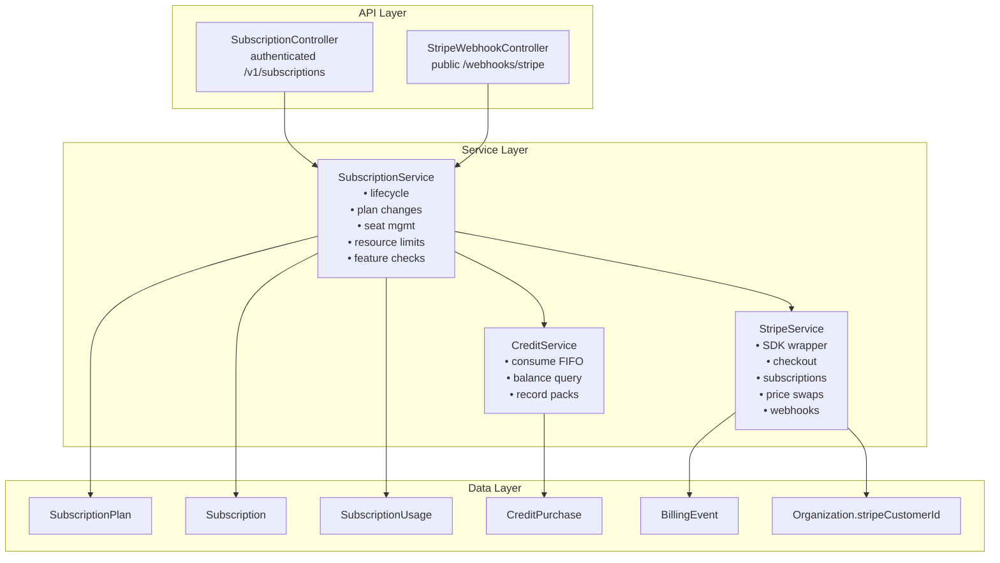

<Note>
**Status:** Active — fully implemented  
**Module Path:** `src/modules/subscription/`  
**Payment Gateway:** Stripe
</Note>

## Overview

The Subscription Module implements a **freemium SaaS billing system** for PropWise CRM. Every organization has a subscription tied to one of four plan tiers. The module handles:

- **Plan-based feature gating** — binary feature flags per tier
- **Resource limits** — caps on leads, contacts, deals, companies, and storage
- **Credit-based metering** — monthly AI and messaging allowances with purchasable top-ups
- **Dual seat types** — manager seats and agent seats with per-tier pricing; every user consumes a seat
- **Stripe integration** — checkout, subscription management, mid-cycle plan changes, webhooks, billing portal
- **Proration** — mid-cycle upgrades, downgrades, and seat changes are prorated to the day
- **Suspension flow** — 2-day grace period on payment failure, then org goes read-only

### Design Principles

<AccordionGroup>
  <Accordion title="Core Design Decisions">
    | Principle | Decision |
    |---|---|
    | Freemium model | Free plan with limited features; paid tiers unlock progressively |
    | Per-org billing | Billing is per organization; developer portal is free |
    | Dual seat types | Manager seats (Owner, Admin) and agent seats (Basic, custom roles); every user consumes a seat |
    | Seat type derived from role | No explicit seat assignment — seat type is automatically determined by the user's RBAC role |
    | Feature flags over tier checks | Gating uses `@RequiresFeature('flag')` on plan JSONB — changing what a tier includes requires only a seeder update, not code changes |
    | Service-layer limit enforcement | Resource limits and credit consumption are checked in service methods, not guards, because they need entity counts |
  </Accordion>
  
  <Accordion title="Stripe Integration Principles">
    | Principle | Decision |
    |---|---|
    | Stripe as source of truth for payments | Webhook-driven lifecycle: the app reacts to Stripe events rather than polling |
    | Prorated plan changes | All mid-cycle changes (upgrade, downgrade, add/remove seats) use `proration_behavior: 'create_prorations'` — charges are fair to the day |
    | Checkout vs. change-plan separation | `POST /checkout` is for first-time subscription (Free → Paid); `POST /change-plan` is for switching between paid tiers |
    | Idempotent webhooks | Every Stripe event is logged in `BillingEvent` with a unique `stripeEventId` to prevent duplicate processing |
    | Graceful degradation | If `app.stripe.secretKey` (`STRIPE_SECRET_KEY`) is not set, billing features are unavailable but the app still starts |
  </Accordion>
</AccordionGroup>

## Architecture

### High-Level Diagram



### Data Flow

<Tabs>
  <Tab title="First-time Checkout">
    **First-time checkout flow (Free → Paid):**

    <Steps>
      <Step title="User initiates upgrade">
        Frontend "Upgrade" button triggers `POST /v1/subscriptions/checkout`
      </Step>
      <Step title="Validation">
        System rejects if org already has a Stripe subscription (use change-plan instead)
      </Step>
      <Step title="Checkout session creation">
        `SubscriptionService.createCheckoutSession()` → `StripeService.createCheckoutSession()` returns Stripe Checkout URL
      </Step>
      <Step title="Payment processing">
        User pays on Stripe's hosted page
      </Step>
      <Step title="Webhook activation">
        Stripe fires `checkout.session.completed` webhook → `StripeWebhookController` receives + verifies signature → `SubscriptionService.activateSubscription()` updates Subscription entity to ACTIVE
      </Step>
    </Steps>
  </Tab>
  
  <Tab title="Plan Changes">
    **Mid-cycle plan change flow (Paid → different Paid tier):**

    <Steps>
      <Step title="Plan change request">
        Frontend "Change Plan" button triggers `POST /v1/subscriptions/change-plan`
      </Step>
      <Step title="Validation">
        `SubscriptionService.changePlan()` validates seat overflow (blocks if current users exceed new plan capacity)
      </Step>
      <Step title="Stripe subscription update">
        `StripeService.swapSubscriptionPrice()` with proration, reconciles seat line items (old tier price → new tier price)
      </Step>
      <Step title="Local update">
        Updates local Subscription entity and returns updated subscription immediately
      </Step>
    </Steps>
  </Tab>
  
  <Tab title="Payment Failures">
    **Renewal / payment failure flow:**

    ```
    Stripe charges renewal invoice
      ├─ invoice.paid → handleInvoicePaid() → status stays ACTIVE, period updated
      └─ invoice.payment_failed → handleInvoicePaymentFailed() → status → PAST_DUE
           └─ Stripe retries for 2 days
                ├─ Payment succeeds → invoice.paid → back to ACTIVE
                └─ All retries fail → customer.subscription.updated (status: unpaid)
                     → handleSubscriptionUpdated() → status → SUSPENDED
                          → Org is read-only (SubscriptionActiveGuard blocks writes)
    ```
  </Tab>
</Tabs>

## Plan Tiers & Pricing

<CardGroup cols={2}>
  <Card title="Pricing Structure" icon="dollar-sign">
    Four tiers, priced in USD cents with annual discounts (~20% off)
  </Card>
  <Card title="Seat-Based Billing" icon="users">
    Manager and agent seats with per-tier pricing, every user consumes a seat
  </Card>
</CardGroup>

### Plan Comparison

| | **Free** | **Starter** | **Professional** | **Business** |
|---|---|---|---|---|
| Monthly price | $0 | $49 | $149 | $399 |
| Annual price | $0 | $470.40 | $1,430.40 | $3,830.40 |
| Manager seats included | 1 | 2 | 5 | 10 |
| Agent seats included | 0 | 3 | 15 | 40 |
| Extra manager seat | — | $25/mo | $20/mo | $18/mo |
| Extra agent seat | — | $12/mo | $10/mo | $8/mo |

### Resource Limits

| Resource | Free | Starter | Professional | Business |
|---|---|---|---|---|
| Leads | 50 | 1,000 | 10,000 | Unlimited |
| Contacts | 50 | 1,000 | 10,000 | Unlimited |
| Deals | 20 | 500 | 5,000 | Unlimited |
| Companies | 10 | 200 | 2,000 | Unlimited |
| Storage | 500 MB | 5 GB | 25 GB | 100 GB |

### Monthly Credits

| Credit type | Free | Starter | Professional | Business |
|---|---|---|---|---|
| AI credits | 20 | 200 | 1,000 | 5,000 |
| Messaging credits | 0 | 100 | 500 | 2,000 |

## Feature Gating Model

<Info>
Features are gated using three distinct mechanisms for maximum flexibility and control.
</Info>

### Type 1: Binary Feature Flags

Boolean flags stored in `SubscriptionPlan.features` (JSONB). Checked via `@RequiresFeature('flagName')` guard decorator or `SubscriptionService.checkFeature()`.

<AccordionGroup>
  <Accordion title="Core Features">
    | Feature flag | Free | Starter | Pro | Business |
    |---|---|---|---|---|
    | `customPipelineStages` | — | ✅ | ✅ | ✅ |
    | `distributionEngine` | — | — | ✅ | ✅ |
    | `escalationEngine` | — | — | ✅ | ✅ |
    | `advancedAnalytics` | — | — | ✅ | ✅ |
    | `apiAccess` | — | — | ✅ | ✅ |
    | `commissionTracking` | — | — | ✅ | ✅ |
    | `teamsAndHierarchy` | — | — | ✅ | ✅ |
  </Accordion>
  
  <Accordion title="Premium Features">
    | Feature flag | Free | Starter | Pro | Business |
    |---|---|---|---|---|
    | `customRoles` | — | — | — | ✅ |
    | `whiteLabel` | — | — | — | ✅ |
    | `maxMessagingChannels` | 0 | 1 | 3 | Unlimited (-1) |
    | `maxEmailIntegrations` | 0 | 1 | 3 | Unlimited (-1) |
    | `auditLogRetentionDays` | 0 | 0 | 30 | Unlimited (-1) |
  </Accordion>
</AccordionGroup>

### Type 2: Credit-Based (Monthly Allowance)

Features that are available on the tier but have a monthly budget that resets each billing cycle. Tracked in `SubscriptionUsage`. When exhausted, the org can purchase one-time top-up packs (`CreditPurchase`).

<Note>
Consumption order: **monthly plan allowance first → purchased packs FIFO (oldest first)**
</Note>

### Type 3: Add-on Packs

| Add-on | Behavior | Stripe model |
|---|---|---|
| Storage pack (+10 GB) | Recurring, stacks | Subscription line item (per-unit) |
| AI credit pack (+500) | One-time, consumed then gone | Payment intent |
| Messaging credit pack (+500) | One-time, consumed then gone | Payment intent |

## Seat Management

### Seat Types

<Warning>
Every user in an organization consumes exactly one seat. The seat type is **derived from the user's RBAC role** — there is no separate seat assignment.
</Warning>

| Seat type | Roles that consume it | Price varies by tier |
|---|---|---|
| **Manager** | Owner, Admin | ✅ |
| **Agent** | Basic, custom org roles | ✅ |

The mapping is defined in `subscription.service.ts`:

```typescript
const ROLE_SEAT_MAP: Record<string, SeatType> = {
  Owner: SeatType.MANAGER,
  Admin: SeatType.MANAGER,
};
// Any other role → SeatType.AGENT
```

### Seat Counting

Seats are **derived from RBAC roles**, not tracked via a separate assignment table. The count is computed on-demand from active `UserOrgRole` records:

```
managerSeatsUsed = count of active users with Owner or Admin org role
agentSeatsUsed   = count of active users with any other org role
```

<Tabs>
  <Tab title="Seat Occupation Rules">
    | Step | Seat occupied? |
    |---|---|
    | Admin sends invitation with role "Admin" | ❌ No — seat availability is checked but not reserved |
    | User accepts → `UserOrgRole` created | ✅ Yes — now counted |
    | User removed (role soft-deleted) | ❌ No — freed |
    | User's role changed (Basic → Admin) | ↔️ Swaps: frees one agent seat, occupies one manager seat |
  </Tab>
  
  <Tab title="Enforcement Points">
    Seat availability is checked at two integration points:

    1. **`invitation.service.ts`** — before creating an invitation, the role determines the seat type and availability is checked
    2. **`role-assignment-validation.service.ts`** — when changing a user's role (e.g. promoting Basic → Admin), checks that the target seat type has room; the old seat type is freed simultaneously
  </Tab>
</Tabs>

### Proration on Seat Changes

<Tip>
Adding or removing seats mid-cycle uses `proration_behavior: 'create_prorations'` for fair billing.
</Tip>

- **Adding a seat on April 15** (30-day month): prorated charge for 15 remaining days, billed on the next invoice
- **Removing a seat on April 15**: prorated credit for 15 remaining days, applied to the next invoice
- **Adding on April 4, removing on April 6**: net charge for 2 days only (charge for 26 days minus credit for 24 days)

### Stripe Billing

Extra seats are billed as subscription line items with `per_unit` pricing. A subscription for a Professional org with 7 managers and 20 agents would have:

| Line Item | Qty | Price |
|---|---|---|
| PropWise Professional | 1 | $149/mo |
| Extra Manager Seat (Pro) | 2 | $40/mo |
| Extra Agent Seat (Pro) | 5 | $50/mo |

## Credit System

### Consumption Flow

```typescript
SubscriptionService.consumeCredits(orgId, 'ai', 1)
  → CreditService.consumeCredits(subscription, AI, 1)
      1. Check monthly allowance: usage.aiCreditsUsed < plan.aiCreditsPerMonth
      2. If allowance available: increment usage.aiCreditsUsed, return success
      3. If allowance exhausted: find oldest CreditPurchase with balance
      4. Deduct from purchase balance (FIFO), mark consumed if balance = 0
```

<Steps>
  <Step title="Monthly allowance check">
    First, check if monthly allowance has remaining balance (`usage.aiCreditsUsed < plan.aiCreditsPerMonth`)
  </Step>
  <Step title="Use monthly credits">
    If allowance available: increment `usage.aiCreditsUsed`, return success
  </Step>
  <Step title="Fall back to purchased packs">
    If allowance exhausted: find oldest `CreditPurchase` with balance > 0
  </Step>
  <Step title="FIFO consumption">
    Deduct from purchase balance (FIFO), mark as consumed if balance reaches 0
  </Step>
</Steps>

### Credit Purchase Flow

```typescript
POST /v1/subscriptions/purchase-credits
  → StripeService.createPaymentIntent({
      amount: creditPack.priceInCents,
      metadata: { orgId, creditType, quantity }
    })
  → Frontend completes payment with Stripe Elements
  → payment_intent.succeeded webhook
    → CreditService.recordCreditPurchase()
      → Creates CreditPurchase record with balance
```

## Entity Specifications

### SubscriptionPlan

<CodeGroup>
```sql SQL Schema
CREATE TABLE subscription_plans (
  id SERIAL PRIMARY KEY,
  name VARCHAR(50) NOT NULL UNIQUE, -- 'free', 'starter', 'professional', 'business'
  display_name VARCHAR(100) NOT NULL,
  description TEXT,
  
  -- Pricing (in cents)
  monthly_price INTEGER NOT NULL DEFAULT 0,
  annual_price INTEGER NOT NULL DEFAULT 0,
  extra_manager_seat_price INTEGER NOT NULL DEFAULT 0,
  extra_agent_seat_price INTEGER NOT NULL DEFAULT 0,
  
  -- Seat inclusions
  manager_seats_included INTEGER NOT NULL DEFAULT 1,
  agent_seats_included INTEGER NOT NULL DEFAULT 0,
  
  -- Resource limits (-1 = unlimited)
  max_leads INTEGER NOT NULL DEFAULT -1,
  max_contacts INTEGER NOT NULL DEFAULT -1,
  max_deals INTEGER NOT NULL DEFAULT -1,
  max_companies INTEGER NOT NULL DEFAULT -1,
  max_storage_bytes BIGINT NOT NULL DEFAULT -1,
  
  -- Monthly credit allowances
  ai_credits_per_month INTEGER NOT NULL DEFAULT 0,
  messaging_credits_per_month INTEGER NOT NULL DEFAULT 0,
  
  -- Feature flags (JSONB)
  features JSONB NOT NULL DEFAULT '{}',
  
  -- Stripe integration
  stripe_monthly_price_id VARCHAR(255),
  stripe_annual_price_id VARCHAR(255),
  stripe_manager_seat_price_id VARCHAR(255),
  stripe_agent_seat_price_id VARCHAR(255),
  
  created_at TIMESTAMP WITH TIME ZONE DEFAULT NOW(),
  updated_at TIMESTAMP WITH TIME ZONE DEFAULT NOW()
);
```

```typescript TypeScript Entity
@Entity()
export class SubscriptionPlan {
  @PrimaryKey()
  id!: number;

  @Property({ unique: true })
  name!: string; // 'free' | 'starter' | 'professional' | 'business'

  @Property()
  displayName!: string;

  @Property({ type: 'text', nullable: true })
  description?: string;

  // Pricing in cents
  @Property({ default: 0 })
  monthlyPrice!: number;

  @Property({ default: 0 })
  annualPrice!: number;

  @Property({ default: 0 })
  extraManagerSeatPrice!: number;

  @Property({ default: 0 })
  extraAgentSeatPrice!: number;

  // Seat inclusions
  @Property({ default: 1 })
  managerSeatsIncluded!: number;

  @Property({ default: 0 })
  agentSeatsIncluded!: number;

  // Resource limits (-1 = unlimited)
  @Property({ default: -1 })
  maxLeads!: number;

  @Property({ default: -1 })
  maxContacts!: number;

  @Property({ default: -1 })
  maxDeals!: number;

  @Property({ default: -1 })
  maxCompanies!: number;

  @Property({ type: 'bigint', default: -1 })
  maxStorageBytes!: number;

  // Monthly credit allowances
  @Property({ default: 0 })
  aiCreditsPerMonth!: number;

  @Property({ default: 0 })
  messagingCreditsPerMonth!: number;

  // Feature flags
  @Property({ type: 'jsonb', default: {} })
  features!: Record<string, any>;

  // Stripe price IDs
  @Property({ nullable: true })
  stripeMonthlyPriceId?: string;

  @Property({ nullable: true })
  stripeAnnualPriceId?: string;

  @Property({ nullable: true })
  stripeManagerSeatPriceId?: string;

  @Property({ nullable: true })
  stripeAgentSeatPriceId?: string;
}
```
</CodeGroup>

### Subscription

<CodeGroup>
```sql SQL Schema
CREATE TABLE subscriptions (
  id SERIAL PRIMARY KEY,
  organization_id INTEGER NOT NULL REFERENCES organizations(id) ON DELETE CASCADE,
  subscription_plan_id INTEGER NOT NULL REFERENCES subscription_plans(id),
  
  status subscription_status NOT NULL DEFAULT 'active',
  billing_cycle billing_cycle NOT NULL DEFAULT 'monthly', -- 'monthly' | 'annual'
  
  -- Stripe references
  stripe_subscription_id VARCHAR(255) UNIQUE,
  stripe_customer_id VARCHAR(255),
  
  -- Billing period
  current_period_start TIMESTAMP WITH TIME ZONE,
  current_period_end TIMESTAMP WITH TIME ZONE,
  
  -- Seat overrides (if different from plan defaults)
  manager_seats INTEGER,
  agent_seats INTEGER,
  
  created_at TIMESTAMP WITH TIME ZONE DEFAULT NOW(),
  updated_at TIMESTAMP WITH TIME ZONE DEFAULT NOW(),
  
  CONSTRAINT subscriptions_organization_unique UNIQUE (organization_id)
);

CREATE TYPE subscription_status AS ENUM (
  'active',
  'trialing',
  'past_due',
  'canceled',
  'unpaid',
  'suspended'
);

CREATE TYPE billing_cycle AS ENUM ('monthly', 'annual');
```

```typescript TypeScript Entity
export enum SubscriptionStatus {
  ACTIVE = 'active',
  TRIALING = 'trialing',
  PAST_DUE = 'past_due',
  CANCELED = 'canceled',
  UNPAID = 'unpaid',
  SUSPENDED = 'suspended',
}

export enum BillingCycle {
  MONTHLY = 'monthly',
  ANNUAL = 'annual',
}

@Entity()
export class Subscription {
  @PrimaryKey()
  id!: number;

  @ManyToOne(() => Organization, { deleteRule: 'cascade' })
  organization!: Ref<Organization>;

  @ManyToOne(() => SubscriptionPlan)
  subscriptionPlan!: Ref<SubscriptionPlan>;

  @Enum(() => SubscriptionStatus)
  status: SubscriptionStatus = SubscriptionStatus.ACTIVE;

  @Enum(() => BillingCycle)
  billingCycle: BillingCycle = BillingCycle.MONTHLY;

  @Property({ nullable: true, unique: true })
  stripeSubscriptionId?: string;

  @Property({ nullable: true })
  stripeCustomerId?: string;

  @Property({ nullable: true })
  currentPeriodStart?: Date;

  @Property({ nullable: true })
  currentPeriodEnd?: Date;

  // Seat overrides
  @Property({ nullable: true })
  managerSeats?: number;

  @Property({ nullable: true })
  agentSeats?: number;
}
```
</CodeGroup>

## Stripe Integration

### Webhook Security

<Warning>
All Stripe webhooks must be verified using the webhook signing secret to prevent malicious requests.
</Warning>

```typescript
@Post('stripe')
async handleStripeWebhook(
  @Req() req: RawBodyRequest<Request>,
  @Headers('stripe-signature') signature: string,
) {
  const event = this.stripeService.constructEvent(
    req.rawBody,
    signature,
    this.configService.get('stripe.webhookSecret'),
  );

  // Process event based on type
  switch (event.type) {
    case 'checkout.session.completed':
      await this.subscriptionService.activateSubscription(event.data.object);
      break;
    // ... other event types
  }
}
```

### Key Stripe Events

<AccordionGroup>
  <Accordion title="checkout.session.completed">
    **Triggers:** User completes payment on Stripe Checkout page  
    **Action:** Creates or activates subscription, sets status to ACTIVE  
    **Handler:** `SubscriptionService.activateSubscription()`
  </Accordion>
  
  <Accordion title="customer.subscription.updated">
    **Triggers:** Subscription status changes (upgrade, downgrade, suspension)  
    **Action:** Syncs subscription status and plan details  
    **Handler:** `SubscriptionService.handleSubscriptionUpdated()`
  </Accordion>
  
  <Accordion title="invoice.paid">
    **Triggers:** Successful renewal payment  
    **Action:** Updates billing period, ensures status is ACTIVE  
    **Handler:** `SubscriptionService.handleInvoicePaid()`
  </Accordion>
  
  <Accordion title="invoice.payment_failed">
    **Triggers:** Failed renewal payment  
    **Action:** Sets status to PAST_DUE, starts grace period  
    **Handler:** `SubscriptionService.handleInvoicePaymentFailed()`
  </Accordion>
  
  <Accordion title="payment_intent.succeeded">
    **Triggers:** One-time payment completion (credit packs)  
    **Action:** Records credit purchase, adds to balance  
    **Handler:** `CreditService.recordCreditPurchase()`
  </Accordion>
</AccordionGroup>

## Subscription Lifecycle

<Steps>
  <Step title="Organization Creation">
    When a new org is created, it automatically gets a FREE plan subscription via `OrganizationService.create()`
  </Step>
  <Step title="First Upgrade (Free → Paid)">
    User clicks "Upgrade" → `POST /checkout` → Stripe Checkout → webhook activates paid subscription
  </Step>
  <Step title="Plan Changes">
    User changes tier → `POST /change-plan` → immediate Stripe subscription update with proration
  </Step>
  <Step title="Renewal">
    Stripe automatically charges monthly/annual → `invoice.paid` webhook → period updated
  </Step>
  <Step title="Payment Failure">
    Failed payment → `invoice.payment_failed` → status PAST_DUE → 2-day grace period → SUSPENDED (read-only)
  </Step>
  <Step title="Recovery">
    Payment succeeds during grace period → `invoice.paid` → status back to ACTIVE
  </Step>
</Steps>

## API Endpoints

### Subscription Management

<CodeGroup>
```typescript GET /v1/subscriptions
/**
 * Get current organization's subscription details
 */
@Get()
@UseGuards(JwtAuthGuard, OrgMemberGuard)
async getSubscription(@CurrentOrg() org: Organization) {
  return this.subscriptionService.getOrgSubscription(org.id);
}
```

```typescript POST /v1/subscriptions/checkout
/**
 * Create Stripe checkout session for first-time upgrade
 */
@Post('checkout')
@UseGuards(JwtAuthGuard, OrgAdminGuard)
async createCheckoutSession(
  @CurrentOrg() org: Organization,
  @Body() dto: CreateCheckoutDto,
) {
  return this.subscriptionService.createCheckoutSession(org, dto);
}
```

```typescript POST /v1/subscriptions/change-plan
/**
 * Change subscription plan (paid tier to paid tier)
 */
@Post('change-plan')
@UseGuards(JwtAuthGuard, OrgAdminGuard, SubscriptionActiveGuard)
async changePlan(
  @CurrentOrg() org: Organization,
  @Body() dto: ChangePlanDto,
) {
  return this.subscriptionService.changePlan(org, dto);
}
```

```typescript POST /v1/subscriptions/purchase-credits
/**
 * Purchase one-time credit packs
 */
@Post('purchase-credits')
@UseGuards(JwtAuthGuard, OrgAdminGuard, SubscriptionActiveGuard)
async purchaseCredits(
  @CurrentOrg() org: Organization,
  @Body() dto: PurchaseCreditsDto,
) {
  return this.subscriptionService.purchaseCredits(org, dto);
}
```

```typescript GET /v1/subscriptions/billing-portal
/**
 * Get Stripe billing portal URL for self-service
 */
@Get('billing-portal')
@UseGuards(JwtAuthGuard, OrgAdminGuard)
async getBillingPortalUrl(@CurrentOrg() org: Organization) {
  return this.stripeService.createBillingPortalSession(org.stripeCustomerId);
}
```
</CodeGroup>

### Plan Information

<CodeGroup>
```typescript GET /v1/subscription-plans
/**
 * Get all available subscription plans
 */
@Get()
async getPlans() {
  return this.subscriptionService.getAllPlans();
}
```

```typescript GET /v1/subscription-plans/:id
/**
 * Get specific plan details
 */
@Get(':id')
async getPlan(@Param('id') id: number) {
  return this.subscriptionService.getPlanById(id);
}
```
</CodeGroup>

## Guards & Decorators

### Feature Gating

<CodeGroup>
```typescript @RequiresFeature() Decorator
/**
 * Require specific feature flag to access endpoint
 */
@Post('advanced-report')
@UseGuards(JwtAuthGuard, OrgMemberGuard)
@RequiresFeature('advancedAnalytics')
async generateAdvancedReport(@CurrentOrg() org: Organization) {
  // Only available on Professional+ plans
}
```

```typescript SubscriptionActiveGuard
/**
 * Blocks write operations for suspended organizations
 */
@Injectable()
export class SubscriptionActiveGuard implements CanActivate {
  async canActivate(context: ExecutionContext): Promise<boolean> {
    const request = context.switchToHttp().getRequest();
    const org = request.org as Organization;
    
    const subscription = await this.subscriptionService.getOrgSubscription(org.id);
    
    // Allow reads, block writes for suspended orgs
    const method = request.method;
    if (['GET', 'HEAD', 'OPTIONS'].includes(method)) {
      return true;
    }
    
    return subscription.status === SubscriptionStatus.ACTIVE;
  }
}
```

```typescript Feature Check in Services
/**
 * Programmatic feature checking in service layer
 */
@Injectable()
export class PipelineService {
  async createCustomStage(orgId: number, dto: CreateStageDto) {
    const hasFeature = await this.subscriptionService.checkFeature(
      orgId,
      'customPipelineStages'
    );
    
    if (!hasFeature) {
      throw new ForbiddenException('Custom pipeline stages require Starter plan or higher');
    }
    
    // Proceed with stage creation
  }
}
```
</CodeGroup>

### Resource Limit Enforcement

<CodeGroup>
```typescript Lead Creation Limit
@Injectable()
export class LeadService {
  async createLead(orgId: number, dto: CreateLeadDto) {
    await this.subscriptionService.checkResourceLimit(orgId, 'leads');
    
    // Proceed with lead creation
    const lead = this.leadRepository.create(dto);
    await this.em.persistAndFlush(lead);
    
    return lead;
  }
}
```

```typescript Storage Limit Check
@Injectable()
export class FileService {
  async uploadFile(orgId: number, file: Express.Multer.File) {
    const fileSizeBytes = file.size;
    await this.subscriptionService.checkStorageLimit(orgId, fileSizeBytes);
    
    // Proceed with file upload
  }
}
```
</CodeGroup>

## Plan Seeder

<Note>
The plan seeder creates the four standard plan tiers with their pricing, limits, and feature flags. This runs during database migrations.
</Note>

<CodeGroup>
```typescript Plan Seeder
@Injectable()
export class SubscriptionPlanSeeder {
  async seed() {
    const plans = [
      {
        name: 'free',
        displayName: 'Free',
        description: 'Perfect for getting started',
        monthlyPrice: 0,
        annualPrice: 0,
        managerSeatsIncluded: 1,
        agentSeatsIncluded: 0,
        maxLeads: 50,
        maxContacts: 50,
        maxDeals: 20,
        maxCompanies: 10,
        maxStorageBytes: 500 * 1024 * 1024, // 500 MB
        aiCreditsPerMonth: 20,
        messagingCreditsPerMonth: 0,
        features: {
          customPipelineStages: false,
          distributionEngine: false,
          escalationEngine: false,
          advancedAnalytics: false,
          apiAccess: false,
          commissionTracking: false,
          teamsAndHierarchy: false,
          customRoles: false,
          whiteLabel: false,
          maxMessagingChannels: 0,
          maxEmailIntegrations: 0,
          auditLogRetentionDays: 0,
        },
      },
      // ... other plan configurations
    ];

    for (const planData of plans) {
      await this.createOrUpdatePlan(planData);
    }
  }
}
```
</CodeGroup>

## Module Structure

```
src/modules/subscription/
├── controllers/
│   ├── subscription.controller.ts      # Main subscription endpoints
│   └── stripe-webhook.controller.ts    # Webhook handler (public)
├── services/
│   ├── subscription.service.ts         # Core subscription logic
│   ├── stripe.service.ts              # Stripe SDK wrapper
│   └── credit.service.ts              # Credit consumption/purchase
├── entities/
│   ├── subscription-plan.entity.ts     # Plan definitions
│   ├── subscription.entity.ts          # Org subscriptions
│   ├── subscription-usage.entity.ts    # Monthly usage tracking
│   ├── credit-purchase.entity.ts       # One-time credit packs
│   └── billing-event.entity.ts         # Webhook event log
├── guards/
│   ├── subscription-active.guard.ts    # Block writes for suspended orgs
│   └── requires-feature.guard.ts       # Feature flag enforcement
├── decorators/
│   └── requires-feature.decorator.ts   # @RequiresFeature() decorator
├── dto/
│   ├── create-checkout.dto.ts          # Checkout session creation
│   ├── change-plan.dto.ts             # Plan change requests
│   └── purchase-credits.dto.ts        # Credit pack purchases
├── seeders/
│   └── subscription-plan.seeder.ts     # Plan tier definitions
└── subscription.module.ts             # Module configuration
```

## Environment Configuration

<CodeGroup>
```env Environment Variables
# Stripe Configuration
STRIPE_SECRET_KEY=sk_test_...                    # Required for payments
STRIPE_PUBLISHABLE_KEY=pk_test_...              # Frontend integration
STRIPE_WEBHOOK_SECRET=whsec_...                 # Webhook signature verification

# Application URLs
FRONTEND_URL=https://app.propwise.ai            # Checkout success/cancel redirects
BACKEND_URL=https://api.propwise.ai             # Webhook endpoint base
```

```typescript Configuration Schema
export interface StripeConfig {
  secretKey?: string;
  publishableKey?: string;
  webhookSecret?: string;
}

export interface AppConfig {
  frontendUrl: string;
  backendUrl: string;
  stripe: StripeConfig;
}
```
</CodeGroup>

<Warning>
If `STRIPE_SECRET_KEY` is not set, billing features will be unavailable but the application will still start. This allows development without Stripe configuration.
</Warning>

## Integration with Other Modules

### Organization Module

<Check>
Every new organization automatically receives a FREE subscription during creation.
</Check>

```typescript
@Injectable()
export class OrganizationService {
  async create(dto: CreateOrgDto, ownerId: number) {
    const org = await this.createOrganization(dto, ownerId);
    
    // Auto-create FREE subscription
    await this.subscriptionService.createFreeSubscription(org.id);
    
    return org;
  }
}
```

### User Management

<Check>
Seat consumption is automatically managed when users are added/removed or their roles change.
</Check>

```typescript
// Invitation service checks seat availability
@Injectable()
export class InvitationService {
  async createInvitation(orgId: number, dto: CreateInvitationDto) {
    const seatType = this.determineSeatType(dto.role);
    await this.subscriptionService.checkSeatAvailability(orgId, seatType);
    
    // Proceed with invitation
  }
}

// Role change service handles seat transitions
@Injectable()
export class RoleAssignmentService {
  async changeRole(userId: number, orgId: number, newRole: string) {
    const newSeatType = this.determineSeatType(newRole);
    await this.subscriptionService.handleSeatTransition(orgId, userId, newSeatType);
    
    // Proceed with role change
  }
}
```

### Feature Modules

<Check>
Feature modules use guards and service checks to enforce subscription limits.
</Check>

```typescript
// Lead module enforces resource limits
@Post()
@UseGuards(SubscriptionActiveGuard)
async createLead(@CurrentOrg() org: Organization, @Body() dto: CreateLeadDto) {
  await this.subscriptionService.checkResourceLimit(org.id, 'leads');
  return this.leadService.create(org.id, dto);
}

// Analytics module uses feature flags
@Get('advanced')
@RequiresFeature('advancedAnalytics')
async getAdvancedAnalytics(@CurrentOrg() org: Organization) {
  return this.analyticsService.getAdvanced(org.id);
}

// AI module consumes credits
@Post('generate')
async generateContent(@CurrentOrg() org: Organization, @Body() dto: GenerateDto) {
  await this.subscriptionService.consumeCredits(org.id, 'ai', 1);
  return this.aiService.generate(dto);
}
```