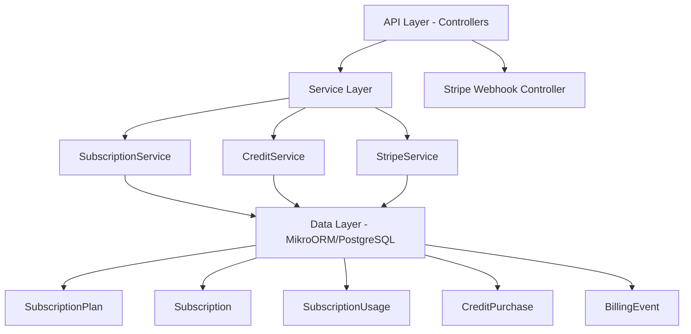

# Subscription Module Specification v2

<Info>
**Status:** Active — fully implemented  
**Module Path:** `src/modules/subscription/`  
**Payment Gateway:** Stripe
</Info>

## Overview

The Subscription Module implements a **freemium SaaS billing system** for PropWise CRM. Every organization has a subscription tied to one of four plan tiers. The module handles:

- **Plan-based feature gating** — binary feature flags per tier
- **Resource limits** — caps on leads, contacts, deals, companies, and storage
- **Credit-based metering** — monthly AI and messaging allowances with purchasable top-ups
- **Dual seat types** — manager seats and agent seats with per-tier pricing; every user consumes a seat
- **Stripe integration** — checkout, subscription management, mid-cycle plan changes, webhooks, billing portal
- **Proration** — mid-cycle upgrades, downgrades, and seat changes are prorated to the day
- **Suspension flow** — 2-day grace period on payment failure, then org goes read-only

### Design Principles

<AccordionGroup>
<Accordion title="Core Design Decisions">
| Principle | Decision |
|---|---|
| Freemium model | Free plan with limited features; paid tiers unlock progressively |
| Per-org billing | Billing is per organization; developer portal is free |
| Dual seat types | Manager seats (Owner, Admin) and agent seats (Basic, custom roles); every user consumes a seat |
| Seat type derived from role | No explicit seat assignment — seat type is automatically determined by the user's RBAC role |
| Feature flags over tier checks | Gating uses `@RequiresFeature('flag')` on plan JSONB — changing what a tier includes requires only a seeder update, not code changes |
| Service-layer limit enforcement | Resource limits and credit consumption are checked in service methods, not guards, because they need entity counts |
| Stripe as source of truth for payments | Webhook-driven lifecycle: the app reacts to Stripe events rather than polling |
| Prorated plan changes | All mid-cycle changes (upgrade, downgrade, add/remove seats) use `proration_behavior: 'create_prorations'` — charges are fair to the day |
| Checkout vs. change-plan separation | `POST /checkout` is for first-time subscription (Free → Paid); `POST /change-plan` is for switching between paid tiers |
| Idempotent webhooks | Every Stripe event is logged in `BillingEvent` with a unique `stripeEventId` to prevent duplicate processing |
| Graceful degradation | If `STRIPE_SECRET_KEY` is not set, billing features are unavailable but the app still starts |
</Accordion>
</AccordionGroup>

## Architecture

### High-Level Diagram



### Data Flow

<Steps>
<Step title="First-time Checkout Flow (Free → Paid)">
```typescript
Frontend "Upgrade" button
  → POST /v1/subscriptions/checkout
    → Rejects if org already has a Stripe subscription
    → SubscriptionService.createCheckoutSession()
      → StripeService.createCheckoutSession()
        → Returns Stripe Checkout URL
          → User pays on Stripe's hosted page
            → Stripe fires checkout.session.completed webhook
              → StripeWebhookController receives + verifies signature
                → SubscriptionService.activateSubscription()
                  → Subscription entity updated to ACTIVE
```
</Step>

<Step title="Mid-cycle Plan Change Flow (Paid → Different Paid Tier)">
```typescript
Frontend "Change Plan" button
  → POST /v1/subscriptions/change-plan
    → SubscriptionService.changePlan()
      → Validates seat overflow
      → StripeService.swapSubscriptionPrice() — prorated
      → Reconciles seat line items
      → Updates local Subscription entity
      → Returns updated subscription immediately
```
</Step>

<Step title="Renewal / Payment Failure Flow">
```typescript
Stripe charges renewal invoice
  ├─ invoice.paid → handleInvoicePaid() → status stays ACTIVE
  └─ invoice.payment_failed → handleInvoicePaymentFailed() → status → PAST_DUE
       └─ Stripe retries for 2 days
            ├─ Payment succeeds → invoice.paid → back to ACTIVE
            └─ All retries fail → customer.subscription.updated
                 → handleSubscriptionUpdated() → status → SUSPENDED
                      → Org is read-only
```
</Step>
</Steps>

## Plan Tiers & Pricing

Four tiers, priced in USD cents:

| | **Free** | **Starter** | **Professional** | **Business** |
|---|---|---|---|---|
| Monthly price | $0 | $49 | $149 | $399 |
| Annual price | $0 | $470.40 (~20% off) | $1,430.40 | $3,830.40 |
| Manager seats included | 1 | 2 | 5 | 10 |
| Agent seats included | 0 | 3 | 15 | 40 |
| Extra manager seat | — | $25/mo | $20/mo | $18/mo |
| Extra agent seat | — | $12/mo | $10/mo | $8/mo |

### Resource Limits

<CardGroup cols={2}>
<Card title="Data Limits" icon="database">
| Resource | Free | Starter | Professional | Business |
|---|---|---|---|---|
| Leads | 50 | 1,000 | 10,000 | Unlimited |
| Contacts | 50 | 1,000 | 10,000 | Unlimited |
| Deals | 20 | 500 | 5,000 | Unlimited |
| Companies | 10 | 200 | 2,000 | Unlimited |
| Storage | 500 MB | 5 GB | 25 GB | 100 GB |
</Card>

<Card title="Monthly Credits" icon="coins">
| Credit type | Free | Starter | Professional | Business |
|---|---|---|---|---|
| AI credits | 20 | 200 | 1,000 | 5,000 |
| Messaging credits | 0 | 100 | 500 | 2,000 |
</Card>
</CardGroup>

## Feature Gating Model

Features are gated using three distinct mechanisms:

<Tabs>
<Tab title="Binary Feature Flags">
Boolean flags stored in `SubscriptionPlan.features` (JSONB). Checked via `@RequiresFeature('flagName')` guard decorator or `SubscriptionService.checkFeature()`.

| Feature flag | Free | Starter | Pro | Business |
|---|---|---|---|---|
| `customPipelineStages` | — | ✅ | ✅ | ✅ |
| `distributionEngine` | — | — | ✅ | ✅ |
| `escalationEngine` | — | — | ✅ | ✅ |
| `advancedAnalytics` | — | — | ✅ | ✅ |
| `apiAccess` | — | — | ✅ | ✅ |
| `commissionTracking` | — | — | ✅ | ✅ |
| `teamsAndHierarchy` | — | — | ✅ | ✅ |
| `customRoles` | — | — | — | ✅ |
| `whiteLabel` | — | — | — | ✅ |
| `maxMessagingChannels` | 0 | 1 | 3 | Unlimited (-1) |
| `maxEmailIntegrations` | 0 | 1 | 3 | Unlimited (-1) |
| `auditLogRetentionDays` | 0 | 0 | 30 | Unlimited (-1) |
</Tab>

<Tab title="Credit-Based">
Features available on the tier but have a monthly budget that resets each billing cycle. Tracked in `SubscriptionUsage`. When exhausted, the org can purchase one-time top-up packs (`CreditPurchase`).

<Note>
Consumption order: **monthly plan allowance first → purchased packs FIFO (oldest first)**
</Note>
</Tab>

<Tab title="Add-on Packs">
| Add-on | Behavior | Stripe model |
|---|---|---|
| Storage pack (+10 GB) | Recurring, stacks | Subscription line item (per-unit) |
| AI credit pack (+500) | One-time, consumed then gone | Payment intent |
| Messaging credit pack (+500) | One-time, consumed then gone | Payment intent |
</Tab>
</Tabs>

## Seat Management

### Seat Types

<Warning>
Every user in an organization consumes exactly one seat. The seat type is **derived from the user's RBAC role** — there is no separate seat assignment.
</Warning>

| Seat type | Roles that consume it | Price varies by tier |
|---|---|---|
| **Manager** | Owner, Admin | Yes |
| **Agent** | Basic, custom org roles | Yes |

<CodeGroup>
```typescript Role Seat Mapping
const ROLE_SEAT_MAP: Record<string, SeatType> = {
  Owner: SeatType.MANAGER,
  Admin: SeatType.MANAGER,
};
// Any other role → SeatType.AGENT
```
</CodeGroup>

### Seat Counting

Seats are **derived from RBAC roles**, not tracked via a separate assignment table. The count is computed on-demand from active `UserOrgRole` records:

```typescript
managerSeatsUsed = count of active users with Owner or Admin org role
agentSeatsUsed   = count of active users with any other org role
```

<Check>
A seat is **not occupied** by a pending invitation — it only counts when the user has accepted and has an active `UserOrgRole`.
</Check>

### Enforcement Points

Seat availability is checked at two integration points:

1. **`invitation.service.ts`** — before creating an invitation, the role determines the seat type and availability is checked
2. **`role-assignment-validation.service.ts`** — when changing a user's role (e.g. promoting Basic → Admin), checks that the target seat type has room; the old seat type is freed simultaneously

### Proration on Seat Changes

<Tip>
Adding or removing seats mid-cycle uses `proration_behavior: 'create_prorations'`:

- **Adding a seat on April 15** (30-day month): prorated charge for 15 remaining days, billed on the next invoice
- **Removing a seat on April 15**: prorated credit for 15 remaining days, applied to the next invoice
- **Adding on April 4, removing on April 6**: net charge for 2 days only (charge for 26 days minus credit for 24 days)
</Tip>

### Stripe Billing

Extra seats are billed as subscription line items with `per_unit` pricing. A subscription for a Professional org with 7 managers and 20 agents would have:

| Line Item | Qty | Price |
|---|---|---|
| PropWise Professional | 1 | $149/mo |
| Extra Manager Seat (Pro) | 2 | $40/mo |
| Extra Agent Seat (Pro) | 5 | $50/mo |

## Credit System

### Consumption Flow

<Steps>
<Step title="Service Layer Call">
```typescript
SubscriptionService.consumeCredits(orgId, 'ai', 1)
  → CreditService.consumeCredits(subscription, AI, 1)
```
</Step>

<Step title="Monthly Allowance Check">
Check monthly allowance: `usage.aiCreditsUsed < usage.aiCreditsAllowance`
</Step>

<Step title="Purchased Packs (FIFO)">
If monthly allowance exhausted, consume from purchased packs in FIFO order
</Step>

<Step title="Rejection">
If no credits available, throw `InsufficientCreditsException`
</Step>
</Steps>

## Entity Specifications

<AccordionGroup>
<Accordion title="SubscriptionPlan Entity">
```typescript
@Entity()
export class SubscriptionPlan {
  @PrimaryKey()
  id!: string;

  @Property()
  name!: string;

  @Property()
  monthlyPriceUsd!: number; // in cents

  @Property()
  annualPriceUsd!: number; // in cents

  @Property()
  managerSeatsIncluded!: number;

  @Property()
  agentSeatsIncluded!: number;

  @Property()
  extraManagerSeatPriceUsd!: number;

  @Property()
  extraAgentSeatPriceUsd!: number;

  @Property({ type: 'json' })
  features!: Record<string, boolean | number>;

  @Property({ type: 'json' })
  limits!: {
    maxLeads: number;
    maxContacts: number;
    maxDeals: number;
    maxCompanies: number;
    storageBytes: number;
  };

  @Property({ type: 'json' })
  monthlyCredits!: {
    ai: number;
    messaging: number;
  };
}
```
</Accordion>

<Accordion title="Subscription Entity">
```typescript
@Entity()
export class Subscription {
  @PrimaryKey()
  id!: string;

  @ManyToOne(() => Organization)
  organization!: Organization;

  @ManyToOne(() => SubscriptionPlan)
  plan!: SubscriptionPlan;

  @Enum(() => SubscriptionStatus)
  status!: SubscriptionStatus;

  @Enum(() => BillingInterval)
  billingInterval!: BillingInterval;

  @Property({ nullable: true })
  stripeSubscriptionId?: string;

  @Property({ nullable: true })
  stripeCustomerId?: string;

  @Property()
  currentPeriodStart!: Date;

  @Property()
  currentPeriodEnd!: Date;

  @Property({ default: false })
  cancelAtPeriodEnd!: boolean;

  @OneToOne(() => SubscriptionUsage, usage => usage.subscription)
  usage!: SubscriptionUsage;
}
```
</Accordion>

<Accordion title="SubscriptionUsage Entity">
```typescript
@Entity()
export class SubscriptionUsage {
  @PrimaryKey()
  id!: string;

  @OneToOne(() => Subscription, subscription => subscription.usage)
  subscription!: Subscription;

  @Property({ default: 0 })
  aiCreditsUsed!: number;

  @Property({ default: 0 })
  messagingCreditsUsed!: number;

  @Property({ default: 0 })
  aiCreditsAllowance!: number;

  @Property({ default: 0 })
  messagingCreditsAllowance!: number;

  @Property()
  usagePeriodStart!: Date;

  @Property()
  usagePeriodEnd!: Date;

  @Property({ default: 0 })
  storageUsedBytes!: number;
}
```
</Accordion>

<Accordion title="CreditPurchase Entity">
```typescript
@Entity()
export class CreditPurchase {
  @PrimaryKey()
  id!: string;

  @ManyToOne(() => Subscription)
  subscription!: Subscription;

  @Enum(() => CreditType)
  creditType!: CreditType;

  @Property()
  creditsQuantity!: number;

  @Property()
  creditsRemaining!: number;

  @Property()
  priceUsd!: number;

  @Property({ nullable: true })
  stripePaymentIntentId?: string;

  @Property({ default: false })
  isExpired!: boolean;

  @Property()
  purchasedAt!: Date;

  @Property({ nullable: true })
  expiresAt?: Date;
}
```
</Accordion>
</AccordionGroup>

## Stripe Integration

### Authentication & Configuration

<CodeGroup>
```typescript Environment Variables
STRIPE_SECRET_KEY=sk_test_...
STRIPE_WEBHOOK_SECRET=whsec_...
STRIPE_PUBLISHABLE_KEY=pk_test_...
```

```typescript Graceful Degradation
@Injectable()
export class StripeService {
  private stripe?: Stripe;

  constructor() {
    const secretKey = process.env.STRIPE_SECRET_KEY;
    if (secretKey) {
      this.stripe = new Stripe(secretKey, { apiVersion: '2024-06-20' });
    } else {
      console.warn('STRIPE_SECRET_KEY not set - billing features disabled');
    }
  }

  private requireStripe(): Stripe {
    if (!this.stripe) {
      throw new Error('Stripe not configured - billing features unavailable');
    }
    return this.stripe;
  }
}
```
</CodeGroup>

### Webhook Event Processing

<Steps>
<Step title="Signature Verification">
All incoming webhooks are verified using `stripe.webhooks.constructEvent()` with the webhook secret
</Step>

<Step title="Idempotency Check">
Check if `BillingEvent` already exists with the same `stripeEventId` to prevent duplicate processing
</Step>

<Step title="Event Processing">
Process the event based on type and update local entities accordingly
</Step>

<Step title="Logging">
Create `BillingEvent` record with event details and processing status
</Step>
</Steps>

## Subscription Lifecycle

<Tabs>
<Tab title="Activation Flow">
```typescript
// checkout.session.completed webhook
async handleCheckoutCompleted(session: Stripe.Checkout.Session) {
  const subscription = await this.findByStripeSessionId(session.id);
  if (!subscription) {
    throw new Error('Subscription not found for checkout session');
  }

  await this.em.nativeUpdate(Subscription, subscription.id, {
    status: SubscriptionStatus.ACTIVE,
    stripeSubscriptionId: session.subscription as string,
    currentPeriodStart: new Date(stripeSubscription.current_period_start * 1000),
    currentPeriodEnd: new Date(stripeSubscription.current_period_end * 1000),
  });
}
```
</Tab>

<Tab title="Payment Failure">
```typescript
// invoice.payment_failed webhook
async handleInvoicePaymentFailed(invoice: Stripe.Invoice) {
  const subscription = await this.findByStripeSubscriptionId(
    invoice.subscription as string
  );
  
  await this.em.nativeUpdate(Subscription, subscription.id, {
    status: SubscriptionStatus.PAST_DUE,
  });
  
  // Stripe will retry for 2 days
}
```
</Tab>

<Tab title="Suspension">
```typescript
// customer.subscription.updated webhook (status: 'unpaid')
async handleSubscriptionUpdated(stripeSubscription: Stripe.Subscription) {
  if (stripeSubscription.status === 'unpaid') {
    const subscription = await this.findByStripeSubscriptionId(
      stripeSubscription.id
    );
    
    await this.em.nativeUpdate(Subscription, subscription.id, {
      status: SubscriptionStatus.SUSPENDED,
    });
  }
}
```
</Tab>
</Tabs>

## Plan Changes (Upgrade / Downgrade)

<Warning>
Mid-cycle plan changes use Stripe's subscription modification API with prorated billing
</Warning>

### Validation Rules

<Steps>
<Step title="Seat Overflow Check">
Prevent downgrading if current user count exceeds new plan's seat limits
</Step>

<Step title="Free Plan Restrictions">
Cannot downgrade from paid plan back to Free using change-plan API
</Step>

<Step title="Same Plan Check">
Reject if trying to "change" to the same plan
</Step>
</Steps>

### Implementation

<CodeGroup>
```typescript Plan Change Logic
async changePlan(orgId: string, newPlanId: string): Promise<Subscription> {
  const subscription = await this.getCurrentSubscription(orgId);
  const newPlan = await this.getPlan(newPlanId);
  
  // Validate seat overflow
  const currentSeats = await this.getCurrentSeatUsage(orgId);
  if (currentSeats.managers > newPlan.managerSeatsIncluded ||
      currentSeats.agents > newPlan.agentSeatsIncluded) {
    throw new BadRequestException('Current seat usage exceeds new plan limits');
  }

  // Update Stripe subscription
  const stripeSubscription = await this.stripeService.swapSubscriptionPrice(
    subscription.stripeSubscriptionId!,
    this.getStripePriceId(newPlan, subscription.billingInterval),
    {
      proration_behavior: 'create_prorations'
    }
  );

  // Update local subscription
  subscription.plan = newPlan;
  await this.em.persistAndFlush(subscription);
  
  return subscription;
}
```
</CodeGroup>

## API Endpoints

<AccordionGroup>
<Accordion title="GET /v1/subscriptions">
**Description:** Get current organization's subscription details

**Response:**
```typescript
{
  id: string;
  status: SubscriptionStatus;
  plan: {
    id: string;
    name: string;
    monthlyPriceUsd: number;
    features: Record<string, boolean | number>;
    limits: ResourceLimits;
  };
  usage: {
    aiCreditsUsed: number;
    messagingCreditsUsed: number;
    storageUsedBytes: number;
    seatsUsed: {
      managers: number;
      agents: number;
    };
  };
  billingDetails: {
    currentPeriodStart: Date;
    currentPeriodEnd: Date;
    cancelAtPeriodEnd: boolean;
  };
}
```
</Accordion>

<Accordion title="POST /v1/subscriptions/checkout">
**Description:** Create Stripe checkout session for first-time subscription

**Request:**
```typescript
{
  planId: string;
  billingInterval: 'monthly' | 'annual';
  successUrl: string;
  cancelUrl: string;
}
```

**Response:**
```typescript
{
  checkoutUrl: string;
  sessionId: string;
}
```
</Accordion>

<Accordion title="POST /v1/subscriptions/change-plan">
**Description:** Change subscription plan (mid-cycle, prorated)

**Request:**
```typescript
{
  planId: string;
}
```

**Response:**
```typescript
{
  subscription: Subscription;
  prorationAmount: number; // in cents
}
```
</Accordion>

<Accordion title="POST /v1/subscriptions/cancel">
**Description:** Cancel subscription at period end

**Response:**
```typescript
{
  cancelAtPeriodEnd: boolean;
  periodEndDate: Date;
}
```
</Accordion>
</AccordionGroup>

## Guards & Decorators

<Tabs>
<Tab title="Feature Guards">
```typescript
@RequiresFeature('customPipelineStages')
@Post('stages')
async createStage(@Body() dto: CreateStageDto) {
  // Only available on Starter+ plans
}
```
</Tab>

<Tab title="Subscription Status Guards">
```typescript
@UseGuards(SubscriptionActiveGuard)
@Post('leads')
async createLead(@Body() dto: CreateLeadDto) {
  // Blocked if subscription is SUSPENDED
}
```
</Tab>

<Tab title="Service Layer Checks">
```typescript
async createLead(orgId: string, dto: CreateLeadDto) {
  await this.subscriptionService.checkResourceLimit(orgId, 'leads');
  await this.subscriptionService.consumeCredits(orgId, 'ai', 1);
  
  // Create lead...
}
```
</Tab>
</Tabs>

## Enforcement Points

<CardGroup cols={2}>
<Card title="Resource Limits" icon="chart-line">
**Where:** Service layer methods before entity creation  
**Examples:**
- `LeadService.createLead()`
- `ContactService.createContact()`
- `FileUploadService.uploadFile()`
</Card>

<Card title="Credit Consumption" icon="coins">
**Where:** Service layer methods that use AI/messaging  
**Examples:**
- `AiService.generateContent()`
- `MessagingService.sendSms()`
- `EmailService.sendEmail()`
</Card>
</AccordionGroup>

## Plan Seeder

The plan seeder initializes the four subscription plans with their features, limits, and pricing:

<CodeGroup>
```typescript Plan Seeder
import { Seeder } from '@mikro-orm/seeder';
import { SubscriptionPlan } from '../entities/subscription-plan.entity';

export class SubscriptionPlanSeeder extends Seeder {
  async run(): Promise<void> {
    const plans = [
      {
        id: 'free',
        name: 'Free',
        monthlyPriceUsd: 0,
        annualPriceUsd: 0,
        managerSeatsIncluded: 1,
        agentSeatsIncluded: 0,
        features: {
          customPipelineStages: false,
          distributionEngine: false,
          advancedAnalytics: false,
          // ... other features
        },
        limits: {
          maxLeads: 50,
          maxContacts: 50,
          maxDeals: 20,
          maxCompanies: 10,
          storageBytes: 500 * 1024 * 1024, // 500 MB
        },
        monthlyCredits: {
          ai: 20,
          messaging: 0,
        },
      },
      // ... other plans
    ];

    for (const planData of plans) {
      const plan = this.em.create(SubscriptionPlan, planData);
      this.em.persist(plan);
    }
  }
}
```
</CodeGroup>

## Module Structure

```
src/modules/subscription/
├── controllers/
│   ├── subscription.controller.ts
│   └── stripe-webhook.controller.ts
├── services/
│   ├── subscription.service.ts
│   ├── credit.service.ts
│   └── stripe.service.ts
├── entities/
│   ├── subscription-plan.entity.ts
│   ├── subscription.entity.ts
│   ├── subscription-usage.entity.ts
│   ├── credit-purchase.entity.ts
│   └── billing-event.entity.ts
├── guards/
│   ├── requires-feature.guard.ts
│   └── subscription-active.guard.ts
├── decorators/
│   └── requires-feature.decorator.ts
├── enums/
│   ├── subscription-status.enum.ts
│   ├── billing-interval.enum.ts
│   └── credit-type.enum.ts
├── dtos/
│   ├── checkout.dto.ts
│   ├── change-plan.dto.ts
│   └── subscription-response.dto.ts
├── seeders/
│   └── subscription-plan.seeder.ts
└── subscription.module.ts
```

## Environment Configuration

<CodeGroup>
```env Required Variables
# Stripe Configuration
STRIPE_SECRET_KEY=sk_test_...
STRIPE_WEBHOOK_SECRET=whsec_...
STRIPE_PUBLISHABLE_KEY=pk_test_...

# Application URLs
FRONTEND_URL=http://localhost:3000
API_BASE_URL=http://localhost:3001

# Feature Flags
BILLING_ENABLED=true
STRIPE_WEBHOOK_TOLERANCE_SECONDS=300
```
</CodeGroup>

<Note>
If `STRIPE_SECRET_KEY` is not set, the module will start but billing features will be disabled with graceful error messages.
</Note>

## Integration with Other Modules

<CardGroup cols={2}>
<Card title="User Management" icon="users">
- Seat counting from `UserOrgRole` entities
- Role changes trigger seat type switches
- Invitation validation checks seat availability
</Card>

<Card title="Organization Module" icon="building">
- Every org has exactly one subscription
- Org suspension affects all org operations
- Stripe customer ID stored on org entity
</Card>

<Card title="File Upload" icon="upload">
- Storage limits enforced before upload
- Usage tracked in subscription usage
- File deletion frees storage quota
</Card>

<Card title="AI Services" icon="brain">
- Credit consumption for AI operations
- Monthly allowances and top-up packs
- Feature gating for AI capabilities
</Card>
</CardGroup>

<Warning>
The subscription module is a **core dependency** for most other modules. Ensure it's properly initialized before other services that depend on feature gating or resource limits.
</Warning>