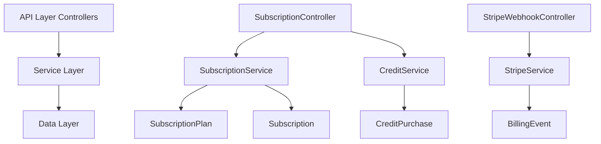
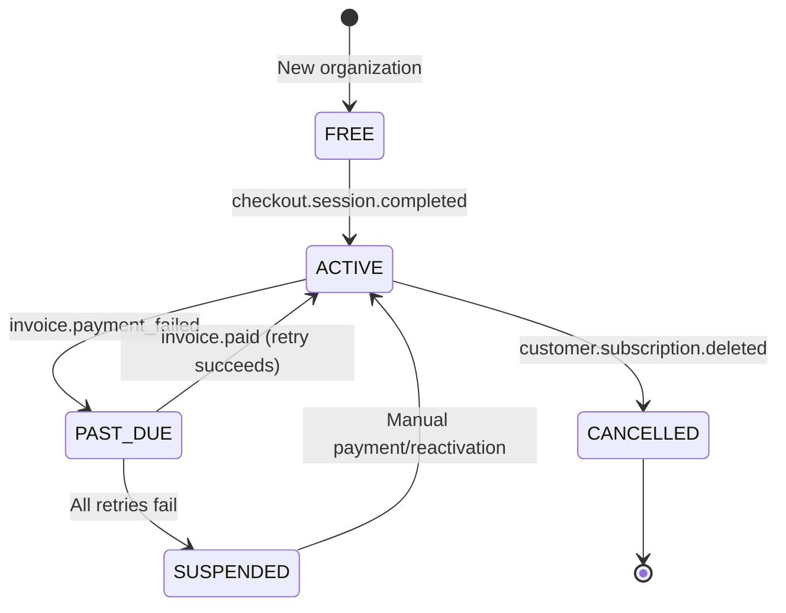

## Overview

The Subscription Module implements a **freemium SaaS billing system** for PropWise CRM. Every organization has a subscription tied to one of four plan tiers. The module handles:

- **Plan-based feature gating** — binary feature flags per tier
- **Resource limits** — caps on leads, contacts, deals, companies, and storage
- **Credit-based metering** — monthly AI and messaging allowances with purchasable top-ups
- **Dual seat types** — manager seats and agent seats with per-tier pricing; every user consumes a seat
- **Stripe integration** — checkout, subscription management, mid-cycle plan changes, webhooks, billing portal
- **Proration** — mid-cycle upgrades, downgrades, and seat changes are prorated to the day
- **Suspension flow** — 2-day grace period on payment failure, then org goes read-only

<Info>
**Module Path:** `src/modules/subscription/`  
**Payment Gateway:** Stripe  
**Status:** Active — fully implemented
</Info>

### Design Principles

| Principle | Decision |
|---|---|
| Freemium model | Free plan with limited features; paid tiers unlock progressively |
| Per-org billing | Billing is per organization; developer portal is free |
| Dual seat types | Manager seats (Owner, Admin) and agent seats (Basic, custom roles); every user consumes a seat |
| Seat type derived from role | No explicit seat assignment — seat type is automatically determined by the user's RBAC role |
| Feature flags over tier checks | Gating uses `@RequiresFeature('flag')` on plan JSONB — changing what a tier includes requires only a seeder update, not code changes |
| Service-layer limit enforcement | Resource limits and credit consumption are checked in service methods, not guards, because they need entity counts |
| Stripe as source of truth for payments | Webhook-driven lifecycle: the app reacts to Stripe events rather than polling |
| Prorated plan changes | All mid-cycle changes (upgrade, downgrade, add/remove seats) use `proration_behavior: 'create_prorations'` — charges are fair to the day |

## Architecture

### High-Level Diagram



### Data Flow

<Tabs>
  <Tab title="First-time Checkout">
    **Free → Paid tier flow:**

    ```typescript
    Frontend "Upgrade" button
      → POST /v1/subscriptions/checkout
        → Rejects if org already has Stripe subscription
        → SubscriptionService.createCheckoutSession()
          → StripeService.createCheckoutSession()
            → Returns Stripe Checkout URL
              → User pays on Stripe's hosted page
                → Stripe fires checkout.session.completed webhook
                  → StripeWebhookController receives + verifies signature
                    → SubscriptionService.activateSubscription()
                      → Subscription entity updated to ACTIVE
    ```
  </Tab>
  
  <Tab title="Plan Changes">
    **Paid → different Paid tier flow:**

    ```typescript
    Frontend "Change Plan" button
      → POST /v1/subscriptions/change-plan
        → SubscriptionService.changePlan()
          → Validates seat overflow
          → StripeService.swapSubscriptionPrice() — prorated
          → Reconciles seat line items
          → Updates local Subscription entity
          → Returns updated subscription immediately
    ```
  </Tab>
  
  <Tab title="Payment Failure">
    **Renewal / payment failure flow:**

    ```typescript
    Stripe charges renewal invoice
      ├─ invoice.paid → handleInvoicePaid() → status stays ACTIVE
      └─ invoice.payment_failed → handleInvoicePaymentFailed() → PAST_DUE
           └─ Stripe retries for 2 days
                ├─ Payment succeeds → invoice.paid → back to ACTIVE
                └─ All retries fail → customer.subscription.updated
                     → handleSubscriptionUpdated() → SUSPENDED
                          → Org is read-only
    ```
  </Tab>
</Tabs>

## Plan Tiers & Pricing

Four tiers, priced in USD cents:

| | **Free** | **Starter** | **Professional** | **Business** |
|---|---|---|---|---|
| Monthly price | $0 | $49 | $149 | $399 |
| Annual price | $0 | $470.40 (~20% off) | $1,430.40 | $3,830.40 |
| Manager seats included | 1 | 2 | 5 | 10 |
| Agent seats included | 0 | 3 | 15 | 40 |
| Extra manager seat | — | $25/mo | $20/mo | $18/mo |
| Extra agent seat | — | $12/mo | $10/mo | $8/mo |

### Resource Limits

<Note>
Resource limits are enforced at the service layer when creating or modifying entities.
</Note>

| Resource | Free | Starter | Professional | Business |
|---|---|---|---|---|
| Leads | 50 | 1,000 | 10,000 | Unlimited |
| Contacts | 50 | 1,000 | 10,000 | Unlimited |
| Deals | 20 | 500 | 5,000 | Unlimited |
| Companies | 10 | 200 | 2,000 | Unlimited |
| Storage | 500 MB | 5 GB | 25 GB | 100 GB |

### Monthly Credits

| Credit type | Free | Starter | Professional | Business |
|---|---|---|---|---|
| AI credits | 20 | 200 | 1,000 | 5,000 |
| Messaging credits | 0 | 100 | 500 | 2,000 |

## Feature Gating Model

Features are gated using three distinct mechanisms:

### Type 1: Binary Feature Flags

Boolean flags stored in `SubscriptionPlan.features` (JSONB). Checked via `@RequiresFeature('flagName')` guard decorator or `SubscriptionService.checkFeature()`.

<CodeGroup>
```typescript Guard Decorator
@RequiresFeature('customPipelineStages')
@Get('/pipeline-stages')
async getCustomStages() {
  // Only accessible if plan has customPipelineStages: true
}
```

```typescript Service Check
const hasFeature = await this.subscriptionService.checkFeature(
  orgId, 
  'advancedAnalytics'
);
if (!hasFeature) {
  throw new ForbiddenException('Feature not available on your plan');
}
```
</CodeGroup>

| Feature flag | Free | Starter | Pro | Business |
|---|---|---|---|---|
| `customPipelineStages` | — | ✅ | ✅ | ✅ |
| `distributionEngine` | — | — | ✅ | ✅ |
| `escalationEngine` | — | — | ✅ | ✅ |
| `advancedAnalytics` | — | — | ✅ | ✅ |
| `apiAccess` | — | — | ✅ | ✅ |
| `commissionTracking` | — | — | ✅ | ✅ |
| `teamsAndHierarchy` | — | — | ✅ | ✅ |
| `customRoles` | — | — | — | ✅ |
| `whiteLabel` | — | — | — | ✅ |

### Type 2: Credit-Based (Monthly Allowance)

Features that are available on the tier but have a monthly budget that resets each billing cycle. Tracked in `SubscriptionUsage`. When exhausted, the org can purchase one-time top-up packs (`CreditPurchase`).

<Warning>
Consumption order: **monthly plan allowance first → purchased packs FIFO (oldest first)**.
</Warning>

### Type 3: Add-on Packs

| Add-on | Behavior | Stripe model |
|---|---|---|
| Storage pack (+10 GB) | Recurring, stacks | Subscription line item (per-unit) |
| AI credit pack (+500) | One-time, consumed then gone | Payment intent |
| Messaging credit pack (+500) | One-time, consumed then gone | Payment intent |

## Seat Management

### Seat Types

Every user in an organization consumes exactly one seat. The seat type is **derived from the user's RBAC role** — there is no separate seat assignment.

<Info>
Seats are **derived from RBAC roles**, not tracked via a separate assignment table.
</Info>

| Seat type | Roles that consume it | Price varies by tier |
|---|---|---|
| **Manager** | Owner, Admin | Yes |
| **Agent** | Basic, custom org roles | Yes |

The mapping is defined in `subscription.service.ts`:

```typescript
const ROLE_SEAT_MAP: Record<string, SeatType> = {
  Owner: SeatType.MANAGER,
  Admin: SeatType.MANAGER,
};
// Any other role → SeatType.AGENT
```

### Seat Counting

Seats are computed on-demand from active `UserOrgRole` records:

```typescript
managerSeatsUsed = count of active users with Owner or Admin org role
agentSeatsUsed   = count of active users with any other org role
```

<Note>
A seat is **not occupied** by a pending invitation — it only counts when the user has accepted and has an active `UserOrgRole`.
</Note>

| Step | Seat occupied? |
|---|---|
| Admin sends invitation with role "Admin" | No — seat availability is checked but not reserved |
| User accepts → `UserOrgRole` created | Yes — now counted |
| User removed (role soft-deleted) | No — freed |
| User's role changed (Basic → Admin) | Swaps: frees one agent seat, occupies one manager seat |

### Enforcement Points

Seat availability is checked at two integration points:

1. **`invitation.service.ts`** — before creating an invitation, the role determines the seat type and availability is checked
2. **`role-assignment-validation.service.ts`** — when changing a user's role (e.g. promoting Basic → Admin), checks that the target seat type has room; the old seat type is freed simultaneously

### Proration on Seat Changes

Adding or removing seats mid-cycle uses `proration_behavior: 'create_prorations'`:

<Steps>
  <Step title="Adding a seat on April 15">
    Prorated charge for 15 remaining days (30-day month), billed on the next invoice
  </Step>
  <Step title="Removing a seat on April 15">
    Prorated credit for 15 remaining days, applied to the next invoice
  </Step>
  <Step title="Adding on April 4, removing on April 6">
    Net charge for 2 days only (charge for 26 days minus credit for 24 days)
  </Step>
</Steps>

### Stripe Billing

Extra seats are billed as subscription line items with `per_unit` pricing. A subscription for a Professional org with 7 managers and 20 agents would have:

| Line Item | Qty | Price |
|---|---|---|
| PropWise Professional | 1 | $149/mo |
| Extra Manager Seat (Pro) | 2 | $40/mo |
| Extra Agent Seat (Pro) | 5 | $50/mo |

## Credit System

### Consumption Flow

```typescript
SubscriptionService.consumeCredits(orgId, 'ai', 1)
  → CreditService.consumeCredits(subscription, AI, 1)
      1. Check monthly allowance: usage.aiCreditsUsed < plan.aiCreditsMonthly
      2. If insufficient allowance: query CreditPurchase records (FIFO)
      3. Deduct from monthly allowance OR purchased packs
      4. Update SubscriptionUsage.aiCreditsUsed OR CreditPurchase.creditsRemaining
      5. Return success/failure
```

<Warning>
Credit consumption is **atomic** — either the full amount is deducted or none at all. Partial consumption is not supported.
</Warning>

### Credit Purchase Flow

<Steps>
  <Step title="User initiates credit purchase">
    Frontend calls `POST /v1/subscriptions/purchase-credits` with type and quantity
  </Step>
  <Step title="Stripe Payment Intent created">
    `StripeService.createCreditPurchaseIntent()` creates one-time payment
  </Step>
  <Step title="User completes payment">
    Stripe processes payment and fires `payment_intent.succeeded` webhook
  </Step>
  <Step title="Credits added to account">
    Webhook handler creates `CreditPurchase` record with credits available
  </Step>
</Steps>

## Entity Specifications

### SubscriptionPlan

```typescript
@Entity()
export class SubscriptionPlan {
  @PrimaryKey()
  id: number;

  @Property()
  name: string; // 'Free', 'Starter', 'Professional', 'Business'

  @Property()
  priceMonthly: number; // USD cents

  @Property()
  priceAnnual: number; // USD cents, ~20% discount

  @Property()
  managerSeatsIncluded: number;

  @Property()
  agentSeatsIncluded: number;

  @Property()
  extraManagerSeatPrice: number; // USD cents/month

  @Property()
  extraAgentSeatPrice: number; // USD cents/month

  @Property({ type: 'jsonb' })
  features: Record<string, boolean | number>; // Feature flags

  @Property({ type: 'jsonb' })
  limits: {
    leads: number;        // -1 = unlimited
    contacts: number;
    deals: number;
    companies: number;
    storageBytes: number;
  };

  @Property()
  aiCreditsMonthly: number;

  @Property()
  messagingCreditsMonthly: number;

  @Property()
  stripePriceIdMonthly: string;

  @Property()
  stripePriceIdAnnual: string;

  @Property()
  stripeManagerSeatPriceId: string;

  @Property()
  stripeAgentSeatPriceId: string;
}
```

### Subscription

```typescript
@Entity()
export class Subscription {
  @PrimaryKey()
  id: number;

  @ManyToOne(() => Organization)
  organization: Organization;

  @ManyToOne(() => SubscriptionPlan)
  plan: SubscriptionPlan;

  @Enum(() => SubscriptionStatus)
  status: SubscriptionStatus; // ACTIVE, PAST_DUE, SUSPENDED, CANCELLED

  @Enum(() => BillingInterval)
  billingInterval: BillingInterval; // MONTHLY, ANNUAL

  @Property({ nullable: true })
  stripeSubscriptionId?: string;

  @Property({ nullable: true })
  stripeCustomerId?: string;

  @Property()
  currentPeriodStart: Date;

  @Property()
  currentPeriodEnd: Date;

  @Property({ nullable: true })
  cancelledAt?: Date;

  @Property({ nullable: true })
  cancelAtPeriodEnd?: boolean;

  @OneToOne(() => SubscriptionUsage, usage => usage.subscription)
  usage: SubscriptionUsage;
}
```

### SubscriptionUsage

```typescript
@Entity()
export class SubscriptionUsage {
  @PrimaryKey()
  id: number;

  @OneToOne(() => Subscription)
  subscription: Subscription;

  @Property({ default: 0 })
  aiCreditsUsed: number;

  @Property({ default: 0 })
  messagingCreditsUsed: number;

  @Property()
  lastResetAt: Date; // When monthly counters were last reset

  @Property()
  updatedAt: Date = new Date();
}
```

### CreditPurchase

```typescript
@Entity()
export class CreditPurchase {
  @PrimaryKey()
  id: number;

  @ManyToOne(() => Subscription)
  subscription: Subscription;

  @Enum(() => CreditType)
  creditType: CreditType; // AI, MESSAGING

  @Property()
  creditsTotal: number; // Original purchase amount

  @Property()
  creditsRemaining: number; // Current balance

  @Property()
  priceInCents: number; // What the user paid

  @Property({ nullable: true })
  stripePaymentIntentId?: string;

  @Property()
  purchasedAt: Date = new Date();

  @Property({ nullable: true })
  expiresAt?: Date; // Future: credit expiration
}
```

## Stripe Integration

### Webhook Event Handling

<Warning>
All webhook events are processed idempotently using the `stripeEventId` to prevent duplicate processing.
</Warning>

<AccordionGroup>
  <Accordion title="checkout.session.completed">
    Activates subscription when user completes first-time checkout.
    
    ```typescript
    async handleCheckoutCompleted(event: Stripe.Event) {
      const session = event.data.object as Stripe.Checkout.Session;
      await this.subscriptionService.activateSubscription(
        session.metadata.organizationId,
        session.subscription as string,
        session.customer as string
      );
    }
    ```
  </Accordion>
  
  <Accordion title="customer.subscription.updated">
    Handles plan changes, status updates, and cancellations.
    
    ```typescript
    async handleSubscriptionUpdated(event: Stripe.Event) {
      const subscription = event.data.object as Stripe.Subscription;
      await this.subscriptionService.syncSubscriptionFromStripe(
        subscription.id
      );
    }
    ```
  </Accordion>
  
  <Accordion title="invoice.paid">
    Confirms successful payment and updates billing period.
    
    ```typescript
    async handleInvoicePaid(event: Stripe.Event) {
      const invoice = event.data.object as Stripe.Invoice;
      if (invoice.subscription) {
        await this.subscriptionService.handleSuccessfulPayment(
          invoice.subscription as string
        );
      }
    }
    ```
  </Accordion>
  
  <Accordion title="invoice.payment_failed">
    Marks subscription as past due and triggers grace period.
    
    ```typescript
    async handleInvoicePaymentFailed(event: Stripe.Event) {
      const invoice = event.data.object as Stripe.Invoice;
      if (invoice.subscription) {
        await this.subscriptionService.handleFailedPayment(
          invoice.subscription as string
        );
      }
    }
    ```
  </Accordion>
  
  <Accordion title="payment_intent.succeeded">
    Processes one-time credit purchases.
    
    ```typescript
    async handlePaymentIntentSucceeded(event: Stripe.Event) {
      const paymentIntent = event.data.object as Stripe.PaymentIntent;
      if (paymentIntent.metadata.type === 'credit_purchase') {
        await this.creditService.processCreditPurchase(paymentIntent);
      }
    }
    ```
  </Accordion>
</AccordionGroup>

### Checkout Session Creation

```typescript
async createCheckoutSession(
  organizationId: string,
  planId: number,
  billingInterval: BillingInterval,
  managerSeats: number,
  agentSeats: number
): Promise<{ url: string }> {
  const plan = await this.findPlanById(planId);
  const priceId = billingInterval === BillingInterval.MONTHLY 
    ? plan.stripePriceIdMonthly 
    : plan.stripePriceIdAnnual;

  const lineItems = [
    { price: priceId, quantity: 1 }
  ];

  // Add extra seats if needed
  const extraManagerSeats = Math.max(0, managerSeats - plan.managerSeatsIncluded);
  const extraAgentSeats = Math.max(0, agentSeats - plan.agentSeatsIncluded);

  if (extraManagerSeats > 0) {
    lineItems.push({
      price: plan.stripeManagerSeatPriceId,
      quantity: extraManagerSeats
    });
  }

  if (extraAgentSeats > 0) {
    lineItems.push({
      price: plan.stripeAgentSeatPriceId,
      quantity: extraAgentSeats
    });
  }

  const session = await this.stripeService.createCheckoutSession({
    line_items: lineItems,
    mode: 'subscription',
    success_url: `${process.env.FRONTEND_URL}/dashboard?checkout=success`,
    cancel_url: `${process.env.FRONTEND_URL}/billing?checkout=cancelled`,
    metadata: {
      organizationId,
      planId: planId.toString(),
      billingInterval
    }
  });

  return { url: session.url };
}
```

## Subscription Lifecycle

### Status Transitions



<Note>
**Grace Period:** Organizations have 2 days in PAST_DUE status before being suspended. During this time, Stripe automatically retries payment collection.
</Note>

### Suspension Behavior

When a subscription enters SUSPENDED status:

1. **Read-only mode** — `SubscriptionActiveGuard` blocks all write operations
2. **Feature access** — All paid features become unavailable immediately
3. **Data retention** — No data is deleted; it's preserved for reactivation
4. **User access** — Users can still log in but cannot modify data

## Plan Changes (Upgrade / Downgrade)

### Validation Rules

<Steps>
  <Step title="Seat Overflow Check">
    Ensures current users don't exceed new plan's seat capacity
    
    ```typescript
    const currentSeats = await this.getCurrentSeatUsage(organizationId);
    if (currentSeats.managers > newPlan.managerSeatsIncluded ||
        currentSeats.agents > newPlan.agentSeatsIncluded) {
      throw new BadRequestException('Current users exceed new plan capacity');
    }
    ```
  </Step>
  
  <Step title="Stripe Subscription Update">
    Updates the main plan price and reconciles seat line items
    
    ```typescript
    await this.stripeService.swapSubscriptionPrice(
      stripeSubscriptionId,
      currentPriceId,
      newPriceId,
      { proration_behavior: 'create_prorations' }
    );
    ```
  </Step>
  
  <Step title="Local Sync">
    Updates local database to reflect the change immediately
    
    ```typescript
    subscription.plan = newPlan;
    subscription.updatedAt = new Date();
    await this.em.flush();
    ```
  </Step>
</Steps>

### Proration Calculation

All plan changes are prorated to the day:

- **Upgrade mid-cycle:** Immediate charge for remaining days at higher price
- **Downgrade mid-cycle:** Credit applied to next invoice for remaining days
- **Same day changes:** Net charge/credit for the difference

## API Endpoints

<CardGroup cols={2}>
  <Card title="Get Current Subscription" icon="circle-info">
    `GET /v1/subscriptions/current`
    
    Returns the organization's current subscription details including usage and available features.
  </Card>
  
  <Card title="Create Checkout Session" icon="credit-card">
    `POST /v1/subscriptions/checkout`
    
    Creates Stripe checkout session for first-time subscription (Free → Paid only).
  </Card>
  
  <Card title="Change Plan" icon="refresh">
    `POST /v1/subscriptions/change-plan`
    
    Changes between paid plans with proration. Validates seat capacity.
  </Card>
  
  <Card title="Purchase Credits" icon="plus-circle">
    `POST /v1/subscriptions/purchase-credits`
    
    Creates one-time payment for additional AI or messaging credits.
  </Card>
  
  <Card title="Cancel Subscription" icon="x-circle">
    `POST /v1/subscriptions/cancel`
    
    Schedules cancellation at end of current billing period.
  </Card>
  
  <Card title="Billing Portal" icon="external-link">
    `POST /v1/subscriptions/billing-portal`
    
    Creates Stripe customer portal session for self-service billing management.
  </Card>
</CardGroup>

### Request/Response Examples

<CodeGroup>
```json GET /v1/subscriptions/current
{
  "id": 123,
  "status": "ACTIVE",
  "plan": {
    "name": "Professional",
    "priceMonthly": 14900,
    "features": {
      "customPipelineStages": true,
      "advancedAnalytics": true,
      "apiAccess": true
    }
  },
  "usage": {
    "aiCreditsUsed": 150,
    "messagingCreditsUsed": 75,
    "seats": {
      "managers": { "used": 3, "included": 5 },
      "agents": { "used": 12, "included": 15 }
    }
  },
  "billingInterval": "MONTHLY",
  "currentPeriodEnd": "2024-02-01T00:00:00Z"
}
```

```json POST /v1/subscriptions/checkout
{
  "planId": 3,
  "billingInterval": "MONTHLY",
  "managerSeats": 5,
  "agentSeats": 15
}

// Response
{
  "url": "https://checkout.stripe.com/pay/cs_test_..."
}
```

```json POST /v1/subscriptions/change-plan
{
  "planId": 4,
  "billingInterval": "ANNUAL"
}

// Response
{
  "success": true,
  "subscription": {
    "id": 123,
    "plan": {
      "name": "Business",
      "priceAnnual": 383040
    },
    "status": "ACTIVE"
  }
}
```
</CodeGroup>

## Guards & Decorators

### @RequiresFeature Decorator

```typescript
@RequiresFeature('advancedAnalytics')
@Get('/analytics/advanced')
async getAdvancedAnalytics() {
  // Only accessible if organization's plan includes advancedAnalytics: true
  return this.analyticsService.getAdvancedMetrics();
}
```

### SubscriptionActiveGuard

Blocks write operations when subscription is suspended or cancelled:

```typescript
@UseGuards(SubscriptionActiveGuard)
@Post('/leads')
async createLead(@Body() createLeadDto: CreateLeadDto) {
  // Throws ForbiddenException if subscription is not ACTIVE
  return this.leadsService.create(createLeadDto);
}
```

### Resource Limit Enforcement

```typescript
// In leads.service.ts
async createLead(organizationId: string, data: CreateLeadDto) {
  await this.subscriptionService.checkResourceLimit(
    organizationId, 
    'leads',
    1 // Creating 1 new lead
  );
  
  return this.leadsRepository.create(data);
}
```

## Enforcement Points

<Tabs>
  <Tab title="Feature Access">
    - Controller route guards: `@RequiresFeature('featureName')`
    - Service method checks: `this.subscriptionService.checkFeature()`
    - Frontend feature toggling via subscription context
  </Tab>
  
  <Tab title="Resource Limits">
    - Service layer validation before entity creation
    - Bulk operation validation (e.g., importing 100 contacts)
    - File upload size validation against storage limits
  </Tab>
  
  <Tab title="Credit Consumption">
    - AI service integration: `await this.subscriptionService.consumeCredits(orgId, 'ai', tokens)`
    - Messaging service integration: `await this.subscriptionService.consumeCredits(orgId, 'messaging', 1)`
    - Atomic consumption (all-or-nothing)
  </Tab>
  
  <Tab title="Seat Management">
    - Invitation creation: checks seat availability before sending
    - Role changes: validates target seat type capacity
    - User activation: occupies seat when invitation accepted
  </Tab>
</Tabs>

## Plan Seeder

The plan seeder (`subscription-plan.seeder.ts`) maintains the four plan tiers and their Stripe price IDs:

```typescript
const plans = [
  {
    name: 'Free',
    priceMonthly: 0,
    priceAnnual: 0,
    managerSeatsIncluded: 1,
    agentSeatsIncluded: 0,
    features: {
      customPipelineStages: false,
      advancedAnalytics: false,
      // ... all features false for Free
    },
    limits: {
      leads: 50,
      contacts: 50,
      deals: 20,
      companies: 10,
      storageBytes: 500 * 1024 * 1024 // 500 MB
    },
    aiCreditsMonthly: 20,
    messagingCreditsMonthly: 0
  },
  // ... Starter, Professional, Business plans
];
```

<Note>
Stripe price IDs are environment-specific. The seeder uses different IDs for development, staging, and production environments.
</Note>

## Module Structure

```
src/modules/subscription/
├── controllers/
│   ├── subscription.controller.ts
│   └── stripe-webhook.controller.ts
├── services/
│   ├── subscription.service.ts
│   ├── stripe.service.ts
│   ├── credit.service.ts
│   └── billing-event.service.ts
├── entities/
│   ├── subscription-plan.entity.ts
│   ├── subscription.entity.ts
│   ├── subscription-usage.entity.ts
│   ├── credit-purchase.entity.ts
│   └── billing-event.entity.ts
├── guards/
│   ├── requires-feature.guard.ts
│   └── subscription-active.guard.ts
├── decorators/
│   └── requires-feature.decorator.ts
├── dto/
│   ├── create-checkout-session.dto.ts
│   ├── change-plan.dto.ts
│   └── purchase-credits.dto.ts
├── seeders/
│   └── subscription-plan.seeder.ts
├── enums/
│   ├── subscription-status.enum.ts
│   ├── billing-interval.enum.ts
│   ├── seat-type.enum.ts
│   └── credit-type.enum.ts
└── subscription.module.ts
```

## Environment Configuration

<Warning>
If `STRIPE_SECRET_KEY` is not set, billing features are disabled but the app will still start in development mode.
</Warning>

```bash
# Stripe Configuration
STRIPE_SECRET_KEY=sk_test_... # or sk_live_... for production
STRIPE_WEBHOOK_SECRET=whsec_... # Webhook endpoint secret
STRIPE_PUBLISHABLE_KEY=pk_test_... # Frontend integration

# Frontend URLs
FRONTEND_URL=http://localhost:3000 # For checkout redirect URLs

# Feature Flags
BILLING_ENABLED=true # Global billing module toggle
```

## Integration with Other Modules

<CardGroup cols={2}>
  <Card title="Organization Module" icon="building">
    - Every organization has exactly one subscription
    - Subscription created when organization is created
    - Organization.stripeCustomerId links to Stripe customer
  </Card>
  
  <Card title="User & Role Management" icon="users">
    - Seat consumption derived from UserOrgRole entities
    - Role changes trigger seat type swaps
    - Invitation service checks seat availability
  </Card>
  
  <Card title="AI Services" icon="robot">
    - Token consumption automatically deducts AI credits
    - Integration: `await subscriptionService.consumeCredits(orgId, 'ai', tokens)`
    - Fails gracefully when credits exhausted
  </Card>
  
  <Card title="Messaging Module" icon="message">
    - Each sent message consumes 1 messaging credit
    - SMS, email, and in-app messages all count
    - Channel limits enforced via feature flags
  </Card>
  
  <Card title="Storage & Files" icon="folder">
    - File upload validation against storage limits
    - Attachment size counting towards org quota
    - Storage pack add-ons increase limits
  </Card>
  
  <Card title="Analytics & Reporting" icon="chart-line">
    - Advanced analytics gated behind Pro+ plans
    - Export features may consume credits
    - Audit log retention varies by plan tier
  </Card>
</CardGroup>

<Tip>
The subscription module is designed to be **loosely coupled** — other modules check permissions and limits through the subscription service interface, not by directly accessing subscription entities.
</Tip>