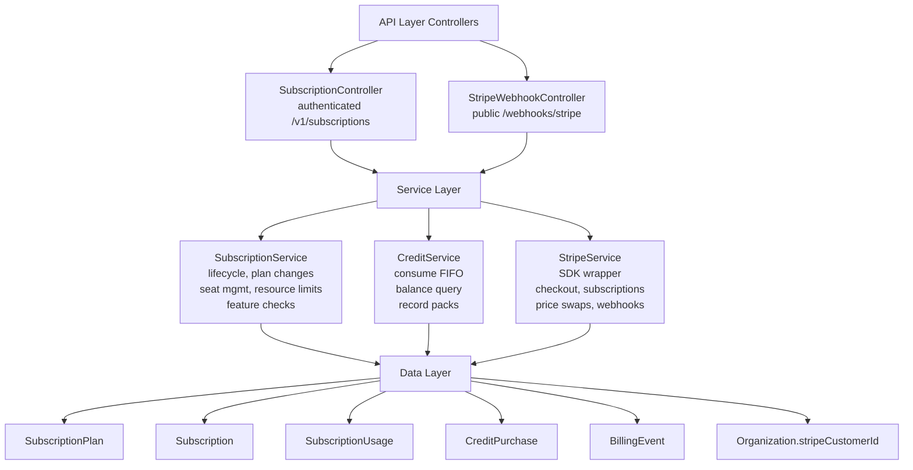
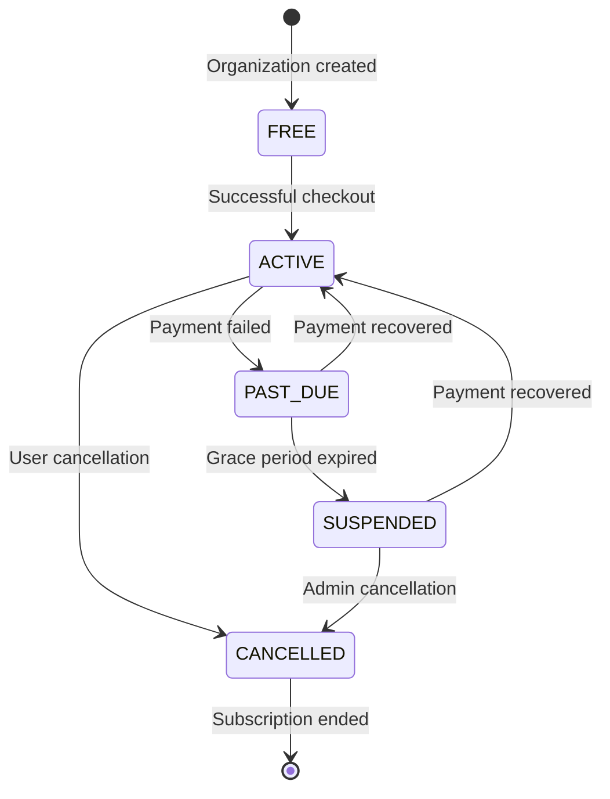

# Subscription Module Specification v21

<Info>
**Status:** Active — fully implemented  
**Module Path:** `src/modules/subscription/`  
**Payment Gateway:** Stripe
</Info>

## Overview

The Subscription Module implements a **freemium SaaS billing system** for PropWise CRM. Every organization has a subscription tied to one of four plan tiers. The module handles:

- **Plan-based feature gating** — binary feature flags per tier
- **Resource limits** — caps on leads, contacts, deals, companies, and storage
- **Credit-based metering** — monthly AI and messaging allowances with purchasable top-ups
- **Dual seat types** — manager seats and agent seats with per-tier pricing; every user consumes a seat
- **Stripe integration** — checkout, subscription management, mid-cycle plan changes, webhooks, billing portal
- **Free organization ownership cap** — one user may own at most 2 active Free-plan organizations
- **Proration** — mid-cycle upgrades, downgrades, and seat changes are prorated to the day
- **Suspension flow** — 2-day grace period on payment failure, then org goes read-only

### Design Principles

| Principle | Decision |
|-----------|----------|
| Freemium model | Free plan with limited features; paid tiers unlock progressively |
| Per-org billing | Billing is per organization; developer portal is free |
| Dual seat types | Manager seats (Owner, Admin) and agent seats (Basic, custom roles); every user consumes a seat |
| Seat type derived from role | No explicit seat assignment — seat type is automatically determined by the user's RBAC role |
| Feature flags over tier checks | Gating uses `@RequiresFeature('flag')` on plan JSONB — changing what a tier includes requires only a seeder update, not code changes |
| Service-layer limit enforcement | Resource limits and credit consumption are checked in service methods, not guards, because they need entity counts |
| Free-org creation protection | `POST /v1/organizations` locks the owner row, counts owned Free-plan orgs (missing subscription rows count as Free), and rejects the third active free workspace |
| Stripe as source of truth for payments | Webhook-driven lifecycle: the app reacts to Stripe events rather than polling |
| Prorated plan changes | All mid-cycle changes (upgrade, downgrade, add/remove seats) use `proration_behavior: 'create_prorations'` — charges are fair to the day |
| Checkout vs. change-plan separation | `POST /checkout` is for first-time subscription (Free → Paid); `POST /change-plan` is for switching between paid tiers |
| Idempotent webhooks | Every Stripe event is logged in `BillingEvent` with a unique `stripeEventId` to prevent duplicate processing |
| Graceful degradation | If `app.stripe.secretKey` (`STRIPE_SECRET_KEY`) is not set, billing features are unavailable but the app still starts |

## Architecture

### High-Level Diagram



### Data Flow

<Tabs>
<Tab title="First-time Checkout">
<Steps>
<Step title="User initiates upgrade">
Frontend "Upgrade" button → `POST /v1/subscriptions/checkout`
</Step>

<Step title="Validation">
Rejects if org already has a Stripe subscription (use change-plan instead)
</Step>

<Step title="Create checkout session">
`SubscriptionService.createCheckoutSession()` → `StripeService.createCheckoutSession()` → Returns Stripe Checkout URL
</Step>

<Step title="Payment processing">
User pays on Stripe's hosted page → Stripe redirects to success URL with `session_id={CHECKOUT_SESSION_ID}`
</Step>

<Step title="Confirmation">
Frontend `POST /v1/subscriptions/checkout/confirm { sessionId }` → `SubscriptionService.fulfillCheckoutSession()` (idempotent with webhook)
</Step>

<Step title="Activation">
Subscription entity updated to ACTIVE (plan tier from session metadata)
</Step>

<Step title="Webhook processing">
(async) Stripe fires `checkout.session.completed` webhook → `StripeWebhookController` → `activateSubscription()` (same activation path)
</Step>
</Steps>
</Tab>

<Tab title="Plan Changes">
<Steps>
<Step title="Initiate change">
Frontend "Change Plan" button → `POST /v1/subscriptions/change-plan`
</Step>

<Step title="Validation">
`SubscriptionService.changePlan()` validates seat overflow (blocks if current users exceed new plan capacity)
</Step>

<Step title="Stripe update">
`StripeService.swapSubscriptionPrice()` — prorated
</Step>

<Step title="Seat reconciliation">
Reconciles seat line items (old tier price → new tier price)
</Step>

<Step title="Local update">
Updates local Subscription entity and returns updated subscription immediately
</Step>
</Steps>
</Tab>

<Tab title="Payment Failures">
<Steps>
<Step title="Renewal attempt">
Stripe charges renewal invoice
</Step>

<Step title="Success path">
`invoice.paid` → `handleInvoicePaid()` → status stays ACTIVE, period updated
</Step>

<Step title="Failure path">
`invoice.payment_failed` → `handleInvoicePaymentFailed()` → status → PAST_DUE
</Step>

<Step title="Grace period">
Stripe retries for 2 days
</Step>

<Step title="Recovery or suspension">
- Payment succeeds → `invoice.paid` → back to ACTIVE
- All retries fail → `customer.subscription.updated` (status: unpaid) → `handleSubscriptionUpdated()` → status → SUSPENDED → Org is read-only (`SubscriptionActiveGuard` blocks writes)
</Step>
</Steps>
</Tab>
</Tabs>

## Plan Tiers & Pricing

<CardGroup cols={2}>
<Card title="Pricing Structure" icon="dollar-sign">
Four tiers, priced in USD cents with annual discounts
</Card>
<Card title="Seat Management" icon="users">
Dual seat types with role-based assignment
</Card>
</CardGroup>

### Pricing Table

| | **Free** | **Starter** | **Professional** | **Business** |
|--|----------|-------------|------------------|--------------|
| Monthly price | $0 | $49 | $149 | $399 |
| Annual price | $0 | $470.40 (~20% off) | $1,430.40 | $3,830.40 |
| Manager seats included | 1 | 2 | 5 | 10 |
| Agent seats included | 0 | 3 | 15 | 40 |
| Extra manager seat | — | $25/mo | $20/mo | $18/mo |
| Extra agent seat | — | $12/mo | $10/mo | $8/mo |

### Resource Limits

| Resource | Free | Starter | Professional | Business |
|----------|------|---------|--------------|----------|
| Leads | 50 | 1,000 | 10,000 | Unlimited |
| Contacts | 50 | 1,000 | 10,000 | Unlimited |
| Deals | 20 | 500 | 5,000 | Unlimited |
| Companies | 10 | 200 | 2,000 | Unlimited |
| Storage | 500 MB | 5 GB | 25 GB | 100 GB |

### Free Organization Ownership Limit

<Warning>
Each user may own **2 active Free-plan organizations**. The cap applies only to organizations where the user is the owner; invited/member workspaces do not count against the owner's create quota.
</Warning>

An organization counts as Free only when its `subscription` row's plan tier is `FREE`. Every organization must have exactly one subscription row:

- `ProvisioningService` creates a FREE subscription at org creation
- `Migration20260526170000_BackfillMissingOrganizationSubscriptions` backfills legacy gaps
- `SubscriptionService.ensureFreeSubscriptionsForOrganizationsInTransaction()` self-heals any remaining missing rows

<Note>
Missing subscription rows are **not** silently treated as Free for the ownership cap. To create another organization after reaching the cap, the owner must delete one of their free organizations or upgrade one to a paid plan.
</Note>

Backend enforcement lives in `OrganizationService.create()` and calls `SubscriptionService.getFreeOrganizationOwnershipLimitStatusInTransaction()` inside the same bypass transaction.

When the cap is reached, `POST /v1/organizations` returns **400** with:

```json
{
  "errorCode": "FREE_ORGANIZATION_LIMIT_REACHED",
  "message": "Human-readable copy (includes the numeric limit)",
  "limit": 2,
  "currentCount": 2
}
```

<Tip>
Clients should key off `errorCode` and `limit` rather than parsing `message`.
</Tip>

## Feature Gating Model

The subscription module uses a feature flag system to control access to functionality based on plan tiers.

### Feature Flags

Each `SubscriptionPlan` entity contains a `features` JSONB column with boolean flags:

```typescript
interface PlanFeatures {
  advanced_analytics: boolean;
  api_access: boolean;
  custom_fields: boolean;
  email_templates: boolean;
  integrations: boolean;
  priority_support: boolean;
  white_label: boolean;
  // ... additional features
}
```

### Implementation

<CodeGroup>
```typescript Guard Decorator
@RequiresFeature('advanced_analytics')
@Get('/analytics/advanced')
async getAdvancedAnalytics() {
  // This endpoint is only accessible if the org's plan includes advanced_analytics
}
```

```typescript Service Check
async generateReport(orgId: string) {
  const hasFeature = await this.subscriptionService.hasFeature(orgId, 'advanced_analytics');
  if (!hasFeature) {
    throw new ForbiddenException('Advanced analytics not available on current plan');
  }
  // ... generate report
}
```
</CodeGroup>

## Seat Management

### Seat Types

<AccordionGroup>
<Accordion title="Manager Seats">
- **Roles:** Owner, Admin
- **Pricing:** Higher cost per seat
- **Capabilities:** Full administrative access
- **Auto-assignment:** Users with Owner or Admin roles automatically consume manager seats
</Accordion>

<Accordion title="Agent Seats">
- **Roles:** Basic, custom roles (non-admin)
- **Pricing:** Lower cost per seat
- **Capabilities:** Standard user access
- **Auto-assignment:** Users with Basic or custom non-admin roles automatically consume agent seats
</Accordion>
</AccordionGroup>

### Seat Calculation

```typescript
// Seat type is derived from user role, not explicitly assigned
const seatType = user.role.name === 'Owner' || user.role.name === 'Admin' 
  ? 'manager' 
  : 'agent';

// Billing adjusts automatically when users are added/removed or roles change
```

<Note>
Every user consumes exactly one seat. Seat type is automatically determined by the user's RBAC role and cannot be manually assigned.
</Note>

## Credit System

The credit system provides monthly allowances for AI operations and messaging, with the ability to purchase additional credits.

### Credit Types

| Credit Type | Free | Starter | Professional | Business |
|-------------|------|---------|--------------|----------|
| AI credits | 10 | 100 | 500 | 2,000 |
| Message credits | 50 | 500 | 2,000 | 10,000 |

### Credit Consumption

<Steps>
<Step title="FIFO consumption">
Credits are consumed using First-In-First-Out logic, prioritizing monthly allowances before purchased credits
</Step>

<Step title="Balance tracking">
`CreditService` tracks remaining balances and consumption history
</Step>

<Step title="Purchase handling">
Additional credits can be purchased and are tracked in `CreditPurchase` entities
</Step>

<Step title="Monthly reset">
Monthly allowances reset at the beginning of each billing period
</Step>
</Steps>

## Entity Specifications

### SubscriptionPlan

```typescript
@Entity()
export class SubscriptionPlan {
  @PrimaryKey()
  id: string;

  @Property()
  name: string; // 'Free', 'Starter', 'Professional', 'Business'

  @Property()
  tier: PlanTier; // Enum: FREE, STARTER, PROFESSIONAL, BUSINESS

  @Property()
  monthlyPrice: number; // USD cents

  @Property()
  annualPrice: number; // USD cents

  @Property({ type: 'json' })
  features: PlanFeatures; // JSONB feature flags

  @Property({ type: 'json' })
  limits: PlanLimits; // Resource limits

  @Property({ type: 'json' })
  credits: PlanCredits; // Monthly credit allowances

  @Property()
  managerSeatsIncluded: number;

  @Property()
  agentSeatsIncluded: number;

  @Property()
  extraManagerSeatPrice: number; // USD cents

  @Property()
  extraAgentSeatPrice: number; // USD cents
}
```

### Subscription

```typescript
@Entity()
export class Subscription {
  @PrimaryKey()
  id: string;

  @OneToOne(() => Organization)
  organization: Organization;

  @ManyToOne(() => SubscriptionPlan)
  plan: SubscriptionPlan;

  @Property()
  status: SubscriptionStatus; // ACTIVE, PAST_DUE, SUSPENDED, CANCELLED

  @Property({ nullable: true })
  stripeSubscriptionId?: string;

  @Property({ nullable: true })
  stripeCustomerId?: string;

  @Property({ nullable: true })
  currentPeriodStart?: Date;

  @Property({ nullable: true })
  currentPeriodEnd?: Date;

  @Property({ default: 0 })
  extraManagerSeats: number;

  @Property({ default: 0 })
  extraAgentSeats: number;
}
```

### CreditPurchase

```typescript
@Entity()
export class CreditPurchase {
  @PrimaryKey()
  id: string;

  @ManyToOne(() => Organization)
  organization: Organization;

  @Property()
  creditType: CreditType; // AI_CREDITS, MESSAGE_CREDITS

  @Property()
  amount: number;

  @Property()
  remaining: number;

  @Property()
  purchasedAt: Date;

  @Property({ nullable: true })
  expiresAt?: Date;

  @Property({ nullable: true })
  stripePaymentIntentId?: string;
}
```

## Stripe Integration

### Configuration

<CodeGroup>
```env Environment Variables
STRIPE_SECRET_KEY=sk_test_...
STRIPE_WEBHOOK_SECRET=whsec_...
STRIPE_PUBLISHABLE_KEY=pk_test_...
```

```typescript Configuration
@Module({
  imports: [
    ConfigModule.forRoot(),
    // Graceful degradation if Stripe keys not provided
  ],
  providers: [
    {
      provide: 'STRIPE_CLIENT',
      useFactory: (configService: ConfigService) => {
        const secretKey = configService.get('STRIPE_SECRET_KEY');
        return secretKey ? new Stripe(secretKey, { apiVersion: '2023-10-16' }) : null;
      },
      inject: [ConfigService],
    },
  ],
})
export class SubscriptionModule {}
```
</CodeGroup>

### Webhook Events

<AccordionGroup>
<Accordion title="checkout.session.completed">
Handles successful first-time subscriptions (Free → Paid)
- Creates or updates subscription record
- Sets status to ACTIVE
- Records billing period
</Accordion>

<Accordion title="customer.subscription.updated">
Handles subscription changes
- Plan upgrades/downgrades
- Status changes (active, past_due, unpaid)
- Billing period updates
</Accordion>

<Accordion title="invoice.paid">
Confirms successful payments
- Updates subscription status to ACTIVE
- Records new billing period
- Resets monthly credits
</Accordion>

<Accordion title="invoice.payment_failed">
Handles failed payments
- Sets subscription status to PAST_DUE
- Starts grace period
- Triggers retry logic
</Accordion>
</AccordionGroup>

### Idempotent Processing

All webhook events are logged in `BillingEvent` with unique `stripeEventId` to prevent duplicate processing:

```typescript
async processWebhook(event: Stripe.Event) {
  // Check if already processed
  const existingEvent = await this.billingEventRepository.findOne({
    stripeEventId: event.id
  });
  
  if (existingEvent) {
    return; // Already processed, skip
  }
  
  // Process event and log
  await this.handleEvent(event);
  
  const billingEvent = new BillingEvent();
  billingEvent.stripeEventId = event.id;
  billingEvent.eventType = event.type;
  billingEvent.processedAt = new Date();
  
  await this.billingEventRepository.persistAndFlush(billingEvent);
}
```

## Subscription Lifecycle

### States



### Status Descriptions

| Status | Description | Access Level |
|--------|-------------|--------------|
| `FREE` | Default state, no Stripe subscription | Limited features per Free plan |
| `ACTIVE` | Paid subscription in good standing | Full plan features |
| `PAST_DUE` | Payment failed, in grace period | Full access (2-day grace) |
| `SUSPENDED` | Grace period expired | Read-only access |
| `CANCELLED` | User cancelled subscription | Read-only access |

## Plan Changes (Upgrade / Downgrade)

### Validation Rules

<Warning>
Plan changes are blocked if the new plan's seat limits would be exceeded by current user count.
</Warning>

<Steps>
<Step title="Seat overflow check">
Count current manager and agent users, compare against new plan limits
</Step>

<Step title="Proration calculation">
Stripe automatically prorates charges for mid-cycle changes
</Step>

<Step title="Immediate update">
Local subscription entity is updated immediately after successful Stripe call
</Step>

<Step title="Webhook confirmation">
Stripe webhook confirms the change asynchronously
</Step>
</Steps>

### Proration Logic

All mid-cycle changes use `proration_behavior: 'create_prorations'`:

```typescript
await stripe.subscriptions.update(subscriptionId, {
  items: [
    {
      id: currentSubscriptionItem.id,
      price: newPlanPriceId,
    }
  ],
  proration_behavior: 'create_prorations',
  // Charges/credits are calculated to the day
});
```

## API Endpoints

### Subscription Management

<CodeGroup>
```http Get Current Subscription
GET /v1/subscriptions/current
Authorization: Bearer {token}

Response:
{
  "id": "sub_123",
  "planId": "plan_starter",
  "status": "ACTIVE",
  "currentPeriodStart": "2024-01-01T00:00:00Z",
  "currentPeriodEnd": "2024-02-01T00:00:00Z",
  "extraManagerSeats": 2,
  "extraAgentSeats": 5
}
```

```http Create Checkout Session
POST /v1/subscriptions/checkout
Authorization: Bearer {token}
Content-Type: application/json

{
  "planId": "plan_starter",
  "billingPeriod": "monthly"
}

Response:
{
  "checkoutUrl": "https://checkout.stripe.com/c/pay/..."
}
```

```http Change Plan
POST /v1/subscriptions/change-plan
Authorization: Bearer {token}
Content-Type: application/json

{
  "newPlanId": "plan_professional",
  "extraManagerSeats": 3,
  "extraAgentSeats": 10
}

Response:
{
  "subscription": { /* updated subscription */ },
  "prorationAmount": 2500 // USD cents
}
```
</CodeGroup>

### Credit Management

<CodeGroup>
```http Get Credit Balance
GET /v1/subscriptions/credits
Authorization: Bearer {token}

Response:
{
  "aiCredits": {
    "monthly": 450,
    "purchased": 100,
    "total": 550
  },
  "messageCredits": {
    "monthly": 1800,
    "purchased": 0,
    "total": 1800
  }
}
```

```http Purchase Credits
POST /v1/subscriptions/credits/purchase
Authorization: Bearer {token}
Content-Type: application/json

{
  "creditType": "AI_CREDITS",
  "amount": 500
}

Response:
{
  "paymentIntentId": "pi_...",
  "clientSecret": "pi_..._secret_..."
}
```
</CodeGroup>

## Guards & Decorators

### Feature Requirement Guard

```typescript
@Injectable()
export class RequiresFeatureGuard implements CanActivate {
  constructor(
    private reflector: Reflector,
    private subscriptionService: SubscriptionService,
  ) {}

  async canActivate(context: ExecutionContext): Promise<boolean> {
    const requiredFeature = this.reflector.get<string>(
      'requiredFeature',
      context.getHandler(),
    );

    if (!requiredFeature) {
      return true; // No feature requirement
    }

    const request = context.switchToHttp().getRequest();
    const orgId = request.user.currentOrganizationId;

    return this.subscriptionService.hasFeature(orgId, requiredFeature);
  }
}

// Usage decorator
export const RequiresFeature = (feature: string) =>
  SetMetadata('requiredFeature', feature);
```

### Subscription Active Guard

```typescript
@Injectable()
export class SubscriptionActiveGuard implements CanActivate {
  constructor(private subscriptionService: SubscriptionService) {}

  async canActivate(context: ExecutionContext): Promise<boolean> {
    const request = context.switchToHttp().getRequest();
    const orgId = request.user.currentOrganizationId;

    const subscription = await this.subscriptionService.findByOrganizationId(orgId);
    
    // Allow read operations, block writes for suspended/cancelled
    const isWriteOperation = ['POST', 'PUT', 'PATCH', 'DELETE'].includes(
      request.method,
    );

    if (isWriteOperation && ['SUSPENDED', 'CANCELLED'].includes(subscription.status)) {
      throw new ForbiddenException('Organization subscription is not active');
    }

    return true;
  }
}
```

## Enforcement Points

### Resource Limits

Resource limits are enforced at the service layer:

```typescript
async createLead(orgId: string, leadData: CreateLeadDto) {
  // Check lead limit before creation
  await this.subscriptionService.checkResourceLimit(orgId, 'leads');
  
  const lead = new Lead();
  // ... populate lead data
  
  await this.leadRepository.persistAndFlush(lead);
  
  // Update usage counter
  await this.subscriptionService.incrementUsage(orgId, 'leads');
  
  return lead;
}
```

### Credit Consumption

```typescript
async generateAIInsight(orgId: string, prompt: string) {
  // Check and consume AI credits
  const hasCredits = await this.creditService.consumeCredits(
    orgId, 
    'AI_CREDITS', 
    1
  );
  
  if (!hasCredits) {
    throw new ForbiddenException('Insufficient AI credits');
  }
  
  // Proceed with AI operation
  return this.aiService.generateInsight(prompt);
}
```

## Plan Seeder

The plan seeder creates the four subscription plans with their features and limits:

```typescript
export class SubscriptionPlanSeeder {
  async run() {
    const plans = [
      {
        name: 'Free',
        tier: PlanTier.FREE,
        monthlyPrice: 0,
        annualPrice: 0,
        features: {
          advanced_analytics: false,
          api_access: false,
          custom_fields: false,
          email_templates: true,
          integrations: false,
          priority_support: false,
          white_label: false,
        },
        limits: {
          leads: 50,
          contacts: 50,
          deals: 20,
          companies: 10,
          storage: 524288000, // 500 MB in bytes
        },
        credits: {
          aiCredits: 10,
          messageCredits: 50,
        },
        managerSeatsIncluded: 1,
        agentSeatsIncluded: 0,
        extraManagerSeatPrice: 0,
        extraAgentSeatPrice: 0,
      },
      // ... other plans
    ];

    for (const planData of plans) {
      const plan = new SubscriptionPlan();
      Object.assign(plan, planData);
      this.em.persist(plan);
    }

    await this.em.flush();
  }
}
```

## Module Structure

```
src/modules/subscription/
├── controllers/
│   ├── subscription.controller.ts
│   └── stripe-webhook.controller.ts
├── services/
│   ├── subscription.service.ts
│   ├── credit.service.ts
│   └── stripe.service.ts
├── entities/
│   ├── subscription-plan.entity.ts
│   ├── subscription.entity.ts
│   ├── subscription-usage.entity.ts
│   ├── credit-purchase.entity.ts
│   └── billing-event.entity.ts
├── guards/
│   ├── requires-feature.guard.ts
│   └── subscription-active.guard.ts
├── decorators/
│   └── requires-feature.decorator.ts
├── dtos/
│   ├── create-checkout-session.dto.ts
│   ├── change-plan.dto.ts
│   └── purchase-credits.dto.ts
├── enums/
│   ├── plan-tier.enum.ts
│   ├── subscription-status.enum.ts
│   └── credit-type.enum.ts
├── interfaces/
│   ├── plan-features.interface.ts
│   ├── plan-limits.interface.ts
│   └── plan-credits.interface.ts
├── utils/
│   └── stripe-time.util.ts
├── seeders/
│   └── subscription-plan.seeder.ts
└── subscription.module.ts
```

## Environment Configuration

<CodeGroup>
```env Required Variables
# Stripe Configuration
STRIPE_SECRET_KEY=sk_live_... # or sk_test_... for testing
STRIPE_WEBHOOK_SECRET=whsec_...
STRIPE_PUBLISHABLE_KEY=pk_live_... # or pk_test_... for testing

# Plan Configuration
MAX_FREE_ORGANIZATIONS_PER_USER=2

# URLs
STRIPE_SUCCESS_URL=https://app.propwise.ai/billing/success
STRIPE_CANCEL_URL=https://app.propwise.ai/billing/cancelled
```

```typescript Config Validation
@Injectable()
export class SubscriptionConfigService {
  constructor(private configService: ConfigService) {}

  get stripeSecretKey(): string | null {
    return this.configService.get<string>('STRIPE_SECRET_KEY') || null;
  }

  get isStripeEnabled(): boolean {
    return !!this.stripeSecretKey;
  }

  get maxFreeOrgsPerUser(): number {
    return this.configService.get<number>('MAX_FREE_ORGANIZATIONS_PER_USER', 2);
  }
}
```
</CodeGroup>

## Integration with Other Modules

<CardGroup cols={2}>
<Card title="Organization Module" icon="building">
- Subscription creation during org provisioning
- Free org ownership limits
- Read-only enforcement for suspended orgs
</Card>

<Card title="User Module" icon="user">
- Seat consumption based on user roles
- Automatic seat type assignment
- Role change seat reconciliation
</Card>

<Card title="RBAC Module" icon="shield">
- Feature flag enforcement
- Permission-based seat types
- Guard integration
</Card>

<Card title="Analytics Module" icon="chart-line">
- Usage tracking for resource limits
- Credit consumption monitoring
- Billing event analytics
</Card>
</CardGroup>

### Key Integration Points

<AccordionGroup>
<Accordion title="Organization Creation">
```typescript
// In OrganizationService.create()
await this.subscriptionService.getFreeOrganizationOwnershipLimitStatusInTransaction();
await this.provisioningService.createFreeSubscription(organization);
```
</Accordion>

<Accordion title="User Management">
```typescript
// When users are added/removed or roles change
await this.subscriptionService.reconcileSeats(organizationId);
```
</Accordion>

<Accordion title="Resource Creation">
```typescript
// Before creating leads, contacts, deals, etc.
await this.subscriptionService.checkResourceLimit(orgId, resourceType);
await this.subscriptionService.incrementUsage(orgId, resourceType);
```
</Accordion>

<Accordion title="Feature Access">
```typescript
// On feature-gated endpoints
@RequiresFeature('advanced_analytics')
@SubscriptionActive()
@Get('/analytics/advanced')
async getAdvancedAnalytics() {
  // Implementation
}
```
</Accordion>
</AccordionGroup>

<Note>
The subscription module integrates deeply with the application's core functionality, providing both hard limits (resource caps) and soft gates (feature flags) to enforce the freemium business model.
</Note>