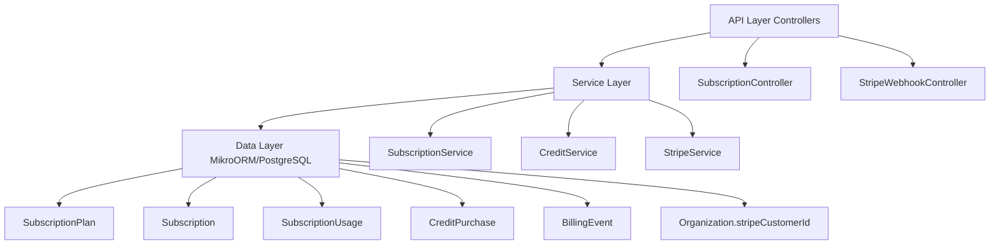

## Overview

The Subscription Module implements a **freemium SaaS billing system** for PropWise CRM. Every organization has a subscription tied to one of four plan tiers. The module handles:

- **Plan-based feature gating** — binary feature flags per tier
- **Resource limits** — caps on leads, contacts, deals, companies, and storage
- **Credit-based metering** — monthly AI and messaging allowances with purchasable top-ups
- **Dual seat types** — manager seats and agent seats with per-tier pricing; every user consumes a seat
- **Stripe integration** — checkout, subscription management, mid-cycle plan changes, webhooks, billing portal
- **Free organization ownership cap** — one user may own at most 2 active Free-plan organizations
- **Proration** — mid-cycle upgrades, downgrades, and seat changes are prorated to the day
- **Suspension flow** — 2-day grace period on payment failure, then org goes read-only

<Note>
**Module Path:** `src/modules/subscription/`  
**Payment Gateway:** Stripe  
**Status:** Active — fully implemented
</Note>

### Design Principles

| Principle | Decision |
|-----------|----------|
| Freemium model | Free plan with limited features; paid tiers unlock progressively |
| Per-org billing | Billing is per organization; developer portal is free |
| Dual seat types | Manager seats (Owner, Admin) and agent seats (Basic, custom roles); every user consumes a seat |
| Seat type derived from role | No explicit seat assignment — seat type is automatically determined by the user's RBAC role |
| Feature flags over tier checks | Gating uses `@RequiresFeature('flag')` on plan JSONB — changing what a tier includes requires only a seeder update, not code changes |
| Service-layer limit enforcement | Resource limits and credit consumption are checked in service methods, not guards, because they need entity counts |
| Free-org creation protection | `POST /v1/organizations` locks the owner row, counts owned Free-plan orgs (missing subscription rows count as Free), and rejects the third active free workspace |
| Stripe as source of truth for payments | Webhook-driven lifecycle: the app reacts to Stripe events rather than polling |
| Prorated plan changes | All mid-cycle changes (upgrade, downgrade, add/remove seats) use `proration_behavior: 'create_prorations'` — charges are fair to the day |
| Checkout vs. change-plan separation | `POST /checkout` is for first-time subscription (Free → Paid); `POST /change-plan` is for switching between paid tiers |
| Idempotent webhooks | Every Stripe event is logged in `BillingEvent` with a unique `stripeEventId` to prevent duplicate processing |
| Graceful degradation | If `app.stripe.secretKey` (`STRIPE_SECRET_KEY`) is not set, billing features are unavailable but the app still starts |

## Architecture

### High-Level Diagram



### Data Flow

<Tabs>
<Tab title="First-time Checkout (Free → Paid)">

<Steps>
<Step title="User clicks upgrade">
Frontend "Upgrade" button triggers `POST /v1/subscriptions/checkout`
</Step>

<Step title="Create checkout session">
- Rejects if org already has a Stripe subscription (use change-plan instead)
- `SubscriptionService.createCheckoutSession()` calls `StripeService.createCheckoutSession()`
- Returns Stripe Checkout URL
</Step>

<Step title="Payment processing">
- User pays on Stripe's hosted page
- Stripe redirects to success URL with `session_id={CHECKOUT_SESSION_ID}`
</Step>

<Step title="Confirm subscription">
- Frontend calls `POST /v1/subscriptions/checkout/confirm { sessionId }`
- `SubscriptionService.fulfillCheckoutSession()` (idempotent with webhook)
- Subscription entity updated to ACTIVE (plan tier from session metadata)
</Step>

<Step title="Webhook confirmation">
Stripe fires `checkout.session.completed` webhook → `StripeWebhookController` → `activateSubscription()`
</Step>
</Steps>

</Tab>

<Tab title="Mid-cycle Plan Change (Paid → Paid)">

<Steps>
<Step title="Initiate plan change">
Frontend "Change Plan" button triggers `POST /v1/subscriptions/change-plan`
</Step>

<Step title="Validate and process">
- `SubscriptionService.changePlan()` validates seat overflow
- Blocks if current users exceed new plan capacity
</Step>

<Step title="Update Stripe subscription">
- `StripeService.swapSubscriptionPrice()` with proration
- Reconciles seat line items (old tier price → new tier price)
</Step>

<Step title="Update local data">
- Updates local Subscription entity
- Returns updated subscription immediately
</Step>
</Steps>

</Tab>

<Tab title="Payment Failure Flow">

<Steps>
<Step title="Initial failure">
Stripe charges renewal invoice → `invoice.payment_failed` → `handleInvoicePaymentFailed()` → status becomes `PAST_DUE`
</Step>

<Step title="Retry period">
Stripe retries for 2 days
</Step>

<Step title="Resolution">
- **Payment succeeds:** `invoice.paid` → back to `ACTIVE`
- **All retries fail:** `customer.subscription.updated` (status: unpaid) → `handleSubscriptionUpdated()` → status becomes `SUSPENDED`
</Step>

<Step title="Read-only mode">
Suspended org becomes read-only (`SubscriptionActiveGuard` blocks writes)
</Step>
</Steps>

</Tab>
</Tabs>

## Plan Tiers & Pricing

<CardGroup cols={2}>
<Card title="Free" icon="gift">
- **Monthly:** $0
- **Annual:** $0
- **Manager seats:** 1 included
- **Agent seats:** 0 included
</Card>

<Card title="Starter" icon="rocket">
- **Monthly:** $49
- **Annual:** $470.40 (~20% off)
- **Manager seats:** 2 included
- **Agent seats:** 3 included
</Card>

<Card title="Professional" icon="briefcase">
- **Monthly:** $149
- **Annual:** $1,430.40
- **Manager seats:** 5 included
- **Agent seats:** 15 included
</Card>

<Card title="Business" icon="building">
- **Monthly:** $399
- **Annual:** $3,830.40
- **Manager seats:** 10 included
- **Agent seats:** 40 included
</Card>
</CardGroup>

### Additional Seat Pricing

| Plan | Extra Manager Seat | Extra Agent Seat |
|------|-------------------|------------------|
| Starter | $25/mo | $12/mo |
| Professional | $20/mo | $10/mo |
| Business | $18/mo | $8/mo |

### Resource Limits

| Resource | Free | Starter | Professional | Business |
|----------|------|---------|--------------|----------|
| Leads | 50 | 1,000 | 10,000 | Unlimited |
| Contacts | 50 | 1,000 | 10,000 | Unlimited |
| Deals | 20 | 500 | 5,000 | Unlimited |
| Companies | 10 | 200 | 2,000 | Unlimited |
| Storage | 500 MB | 5 GB | 25 GB | 100 GB |

### Free Organization Ownership Limit

<Warning>
Each user may own **2 active Free-plan organizations**. The cap applies only to organizations where the user is the owner; invited/member workspaces do not count against the owner's create quota.
</Warning>

An organization counts as Free only when its `subscription` row's plan tier is `FREE`. Every organization must have exactly one subscription row:

- `ProvisioningService` creates a FREE subscription at org creation
- `Migration20260526170000_BackfillMissingOrganizationSubscriptions` backfills legacy gaps
- `SubscriptionService.ensureFreeSubscriptionsForOrganizationsInTransaction()` self-heals any remaining missing rows

<Info>
Missing rows are **not** silently treated as Free for the ownership cap. To create another organization after reaching the cap, the owner must delete one of their free organizations or upgrade one to a paid plan.
</Info>

When the cap is reached, `POST /v1/organizations` returns **400** with:

| Field | Value |
|-------|--------|
| `errorCode` | `FREE_ORGANIZATION_LIMIT_REACHED` |
| `message` | Human-readable copy (includes the numeric limit) |
| `limit` | `2` (from `MAX_FREE_ORGANIZATIONS_PER_USER`) |
| `currentCount` | Owner's active Free-plan org count at check time |

## Feature Gating Model

<Note>
Feature gating uses `@RequiresFeature('flag')` decorator on plan JSONB. Changing what a tier includes requires only a seeder update, not code changes.
</Note>

### Implementation

```typescript
@RequiresFeature('ADVANCED_ANALYTICS')
async getAdvancedAnalytics() {
  // Method only accessible if current org's plan includes this feature
}
```

### Feature Flags by Plan

<AccordionGroup>
<Accordion title="Free Plan Features">
- Basic CRM functionality
- Limited reporting
- Standard integrations
</Accordion>

<Accordion title="Starter Plan Features">
- All Free features plus:
- Advanced reporting
- Email sequences
- Pipeline automation
</Accordion>

<Accordion title="Professional Plan Features">
- All Starter features plus:
- Custom fields
- Advanced integrations
- Team management
- API access
</Accordion>

<Accordion title="Business Plan Features">
- All Professional features plus:
- White-label options
- Advanced security
- Priority support
- Custom reporting
</Accordion>
</AccordionGroup>

## Credit System

The credit system provides metered usage for AI and messaging features with monthly allowances and purchasable top-ups.

### Credit Types

| Credit Type | Free | Starter | Professional | Business |
|-------------|------|---------|--------------|----------|
| AI credits | 10 | 100 | 500 | 2,000 |
| Messaging credits | 0 | 50 | 200 | 1,000 |

### Credit Consumption

<Tabs>
<Tab title="FIFO Consumption">
Credits are consumed in First-In-First-Out order:
1. Monthly allowance credits (oldest first)
2. Purchased credit packs (by purchase date)
3. Bonus/promotional credits
</Tab>

<Tab title="Balance Queries">
The `CreditService` provides real-time balance checking:

```typescript
async getCreditBalance(organizationId: string, creditType: CreditType) {
  // Returns available credits across all sources
}
```
</Tab>

<Tab title="Top-up Purchases">
Organizations can purchase additional credit packs:
- AI Credit Pack (100 credits): $10
- Messaging Credit Pack (500 credits): $25
- Enterprise Pack (1000 AI + 2000 messaging): $75
</Tab>
</Tabs>

## Entity Specifications

### SubscriptionPlan

```sql
CREATE TABLE subscription_plans (
  id UUID PRIMARY KEY,
  name VARCHAR NOT NULL,
  tier subscription_tier NOT NULL,
  monthly_price_cents INTEGER NOT NULL,
  annual_price_cents INTEGER NOT NULL,
  manager_seats_included INTEGER NOT NULL,
  agent_seats_included INTEGER NOT NULL,
  manager_seat_price_cents INTEGER NOT NULL,
  agent_seat_price_cents INTEGER NOT NULL,
  features JSONB NOT NULL,
  resource_limits JSONB NOT NULL,
  credit_allowances JSONB NOT NULL,
  stripe_monthly_price_id VARCHAR,
  stripe_annual_price_id VARCHAR,
  is_active BOOLEAN DEFAULT true,
  created_at TIMESTAMP DEFAULT now(),
  updated_at TIMESTAMP DEFAULT now()
);
```

### Subscription

```sql
CREATE TABLE subscriptions (
  id UUID PRIMARY KEY,
  organization_id UUID NOT NULL REFERENCES organizations(id),
  plan_id UUID NOT NULL REFERENCES subscription_plans(id),
  status subscription_status NOT NULL,
  stripe_subscription_id VARCHAR,
  stripe_customer_id VARCHAR,
  billing_cycle subscription_billing_cycle,
  current_period_start TIMESTAMP,
  current_period_end TIMESTAMP,
  trial_end TIMESTAMP,
  canceled_at TIMESTAMP,
  manager_seats INTEGER NOT NULL DEFAULT 0,
  agent_seats INTEGER NOT NULL DEFAULT 0,
  created_at TIMESTAMP DEFAULT now(),
  updated_at TIMESTAMP DEFAULT now()
);
```

### CreditPurchase

```sql
CREATE TABLE credit_purchases (
  id UUID PRIMARY KEY,
  organization_id UUID NOT NULL REFERENCES organizations(id),
  credit_type credit_type NOT NULL,
  amount INTEGER NOT NULL,
  remaining_amount INTEGER NOT NULL,
  stripe_payment_intent_id VARCHAR,
  purchased_at TIMESTAMP DEFAULT now(),
  expires_at TIMESTAMP,
  created_at TIMESTAMP DEFAULT now(),
  updated_at TIMESTAMP DEFAULT now()
);
```

## Stripe Integration

### Checkout Session Creation

<CodeGroup>
```typescript StripeService.createCheckoutSession()
async createCheckoutSession(params: {
  organizationId: string;
  planId: string;
  billingCycle: 'monthly' | 'annual';
  managerSeats: number;
  agentSeats: number;
  successUrl: string;
  cancelUrl: string;
}) {
  const session = await this.stripe.checkout.sessions.create({
    mode: 'subscription',
    customer: stripeCustomerId,
    line_items: [
      {
        price: plan.stripe_monthly_price_id,
        quantity: 1,
      },
      // Additional seat line items...
    ],
    metadata: {
      organizationId: params.organizationId,
      planId: params.planId,
      managerSeats: params.managerSeats.toString(),
      agentSeats: params.agentSeats.toString(),
    },
    success_url: params.successUrl,
    cancel_url: params.cancelUrl,
  });
  
  return session;
}
```

```typescript Webhook Handler
@Post('/webhooks/stripe')
async handleStripeWebhook(
  @Body() body: Buffer,
  @Headers('stripe-signature') signature: string,
) {
  const event = this.stripe.webhooks.constructEvent(
    body,
    signature,
    this.configService.get('STRIPE_WEBHOOK_SECRET')
  );
  
  // Log event for idempotency
  await this.billingEventRepository.create({
    stripeEventId: event.id,
    eventType: event.type,
    processedAt: new Date(),
  });
  
  switch (event.type) {
    case 'checkout.session.completed':
      return this.handleCheckoutCompleted(event.data.object);
    case 'invoice.payment_failed':
      return this.handleInvoicePaymentFailed(event.data.object);
    // ... other event types
  }
}
```
</CodeGroup>

### Subscription Lifecycle Events

<Steps>
<Step title="Checkout Completed">
- Activates subscription
- Updates organization subscription record
- Sets current period dates
</Step>

<Step title="Invoice Paid">
- Maintains ACTIVE status
- Updates period dates for renewals
- Records successful payment
</Step>

<Step title="Payment Failed">
- Sets status to PAST_DUE
- Begins 2-day grace period
- Stripe automatically retries
</Step>

<Step title="Subscription Canceled">
- Sets status to CANCELED
- Records cancellation date
- Maintains access until period end
</Step>
</Steps>

## Subscription Lifecycle

### Status States

| Status | Description | User Impact |
|--------|-------------|-------------|
| `ACTIVE` | Subscription is current | Full access to plan features |
| `TRIALING` | In trial period | Full access, no payment required yet |
| `PAST_DUE` | Payment failed, in grace period | Full access (2-day grace period) |
| `SUSPENDED` | Payment failed, grace period expired | Read-only access |
| `CANCELED` | User canceled subscription | Access until period end, then read-only |

### Suspension Flow

<Warning>
When a payment fails and all retry attempts are exhausted, the organization enters a read-only state where users can view data but cannot create, update, or delete records.
</Warning>

<Steps>
<Step title="Payment failure">
Initial payment failure → status becomes `PAST_DUE`
</Step>

<Step title="Grace period">
2-day grace period with full access while Stripe retries payment
</Step>

<Step title="Suspension">
If all retries fail → status becomes `SUSPENDED` → read-only mode activated
</Step>

<Step title="Recovery">
User updates payment method → subscription reactivated → full access restored
</Step>
</Steps>

## Plan Changes (Upgrade / Downgrade)

### Seat Validation

<Info>
Before any plan change, the system validates that the target plan can accommodate the current number of users. If the new plan has fewer seats than currently used, the change is blocked.
</Info>

### Proration Logic

All mid-cycle changes use Stripe's `proration_behavior: 'create_prorations'`:

- **Upgrades:** User pays the prorated difference immediately
- **Downgrades:** Credit applied to next invoice
- **Seat changes:** Prorated charges/credits for seat additions/removals

### Implementation

```typescript
async changePlan(params: {
  organizationId: string;
  newPlanId: string;
  managerSeats: number;
  agentSeats: number;
}) {
  // Validate seat capacity
  const currentUsers = await this.getUserCount(organizationId);
  const newPlan = await this.getSubscriptionPlan(newPlanId);
  
  if (currentUsers.managers > newPlan.manager_seats_included + params.managerSeats) {
    throw new BadRequestException('New plan cannot accommodate current managers');
  }
  
  if (currentUsers.agents > newPlan.agent_seats_included + params.agentSeats) {
    throw new BadRequestException('New plan cannot accommodate current agents');
  }
  
  // Update Stripe subscription
  await this.stripeService.swapSubscriptionPrice(/* ... */);
  
  // Update local subscription
  // ...
}
```

## API Endpoints

<AccordionGroup>
<Accordion title="GET /v1/subscriptions/current">
**Description:** Get current organization's subscription details

**Response:**
```json
{
  "id": "uuid",
  "planName": "Professional",
  "status": "ACTIVE",
  "currentPeriodEnd": "2024-01-31T23:59:59Z",
  "managerSeats": 5,
  "agentSeats": 15,
  "resourceUsage": {
    "leads": 245,
    "contacts": 1200,
    "deals": 89,
    "companies": 45,
    "storageUsed": "2.3 GB"
  },
  "creditBalances": {
    "ai": 387,
    "messaging": 1250
  }
}
```
</Accordion>

<Accordion title="POST /v1/subscriptions/checkout">
**Description:** Create Stripe checkout session for new subscription

**Body:**
```json
{
  "planId": "uuid",
  "billingCycle": "monthly",
  "managerSeats": 2,
  "agentSeats": 5,
  "successUrl": "https://app.example.com/success",
  "cancelUrl": "https://app.example.com/cancel"
}
```

**Response:**
```json
{
  "checkoutUrl": "https://checkout.stripe.com/c/pay/...",
  "sessionId": "cs_..."
}
```
</Accordion>

<Accordion title="POST /v1/subscriptions/checkout/confirm">
**Description:** Confirm checkout session completion

**Body:**
```json
{
  "sessionId": "cs_..."
}
```

**Response:**
```json
{
  "success": true,
  "subscription": {
    "id": "uuid",
    "status": "ACTIVE",
    "planName": "Starter"
  }
}
```
</Accordion>

<Accordion title="POST /v1/subscriptions/change-plan">
**Description:** Change to a different paid plan

**Body:**
```json
{
  "planId": "uuid",
  "managerSeats": 3,
  "agentSeats": 8
}
```

**Response:**
```json
{
  "success": true,
  "proratedAmount": 2500,
  "effectiveDate": "2024-01-15T10:30:00Z"
}
```
</Accordion>

<Accordion title="GET /v1/subscriptions/portal">
**Description:** Get Stripe Customer Portal URL

**Response:**
```json
{
  "portalUrl": "https://billing.stripe.com/p/..."
}
```
</Accordion>
</AccordionGroup>

## Guards & Decorators

### @RequiresFeature Decorator

```typescript
@RequiresFeature('ADVANCED_ANALYTICS')
@Get('/analytics/advanced')
async getAdvancedAnalytics() {
  // Only accessible if current org's plan includes ADVANCED_ANALYTICS
}
```

### SubscriptionActiveGuard

```typescript
@UseGuards(SubscriptionActiveGuard)
@Post('/leads')
async createLead() {
  // Blocked if subscription is SUSPENDED or CANCELED
}
```

### Feature Check Implementation

<CodeGroup>
```typescript RequiresFeature Decorator
export const RequiresFeature = (feature: string) => {
  return applyDecorators(
    SetMetadata('requiredFeature', feature),
    UseGuards(FeatureGuard)
  );
};
```

```typescript FeatureGuard
@Injectable()
export class FeatureGuard implements CanActivate {
  async canActivate(context: ExecutionContext): Promise<boolean> {
    const requiredFeature = this.reflector.get<string>(
      'requiredFeature',
      context.getHandler()
    );
    
    const request = context.switchToHttp().getRequest();
    const organizationId = request.user.currentOrganizationId;
    
    const subscription = await this.subscriptionService
      .getActiveSubscription(organizationId);
    
    return subscription.plan.features[requiredFeature] === true;
  }
}
```
</CodeGroup>

## Enforcement Points

### Service-Layer Validation

<Note>
Resource limits and credit consumption are checked in service methods, not guards, because they need entity counts and business logic.
</Note>

```typescript
async createLead(organizationId: string, leadData: CreateLeadDto) {
  // Check resource limits
  const subscription = await this.subscriptionService
    .getActiveSubscription(organizationId);
  
  const currentLeadCount = await this.leadRepository
    .count({ organization: organizationId });
  
  if (currentLeadCount >= subscription.plan.resourceLimits.leads) {
    throw new BadRequestException('Lead limit exceeded for current plan');
  }
  
  // Check AI credits if lead scoring is requested
  if (leadData.enableAiScoring) {
    await this.creditService.consumeCredits(
      organizationId,
      CreditType.AI,
      1
    );
  }
  
  // Create the lead...
}
```

### Plan Seeder

The plan seeder creates the four standard plans with their features, limits, and Stripe price IDs:

```typescript
async seedPlans() {
  const plans = [
    {
      name: 'Free',
      tier: SubscriptionTier.FREE,
      monthlyPriceCents: 0,
      annualPriceCents: 0,
      managerSeatsIncluded: 1,
      agentSeatsIncluded: 0,
      features: {
        BASIC_CRM: true,
        ADVANCED_ANALYTICS: false,
        CUSTOM_FIELDS: false,
        API_ACCESS: false,
        WHITE_LABEL: false,
      },
      resourceLimits: {
        leads: 50,
        contacts: 50,
        deals: 20,
        companies: 10,
        storageBytes: 500 * 1024 * 1024, // 500 MB
      },
      creditAllowances: {
        ai: 10,
        messaging: 0,
      },
    },
    // ... other plans
  ];
  
  for (const planData of plans) {
    await this.subscriptionPlanRepository.create(planData);
  }
}
```

## Module Structure

```
src/modules/subscription/
├── controllers/
│   ├── subscription.controller.ts
│   └── stripe-webhook.controller.ts
├── services/
│   ├── subscription.service.ts
│   ├── credit.service.ts
│   └── stripe.service.ts
├── entities/
│   ├── subscription-plan.entity.ts
│   ├── subscription.entity.ts
│   ├── subscription-usage.entity.ts
│   ├── credit-purchase.entity.ts
│   └── billing-event.entity.ts
├── guards/
│   ├── feature.guard.ts
│   └── subscription-active.guard.ts
├── decorators/
│   └── requires-feature.decorator.ts
├── dto/
│   ├── create-checkout-session.dto.ts
│   ├── change-plan.dto.ts
│   └── confirm-checkout.dto.ts
├── types/
│   ├── subscription.types.ts
│   └── credit.types.ts
├── utils/
│   └── stripe-time.util.ts
├── seeders/
│   └── plan.seeder.ts
└── subscription.module.ts
```

## Environment Configuration

<Tabs>
<Tab title="Required Variables">
```bash
# Stripe Configuration
STRIPE_PUBLISHABLE_KEY=pk_test_...
STRIPE_SECRET_KEY=sk_test_...
STRIPE_WEBHOOK_SECRET=whsec_...

# Application URLs
APP_BASE_URL=https://app.propwise.ai
BILLING_SUCCESS_URL=https://app.propwise.ai/billing/success
BILLING_CANCEL_URL=https://app.propwise.ai/billing/cancel
```
</Tab>

<Tab title="Optional Variables">
```bash
# Subscription Limits
MAX_FREE_ORGANIZATIONS_PER_USER=2
SUBSCRIPTION_GRACE_PERIOD_DAYS=2

# Credit Pricing (in cents)
AI_CREDIT_PACK_PRICE=1000
MESSAGING_CREDIT_PACK_PRICE=2500
```
</Tab>
</Tabs>

<Warning>
If `STRIPE_SECRET_KEY` is not set, billing features will be unavailable but the application will still start. All subscription-related endpoints will return appropriate error messages.
</Warning>

## Integration with Other Modules

### Organization Module

- Every organization must have exactly one subscription
- Free subscription created automatically on org creation
- Ownership limits enforced during org creation

### User Module

- Seat consumption based on user roles
- Manager seats: Owner, Admin roles
- Agent seats: Basic and custom roles

### RBAC Module

- Feature gating integrates with role permissions
- Some features require both role permission AND plan feature flag

### File Upload Module

- Storage limits enforced based on subscription plan
- File uploads blocked when storage limit exceeded

### AI Module

- AI credit consumption for features like lead scoring
- Credit balance checked before AI operations

### Messaging Module

- Messaging credits for SMS/email campaigns
- Credit consumption tracked per message sent

<Tip>
The subscription module is designed to be the central authority for all billing, limits, and feature access decisions across the application. Other modules should always check with the subscription service before performing billable operations.
</Tip>