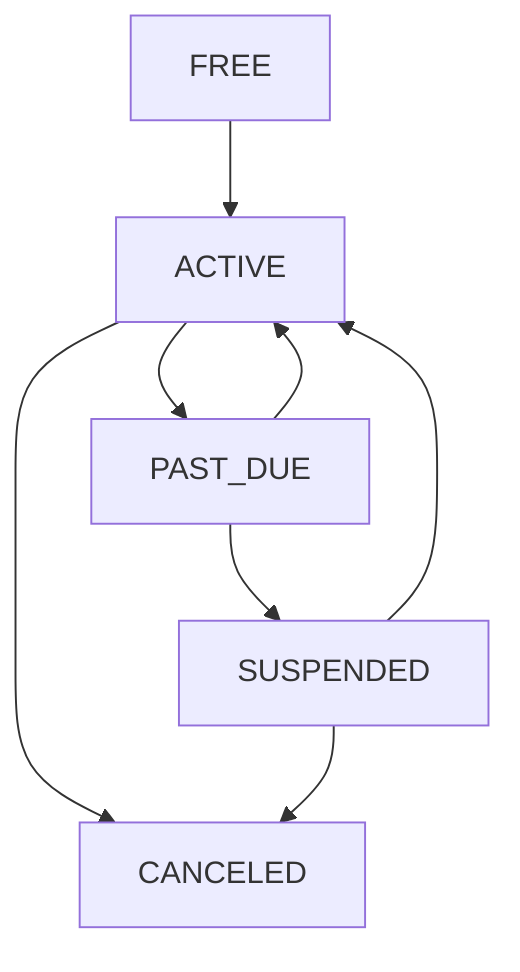

<Info>
**Status:** Active — fully implemented  
**Module Path:** `src/modules/subscription/`  
**Payment Gateway:** Stripe
</Info>

## Overview

The Subscription Module implements a **freemium SaaS billing system** for PropWise CRM. Every organization has a subscription tied to one of four plan tiers. The module handles:

- **Plan-based feature gating** — binary feature flags per tier
- **Resource limits** — caps on leads, contacts, deals, companies, and storage
- **Credit-based metering** — monthly AI and messaging allowances with purchasable top-ups
- **Dual seat types** — manager seats and agent seats with per-tier pricing; every user consumes a seat
- **Stripe integration** — checkout, subscription management, mid-cycle plan changes, webhooks, billing portal
- **Free organization ownership cap** — one user may own at most 2 active Free-plan organizations
- **Proration** — mid-cycle upgrades, downgrades, and seat changes are prorated to the day
- **Suspension flow** — 2-day grace period on payment failure, then org goes read-only

### Design Principles

<AccordionGroup>
<Accordion title="Core Design Decisions">
| Principle | Decision |
|-----------|----------|
| Freemium model | Free plan with limited features; paid tiers unlock progressively |
| Per-org billing | Billing is per organization; developer portal is free |
| Dual seat types | Manager seats (Owner, Admin) and agent seats (Basic, custom roles); every user consumes a seat |
| Seat type derived from role | No explicit seat assignment — seat type is automatically determined by the user's RBAC role |
| Feature flags over tier checks | Gating uses `@RequiresFeature('flag')` on plan JSONB — changing what a tier includes requires only a seeder update, not code changes |
| Service-layer limit enforcement | Resource limits and credit consumption are checked in service methods, not guards, because they need entity counts |
| Free-org creation protection | `POST /v1/organizations` locks the owner row, counts owned Free-plan orgs (missing subscription rows count as Free), and rejects the third active free workspace |
| Stripe as source of truth for payments | Webhook-driven lifecycle: the app reacts to Stripe events rather than polling |
| Prorated plan changes | All mid-cycle changes (upgrade, downgrade, add/remove seats) use `proration_behavior: 'create_prorations'` — charges are fair to the day |
| Checkout vs. change-plan separation | `POST /checkout` is for first-time subscription (Free → Paid); `POST /change-plan` is for switching between paid tiers |
| Idempotent webhooks | Every Stripe event is logged in `BillingEvent` with a unique `stripeEventId` to prevent duplicate processing |
| Graceful degradation | If `app.stripe.secretKey` (`STRIPE_SECRET_KEY`) is not set, billing features are unavailable but the app still starts |
</Accordion>
</AccordionGroup>

## Architecture

### High-Level Diagram

```
┌─────────────────────────────────────────────────────────────────────┐
│                        API Layer (Controllers)                       │
│  SubscriptionController            │  StripeWebhookController        │
│  (authenticated, /v1/subscriptions)│  (public, /webhooks/stripe)     │
└──────────────┬─────────────────────┴────────────┬───────────────────┘
               │                                  │
┌──────────────▼──────────────────────────────────▼───────────────────┐
│  Service Layer                                                       │
│  ┌──────────────────┐  ┌──────────────────┐  ┌───────────────────┐  │
│  │ SubscriptionSvc  │  │  CreditService   │  │  StripeService    │  │
│  │ • lifecycle      │  │  • consume FIFO  │  │  • SDK wrapper    │  │
│  │ • plan changes   │  │  • balance query │  │  • checkout       │  │
│  │ • seat mgmt      │  │  • record packs  │  │  • subscriptions  │  │
│  │ • resource limits│  │                  │  │  • price swaps    │  │
│  │ • feature checks │  │                  │  │  • webhooks       │  │
│  └──────────────────┘  └──────────────────┘  └───────────────────┘  │
└──────────────┬──────────────────────────────────────────────────────┘
               │
┌──────────────▼──────────────────────────────────────────────────────┐
│  Data Layer (MikroORM / PostgreSQL)                                  │
│  SubscriptionPlan │ Subscription │ SubscriptionUsage                 │
│  CreditPurchase   │ BillingEvent │ Organization.stripeCustomerId     │
└─────────────────────────────────────────────────────────────────────┘
```

### Data Flow

<Tabs>
<Tab title="First-time Checkout">
```
Frontend "Upgrade" button
  → POST /v1/subscriptions/checkout
    → Rejects if org already has a Stripe subscription (use change-plan instead)
    → SubscriptionService.createCheckoutSession()
      → StripeService.createCheckoutSession()
        → Returns Stripe Checkout URL
          → User pays on Stripe's hosted page
            → Stripe redirects to success URL with session_id={CHECKOUT_SESSION_ID}
              → Frontend POST /v1/subscriptions/checkout/confirm { sessionId }
                → SubscriptionService.fulfillCheckoutSession() (idempotent with webhook)
                  → Subscription entity updated to ACTIVE (plan tier from session metadata)
            → (async) Stripe fires checkout.session.completed webhook
              → StripeWebhookController → activateSubscription() (same activation path)
```
</Tab>

<Tab title="Plan Changes">
```
Frontend "Change Plan" button
  → POST /v1/subscriptions/change-plan
    → SubscriptionService.changePlan()
      → Validates seat overflow (blocks if current users exceed new plan capacity)
      → StripeService.swapSubscriptionPrice() — prorated
      → Reconciles seat line items (old tier price → new tier price)
      → Updates local Subscription entity
      → Returns updated subscription immediately
```
</Tab>

<Tab title="Payment Failures">
```
Stripe charges renewal invoice
  ├─ invoice.paid → handleInvoicePaid() → status stays ACTIVE, period updated
  └─ invoice.payment_failed → handleInvoicePaymentFailed() → status → PAST_DUE
       └─ Stripe retries for 2 days
            ├─ Payment succeeds → invoice.paid → back to ACTIVE
            └─ All retries fail → customer.subscription.updated (status: unpaid)
                 → handleSubscriptionUpdated() → status → SUSPENDED
                      → Org is read-only (SubscriptionActiveGuard blocks writes)
```
</Tab>
</Tabs>

## Plan Tiers & Pricing

Four tiers, priced in USD cents:

| Plan | Monthly | Annual | Manager Seats | Agent Seats | Extra Manager | Extra Agent |
|------|---------|--------|---------------|-------------|---------------|-------------|
| **Free** | $0 | $0 | 1 | 0 | — | — |
| **Starter** | $49 | $470.40 (~20% off) | 2 | 3 | $25/mo | $12/mo |
| **Professional** | $149 | $1,430.40 | 5 | 15 | $20/mo | $10/mo |
| **Business** | $399 | $3,830.40 | 10 | 40 | $18/mo | $8/mo |

### Resource Limits

| Resource | Free | Starter | Professional | Business |
|----------|------|---------|--------------|----------|
| Leads | 50 | 1,000 | 10,000 | Unlimited |
| Contacts | 50 | 1,000 | 10,000 | Unlimited |
| Deals | 20 | 500 | 5,000 | Unlimited |
| Companies | 10 | 200 | 2,000 | Unlimited |
| Storage | 500 MB | 5 GB | 25 GB | 100 GB |

### Free Organization Ownership Limit

<Warning>
Each user may own **2 active Free-plan organizations**. This cap applies only to organizations where the user is the owner; invited/member workspaces do not count against the owner's create quota.
</Warning>

An organization counts as Free only when its `subscription` row's plan tier is `FREE`. Every organization must have exactly one subscription row:

- `ProvisioningService` creates a FREE subscription at org creation
- `Migration20260526170000_BackfillMissingOrganizationSubscriptions` backfills legacy gaps
- `SubscriptionService.ensureFreeSubscriptionsForOrganizationsInTransaction()` self-heals any remaining missing rows

<Note>
Missing rows are **not** silently treated as Free for the ownership cap. To create another organization after reaching the cap, the owner must delete one of their free organizations or upgrade one to a paid plan.
</Note>

Backend enforcement lives in `OrganizationService.create()` and calls `SubscriptionService.getFreeOrganizationOwnershipLimitStatusInTransaction()` inside the same bypass transaction. The service pessimistically locks the owner `User` row before counting, so concurrent `POST /v1/organizations` requests cannot both pass the limit check.

When the cap is reached, `POST /v1/organizations` returns **400** with a structured body:

| Field | Value |
|-------|-------|
| `errorCode` | `FREE_ORGANIZATION_LIMIT_REACHED` |
| `message` | Human-readable copy (includes the numeric limit) |
| `limit` | `2` (from `MAX_FREE_ORGANIZATIONS_PER_USER`) |
| `currentCount` | Owner's active Free-plan org count at check time |

<Tip>
Clients should key off `errorCode` and `limit` rather than parsing `message`.
</Tip>

### Monthly Credits

<Info>
Stripe webhook period fields (`current_period_start`, `current_period_end`, `start_date`) are converted with `stripeUnixSecondsToDate()` in `src/modules/subscription/utils/stripe-time.util.ts`, which expects **Unix seconds** only and throws if a millisecond value is passed by mistake.
</Info>

| Credit Type | Free | Starter | Professional | Business |
|-------------|------|---------|--------------|----------|
| AI credits | 10 | 500 | 2,000 | 5,000 |
| Message credits | 25 | 1,000 | 5,000 | 15,000 |

## Feature Gating Model

The subscription system uses binary feature flags stored in the `features` JSONB column of `SubscriptionPlan`. This allows changing plan capabilities without code modifications.

### Core Features by Plan

<CodeGroup>
```json Free Plan Features
{
  "advanced_search": false,
  "ai_insights": false,
  "automation_workflows": false,
  "bulk_operations": false,
  "custom_fields": false,
  "data_export": false,
  "integrations": false,
  "reporting_analytics": false,
  "team_collaboration": false
}
```

```json Starter Plan Features
{
  "advanced_search": true,
  "ai_insights": false,
  "automation_workflows": false,
  "bulk_operations": true,
  "custom_fields": true,
  "data_export": true,
  "integrations": false,
  "reporting_analytics": false,
  "team_collaboration": true
}
```

```json Professional Plan Features
{
  "advanced_search": true,
  "ai_insights": true,
  "automation_workflows": true,
  "bulk_operations": true,
  "custom_fields": true,
  "data_export": true,
  "integrations": true,
  "reporting_analytics": true,
  "team_collaboration": true
}
```

```json Business Plan Features
{
  "advanced_search": true,
  "ai_insights": true,
  "automation_workflows": true,
  "bulk_operations": true,
  "custom_fields": true,
  "data_export": true,
  "integrations": true,
  "reporting_analytics": true,
  "team_collaboration": true
}
```
</CodeGroup>

### Feature Enforcement

Use the `@RequiresFeature()` decorator on controllers or service methods:

```typescript
@RequiresFeature('ai_insights')
@Post('generate-insights')
async generateInsights(@Org() org: Organization) {
  // Feature-gated functionality
}
```

## Seat Management

### Seat Types

<Tabs>
<Tab title="Manager Seats">
Consumed by users with administrative roles:
- **Owner** - Full organization control
- **Admin** - Administrative privileges

Manager seats have higher per-seat costs but include administrative capabilities.
</Tab>

<Tab title="Agent Seats">
Consumed by standard users:
- **Basic** - Standard user role
- **Custom roles** - Any non-administrative custom role

Agent seats are lower cost and designed for day-to-day CRM usage.
</Tab>
</Tabs>

### Automatic Seat Assignment

<Note>
Seat types are automatically determined by the user's RBAC role. There's no explicit seat assignment process - the system dynamically calculates seat consumption based on active users and their roles.
</Note>

### Seat Limit Enforcement

When changing plans or adding users, the system validates that the new configuration doesn't exceed seat limits:

<Steps>
<Step title="Count Current Users">
System counts active users by role type (manager vs agent)
</Step>
<Step title="Check Plan Limits">
Compares current usage against target plan limits
</Step>
<Step title="Block or Allow">
- **Block**: If current usage exceeds new plan limits
- **Allow**: If within limits, proceed with change
</Step>
</Steps>

## Credit System

### Credit Types

<CardGroup cols={2}>
<Card title="AI Credits" icon="brain">
Used for AI-powered features like insights generation, lead scoring, and automated content creation
</Card>
<Card title="Message Credits" icon="message">
Consumed by SMS, email campaigns, and other communication features
</Card>
</CardGroup>

### Credit Consumption

Credits are consumed using a **FIFO (First In, First Out)** system:

1. Monthly plan allowances are consumed first
2. Purchased credit packs are consumed in order of purchase
3. When credits are exhausted, features become unavailable until renewal or purchase

### Credit Purchases

Users can purchase additional credit packs beyond their monthly allowance:

```typescript
// Credit pack options
const AI_CREDIT_PACKS = [
  { credits: 500, price: 2000 },   // $20.00
  { credits: 1500, price: 5000 },  // $50.00
  { credits: 3500, price: 10000 }  // $100.00
];

const MESSAGE_CREDIT_PACKS = [
  { credits: 1000, price: 1500 },  // $15.00
  { credits: 3000, price: 4000 },  // $40.00
  { credits: 7500, price: 9000 }   // $90.00
];
```

## Entity Specifications

### SubscriptionPlan

Core plan configuration entity:

```typescript
@Entity()
export class SubscriptionPlan {
  @PrimaryKey()
  id: number;

  @Property()
  tier: PlanTier; // FREE, STARTER, PROFESSIONAL, BUSINESS

  @Property()
  name: string;

  @Property()
  monthlyPriceUsdCents: number;

  @Property()
  annualPriceUsdCents: number;

  @Property()
  managerSeatsIncluded: number;

  @Property()
  agentSeatsIncluded: number;

  @Property()
  extraManagerSeatPriceUsdCents: number;

  @Property()
  extraAgentSeatPriceUsdCents: number;

  @Property({ type: 'jsonb' })
  limits: PlanLimits;

  @Property({ type: 'jsonb' })
  features: PlanFeatures;

  @Property({ type: 'jsonb' })
  monthlyCredits: MonthlyCredits;
}
```

### Subscription

Organization subscription state:

```typescript
@Entity()
export class Subscription {
  @PrimaryKey()
  id: number;

  @ManyToOne()
  organization: Organization;

  @ManyToOne()
  plan: SubscriptionPlan;

  @Property()
  status: SubscriptionStatus;

  @Property()
  stripeSubscriptionId?: string;

  @Property()
  stripeCustomerId?: string;

  @Property()
  billingCycle: BillingCycle; // MONTHLY, ANNUAL

  @Property()
  currentPeriodStart: Date;

  @Property()
  currentPeriodEnd: Date;

  @Property()
  managerSeats: number;

  @Property()
  agentSeats: number;
}
```

### CreditPurchase

Track purchased credit packs:

```typescript
@Entity()
export class CreditPurchase {
  @PrimaryKey()
  id: number;

  @ManyToOne()
  organization: Organization;

  @Property()
  creditType: CreditType;

  @Property()
  creditsGranted: number;

  @Property()
  creditsRemaining: number;

  @Property()
  priceUsdCents: number;

  @Property()
  stripePaymentIntentId?: string;

  @Property()
  purchasedAt: Date;

  @Property()
  expiresAt?: Date;
}
```

## Stripe Integration

### Checkout Session Creation

<Steps>
<Step title="Validate Organization">
Ensure organization doesn't already have an active Stripe subscription
</Step>
<Step title="Create Stripe Session">
Generate Stripe Checkout session with plan and seat configuration
</Step>
<Step title="Handle Payment">
Process successful payment via webhook or confirmation endpoint
</Step>
<Step title="Activate Subscription">
Update local subscription status and sync with Stripe data
</Step>
</Steps>

### Webhook Event Handling

<Warning>
All Stripe webhooks are processed idempotently using the `BillingEvent` entity to track processed events by `stripeEventId`.
</Warning>

Key webhook events:

| Event | Handler | Purpose |
|-------|---------|---------|
| `checkout.session.completed` | `handleCheckoutCompleted()` | Activate new subscriptions |
| `invoice.paid` | `handleInvoicePaid()` | Confirm successful renewals |
| `invoice.payment_failed` | `handleInvoicePaymentFailed()` | Mark subscription as past due |
| `customer.subscription.updated` | `handleSubscriptionUpdated()` | Sync subscription changes |
| `customer.subscription.deleted` | `handleSubscriptionDeleted()` | Handle cancellations |

### Proration Handling

<Info>
All mid-cycle changes use `proration_behavior: 'create_prorations'` to ensure fair daily billing.
</Info>

Proration applies to:
- Plan upgrades/downgrades
- Seat additions/removals
- Billing cycle changes

## Subscription Lifecycle

### States



<AccordionGroup>
<Accordion title="Status Definitions">
| Status | Description | Access Level |
|--------|-------------|--------------|
| `FREE` | Default free plan | Limited features |
| `ACTIVE` | Paid subscription current | Full plan features |
| `PAST_DUE` | Payment failed, 2-day grace | Full plan features |
| `SUSPENDED` | Grace period expired | Read-only access |
| `CANCELED` | User-initiated cancellation | Reverts to FREE |
</Accordion>
</AccordionGroup>

### Grace Period

<Steps>
<Step title="Payment Failure">
Invoice payment fails, subscription status → `PAST_DUE`
</Step>
<Step title="Grace Period">
2-day grace period with full feature access
</Step>
<Step title="Retry Success">
If retry payment succeeds → status returns to `ACTIVE`
</Step>
<Step title="Grace Expiry">
If all retries fail → status becomes `SUSPENDED`, organization goes read-only
</Step>
</Steps>

## Plan Changes

### Upgrade Flow

<CodeGroup>
```typescript Controller
@Post('change-plan')
async changePlan(
  @Org() org: Organization,
  @Body() dto: ChangePlanDto
) {
  return this.subscriptionService.changePlan(
    org.id,
    dto.targetPlanId,
    dto.managerSeats,
    dto.agentSeats
  );
}
```

```typescript Service Logic
async changePlan(
  organizationId: number,
  targetPlanId: number,
  managerSeats: number,
  agentSeats: number
) {
  // 1. Validate seat requirements
  await this.validateSeatRequirements(organizationId, managerSeats, agentSeats);
  
  // 2. Calculate prorated changes
  const subscription = await this.getActiveSubscription(organizationId);
  
  // 3. Update Stripe subscription
  await this.stripeService.swapSubscriptionPrice(
    subscription.stripeSubscriptionId,
    targetPlanId,
    { managerSeats, agentSeats }
  );
  
  // 4. Update local subscription
  return this.updateSubscriptionPlan(subscription, targetPlanId, managerSeats, agentSeats);
}
```
</CodeGroup>

### Downgrade Restrictions

<Warning>
Downgrades are blocked if current usage exceeds target plan limits:
- Active user count > new seat limits
- Data usage > new resource limits
- Feature dependencies exist
</Warning>

## API Endpoints

### Subscription Management

<AccordionGroup>
<Accordion title="GET /v1/subscriptions/current">
**Description:** Get current organization subscription details

**Response:**
```json
{
  "id": 123,
  "status": "ACTIVE",
  "plan": {
    "tier": "PROFESSIONAL",
    "name": "Professional Plan",
    "monthlyPriceUsdCents": 14900
  },
  "currentPeriodStart": "2024-01-01T00:00:00Z",
  "currentPeriodEnd": "2024-02-01T00:00:00Z",
  "managerSeats": 5,
  "agentSeats": 15
}
```
</Accordion>

<Accordion title="POST /v1/subscriptions/checkout">
**Description:** Create Stripe checkout session for first-time subscription

**Request Body:**
```json
{
  "planId": 2,
  "billingCycle": "MONTHLY",
  "managerSeats": 3,
  "agentSeats": 8
}
```

**Response:**
```json
{
  "checkoutUrl": "https://checkout.stripe.com/pay/cs_...",
  "sessionId": "cs_test_..."
}
```
</Accordion>

<Accordion title="POST /v1/subscriptions/change-plan">
**Description:** Change subscription plan (paid to paid only)

**Request Body:**
```json
{
  "targetPlanId": 3,
  "managerSeats": 5,
  "agentSeats": 15
}
```

**Response:**
```json
{
  "subscription": { /* updated subscription */ },
  "prorationAmount": 2450
}
```
</Accordion>

<Accordion title="POST /v1/subscriptions/cancel">
**Description:** Cancel subscription (reverts to FREE at period end)

**Response:**
```json
{
  "canceledAt": "2024-01-15T10:30:00Z",
  "effectiveAt": "2024-02-01T00:00:00Z"
}
```
</Accordion>
</AccordionGroup>

### Credit Management

<AccordionGroup>
<Accordion title="GET /v1/subscriptions/credits">
**Description:** Get current credit balances

**Response:**
```json
{
  "ai": {
    "monthlyAllowance": 2000,
    "monthlyUsed": 450,
    "purchasedBalance": 1500,
    "totalAvailable": 3050
  },
  "message": {
    "monthlyAllowance": 5000,
    "monthlyUsed": 1200,
    "purchasedBalance": 0,
    "totalAvailable": 3800
  }
}
```
</Accordion>

<Accordion title="POST /v1/subscriptions/credits/purchase">
**Description:** Purchase additional credit pack

**Request Body:**
```json
{
  "creditType": "AI",
  "packSize": 1500
}
```

**Response:**
```json
{
  "paymentIntent": {
    "id": "pi_...",
    "clientSecret": "pi_..._secret_..."
  },
  "creditPurchase": {
    "id": 456,
    "creditsGranted": 1500,
    "priceUsdCents": 5000
  }
}
```
</Accordion>
</AccordionGroup>

## Guards & Decorators

### Feature Gating

```typescript
@RequiresFeature('ai_insights')
@Get('insights')
async getInsights(@Org() org: Organization) {
  // Only accessible if organization's plan includes ai_insights feature
}
```

### Subscription Status Guards

```typescript
@UseGuards(SubscriptionActiveGuard)
@Post('create-lead')
async createLead(@Body() dto: CreateLeadDto) {
  // Blocked if subscription is SUSPENDED
}
```

### Resource Limit Enforcement

<Note>
Resource limits are enforced at the service layer, not through guards, because they require database queries to count existing entities.
</Note>

```typescript
async createLead(orgId: number, data: CreateLeadDto) {
  // Check lead limit before creation
  await this.subscriptionService.checkLeadLimit(orgId);
  
  // Proceed with lead creation
  return this.leadRepository.create(data);
}
```

## Enforcement Points

### Feature Access

- **Controller level:** `@RequiresFeature()` decorator
- **Service level:** Manual feature checks for complex logic
- **Frontend:** Feature flags passed in auth context

### Resource Limits

<Steps>
<Step title="Pre-creation Checks">
Service methods check current usage against plan limits before creating new entities
</Step>
<Step title="Consumption Tracking">
`SubscriptionUsage` entity tracks monthly consumption per resource type
</Step>
<Step title="Limit Enforcement">
Operations blocked when limits exceeded, with specific error codes
</Step>
</Steps>

### Credit Consumption

```typescript
async consumeAICredits(orgId: number, amount: number) {
  const balance = await this.creditService.getBalance(orgId, 'AI');
  
  if (balance < amount) {
    throw new InsufficientCreditsException();
  }
  
  await this.creditService.consumeCredits(orgId, 'AI', amount);
}
```

## Plan Seeder

The plan seeder populates the `SubscriptionPlan` table with current plan configurations:

```typescript
// Located in: src/database/seeders/SubscriptionPlanSeeder.ts
export class SubscriptionPlanSeeder {
  async run() {
    const plans = [
      {
        tier: 'FREE',
        name: 'Free Plan',
        monthlyPriceUsdCents: 0,
        // ... full plan configuration
      },
      // ... other plans
    ];
    
    await this.subscriptionPlanRepository.upsert(plans);
  }
}
```

<Tip>
Run the seeder after plan configuration changes to update available features and limits without code deployment.
</Tip>

## Module Structure

```
src/modules/subscription/
├── controllers/
│   ├── subscription.controller.ts
│   └── stripe-webhook.controller.ts
├── services/
│   ├── subscription.service.ts
│   ├── credit.service.ts
│   └── stripe.service.ts
├── entities/
│   ├── subscription-plan.entity.ts
│   ├── subscription.entity.ts
│   ├── subscription-usage.entity.ts
│   ├── credit-purchase.entity.ts
│   └── billing-event.entity.ts
├── guards/
│   ├── subscription-active.guard.ts
│   └── requires-feature.decorator.ts
├── dtos/
│   ├── checkout.dto.ts
│   ├── change-plan.dto.ts
│   └── purchase-credits.dto.ts
├── utils/
│   └── stripe-time.util.ts
└── subscription.module.ts
```

## Environment Configuration

<CodeGroup>
```env Required Variables
# Stripe Configuration
STRIPE_SECRET_KEY=sk_test_...
STRIPE_WEBHOOK_SECRET=whsec_...
STRIPE_PUBLISHABLE_KEY=pk_test_...

# Plan Configuration
MAX_FREE_ORGANIZATIONS_PER_USER=2

# Frontend URLs (for Stripe redirects)
FRONTEND_BASE_URL=http://localhost:3000
```

```typescript Configuration Class
export class SubscriptionConfig {
  @IsString()
  stripeSecretKey: string;

  @IsString()
  stripeWebhookSecret: string;

  @IsString()
  stripePublishableKey: string;

  @IsNumber()
  maxFreeOrganizationsPerUser: number = 2;

  @IsString()
  frontendBaseUrl: string;
}
```
</CodeGroup>

<Warning>
If `STRIPE_SECRET_KEY` is not configured, billing features will be disabled but the application will still start. This allows development environments to run without Stripe configuration.
</Warning>

## Integration with Other Modules

### User Management

- **Seat calculation:** Automatic seat assignment based on user roles
- **Role changes:** Seat type updates when user roles change
- **User deactivation:** Seat release when users are removed

### Organization Management

- **Provisioning:** Free subscription creation for new organizations
- **Ownership limits:** Enforcement during organization creation
- **Deletion:** Subscription cleanup when organizations are deleted

### RBAC Module

- **Feature gating:** Integration with role-based access control
- **Permission derivation:** Plan features inform available permissions
- **Administrative access:** Manager seats required for admin roles

### Audit Module

- **Subscription changes:** All plan changes and payments logged
- **Credit consumption:** Detailed audit trail for credit usage
- **Feature access:** Tracking of feature gate violations

<Check>
The Subscription Module is fully integrated across the PropWise CRM platform, providing comprehensive billing, feature gating, and resource management capabilities with Stripe-powered payment processing.
</Check>