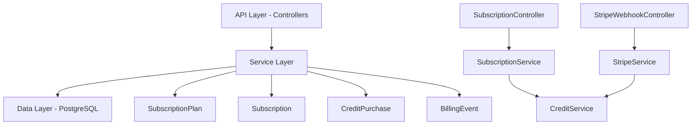
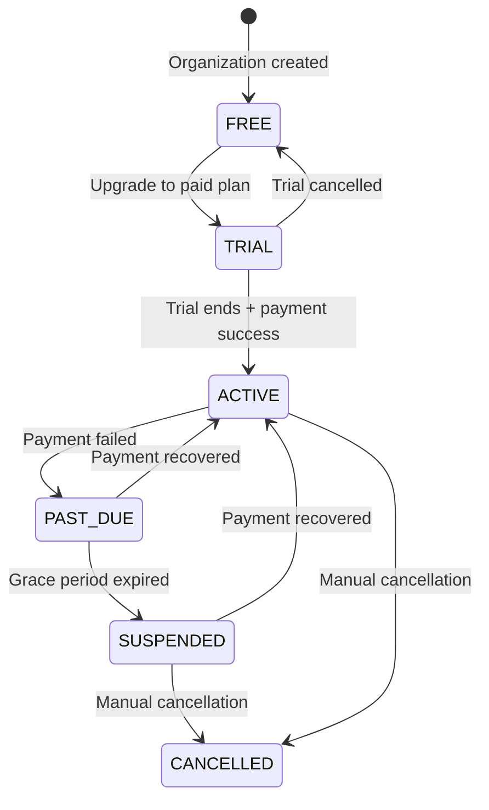

The Subscription Module implements a **freemium SaaS billing system** for PropWise CRM. Every organization has a subscription tied to one of **three plan tiers** (Free / Pro / Business — Starter was removed). The module handles plan-based feature gating, resource limits, unified AI-credit wallet, seat management, and Stripe integration.

<Note>
**§18 (Subscription Packaging Rollout)** is the authoritative description of the current Free/Pro/Business AED model. Where earlier sections conflict with §18, **§18 wins**.
</Note>

## Overview

<CardGroup cols={2}>
  <Card title="Module Status" icon="check-circle">
    **Status:** Active — fully implemented  
    **Module Path:** `src/modules/subscription/`  
    **Payment Gateway:** Stripe
  </Card>
  <Card title="Key Features" icon="star">
    - Plan-based feature gating
    - Resource limits with source awareness
    - Unified AI-credit wallet
    - Single per-agent seat model
    - Stripe integration with webhooks
  </Card>
</CardGroup>

### Design Principles

The module follows several key design principles:

| Principle | Decision |
|-----------|----------|
| **Freemium model** | Free plan with limited features; paid tiers unlock progressively |
| **Per-org billing** | Billing is per organization; developer portal is free |
| **Feature flags over tier checks** | Gating uses `@RequiresFeature('flag')` on plan JSONB |
| **Service-layer enforcement** | Resource limits checked in service methods, not guards |
| **Stripe as source of truth** | Webhook-driven lifecycle: app reacts to Stripe events |
| **Idempotent webhooks** | Every Stripe event logged in `BillingEvent` with unique `stripeEventId` |

## Architecture

### High-Level System Design



### Data Flow Patterns

<Tabs>
  <Tab title="First-time Checkout">
    <Steps>
      <Step title="User initiates upgrade">
        Frontend "Upgrade" button triggers `POST /v1/subscriptions/checkout`
      </Step>
      <Step title="Create checkout session">
        SubscriptionService validates and creates Stripe Checkout session
      </Step>
      <Step title="User payment">
        User completes payment on Stripe's hosted page
      </Step>
      <Step title="Confirmation">
        Stripe redirects to success URL, frontend confirms with session ID
      </Step>
      <Step title="Activation">
        Subscription entity updated to ACTIVE via webhook or confirmation endpoint
      </Step>
    </Steps>
  </Tab>
  
  <Tab title="Plan Changes">
    <Steps>
      <Step title="Change request">
        Frontend triggers `POST /v1/subscriptions/change-plan`
      </Step>
      <Step title="Validation">
        System validates seat overflow and plan compatibility
      </Step>
      <Step title="Stripe update">
        StripeService swaps subscription price with proration
      </Step>
      <Step title="Local sync">
        Local Subscription entity updated immediately
      </Step>
    </Steps>
  </Tab>
  
  <Tab title="Payment Failure">
    <Steps>
      <Step title="Invoice failure">
        Stripe webhook: `invoice.payment_failed` → status becomes `PAST_DUE`
      </Step>
      <Step title="Grace period">
        Stripe retries payment for 2 days
      </Step>
      <Step title="Suspension">
        If all retries fail: `customer.subscription.updated` → status `SUSPENDED`
      </Step>
      <Step title="Read-only mode">
        Organization becomes read-only via SubscriptionActiveGuard
      </Step>
    </Steps>
  </Tab>
</Tabs>

## Plan Tiers & Pricing

### Current Tier Structure (Post-§18)

<Warning>
The Starter tier was removed in §18. Current structure uses Free/Pro/Business only.
</Warning>

| Feature | **Free** | **Professional** | **Business** |
|---------|----------|------------------|--------------|
| Monthly price (AED) | 0 | 549 | 1,467 |
| Annual price (AED) | 0 | 5,270.40 (~20% off) | 14,083.20 |
| Agent seats included | 1 | 5-10 (11th triggers upgrade) | 10+ with volume pricing |
| Storage | 1 GB | 25 GB | 100 GB |
| AI Credits/month | 50 | 500 | 2,000 |

### Pricing Model Details

<Info>
All pricing is in AED (United Arab Emirates Dirham). The system uses Stripe's pricing tables with currency conversion handled automatically.
</Info>

**Key pricing rules:**
- **Pro tier enforcement**: 5–10 seats allowed, 11th seat triggers mandatory upgrade to Business
- **Business tier volume pricing**: 10+ seats with progressive discounts
- **Storage add-ons**: +25 GB packs available for all paid tiers
- **Credit top-ups**: Available for all tiers when monthly allocation exhausted

## Feature Gating Model

The system uses **feature flags** stored in the `SubscriptionPlan.features` JSONB column rather than hard-coded tier checks.

### Feature Flag Implementation

```typescript
@RequiresFeature('advanced_reporting')
@Post('/reports/advanced')
async generateAdvancedReport() {
  // Only accessible if user's plan includes 'advanced_reporting' feature
}
```

### Core Features by Tier

<AccordionGroup>
  <Accordion title="Free Tier Features">
    ```json
    {
      "basic_crm": true,
      "lead_management": true,
      "contact_management": true,
      "basic_reporting": true,
      "email_integration": false,
      "advanced_reporting": false,
      "custom_fields": false,
      "api_access": false
    }
    ```
  </Accordion>
  
  <Accordion title="Professional Tier Features">
    ```json
    {
      "basic_crm": true,
      "lead_management": true,
      "contact_management": true,
      "basic_reporting": true,
      "email_integration": true,
      "advanced_reporting": true,
      "custom_fields": true,
      "api_access": true,
      "automation": true,
      "bulk_operations": true
    }
    ```
  </Accordion>
  
  <Accordion title="Business Tier Features">
    ```json
    {
      "basic_crm": true,
      "lead_management": true,
      "contact_management": true,
      "basic_reporting": true,
      "email_integration": true,
      "advanced_reporting": true,
      "custom_fields": true,
      "api_access": true,
      "automation": true,
      "bulk_operations": true,
      "white_labeling": true,
      "priority_support": true,
      "advanced_integrations": true
    }
    ```
  </Accordion>
</AccordionGroup>

## Seat Management

### Single Seat Model (Post-§18)

<Note>
The dual seat model (Manager/Agent) was collapsed into a single "agent seat" model in §18. Every user now consumes one seat regardless of role.
</Note>

**Seat allocation rules:**
- **Free**: 1 seat total
- **Pro**: 5-10 seats (11th user triggers upgrade to Business)
- **Business**: 10+ seats with volume pricing

### Seat Enforcement

```typescript
// Service-layer enforcement before user creation
async validateSeatCapacity(organizationId: string): Promise<void> {
  const subscription = await this.getSubscription(organizationId);
  const currentUsers = await this.userService.countActiveUsers(organizationId);
  
  if (currentUsers >= subscription.plan.maxSeats) {
    throw new ForbiddenException('Seat limit exceeded');
  }
}
```

### Seat Change Scenarios

<Tabs>
  <Tab title="Adding Users">
    - **Free → Pro**: Automatic when 2nd user invited
    - **Pro (10 seats) → Business**: Mandatory when 11th user invited
    - **Within limits**: No billing impact
  </Tab>
  
  <Tab title="Removing Users">
    - Seats freed immediately
    - No automatic downgrades
    - Credits prorated for next billing cycle
  </Tab>
  
  <Tab title="Mid-cycle Changes">
    - Prorated billing for partial periods
    - Immediate seat availability
    - Updated via Stripe subscription modification
  </Tab>
</Tabs>

## Credit System

### Unified Credit Wallet (Post-§18)

The system now uses a **single credit balance** for all AI features:

- **Propilot AI assistance**
- **AI auto-reply**  
- **Unit valuation**
- **Property analysis**

### Credit Allocation & Consumption

| Action | Cost (Credits) | Notes |
|--------|----------------|--------|
| Propilot query | 1-5 | Based on complexity |
| AI auto-reply | 2 | Per generated response |
| Unit valuation | 10 | Per property analysis |
| Advanced insights | 15 | Premium AI features |

### Credit Management

<CodeGroup>
```typescript Credit Consumption
async consumeCredits(
  organizationId: string,
  amount: number,
  action: string
): Promise<void> {
  const balance = await this.getCreditBalance(organizationId);
  
  if (balance < amount) {
    throw new InsufficientCreditsException();
  }
  
  // FIFO consumption from credit purchases
  await this.deductCreditsFromPacks(organizationId, amount, action);
}
```

```typescript Credit Balance Query
async getCreditBalance(organizationId: string): Promise<number> {
  const packs = await this.creditPurchaseRepository.find({
    where: { organizationId, consumedCredits: { $lt: raw('purchased_credits') } },
    orderBy: { createdAt: 'ASC' }
  });
  
  return packs.reduce((total, pack) => 
    total + (pack.purchasedCredits - pack.consumedCredits), 0
  );
}
```
</CodeGroup>

### Credit Top-up Packs

Available for all tiers when monthly allocation is exhausted:

- **Small pack**: 100 credits - 50 AED
- **Medium pack**: 300 credits - 120 AED  
- **Large pack**: 1000 credits - 350 AED

## Entity Specifications

### SubscriptionPlan Entity

```typescript
@Entity()
export class SubscriptionPlan {
  @PrimaryKey()
  id: string;
  
  @Property()
  name: string; // 'Free', 'Professional', 'Business'
  
  @Property()
  monthlyPriceAed: number; // Price in fils (1 AED = 100 fils)
  
  @Property()
  annualPriceAed: number;
  
  @Property({ type: 'json' })
  features: Record<string, boolean>; // Feature flags
  
  @Property()
  maxSeats: number;
  
  @Property()
  maxStorage: number; // In bytes
  
  @Property()
  monthlyCredits: number;
  
  @Property()
  maxLeads: number;
  
  @Property()
  maxContacts: number;
  
  @Property()
  maxDeals: number;
  
  @Property()
  maxCompanies: number;
  
  @Property()
  isActive: boolean = true;
}
```

### Subscription Entity

```typescript
@Entity()
export class Subscription {
  @PrimaryKey()
  id: string;
  
  @ManyToOne(() => Organization)
  organization: Organization;
  
  @ManyToOne(() => SubscriptionPlan)
  plan: SubscriptionPlan;
  
  @Property()
  status: SubscriptionStatus; // TRIAL, ACTIVE, PAST_DUE, SUSPENDED, CANCELLED
  
  @Property()
  billingCycle: BillingCycle; // MONTHLY, ANNUAL
  
  @Property({ nullable: true })
  stripeSubscriptionId?: string;
  
  @Property({ nullable: true })
  stripeCustomerId?: string;
  
  @Property({ nullable: true })
  currentPeriodStart?: Date;
  
  @Property({ nullable: true })
  currentPeriodEnd?: Date;
  
  @Property({ nullable: true })
  trialEnd?: Date;
  
  @Property()
  createdAt: Date = new Date();
  
  @Property({ onUpdate: () => new Date() })
  updatedAt: Date = new Date();
}
```

### CreditPurchase Entity

```typescript
@Entity()
export class CreditPurchase {
  @PrimaryKey()
  id: string;
  
  @ManyToOne(() => Organization)
  organization: Organization;
  
  @Property()
  purchasedCredits: number;
  
  @Property()
  consumedCredits: number = 0;
  
  @Property()
  source: CreditSource; // MONTHLY_ALLOCATION, PURCHASE, BONUS
  
  @Property({ nullable: true })
  stripePaymentIntentId?: string;
  
  @Property()
  expiresAt?: Date; // Monthly allocations expire, purchases don't
  
  @Property()
  createdAt: Date = new Date();
}
```

## Stripe Integration

### Checkout Session Creation

<Steps>
  <Step title="Validate organization">
    Ensure organization exists and user has permission to upgrade
  </Step>
  
  <Step title="Create Stripe customer">
    If not exists, create customer with organization metadata
  </Step>
  
  <Step title="Configure session">
    Set up checkout session with proper line items, trial settings, and redirect URLs
  </Step>
  
  <Step title="Return checkout URL">
    Frontend redirects user to Stripe's hosted checkout page
  </Step>
</Steps>

### Webhook Event Handling

<Warning>
All webhook events must be idempotent. Use `BillingEvent` entity to track processed events by `stripeEventId`.
</Warning>

**Critical webhook events:**

| Event | Handler | Action |
|-------|---------|---------|
| `checkout.session.completed` | `handleCheckoutCompleted()` | Activate new subscription |
| `invoice.paid` | `handleInvoicePaid()` | Confirm renewal, reset trial |
| `invoice.payment_failed` | `handleInvoicePaymentFailed()` | Mark as past due |
| `customer.subscription.updated` | `handleSubscriptionUpdated()` | Sync status changes |
| `customer.subscription.deleted` | `handleSubscriptionDeleted()` | Cancel subscription |

### Stripe Configuration

```typescript
// Environment variables required
STRIPE_SECRET_KEY=sk_test_...
STRIPE_WEBHOOK_SECRET=whsec_...
STRIPE_PUBLISHABLE_KEY=pk_test_...

// Pricing configuration (stored in Stripe)
STRIPE_PRICE_PRO_MONTHLY=price_...
STRIPE_PRICE_PRO_ANNUAL=price_...
STRIPE_PRICE_BUSINESS_MONTHLY=price_...
STRIPE_PRICE_BUSINESS_ANNUAL=price_...
```

## Subscription Lifecycle

### State Transitions



### Lifecycle Events

<Tabs>
  <Tab title="Trial Start">
    **Trigger**: User completes checkout for paid plan  
    **Duration**: 90 days (evergreen trial post-§18)  
    **Requirements**: Credit card required upfront  
    **Behavior**: Full access to plan features  
  </Tab>
  
  <Tab title="Trial End">
    **Automatic**: Stripe charges first invoice  
    **Success**: Status → ACTIVE  
    **Failure**: Status → PAST_DUE  
  </Tab>
  
  <Tab title="Payment Failure">
    **Grace Period**: 2 days with Stripe retries  
    **Status**: PAST_DUE → SUSPENDED  
    **Effect**: Organization becomes read-only  
  </Tab>
  
  <Tab title="Cancellation">
    **Immediate**: Status → CANCELLED  
    **Access**: Continues until period end  
    **Downgrade**: Automatic to Free plan at period end  
  </Tab>
</Tabs>

## Plan Changes (Upgrade / Downgrade)

### Tier Change Rules

<Check>
**Immediate tier changes**: Free → Pro, Pro → Business, Business → Pro (with seat validation)
</Check>

<Warning>
**Billing cycle changes**: Monthly ↔ Annual deferred to period end via Stripe Subscription Schedules
</Warning>

### Change Validation

```typescript
async validatePlanChange(
  organizationId: string,
  newPlanId: string,
  newBillingCycle: BillingCycle
): Promise<ValidationResult> {
  const subscription = await this.getSubscription(organizationId);
  const newPlan = await this.getSubscriptionPlan(newPlanId);
  const activeUsers = await this.userService.countActiveUsers(organizationId);
  
  // Validate seat capacity
  if (activeUsers > newPlan.maxSeats) {
    throw new BadRequestException(
      `Cannot downgrade: ${activeUsers} users exceed ${newPlan.maxSeats} seat limit`
    );
  }
  
  // Validate resource limits
  const usage = await this.getResourceUsage(organizationId);
  if (usage.leads > newPlan.maxLeads) {
    throw new BadRequestException('Lead count exceeds new plan limit');
  }
  
  return { valid: true };
}
```

### Proration Logic

<CodeGroup>
```typescript Tier Change (Immediate)
async changeTier(subscriptionId: string, newPlanId: string) {
  // Immediate change with prorated billing
  const stripeSubscription = await stripe.subscriptions.update(
    subscriptionId,
    {
      items: [{
        id: subscription.items.data[0].id,
        price: newPlan.stripePriceId,
      }],
      proration_behavior: 'create_prorations',
    }
  );
  
  // Update local subscription immediately
  await this.updateSubscription(stripeSubscription);
}
```

```typescript Billing Cycle Change (Deferred)
async changeBillingCycle(subscriptionId: string, newBillingCycle: BillingCycle) {
  const currentSub = await stripe.subscriptions.retrieve(subscriptionId);
  
  // Create subscription schedule for period end
  await stripe.subscriptionSchedules.create({
    from_subscription: subscriptionId,
    phases: [
      {
        items: [{
          price: getNewCyclePriceId(currentSub.items.data[0].price.id, newBillingCycle),
          quantity: currentSub.items.data[0].quantity,
        }],
        start_date: currentSub.current_period_end,
      }
    ]
  });
}
```
</CodeGroup>

## API Endpoints

### Subscription Management

<CodeGroup>
```typescript GET /v1/subscriptions
/**
 * Get current organization subscription details
 */
@Get()
@UseGuards(AuthGuard, SubscriptionActiveGuard)
async getSubscription(@CurrentOrg() org: Organization) {
  return this.subscriptionService.getSubscriptionWithUsage(org.id);
}
```

```typescript POST /v1/subscriptions/checkout
/**
 * Create checkout session for plan upgrade
 */
@Post('checkout')
@UseGuards(AuthGuard)
async createCheckout(
  @CurrentOrg() org: Organization,
  @Body() dto: CreateCheckoutDto
) {
  return this.subscriptionService.createCheckoutSession(
    org.id,
    dto.planId,
    dto.billingCycle
  );
}
```

```typescript POST /v1/subscriptions/change-plan
/**
 * Change subscription plan (paid tiers only)
 */
@Post('change-plan')
@UseGuards(AuthGuard, RequiresActiveSubscription)
async changePlan(
  @CurrentOrg() org: Organization,
  @Body() dto: ChangePlanDto
) {
  return this.subscriptionService.changePlan(
    org.id,
    dto.planId,
    dto.billingCycle
  );
}
```
</CodeGroup>

### Credit Management

<CodeGroup>
```typescript GET /v1/subscriptions/credits
/**
 * Get current credit balance and usage
 */
@Get('credits')
@UseGuards(AuthGuard)
async getCreditBalance(@CurrentOrg() org: Organization) {
  return this.creditService.getCreditBalance(org.id);
}
```

```typescript POST /v1/subscriptions/credits/purchase
/**
 * Purchase additional credit pack
 */
@Post('credits/purchase')
@UseGuards(AuthGuard)
async purchaseCredits(
  @CurrentOrg() org: Organization,
  @Body() dto: PurchaseCreditsDto
) {
  return this.creditService.createCreditPurchase(
    org.id,
    dto.packSize
  );
}
```
</CodeGroup>

### Billing Portal & Invoices

<CodeGroup>
```typescript POST /v1/subscriptions/billing-portal
/**
 * Create Stripe billing portal session
 */
@Post('billing-portal')
@UseGuards(AuthGuard, RequiresActiveSubscription)
async createBillingPortal(@CurrentOrg() org: Organization) {
  return this.stripeService.createBillingPortalSession(
    org.stripeCustomerId,
    `${process.env.FRONTEND_URL}/dashboard/billing`
  );
}
```

```typescript GET /v1/subscriptions/invoices
/**
 * List organization invoices
 */
@Get('invoices')
@UseGuards(AuthGuard)
async getInvoices(@CurrentOrg() org: Organization) {
  return this.stripeService.getCustomerInvoices(org.stripeCustomerId);
}
```
</CodeGroup>

## Guards & Decorators

### Subscription Guards

<CodeGroup>
```typescript SubscriptionActiveGuard
@Injectable()
export class SubscriptionActiveGuard implements CanActivate {
  async canActivate(context: ExecutionContext): Promise<boolean> {
    const request = context.switchToHttp().getRequest();
    const org = request.organization;
    
    const subscription = await this.subscriptionService.getSubscription(org.id);
    
    // Allow read operations for suspended subscriptions
    const method = request.method;
    if (['GET', 'HEAD', 'OPTIONS'].includes(method)) {
      return true;
    }
    
    // Block write operations for inactive subscriptions
    return ['ACTIVE', 'TRIAL'].includes(subscription.status);
  }
}
```

```typescript RequiresFeature Decorator
export const RequiresFeature = (feature: string) => {
  return SetMetadata('required_feature', feature);
};

@Injectable()
export class FeatureGuard implements CanActivate {
  async canActivate(context: ExecutionContext): Promise<boolean> {
    const requiredFeature = this.reflector.get<string>(
      'required_feature',
      context.getHandler()
    );
    
    if (!requiredFeature) return true;
    
    const request = context.switchToHttp().getRequest();
    const org = request.organization;
    
    const subscription = await this.subscriptionService.getSubscription(org.id);
    return subscription.plan.features[requiredFeature] === true;
  }
}
```
</CodeGroup>

### Usage Examples

```typescript
@Controller('reports')
export class ReportsController {
  
  @Get('basic')
  @UseGuards(AuthGuard, SubscriptionActiveGuard)
  async getBasicReport() {
    // Available to all active subscriptions
  }
  
  @Get('advanced')
  @RequiresFeature('advanced_reporting')
  @UseGuards(AuthGuard, FeatureGuard)
  async getAdvancedReport() {
    // Only available if plan includes advanced_reporting feature
  }
}
```

## Enforcement Points

### Resource Limit Enforcement

Resource limits are enforced at the **service layer** before entity creation:

<CodeGroup>
```typescript Lead Creation
@Injectable()
export class LeadService {
  async createLead(organizationId: string, data: CreateLeadDto): Promise<Lead> {
    // Check resource limits
    await this.subscriptionService.validateResourceLimit(
      organizationId, 
      'leads'
    );
    
    // Proceed with creation
    return this.leadRepository.create(data);
  }
}
```

```typescript Credit Consumption
@Injectable()
export class PropilotService {
  async generateResponse(query: string, organizationId: string) {
    const creditCost = this.calculateCreditCost(query);
    
    // Consume credits before processing
    await this.creditService.consumeCredits(
      organizationId,
      creditCost,
      'propilot_query'
    );
    
    // Generate AI response
    return this.aiService.generateResponse(query);
  }
}
```
</CodeGroup>

### Source-Aware Limits (Post-§18)

<Info>
**Import exclusion**: Imported records (leads, contacts, deals, companies) do NOT count toward plan limits. Only manually created records count.
</Info>

```typescript
async validateResourceLimit(
  organizationId: string,
  resourceType: 'leads' | 'contacts' | 'deals' | 'companies'
): Promise<void> {
  const subscription = await this.getSubscription(organizationId);
  const limit = subscription.plan[`max${resourceType.charAt(0).toUpperCase() + resourceType.slice(1)}`];
  
  // Count only manually created records (source != 'IMPORT')
  const currentCount = await this.getResourceCount(organizationId, resourceType, {
    excludeImported: true
  });
  
  if (currentCount >= limit) {
    throw new ForbiddenException(`${resourceType} limit exceeded`);
  }
}
```

## Plan Seeder

The plan seeder creates the subscription plans in the database with current pricing and features:

<CodeGroup>
```typescript Plan Seeder
export class SubscriptionPlanSeeder implements Seeder {
  async run(em: EntityManager): Promise<void> {
    const plans = [
      {
        id: 'free',
        name: 'Free',
        monthlyPriceAed: 0,
        annualPriceAed: 0,
        maxSeats: 1,
        maxStorage: 1 * 1024 * 1024 * 1024, // 1 GB
        monthlyCredits: 50,
        maxLeads: 100,
        maxContacts: 100,
        maxDeals: 10,
        maxCompanies: 50,
        features: {
          basic_crm: true,
          lead_management: true,
          contact_management: true,
          basic_reporting: true,
          email_integration: false,
          advanced_reporting: false,
          custom_fields: false,
          api_access: false,
        }
      },
      {
        id: 'professional',
        name: 'Professional',
        monthlyPriceAed: 54900, // 549 AED in fils
        annualPriceAed: 527040, // ~20% discount
        maxSeats: 10,
        maxStorage: 25 * 1024 * 1024 * 1024, // 25 GB
        monthlyCredits: 500,
        maxLeads: 10000,
        maxContacts: 10000,
        maxDeals: 1000,
        maxCompanies: 5000,
        features: {
          basic_crm: true,
          lead_management: true,
          contact_management: true,
          basic_reporting: true,
          email_integration: true,
          advanced_reporting: true,
          custom_fields: true,
          api_access: true,
          automation: true,
          bulk_operations: true,
        }
      },
      {
        id: 'business',
        name: 'Business',
        monthlyPriceAed: 146700, // 1467 AED in fils
        annualPriceAed: 1408320, // ~20% discount
        maxSeats: 50,
        maxStorage: 100 * 1024 * 1024 * 1024, // 100 GB
        monthlyCredits: 2000,
        maxLeads: 100000,
        maxContacts: 100000,
        maxDeals: 10000,
        maxCompanies: 50000,
        features: {
          basic_crm: true,
          lead_management: true,
          contact_management: true,
          basic_reporting: true,
          email_integration: true,
          advanced_reporting: true,
          custom_fields: true,
          api_access: true,
          automation: true,
          bulk_operations: true,
          white_labeling: true,
          priority_support: true,
          advanced_integrations: true,
        }
      }
    ];

    for (const planData of plans) {
      const plan = em.create(SubscriptionPlan, planData);
      em.persistAndFlush(plan);
    }
  }
}
```
</CodeGroup>

## Module Structure

```
src/modules/subscription/
├── controllers/
│   ├── subscription.controller.ts
│   └── stripe-webhook.controller.ts
├── services/
│   ├── subscription.service.ts
│   ├── credit.service.ts
│   └── stripe.service.ts
├── entities/
│   ├── subscription-plan.entity.ts
│   ├── subscription.entity.ts
│   ├── credit-purchase.entity.ts
│   └── billing-event.entity.ts
├── guards/
│   ├── subscription-active.guard.ts
│   ├── feature.guard.ts
│   └── requires-subscription.guard.ts
├── decorators/
│   └── requires-feature.decorator.ts
├── dto/
│   ├── create-checkout.dto.ts
│   ├── change-plan.dto.ts
│   └── purchase-credits.dto.ts
├── seeders/
│   └── subscription-plan.seeder.ts
├── enums/
│   ├── subscription-status.enum.ts
│   ├── billing-cycle.enum.ts
│   └── credit-source.enum.ts
└── subscription.module.ts
```

## Environment Configuration

<CodeGroup>
```bash Required Environment Variables
# Stripe Configuration
STRIPE_SECRET_KEY=sk_live_... # or sk_test_... for development
STRIPE_PUBLISHABLE_KEY=pk_live_... # or pk_test_... for development
STRIPE_WEBHOOK_SECRET=whsec_...

# Frontend URLs for redirects
FRONTEND_URL=https://app.propwise.ai
SUCCESS_URL=https://app.propwise.ai/billing/success
CANCEL_URL=https://app.propwise.ai/billing/cancel

# Price IDs from Stripe Dashboard
STRIPE_PRICE_PRO_MONTHLY=price_...
STRIPE_PRICE_PRO_ANNUAL=price_...
STRIPE_PRICE_BUSINESS_MONTHLY=price_...
STRIPE_PRICE_BUSINESS_ANNUAL=price_...

# Credit pack price IDs
STRIPE_PRICE_CREDITS_SMALL=price_...
STRIPE_PRICE_CREDITS_MEDIUM=price_...
STRIPE_PRICE_CREDITS_LARGE=price_...

# Storage pack price ID
STRIPE_PRICE_STORAGE_PACK=price_...
```

```typescript Configuration Module
@Injectable()
export class SubscriptionConfig {
  constructor(private configService: ConfigService) {}

  get stripeSecretKey(): string {
    return this.configService.get('STRIPE_SECRET_KEY');
  }

  get stripeWebhookSecret(): string {
    return this.configService.get('STRIPE_WEBHOOK_SECRET');
  }

  get isStripeEnabled(): boolean {
    return !!this.stripeSecretKey;
  }

  getPriceId(plan: string, cycle: 'monthly' | 'annual'): string {
    const key = `STRIPE_PRICE_${plan.toUpperCase()}_${cycle.toUpperCase()}`;
    return this.configService.get(key);
  }
}
```
</CodeGroup>

## Integration with Other Modules

### User Module Integration

<Tabs>
  <Tab title="Seat Management">
    ```typescript
    // User creation validates seat capacity
    async createUser(orgId: string, userData: CreateUserDto) {
      await this.subscriptionService.validateSeatCapacity(orgId);
      return this.userRepository.create(userData);
    }
    ```
  </Tab>
  
  <Tab title="Role Changes">
    ```typescript
    // Role changes may affect seat type and billing
    async updateUserRole(userId: string, newRole: Role) {
      const user = await this.findById(userId);
      await this.subscriptionService.validateRoleChange(user.organizationId, newRole);
      return this.userRepository.update(userId, { role: newRole });
    }
    ```
  </Tab>
</Tabs>

### Organization Module Integration

<Tabs>
  <Tab title="Free Org Limits">
    ```typescript
    // Organization creation enforces free plan limits
    async createOrganization(ownerId: string, orgData: CreateOrgDto) {
      await this.subscriptionService.validateFreeOrgLimit(ownerId);
      const org = await this.organizationRepository.create(orgData);
      await this.subscriptionService.createFreeSubscription(org.id);
      return org;
    }
    ```
  </Tab>
  
  <Tab title="Suspension Effects">
    ```typescript
    // Suspended organizations become read-only
    @UseGuards(SubscriptionActiveGuard)
    @Put(':id')
    async updateOrganization() {
      // Blocked if subscription is suspended
    }
    ```
  </Tab>
</Tabs>

### CRM Module Integration

<Tabs>
  <Tab title="Resource Limits">
    ```typescript
    // All CRM entity creation validates limits
    async createLead(orgId: string, leadData: CreateLeadDto) {
      await this.subscriptionService.validateResourceLimit(orgId, 'leads');
      return this.leadRepository.create(leadData);
    }
    ```
  </Tab>
  
  <Tab title="Feature Gating">
    ```typescript
    @RequiresFeature('advanced_reporting')
    @Get('advanced-analytics')
    async getAdvancedAnalytics() {
      // Only available for plans with advanced_reporting feature
    }
    ```
  </Tab>
</Tabs>

### AI Module Integration

<Tabs>
  <Tab title="Credit Consumption">
    ```typescript
    // All AI features consume credits
    async generatePropilotResponse(query: string, orgId: string) {
      const cost = this.calculateCost(query);
      await this.creditService.consumeCredits(orgId, cost, 'propilot');
      return this.aiService.generateResponse(query);
    }
    ```
  </Tab>
  
  <Tab title="Usage Tracking">
    ```typescript
    // Track AI usage for billing insights
    async trackAIUsage(orgId: string, feature: string, cost: number) {
      await this.usageRepository.create({
        organizationId: orgId,
        feature,
        creditsConsumed: cost,
        timestamp: new Date()
      });
    }
    ```
  </Tab>
</Tabs>

<Note>
This specification is maintained as a living document. When making changes to the subscription system, update this documentation to reflect the current implementation.
</Note>